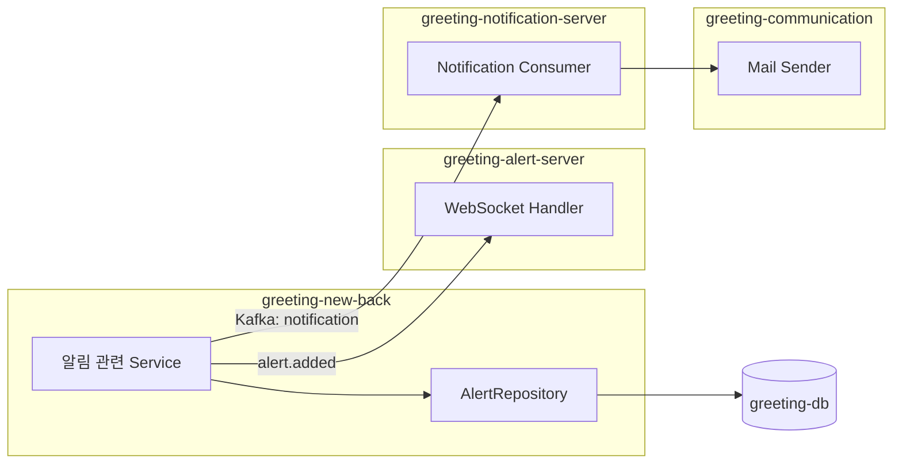
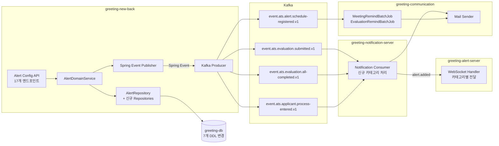
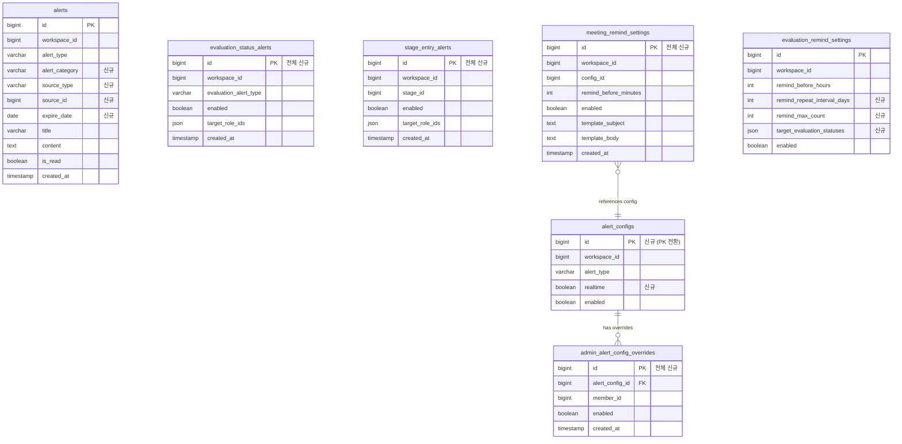
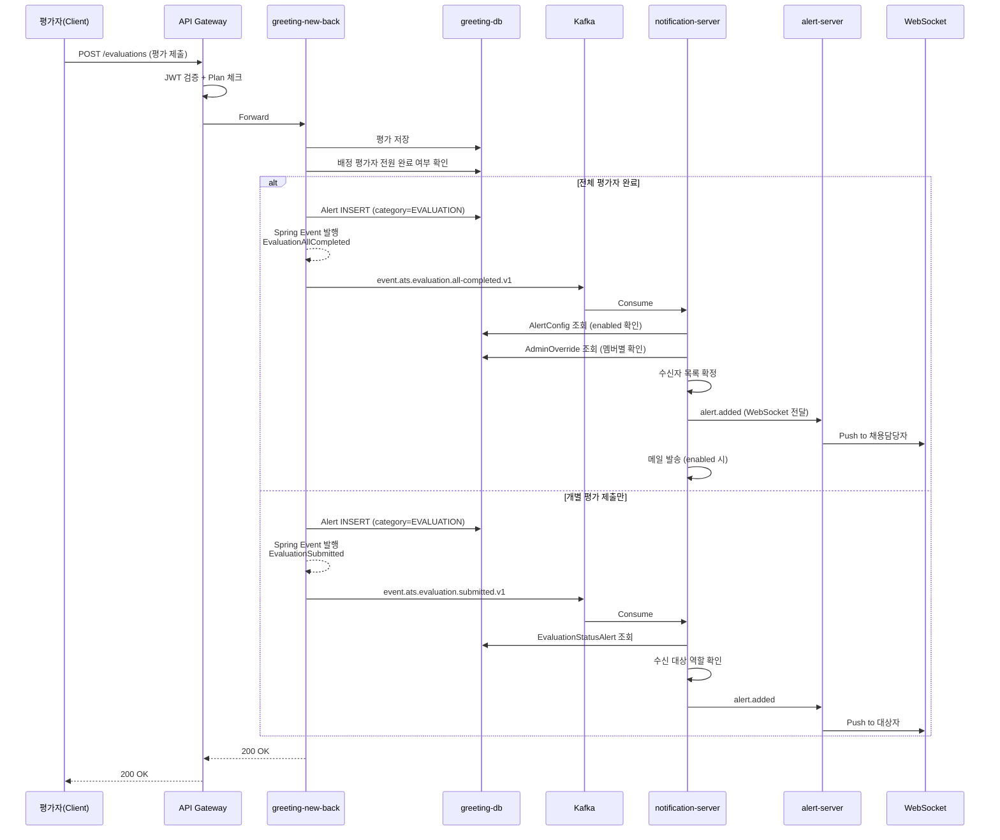
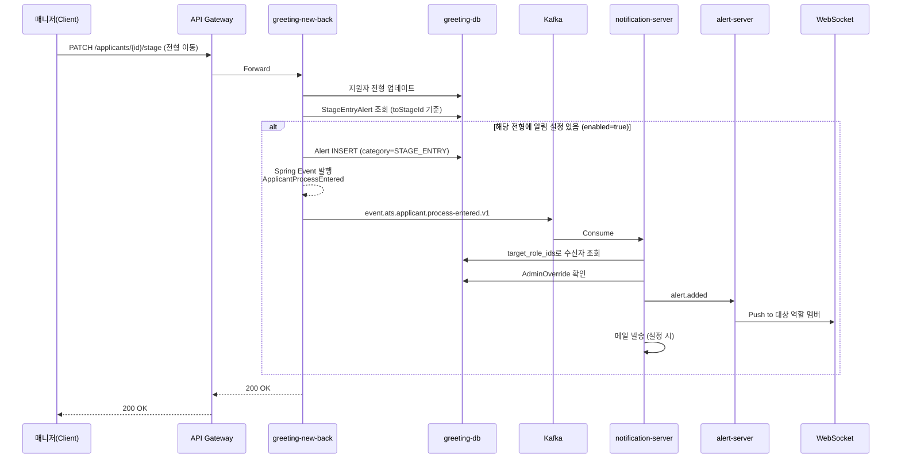
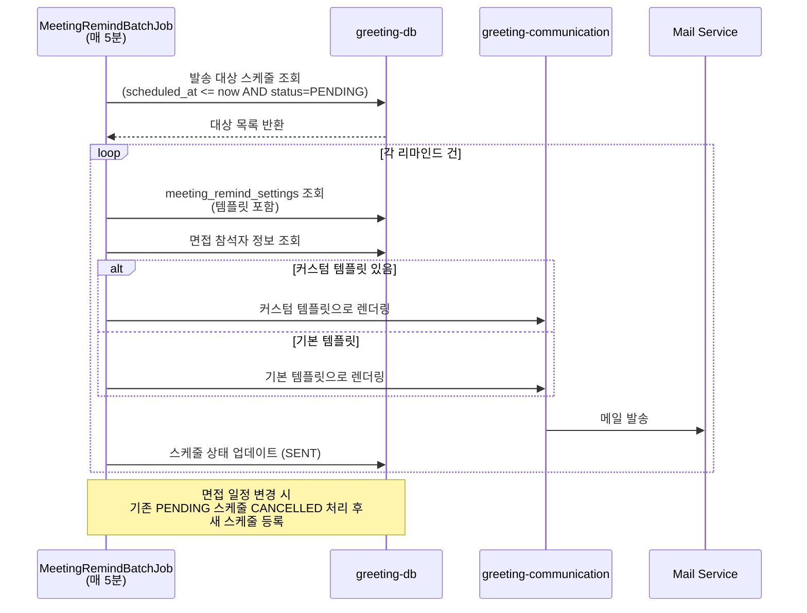
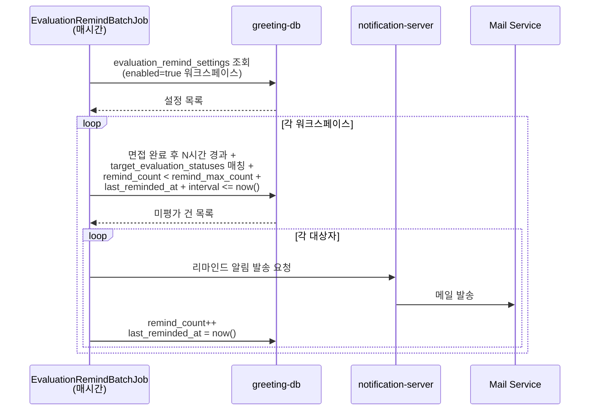
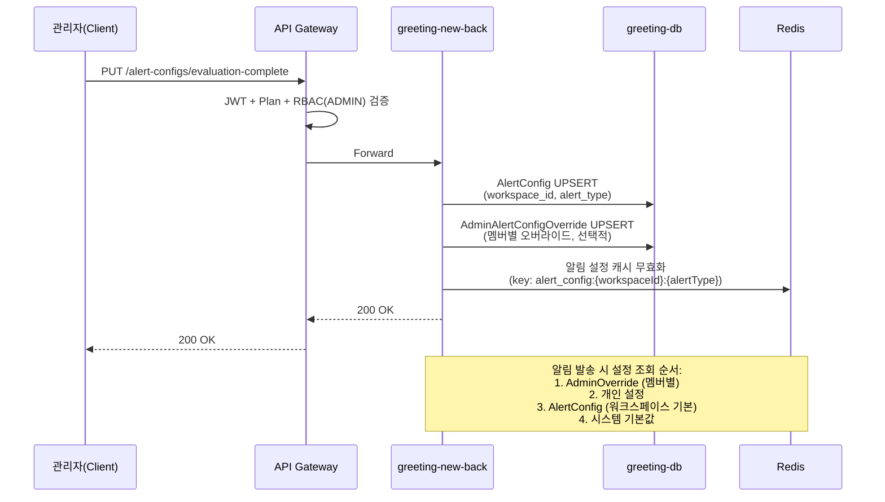
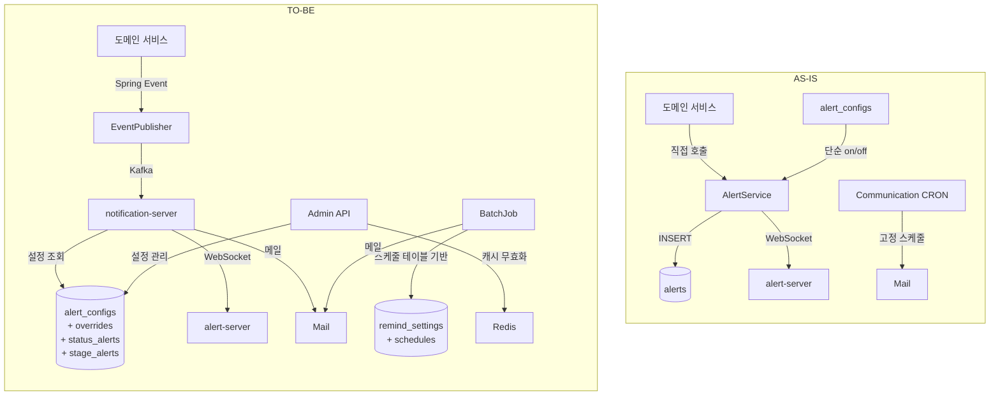
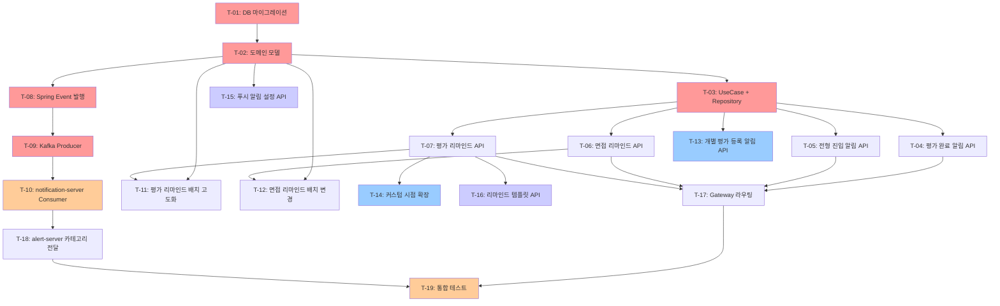

# [알림 고도화] 기술 설계 문서 (TDD)

> PRD: [2026-Q1] 자동화 1차 - 알림 고도화
> Confluence: https://doodlin.atlassian.net/wiki/x/SICjdg
> Author: 김미영 / PO
> TDD 작성일: 2026-03-16
> Gap 분석: [gap_analysis.md](./gap_analysis.md)

---

## 1. 개요

### 1.1 배경

현재 알림 시스템 한계:
- 인앱(WebSocket) + 이메일만 지원, 단순 on/off 수준
- 알림 유형별 세분화 설정 불가
- 스케줄 기반 리마인드, 템플릿 커스터마이징 미지원

고객 요구:
- 전체 평가자 평가 완료 시 채용 담당자 즉시 알림
- 특정 전형 진입 시 관련 담당자 자동 알림
- 면접/평가 리마인드 발송 시점·내용 커스터마이징
- 관리자가 멤버별 알림을 제어하는 설정 체계

### 1.2 목표

1. **알림 설정 세분화**: 알림 유형(평가 완료, 전형 진입, 면접 리마인드, 평가 리마인드)별 독립 설정 체계 구축
2. **리마인드 고도화**: 면접/평가 리마인드의 발송 시점 커스텀 및 반복 발송 지원
3. **템플릿 커스터마이징**: 리마인드 발송 내용을 워크스페이스별로 커스터마이징 가능
4. **관리자 제어**: 관리자가 멤버별 알림 설정을 덮어쓸 수 있는 오버라이드 체계
5. **이벤트 기반 아키텍처**: 도메인 이벤트 발행 -> 알림 서비스 구독 구조로 느슨한 결합 달성

### 1.3 범위

**In Scope**

- 전체 평가 완료 알림 설정/발송 (P0)
- 전형 진입 알림 설정/발송 (P0)
- 면접 리마인드 On/Off, 템플릿 저장 (P0)
- 평가 리마인드 설정/발송 고도화 (P0)
- 개별 평가 등록 알림 설정/발송 (P1)
- 리마인드 커스텀 시점 확장 (P1)
- 푸시 알림 설정 (P2)
- 평가 리마인드 템플릿 관리 (P2)
- 신규 Kafka 토픽 4개 추가
- Flyway DDL 마이그레이션 7개
- 관련 스케줄러/배치 고도화

**Out of Scope**

- 모바일 푸시 알림 (향후 별도 프로젝트)
- Slack/카카오톡 등 외부 채널 연동 (채널 추상화 인터페이스만 설계)
- 알림 발송 이력 대시보드 (모니터링 메트릭은 포함)
- 알림 digest(묶음 발송)
- 기존 알림 데이터 마이그레이션 (하위 호환으로 공존)

### 1.4 용어 정의

| 용어 | 정의 |
|------|------|
| AlertConfig | 알림 유형별 on/off 및 실시간 여부를 정의하는 설정 엔티티 |
| AdminAlertConfigOverride | 관리자가 특정 멤버의 AlertConfig를 덮어쓰는 설정 |
| EvaluationStatusAlert | 평가 상태 변경(개별 제출, 전체 완료) 시 알림 설정 |
| StageEntryAlert | 특정 전형 진입 시 알림 설정 |
| MeetingRemindSetting | 면접 리마인드 발송 시점/대상/템플릿 설정 |
| EvaluationRemindSetting | 평가 리마인드 발송 주기/반복/대상 설정 |
| RealTimeAlert | 이벤트 발생 즉시 WebSocket + 인앱으로 전달되는 알림 |

---

## 2. 현재 상태 (AS-IS)

### 2.1 아키텍처 다이어그램



### 2.2 주요 흐름

| 채널 | 흐름 |
|------|------|
| 인앱 알림 | 도메인 이벤트 발생 → `AlertService` → `alerts` INSERT → `greeting-alert-server` WebSocket |
| 메일 알림 | `greeting-communication` cron 폴링 → 면접 리마인드 발송 |
| 알림 설정 | `alert_configs` `(workspace_id, alert_type)` 복합키로 on/off만 관리 |

### 2.3 관련 데이터 모델 (현재)

| 테이블 | 주요 컬럼 | 용도 |
|--------|----------|------|
| alerts | id, workspace_id, alert_type, title, content, is_read, created_at | 인앱 알림 저장 |
| alert_configs | workspace_id, alert_type, enabled | 알림 유형별 on/off |
| evaluation_remind_settings | workspace_id, remind_before_hours, enabled | 평가 리마인드 기본 설정 |

**현재 한계:**

| 테이블/컴포넌트 | 문제 |
|----------------|------|
| `alert_configs` | PK 없음(복합 유니크만) → 관리자 오버라이드 참조 불가 |
| `alerts` | 카테고리·소스 추적 필드 없음 → 그룹핑/필터링 불가 |
| `greeting-communication` cron | 면접 리마인드 시점 하드코딩 → 커스텀 불가 |
| 평가 리마인드 | 반복 발송·최대 횟수 개념 없음 |

---

## 3. 제안 설계 (TO-BE)

### 3.1 아키텍처 다이어그램



### 3.2 주요 변경 사항

1. **AlertConfig PK 전환**: 복합키 -> surrogate PK(id)로 전환하여 오버라이드 참조 가능
2. **알림 카테고리 도입**: `alert_category` 필드로 알림 그룹핑 (EVALUATION, STAGE_ENTRY, MEETING, SYSTEM)
3. **이벤트 기반 알림 발행**: 도메인 이벤트 -> Spring Event -> Kafka 토픽으로 비동기 처리
4. **스케줄 기반 리마인드**: `meeting_remind_schedule` / `evaluation_remind_settings` 테이블 기반으로 스케줄 등록/취소/갱신
5. **관리자 오버라이드**: `admin_alert_config_overrides` 테이블로 멤버별 알림 설정 덮어쓰기

### 3.3 변경 데이터 모델



---

## 4. 상세 설계

### 4.1 API 스펙 요약

> Base Prefix: `/service/ats/api/v1.0`
> 상세 Request/Response 스펙은 별도 API 문서 참조

| 우선순위 | 기능 | Method | Path | 비고 |
|---------|------|--------|------|------|
| P0 | 전체 평가 완료 알림 조회 | GET | `/alert-configs/evaluation-complete` | 워크스페이스 단위 |
| P0 | 전체 평가 완료 알림 설정 | PUT | `/alert-configs/evaluation-complete` | enabled, realtime |
| P0 | 전형 진입 알림 조회 | GET | `/alert-configs/stage-entry` | 전형 목록 포함 |
| P0 | 전형 진입 알림 설정 | PUT | `/alert-configs/stage-entry` | stage별 on/off |
| P0 | 면접 리마인드 조회 | GET | `/meeting-alert-configs/{configId}` | 템플릿 포함 |
| P0 | 면접 리마인드 On/Off | PATCH | `/meeting-alert-configs/{configId}/targets` | 대상별 토글 |
| P0 | 면접 리마인드 템플릿 저장 | PUT | `/meeting-alert-configs/{configId}/template` | subject + body |
| P0 | 평가 리마인드 설정 조회 | GET | `/evaluation-remind-settings` | 반복 주기 포함 |
| P0 | 평가 리마인드 설정 저장 | PUT | `/evaluation-remind-settings` | interval, max_count |
| P1 | 개별 평가 등록 알림 조회 | GET | `/alert-configs/evaluation-submitted` | 수신자 역할 포함 |
| P1 | 개별 평가 등록 알림 설정 | PUT | `/alert-configs/evaluation-submitted` | enabled, target roles |
| P1 | 리마인드 커스텀 시점 | PUT | `/evaluation-remind-settings` (확장) | custom_remind_hours[] |
| P2 | 푸시 알림 설정 조회 | GET | `/users/me/push-notification-settings` | 사용자별 |
| P2 | 푸시 알림 설정 수정 | PATCH | `/users/me/push-notification-settings` | 카테고리별 on/off |
| P2 | 평가 리마인드 템플릿 조회 | GET | `/evaluation-remind-settings/template` | 변수 목록 포함 |
| P2 | 평가 리마인드 템플릿 저장 | PUT | `/evaluation-remind-settings/template` | subject + body |
| P2 | 평가 리마인드 템플릿 복원 | DELETE | `/evaluation-remind-settings/template` | 기본 템플릿으로 복원 |

**공통 인증/인가:**
- Gateway에서 JWT 검증 후 `X-Workspace-Id`, `X-User-Id` 헤더 전달
- Plan 체크: 알림 고도화 기능은 Pro 이상 플랜 필요 (Gateway Plan Filter)
- RBAC: 알림 설정 변경은 `ADMIN` / `MANAGER` 역할 필요, 개인 설정은 본인만

### 4.2 도메인 모델 변경

#### 4.2.1 기존 모델 확장

**Alert (alerts 테이블)**
| 필드 | 타입 | 변경 | 설명 |
|------|------|------|------|
| alert_category | VARCHAR(50) | 추가 | EVALUATION, STAGE_ENTRY, MEETING, SYSTEM |
| source_type | VARCHAR(50) | 추가 | APPLICANT, MEETING, EVALUATION |
| source_id | BIGINT | 추가 | 소스 엔티티의 ID |
| expire_date | DATE | 추가 | 알림 만료일 (NULL이면 무기한) |

**AlertConfig (alert_configs 테이블)**
| 필드 | 타입 | 변경 | 설명 |
|------|------|------|------|
| id | BIGINT AUTO_INCREMENT | PK 전환 | surrogate PK 추가 |
| realtime | BOOLEAN | 추가 | 실시간(WebSocket) 알림 여부 |

**EvaluationRemindSetting (evaluation_remind_settings 테이블)**
| 필드 | 타입 | 변경 | 설명 |
|------|------|------|------|
| remind_repeat_interval_days | INT | 추가 | 반복 발송 주기 (일 단위, NULL이면 1회성) |
| remind_max_count | INT | 추가 | 최대 발송 횟수 (기본값 3) |
| target_evaluation_statuses | JSON | 추가 | 리마인드 대상 평가 상태 목록 |

#### 4.2.2 신규 모델

**AdminAlertConfigOverride (admin_alert_config_overrides)**
```
- id: BIGINT (PK)
- alert_config_id: BIGINT (FK -> alert_configs.id)
- member_id: BIGINT (대상 멤버)
- enabled: BOOLEAN (관리자가 설정한 on/off)
- created_at: TIMESTAMP
- updated_at: TIMESTAMP
```

**EvaluationStatusAlert (evaluation_status_alerts)**
```
- id: BIGINT (PK)
- workspace_id: BIGINT
- evaluation_alert_type: ENUM('SUBMITTED', 'ALL_COMPLETED')
- enabled: BOOLEAN
- target_role_ids: JSON (알림 수신 역할 목록)
- created_at: TIMESTAMP
- updated_at: TIMESTAMP
```

**StageEntryAlert (stage_entry_alerts)**
```
- id: BIGINT (PK)
- workspace_id: BIGINT
- stage_id: BIGINT (대상 전형)
- enabled: BOOLEAN
- target_role_ids: JSON (알림 수신 역할 목록)
- created_at: TIMESTAMP
- updated_at: TIMESTAMP
```

**MeetingRemindSetting (meeting_remind_settings)**
```
- id: BIGINT (PK)
- workspace_id: BIGINT
- config_id: BIGINT (FK -> alert_configs.id)
- remind_before_minutes: INT (면접 N분 전)
- enabled: BOOLEAN
- template_subject: TEXT (커스텀 메일 제목)
- template_body: TEXT (커스텀 메일 본문)
- created_at: TIMESTAMP
- updated_at: TIMESTAMP
```

#### 4.2.3 알림 설정 우선순위 (Resolution Order)

```
1. AdminAlertConfigOverride (관리자가 해당 멤버에 대해 명시적으로 설정한 값)
2. 사용자 개인 설정 (push-notification-settings)
3. AlertConfig (워크스페이스 기본값)
4. 시스템 기본값 (enabled=true)
```

### 4.3 DB 스키마 변경 (Flyway DDL)

> 총 7개 마이그레이션 스크립트, 레포: `greeting-db-schema`

#### V2026031700: alerts 테이블 확장

```sql
ALTER TABLE alerts
    ADD COLUMN alert_category VARCHAR(50) NULL AFTER alert_type,
    ADD COLUMN source_type VARCHAR(50) NULL AFTER alert_category,
    ADD COLUMN source_id BIGINT NULL AFTER source_type,
    ADD COLUMN expire_date DATE NULL AFTER source_id;

CREATE INDEX idx_alerts_category ON alerts (workspace_id, alert_category, created_at);
CREATE INDEX idx_alerts_source ON alerts (source_type, source_id);
```

#### V2026031701: alert_configs PK 전환 + 필드 추가

```sql
-- 1. surrogate PK 추가
ALTER TABLE alert_configs
    ADD COLUMN id BIGINT NOT NULL AUTO_INCREMENT FIRST,
    ADD PRIMARY KEY (id);

-- 2. 기존 유니크 제약 유지
ALTER TABLE alert_configs
    ADD UNIQUE INDEX uq_alert_configs_ws_type (workspace_id, alert_type);

-- 3. 신규 필드
ALTER TABLE alert_configs
    ADD COLUMN realtime BOOLEAN NOT NULL DEFAULT FALSE AFTER enabled;
```

#### V2026031702: admin_alert_config_overrides 신규

```sql
CREATE TABLE admin_alert_config_overrides (
    id BIGINT NOT NULL AUTO_INCREMENT,
    alert_config_id BIGINT NOT NULL,
    member_id BIGINT NOT NULL,
    enabled BOOLEAN NOT NULL DEFAULT TRUE,
    created_at TIMESTAMP NOT NULL DEFAULT CURRENT_TIMESTAMP,
    updated_at TIMESTAMP NOT NULL DEFAULT CURRENT_TIMESTAMP ON UPDATE CURRENT_TIMESTAMP,
    PRIMARY KEY (id),
    UNIQUE INDEX uq_override_config_member (alert_config_id, member_id),
    INDEX idx_override_member (member_id),
    CONSTRAINT fk_override_alert_config FOREIGN KEY (alert_config_id) REFERENCES alert_configs (id)
) ENGINE=InnoDB DEFAULT CHARSET=utf8mb4;
```

#### V2026031703: evaluation_status_alerts 신규

```sql
CREATE TABLE evaluation_status_alerts (
    id BIGINT NOT NULL AUTO_INCREMENT,
    workspace_id BIGINT NOT NULL,
    evaluation_alert_type VARCHAR(30) NOT NULL COMMENT 'SUBMITTED | ALL_COMPLETED',
    enabled BOOLEAN NOT NULL DEFAULT TRUE,
    target_role_ids JSON NULL COMMENT '수신 대상 역할 ID 목록',
    created_at TIMESTAMP NOT NULL DEFAULT CURRENT_TIMESTAMP,
    updated_at TIMESTAMP NOT NULL DEFAULT CURRENT_TIMESTAMP ON UPDATE CURRENT_TIMESTAMP,
    PRIMARY KEY (id),
    UNIQUE INDEX uq_eval_alert_ws_type (workspace_id, evaluation_alert_type)
) ENGINE=InnoDB DEFAULT CHARSET=utf8mb4;
```

#### V2026031704: stage_entry_alerts 신규

```sql
CREATE TABLE stage_entry_alerts (
    id BIGINT NOT NULL AUTO_INCREMENT,
    workspace_id BIGINT NOT NULL,
    stage_id BIGINT NOT NULL,
    enabled BOOLEAN NOT NULL DEFAULT TRUE,
    target_role_ids JSON NULL COMMENT '수신 대상 역할 ID 목록',
    created_at TIMESTAMP NOT NULL DEFAULT CURRENT_TIMESTAMP,
    updated_at TIMESTAMP NOT NULL DEFAULT CURRENT_TIMESTAMP ON UPDATE CURRENT_TIMESTAMP,
    PRIMARY KEY (id),
    UNIQUE INDEX uq_stage_alert_ws_stage (workspace_id, stage_id),
    INDEX idx_stage_alert_stage (stage_id)
) ENGINE=InnoDB DEFAULT CHARSET=utf8mb4;
```

#### V2026031705: evaluation_remind_settings 확장

```sql
ALTER TABLE evaluation_remind_settings
    ADD COLUMN remind_repeat_interval_days INT NULL COMMENT '반복 발송 주기(일), NULL=1회성' AFTER remind_before_hours,
    ADD COLUMN remind_max_count INT NOT NULL DEFAULT 3 COMMENT '최대 발송 횟수' AFTER remind_repeat_interval_days,
    ADD COLUMN target_evaluation_statuses JSON NULL COMMENT '리마인드 대상 평가 상태' AFTER remind_max_count;
```

#### V2026031706: meeting_remind_settings 신규

```sql
CREATE TABLE meeting_remind_settings (
    id BIGINT NOT NULL AUTO_INCREMENT,
    workspace_id BIGINT NOT NULL,
    config_id BIGINT NULL COMMENT 'alert_configs.id 참조',
    remind_before_minutes INT NOT NULL DEFAULT 60 COMMENT '면접 N분 전',
    enabled BOOLEAN NOT NULL DEFAULT TRUE,
    template_subject TEXT NULL COMMENT '커스텀 메일 제목',
    template_body TEXT NULL COMMENT '커스텀 메일 본문',
    created_at TIMESTAMP NOT NULL DEFAULT CURRENT_TIMESTAMP,
    updated_at TIMESTAMP NOT NULL DEFAULT CURRENT_TIMESTAMP ON UPDATE CURRENT_TIMESTAMP,
    PRIMARY KEY (id),
    INDEX idx_meeting_remind_ws (workspace_id),
    CONSTRAINT fk_meeting_remind_config FOREIGN KEY (config_id) REFERENCES alert_configs (id)
) ENGINE=InnoDB DEFAULT CHARSET=utf8mb4;
```

**인덱스 전략 요약:**

| 테이블 | 인덱스 | 목적 |
|--------|--------|------|
| alerts | (workspace_id, alert_category, created_at) | 카테고리별 알림 목록 조회 |
| alerts | (source_type, source_id) | 소스별 알림 역추적 |
| admin_alert_config_overrides | (alert_config_id, member_id) UNIQUE | 오버라이드 조회, 중복 방지 |
| admin_alert_config_overrides | (member_id) | 멤버별 오버라이드 목록 |
| evaluation_status_alerts | (workspace_id, evaluation_alert_type) UNIQUE | 설정 조회 |
| stage_entry_alerts | (workspace_id, stage_id) UNIQUE | 설정 조회 |
| stage_entry_alerts | (stage_id) | 전형별 알림 조회 |
| meeting_remind_settings | (workspace_id) | 워크스페이스별 리마인드 조회 |

### 4.4 이벤트 설계

#### 4.4.1 Spring Events (도메인 내부)

| 이벤트 | 트리거 시점 | Payload |
|--------|-----------|---------|
| `RealTimeAlertSenderEvent.EvaluationSubmitted` | 개별 평가자가 평가를 제출했을 때 | workspaceId, applicantId, evaluatorUserId, evaluationId, stageName |
| `RealTimeAlertSenderEvent.EvaluationAllCompleted` | 해당 지원자의 모든 배정 평가자가 평가를 완료했을 때 | workspaceId, applicantId, applicantName, stageName, completedCount |
| `RealTimeAlertSenderEvent.ApplicantProcessEntered` | 지원자가 특정 전형으로 이동했을 때 | workspaceId, applicantId, applicantName, fromStageId, toStageId, toStageName |

**이벤트 발행 위치:**
- `EvaluationSubmitted`: `EvaluationService.submitEvaluation()` 내부, 평가 저장 트랜잭션 커밋 후 (`@TransactionalEventListener(phase = AFTER_COMMIT)`)
- `EvaluationAllCompleted`: `EvaluationService.submitEvaluation()` 내부, 완료 판정 로직 통과 시
- `ApplicantProcessEntered`: `ApplicantProcessService.moveToStage()` 내부, 전형 이동 트랜잭션 커밋 후

#### 4.4.2 Kafka Topics (서비스 간 비동기)

| 토픽 | 파티션 | 키 | 메시지 스키마 |
|------|--------|-----|-------------|
| `event.ats.evaluation.submitted.v1` | 6 | applicantId | `{ workspaceId, applicantId, evaluatorUserId, evaluationId, stageName, submittedAt }` |
| `event.ats.evaluation.all-completed.v1` | 6 | applicantId | `{ workspaceId, applicantId, applicantName, stageName, completedCount, completedAt }` |
| `event.ats.applicant.process-entered.v1` | 6 | applicantId | `{ workspaceId, applicantId, applicantName, fromStageId, toStageId, toStageName, enteredAt }` |
| `event.ats.alert.schedule-registered.v1` | 3 | scheduleId | `{ scheduleId, workspaceId, alertType, targetId, scheduledAt, templateId }` |

**Producer/Consumer 매핑:**

| 토픽 | Producer | Consumer |
|------|----------|----------|
| evaluation.submitted.v1 | greeting-new-back | greeting-notification-server |
| evaluation.all-completed.v1 | greeting-new-back | greeting-notification-server |
| applicant.process-entered.v1 | greeting-new-back | greeting-notification-server |
| alert.schedule-registered.v1 | greeting-new-back | greeting-communication |

**멱등성 전략:**
- 각 메시지에 `eventId` (UUID) 포함
- Consumer 측에서 `processed_events` 테이블로 중복 체크 (eventId 유니크)
- Kafka Consumer는 `enable.auto.commit=false`, 수동 오프셋 커밋

### 4.5 스케줄러/배치 설계

#### 4.5.1 EvaluationRemindBatchJob 고도화

| 항목 | AS-IS | TO-BE |
|------|-------|-------|
| 실행 주기 | 매시간 | 매시간 (유지) |
| 트리거 기준 | 면접 종료 후 고정 N시간 | 면접 완료 상태 변경 후 N시간 (커스텀 가능) |
| 반복 발송 | 미지원 | `remind_repeat_interval_days` 기반 반복, `remind_max_count`까지 |
| 추적 필드 | 없음 | `remind_count`, `last_reminded_at` 추가 |
| 대상 필터 | 전체 미평가자 | `target_evaluation_statuses` 기반 필터 |

**배치 로직:**
```
1. evaluation_remind_settings에서 enabled=true인 워크스페이스 조회
2. 각 워크스페이스별:
   a. 면접 완료 후 remind_before_hours 경과한 미평가 건 조회
   b. target_evaluation_statuses에 해당하는 건만 필터
   c. remind_count < remind_max_count인 건만 대상
   d. last_reminded_at + remind_repeat_interval_days <= now()인 건만 대상
   e. 대상자에게 리마인드 메일 발송
   f. remind_count++, last_reminded_at = now() 업데이트
```

#### 4.5.2 MeetingRemindBatchJob 변경

| 항목 | AS-IS | TO-BE |
|------|-------|-------|
| 실행 주기 | 매시간 | **매 5분** |
| 스케줄 소스 | 면접 일정 직접 조회 | `meeting_remind_settings` 테이블 기반 |
| 커스텀 시점 | 고정 1시간 전 | `remind_before_minutes` 설정 기반 |
| 템플릿 | 고정 | `template_subject`, `template_body` 커스텀 |

**스케줄 등록/취소/갱신 Cascade:**

```
면접 생성 -> meeting_remind_schedule 자동 등록
면접 일정 변경 -> 기존 스케줄 취소 + 새 스케줄 등록
면접 취소 -> meeting_remind_schedule 취소 (status=CANCELLED)
리마인드 설정 변경 -> 미발송 스케줄 일괄 갱신
```

### 4.6 시퀀스 다이어그램

#### 4.6.1 평가 완료 알림 흐름



#### 4.6.2 전형 진입 알림 흐름



#### 4.6.3 면접 리마인드 메일 흐름



#### 4.6.4 평가 리마인드 흐름



#### 4.6.5 관리자 알림 설정 흐름



#### 4.6.6 AS-IS vs TO-BE 아키텍처 비교



---

## 5. 영향 범위

### 5.1 수정 대상 서비스/모듈

| 레포 | 영향 내용 | 변경 규모 |
|------|----------|----------|
| **greeting-new-back** | 알림 도메인 모델 확장, 신규 API 17개, 평가/전형 서비스에 이벤트 발행 추가 | L |
| **greeting-communication** | 면접/평가 리마인드 배치 고도화, 템플릿 엔진 확장 | M |
| **doodlin-communication** | 템플릿 렌더링 엔진에 커스텀 변수 바인딩 지원 추가 | S |
| **greeting-db-schema** | 7개 Flyway 마이그레이션 스크립트 | M |
| **greeting-topic** | 4개 Kafka 토픽 정의 추가 | S |
| **greeting-api-gateway** | 신규 알림 API 라우팅 규칙 추가, Plan 체크 필터 | S |
| **greeting-notification-server** | 신규 alert.added 메시지 처리, 카테고리별 수신자 라우팅 | M |
| **greeting-alert-server** | 신규 알림 카테고리(EVALUATION, STAGE_ENTRY) WebSocket 전달 | S |

### 5.2 API 하위 호환성

| 변경 | 하위 호환 여부 | 이유 |
|------|--------------|------|
| `alert_configs` PK 전환 | 유지 | 기존 API는 `(workspace_id, alert_type)` 기반 조회 유지 |
| `alerts` 테이블 컬럼 추가 | 유지 | 신규 컬럼 전부 NULL 허용 |
| 기존 알림 조회 API | 유지 | `alert_category` 필터 없으면 전체 반환 |
| 신규 API 17개 | 해당 없음 | 전부 신규 경로 |

### 5.3 데이터 마이그레이션

- 별도 마이그레이션 스크립트 불필요 — DDL만으로 충분
- `alerts` 기존 레코드: `alert_category`, `source_type`, `source_id` → NULL 유지 (백필 불필요)
- `alert_configs` 기존 레코드: `id` 컬럼 AUTO_INCREMENT로 자동 부여
- `evaluation_remind_settings` 기존 레코드: 신규 컬럼 기본값 적용 (`remind_max_count=3`)

---

## 6. 리스크 & 대안

| # | 리스크 | 영향도 | 발생 가능성 | 대안 |
|---|--------|--------|-----------|------|
| R-1 | 전체 평가 완료 판정 시 Race Condition (복수 평가자 동시 제출) | 높음 | 중간 | 분산 락(Redisson) 또는 DB 비관적 락으로 원자적 완료 판정. SELECT FOR UPDATE 적용 |
| R-2 | alert_configs PK 전환 시 기존 FK 참조 깨짐 | 높음 | 낮음 | 현재 FK 참조 없음 확인 완료. DDL 실행 전 greeting-db-schema 전수 검사 |
| R-3 | 면접 일정 변경 시 리마인드 스케줄 동기화 실패 | 중간 | 중간 | cascade 취소를 트랜잭션 내에서 처리. 실패 시 DLQ + 수동 복구 프로세스 |
| R-4 | 대량 알림 동시 트리거 (예: 100명 지원자 일괄 전형 이동) | 중간 | 중간 | Kafka 기반 비동기 처리로 back-pressure 흡수. Consumer concurrency 조절 |
| R-5 | 스케줄러 서버 장애 시 리마인드 누락 | 중간 | 낮음 | 스케줄 테이블의 status로 미발송 건 추적. 서버 복구 시 자동 소급 발송 |
| R-6 | 템플릿 변수 바인딩 실패 (존재하지 않는 변수 참조) | 낮음 | 중간 | 저장 시 변수 유효성 검증. 발송 시 fallback 텍스트 처리 |
| R-7 | 그룹핑 전형(25%)에서 전형 진입 알림 동작 불명확 | 중간 | 높음 | Gap 분석 Q-7 의사결정 필요. 기본 전략: 실제 전형(leaf)만 대상, 그룹핑 전형은 무시 |
| R-8 | 알림 설정 캐시 정합성 (변경 후 캐시 무효화 실패) | 낮음 | 낮음 | 캐시 TTL 5분 설정으로 최대 5분 이내 반영 보장. 변경 시 즉시 evict 시도 |

**미결 의사결정 사항 (Gap 분석 참조):**
- Q-1: "전체 평가자 평가 완료"의 정확한 완료 조건 -> 현재 코드 기준 `assignedEvaluatorUserIds` 전부 포함 시 COMPLETE으로 구현 예정
- Q-3: 알림 설정 granularity -> 워크스페이스 단위 기본, 전형 단위는 StageEntryAlert로 분리
- Q-8: 1차 스코프 채널 -> 인앱(WebSocket) + 이메일, Slack은 기존 유지

---

## 7. 구현 계획

### 7.1 티켓 분할 요약

| # | 티켓 | 레이어 | 우선순위 | 의존성 | 예상 크기 |
|---|------|--------|---------|--------|----------|
| T-01 | DB 마이그레이션 (V2026031700~V2026031706) | Infrastructure | P0 | - | M |
| T-02 | 도메인 모델 정의 (Alert, AlertConfig 확장 + 4개 신규 엔티티) | Domain | P0 | T-01 | M |
| T-03 | AlertConfig CRUD UseCase + Repository | Service | P0 | T-02 | M |
| T-04 | 평가 완료 알림 API (GET/PUT evaluation-complete) | API | P0 | T-03 | S |
| T-05 | 전형 진입 알림 API (GET/PUT stage-entry) | API | P0 | T-03 | S |
| T-06 | 면접 리마인드 API (GET/PATCH/PUT meeting-alert-configs) | API | P0 | T-03 | M |
| T-07 | 평가 리마인드 설정 API (GET/PUT evaluation-remind-settings) | API | P0 | T-03 | S |
| T-08 | Spring Event 발행 (3개 이벤트) | Domain/Service | P0 | T-02 | M |
| T-09 | Kafka 토픽 정의 + Producer 구현 (4개 토픽) | Infrastructure | P0 | T-08 | M |
| T-10 | notification-server Consumer 구현 (3개 토픽) | Infrastructure | P0 | T-09 | L |
| T-11 | EvaluationRemindBatchJob 고도화 | Batch | P0 | T-02, T-07 | M |
| T-12 | MeetingRemindBatchJob 변경 (5분 주기 + 스케줄 테이블) | Batch | P0 | T-02, T-06 | M |
| T-13 | 개별 평가 등록 알림 API (GET/PUT evaluation-submitted) | API | P1 | T-03 | S |
| T-14 | 리마인드 커스텀 시점 확장 | Service | P1 | T-07 | S |
| T-15 | 푸시 알림 설정 API (GET/PATCH users/me/push-notification-settings) | API | P2 | T-02 | S |
| T-16 | 평가 리마인드 템플릿 API (GET/PUT/DELETE template) | API | P2 | T-07 | S |
| T-17 | API Gateway 라우팅 + Plan 체크 설정 | Infrastructure | P0 | T-04~T-07 | S |
| T-18 | alert-server 신규 카테고리 WebSocket 전달 | Infrastructure | P0 | T-10 | S |
| T-19 | 통합 테스트 (주요 플로우 6개) | Test | P0 | T-01~T-18 | L |

### 7.2 예상 구현 순서



**색상 범례:** 빨강=P0 핵심, 주황=P0 인프라, 파랑=P1, 보라=P2

### 7.3 예상 일정

| 주차 | 작업 | 산출물 |
|------|------|--------|
| Week 1 | T-01 ~ T-03 (DB + 도메인 + UseCase) | 마이그레이션 적용, 도메인 모델 구현 |
| Week 2 | T-04 ~ T-07 (P0 API 4종) + T-17 (Gateway) | API 엔드포인트 배포 가능 |
| Week 3 | T-08 ~ T-10 (이벤트/Kafka) + T-18 (alert-server) | 실시간 알림 파이프라인 완성 |
| Week 4 | T-11 ~ T-12 (배치) + T-13 ~ T-14 (P1) | 리마인드 고도화 완료 |
| Week 5 | T-15 ~ T-16 (P2) + T-19 (통합 테스트) | 전체 기능 완성 + QA 시작 |
