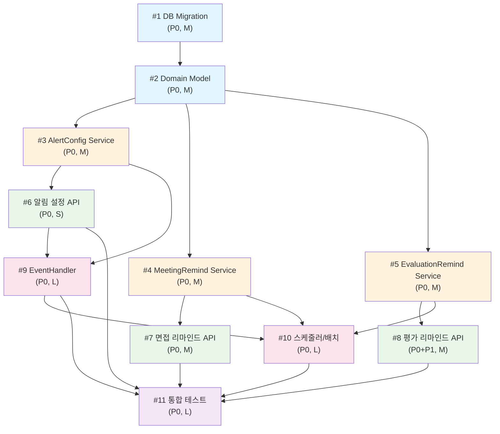

# 구현 티켓 요약 - 알림 고도화

## PRD 참조
- PRD: https://doodlin.atlassian.net/wiki/x/SICjdg
- Gap 분석: [gap_analysis.md](../gap_analysis.md)
- 분석일: 2026-03-16

## 티켓 목록

| # | 티켓 ID | 제목 | 레이어 | 우선순위 | 의존성 | 예상 크기 |
|---|---------|------|--------|---------|--------|----------|
| 1 | GRT-0001 | DB Migration (스키마 변경) | Infra/DB | P0 | - | M |
| 2 | GRT-0002 | Domain Model 신규/수정 | Domain | P0 | #1 | M |
| 3 | GRT-0003 | AlertConfig Service 구현 | Service | P0 | #2 | M |
| 4 | GRT-0004 | MeetingRemind Service 구현 | Service | P0 | #2 | M |
| 5 | GRT-0005 | EvaluationRemind Service 구현 | Service | P0 | #2 | M |
| 6 | GRT-0006 | 알림 설정 API 구현 | API | P0 | #3 | S |
| 7 | GRT-0007 | 면접 리마인드 API 구현 | API | P0 | #4 | M |
| 8 | GRT-0008 | 평가 리마인드 API 구현 | API | P0+P1 | #5 | M |
| 9 | GRT-0009 | 신규 EventHandler 구현 | Event | P0 | #3, #6 | L |
| 10 | GRT-0010 | 리마인드 스케줄러/배치 구현 | Worker | P0 | #4, #5, #9 | L |
| 11 | GRT-0011 | 통합 테스트 | Test | P0 | #6~#10 | L |

## 의존 관계도

## 배포 순서

### Phase 1: 기반 (Week 1)
1. **GRT-0001** DB Migration - 신규 테이블 및 컬럼 추가
2. **GRT-0002** Domain Model - Entity, Value Object, Enum 정의

### Phase 2: Service 레이어 (Week 1~2)
3. **GRT-0003** AlertConfig Service — 알림 설정 조회/변경
4. **GRT-0004** MeetingRemind Service — 면접 리마인드 설정
5. **GRT-0005** EvaluationRemind Service — 평가 리마인드 설정

> 3, 4, 5 병렬 가능

### Phase 3: API 레이어 (Week 2)
6. **GRT-0006** 알림 설정 API — Controller, DTO, Gateway 라우팅
7. **GRT-0007** 면접 리마인드 API — Controller, DTO, Gateway 라우팅
8. **GRT-0008** 평가 리마인드 API — Controller, DTO, Gateway 라우팅

> 6, 7, 8 병렬 가능

### Phase 4: 이벤트/배치 (Week 2~3)
9. **GRT-0009** EventHandler - 3개 이벤트 x 3채널 핸들러, Kafka Producer
10. **GRT-0010** 스케줄러/배치 - 배치잡 고도화, cascade 로직, 멱등성

### Phase 5: 검증 (Week 3)
11. **GRT-0011** 통합 테스트 - E2E 시나리오, Kafka 연동 테스트

## 예상 크기

| 크기 | 기준 | 티켓 |
|------|------|------|
| S (Small) | 1~2일, 파일 5개 이하 | #6 |
| M (Medium) | 2~4일, 파일 5~15개 | #1, #2, #3, #4, #5, #7, #8 |
| L (Large) | 4~7일, 파일 15개 이상 | #9, #10, #11 |

**전체 예상 공수**: 약 3주 (1명 기준), 2명 병렬 시 약 2주

## 레이어별 분류

| 레이어 | 티켓 | 주요 레포 |
|--------|------|----------|
| Infra/DB | #1 | greeting-db-schema |
| Domain | #2 | greeting-new-back (business/domain) |
| Service | #3, #4, #5 | greeting-new-back (business/application) |
| API | #6, #7, #8 | greeting-new-back (presentation), greeting-api-gateway |
| Event/Worker | #9, #10 | greeting-new-back (adaptor/kafka, business/application/batch) |
| Test | #11 | greeting-new-back (test) |

## 리스크 요약

| 리스크 | 관련 티켓 | 대응 |
|--------|----------|------|
| 전체 평가 완료 Race Condition | #9 | 분산 락 또는 원자적 카운트 비교 |
| 배치 중복 실행 | #10 | ShedLock + consumed_events 멱등성 |
| Kafka 메시지 유실 | #9, #10 | acks=all, 재시도 3회, DLQ |
| 대량 알림 폭주 | #9 | Rate Limit / Throttling (후속 개선) |
| 기존 배치잡 마이그레이션 | #10 | Blue-Green 배포, 기존 스케줄 데이터 변환 |
