# [GRT-1001] DB 마이그레이션 - 알림 고도화 스키마 확장 (7개 Flyway DDL)

## 개요
- PRD: https://doodlin.atlassian.net/wiki/x/SICjdg
- TDD 섹션: 데이터 모델 / DB 스키마
- 선행 티켓: 없음 (인프라 기반 티켓)

## 작업 내용

7개 Flyway 마이그레이션 스크립트 작성 — 평가 상태 알림, 전형 진입 알림, 면접 리마인드 설정 등 신규 알림 유형 지원을 위한 스키마 확장.

### V2026031700 - Alerts 테이블 확장

- `alert_category`, `source_type`, `source_ref_id` 컬럼 추가
- 알림 출처(평가/전형/면접 등) 추적 가능하도록 `alert_type` 세분화

```sql
-- V2026031700__alter_alerts_add_category_and_source.sql
ALTER TABLE `Alerts`
    ADD COLUMN `alert_category` VARCHAR(50) NULL DEFAULT NULL COMMENT '알림 카테고리 (EVALUATION, STAGE_ENTRY, MEETING_REMIND, SYSTEM)' AFTER `alert_type`,
    ADD COLUMN `source_type` VARCHAR(50) NULL DEFAULT NULL COMMENT '알림 소스 타입 (EVALUATION_SUBMITTED, EVALUATION_ALL_COMPLETED, STAGE_ENTERED, MEETING_REMIND)' AFTER `alert_category`,
    ADD COLUMN `source_ref_id` VARCHAR(100) NULL DEFAULT NULL COMMENT '소스 참조 ID (evaluation_id, process_id 등)' AFTER `source_type`;

ALTER TABLE `Alerts`
    ADD INDEX `idx_alerts_category` (`alert_category`),
    ADD INDEX `idx_alerts_source` (`source_type`, `source_ref_id`);
```

### V2026031701 - AlertConfigs PK 전환 (복합키 → 서로게이트 키)

- 복합 PK `(user_id, alert_function)` → 서로게이트 키(AUTO_INCREMENT `id`) 전환
- 기존 복합키는 UNIQUE 제약으로 유지

```sql
-- V2026031701__alter_alert_configs_pk_migration.sql
-- 1) 기존 PK 제거
ALTER TABLE `AlertConfigs` DROP PRIMARY KEY;

-- 2) 서로게이트 키 추가
ALTER TABLE `AlertConfigs`
    ADD COLUMN `id` BIGINT NOT NULL AUTO_INCREMENT FIRST,
    ADD PRIMARY KEY (`id`);

-- 3) 기존 복합키를 UNIQUE로 전환
ALTER TABLE `AlertConfigs`
    ADD UNIQUE INDEX `uq_alert_configs_user_function` (`user_id`, `alert_function`);

-- 4) 인앱 푸시 채널 컬럼 추가
ALTER TABLE `AlertConfigs`
    ADD COLUMN `in_app` BOOLEAN NULL DEFAULT TRUE COMMENT '인앱 알림 활성화 여부' AFTER `mail`;
```

### V2026031702 - AdminAlertConfigOverrides 신규 테이블

관리자가 워크스페이스/공고 레벨에서 멤버 알림 기본값을 강제 On/Off 또는 기본값으로 설정하는 오버라이드 테이블 생성.

```sql
-- V2026031702__create_admin_alert_config_overrides.sql
CREATE TABLE `AdminAlertConfigOverrides` (
    `id` BIGINT NOT NULL AUTO_INCREMENT,
    `workspace_id` INT(11) NOT NULL COMMENT '워크스페이스 ID',
    `opening_id` INT(11) NULL DEFAULT NULL COMMENT '공고 ID (NULL이면 워크스페이스 전역)',
    `alert_function` VARCHAR(50) NOT NULL COMMENT '알림 기능 (AlertFunctions enum)',
    `slack` BOOLEAN NULL DEFAULT NULL COMMENT 'Slack 알림 기본값',
    `mail` BOOLEAN NULL DEFAULT NULL COMMENT '메일 알림 기본값',
    `in_app` BOOLEAN NULL DEFAULT NULL COMMENT '인앱 알림 기본값',
    `force_override` BOOLEAN NOT NULL DEFAULT FALSE COMMENT '강제 오버라이드 여부 (true: 멤버 변경 불가)',
    `created_by` INT(11) NOT NULL COMMENT '설정한 관리자 user_id',
    `create_date` DATETIME NOT NULL DEFAULT CURRENT_TIMESTAMP,
    `update_date` DATETIME NOT NULL DEFAULT CURRENT_TIMESTAMP ON UPDATE CURRENT_TIMESTAMP,
    PRIMARY KEY (`id`),
    UNIQUE INDEX `uq_admin_override` (`workspace_id`, `opening_id`, `alert_function`),
    INDEX `idx_admin_override_workspace` (`workspace_id`)
) ENGINE=InnoDB DEFAULT CHARSET=utf8mb4 COLLATE=utf8mb4_unicode_ci
  COMMENT='관리자 알림 설정 오버라이드';
```

### V2026031703 - EvaluationStatusAlerts 신규 테이블

개별 평가 제출 / 전체 평가 완료 알림의 구독·채널 설정 저장 테이블.

```sql
-- V2026031703__create_evaluation_status_alerts.sql
CREATE TABLE `EvaluationStatusAlerts` (
    `id` BIGINT NOT NULL AUTO_INCREMENT,
    `workspace_id` INT(11) NOT NULL,
    `opening_id` INT(11) NOT NULL COMMENT '공고 ID',
    `process_id` INT(11) NOT NULL COMMENT '전형(프로세스) ID',
    `alert_type` VARCHAR(50) NOT NULL COMMENT 'EVALUATION_SUBMITTED | EVALUATION_ALL_COMPLETED',
    `subscriber_user_id` INT(11) NOT NULL COMMENT '알림 수신자 user_id',
    `enabled` BOOLEAN NOT NULL DEFAULT TRUE,
    `slack_enabled` BOOLEAN NOT NULL DEFAULT TRUE,
    `mail_enabled` BOOLEAN NOT NULL DEFAULT TRUE,
    `in_app_enabled` BOOLEAN NOT NULL DEFAULT TRUE,
    `create_date` DATETIME NOT NULL DEFAULT CURRENT_TIMESTAMP,
    `update_date` DATETIME NOT NULL DEFAULT CURRENT_TIMESTAMP ON UPDATE CURRENT_TIMESTAMP,
    PRIMARY KEY (`id`),
    UNIQUE INDEX `uq_eval_alert_subscriber` (`opening_id`, `process_id`, `alert_type`, `subscriber_user_id`),
    INDEX `idx_eval_alert_process` (`process_id`, `alert_type`),
    INDEX `idx_eval_alert_subscriber` (`subscriber_user_id`)
) ENGINE=InnoDB DEFAULT CHARSET=utf8mb4 COLLATE=utf8mb4_unicode_ci
  COMMENT='평가 상태별 알림 구독 설정';
```

### V2026031704 - StageEntryAlerts 신규 테이블

전형 진입 시 알림을 수신할 구독자 목록 및 채널 설정 저장 테이블.

```sql
-- V2026031704__create_stage_entry_alerts.sql
CREATE TABLE `StageEntryAlerts` (
    `id` BIGINT NOT NULL AUTO_INCREMENT,
    `workspace_id` INT(11) NOT NULL,
    `opening_id` INT(11) NOT NULL COMMENT '공고 ID',
    `process_id` INT(11) NOT NULL COMMENT '구독 대상 전형(프로세스) ID',
    `subscriber_user_id` INT(11) NOT NULL COMMENT '알림 수신자 user_id',
    `enabled` BOOLEAN NOT NULL DEFAULT TRUE,
    `slack_enabled` BOOLEAN NOT NULL DEFAULT TRUE,
    `mail_enabled` BOOLEAN NOT NULL DEFAULT TRUE,
    `in_app_enabled` BOOLEAN NOT NULL DEFAULT TRUE,
    `create_date` DATETIME NOT NULL DEFAULT CURRENT_TIMESTAMP,
    `update_date` DATETIME NOT NULL DEFAULT CURRENT_TIMESTAMP ON UPDATE CURRENT_TIMESTAMP,
    PRIMARY KEY (`id`),
    UNIQUE INDEX `uq_stage_entry_subscriber` (`opening_id`, `process_id`, `subscriber_user_id`),
    INDEX `idx_stage_entry_process` (`process_id`),
    INDEX `idx_stage_entry_subscriber` (`subscriber_user_id`)
) ENGINE=InnoDB DEFAULT CHARSET=utf8mb4 COLLATE=utf8mb4_unicode_ci
  COMMENT='전형 진입 알림 구독 설정';
```

### V2026031705 - EvaluationRemindSettings 확장

기존 `EvaluationRemindSettings` 테이블에 알림 채널 설정(`slack_enabled`, `mail_enabled`, `in_app_enabled`)과 반복 발송 컬럼(`repeat_enabled`, `repeat_interval_days`) 추가.

```sql
-- V2026031705__alter_evaluation_remind_settings_extend.sql
ALTER TABLE `EvaluationRemindSettings`
    ADD COLUMN `slack_enabled` BOOLEAN NOT NULL DEFAULT TRUE COMMENT 'Slack 채널 발송 여부' AFTER `remind_time`,
    ADD COLUMN `mail_enabled` BOOLEAN NOT NULL DEFAULT TRUE COMMENT '메일 채널 발송 여부' AFTER `slack_enabled`,
    ADD COLUMN `in_app_enabled` BOOLEAN NOT NULL DEFAULT TRUE COMMENT '인앱 채널 발송 여부' AFTER `mail_enabled`,
    ADD COLUMN `repeat_enabled` BOOLEAN NOT NULL DEFAULT FALSE COMMENT '반복 발송 여부' AFTER `in_app_enabled`,
    ADD COLUMN `repeat_interval_days` INT(11) NULL DEFAULT NULL COMMENT '반복 간격(일)' AFTER `repeat_enabled`;
```

### V2026031706 - MeetingRemindSettings 신규 테이블

면접 전/후 리마인드 시점(`BEFORE_MEETING`, `AFTER_MEETING`), 대상, 채널 설정 저장 테이블.

```sql
-- V2026031706__create_meeting_remind_settings.sql
CREATE TABLE `MeetingRemindSettings` (
    `id` BIGINT NOT NULL AUTO_INCREMENT,
    `workspace_id` INT(11) NOT NULL,
    `opening_id` INT(11) NOT NULL COMMENT '공고 ID',
    `process_id` INT(11) NOT NULL COMMENT '전형(프로세스) ID',
    `remind_target` VARCHAR(50) NOT NULL COMMENT '리마인드 대상 (EVALUATOR, INTERVIEWER, RECRUITER)',
    `remind_trigger` VARCHAR(50) NOT NULL COMMENT '트리거 (BEFORE_MEETING, AFTER_MEETING)',
    `remind_offset_hours` INT(11) NOT NULL DEFAULT 0 COMMENT '트리거 기준 오프셋(시간)',
    `remind_offset_days` INT(11) NOT NULL DEFAULT 0 COMMENT '트리거 기준 오프셋(일)',
    `remind_time` VARCHAR(5) NULL DEFAULT NULL COMMENT '발송 시각 (HH:mm, offset_days > 0일 때 사용)',
    `enabled` BOOLEAN NOT NULL DEFAULT TRUE,
    `slack_enabled` BOOLEAN NOT NULL DEFAULT TRUE,
    `mail_enabled` BOOLEAN NOT NULL DEFAULT TRUE,
    `in_app_enabled` BOOLEAN NOT NULL DEFAULT TRUE,
    `create_date` DATETIME NOT NULL DEFAULT CURRENT_TIMESTAMP,
    `update_date` DATETIME NOT NULL DEFAULT CURRENT_TIMESTAMP ON UPDATE CURRENT_TIMESTAMP,
    PRIMARY KEY (`id`),
    UNIQUE INDEX `uq_meeting_remind` (`opening_id`, `process_id`, `remind_target`, `remind_trigger`),
    INDEX `idx_meeting_remind_process` (`process_id`)
) ENGINE=InnoDB DEFAULT CHARSET=utf8mb4 COLLATE=utf8mb4_unicode_ci
  COMMENT='면접 리마인드 알림 설정';
```

### 다이어그램

```mermaid
erDiagram
    Alerts {
        int id PK
        int user_id
        int group_id
        string image_url
        text data
        string url
        string alert_type
        string alert_category "NEW"
        string source_type "NEW"
        string source_ref_id "NEW"
        boolean read
        datetime create_date
        datetime update_date
    }

    AlertConfigs {
        bigint id PK "NEW (서로게이트)"
        int user_id
        string alert_function
        boolean slack
        boolean mail
        boolean in_app "NEW"
        datetime create_date
        datetime update_date
    }

    AdminAlertConfigOverrides {
        bigint id PK
        int workspace_id
        int opening_id
        string alert_function
        boolean slack
        boolean mail
        boolean in_app
        boolean force_override
        int created_by
        datetime create_date
        datetime update_date
    }

    EvaluationStatusAlerts {
        bigint id PK
        int workspace_id
        int opening_id
        int process_id
        string alert_type
        int subscriber_user_id
        boolean enabled
        boolean slack_enabled
        boolean mail_enabled
        boolean in_app_enabled
    }

    StageEntryAlerts {
        bigint id PK
        int workspace_id
        int opening_id
        int process_id
        int subscriber_user_id
        boolean enabled
        boolean slack_enabled
        boolean mail_enabled
        boolean in_app_enabled
    }

    EvaluationRemindSettings {
        bigint id PK
        int workspace_id
        int opening_id
        int process_on_opening_id
        boolean enable_remind
        int remind_after_n_days
        string remind_time
        boolean slack_enabled "NEW"
        boolean mail_enabled "NEW"
        boolean in_app_enabled "NEW"
        boolean repeat_enabled "NEW"
        int repeat_interval_days "NEW"
    }

    MeetingRemindSettings {
        bigint id PK
        int workspace_id
        int opening_id
        int process_id
        string remind_target
        string remind_trigger
        int remind_offset_hours
        int remind_offset_days
        string remind_time
        boolean enabled
        boolean slack_enabled
        boolean mail_enabled
        boolean in_app_enabled
    }
```



### 수정 파일 목록

| 레포 | 모듈 | 파일 경로 | 변경 유형 |
|------|------|----------|----------|
| greeting-ats | resources/db/migration | `V2026031700__alter_alerts_add_category_and_source.sql` | 신규 |
| greeting-ats | resources/db/migration | `V2026031701__alter_alert_configs_pk_migration.sql` | 신규 |
| greeting-ats | resources/db/migration | `V2026031702__create_admin_alert_config_overrides.sql` | 신규 |
| greeting-ats | resources/db/migration | `V2026031703__create_evaluation_status_alerts.sql` | 신규 |
| greeting-ats | resources/db/migration | `V2026031704__create_stage_entry_alerts.sql` | 신규 |
| greeting-ats | resources/db/migration | `V2026031705__alter_evaluation_remind_settings_extend.sql` | 신규 |
| greeting-ats | resources/db/migration | `V2026031706__create_meeting_remind_settings.sql` | 신규 |

## 영향 범위

| 레포 | 영향 내용 | 처리 티켓 |
|------|----------|----------|
| greeting-new-back | `AlertConfigsPK` 복합키 클래스 및 `@IdClass` 제거 | ticket_03 |
| greeting_authn-server | `AlertConfigs`/`AlertConfigsPK` 엔티티 동일 영향 | ticket_03 |
| greeting-ats | `EvaluationRemindSettingEntity` 신규 컬럼 매핑 | ticket_03 |
| doodlin-communication | `EvaluationRemindSetting` 도메인 모델 신규 필드 반영 | ticket_03 |

## 테스트 케이스

| ID | 테스트명 | Given | When | Then |
|----|---------|-------|------|------|
| T01-01 | V2026031700 정방향 마이그레이션 | 기존 Alerts 테이블 존재 | DDL 실행 | alert_category, source_type, source_ref_id 컬럼 추가됨, 인덱스 생성됨 |
| T01-02 | V2026031701 AlertConfigs PK 전환 | 기존 복합 PK 데이터 존재 | DDL 실행 | 서로게이트 id PK 생성, 기존 데이터 보존, UNIQUE 제약조건 동작 |
| T01-03 | V2026031701 기존 데이터 정합성 | 기존 AlertConfigs 레코드 100건 | PK 전환 후 SELECT | 모든 레코드 id 부여됨, user_id+alert_function 조합 유지 |
| T01-04 | V2026031702 AdminAlertConfigOverrides 생성 | 테이블 미존재 | DDL 실행 | 테이블 생성, UNIQUE 제약조건 동작 확인 |
| T01-05 | V2026031703 EvaluationStatusAlerts 생성 | 테이블 미존재 | DDL 실행 | 테이블 생성, 복합 UNIQUE 인덱스 동작 확인 |
| T01-06 | V2026031704 StageEntryAlerts 생성 | 테이블 미존재 | DDL 실행 | 테이블 생성, 복합 UNIQUE 인덱스 동작 확인 |
| T01-07 | V2026031705 EvaluationRemindSettings 확장 | 기존 데이터 존재 | DDL 실행 | 신규 컬럼 추가, 기존 데이터의 기본값 적용 확인 |
| T01-08 | V2026031706 MeetingRemindSettings 생성 | 테이블 미존재 | DDL 실행 | 테이블 생성, UNIQUE 제약조건 동작 확인 |
| T01-09 | 전체 마이그레이션 순서 실행 | 클린 DB (기존 스키마까지 적용) | V2026031700~706 순차 실행 | 에러 없이 전체 완료, Flyway schema_version 기록 |
| T01-10 | 롤백 테스트 - Alerts 확장 | V2026031700 적용 상태 | ALTER TABLE DROP COLUMN 롤백 | 원래 스키마 복구, 데이터 손실 없음 |
| T01-11 | 롤백 테스트 - AlertConfigs PK | V2026031701 적용 상태 | PK 원복 스크립트 | 복합 PK 복원, id 컬럼 제거 |
| T01-12 | UNIQUE 제약 위반 테스트 | 동일 (opening_id, process_id, alert_type, subscriber_user_id) | INSERT 중복 시도 | 중복 키 에러 발생 |

## 기대 결과 (AC)

- [ ] AC 1: 7개 Flyway 마이그레이션 스크립트가 DEV 환경에서 순차 실행되어 에러 없이 완료된다
- [ ] AC 2: 기존 Alerts, AlertConfigs, EvaluationRemindSettings 테이블의 데이터가 마이그레이션 후 보존된다
- [ ] AC 3: AlertConfigs의 PK가 서로게이트 키(id)로 전환되고, 기존 복합키는 UNIQUE 제약조건으로 유지된다
- [ ] AC 4: 4개 신규 테이블(AdminAlertConfigOverrides, EvaluationStatusAlerts, StageEntryAlerts, MeetingRemindSettings)이 정상 생성된다
- [ ] AC 5: 각 마이그레이션의 롤백 스크립트가 준비되어 있고, 롤백 시 데이터 손실이 없다
- [ ] AC 6: STAGE 환경 마이그레이션 리허설이 완료된다

## 체크리스트

- [ ] 빌드 확인
- [ ] 테스트 통과
- [ ] DEV 환경 마이그레이션 실행 성공
- [ ] STAGE 환경 마이그레이션 리허설 완료
- [ ] 롤백 스크립트 준비 및 검증
- [ ] DBA 리뷰 (인덱스, 컬럼 타입, 캐릭터셋)
- [ ] 기존 데이터 백필 검증 (AlertConfigs id 부여 확인)
