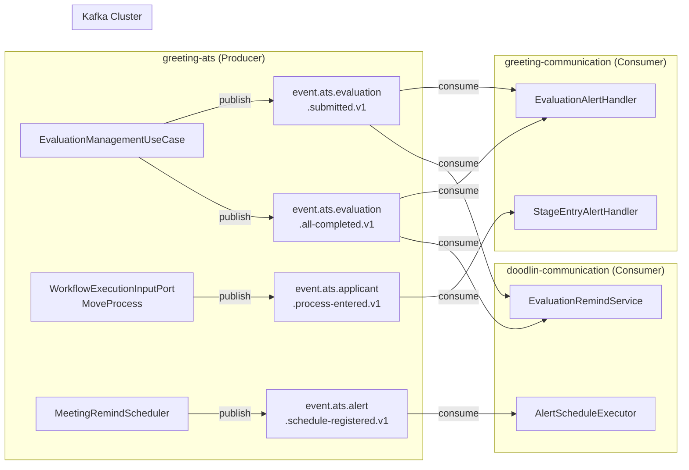

# [GRT-1002] Kafka 토픽 4개 생성 (Terraform)

## 개요
- PRD: https://doodlin.atlassian.net/wiki/x/SICjdg
- TDD 섹션: 이벤트 기반 아키텍처 / Kafka 토픽 설계
- 선행 티켓: 없음 (인프라 기반 티켓, ticket_01과 병렬 가능)

## 작업 내용

4개 Kafka 토픽을 Terraform으로 생성. 네이밍 컨벤션 `event.ats.{도메인}.{이벤트명}.v1` 적용.

### 토픽 정의

| 토픽명 | 용도 | 프로듀서 | 컨슈머 |
|--------|------|---------|--------|
| `event.ats.evaluation.submitted.v1` | 개별 평가자 평가 제출 이벤트 | greeting-ats | greeting-communication, doodlin-communication |
| `event.ats.evaluation.all-completed.v1` | 전체 평가자 평가 완료 이벤트 | greeting-ats | greeting-communication, doodlin-communication |
| `event.ats.applicant.process-entered.v1` | 지원자 전형 진입 이벤트 | greeting-ats | greeting-communication |
| `event.ats.alert.schedule-registered.v1` | 알림 스케줄 등록 이벤트 | greeting-ats | doodlin-communication (batch) |

### Terraform 리소스 정의

```hcl
# modules/kafka/topics_notification_enhancement.tf

resource "kafka_topic" "evaluation_submitted_v1" {
  name               = "event.ats.evaluation.submitted.v1"
  replication_factor = var.replication_factor  # prod: 3, dev/stage: 2
  partitions         = 6

  config = {
    "cleanup.policy"      = "delete"
    "retention.ms"        = "604800000"  # 7일
    "min.insync.replicas" = var.min_insync_replicas  # prod: 2, dev/stage: 1
    "max.message.bytes"   = "1048576"    # 1MB
  }
}

resource "kafka_topic" "evaluation_all_completed_v1" {
  name               = "event.ats.evaluation.all-completed.v1"
  replication_factor = var.replication_factor
  partitions         = 6

  config = {
    "cleanup.policy"      = "delete"
    "retention.ms"        = "604800000"
    "min.insync.replicas" = var.min_insync_replicas
    "max.message.bytes"   = "1048576"
  }
}

resource "kafka_topic" "applicant_process_entered_v1" {
  name               = "event.ats.applicant.process-entered.v1"
  replication_factor = var.replication_factor
  partitions         = 6

  config = {
    "cleanup.policy"      = "delete"
    "retention.ms"        = "604800000"
    "min.insync.replicas" = var.min_insync_replicas
    "max.message.bytes"   = "1048576"
  }
}

resource "kafka_topic" "alert_schedule_registered_v1" {
  name               = "event.ats.alert.schedule-registered.v1"
  replication_factor = var.replication_factor
  partitions         = 3  # 스케줄 등록은 상대적으로 트래픽 낮음

  config = {
    "cleanup.policy"      = "delete"
    "retention.ms"        = "604800000"
    "min.insync.replicas" = var.min_insync_replicas
    "max.message.bytes"   = "1048576"
  }
}
```

### 이벤트 페이로드 스키마 (참조)

```json
// event.ats.evaluation.submitted.v1
{
  "eventId": "uuid",
  "eventType": "EVALUATION_SUBMITTED",
  "timestamp": "2026-03-17T10:00:00+09:00",
  "payload": {
    "workspaceId": 1,
    "openingId": 100,
    "processId": 200,
    "applicantId": 300,
    "evaluatorUserId": 50,
    "evaluationId": 400,
    "evaluationStatus": "COMPLETE"
  }
}

// event.ats.evaluation.all-completed.v1
{
  "eventId": "uuid",
  "eventType": "EVALUATION_ALL_COMPLETED",
  "timestamp": "2026-03-17T10:00:00+09:00",
  "payload": {
    "workspaceId": 1,
    "openingId": 100,
    "processId": 200,
    "applicantId": 300,
    "totalEvaluators": 3,
    "completedEvaluators": 3
  }
}

// event.ats.applicant.process-entered.v1
{
  "eventId": "uuid",
  "eventType": "APPLICANT_PROCESS_ENTERED",
  "timestamp": "2026-03-17T10:00:00+09:00",
  "payload": {
    "workspaceId": 1,
    "openingId": 100,
    "fromProcessId": 200,
    "toProcessId": 201,
    "applicantId": 300,
    "movedByUserId": 50
  }
}

// event.ats.alert.schedule-registered.v1
{
  "eventId": "uuid",
  "eventType": "ALERT_SCHEDULE_REGISTERED",
  "timestamp": "2026-03-17T10:00:00+09:00",
  "payload": {
    "workspaceId": 1,
    "scheduleType": "MEETING_REMIND",
    "triggerAt": "2026-03-20T10:00:00+09:00",
    "referenceId": 500,
    "referenceType": "MEETING"
  }
}
```

### Kafka 상수 클래스 변경 (Application 레벨 참조)

- `greeting-communication/KafkaTopics.kt`, `greeting-ats` Kafka 프로듀서 설정에 토픽 상수 추가 → ticket_04, ticket_05에서 구현

### 다이어그램



### 수정 파일 목록

| 레포 | 모듈 | 파일 경로 | 변경 유형 |
|------|------|----------|----------|
| infra (Terraform) | modules/kafka | `topics_notification_enhancement.tf` | 신규 |
| infra (Terraform) | env/dev | `terraform.tfvars` (파티션/복제 설정) | 변경 |
| infra (Terraform) | env/stage | `terraform.tfvars` | 변경 |
| infra (Terraform) | env/prod | `terraform.tfvars` | 변경 |

## 영향 범위

| 레포 | 변경 내용 | 처리 티켓 |
|------|----------|----------|
| greeting-ats | Kafka 프로듀서 설정 추가 | ticket_04, ticket_05 |
| greeting-communication | Kafka 컨슈머 그룹 설정 추가 | ticket_04, ticket_05 |
| doodlin-communication | Kafka 컨슈머 설정 추가 | ticket_04 |

- 기존 토픽 영향 없음 (신규 토픽만 추가)

## 테스트 케이스

| ID | 테스트명 | Given | When | Then |
|----|---------|-------|------|------|
| T02-01 | 토픽 생성 확인 - evaluation.submitted | DEV Kafka 클러스터 접속 가능 | terraform apply | 토픽 생성됨, kafka-topics --describe로 확인 |
| T02-02 | 토픽 생성 확인 - evaluation.all-completed | DEV Kafka 클러스터 접속 가능 | terraform apply | 토픽 생성됨 |
| T02-03 | 토픽 생성 확인 - applicant.process-entered | DEV Kafka 클러스터 접속 가능 | terraform apply | 토픽 생성됨 |
| T02-04 | 토픽 생성 확인 - alert.schedule-registered | DEV Kafka 클러스터 접속 가능 | terraform apply | 토픽 생성됨 |
| T02-05 | 파티션 설정 검증 | 토픽 생성 완료 | kafka-topics --describe | evaluation 토픽: 6파티션, schedule 토픽: 3파티션 |
| T02-06 | 복제 팩터 검증 - DEV | DEV 환경 | kafka-topics --describe | replication-factor=2 |
| T02-07 | 복제 팩터 검증 - PROD | PROD 환경 | kafka-topics --describe | replication-factor=3, min.insync.replicas=2 |
| T02-08 | 메시지 프로듀스/컨슈 연결 테스트 | 토픽 생성 완료 | kafka-console-producer로 메시지 발행 | kafka-console-consumer로 메시지 수신 확인 |
| T02-09 | 리텐션 정책 확인 | 토픽 생성 완료 | 7일 이상 경과 메시지 확인 | 자동 삭제됨 |
| T02-10 | terraform plan 멱등성 | 이미 적용된 상태 | terraform plan 재실행 | No changes 출력 |

## 기대 결과 (AC)

- [ ] AC 1: 4개 Kafka 토픽이 DEV/STAGE/PROD 환경에 정상 생성된다
- [ ] AC 2: 파티션 수가 설계대로 설정된다 (evaluation: 6, schedule: 3)
- [ ] AC 3: 복제 팩터가 환경별로 올바르게 적용된다 (DEV: 2, PROD: 3)
- [ ] AC 4: min.insync.replicas가 PROD에서 2로 설정된다
- [ ] AC 5: 기존 토픽에 영향이 없다
- [ ] AC 6: terraform plan 멱등성이 보장된다

## 체크리스트

- [ ] 빌드 확인 (terraform validate)
- [ ] 테스트 통과 (terraform plan 확인)
- [ ] DEV 환경 적용 완료
- [ ] STAGE 환경 적용 완료
- [ ] PROD 환경 적용 계획 수립
- [ ] 토픽 네이밍 컨벤션 준수 확인
- [ ] 컨슈머 그룹 ID 계획 수립
