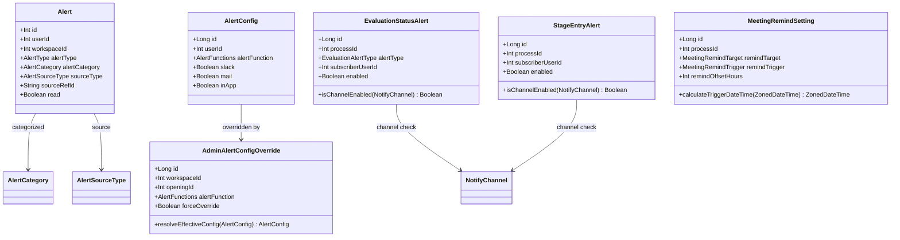

# [GRT-1003] 도메인 모델 신규/변경 - 알림 고도화

## 개요
- PRD: https://doodlin.atlassian.net/wiki/x/SICjdg
- TDD 섹션: 도메인 모델 설계 / Hexagonal Architecture
- 선행 티켓: [GRT-1001] DB 마이그레이션

## 작업 내용

- 도메인 모델, 엔티티, 리포지토리 어댑터, Enum 구현
- Hexagonal Architecture: domain model → entity → repository → adapter 계층

### 1. Enum 추가/확장

#### AlertCategory (신규)
```kotlin
// greeting-new-back/domain/.../communication/domain/AlertCategory.kt
enum class AlertCategory {
    EVALUATION,       // 평가 관련 알림
    STAGE_ENTRY,      // 전형 진입 알림
    MEETING_REMIND,   // 면접 리마인드 알림
    SYSTEM,           // 시스템 알림 (기존)
}
```

#### AlertSourceType (신규)
```kotlin
// greeting-new-back/domain/.../communication/domain/AlertSourceType.kt
enum class AlertSourceType {
    EVALUATION_SUBMITTED,       // 개별 평가 제출
    EVALUATION_ALL_COMPLETED,   // 전체 평가 완료
    STAGE_ENTERED,              // 전형 진입
    MEETING_REMIND,             // 면접 리마인드
}
```

#### AlertFunctions 확장
```kotlin
// greeting-new-back/domain/.../user/domain/AlertFunctions.kt
enum class AlertFunctions {
    // 기존
    APPLICANT_REGISTERED,
    MEETING,
    RECEIVE_MAIL,
    MENTION,
    DELETE_DUPLICATED_APPLICANT,
    OPENING_JOIN_AND_INVITE,
    RECEIVE_FORM_RESPONSE,
    SUBMIT_RECOMMENDATION_LETTER,
    TASK_REQUEST_REPORT,
    // 신규
    EVALUATION_SUBMITTED,          // 개별 평가 제출 알림
    EVALUATION_ALL_COMPLETED,      // 전체 평가 완료 알림
    STAGE_ENTRY,                   // 전형 진입 알림
    MEETING_REMIND_BEFORE,         // 면접 전 리마인드
    MEETING_REMIND_AFTER,          // 면접 후 리마인드 (평가 독려)
}
```

#### NotifyTargetType (신규)
```kotlin
// greeting-communication/communication/business/domain/.../NotifyTargetType.kt
enum class NotifyTargetType {
    RECRUITER,      // 채용 담당자
    EVALUATOR,      // 평가자
    INTERVIEWER,    // 면접관
    SUBSCRIBER,     // 구독자 (직접 구독한 사용자)
}
```

#### MeetingRemindTarget (신규)
```kotlin
// greeting-ats/.../domain/evaluation/enums/MeetingRemindTarget.kt
enum class MeetingRemindTarget {
    EVALUATOR,
    INTERVIEWER,
    RECRUITER,
}
```

#### MeetingRemindTrigger (신규)
```kotlin
// greeting-ats/.../domain/evaluation/enums/MeetingRemindTrigger.kt
enum class MeetingRemindTrigger {
    BEFORE_MEETING,
    AFTER_MEETING,
}
```

### 2. 도메인 모델 변경/신규

#### Alert 도메인 모델 변경
```kotlin
// greeting-new-back/domain/.../communication/domain/Alert.kt
data class Alert(
    val id: Int,
    val userId: Int,
    val workspaceId: Int,
    val imageUrl: String?,
    val data: String,
    val url: String?,
    val alertType: AlertType,
    val alertCategory: AlertCategory?,     // NEW
    val sourceType: AlertSourceType?,      // NEW
    val sourceRefId: String?,              // NEW
    val read: Boolean,
    val createDate: ZonedDateTime,
)
```

#### AlertConfig 도메인 모델 변경
```kotlin
// greeting-new-back/domain/.../user/domain/AlertConfig.kt
data class AlertConfig(
    val id: Long?,                        // NEW (서로게이트 키)
    val userId: Int,
    val alertFunction: AlertFunctions,
    val slack: Boolean?,
    val mail: Boolean?,
    val inApp: Boolean?,                  // NEW
)
```

#### AdminAlertConfigOverride (신규)
```kotlin
// greeting-communication/communication/business/domain/.../AdminAlertConfigOverride.kt
data class AdminAlertConfigOverride(
    val id: Long?,
    val workspaceId: Int,
    val openingId: Int?,
    val alertFunction: AlertFunctions,
    val slack: Boolean?,
    val mail: Boolean?,
    val inApp: Boolean?,
    val forceOverride: Boolean,
    val createdBy: Int,
) {
    fun resolveEffectiveConfig(memberConfig: AlertConfig): AlertConfig {
        if (!forceOverride) return memberConfig
        return memberConfig.copy(
            slack = this.slack ?: memberConfig.slack,
            mail = this.mail ?: memberConfig.mail,
            inApp = this.inApp ?: memberConfig.inApp,
        )
    }
}
```

#### EvaluationStatusAlert (신규)
```kotlin
// greeting-communication/communication/business/domain/.../EvaluationStatusAlert.kt
data class EvaluationStatusAlert(
    val id: Long?,
    val workspaceId: Int,
    val openingId: Int,
    val processId: Int,
    val alertType: EvaluationAlertType,
    val subscriberUserId: Int,
    val enabled: Boolean,
    val slackEnabled: Boolean,
    val mailEnabled: Boolean,
    val inAppEnabled: Boolean,
) {
    enum class EvaluationAlertType {
        EVALUATION_SUBMITTED,
        EVALUATION_ALL_COMPLETED,
    }

    fun isChannelEnabled(channel: NotifyChannel): Boolean = when (channel) {
        NotifyChannel.SLACK -> slackEnabled
        NotifyChannel.MAIL -> mailEnabled
        NotifyChannel.IN_APP -> inAppEnabled
    }
}
```

#### StageEntryAlert (신규)
```kotlin
// greeting-communication/communication/business/domain/.../StageEntryAlert.kt
data class StageEntryAlert(
    val id: Long?,
    val workspaceId: Int,
    val openingId: Int,
    val processId: Int,
    val subscriberUserId: Int,
    val enabled: Boolean,
    val slackEnabled: Boolean,
    val mailEnabled: Boolean,
    val inAppEnabled: Boolean,
) {
    fun isChannelEnabled(channel: NotifyChannel): Boolean = when (channel) {
        NotifyChannel.SLACK -> slackEnabled
        NotifyChannel.MAIL -> mailEnabled
        NotifyChannel.IN_APP -> inAppEnabled
    }
}
```

#### MeetingRemindSetting (신규)
```kotlin
// greeting-ats/.../domain/evaluation/model/MeetingRemindSetting.kt
data class MeetingRemindSetting(
    val id: Long?,
    val workspaceId: Int,
    val openingId: Int,
    val processId: Int,
    val remindTarget: MeetingRemindTarget,
    val remindTrigger: MeetingRemindTrigger,
    val remindOffsetHours: Int,
    val remindOffsetDays: Int,
    val remindTime: String?,
    val enabled: Boolean,
    val slackEnabled: Boolean,
    val mailEnabled: Boolean,
    val inAppEnabled: Boolean,
) {
    fun calculateTriggerDateTime(meetingDateTime: ZonedDateTime): ZonedDateTime {
        val base = when (remindTrigger) {
            MeetingRemindTrigger.BEFORE_MEETING -> meetingDateTime.minusHours(remindOffsetHours.toLong()).minusDays(remindOffsetDays.toLong())
            MeetingRemindTrigger.AFTER_MEETING -> meetingDateTime.plusHours(remindOffsetHours.toLong()).plusDays(remindOffsetDays.toLong())
        }
        return if (remindOffsetDays > 0 && remindTime != null) {
            val (hour, minute) = remindTime.split(":").map { it.toInt() }
            base.withHour(hour).withMinute(minute).withSecond(0)
        } else {
            base
        }
    }
}
```

#### NotifyChannel (신규)
```kotlin
// greeting-communication/communication/business/domain/.../NotifyChannel.kt
enum class NotifyChannel {
    SLACK,
    MAIL,
    IN_APP,
}
```

### 3. 엔티티 변경/신규

#### Alerts 엔티티 변경
`alertCategory`, `sourceType`, `sourceRefId` 필드 추가.

#### AlertConfigs 엔티티 변경
- `@IdClass(AlertConfigsPK::class)` 제거
- `@Id` 서로게이트 키 `id: Long` 추가
- `in_app` 컬럼 매핑 추가
- `AlertConfigsPK` → deprecated 처리 후 향후 제거

#### 신규 엔티티 4개
- `AdminAlertConfigOverrideEntity`
- `EvaluationStatusAlertEntity`
- `StageEntryAlertEntity`
- `MeetingRemindSettingEntity`

### 4. 리포지토리/어댑터

#### 신규 Output Port (Hexagonal)
```kotlin
// Port (Interface)
interface EvaluationStatusAlertOutputPort {
    fun findByProcessIdAndAlertType(processId: Int, alertType: EvaluationAlertType): List<EvaluationStatusAlert>
    fun findBySubscriberUserId(subscriberUserId: Int): List<EvaluationStatusAlert>
    fun save(alert: EvaluationStatusAlert): EvaluationStatusAlert
    fun deleteById(id: Long)
}

interface StageEntryAlertOutputPort {
    fun findByProcessId(processId: Int): List<StageEntryAlert>
    fun findBySubscriberUserId(subscriberUserId: Int): List<StageEntryAlert>
    fun save(alert: StageEntryAlert): StageEntryAlert
    fun deleteById(id: Long)
}

interface AdminAlertConfigOverrideOutputPort {
    fun findByWorkspaceIdAndAlertFunction(workspaceId: Int, alertFunction: AlertFunctions): AdminAlertConfigOverride?
    fun findByWorkspaceIdAndOpeningIdAndAlertFunction(workspaceId: Int, openingId: Int, alertFunction: AlertFunctions): AdminAlertConfigOverride?
    fun save(override: AdminAlertConfigOverride): AdminAlertConfigOverride
}

interface MeetingRemindSettingOutputPort {
    fun findByProcessId(processId: Int): List<MeetingRemindSetting>
    fun save(setting: MeetingRemindSetting): MeetingRemindSetting
    fun deleteById(id: Long)
}
```

### 다이어그램

```mermaid
graph TB
    subgraph "Domain Layer"
        DM1[Alert]
        DM2[AlertConfig]
        DM3[AdminAlertConfigOverride]
        DM4[EvaluationStatusAlert]
        DM5[StageEntryAlert]
        DM6[MeetingRemindSetting]
    end

    subgraph "Entity Layer (JPA)"
        E1[Alerts entity]
        E2[AlertConfigs entity]
        E3[AdminAlertConfigOverrideEntity]
        E4[EvaluationStatusAlertEntity]
        E5[StageEntryAlertEntity]
        E6[MeetingRemindSettingEntity]
    end

    subgraph "Port Layer (Interface)"
        P1[AlertsRepository]
        P2[AlertConfigsRepository]
        P3[AdminAlertConfigOverrideOutputPort]
        P4[EvaluationStatusAlertOutputPort]
        P5[StageEntryAlertOutputPort]
        P6[MeetingRemindSettingOutputPort]
    end

    subgraph "Adapter Layer (Implementation)"
        A1[AlertsStoreImpl]
        A2[AlertConfigsStoreImpl]
        A3[AdminAlertConfigOverrideRepository]
        A4[EvaluationStatusAlertRepository]
        A5[StageEntryAlertRepository]
        A6[MeetingRemindSettingRepository]
    end

    DM1 -.-> E1
    DM2 -.-> E2
    DM3 -.-> E3
    DM4 -.-> E4
    DM5 -.-> E5
    DM6 -.-> E6

    P1 --> A1
    P2 --> A2
    P3 --> A3
    P4 --> A4
    P5 --> A5
    P6 --> A6
```





### 수정 파일 목록

| 레포 | 모듈 | 파일 경로 | 변경 유형 |
|------|------|----------|----------|
| greeting-new-back | domain | `communication/domain/Alert.kt` | 변경 |
| greeting-new-back | domain | `communication/domain/AlertCategory.kt` | 신규 |
| greeting-new-back | domain | `communication/domain/AlertSourceType.kt` | 신규 |
| greeting-new-back | domain | `communication/entity/Alerts.kt` | 변경 |
| greeting-new-back | domain | `communication/mapper/AlertToDomainMapper.kt` | 변경 |
| greeting-new-back | domain | `user/domain/AlertConfig.kt` | 변경 |
| greeting-new-back | domain | `user/domain/AlertFunctions.kt` | 변경 |
| greeting-new-back | domain | `user/entity/AlertConfigs.kt` | 변경 |
| greeting-new-back | domain | `user/entity/AlertConfigsPK.kt` | 변경 (deprecated) |
| greeting-new-back | domain | `user/repository/AlertConfigsRepository.kt` | 변경 |
| greeting-new-back | domain | `user/repository/AlertConfigAdaptor.kt` | 변경 |
| greeting-communication | business/domain | `internal/AlertConfig.kt` | 변경 |
| greeting-communication | business/domain | `NotifyChannel.kt` | 신규 |
| greeting-communication | business/domain | `NotifyTargetType.kt` | 신규 |
| greeting-communication | business/domain | `AdminAlertConfigOverride.kt` | 신규 |
| greeting-communication | business/domain | `EvaluationStatusAlert.kt` | 신규 |
| greeting-communication | business/domain | `StageEntryAlert.kt` | 신규 |
| greeting-communication | business/application | `port/output/EvaluationStatusAlertOutputPort.kt` | 신규 |
| greeting-communication | business/application | `port/output/StageEntryAlertOutputPort.kt` | 신규 |
| greeting-communication | business/application | `port/output/AdminAlertConfigOverrideOutputPort.kt` | 신규 |
| greeting-communication | adaptor/mysql | `entity/AdminAlertConfigOverrideEntity.kt` | 신규 |
| greeting-communication | adaptor/mysql | `entity/EvaluationStatusAlertEntity.kt` | 신규 |
| greeting-communication | adaptor/mysql | `entity/StageEntryAlertEntity.kt` | 신규 |
| greeting-communication | adaptor/mysql | `repository/AdminAlertConfigOverrideJpaRepository.kt` | 신규 |
| greeting-communication | adaptor/mysql | `repository/EvaluationStatusAlertJpaRepository.kt` | 신규 |
| greeting-communication | adaptor/mysql | `repository/StageEntryAlertJpaRepository.kt` | 신규 |
| greeting-ats | business/domain | `evaluation/enums/MeetingRemindTarget.kt` | 신규 |
| greeting-ats | business/domain | `evaluation/enums/MeetingRemindTrigger.kt` | 신규 |
| greeting-ats | business/domain | `evaluation/model/MeetingRemindSetting.kt` | 신규 |
| greeting-ats | business/application | `evaluation/port/output/MeetingRemindSettingOutputPort.kt` | 신규 |
| greeting-ats | adaptor/mysql | `evaluation/entity/MeetingRemindSettingEntity.kt` | 신규 |
| greeting-ats | adaptor/mysql | `evaluation/entity/EvaluationRemindSettingEntity.kt` | 변경 |
| greeting-ats | adaptor/mysql | `evaluation/repository/MeetingRemindSettingJpaRepository.kt` | 신규 |
| greeting_authn-server | infrastructure/mysql | `entity/AlertConfigs.kt` | 변경 |
| greeting_authn-server | infrastructure/mysql | `entity/AlertConfigsPK.kt` | 변경 (deprecated) |

## 영향 범위

| 레포 | 영향 내용 |
|------|----------|
| greeting-new-back | Alert, AlertConfig 도메인 모델 변경 → `AlertApplication`, `AlertApiController`, `AlertConfigAdaptor`, `AlertConfigsReader` 영향 |
| greeting_authn-server | AlertConfigs 엔티티 PK 변경 → `AlertConfigsRepository` 쿼리 영향 |
| greeting-communication | 신규 도메인 모델/포트/어댑터 추가 |
| greeting-ats | `EvaluationRemindSettingEntity` 확장, `MeetingRemindSetting` 신규 |
| doodlin-communication | `EvaluationRemindSetting` 도메인 모델 신규 필드 반영 |

## 테스트 케이스

| ID | 테스트명 | Given | When | Then |
|----|---------|-------|------|------|
| T03-01 | Alert 도메인 모델 생성 | alertCategory=EVALUATION, sourceType=EVALUATION_SUBMITTED | Alert 인스턴스 생성 | 모든 필드 정상 매핑 |
| T03-02 | Alert 하위호환성 | alertCategory=null, sourceType=null | Alert 인스턴스 생성 | 기존 Alert과 동일 동작 (nullable) |
| T03-03 | AlertConfig PK 전환 호환 | id=1L, userId=10, alertFunction=MEETING | AlertConfig 생성 | 서로게이트 키 기반 동작 |
| T03-04 | AdminAlertConfigOverride - 강제 오버라이드 | forceOverride=true, slack=false | resolveEffectiveConfig(memberConfig) | 멤버 slack 설정이 false로 오버라이드됨 |
| T03-05 | AdminAlertConfigOverride - 기본값만 | forceOverride=false, slack=false | resolveEffectiveConfig(memberConfig) | 멤버 원래 설정 유지 |
| T03-06 | EvaluationStatusAlert 채널 체크 | slackEnabled=true, mailEnabled=false | isChannelEnabled(SLACK), isChannelEnabled(MAIL) | true, false |
| T03-07 | StageEntryAlert 채널 체크 | enabled=false | isChannelEnabled(any) | 채널 설정 반환 (enabled는 별도 체크) |
| T03-08 | MeetingRemindSetting - BEFORE 트리거 계산 | remindTrigger=BEFORE, offsetHours=1 | calculateTriggerDateTime(면접시각) | 면접 1시간 전 시각 반환 |
| T03-09 | MeetingRemindSetting - AFTER 트리거 계산 (일 단위) | remindTrigger=AFTER, offsetDays=1, remindTime=10:00 | calculateTriggerDateTime(면접시각) | 면접 다음날 10:00 반환 |
| T03-10 | AlertFunctions enum 확장 호환 | 기존 valueOf("MEETING") | AlertFunctions.valueOf("MEETING") | 정상 반환 (기존 값 유지) |
| T03-11 | Alerts 엔티티 -> 도메인 매퍼 | alertCategory, sourceType 포함 엔티티 | AlertToDomainMapper 변환 | Alert 도메인 모델 정상 매핑 |
| T03-12 | EvaluationStatusAlertEntity CRUD | 신규 엔티티 인스턴스 | JPA save/findById | 정상 저장/조회 |
| T03-13 | StageEntryAlertEntity CRUD | 신규 엔티티 인스턴스 | JPA save/findById | 정상 저장/조회 |
| T03-14 | MeetingRemindSettingEntity CRUD | 신규 엔티티 인스턴스 | JPA save/findById | 정상 저장/조회 |
| T03-15 | AdminAlertConfigOverrideEntity UNIQUE 제약 | 동일 workspace+opening+function | 중복 save | DataIntegrityViolationException |

## 기대 결과 (AC)

- [ ] AC 1: Alert, AlertConfig 도메인 모델이 신규 필드를 포함하여 변경되고, 기존 사용처에서 컴파일 에러가 없다
- [ ] AC 2: AlertFunctions enum에 5개 신규 값이 추가되고, 기존 값이 유지된다
- [ ] AC 3: 4개 신규 도메인 모델(AdminAlertConfigOverride, EvaluationStatusAlert, StageEntryAlert, MeetingRemindSetting)이 Hexagonal 구조로 구현된다
- [ ] AC 4: 각 신규 도메인에 대한 OutputPort 인터페이스와 JPA 어댑터 구현이 완료된다
- [ ] AC 5: 도메인 모델 단위 테스트가 통과한다 (비즈니스 로직: 오버라이드 resolve, 채널 체크, 트리거 시각 계산)
- [ ] AC 6: 엔티티 CRUD 통합 테스트가 통과한다

## 체크리스트

- [ ] 빌드 확인 (greeting-new-back, greeting-communication, greeting-ats, greeting_authn-server)
- [ ] 테스트 통과 (단위 테스트 + 통합 테스트)
- [ ] 기존 Alert/AlertConfig 사용처 컴파일 검증
- [ ] Detekt 정적 분석 통과
- [ ] JPA 엔티티 매핑 검증 (로컬 H2 or MySQL 테스트)
