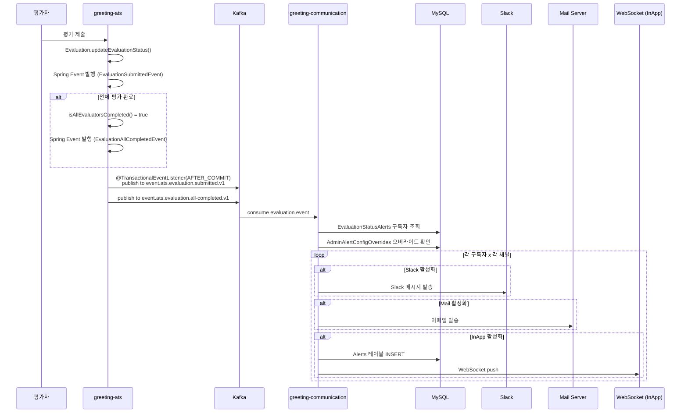

# [GRT-1004] 평가 상태별 알림 서비스 구현

## 개요
- PRD: https://doodlin.atlassian.net/wiki/x/SICjdg
- TDD 섹션: 평가 알림 / 이벤트 핸들러
- 선행 티켓: [GRT-1001] DB 마이그레이션, [GRT-1002] Kafka 토픽 생성, [GRT-1003] 도메인 모델

## 작업 내용

- 평가 제출(`EvaluationSubmitted`) / 전체 완료(`EvaluationAllCompleted`) 알림 서비스 구현
- greeting-ats → Spring Event 발행 → Kafka → greeting-communication 처리

### 1. Spring Event 정의

#### EvaluationSubmittedEvent
```kotlin
// greeting-ats/.../domain/evaluation/event/EvaluationSubmittedEvent.kt
data class EvaluationSubmittedEvent(
    val workspaceId: Int,
    val openingId: Int,
    val processId: Int,
    val applicantId: Int,
    val evaluatorUserId: Int,
    val evaluationId: Long,
    val evaluationStatus: EvaluationStatus,
)
```

#### EvaluationAllCompletedEvent
```kotlin
// greeting-ats/.../domain/evaluation/event/EvaluationAllCompletedEvent.kt
data class EvaluationAllCompletedEvent(
    val workspaceId: Int,
    val openingId: Int,
    val processId: Int,
    val applicantId: Int,
    val totalEvaluators: Int,
    val completedEvaluators: Int,
)
```

### 2. 이벤트 발행 (greeting-ats)

`EvaluationManagementUseCase` 평가 저장 완료 후 Spring Event 발행.

**전체 완료 판정 기준**: `evaluatedUserIds`가 `assignedEvaluatorUserIds` 전부 포함 시 COMPLETE → `EvaluationAllCompletedEvent` 발행.

```kotlin
// greeting-ats/.../application/evaluation/usecase/EvaluationManagementUseCase.kt (변경)
// 평가 제출 처리 메서드 내부
fun submitEvaluation(command: SubmitEvaluationCommand) {
    // ... 기존 평가 저장 로직 ...

    // 1. 개별 평가 제출 이벤트 발행
    applicationEventPublisher.publishEvent(
        EvaluationSubmittedEvent(
            workspaceId = command.workspaceId,
            openingId = command.openingId,
            processId = command.processId,
            applicantId = command.applicantId,
            evaluatorUserId = command.evaluatorUserId,
            evaluationId = savedEvaluation.id,
            evaluationStatus = savedEvaluation.status,
        )
    )

    // 2. 전체 완료 판정
    if (isAllEvaluatorsCompleted(command.processId, command.applicantId)) {
        applicationEventPublisher.publishEvent(
            EvaluationAllCompletedEvent(
                workspaceId = command.workspaceId,
                openingId = command.openingId,
                processId = command.processId,
                applicantId = command.applicantId,
                totalEvaluators = assignedEvaluatorCount,
                completedEvaluators = assignedEvaluatorCount,
            )
        )
    }
}
```

### 3. Kafka 프로듀서 (greeting-ats)

Spring Event를 수신하여 Kafka로 전달하는 `@TransactionalEventListener(AFTER_COMMIT)` 구현.

```kotlin
// greeting-ats/.../presentation/event/EvaluationAlertEventPublisher.kt
@Component
class EvaluationAlertEventPublisher(
    private val kafkaTemplate: KafkaTemplate<String, Any>,
) {
    @TransactionalEventListener(phase = TransactionPhase.AFTER_COMMIT)
    fun handleEvaluationSubmitted(event: EvaluationSubmittedEvent) {
        kafkaTemplate.send(
            "event.ats.evaluation.submitted.v1",
            event.applicantId.toString(),  // partition key
            event.toKafkaPayload()
        )
    }

    @TransactionalEventListener(phase = TransactionPhase.AFTER_COMMIT)
    fun handleEvaluationAllCompleted(event: EvaluationAllCompletedEvent) {
        kafkaTemplate.send(
            "event.ats.evaluation.all-completed.v1",
            event.applicantId.toString(),
            event.toKafkaPayload()
        )
    }
}
```

### 4. Kafka 컨슈머 + 알림 핸들러 (greeting-communication)

```kotlin
// greeting-communication/.../presentation/consumer/EvaluationAlertConsumer.kt
@Component
class EvaluationAlertConsumer(
    private val evaluationAlertHandler: EvaluationAlertHandler,
) {
    @KafkaListener(
        topics = ["event.ats.evaluation.submitted.v1"],
        groupId = "greeting-communication-evaluation-alert"
    )
    fun consumeEvaluationSubmitted(record: ConsumerRecord<String, String>) {
        val event = objectMapper.readValue<EvaluationSubmittedPayload>(record.value())
        evaluationAlertHandler.handleEvaluationSubmitted(event)
    }

    @KafkaListener(
        topics = ["event.ats.evaluation.all-completed.v1"],
        groupId = "greeting-communication-evaluation-alert"
    )
    fun consumeEvaluationAllCompleted(record: ConsumerRecord<String, String>) {
        val event = objectMapper.readValue<EvaluationAllCompletedPayload>(record.value())
        evaluationAlertHandler.handleEvaluationAllCompleted(event)
    }
}
```

### 5. 알림 핸들러 서비스

```kotlin
// greeting-communication/.../application/evaluation/EvaluationAlertHandler.kt
@Service
class EvaluationAlertHandler(
    private val evaluationStatusAlertOutputPort: EvaluationStatusAlertOutputPort,
    private val adminAlertConfigOverrideOutputPort: AdminAlertConfigOverrideOutputPort,
    private val alertSender: AlertSender,
) {
    fun handleEvaluationSubmitted(event: EvaluationSubmittedPayload) {
        // 1. 구독자 조회
        val subscribers = evaluationStatusAlertOutputPort
            .findByProcessIdAndAlertType(event.processId, EVALUATION_SUBMITTED)
            .filter { it.enabled }

        // 2. 관리자 오버라이드 확인
        // 3. 채널별 분기 발송
        subscribers.forEach { subscriber ->
            val effectiveConfig = resolveEffectiveConfig(subscriber, event.workspaceId)
            NotifyChannel.entries.forEach { channel ->
                if (subscriber.isChannelEnabled(channel) && effectiveConfig.isChannelAllowed(channel)) {
                    alertSender.send(
                        channel = channel,
                        userId = subscriber.subscriberUserId,
                        alert = buildEvaluationSubmittedAlert(event),
                    )
                }
            }
        }
    }

    fun handleEvaluationAllCompleted(event: EvaluationAllCompletedPayload) {
        val subscribers = evaluationStatusAlertOutputPort
            .findByProcessIdAndAlertType(event.processId, EVALUATION_ALL_COMPLETED)
            .filter { it.enabled }

        subscribers.forEach { subscriber ->
            val effectiveConfig = resolveEffectiveConfig(subscriber, event.workspaceId)
            NotifyChannel.entries.forEach { channel ->
                if (subscriber.isChannelEnabled(channel) && effectiveConfig.isChannelAllowed(channel)) {
                    alertSender.send(
                        channel = channel,
                        userId = subscriber.subscriberUserId,
                        alert = buildEvaluationAllCompletedAlert(event),
                    )
                }
            }
        }
    }
}
```

### 6. AlertSender 인터페이스 (채널 추상화)

```kotlin
// greeting-communication/.../application/port/output/AlertSender.kt
interface AlertSender {
    fun send(channel: NotifyChannel, userId: Int, alert: AlertPayload)
}
// 구현체: 기존 인앱(WebSocket), 메일, Slack 발송 로직을 래핑
```

### 다이어그램



### 수정 파일 목록

| 레포 | 모듈 | 파일 경로 | 변경 유형 |
|------|------|----------|----------|
| greeting-ats | business/domain | `evaluation/event/EvaluationSubmittedEvent.kt` | 신규 |
| greeting-ats | business/domain | `evaluation/event/EvaluationAllCompletedEvent.kt` | 신규 |
| greeting-ats | business/application | `evaluation/usecase/EvaluationManagementUseCase.kt` | 변경 |
| greeting-ats | presentation/api | `event/EvaluationAlertEventPublisher.kt` | 신규 |
| greeting-ats | presentation/api | `resources/application*.yaml` (Kafka producer 설정) | 변경 |
| greeting-communication | business/application | `evaluation/EvaluationAlertHandler.kt` | 신규 |
| greeting-communication | business/application | `port/output/AlertSender.kt` | 신규 |
| greeting-communication | presentation/api | `consumer/EvaluationAlertConsumer.kt` | 신규 |
| greeting-communication | presentation/api | `resources/application*.yaml` (Kafka consumer 설정) | 변경 |
| greeting-communication | adaptor/kafka | `KafkaTopics.kt` | 변경 |
| doodlin-communication | domain | `application/remind/EvaluationRemindApplicationService.kt` | 변경 (필요 시) |

## 영향 범위

| 레포 | 영향 내용 |
|------|----------|
| greeting-ats | `EvaluationManagementUseCase` 이벤트 발행 추가 — AFTER_COMMIT으로 기존 플로우 영향 없음 |
| greeting-communication | 신규 컨슈머/핸들러 추가 — 기존 알림 로직 영향 없음 |
| doodlin-communication | `EvaluationRemindApplicationService`와 역할 분담 확인 필요 (기존: 배치 기반 리마인드 / 신규: 이벤트 기반 상태 알림) |

## 테스트 케이스

| ID | 테스트명 | Given | When | Then |
|----|---------|-------|------|------|
| T04-01 | 개별 평가 제출 -> 알림 발송 | 구독자 A(slack=ON, mail=ON), 구독자 B(slack=ON, mail=OFF) | 평가자 C가 평가 제출 | A: Slack+Mail 수신, B: Slack만 수신 |
| T04-02 | 전체 평가 완료 -> 알림 발송 | 3명 배정, 2명 완료, 구독자 A(all-completed 구독) | 마지막 평가자 제출 | A에게 전체 완료 알림 발송 |
| T04-03 | 전체 완료 미달 -> all-completed 미발송 | 3명 배정, 1명 완료 | 두 번째 평가자 제출 | submitted 알림만 발송, all-completed 미발송 |
| T04-04 | 구독 OFF -> 알림 미발송 | 구독자 A(enabled=false) | 평가 제출 | A에게 알림 미발송 |
| T04-05 | 관리자 강제 OFF 오버라이드 | 멤버 slack=ON, 관리자 forceOverride=true, slack=false | 평가 제출 | Slack 알림 미발송 |
| T04-06 | 관리자 기본값만 (비강제) | 멤버 slack=ON, 관리자 forceOverride=false, slack=false | 평가 제출 | 멤버 설정 우선, Slack 알림 발송 |
| T04-07 | 구독자 없음 | EvaluationStatusAlerts에 해당 process 구독자 없음 | 평가 제출 | 알림 미발송, 에러 없음 |
| T04-08 | Kafka 메시지 발행 검증 | 평가 제출 트랜잭션 커밋 | @TransactionalEventListener 실행 | Kafka 토픽에 메시지 발행됨 |
| T04-09 | Kafka 메시지 consume 검증 | Kafka에 evaluation.submitted 메시지 존재 | 컨슈머 폴링 | EvaluationAlertHandler.handleEvaluationSubmitted() 호출됨 |
| T04-10 | 트랜잭션 롤백 시 이벤트 미발행 | 평가 저장 중 예외 발생 | 트랜잭션 롤백 | AFTER_COMMIT이므로 Kafka 메시지 미발행 |
| T04-11 | 동시 평가 제출 Race Condition | 3명 중 마지막 2명이 동시 제출 | 동시 submitEvaluation() | all-completed 이벤트 정확히 1회만 발행 |
| T04-12 | 인앱 알림 저장 + WebSocket push | 구독자 A(inApp=ON) | 평가 제출 | Alerts 테이블 INSERT + WebSocket 메시지 전송 |
| T04-13 | 멱등성 - 중복 메시지 처리 | 동일 evaluationId로 submitted 이벤트 2회 수신 | 컨슈머 2회 처리 | 알림 1회만 발송 (중복 방지) |

## 기대 결과 (AC)

- [ ] AC 1: 개별 평가자 평가 제출 시 `event.ats.evaluation.submitted.v1` Kafka 메시지가 발행된다
- [ ] AC 2: 전체 평가자 완료 판정 시 `event.ats.evaluation.all-completed.v1` Kafka 메시지가 발행된다
- [ ] AC 3: greeting-communication에서 Kafka 메시지를 소비하여 구독자별 채널별 알림을 발송한다
- [ ] AC 4: 관리자 오버라이드 설정이 적용되어 강제 OFF 시 해당 채널 알림이 미발송된다
- [ ] AC 5: 구독 OFF 시 알림이 발송되지 않는다
- [ ] AC 6: 트랜잭션 롤백 시 Kafka 메시지가 발행되지 않는다 (AFTER_COMMIT 보장)
- [ ] AC 7: 기존 평가 제출 플로우에 성능 영향이 없다 (비동기 처리)

## 체크리스트

- [ ] 빌드 확인 (greeting-ats, greeting-communication)
- [ ] 테스트 통과 (단위 테스트 + 통합 테스트)
- [ ] Kafka 프로듀서/컨슈머 연결 DEV 환경 검증
- [ ] 동시성 테스트 (Race Condition 시나리오)
- [ ] 멱등성 처리 검증
- [ ] 기존 평가 플로우 회귀 테스트
- [ ] Slack/Mail/InApp 채널별 발송 확인
