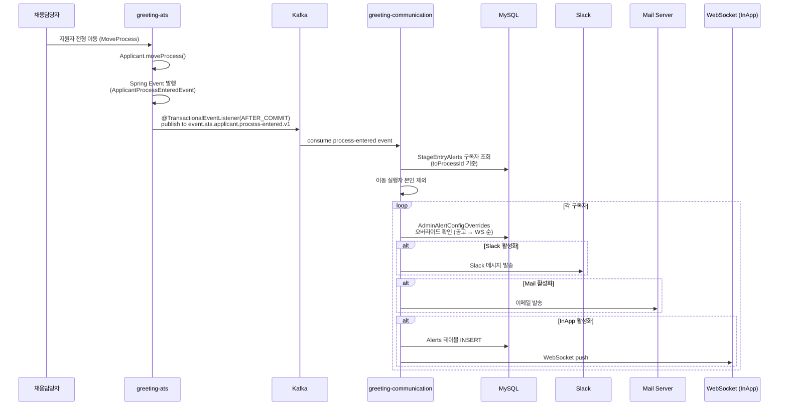
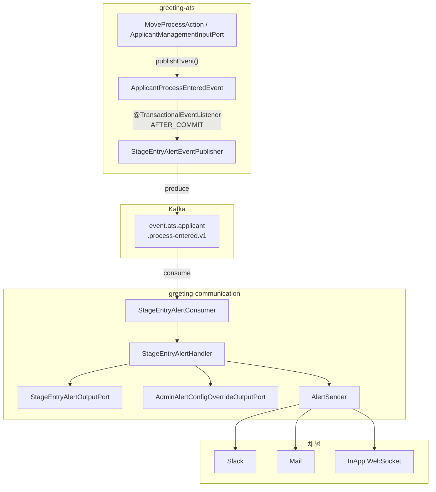

# [GRT-1005] 전형 진입 알림 서비스 구현

## 개요
- PRD: https://doodlin.atlassian.net/wiki/x/SICjdg
- TDD 섹션: 전형 진입 알림 / 이벤트 핸들러
- 선행 티켓: [GRT-1001] DB 마이그레이션, [GRT-1002] Kafka 토픽 생성, [GRT-1003] 도메인 모델

## 작업 내용

- 지원자 전형 진입 시 해당 전형 구독자에게 알림 발송 서비스 구현
- greeting-ats MoveProcess 완료 → Spring Event 발행 → Kafka → greeting-communication 처리

### 1. Spring Event 정의

```kotlin
// greeting-ats/.../domain/applicant/event/ApplicantProcessEnteredEvent.kt
data class ApplicantProcessEnteredEvent(
    val workspaceId: Int,
    val openingId: Int,
    val fromProcessId: Int,
    val toProcessId: Int,
    val applicantId: Int,
    val movedByUserId: Int,
)
```

### 2. 이벤트 발행 지점 (greeting-ats)

`ApplicantManagementInputPort.moveProcess()` 또는 `MoveProcessAction` 실행 완료 후 — `Applicant.moveProcess()` 호출 이후 Spring Event publish.

```kotlin
// greeting-ats/.../application/applicant/port/input/ApplicantManagementInputPort.kt (변경)
// moveProcess 메서드 내부, 전형 이동 완료 후:
fun moveProcess(command: MoveProcessCommand) {
    // ... 기존 전형 이동 로직 ...

    applicationEventPublisher.publishEvent(
        ApplicantProcessEnteredEvent(
            workspaceId = command.workspaceId,
            openingId = command.openingId,
            fromProcessId = command.fromProcessId,
            toProcessId = command.toProcessId,
            applicantId = command.applicantId,
            movedByUserId = command.userId,
        )
    )
}
```

### 3. Kafka 프로듀서 (greeting-ats)

```kotlin
// greeting-ats/.../presentation/event/StageEntryAlertEventPublisher.kt
@Component
class StageEntryAlertEventPublisher(
    private val kafkaTemplate: KafkaTemplate<String, Any>,
) {
    @TransactionalEventListener(phase = TransactionPhase.AFTER_COMMIT)
    fun handleApplicantProcessEntered(event: ApplicantProcessEnteredEvent) {
        kafkaTemplate.send(
            "event.ats.applicant.process-entered.v1",
            event.applicantId.toString(),  // partition key: 동일 지원자 이벤트 순서 보장
            event.toKafkaPayload()
        )
    }
}
```

### 4. Kafka 컨슈머 (greeting-communication)

```kotlin
// greeting-communication/.../presentation/consumer/StageEntryAlertConsumer.kt
@Component
class StageEntryAlertConsumer(
    private val stageEntryAlertHandler: StageEntryAlertHandler,
) {
    @KafkaListener(
        topics = ["event.ats.applicant.process-entered.v1"],
        groupId = "greeting-communication-stage-entry-alert"
    )
    fun consumeApplicantProcessEntered(record: ConsumerRecord<String, String>) {
        val event = objectMapper.readValue<ApplicantProcessEnteredPayload>(record.value())
        stageEntryAlertHandler.handle(event)
    }
}
```

### 5. 알림 핸들러 서비스

```kotlin
// greeting-communication/.../application/stageentry/StageEntryAlertHandler.kt
@Service
class StageEntryAlertHandler(
    private val stageEntryAlertOutputPort: StageEntryAlertOutputPort,
    private val adminAlertConfigOverrideOutputPort: AdminAlertConfigOverrideOutputPort,
    private val alertSender: AlertSender,
) {
    fun handle(event: ApplicantProcessEnteredPayload) {
        // 1. 진입한 전형(toProcessId)의 구독자 조회
        val subscribers = stageEntryAlertOutputPort
            .findByProcessId(event.toProcessId)
            .filter { it.enabled }

        if (subscribers.isEmpty()) return

        // 2. 구독자별 알림 발송
        subscribers.forEach { subscriber ->
            // 이동 실행자 본인에게는 알림 미발송
            if (subscriber.subscriberUserId == event.movedByUserId) return@forEach

            val effectiveConfig = resolveEffectiveConfig(
                subscriber = subscriber,
                workspaceId = event.workspaceId,
                openingId = event.openingId,
            )

            NotifyChannel.entries.forEach { channel ->
                if (subscriber.isChannelEnabled(channel) && effectiveConfig.isChannelAllowed(channel)) {
                    alertSender.send(
                        channel = channel,
                        userId = subscriber.subscriberUserId,
                        alert = buildStageEntryAlert(event),
                    )
                }
            }
        }
    }

    private fun resolveEffectiveConfig(
        subscriber: StageEntryAlert,
        workspaceId: Int,
        openingId: Int,
    ): EffectiveAlertConfig {
        // 1. 공고 레벨 오버라이드 조회
        val openingOverride = adminAlertConfigOverrideOutputPort
            .findByWorkspaceIdAndOpeningIdAndAlertFunction(
                workspaceId, openingId, AlertFunctions.STAGE_ENTRY
            )
        if (openingOverride != null && openingOverride.forceOverride) {
            return EffectiveAlertConfig.from(openingOverride)
        }

        // 2. 워크스페이스 레벨 오버라이드 조회
        val wsOverride = adminAlertConfigOverrideOutputPort
            .findByWorkspaceIdAndAlertFunction(workspaceId, AlertFunctions.STAGE_ENTRY)
        if (wsOverride != null && wsOverride.forceOverride) {
            return EffectiveAlertConfig.from(wsOverride)
        }

        // 3. 오버라이드 없으면 구독자 설정 그대로 사용
        return EffectiveAlertConfig.fromSubscriber(subscriber)
    }

    private fun buildStageEntryAlert(event: ApplicantProcessEnteredPayload): AlertPayload {
        return AlertPayload(
            alertType = AlertType.Recruiting,
            alertCategory = AlertCategory.STAGE_ENTRY,
            sourceType = AlertSourceType.STAGE_ENTERED,
            sourceRefId = "${event.toProcessId}",
            data = buildAlertData(event),  // JSON: 지원자명, 전형명 등
            url = buildApplicantUrl(event),
        )
    }
}
```

### 6. 구독 관리 API (참조)

구독 설정 CRUD → 별도 API 티켓. 핸들러에서 사용하는 구독 조회 로직은 본 티켓에 포함.

### 다이어그램





### 수정 파일 목록

| 레포 | 모듈 | 파일 경로 | 변경 유형 |
|------|------|----------|----------|
| greeting-ats | business/domain | `applicant/event/ApplicantProcessEnteredEvent.kt` | 신규 |
| greeting-ats | business/application | `applicant/port/input/ApplicantManagementInputPort.kt` | 변경 |
| greeting-ats | business/domain | `workflow/model/action/MoveProcessAction.kt` | 변경 (필요 시) |
| greeting-ats | presentation/api | `event/StageEntryAlertEventPublisher.kt` | 신규 |
| greeting-ats | presentation/api | `resources/application*.yaml` (Kafka producer 설정) | 변경 |
| greeting-communication | business/application | `stageentry/StageEntryAlertHandler.kt` | 신규 |
| greeting-communication | business/application | `stageentry/EffectiveAlertConfig.kt` | 신규 |
| greeting-communication | presentation/api | `consumer/StageEntryAlertConsumer.kt` | 신규 |
| greeting-communication | presentation/api | `resources/application*.yaml` (Kafka consumer 설정) | 변경 |
| greeting-communication | adaptor/kafka | `KafkaTopics.kt` | 변경 |

## 영향 범위

| 레포 | 영향 내용 |
|------|----------|
| greeting-ats | `ApplicantManagementInputPort.moveProcess()` 이벤트 발행 추가 — AFTER_COMMIT으로 성능 영향 없음. `MoveProcessAction`에서도 동일 이벤트 발행 검토 필요 |
| greeting-communication | 신규 컨슈머/핸들러 추가 — 기존 알림 로직 영향 없음 |
| greeting-new-back | `alerts` 테이블에 `STAGE_ENTRY` 카테고리 레코드 추가 → 기존 알림 목록 API 노출 여부 필터링 검토 |

## 테스트 케이스

| ID | 테스트명 | Given | When | Then |
|----|---------|-------|------|------|
| T05-01 | 전형 이동 -> 구독자 알림 발송 | 전형B를 구독한 사용자 A, B | 지원자 X가 전형A에서 전형B로 이동 | A, B에게 알림 발송 |
| T05-02 | 이동 실행자 본인 제외 | 전형B를 구독한 사용자 A(실행자), B | A가 지원자를 전형B로 이동 | B에게만 알림 발송, A는 미수신 |
| T05-03 | 구독 OFF -> 미발송 | 전형B 구독자 A(enabled=false) | 지원자가 전형B로 이동 | A에게 알림 미발송 |
| T05-04 | 채널별 분기 발송 | 구독자 A(slack=ON, mail=OFF, inApp=ON) | 전형 진입 이벤트 | A: Slack + InApp 수신, Mail 미수신 |
| T05-05 | 관리자 강제 OFF (공고 레벨) | 관리자가 공고X의 STAGE_ENTRY slack=OFF(강제) | 전형 진입 이벤트 | 구독자 slack 설정과 무관하게 Slack 미발송 |
| T05-06 | 관리자 강제 OFF (WS 레벨) | WS 레벨 forceOverride=true, mail=OFF | 전형 진입 이벤트 | Mail 미발송 |
| T05-07 | 오버라이드 우선순위 (공고 > WS) | 공고 레벨 slack=ON(강제), WS 레벨 slack=OFF(강제) | 전형 진입 이벤트 | 공고 레벨 우선, Slack 발송 |
| T05-08 | 구독자 없음 | 전형B 구독자 없음 | 지원자가 전형B로 이동 | 알림 미발송, 에러 없음, 핸들러 조기 반환 |
| T05-09 | Kafka 발행 검증 | 전형 이동 트랜잭션 커밋 | EventPublisher 실행 | event.ats.applicant.process-entered.v1 토픽에 메시지 발행 |
| T05-10 | 트랜잭션 롤백 시 미발행 | 전형 이동 중 예외 | 트랜잭션 롤백 | Kafka 메시지 미발행 |
| T05-11 | 대량 이동 (벌크) | 지원자 50명 전형B로 벌크 이동 | 벌크 MoveProcess 실행 | 각 지원자별 이벤트 발행, 구독자별 알림 발송 |
| T05-12 | 멱등성 - 중복 메시지 | 동일 (applicantId, toProcessId) 이벤트 2회 수신 | 컨슈머 2회 처리 | 알림 1회만 발송 |
| T05-13 | 그룹핑 전형 대응 | 그룹핑 전형(가상)으로 이동 | 이벤트 발행 | 실제 전형 ID 기준으로 구독자 조회 (비정규화 전형 구분) |

## 기대 결과 (AC)

- [ ] AC 1: 지원자 전형 이동 시 `event.ats.applicant.process-entered.v1` Kafka 메시지가 발행된다
- [ ] AC 2: greeting-communication에서 메시지를 소비하여 해당 전형 구독자에게 채널별 알림을 발송한다
- [ ] AC 3: 이동 실행자 본인에게는 알림이 발송되지 않는다
- [ ] AC 4: 구독 OFF 또는 관리자 강제 OFF 시 해당 알림이 미발송된다
- [ ] AC 5: 오버라이드 우선순위가 공고 > 워크스페이스 순으로 적용된다
- [ ] AC 6: 트랜잭션 롤백 시 Kafka 메시지가 발행되지 않는다
- [ ] AC 7: 벌크 전형 이동 시에도 정상 동작한다
- [ ] AC 8: 기존 전형 이동 플로우에 성능 영향이 없다

## 체크리스트

- [ ] 빌드 확인 (greeting-ats, greeting-communication)
- [ ] 테스트 통과 (단위 테스트 + 통합 테스트)
- [ ] Kafka 프로듀서/컨슈머 연결 DEV 환경 검증
- [ ] 벌크 이동 시나리오 성능 테스트
- [ ] 멱등성 처리 검증
- [ ] 기존 전형 이동 플로우 회귀 테스트
- [ ] 그룹핑 전형 엣지케이스 확인
- [ ] Slack/Mail/InApp 채널별 발송 확인
