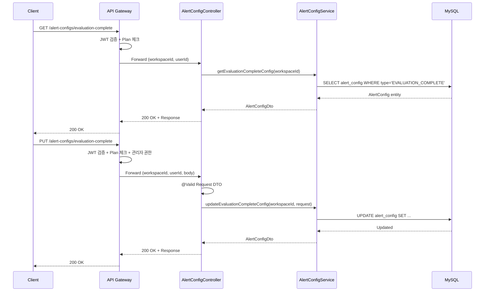

# [GRT-0006] 알림 설정 API 구현 (P0)

## 개요
- PRD: https://doodlin.atlassian.net/wiki/x/SICjdg
- 선행 티켓: GRT-0001 (DB Migration), GRT-0002 (Domain Model), GRT-0003 (AlertConfig Service)

## 작업 내용

### 변경 사항

평가 완료 알림 설정 및 전형 진입 알림 설정 REST API 구현 (엔드포인트 4개).

#### API 목록

| Method | Path | 설명 |
|--------|------|------|
| GET | `/alert-configs/evaluation-complete` | 평가 완료 알림 설정 조회 |
| PUT | `/alert-configs/evaluation-complete` | 평가 완료 알림 설정 변경 (On/Off, 수신 채널, 수신 대상) |
| GET | `/alert-configs/stage-entry` | 전형 진입 알림 설정 조회 (전형별 구독 목록 포함) |
| PUT | `/alert-configs/stage-entry` | 전형 진입 알림 설정 변경 (구독 전형 목록, On/Off) |

#### Controller
- `AlertConfigController` 신규 생성 — Hexagonal Architecture presentation 레이어
- `@PreAuthorize` 또는 커스텀 어노테이션으로 관리자 권한 검증
- Jakarta Validation 적용

#### DTO

| DTO | 주요 필드 |
|-----|----------|
| `GetEvaluationCompleteAlertConfigResponse` | `enabled`, `channels: List<AlertChannel>`, `targetRoles: List<RecipientRole>` |
| `PutEvaluationCompleteAlertConfigRequest` | `enabled`, `channels`, `targetRoles` |
| `GetStageEntryAlertConfigResponse` | `enabled`, `subscribedStageIds: List<Long>`, `channels` |
| `PutStageEntryAlertConfigRequest` | `enabled`, `subscribedStageIds`, `channels` |

#### Gateway 라우팅
- Path: `/api/v1/alert-configs/**`
- Plan 체크: STANDARD 이상, JWT Bearer 필수

### 다이어그램

### 수정 파일 목록
| 레포 | 모듈 | 파일 경로 | 변경 유형 |
|------|------|----------|----------|
| greeting-new-back | presentation | `presentation/api/controller/AlertConfigController.kt` | 신규 |
| greeting-new-back | presentation | `presentation/api/dto/alertconfig/GetEvaluationCompleteAlertConfigResponse.kt` | 신규 |
| greeting-new-back | presentation | `presentation/api/dto/alertconfig/PutEvaluationCompleteAlertConfigRequest.kt` | 신규 |
| greeting-new-back | presentation | `presentation/api/dto/alertconfig/GetStageEntryAlertConfigResponse.kt` | 신규 |
| greeting-new-back | presentation | `presentation/api/dto/alertconfig/PutStageEntryAlertConfigRequest.kt` | 신규 |
| greeting-new-back | business | `business/application/port/in/AlertConfigUseCase.kt` | 신규 |
| greeting-new-back | business | `business/application/service/AlertConfigService.kt` | 수정 (UseCase 구현) |
| greeting-api-gateway | routes | `routes/alert-config-routes.kt` (또는 YAML route config) | 신규 |

## 영향 범위

- 신규 API 4개 추가, Gateway 라우팅 테이블 변경
- GRT-0009 EventHandler에서 이 설정값 조회하여 알림 발송 여부 결정
- FE 알림 설정 화면에서 호출
- 신규 API이므로 기존 클라이언트 영향 없음

## 테스트 케이스

### 정상 케이스
| ID | 테스트명 | Given | When | Then |
|----|---------|-------|------|------|
| TC-061 | 평가 완료 알림 설정 조회 성공 | 워크스페이스에 alert_config 레코드 존재 | GET /alert-configs/evaluation-complete 호출 | 200 OK, enabled/channels/targetRoles 반환 |
| TC-062 | 평가 완료 알림 설정 변경 성공 | 관리자 권한 보유, 유효한 request body | PUT /alert-configs/evaluation-complete 호출 | 200 OK, 설정 변경됨 |
| TC-063 | 전형 진입 알림 설정 조회 성공 | 워크스페이스에 stage-entry 설정 존재 | GET /alert-configs/stage-entry 호출 | 200 OK, subscribedStageIds 포함 |
| TC-064 | 전형 진입 알림 설정 변경 성공 | 관리자 권한 보유, 유효한 stageId 목록 | PUT /alert-configs/stage-entry 호출 | 200 OK, 구독 전형 목록 변경됨 |
| TC-065 | 설정 없는 워크스페이스 최초 조회 | alert_config 레코드 미존재 | GET /alert-configs/evaluation-complete 호출 | 200 OK, 기본값(enabled=true) 반환 |

### 예외/엣지 케이스
| ID | 테스트명 | Given | When | Then |
|----|---------|-------|------|------|
| TC-E061 | 비관리자 설정 변경 시도 | 일반 멤버 권한 | PUT /alert-configs/evaluation-complete 호출 | 403 Forbidden |
| TC-E062 | 잘못된 채널값 입력 | channels에 존재하지 않는 값 | PUT /alert-configs/evaluation-complete 호출 | 400 Bad Request, 유효하지 않은 채널 |
| TC-E063 | 존재하지 않는 stageId 입력 | subscribedStageIds에 삭제된 전형 ID | PUT /alert-configs/stage-entry 호출 | 400 Bad Request, 유효하지 않은 전형 |
| TC-E064 | 빈 body 전송 | request body 없음 | PUT /alert-configs/evaluation-complete 호출 | 400 Bad Request |
| TC-E065 | 인증 없이 호출 | JWT 토큰 미포함 | GET /alert-configs/evaluation-complete 호출 | 401 Unauthorized |
| TC-E066 | Plan 미달 워크스페이스 | FREE Plan 워크스페이스 | GET /alert-configs/evaluation-complete 호출 | 403 Forbidden (Plan 부족) |

## 기대 결과 (Acceptance Criteria)
- [ ] AC 1: GET /alert-configs/evaluation-complete 호출 시 현재 워크스페이스의 평가 완료 알림 설정(enabled, channels, targetRoles)을 정상 반환한다
- [ ] AC 2: PUT /alert-configs/evaluation-complete 호출 시 관리자만 설정을 변경할 수 있고, 변경 즉시 반영된다
- [ ] AC 3: GET/PUT /alert-configs/stage-entry 호출 시 전형별 구독 목록을 조회/변경할 수 있다
- [ ] AC 4: 비관리자가 PUT 호출 시 403을 반환한다
- [ ] AC 5: 잘못된 입력값(미존재 채널, 미존재 전형 ID, 빈 body) 전송 시 400을 반환한다
- [ ] AC 6: Gateway 라우팅이 정상 동작하며, Plan 체크와 JWT 인증이 적용된다

## 체크리스트
- [ ] 빌드 확인
- [ ] 테스트 통과
- [ ] API 문서 업데이트 (Swagger/OpenAPI)
- [ ] Gateway 라우팅 설정 검증
- [ ] 하위 호환성 확인
