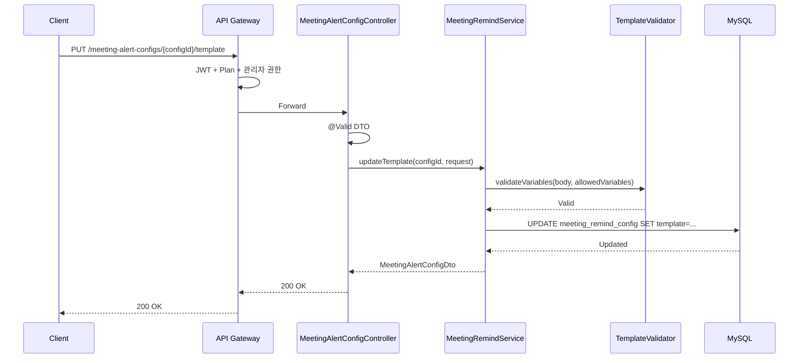

# [GRT-0007] 면접 리마인드 API 구현 (P0)

## 개요
- PRD: https://doodlin.atlassian.net/wiki/x/SICjdg
- 선행 티켓: GRT-0001 (DB Migration), GRT-0002 (Domain Model), GRT-0004 (MeetingRemind Service)

## 작업 내용

### 변경 사항

면접 리마인드 설정 REST API 구현 (엔드포인트 3개).

#### API 목록

| Method | Path | 설명 |
|--------|------|------|
| GET | `/meeting-alert-configs/{configId}` | 리마인드 설정 상세 조회 (enabled, timings, template, targets) |
| PATCH | `/meeting-alert-configs/{configId}/targets` | 발송 대상 수정 (`INTERVIEWER`, `APPLICANT`, `RECRUITER`) — targets 필드만 부분 업데이트 |
| PUT | `/meeting-alert-configs/{configId}/template` | 템플릿 저장 — 허용 변수(`{{applicantName}}` 등) 목록 체크 |

#### Controller
- `MeetingAlertConfigController` 신규 생성
- `configId` 존재 여부 및 워크스페이스 소유 여부 검증

#### DTO

| DTO | 주요 필드 |
|-----|----------|
| `GetMeetingAlertConfigResponse` | `configId`, `enabled`, `remindTimings: List<RemindTiming>`, `template: TemplateDto`, `targets: List<RemindTarget>` |
| `PatchMeetingAlertConfigTargetsRequest` | `targets: List<RemindTarget>` (최소 1개) |
| `PutMeetingAlertConfigTemplateRequest` | `subject: String` (최대 200자), `body: String` (최대 5000자), `variables: List<String>` |

#### Gateway 라우팅
- Path: `/api/v1/meeting-alert-configs/**`
- Plan 체크: STANDARD 이상, JWT Bearer 필수

### 다이어그램

### 수정 파일 목록
| 레포 | 모듈 | 파일 경로 | 변경 유형 |
|------|------|----------|----------|
| greeting-new-back | presentation | `presentation/api/controller/MeetingAlertConfigController.kt` | 신규 |
| greeting-new-back | presentation | `presentation/api/dto/meetingalert/GetMeetingAlertConfigResponse.kt` | 신규 |
| greeting-new-back | presentation | `presentation/api/dto/meetingalert/PatchMeetingAlertConfigTargetsRequest.kt` | 신규 |
| greeting-new-back | presentation | `presentation/api/dto/meetingalert/PutMeetingAlertConfigTemplateRequest.kt` | 신규 |
| greeting-new-back | business | `business/application/port/in/MeetingRemindUseCase.kt` | 수정 (메서드 추가) |
| greeting-new-back | business | `business/application/service/MeetingRemindService.kt` | 수정 (UseCase 구현) |
| greeting-new-back | business | `business/domain/service/TemplateVariableValidator.kt` | 신규 |
| greeting-api-gateway | routes | `routes/meeting-alert-config-routes.kt` | 신규 |

## 영향 범위

- 신규 API 3개 추가, Gateway 라우팅 테이블 변경
- GRT-0010 `MeetingRemindBatchJob`에서 이 설정의 template/targets 참조하여 발송
- FE 면접 리마인드 설정 화면에서 호출
- 신규 API이므로 기존 클라이언트 영향 없음

## 테스트 케이스

### 정상 케이스
| ID | 테스트명 | Given | When | Then |
|----|---------|-------|------|------|
| TC-071 | 리마인드 설정 조회 성공 | configId에 해당하는 설정 존재 | GET /meeting-alert-configs/{configId} 호출 | 200 OK, enabled/timings/template/targets 반환 |
| TC-072 | 리마인드 On/Off 토글 | enabled=true인 설정 존재 | PATCH /meeting-alert-configs/{configId}/targets (enabled=false 포함) | 200 OK, enabled=false로 변경 |
| TC-073 | 발송 대상 변경 성공 | targets=[INTERVIEWER] 설정 | PATCH targets=[INTERVIEWER, APPLICANT] | 200 OK, targets 2개로 변경 |
| TC-074 | 템플릿 저장 성공 | 유효한 template body + 허용 변수 | PUT /meeting-alert-configs/{configId}/template | 200 OK, 템플릿 저장됨 |
| TC-075 | 템플릿 변수 치환 확인 | body에 `{{applicantName}}` 포함 | PUT template 호출 | 200 OK, variables에 applicantName 포함 |

### 예외/엣지 케이스
| ID | 테스트명 | Given | When | Then |
|----|---------|-------|------|------|
| TC-E071 | 존재하지 않는 configId | 없는 configId로 조회 | GET /meeting-alert-configs/99999 | 404 Not Found |
| TC-E072 | 타 워크스페이스 configId 접근 | 다른 워크스페이스 소유 configId | GET /meeting-alert-configs/{otherId} | 403 Forbidden |
| TC-E073 | 허용되지 않은 템플릿 변수 | body에 `{{invalidVar}}` 포함 | PUT template 호출 | 400 Bad Request, 허용되지 않은 변수 |
| TC-E074 | 빈 targets 배열 전송 | targets=[] | PATCH targets | 400 Bad Request, 최소 1개 대상 필요 |
| TC-E075 | 템플릿 body 길이 초과 | body 5001자 이상 | PUT template 호출 | 400 Bad Request, 최대 5000자 |
| TC-E076 | 템플릿 subject 길이 초과 | subject 201자 이상 | PUT template 호출 | 400 Bad Request, 최대 200자 |

## 기대 결과 (Acceptance Criteria)
- [ ] AC 1: GET /meeting-alert-configs/{configId} 호출 시 리마인드 설정(enabled, timings, template, targets)을 정상 반환한다
- [ ] AC 2: PATCH targets 호출 시 발송 대상 목록이 변경되며, 빈 배열은 거부된다
- [ ] AC 3: PUT template 호출 시 템플릿이 저장되며, 허용되지 않은 변수 사용 시 400을 반환한다
- [ ] AC 4: 존재하지 않는 configId 또는 타 워크스페이스 configId 접근 시 404/403을 반환한다
- [ ] AC 5: 템플릿 subject(200자)/body(5000자) 길이 제한이 적용된다
- [ ] AC 6: Gateway 라우팅이 정상 동작하며 Plan 체크 및 JWT 인증이 적용된다

## 체크리스트
- [ ] 빌드 확인
- [ ] 테스트 통과
- [ ] API 문서 업데이트 (Swagger/OpenAPI)
- [ ] Gateway 라우팅 설정 검증
- [ ] 템플릿 변수 허용 목록 확정 확인
- [ ] 하위 호환성 확인
