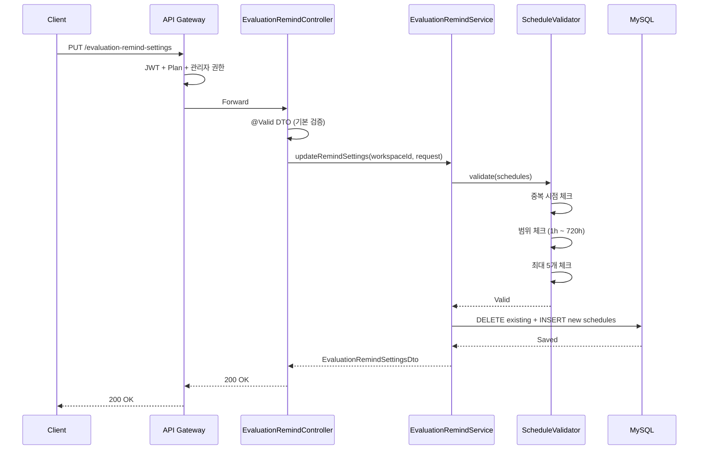

# [GRT-0008] 평가 리마인드 API 구현 (P0+P1)

## 개요
- PRD: https://doodlin.atlassian.net/wiki/x/SICjdg
- 선행 티켓: GRT-0001 (DB Migration), GRT-0002 (Domain Model), GRT-0005 (EvaluationRemind Service)

## 작업 내용

### 변경 사항

평가 리마인드 설정 REST API 구현 (엔드포인트 2개). 면접 완료 후 N시간/N일 뒤 평가 미제출자 대상 복수 리마인드 스케줄 등록 지원.

#### API 목록

| Priority | Method | Path | 설명 |
|----------|--------|------|------|
| P0 | GET | `/evaluation-remind-settings` | 평가 리마인드 설정 조회 (`enabled`, `schedules`, `maxRemindCount`) |
| P0 | PUT | `/evaluation-remind-settings` | 설정 변경 — `enabled`, `schedules: List<RemindSchedule>` |

`RemindSchedule`: `{ offsetValue: Int, offsetUnit: OffsetUnit(HOUR|DAY), channels: List<AlertChannel> }`

#### 주요 제약

| 항목 | 규칙 |
|------|------|
| 최대 스케줄 수 | 5개 |
| offsetValue | > 0 |
| offsetUnit | HOUR 또는 DAY만 허용 |
| 허용 범위 | 1시간 이상, 720시간(30일) 이하 |
| 중복 시점 | 시간 환산 후 동일 값 거부 (예: 24HOUR == 1DAY) |

- **P0**: HOUR, DAY 프리셋 지원
- **P1 확장**: `offsetValue + offsetUnit` 자유 입력

#### Gateway 라우팅
- Path: `/api/v1/evaluation-remind-settings`
- Plan 체크: STANDARD 이상, JWT Bearer 필수

### 다이어그램

### 수정 파일 목록
| 레포 | 모듈 | 파일 경로 | 변경 유형 |
|------|------|----------|----------|
| greeting-new-back | presentation | `presentation/api/controller/EvaluationRemindController.kt` | 신규 |
| greeting-new-back | presentation | `presentation/api/dto/evaluationremind/GetEvaluationRemindSettingsResponse.kt` | 신규 |
| greeting-new-back | presentation | `presentation/api/dto/evaluationremind/PutEvaluationRemindSettingsRequest.kt` | 신규 |
| greeting-new-back | presentation | `presentation/api/dto/evaluationremind/RemindScheduleDto.kt` | 신규 |
| greeting-new-back | business | `business/application/port/in/EvaluationRemindUseCase.kt` | 수정 (메서드 추가) |
| greeting-new-back | business | `business/application/service/EvaluationRemindService.kt` | 수정 (UseCase 구현) |
| greeting-new-back | business | `business/domain/service/RemindScheduleValidator.kt` | 신규 |
| greeting-new-back | business | `business/domain/model/OffsetUnit.kt` | 신규 (enum) |
| greeting-api-gateway | routes | `routes/evaluation-remind-routes.kt` | 신규 |

## 영향 범위

- 신규 API 2개 추가, Gateway 라우팅 테이블 변경
- GRT-0010 `EvaluationRemindBatchJob`에서 이 설정의 `schedules` 참조하여 배치 발송 시점 결정
- 스케줄 변경 시 기존 예약된 리마인드 재계산 필요 → GRT-0010에서 처리
- 신규 API이므로 기존 클라이언트 영향 없음
- P1 확장 시 기존 P0 스케줄 데이터와 호환 유지 (`offsetUnit` 필드 추가)

## 테스트 케이스

### 정상 케이스
| ID | 테스트명 | Given | When | Then |
|----|---------|-------|------|------|
| TC-081 | 평가 리마인드 설정 조회 성공 | 워크스페이스에 remind 설정 존재 | GET /evaluation-remind-settings | 200 OK, enabled/schedules 반환 |
| TC-082 | 단일 스케줄 저장 성공 | 관리자 권한, schedules=[{1, HOUR}] | PUT /evaluation-remind-settings | 200 OK, 1개 스케줄 저장 |
| TC-083 | 복수 스케줄 저장 성공 | schedules=[{1,HOUR},{24,HOUR},{3,DAY}] | PUT /evaluation-remind-settings | 200 OK, 3개 스케줄 저장 |
| TC-084 | 기존 스케줄 교체 | 2개 스케줄 기존 → 3개 스케줄 새로 | PUT /evaluation-remind-settings | 200 OK, 기존 삭제 + 신규 3개 저장 |
| TC-085 | 설정 없는 워크스페이스 조회 | 설정 미존재 | GET /evaluation-remind-settings | 200 OK, 기본값(enabled=true, 기본 1개 스케줄) 반환 |

### 예외/엣지 케이스
| ID | 테스트명 | Given | When | Then |
|----|---------|-------|------|------|
| TC-E081 | 중복 시점 거부 | schedules=[{1,HOUR},{1,HOUR}] | PUT /evaluation-remind-settings | 400 Bad Request, 중복 시점 불가 |
| TC-E082 | 최대 개수 초과 | schedules 6개 | PUT /evaluation-remind-settings | 400 Bad Request, 최대 5개 |
| TC-E083 | 빈 스케줄 배열 | schedules=[] | PUT /evaluation-remind-settings | 400 Bad Request, 최소 1개 필요 |
| TC-E084 | 범위 초과 (하한) | offsetValue=0, offsetUnit=HOUR | PUT /evaluation-remind-settings | 400 Bad Request, 최소 1시간 |
| TC-E085 | 범위 초과 (상한) | offsetValue=31, offsetUnit=DAY | PUT /evaluation-remind-settings | 400 Bad Request, 최대 30일 |
| TC-E086 | 잘못된 offsetUnit | offsetUnit="MINUTE" | PUT /evaluation-remind-settings | 400 Bad Request, HOUR/DAY만 허용 |
| TC-E087 | 음수 offsetValue | offsetValue=-1 | PUT /evaluation-remind-settings | 400 Bad Request |
| TC-E088 | 24HOUR와 1DAY 중복 감지 | schedules=[{24,HOUR},{1,DAY}] | PUT /evaluation-remind-settings | 400 Bad Request, 시간 환산 후 중복 |

## 기대 결과 (Acceptance Criteria)
- [ ] AC 1: GET /evaluation-remind-settings 호출 시 현재 워크스페이스의 리마인드 설정(enabled, schedules)을 정상 반환한다
- [ ] AC 2: PUT 호출 시 복수 스케줄(최대 5개)을 저장할 수 있으며, 기존 스케줄은 교체된다
- [ ] AC 3: 동일 시점(시간 환산 후 동일 값) 중복 스케줄은 400으로 거부된다
- [ ] AC 4: offsetValue 범위(1시간~720시간)를 벗어나는 입력은 400으로 거부된다
- [ ] AC 5: 빈 배열, 6개 이상 스케줄, 음수 값, 잘못된 unit 등 잘못된 입력 시 400을 반환한다
- [ ] AC 6: (P1) 시간 단위 자유 입력이 가능하며, 환산 로직으로 범위 검증이 동작한다

## 체크리스트
- [ ] 빌드 확인
- [ ] 테스트 통과
- [ ] API 문서 업데이트 (Swagger/OpenAPI)
- [ ] Gateway 라우팅 설정 검증
- [ ] P0/P1 경계 기능 플래그 또는 분기 확인
- [ ] 하위 호환성 확인
