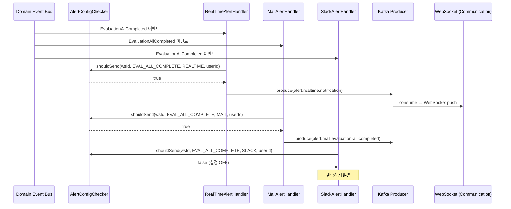
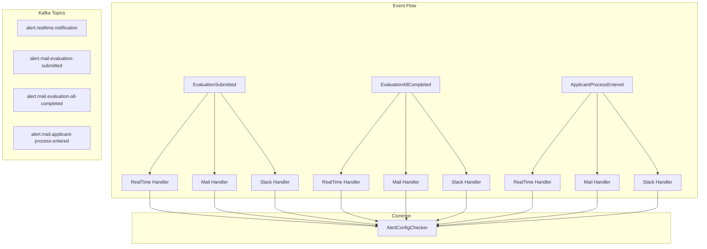

# [GRT-0009] 신규 EventHandler 구현

## 개요
- PRD: https://doodlin.atlassian.net/wiki/x/SICjdg
- 선행 티켓: GRT-0001 (DB Migration), GRT-0002 (Domain Model), GRT-0003 (AlertConfig Service), GRT-0006 (AlertConfig API)

## 작업 내용

### 변경 사항

- 3개 신규 도메인 이벤트의 `AlertEventHandler` 구현
- 각 이벤트 × RealTime(WebSocket)/Mail/Slack 3채널 → 핸들러 9개
- `AlertConfigChecker` 공통화 — AlertConfig + AdminOverride 체크
- Kafka Producer로 4개 신규 토픽 발행

#### 1. 신규 이벤트 정의

| 이벤트명 | 트리거 조건 | 알림 내용 |
|---------|-----------|----------|
| `EvaluationSubmitted` | 개별 평가자가 평가를 제출했을 때 | "홍길동님이 [지원자명] 평가를 등록했습니다" |
| `EvaluationAllCompleted` | 전체 배정 평가자가 평가를 완료했을 때 | "[지원자명]의 전체 평가가 완료되었습니다" |
| `ApplicantProcessEntered` | 지원자가 특정 전형에 진입했을 때 | "[지원자명]이 [전형명] 전형에 진입했습니다" |

#### 2. EventHandler 확장 구조

각 이벤트별 3개 채널 핸들러:

```
EvaluationSubmitted
  ├── EvaluationSubmittedRealTimeAlertHandler  → WebSocket 푸시
  ├── EvaluationSubmittedMailAlertHandler       → 이메일 발송 Kafka 토픽 발행
  └── EvaluationSubmittedSlackAlertHandler      → Slack 메시지 Kafka 토픽 발행

EvaluationAllCompleted
  ├── EvaluationAllCompletedRealTimeAlertHandler
  ├── EvaluationAllCompletedMailAlertHandler
  └── EvaluationAllCompletedSlackAlertHandler

ApplicantProcessEntered
  ├── ApplicantProcessEnteredRealTimeAlertHandler
  ├── ApplicantProcessEnteredMailAlertHandler
  └── ApplicantProcessEnteredSlackAlertHandler
```

#### 3. 알림 설정 체크 로직 공통화

`AlertConfigChecker` 공통 서비스 구현:

```kotlin
interface AlertConfigChecker {
    /**
     * 알림 발송 여부를 결정한다.
     * 1. AlertConfig(워크스페이스 전역 설정) 체크
     * 2. AdminOverride(관리자 강제 설정) 체크
     * 3. 개인 설정(멤버별 On/Off) 체크
     * 우선순위: AdminOverride > AlertConfig > 개인 설정
     */
    fun shouldSend(
        workspaceId: Long,
        alertType: AlertType,
        channel: AlertChannel,
        recipientUserId: Long
    ): Boolean
}
```

#### 4. Kafka Producer: 4개 신규 토픽

| 토픽명 | Producer 이벤트 | Consumer 서비스 |
|--------|---------------|----------------|
| `alert.realtime.notification` | RealTime 알림 메시지 | greeting-communication (WebSocket) |
| `alert.mail.evaluation-submitted` | 평가 제출 메일 알림 | greeting-communication (Mail) |
| `alert.mail.evaluation-all-completed` | 전체 평가 완료 메일 알림 | greeting-communication (Mail) |
| `alert.mail.applicant-process-entered` | 전형 진입 메일 알림 | greeting-communication (Mail) |

#### 5. 이벤트 메시지 스키마

```kotlin
// Kafka 메시지 공통 구조
data class AlertMessage(
    val alertId: String,          // UUID, 멱등성 키
    val alertType: AlertType,
    val channel: AlertChannel,
    val workspaceId: Long,
    val recipientUserIds: List<Long>,
    val title: String,
    val body: String,
    val metadata: Map<String, Any>, // 이벤트별 부가 정보
    val createdAt: Instant
)
```

### 다이어그램





### 수정 파일 목록
| 레포 | 모듈 | 파일 경로 | 변경 유형 |
|------|------|----------|----------|
| greeting-new-back | business/domain | `business/domain/event/EvaluationSubmittedEvent.kt` | 신규 |
| greeting-new-back | business/domain | `business/domain/event/EvaluationAllCompletedEvent.kt` | 신규 |
| greeting-new-back | business/domain | `business/domain/event/ApplicantProcessEnteredEvent.kt` | 신규 |
| greeting-new-back | business/application | `business/application/service/AlertConfigChecker.kt` | 신규 |
| greeting-new-back | business/application | `business/application/service/AlertConfigCheckerImpl.kt` | 신규 |
| greeting-new-back | business/application | `business/application/eventhandler/EvaluationSubmittedRealTimeAlertHandler.kt` | 신규 |
| greeting-new-back | business/application | `business/application/eventhandler/EvaluationSubmittedMailAlertHandler.kt` | 신규 |
| greeting-new-back | business/application | `business/application/eventhandler/EvaluationSubmittedSlackAlertHandler.kt` | 신규 |
| greeting-new-back | business/application | `business/application/eventhandler/EvaluationAllCompletedRealTimeAlertHandler.kt` | 신규 |
| greeting-new-back | business/application | `business/application/eventhandler/EvaluationAllCompletedMailAlertHandler.kt` | 신규 |
| greeting-new-back | business/application | `business/application/eventhandler/EvaluationAllCompletedSlackAlertHandler.kt` | 신규 |
| greeting-new-back | business/application | `business/application/eventhandler/ApplicantProcessEnteredRealTimeAlertHandler.kt` | 신규 |
| greeting-new-back | business/application | `business/application/eventhandler/ApplicantProcessEnteredMailAlertHandler.kt` | 신규 |
| greeting-new-back | business/application | `business/application/eventhandler/ApplicantProcessEnteredSlackAlertHandler.kt` | 신규 |
| greeting-new-back | adaptor/kafka | `adaptor/kafka/producer/AlertKafkaProducer.kt` | 신규 |
| greeting-proto | avro | `alert-message.avsc` | 신규 |
| greeting-proto | avro | `alert-realtime-notification.avsc` | 신규 |

## 영향 범위

- 도메인 이벤트 버스에 신규 핸들러 9개 등록, Kafka 토픽 4개 추가
- greeting-communication에 신규 토픽 Consumer 추가 필요 (별도 티켓)
- 기존 평가 제출/완료 판정 로직, 전형 이동 로직에 이벤트 발행 코드 추가 필요
- 기존 이벤트 핸들러 및 Kafka Consumer 영향 없음 (신규 추가만)

## 테스트 케이스

### 정상 케이스
| ID | 테스트명 | Given | When | Then |
|----|---------|-------|------|------|
| TC-091 | 평가 제출 → RealTime 알림 발행 | 알림 설정 ON, REALTIME 채널 활성 | EvaluationSubmitted 이벤트 발행 | alert.realtime.notification 토픽에 메시지 발행됨 |
| TC-092 | 평가 제출 → Mail 알림 발행 | 알림 설정 ON, MAIL 채널 활성 | EvaluationSubmitted 이벤트 발행 | alert.mail.evaluation-submitted 토픽에 메시지 발행됨 |
| TC-093 | 전체 평가 완료 → 3채널 동시 발행 | 모든 채널 ON | EvaluationAllCompleted 이벤트 발행 | 3개 토픽에 각각 메시지 발행됨 |
| TC-094 | 전형 진입 → 구독자에게만 알림 | stage-entry 구독자 3명 | ApplicantProcessEntered 이벤트 발행 | recipientUserIds에 구독자 3명만 포함 |
| TC-095 | AlertConfigChecker 우선순위 동작 | AdminOverride=OFF, 개인설정=ON | shouldSend 호출 | false (AdminOverride 우선) |
| TC-096 | alertId 멱등성 키 포함 | 정상 이벤트 | 핸들러에서 Kafka 발행 | AlertMessage.alertId가 UUID 형식 |

### 예외/엣지 케이스
| ID | 테스트명 | Given | When | Then |
|----|---------|-------|------|------|
| TC-E091 | 알림 설정 OFF → 미발송 | EVALUATION_COMPLETE 알림 설정 OFF | EvaluationAllCompleted 이벤트 발행 | Kafka 메시지 발행되지 않음 |
| TC-E092 | 채널별 독립 OFF | MAIL만 OFF, REALTIME/SLACK은 ON | EvaluationSubmitted 이벤트 | REALTIME+SLACK만 발행, MAIL은 미발행 |
| TC-E093 | 수신 대상자 없음 | 전형 구독자 0명 | ApplicantProcessEntered 이벤트 | 핸들러 호출되나 Kafka 발행 스킵 |
| TC-E094 | 이벤트 핸들러 예외 시 격리 | Mail 핸들러에서 예외 발생 | EvaluationSubmitted 이벤트 | RealTime/Slack 핸들러는 정상 동작 (격리) |
| TC-E095 | 워크스페이스 설정 미존재 | alert_config 레코드 없음 | 이벤트 발행 | 기본값(ON)으로 동작하여 알림 발송 |

## 기대 결과 (Acceptance Criteria)
- [ ] AC 1: EvaluationSubmitted 이벤트 발행 시 RealTime/Mail/Slack 3개 핸들러가 각각 호출된다
- [ ] AC 2: EvaluationAllCompleted 이벤트 발행 시 3개 채널로 알림이 발행된다
- [ ] AC 3: ApplicantProcessEntered 이벤트 발행 시 해당 전형을 구독한 사용자에게만 알림이 발행된다
- [ ] AC 4: AlertConfigChecker가 워크스페이스 설정 > 관리자 오버라이드 > 개인 설정 우선순위로 발송 여부를 결정한다
- [ ] AC 5: 알림 설정 OFF인 경우 해당 채널의 Kafka 메시지가 발행되지 않는다
- [ ] AC 6: 하나의 채널 핸들러 예외가 다른 채널 핸들러에 영향을 미치지 않는다
- [ ] AC 7: Kafka 메시지에 alertId(UUID)가 포함되어 멱등성 처리가 가능하다

## 체크리스트
- [ ] 빌드 확인
- [ ] 테스트 통과
- [ ] Kafka 토픽 생성 스크립트/설정 추가
- [ ] Avro 스키마 등록 (Schema Registry)
- [ ] 이벤트 핸들러 간 예외 격리 확인
- [ ] 하위 호환성 확인
