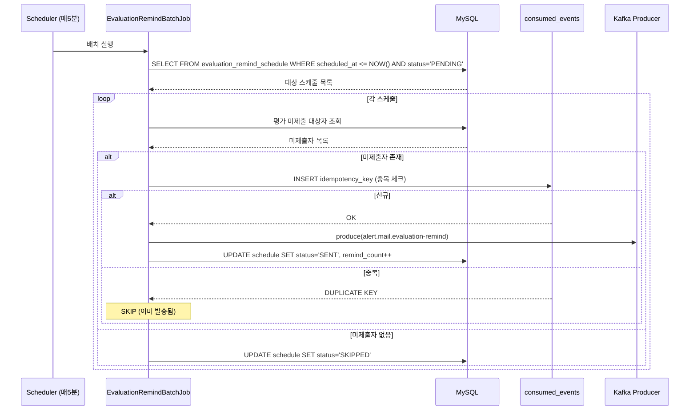
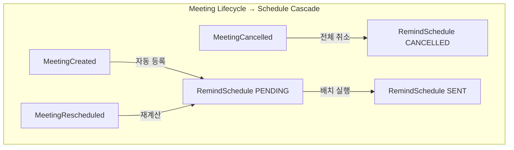

# [GRT-0010] 리마인드 스케줄러/배치 구현

## 개요
- PRD: https://doodlin.atlassian.net/wiki/x/SICjdg
- 선행 티켓: GRT-0001 (DB Migration), GRT-0002 (Domain Model), GRT-0004 (MeetingRemind Service), GRT-0005 (EvaluationRemind Service), GRT-0009 (EventHandler)

## 작업 내용

### 변경 사항

- `EvaluationRemindBatchJob`, `MeetingRemindBatchJob` 고도화
- 스케줄 등록/취소/갱신 cascade 로직 및 멱등성 보장 구현

#### 1. EvaluationRemindBatchJob 고도화

복수 발송 시점과 `remind_count` 지원. **실행 주기: 매 5분**

**처리 로직**:
```
1. evaluation_remind_schedule 테이블에서 scheduled_at <= NOW() AND status = 'PENDING' 레코드 조회
2. 각 스케줄에 대해:
   a. 해당 면접의 평가 미제출 대상자 조회 (evaluatedUserIds 제외)
   b. 미제출 대상자가 없으면 스케줄 상태를 SKIPPED로 변경
   c. 미제출 대상자가 있으면:
      - AlertMessage 생성 (idempotency_key = scheduleId + remind_count)
      - consumed_events 테이블에서 중복 체크
      - 중복이 아니면 Kafka alert 토픽 발행 + consumed_events INSERT
      - remind_count 증가, 다음 스케줄이 있으면 next scheduled_at 계산 후 UPDATE
   d. 스케줄 상태를 SENT로 변경
3. 실패 시 status = 'FAILED', retry_count 증가, 3회 초과 시 DEAD_LETTER
```

**면접 완료 후 N시간 계산**:
```kotlin
// 면접 종료 시각(meetingEndAt) 기준으로 offsetValue * offsetUnit 만큼 더함
val scheduledAt = meeting.endAt.plus(schedule.offsetValue, schedule.offsetUnit.toChronoUnit())
```

#### 2. MeetingRemindBatchJob 변경

`meeting_remind_schedule` 테이블 기반으로 전환. **실행 주기: 매 5분**

**처리 로직**:
```
1. meeting_remind_schedule 테이블에서 scheduled_at <= NOW() AND status = 'PENDING' 조회
2. 각 스케줄에 대해:
   a. 면접 상태 확인 (취소/변경 여부)
   b. 면접이 취소된 경우 → 스케줄 상태 CANCELLED
   c. 면접 일시가 변경된 경우 → scheduled_at 재계산 후 UPDATE
   d. 정상인 경우 → 알림 발송 (템플릿 변수 바인딩 후 Kafka 발행)
3. consumed_events로 중복 발송 방지
```

#### 3. 스케줄 등록/취소/갱신 Cascade 로직

**면접 생성 시** → 리마인드 스케줄 자동 등록:
```kotlin
@EventListener
fun onMeetingCreated(event: MeetingCreatedEvent) {
    val config = meetingRemindConfigRepository.findByWorkspaceId(event.workspaceId)
    if (!config.enabled) return

    config.remindTimings.forEach { timing ->
        meetingRemindScheduleRepository.save(
            MeetingRemindSchedule(
                meetingId = event.meetingId,
                scheduledAt = event.meetingStartAt.minus(timing.offsetValue, timing.offsetUnit),
                status = PENDING
            )
        )
    }
}
```

**면접 취소 시** → 예약된 스케줄 전체 취소:
```kotlin
@EventListener
fun onMeetingCancelled(event: MeetingCancelledEvent) {
    meetingRemindScheduleRepository
        .findAllByMeetingIdAndStatus(event.meetingId, PENDING)
        .forEach { it.cancel() }  // status = CANCELLED
}
```

**면접 일시 변경 시** → 스케줄 재계산:
```kotlin
@EventListener
fun onMeetingRescheduled(event: MeetingRescheduledEvent) {
    val pendingSchedules = meetingRemindScheduleRepository
        .findAllByMeetingIdAndStatus(event.meetingId, PENDING)

    pendingSchedules.forEach { schedule ->
        schedule.reschedule(event.newMeetingStartAt)
    }
}
```

#### 4. 멱등성 보장 메커니즘

**idempotency_key 생성 규칙**:
- 평가 리마인드: `eval-remind:{scheduleId}:{remindCount}`
- 면접 리마인드: `meeting-remind:{scheduleId}`

**consumed_events 테이블**:
```sql
CREATE TABLE consumed_events (
    id BIGINT AUTO_INCREMENT PRIMARY KEY,
    idempotency_key VARCHAR(255) NOT NULL UNIQUE,
    event_type VARCHAR(100) NOT NULL,
    consumed_at DATETIME NOT NULL DEFAULT CURRENT_TIMESTAMP,
    INDEX idx_idempotency_key (idempotency_key),
    INDEX idx_consumed_at (consumed_at)
);
```

**중복 체크 플로우**:
```
1. INSERT INTO consumed_events (idempotency_key, ...) 시도
2. UNIQUE 제약 위반 → 이미 처리됨 → SKIP
3. 정상 INSERT → Kafka 발행 진행
4. Kafka 발행 실패 → consumed_events DELETE (보상 트랜잭션)
```

### 다이어그램





### 수정 파일 목록
| 레포 | 모듈 | 파일 경로 | 변경 유형 |
|------|------|----------|----------|
| greeting-new-back | business/application | `business/application/batch/EvaluationRemindBatchJob.kt` | 수정 (고도화) |
| greeting-new-back | business/application | `business/application/batch/MeetingRemindBatchJob.kt` | 수정 (테이블 기반) |
| greeting-new-back | business/application | `business/application/eventhandler/MeetingCreatedRemindScheduleHandler.kt` | 신규 |
| greeting-new-back | business/application | `business/application/eventhandler/MeetingCancelledRemindScheduleHandler.kt` | 신규 |
| greeting-new-back | business/application | `business/application/eventhandler/MeetingRescheduledRemindScheduleHandler.kt` | 신규 |
| greeting-new-back | business/domain | `business/domain/model/MeetingRemindSchedule.kt` | 수정 (cancel, reschedule 메서드) |
| greeting-new-back | business/domain | `business/domain/model/EvaluationRemindSchedule.kt` | 수정 (remind_count, next 계산) |
| greeting-new-back | adaptor/mysql | `adaptor/mysql/repository/ConsumedEventRepository.kt` | 신규 |
| greeting-new-back | adaptor/mysql | `adaptor/mysql/entity/ConsumedEventEntity.kt` | 신규 |
| greeting-new-back | adaptor/mysql | `adaptor/mysql/repository/MeetingRemindScheduleRepository.kt` | 수정 (쿼리 추가) |
| greeting-new-back | adaptor/mysql | `adaptor/mysql/repository/EvaluationRemindScheduleRepository.kt` | 수정 (쿼리 추가) |

## 영향 범위

- `EvaluationRemindBatchJob`, `MeetingRemindBatchJob` 로직 전면 교체
- 면접 생성/취소/변경 이벤트에 `EventListener` 추가
- 면접 CRUD에 이벤트 발행 코드 추가 필요
- greeting-communication Kafka Consumer에서 리마인드 메일 발송 처리 필요
- 배포 시 기존 스케줄 데이터 마이그레이션 및 ShedLock 중복 방지 설정 확인

## 테스트 케이스

### 정상 케이스
| ID | 테스트명 | Given | When | Then |
|----|---------|-------|------|------|
| TC-101 | 평가 리마인드 배치 - 미제출자에게 발송 | 면접 완료 후 1시간 경과, 미제출 평가자 2명 | 배치 실행 | 2명에게 리마인드 Kafka 메시지 발행, status=SENT |
| TC-102 | 평가 리마인드 배치 - 전원 제출 완료 | 모든 평가자 제출 완료 | 배치 실행 | status=SKIPPED, Kafka 발행 없음 |
| TC-103 | 면접 리마인드 배치 - 정상 발송 | 면접 30분 전 리마인드 스케줄 도래 | 배치 실행 | 리마인드 Kafka 메시지 발행, status=SENT |
| TC-104 | 면접 생성 → 스케줄 자동 등록 | 리마인드 설정 ON, timing=[30분 전, 1시간 전] | 면접 생성 이벤트 | 2개 PENDING 스케줄 생성 |
| TC-105 | 면접 취소 → 스케줄 cascade 취소 | PENDING 스케줄 2개 존재 | 면접 취소 이벤트 | 2개 모두 CANCELLED |
| TC-106 | 면접 일시 변경 → 스케줄 재계산 | 기존 스케줄 scheduled_at=10:00 | 면접 11:00→12:00 변경 | scheduled_at=11:00으로 재계산 |
| TC-107 | 복수 리마인드 - 2차 발송 | 1차 발송 완료(remind_count=1), 2차 스케줄 도래 | 배치 실행 | 2차 발송, remind_count=2 |

### 예외/엣지 케이스
| ID | 테스트명 | Given | When | Then |
|----|---------|-------|------|------|
| TC-E101 | 멱등성 - 동일 스케줄 중복 실행 | 이미 consumed_events에 키 존재 | 배치 재실행 | SKIP, 중복 발송 없음 |
| TC-E102 | Kafka 발행 실패 → 보상 | Kafka Producer 예외 | 배치 실행 | consumed_events 롤백, status 유지(PENDING), retry_count++ |
| TC-E103 | 3회 재시도 초과 → DEAD_LETTER | retry_count=3인 스케줄 | 배치 실행 | status=DEAD_LETTER, 모니터링 알림 |
| TC-E104 | 면접 취소 후 배치 실행 | 스케줄 CANCELLED 상태 | 배치 실행 | CANCELLED 스케줄 무시 |
| TC-E105 | 면접 이미 종료된 리마인드 | 면접 시작 시각이 과거 | 배치 실행 | status=EXPIRED, 발송 안 함 |
| TC-E106 | 리마인드 설정 OFF → 스케줄 미등록 | config.enabled=false | 면접 생성 이벤트 | 스케줄 생성 안 됨 |
| TC-E107 | 동시 배치 실행 방지 | ShedLock 활성 | 2개 인스턴스 동시 배치 | 1개만 실행, 나머지 스킵 |

## 기대 결과 (Acceptance Criteria)
- [ ] AC 1: EvaluationRemindBatchJob이 매 5분 실행되어 scheduled_at이 도래한 PENDING 스케줄을 처리한다
- [ ] AC 2: 평가 미제출 대상자에게만 리마인드가 발송되며, 전원 제출 시 SKIPPED 처리된다
- [ ] AC 3: MeetingRemindBatchJob이 매 5분 실행되어 meeting_remind_schedule 기반으로 발송한다
- [ ] AC 4: 면접 생성 시 리마인드 설정에 따라 스케줄이 자동 등록된다
- [ ] AC 5: 면접 취소 시 해당 면접의 모든 PENDING 스케줄이 CANCELLED로 변경된다
- [ ] AC 6: 면접 일시 변경 시 PENDING 스케줄의 scheduled_at이 재계산된다
- [ ] AC 7: idempotency_key + consumed_events를 통해 중복 발송이 방지된다
- [ ] AC 8: 3회 재시도 실패 시 DEAD_LETTER 상태로 전환되고 모니터링 알림이 발생한다

## 체크리스트
- [ ] 빌드 확인
- [ ] 테스트 통과
- [ ] ShedLock 설정 확인 (분산 환경 중복 방지)
- [ ] consumed_events 테이블 DDL 확인 (GRT-0001)
- [ ] 배치 실행 주기 설정 (application.yml)
- [ ] 기존 배치잡 → 신규 배치잡 전환 마이그레이션 계획
- [ ] 모니터링 메트릭 추가 (배치 실행 시간, 처리 건수, 실패 건수)
- [ ] 하위 호환성 확인
