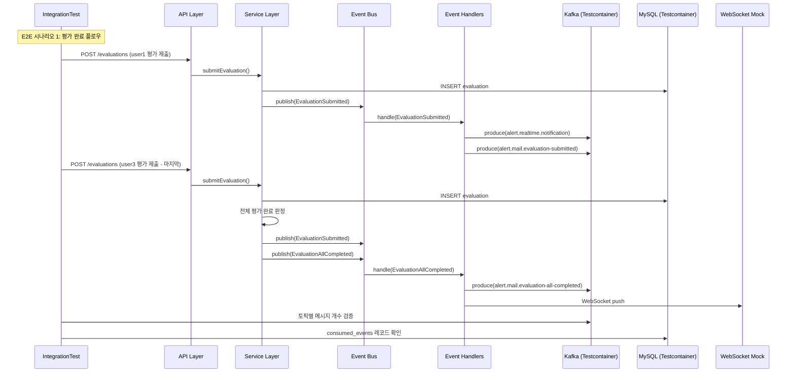

# [GRT-0011] 통합 테스트

## 개요
- PRD: https://doodlin.atlassian.net/wiki/x/SICjdg
- 선행 티켓: GRT-0006 ~ GRT-0010 (모든 구현 티켓 완료 후)

## 작업 내용

### 변경 사항

- 알림 고도화 E2E 시나리오 5개 + Kafka 연동 테스트 구현
- Testcontainers 기반 통합 테스트 환경 구성 (MySQL, Kafka, Redis)

#### 1. E2E 시나리오 1: 평가 제출 → 완료 판정 → 알림 발송 → WebSocket 전달

```
Given:
  - 워크스페이스 A, 공고 B, 면접 C
  - 평가자 3명 배정 (user1, user2, user3)
  - 평가 완료 알림 설정 ON (RealTime + Mail)

When:
  - user1이 평가 제출 → EvaluationSubmitted 이벤트
  - user2가 평가 제출 → EvaluationSubmitted 이벤트
  - user3이 평가 제출 → EvaluationSubmitted + EvaluationAllCompleted 이벤트

Then:
  - EvaluationSubmitted 이벤트 3회 발행 확인
  - EvaluationAllCompleted 이벤트 1회 발행 확인
  - alert.realtime.notification 토픽에 4개 메시지 (3 submitted + 1 completed)
  - alert.mail.evaluation-submitted 토픽에 3개 메시지
  - alert.mail.evaluation-all-completed 토픽에 1개 메시지
  - WebSocket으로 채용담당자에게 실시간 알림 전달 확인
```

#### 2. E2E 시나리오 2: 전형 이동 → 구독자 알림 → 메일 발송

```
Given:
  - 워크스페이스 A, 공고 B, "서류 전형" → "1차 면접" 전형 이동
  - 전형 진입 알림 설정 ON
  - "1차 면접" 전형 구독자: recruiter1, recruiter2
  - recruiter1은 Mail ON, recruiter2는 Mail OFF

When:
  - 지원자 applicant1이 "1차 면접" 전형에 진입

Then:
  - ApplicantProcessEntered 이벤트 1회 발행
  - alert.realtime.notification에 2개 메시지 (recruiter1 + recruiter2)
  - alert.mail.applicant-process-entered에 1개 메시지 (recruiter1만)
  - recruiter2는 메일 미수신 확인
```

#### 3. E2E 시나리오 3: 면접 생성 → 리마인드 예약 → 배치 발송 → 면접 취소 → 스케줄 취소

```
Given:
  - 면접 리마인드 설정 ON, timing=[1시간 전, 30분 전]
  - 면접 시작: 2026-03-17 14:00 KST

When (Phase 1 - 생성):
  - 면접 생성

Then (Phase 1):
  - meeting_remind_schedule에 2개 레코드 생성
    - scheduled_at = 2026-03-17 13:00 (1시간 전)
    - scheduled_at = 2026-03-17 13:30 (30분 전)

When (Phase 2 - 1시간 전 리마인드):
  - 시간 경과하여 13:00 도달, 배치 실행

Then (Phase 2):
  - 1시간 전 스케줄 SENT, Kafka 메시지 발행
  - 30분 전 스케줄은 아직 PENDING

When (Phase 3 - 면접 취소):
  - 면접 취소 이벤트 발행

Then (Phase 3):
  - 30분 전 스케줄 CANCELLED
  - 이미 SENT인 1시간 전 스케줄은 상태 유지
```

#### 4. Kafka 연동 테스트: Producer → Consumer 메시지 흐름

```
Given:
  - Testcontainers Kafka 클러스터
  - 4개 신규 토픽 생성 완료

Test Cases:
  a. AlertKafkaProducer가 AlertMessage를 직렬화하여 정상 발행
  b. Consumer가 메시지를 역직렬화하여 정상 수신
  c. 메시지 키(workspaceId 기반) 파티셔닝 검증
  d. 메시지 스키마(Avro) 호환성 검증
  e. Consumer 장애 시 재시도 + DLQ 동작 확인
```

#### 5. 테스트 인프라 설정

```kotlin
@SpringBootTest
@Testcontainers
abstract class AlertIntegrationTestBase {
    companion object {
        @Container
        val mysql = MySQLContainer("mysql:8.0")

        @Container
        val kafka = KafkaContainer(DockerImageName.parse("confluentinc/cp-kafka:7.5.0"))

        @Container
        val redis = GenericContainer("redis:7.0")
    }
}
```

### 다이어그램



### 수정 파일 목록
| 레포 | 모듈 | 파일 경로 | 변경 유형 |
|------|------|----------|----------|
| greeting-new-back | test | `src/test/kotlin/integration/alert/AlertIntegrationTestBase.kt` | 신규 |
| greeting-new-back | test | `src/test/kotlin/integration/alert/EvaluationCompleteE2ETest.kt` | 신규 |
| greeting-new-back | test | `src/test/kotlin/integration/alert/StageEntryE2ETest.kt` | 신규 |
| greeting-new-back | test | `src/test/kotlin/integration/alert/MeetingRemindE2ETest.kt` | 신규 |
| greeting-new-back | test | `src/test/kotlin/integration/alert/AlertKafkaIntegrationTest.kt` | 신규 |
| greeting-new-back | test | `src/test/kotlin/integration/alert/AlertIdempotencyTest.kt` | 신규 |
| greeting-new-back | test | `src/test/kotlin/integration/alert/fixture/AlertTestFixture.kt` | 신규 |
| greeting-new-back | test | `src/test/resources/application-integration-test.yml` | 신규 |
| greeting-new-back | build | `build.gradle.kts` | 수정 (testcontainers 의존성 추가) |

## 영향 범위

- `build.gradle.kts`에 testcontainers 의존성 추가
- CI/CD 파이프라인에 통합 테스트 스텝 추가, Docker-in-Docker 지원 필요
- Testcontainers 부팅으로 테스트 실행 시간 증가 (목표: 5분 이내)
- 프로덕션 코드 영향 없음

## 테스트 케이스

### E2E 시나리오 테스트
| ID | 테스트명 | Given | When | Then |
|----|---------|-------|------|------|
| TC-111 | 평가 제출 → 완료 판정 → 알림 발송 | 평가자 3명 배정, 알림 ON | 3명 순차 평가 제출 | EvaluationSubmitted 3회 + EvaluationAllCompleted 1회, Kafka 메시지 정상 |
| TC-112 | 전형 이동 → 구독자 알림 | 전형 구독자 2명, 1명 Mail OFF | 지원자 전형 진입 | RealTime 2명, Mail 1명에게만 발송 |
| TC-113 | 면접 생성 → 리마인드 예약 | 리마인드 ON, timing 2개 | 면접 생성 | 2개 PENDING 스케줄 생성 |
| TC-114 | 리마인드 배치 발송 | PENDING 스케줄 도래 | 배치 실행 | Kafka 발행 + status=SENT |
| TC-115 | 면접 취소 → 스케줄 cascade 취소 | PENDING 스케줄 존재 | 면접 취소 | 모든 PENDING → CANCELLED |

### Kafka 연동 테스트
| ID | 테스트명 | Given | When | Then |
|----|---------|-------|------|------|
| TC-116 | Producer 직렬화/발행 | AlertMessage 객체 | produce() | Kafka 토픽에 메시지 존재 |
| TC-117 | Consumer 역직렬화/수신 | 토픽에 메시지 존재 | consume() | AlertMessage 정상 역직렬화 |
| TC-118 | 파티셔닝 검증 | 동일 workspaceId 메시지 2개 | produce() 2회 | 같은 파티션에 적재 |
| TC-119 | 멱등성 검증 | 동일 idempotency_key로 2회 발행 시도 | 배치 2회 실행 | consumed_events 1건, Kafka 1건 |
| TC-120 | DLQ 동작 확인 | Consumer 처리 3회 실패 | consume() 재시도 | DLQ 토픽으로 이동 |

### 예외/엣지 케이스
| ID | 테스트명 | Given | When | Then |
|----|---------|-------|------|------|
| TC-E111 | 알림 설정 OFF 시 E2E | 모든 알림 OFF | 평가 제출 | 이벤트 발행되나 Kafka 메시지 0건 |
| TC-E112 | 동시 평가 제출 Race Condition | 2명 동시 제출 (마지막 2명) | 동시 submitEvaluation() | EvaluationAllCompleted 정확히 1회만 발행 |
| TC-E113 | 배치 중 DB 장애 | DB 일시 중단 | 배치 실행 | 예외 처리 후 다음 실행에서 재처리 |

## 기대 결과 (Acceptance Criteria)
- [ ] AC 1: 평가 제출 → 완료 판정 → 알림 발송 → WebSocket 전달 E2E 시나리오가 정상 통과한다
- [ ] AC 2: 전형 이동 → 구독자 알림 → 메일 발송 E2E 시나리오가 정상 통과한다
- [ ] AC 3: 면접 생성 → 리마인드 예약 → 배치 발송 → 면접 취소 → 스케줄 취소 E2E 시나리오가 정상 통과한다
- [ ] AC 4: Kafka Producer → Consumer 메시지 흐름이 정상 동작한다
- [ ] AC 5: 멱등성 키를 통한 중복 발송 방지가 검증된다
- [ ] AC 6: 동시 평가 제출 시 EvaluationAllCompleted가 정확히 1회만 발행된다
- [ ] AC 7: 모든 테스트가 Testcontainers 기반으로 독립 실행 가능하다

## 체크리스트
- [ ] 빌드 확인
- [ ] 테스트 통과
- [ ] Testcontainers 의존성 추가 (build.gradle.kts)
- [ ] CI/CD 파이프라인에 Docker-in-Docker 지원 확인
- [ ] 테스트 실행 시간 측정 (5분 이내 목표)
- [ ] 테스트 데이터 격리 확인 (테스트 간 간섭 없음)
