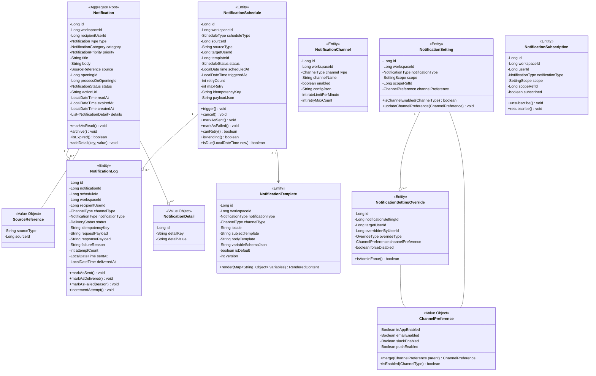
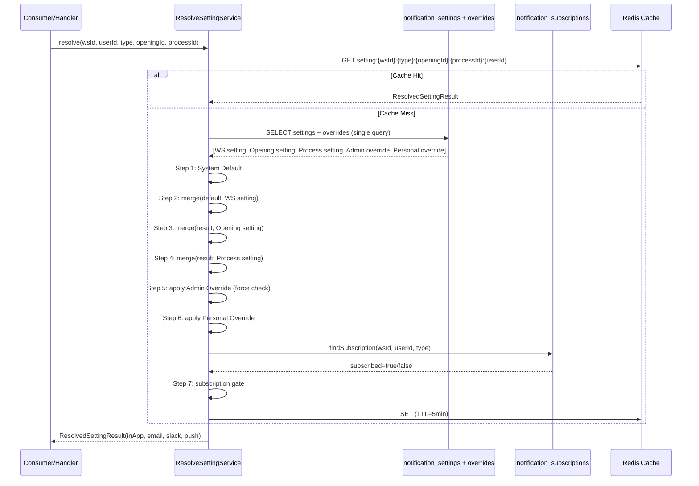

# [알림 시스템 리팩토링] Part 1 - ERD & 도메인 모델 설계

> 작성일: 2026-03-17
> 목적: 기존 알림 시스템 전면 교체 (Node.js 2서버 제거, Spring Boot 단일 서비스로 통합)
> 이전 문서: [2026-03-16 알림 고도화 TDD](../2026-03-16_notification-enhancement/tdd.md)

---

## 1. AS-IS 테이블 폐기 대상

| # | 테이블 | 폐기 사유 |
|---|--------|----------|
| 1 | `alerts` | data(JSON) 비정규화, 필터링 불가, 카테고리/소스 추적 없음 |
| 2 | `details_on_alert` | alerts.data JSON 종속, 정규화된 새 구조로 대체 |
| 3 | `alert_configs` | user_id+alert_function 복합PK, 관리자 제어 불가, 계층화 없음 |
| 4 | `evaluation_remind_settings` | 패턴 불일치, 스케줄 테이블 없어 배치 전체 스캔 |
| 5 | `meeting_system_alert_configuration` | 면접 알림 전용 분리 테이블, 통합 설정 체계로 대체 |
| 6 | `AlertFunctions` enum (Java) | 하드코딩된 9개 함수, 확장 불가 |

**폐기 서비스:**
| 서비스 | 기술 스택 | 대체 |
|--------|----------|------|
| `greeting-notification-server` | NestJS, Kafka Consumer, @socket.io/redis-emitter | `greeting-notification-service` (Spring Boot) |
| `greeting-alert-server` | NestJS, Socket.io, Redis Subscribe | `greeting-notification-service` (Spring Boot + WebSocket) |

---

## 2. TO-BE ERD (Complete Redesign)

```mermaid
erDiagram
    %% ============================================
    %% Core: 알림 본체
    %% ============================================
    notifications {
        bigint id PK "AUTO_INCREMENT"
        bigint workspace_id "NOT NULL, INDEX"
        bigint recipient_user_id "NOT NULL, INDEX"
        varchar_50 notification_type "NOT NULL (ENUM)"
        varchar_50 category "NOT NULL (EVALUATION|STAGE|MEETING|SYSTEM|MENTION|MAIL)"
        varchar_50 priority "NOT NULL DEFAULT NORMAL (LOW|NORMAL|HIGH|URGENT)"
        varchar_255 title "NOT NULL"
        text body "NULL"
        varchar_50 source_type "NULL (APPLICANT|MEETING|EVALUATION|OPENING|SYSTEM)"
        bigint source_id "NULL"
        bigint opening_id "NULL, INDEX"
        bigint process_on_opening_id "NULL"
        varchar_20 status "NOT NULL DEFAULT UNREAD (UNREAD|READ|ARCHIVED)"
        varchar_500 action_url "NULL"
        timestamp read_at "NULL"
        timestamp expired_at "NULL"
        timestamp created_at "NOT NULL DEFAULT CURRENT_TIMESTAMP"
    }

    notification_details {
        bigint id PK "AUTO_INCREMENT"
        bigint notification_id FK "NOT NULL, UNIQUE per (notification_id, detail_key)"
        varchar_100 detail_key "NOT NULL"
        text detail_value "NOT NULL"
    }

    %% ============================================
    %% Settings: 계층화 설정 체계
    %% ============================================
    notification_settings {
        bigint id PK "AUTO_INCREMENT"
        bigint workspace_id "NOT NULL"
        varchar_50 notification_type "NOT NULL"
        varchar_20 scope "NOT NULL (WORKSPACE|OPENING|PROCESS)"
        bigint scope_ref_id "NULL (opening_id or process_on_opening_id)"
        boolean in_app_enabled "NOT NULL DEFAULT TRUE"
        boolean email_enabled "NOT NULL DEFAULT TRUE"
        boolean slack_enabled "NOT NULL DEFAULT FALSE"
        boolean push_enabled "NOT NULL DEFAULT FALSE"
        timestamp created_at "NOT NULL"
        timestamp updated_at "NOT NULL"
    }

    notification_setting_overrides {
        bigint id PK "AUTO_INCREMENT"
        bigint notification_setting_id FK "NOT NULL"
        bigint target_user_id "NOT NULL"
        bigint overridden_by_user_id "NOT NULL"
        varchar_20 override_type "NOT NULL (ADMIN_FORCE|PERSONAL)"
        boolean in_app_enabled "NULL (NULL=inherit)"
        boolean email_enabled "NULL (NULL=inherit)"
        boolean slack_enabled "NULL (NULL=inherit)"
        boolean push_enabled "NULL (NULL=inherit)"
        boolean force_disabled "NOT NULL DEFAULT FALSE"
        timestamp created_at "NOT NULL"
        timestamp updated_at "NOT NULL"
    }

    %% ============================================
    %% Channels: 채널 추상화
    %% ============================================
    notification_channels {
        bigint id PK "AUTO_INCREMENT"
        bigint workspace_id "NOT NULL"
        varchar_30 channel_type "NOT NULL (IN_APP|EMAIL|SLACK|PUSH|WEBHOOK)"
        varchar_100 channel_name "NOT NULL"
        boolean enabled "NOT NULL DEFAULT TRUE"
        text config_json "NULL (channel-specific config)"
        int rate_limit_per_minute "NOT NULL DEFAULT 60"
        int retry_max_count "NOT NULL DEFAULT 3"
        timestamp created_at "NOT NULL"
        timestamp updated_at "NOT NULL"
    }

    %% ============================================
    %% Templates: 메일/Slack 템플릿
    %% ============================================
    notification_templates {
        bigint id PK "AUTO_INCREMENT"
        bigint workspace_id "NULL (NULL=system default)"
        varchar_50 notification_type "NOT NULL"
        varchar_30 channel_type "NOT NULL (EMAIL|SLACK|PUSH)"
        varchar_20 locale "NOT NULL DEFAULT ko_KR"
        varchar_255 subject_template "NULL"
        text body_template "NOT NULL"
        text variable_schema_json "NOT NULL (available variables definition)"
        boolean is_default "NOT NULL DEFAULT FALSE"
        int version "NOT NULL DEFAULT 1"
        timestamp created_at "NOT NULL"
        timestamp updated_at "NOT NULL"
    }

    %% ============================================
    %% Schedules: 스케줄 기반 리마인드
    %% ============================================
    notification_schedules {
        bigint id PK "AUTO_INCREMENT"
        bigint workspace_id "NOT NULL, INDEX"
        varchar_50 schedule_type "NOT NULL (MEETING_REMIND|EVALUATION_REMIND|CUSTOM)"
        bigint source_id "NOT NULL (meeting_id or evaluation_assignment_id)"
        varchar_50 source_type "NOT NULL (MEETING|EVALUATION)"
        bigint target_user_id "NOT NULL"
        bigint template_id FK "NULL"
        varchar_20 status "NOT NULL DEFAULT PENDING (PENDING|TRIGGERED|SENT|CANCELLED|FAILED)"
        timestamp scheduled_at "NOT NULL, INDEX"
        timestamp triggered_at "NULL"
        int retry_count "NOT NULL DEFAULT 0"
        int max_retry "NOT NULL DEFAULT 3"
        varchar_36 idempotency_key "NOT NULL, UNIQUE"
        text payload_json "NULL (extra context for template rendering)"
        timestamp created_at "NOT NULL"
        timestamp updated_at "NOT NULL"
    }

    notification_schedule_configs {
        bigint id PK "AUTO_INCREMENT"
        bigint workspace_id "NOT NULL"
        varchar_50 schedule_type "NOT NULL"
        bigint opening_id "NULL"
        bigint process_on_opening_id "NULL"
        boolean enabled "NOT NULL DEFAULT TRUE"
        int remind_offset_minutes "NOT NULL (negative=before, positive=after)"
        int repeat_interval_minutes "NULL (NULL=one-shot)"
        int repeat_max_count "NOT NULL DEFAULT 1"
        bigint template_id FK "NULL"
        timestamp created_at "NOT NULL"
        timestamp updated_at "NOT NULL"
    }

    %% ============================================
    %% Subscriptions: 전형/공고별 구독
    %% ============================================
    notification_subscriptions {
        bigint id PK "AUTO_INCREMENT"
        bigint workspace_id "NOT NULL"
        bigint user_id "NOT NULL"
        varchar_50 notification_type "NOT NULL"
        varchar_20 scope "NOT NULL (WORKSPACE|OPENING|PROCESS)"
        bigint scope_ref_id "NULL"
        boolean subscribed "NOT NULL DEFAULT TRUE"
        timestamp created_at "NOT NULL"
        timestamp updated_at "NOT NULL"
    }

    %% ============================================
    %% Logs: 발송 이력/감사
    %% ============================================
    notification_logs {
        bigint id PK "AUTO_INCREMENT"
        bigint notification_id FK "NULL"
        bigint schedule_id FK "NULL"
        bigint workspace_id "NOT NULL"
        bigint recipient_user_id "NOT NULL"
        varchar_30 channel_type "NOT NULL"
        varchar_50 notification_type "NOT NULL"
        varchar_20 status "NOT NULL (PENDING|SENT|DELIVERED|FAILED|BOUNCED)"
        varchar_36 idempotency_key "NOT NULL, UNIQUE"
        text request_payload "NULL"
        text response_payload "NULL"
        text failure_reason "NULL"
        int attempt_count "NOT NULL DEFAULT 1"
        timestamp sent_at "NULL"
        timestamp delivered_at "NULL"
        timestamp created_at "NOT NULL"
    }

    %% ============================================
    %% Idempotency: 멱등성 보장
    %% ============================================
    notification_processed_events {
        varchar_36 event_id PK "UUID"
        varchar_100 event_type "NOT NULL"
        varchar_20 status "NOT NULL (PROCESSED|FAILED)"
        timestamp processed_at "NOT NULL"
        timestamp created_at "NOT NULL DEFAULT CURRENT_TIMESTAMP"
    }

    %% ============================================
    %% Relations
    %% ============================================
    notifications ||--o{ notification_details : "has details"
    notifications ||--o{ notification_logs : "has logs"
    notification_settings ||--o{ notification_setting_overrides : "has overrides"
    notification_schedules ||--o{ notification_logs : "has logs"
    notification_schedules }o--|| notification_templates : "uses template"
    notification_schedule_configs }o--|| notification_templates : "default template"
```



### 2.1 notification_type 열거값 (기존 AlertFunctions 대체)

| notification_type | 설명 | 기존 매핑 |
|---|---|---|
| `APPLICANT_REGISTERED` | 지원자 등록 | AlertFunctions.APPLICANT_REGISTERED |
| `EVALUATION_SUBMITTED` | 개별 평가 등록 | 신규 |
| `EVALUATION_ALL_COMPLETED` | 전체 평가 완료 | 신규 |
| `STAGE_ENTERED` | 전형 진입 | 신규 |
| `MEETING_SCHEDULED` | 면접 일정 확정 | AlertFunctions.MEETING |
| `MEETING_REMIND` | 면접 리마인드 | MeetingSystemAlertConfiguration |
| `EVALUATION_REMIND` | 평가 리마인드 | EvaluationRemindSettings |
| `MAIL_RECEIVED` | 메일 수신 | AlertFunctions.RECEIVE_MAIL |
| `MENTION` | 멘션 | AlertFunctions.MENTION |
| `SYSTEM_NOTICE` | 시스템 공지 | AlertFunctions.SYSTEM |
| `APPLICANT_STATUS_CHANGED` | 지원자 상태 변경 | 신규 |
| `OPENING_DEADLINE` | 공고 마감 임박 | 신규 |

### 2.2 인덱스 전략

| 테이블 | 인덱스 | 타입 | 목적 |
|---|---|---|---|
| `notifications` | `(workspace_id, recipient_user_id, status, created_at DESC)` | Composite | 사용자별 안읽은 알림 목록 (메인 쿼리) |
| `notifications` | `(workspace_id, category, created_at DESC)` | Composite | 카테고리별 알림 목록 |
| `notifications` | `(source_type, source_id)` | Composite | 소스 기반 역추적 |
| `notifications` | `(expired_at)` | Partial (WHERE expired_at IS NOT NULL) | 만료 알림 정리 배치 |
| `notification_settings` | `(workspace_id, notification_type, scope, scope_ref_id)` | UNIQUE | 설정 조회 (계층 resolve) |
| `notification_setting_overrides` | `(notification_setting_id, target_user_id)` | UNIQUE | 사용자별 오버라이드 조회 |
| `notification_schedules` | `(status, scheduled_at)` | Composite | 스케줄러 폴링 (핵심 쿼리) |
| `notification_schedules` | `(workspace_id, source_type, source_id, status)` | Composite | 소스 변경 시 cascade 취소 |
| `notification_schedules` | `(idempotency_key)` | UNIQUE | 멱등성 보장 |
| `notification_logs` | `(workspace_id, created_at DESC)` | Composite | 발송 이력 조회 |
| `notification_logs` | `(idempotency_key)` | UNIQUE | 중복 발송 방지 |
| `notification_subscriptions` | `(workspace_id, user_id, notification_type, scope, scope_ref_id)` | UNIQUE | 구독 조회 |
| `notification_processed_events` | `(event_id)` | PK | Kafka 멱등성 |

---

## 3. 도메인 모델 (Clean Architecture)

### 3.1 패키지 구조

```
greeting-notification-service/
  src/main/java/com/doodlin/greeting/notification/
  +-- domain/
  |   +-- model/
  |   |   +-- Notification.java              # 알림 본체 Aggregate Root
  |   |   +-- NotificationDetail.java        # 알림 상세 (정규화된 key-value)
  |   |   +-- NotificationType.java          # enum: 12개 알림 유형
  |   |   +-- NotificationCategory.java      # enum: EVALUATION, STAGE, MEETING, SYSTEM, MENTION, MAIL
  |   |   +-- NotificationPriority.java      # enum: LOW, NORMAL, HIGH, URGENT
  |   |   +-- NotificationStatus.java        # enum: UNREAD, READ, ARCHIVED
  |   |   +-- SourceReference.java           # Value Object: (sourceType, sourceId)
  |   |   +-- NotificationSetting.java       # 설정 엔티티
  |   |   +-- SettingScope.java              # enum: WORKSPACE, OPENING, PROCESS
  |   |   +-- ChannelPreference.java         # Value Object: (inApp, email, slack, push)
  |   |   +-- NotificationSettingOverride.java # 오버라이드 엔티티
  |   |   +-- OverrideType.java              # enum: ADMIN_FORCE, PERSONAL
  |   |   +-- NotificationChannel.java       # 채널 설정 엔티티
  |   |   +-- ChannelType.java               # enum: IN_APP, EMAIL, SLACK, PUSH, WEBHOOK
  |   |   +-- NotificationTemplate.java      # 템플릿 엔티티
  |   |   +-- NotificationSchedule.java      # 스케줄 엔티티
  |   |   +-- ScheduleType.java              # enum: MEETING_REMIND, EVALUATION_REMIND, CUSTOM
  |   |   +-- ScheduleStatus.java            # enum: PENDING, TRIGGERED, SENT, CANCELLED, FAILED
  |   |   +-- NotificationSubscription.java  # 구독 엔티티
  |   |   +-- NotificationLog.java           # 발송 로그 엔티티
  |   |   +-- DeliveryStatus.java            # enum: PENDING, SENT, DELIVERED, FAILED, BOUNCED
  |   |
  |   +-- event/
  |   |   +-- NotificationDomainEvent.java           # sealed interface
  |   |   +-- NotificationCreatedEvent.java
  |   |   +-- NotificationReadEvent.java
  |   |   +-- ScheduleTriggeredEvent.java
  |   |   +-- ScheduleCancelledEvent.java
  |   |   +-- DeliveryCompletedEvent.java
  |   |   +-- DeliveryFailedEvent.java
  |   |
  |   +-- port/
  |   |   +-- in/
  |   |   |   +-- SendNotificationUseCase.java       # 알림 발송 명령
  |   |   |   +-- ReadNotificationUseCase.java        # 알림 읽음 처리
  |   |   |   +-- QueryNotificationUseCase.java       # 알림 목록/카운트 조회
  |   |   |   +-- ManageSettingUseCase.java            # 설정 CRUD
  |   |   |   +-- ResolveSettingUseCase.java           # 계층 설정 resolve
  |   |   |   +-- ManageOverrideUseCase.java           # 관리자 오버라이드
  |   |   |   +-- ManageTemplateUseCase.java           # 템플릿 CRUD
  |   |   |   +-- ManageScheduleUseCase.java           # 스케줄 등록/취소/갱신
  |   |   |   +-- TriggerScheduleUseCase.java          # 스케줄 트리거 (배치용)
  |   |   |   +-- ManageSubscriptionUseCase.java       # 구독 관리
  |   |   |   +-- QueryLogUseCase.java                 # 발송 이력 조회
  |   |   |
  |   |   +-- out/
  |   |       +-- NotificationRepository.java          # 알림 저장/조회
  |   |       +-- NotificationSettingRepository.java   # 설정 저장/조회
  |   |       +-- NotificationOverrideRepository.java  # 오버라이드 저장/조회
  |   |       +-- NotificationChannelRepository.java   # 채널 설정 저장/조회
  |   |       +-- NotificationTemplateRepository.java  # 템플릿 저장/조회
  |   |       +-- NotificationScheduleRepository.java  # 스케줄 저장/조회
  |   |       +-- NotificationSubscriptionRepository.java # 구독 저장/조회
  |   |       +-- NotificationLogRepository.java       # 로그 저장/조회
  |   |       +-- ProcessedEventRepository.java        # 멱등성 이벤트 저장/조회
  |   |       +-- ChannelSender.java                   # 채널별 발송 인터페이스 (Strategy)
  |   |       +-- DomainEventPublisher.java            # 도메인 이벤트 발행
  |   |       +-- TemplateRenderer.java                # 템플릿 렌더링 인터페이스
  |   |       +-- UserQueryPort.java                   # 외부: 사용자/멤버 조회
  |   |       +-- WorkspaceQueryPort.java              # 외부: 워크스페이스 정보 조회
  |   |
  |   +-- service/
  |       +-- NotificationSettingResolver.java   # 계층 설정 resolve 알고리즘
  |       +-- RecipientResolver.java             # 수신자 결정 도메인 서비스
  |       +-- ScheduleCalculator.java            # 스케줄 시점 계산
  |       +-- IdempotencyGuard.java              # 멱등성 체크 도메인 서비스
  |       +-- NotificationFactory.java           # Notification 생성 팩토리
  |
  +-- application/
  |   +-- facade/
  |   |   +-- NotificationFacade.java            # 알림 발송 오케스트레이션
  |   |   +-- NotificationSettingFacade.java     # 설정 관리 오케스트레이션
  |   |   +-- NotificationScheduleFacade.java    # 스케줄 관리 오케스트레이션
  |   |
  |   +-- service/
  |   |   +-- SendNotificationService.java       # implements SendNotificationUseCase
  |   |   +-- ReadNotificationService.java       # implements ReadNotificationUseCase
  |   |   +-- QueryNotificationService.java      # implements QueryNotificationUseCase
  |   |   +-- ManageSettingService.java           # implements ManageSettingUseCase
  |   |   +-- ResolveSettingService.java          # implements ResolveSettingUseCase
  |   |   +-- ManageOverrideService.java          # implements ManageOverrideUseCase
  |   |   +-- ManageTemplateService.java          # implements ManageTemplateUseCase
  |   |   +-- ManageScheduleService.java          # implements ManageScheduleUseCase
  |   |   +-- TriggerScheduleService.java         # implements TriggerScheduleUseCase
  |   |   +-- ManageSubscriptionService.java      # implements ManageSubscriptionUseCase
  |   |   +-- QueryLogService.java                # implements QueryLogUseCase
  |   |
  |   +-- dto/
  |   |   +-- command/
  |   |   |   +-- SendNotificationCommand.java
  |   |   |   +-- ReadNotificationCommand.java
  |   |   |   +-- UpsertSettingCommand.java
  |   |   |   +-- UpsertOverrideCommand.java
  |   |   |   +-- RegisterScheduleCommand.java
  |   |   |   +-- CancelScheduleCommand.java
  |   |   |   +-- UpsertTemplateCommand.java
  |   |   |   +-- SubscribeCommand.java
  |   |   |
  |   |   +-- query/
  |   |   |   +-- NotificationListQuery.java
  |   |   |   +-- UnreadCountQuery.java
  |   |   |   +-- SettingQuery.java
  |   |   |   +-- ScheduleQuery.java
  |   |   |   +-- LogQuery.java
  |   |   |
  |   |   +-- result/
  |   |       +-- NotificationResult.java
  |   |       +-- NotificationListResult.java
  |   |       +-- UnreadCountResult.java
  |   |       +-- ResolvedSettingResult.java
  |   |       +-- ScheduleResult.java
  |   |       +-- LogResult.java
  |   |
  |   +-- eventhandler/
  |       +-- EvaluationSubmittedHandler.java      # Kafka Consumer -> SendNotification
  |       +-- EvaluationAllCompletedHandler.java   # Kafka Consumer -> SendNotification
  |       +-- StageEnteredHandler.java             # Kafka Consumer -> SendNotification
  |       +-- MeetingScheduledHandler.java         # Kafka Consumer -> RegisterSchedule
  |       +-- MeetingCancelledHandler.java         # Kafka Consumer -> CancelSchedule
  |       +-- ApplicantRegisteredHandler.java      # Kafka Consumer -> SendNotification
  |
  +-- infrastructure/
      +-- persistence/
      |   +-- entity/
      |   |   +-- NotificationJpaEntity.java
      |   |   +-- NotificationDetailJpaEntity.java
      |   |   +-- NotificationSettingJpaEntity.java
      |   |   +-- NotificationSettingOverrideJpaEntity.java
      |   |   +-- NotificationChannelJpaEntity.java
      |   |   +-- NotificationTemplateJpaEntity.java
      |   |   +-- NotificationScheduleJpaEntity.java
      |   |   +-- NotificationScheduleConfigJpaEntity.java
      |   |   +-- NotificationSubscriptionJpaEntity.java
      |   |   +-- NotificationLogJpaEntity.java
      |   |   +-- ProcessedEventJpaEntity.java
      |   |
      |   +-- repository/
      |   |   +-- NotificationJpaRepository.java            # Spring Data JPA
      |   |   +-- NotificationRepositoryAdapter.java        # implements port/out
      |   |   +-- NotificationSettingJpaRepository.java
      |   |   +-- NotificationSettingRepositoryAdapter.java
      |   |   +-- ... (각 port/out Repository 대응)
      |   |
      |   +-- mapper/
      |       +-- NotificationEntityMapper.java             # Domain <-> JPA Entity 매핑
      |       +-- SettingEntityMapper.java
      |       +-- ScheduleEntityMapper.java
      |       +-- ...
      |
      +-- messaging/
      |   +-- kafka/
      |   |   +-- consumer/
      |   |   |   +-- NotificationKafkaConsumer.java        # 토픽별 라우팅
      |   |   |   +-- NotificationEventDeserializer.java
      |   |   |
      |   |   +-- producer/
      |   |       +-- DomainEventKafkaPublisher.java         # implements DomainEventPublisher
      |   |       +-- NotificationEventSerializer.java
      |   |
      |   +-- event/
      |       +-- SpringDomainEventPublisher.java            # 내부 Spring Event 발행
      |
      +-- channel/
      |   +-- ChannelSenderFactory.java                     # ChannelType -> Sender 매핑
      |   +-- InAppChannelSender.java                       # implements ChannelSender (WebSocket)
      |   +-- EmailChannelSender.java                       # implements ChannelSender (SMTP)
      |   +-- SlackChannelSender.java                       # implements ChannelSender (Slack API)
      |   +-- PushChannelSender.java                        # implements ChannelSender (FCM/APNs)
      |   +-- WebhookChannelSender.java                     # implements ChannelSender (Generic)
      |
      +-- websocket/
      |   +-- WebSocketNotificationHandler.java             # SockJS/STOMP 기반
      |   +-- WebSocketSessionRegistry.java                 # 사용자별 세션 관리
      |   +-- WebSocketAuthInterceptor.java                 # JWT 인증 (기존 HS256 호환)
      |
      +-- template/
      |   +-- MustacheTemplateRenderer.java                 # implements TemplateRenderer
      |   +-- TemplateVariableProvider.java                 # 변수 바인딩 지원
      |
      +-- scheduler/
      |   +-- ScheduleTriggerJob.java                       # @Scheduled: 매 분 실행
      |   +-- ExpiredNotificationCleanupJob.java            # @Scheduled: 매일 02:00
      |   +-- FailedDeliveryRetryJob.java                   # @Scheduled: 매 5분
      |
      +-- external/
          +-- UserQueryAdapter.java                          # implements UserQueryPort (gRPC/REST)
          +-- WorkspaceQueryAdapter.java                     # implements WorkspaceQueryPort
```

### 3.2 핵심 도메인 모델 클래스 다이어그램



### 3.3 핵심 인터페이스 정의

#### 3.3.1 ChannelSender (채널 추상화)

```java
/**
 * 알림 채널별 발송 전략 인터페이스.
 * 새 채널 추가 시 이 인터페이스를 구현하고 ChannelSenderFactory에 등록만 하면 된다.
 */
public interface ChannelSender {

    ChannelType supportedType();

    /**
     * 단건 발송
     * @return 발송 결과 (성공/실패 + 외부 응답)
     */
    DeliveryResult send(SendRequest request);

    /**
     * 벌크 발송 (기본 구현: 단건 반복)
     */
    default List<DeliveryResult> sendBulk(List<SendRequest> requests) {
        return requests.stream().map(this::send).toList();
    }

    /**
     * 채널 상태 확인 (health check)
     */
    boolean isAvailable();
}

public record SendRequest(
    Long workspaceId,
    Long recipientUserId,
    String recipientAddress,    // email, slackUserId, deviceToken 등
    String subject,
    String body,
    Map<String, Object> metadata,
    String idempotencyKey
) {}

public record DeliveryResult(
    boolean success,
    String externalMessageId,
    String errorMessage,
    Map<String, Object> responseMetadata
) {}
```

#### 3.3.2 TemplateRenderer (템플릿 엔진 추상화)

```java
public interface TemplateRenderer {

    RenderedContent render(NotificationTemplate template, Map<String, Object> variables);

    /**
     * 템플릿 변수 유효성 검증 (저장 시점)
     */
    ValidationResult validate(String templateBody, String variableSchemaJson);
}

public record RenderedContent(
    String subject,
    String body
) {}
```

#### 3.3.3 DomainEventPublisher

```java
public interface DomainEventPublisher {

    void publish(NotificationDomainEvent event);

    void publishAsync(NotificationDomainEvent event);
}
```

#### 3.3.4 핵심 UseCase 인터페이스

```java
public interface SendNotificationUseCase {
    /**
     * 알림 발송 명령 처리.
     * 1. 설정 resolve -> 2. 수신자 결정 -> 3. 채널별 발송 -> 4. 로그 기록
     */
    NotificationResult send(SendNotificationCommand command);
}

public interface ResolveSettingUseCase {
    /**
     * 특정 사용자에 대한 최종 알림 설정을 계층 우선순위에 따라 resolve.
     */
    ResolvedSettingResult resolve(Long workspaceId, Long userId,
                                  NotificationType type,
                                  Long openingId, Long processOnOpeningId);
}

public interface ManageScheduleUseCase {
    ScheduleResult register(RegisterScheduleCommand command);
    void cancel(CancelScheduleCommand command);
    void cancelBySource(String sourceType, Long sourceId);
    void reschedule(Long scheduleId, LocalDateTime newScheduledAt);
}

public interface TriggerScheduleUseCase {
    /**
     * 현재 시각 기준 발송 대상 스케줄을 조회하고 트리거.
     * ScheduleTriggerJob에서 매분 호출.
     */
    int triggerDueSchedules(LocalDateTime now, int batchSize);
}
```

---

## 4. 설정 계층 우선순위 로직 (Setting Resolution Algorithm)

### 4.1 계층 구조

```
Level 0: System Default (코드 내장, DB 없음)
  |
  v
Level 1: Workspace Setting (notification_settings WHERE scope='WORKSPACE')
  |
  v
Level 2: Opening Setting (notification_settings WHERE scope='OPENING')
  |
  v
Level 3: Process Setting (notification_settings WHERE scope='PROCESS')
  |
  v
Level 4: Admin Override (notification_setting_overrides WHERE override_type='ADMIN_FORCE')
  |
  v
Level 5: Personal Override (notification_setting_overrides WHERE override_type='PERSONAL')
```

### 4.2 Resolve 알고리즘

```
function resolveEffectiveSetting(workspaceId, userId, notificationType, openingId, processOnOpeningId):

    // Step 1: 시스템 기본값으로 초기화
    result = ChannelPreference(inApp=true, email=true, slack=false, push=false)

    // Step 2: Workspace 레벨 설정 적용
    wsSetting = findSetting(workspaceId, notificationType, scope=WORKSPACE, scopeRefId=null)
    if wsSetting exists:
        result = result.merge(wsSetting.channelPreference)

    // Step 3: Opening 레벨 설정 적용 (있으면 Workspace 위에 덮어씀)
    if openingId is not null:
        openingSetting = findSetting(workspaceId, notificationType, scope=OPENING, scopeRefId=openingId)
        if openingSetting exists:
            result = result.merge(openingSetting.channelPreference)

    // Step 4: Process 레벨 설정 적용 (있으면 Opening 위에 덮어씀)
    if processOnOpeningId is not null:
        procSetting = findSetting(workspaceId, notificationType, scope=PROCESS, scopeRefId=processOnOpeningId)
        if procSetting exists:
            result = result.merge(procSetting.channelPreference)

    // Step 5: Admin Override 적용 (관리자가 강제 설정한 값)
    //         force_disabled=true이면 모든 채널 강제 비활성화
    adminOverride = findOverride(settingId=현재 적용된 setting의 id, userId, type=ADMIN_FORCE)
    if adminOverride exists:
        if adminOverride.forceDisabled:
            return ChannelPreference(inApp=false, email=false, slack=false, push=false)
        result = result.merge(adminOverride.channelPreference)

    // Step 6: Personal Override 적용 (사용자 본인이 설정한 값)
    //         단, Admin Override가 force인 경우 Personal은 무시됨 (Step 5에서 이미 return)
    personalOverride = findOverride(settingId=현재 적용된 setting의 id, userId, type=PERSONAL)
    if personalOverride exists:
        result = result.merge(personalOverride.channelPreference)

    // Step 7: 구독 확인 (사용자가 해당 알림을 구독하고 있는지)
    subscription = findSubscription(workspaceId, userId, notificationType, scope, scopeRefId)
    if subscription exists AND subscription.subscribed == false:
        return ChannelPreference(inApp=false, email=false, slack=false, push=false)

    return result
```

### 4.3 ChannelPreference.merge() 규칙

```
function merge(parent: ChannelPreference, child: ChannelPreference) -> ChannelPreference:
    // NULL = 상위 설정 상속 (inherit)
    // TRUE/FALSE = 명시적 오버라이드

    return ChannelPreference(
        inApp  = child.inApp  != null ? child.inApp  : parent.inApp,
        email  = child.email  != null ? child.email  : parent.email,
        slack  = child.slack  != null ? child.slack  : parent.slack,
        push   = child.push   != null ? child.push   : parent.push
    )
```

**핵심 원칙:**
- `NULL`은 "상위 설정을 따르겠다"는 의미 (inherit)
- `TRUE/FALSE`는 "이 레벨에서 명시적으로 결정하겠다"는 의미 (override)
- Admin Force가 존재하면 Personal Override보다 우선 (관리자 강제 비활성화)
- 구독(subscription)은 최종 게이트 역할 (구독 취소 시 모든 채널 차단)

### 4.4 설정 조회 쿼리 최적화

```sql
-- 한 번의 쿼리로 모든 계층 설정을 가져온 후 애플리케이션에서 merge
SELECT
    ns.id, ns.scope, ns.scope_ref_id,
    ns.in_app_enabled, ns.email_enabled, ns.slack_enabled, ns.push_enabled,
    nso.id as override_id, nso.override_type, nso.target_user_id,
    nso.in_app_enabled as ov_in_app, nso.email_enabled as ov_email,
    nso.slack_enabled as ov_slack, nso.push_enabled as ov_push,
    nso.force_disabled
FROM notification_settings ns
LEFT JOIN notification_setting_overrides nso
    ON nso.notification_setting_id = ns.id
    AND nso.target_user_id = :userId
WHERE ns.workspace_id = :workspaceId
    AND ns.notification_type = :notificationType
    AND (
        (ns.scope = 'WORKSPACE' AND ns.scope_ref_id IS NULL)
        OR (ns.scope = 'OPENING' AND ns.scope_ref_id = :openingId)
        OR (ns.scope = 'PROCESS' AND ns.scope_ref_id = :processOnOpeningId)
    )
ORDER BY
    FIELD(ns.scope, 'WORKSPACE', 'OPENING', 'PROCESS'),
    FIELD(nso.override_type, 'ADMIN_FORCE', 'PERSONAL');
```

### 4.5 설정 Resolve 시퀀스 다이어그램



---

## 5. Flyway DDL 마이그레이션

### 5.1 마이그레이션 순서

| 버전 | 파일명 | 내용 |
|---|---|---|
| V2026031700 | 새 테이블 생성 (Phase 1: Core) | notifications, notification_details |
| V2026031701 | 새 테이블 생성 (Phase 2: Settings) | notification_settings, notification_setting_overrides |
| V2026031702 | 새 테이블 생성 (Phase 3: Channel/Template) | notification_channels, notification_templates |
| V2026031703 | 새 테이블 생성 (Phase 4: Schedule) | notification_schedules, notification_schedule_configs |
| V2026031704 | 새 테이블 생성 (Phase 5: Subscription/Log) | notification_subscriptions, notification_logs, notification_processed_events |
| V2026031705 | 기존 데이터 마이그레이션 | INSERT INTO ... SELECT from legacy tables |
| V2026031706 | 기존 테이블 RENAME | _deprecated 접미사 |

### 5.2 V2026031700: Core 테이블

```sql
-- =============================================
-- notifications (기존 alerts 대체)
-- =============================================
CREATE TABLE notifications (
    id                    BIGINT       NOT NULL AUTO_INCREMENT,
    workspace_id          BIGINT       NOT NULL,
    recipient_user_id     BIGINT       NOT NULL,
    notification_type     VARCHAR(50)  NOT NULL COMMENT 'APPLICANT_REGISTERED, EVALUATION_SUBMITTED, EVALUATION_ALL_COMPLETED, STAGE_ENTERED, MEETING_SCHEDULED, MEETING_REMIND, EVALUATION_REMIND, MAIL_RECEIVED, MENTION, SYSTEM_NOTICE, APPLICANT_STATUS_CHANGED, OPENING_DEADLINE',
    category              VARCHAR(50)  NOT NULL COMMENT 'EVALUATION, STAGE, MEETING, SYSTEM, MENTION, MAIL',
    priority              VARCHAR(20)  NOT NULL DEFAULT 'NORMAL' COMMENT 'LOW, NORMAL, HIGH, URGENT',
    title                 VARCHAR(255) NOT NULL,
    body                  TEXT         NULL,
    source_type           VARCHAR(50)  NULL COMMENT 'APPLICANT, MEETING, EVALUATION, OPENING, SYSTEM',
    source_id             BIGINT       NULL,
    opening_id            BIGINT       NULL,
    process_on_opening_id BIGINT       NULL,
    status                VARCHAR(20)  NOT NULL DEFAULT 'UNREAD' COMMENT 'UNREAD, READ, ARCHIVED',
    action_url            VARCHAR(500) NULL,
    read_at               TIMESTAMP    NULL,
    expired_at            TIMESTAMP    NULL,
    created_at            TIMESTAMP    NOT NULL DEFAULT CURRENT_TIMESTAMP,
    PRIMARY KEY (id),
    INDEX idx_noti_user_status     (workspace_id, recipient_user_id, status, created_at DESC),
    INDEX idx_noti_category        (workspace_id, category, created_at DESC),
    INDEX idx_noti_source          (source_type, source_id),
    INDEX idx_noti_opening         (opening_id),
    INDEX idx_noti_expired         (expired_at)
) ENGINE=InnoDB DEFAULT CHARSET=utf8mb4 COLLATE=utf8mb4_unicode_ci;

-- =============================================
-- notification_details (기존 details_on_alert 대체, 정규화)
-- =============================================
CREATE TABLE notification_details (
    id              BIGINT       NOT NULL AUTO_INCREMENT,
    notification_id BIGINT       NOT NULL,
    detail_key      VARCHAR(100) NOT NULL,
    detail_value    TEXT         NOT NULL,
    PRIMARY KEY (id),
    UNIQUE INDEX uq_noti_detail (notification_id, detail_key),
    CONSTRAINT fk_detail_notification FOREIGN KEY (notification_id) REFERENCES notifications (id) ON DELETE CASCADE
) ENGINE=InnoDB DEFAULT CHARSET=utf8mb4 COLLATE=utf8mb4_unicode_ci;
```

### 5.3 V2026031701: Settings 테이블

```sql
-- =============================================
-- notification_settings (기존 alert_configs 대체, 계층화)
-- =============================================
CREATE TABLE notification_settings (
    id                BIGINT      NOT NULL AUTO_INCREMENT,
    workspace_id      BIGINT      NOT NULL,
    notification_type VARCHAR(50) NOT NULL,
    scope             VARCHAR(20) NOT NULL COMMENT 'WORKSPACE, OPENING, PROCESS',
    scope_ref_id      BIGINT      NULL COMMENT 'opening_id or process_on_opening_id (NULL for WORKSPACE scope)',
    in_app_enabled    BOOLEAN     NULL COMMENT 'NULL=inherit from parent',
    email_enabled     BOOLEAN     NULL COMMENT 'NULL=inherit from parent',
    slack_enabled     BOOLEAN     NULL COMMENT 'NULL=inherit from parent',
    push_enabled      BOOLEAN     NULL COMMENT 'NULL=inherit from parent',
    created_at        TIMESTAMP   NOT NULL DEFAULT CURRENT_TIMESTAMP,
    updated_at        TIMESTAMP   NOT NULL DEFAULT CURRENT_TIMESTAMP ON UPDATE CURRENT_TIMESTAMP,
    PRIMARY KEY (id),
    UNIQUE INDEX uq_setting (workspace_id, notification_type, scope, scope_ref_id),
    INDEX idx_setting_ws (workspace_id, notification_type)
) ENGINE=InnoDB DEFAULT CHARSET=utf8mb4 COLLATE=utf8mb4_unicode_ci;

-- =============================================
-- notification_setting_overrides (관리자/개인 오버라이드)
-- =============================================
CREATE TABLE notification_setting_overrides (
    id                      BIGINT      NOT NULL AUTO_INCREMENT,
    notification_setting_id BIGINT      NOT NULL,
    target_user_id          BIGINT      NOT NULL,
    overridden_by_user_id   BIGINT      NOT NULL,
    override_type           VARCHAR(20) NOT NULL COMMENT 'ADMIN_FORCE, PERSONAL',
    in_app_enabled          BOOLEAN     NULL COMMENT 'NULL=inherit',
    email_enabled           BOOLEAN     NULL COMMENT 'NULL=inherit',
    slack_enabled           BOOLEAN     NULL COMMENT 'NULL=inherit',
    push_enabled            BOOLEAN     NULL COMMENT 'NULL=inherit',
    force_disabled          BOOLEAN     NOT NULL DEFAULT FALSE COMMENT 'Admin이 모든 채널 강제 비활성화',
    created_at              TIMESTAMP   NOT NULL DEFAULT CURRENT_TIMESTAMP,
    updated_at              TIMESTAMP   NOT NULL DEFAULT CURRENT_TIMESTAMP ON UPDATE CURRENT_TIMESTAMP,
    PRIMARY KEY (id),
    UNIQUE INDEX uq_override (notification_setting_id, target_user_id, override_type),
    INDEX idx_override_user (target_user_id),
    CONSTRAINT fk_override_setting FOREIGN KEY (notification_setting_id) REFERENCES notification_settings (id) ON DELETE CASCADE
) ENGINE=InnoDB DEFAULT CHARSET=utf8mb4 COLLATE=utf8mb4_unicode_ci;
```

### 5.4 V2026031702: Channel/Template 테이블

```sql
-- =============================================
-- notification_channels (채널 추상화)
-- =============================================
CREATE TABLE notification_channels (
    id                   BIGINT       NOT NULL AUTO_INCREMENT,
    workspace_id         BIGINT       NOT NULL,
    channel_type         VARCHAR(30)  NOT NULL COMMENT 'IN_APP, EMAIL, SLACK, PUSH, WEBHOOK',
    channel_name         VARCHAR(100) NOT NULL,
    enabled              BOOLEAN      NOT NULL DEFAULT TRUE,
    config_json          TEXT         NULL COMMENT 'Channel-specific config (slack webhook URL, SMTP settings, etc.)',
    rate_limit_per_minute INT         NOT NULL DEFAULT 60,
    retry_max_count      INT          NOT NULL DEFAULT 3,
    created_at           TIMESTAMP    NOT NULL DEFAULT CURRENT_TIMESTAMP,
    updated_at           TIMESTAMP    NOT NULL DEFAULT CURRENT_TIMESTAMP ON UPDATE CURRENT_TIMESTAMP,
    PRIMARY KEY (id),
    UNIQUE INDEX uq_channel (workspace_id, channel_type),
    INDEX idx_channel_ws (workspace_id)
) ENGINE=InnoDB DEFAULT CHARSET=utf8mb4 COLLATE=utf8mb4_unicode_ci;

-- =============================================
-- notification_templates (메일/Slack 템플릿)
-- =============================================
CREATE TABLE notification_templates (
    id                   BIGINT       NOT NULL AUTO_INCREMENT,
    workspace_id         BIGINT       NULL COMMENT 'NULL=system default template',
    notification_type    VARCHAR(50)  NOT NULL,
    channel_type         VARCHAR(30)  NOT NULL COMMENT 'EMAIL, SLACK, PUSH',
    locale               VARCHAR(20)  NOT NULL DEFAULT 'ko_KR',
    subject_template     VARCHAR(255) NULL,
    body_template        TEXT         NOT NULL,
    variable_schema_json TEXT         NOT NULL COMMENT 'JSON Schema: available template variables',
    is_default           BOOLEAN      NOT NULL DEFAULT FALSE,
    version              INT          NOT NULL DEFAULT 1,
    created_at           TIMESTAMP    NOT NULL DEFAULT CURRENT_TIMESTAMP,
    updated_at           TIMESTAMP    NOT NULL DEFAULT CURRENT_TIMESTAMP ON UPDATE CURRENT_TIMESTAMP,
    PRIMARY KEY (id),
    INDEX idx_template_lookup (workspace_id, notification_type, channel_type, locale),
    INDEX idx_template_default (notification_type, channel_type, is_default)
) ENGINE=InnoDB DEFAULT CHARSET=utf8mb4 COLLATE=utf8mb4_unicode_ci;
```

### 5.5 V2026031703: Schedule 테이블

```sql
-- =============================================
-- notification_schedules (리마인드 스케줄, 배치 전체 스캔 대체)
-- =============================================
CREATE TABLE notification_schedules (
    id              BIGINT      NOT NULL AUTO_INCREMENT,
    workspace_id    BIGINT      NOT NULL,
    schedule_type   VARCHAR(50) NOT NULL COMMENT 'MEETING_REMIND, EVALUATION_REMIND, CUSTOM',
    source_id       BIGINT      NOT NULL COMMENT 'meeting_id or evaluation_assignment_id',
    source_type     VARCHAR(50) NOT NULL COMMENT 'MEETING, EVALUATION',
    target_user_id  BIGINT      NOT NULL,
    template_id     BIGINT      NULL,
    status          VARCHAR(20) NOT NULL DEFAULT 'PENDING' COMMENT 'PENDING, TRIGGERED, SENT, CANCELLED, FAILED',
    scheduled_at    TIMESTAMP   NOT NULL COMMENT 'When to trigger this schedule',
    triggered_at    TIMESTAMP   NULL,
    retry_count     INT         NOT NULL DEFAULT 0,
    max_retry       INT         NOT NULL DEFAULT 3,
    idempotency_key VARCHAR(36) NOT NULL COMMENT 'UUID for deduplication',
    payload_json    TEXT        NULL COMMENT 'Extra context for template rendering',
    created_at      TIMESTAMP   NOT NULL DEFAULT CURRENT_TIMESTAMP,
    updated_at      TIMESTAMP   NOT NULL DEFAULT CURRENT_TIMESTAMP ON UPDATE CURRENT_TIMESTAMP,
    PRIMARY KEY (id),
    UNIQUE INDEX uq_schedule_idempotency (idempotency_key),
    INDEX idx_schedule_trigger (status, scheduled_at),
    INDEX idx_schedule_source  (workspace_id, source_type, source_id, status),
    INDEX idx_schedule_user    (target_user_id, status),
    CONSTRAINT fk_schedule_template FOREIGN KEY (template_id) REFERENCES notification_templates (id) ON DELETE SET NULL
) ENGINE=InnoDB DEFAULT CHARSET=utf8mb4 COLLATE=utf8mb4_unicode_ci;

-- =============================================
-- notification_schedule_configs (리마인드 설정)
-- =============================================
CREATE TABLE notification_schedule_configs (
    id                       BIGINT      NOT NULL AUTO_INCREMENT,
    workspace_id             BIGINT      NOT NULL,
    schedule_type            VARCHAR(50) NOT NULL COMMENT 'MEETING_REMIND, EVALUATION_REMIND',
    opening_id               BIGINT      NULL COMMENT 'NULL=workspace default',
    process_on_opening_id    BIGINT      NULL COMMENT 'NULL=opening or workspace default',
    enabled                  BOOLEAN     NOT NULL DEFAULT TRUE,
    remind_offset_minutes    INT         NOT NULL COMMENT 'negative=before event, positive=after event',
    repeat_interval_minutes  INT         NULL COMMENT 'NULL=one-shot',
    repeat_max_count         INT         NOT NULL DEFAULT 1,
    template_id              BIGINT      NULL,
    created_at               TIMESTAMP   NOT NULL DEFAULT CURRENT_TIMESTAMP,
    updated_at               TIMESTAMP   NOT NULL DEFAULT CURRENT_TIMESTAMP ON UPDATE CURRENT_TIMESTAMP,
    PRIMARY KEY (id),
    INDEX idx_sched_config_lookup (workspace_id, schedule_type, opening_id, process_on_opening_id),
    CONSTRAINT fk_sched_config_template FOREIGN KEY (template_id) REFERENCES notification_templates (id) ON DELETE SET NULL
) ENGINE=InnoDB DEFAULT CHARSET=utf8mb4 COLLATE=utf8mb4_unicode_ci;
```

### 5.6 V2026031704: Subscription/Log/Idempotency 테이블

```sql
-- =============================================
-- notification_subscriptions (전형/공고별 구독)
-- =============================================
CREATE TABLE notification_subscriptions (
    id                BIGINT      NOT NULL AUTO_INCREMENT,
    workspace_id      BIGINT      NOT NULL,
    user_id           BIGINT      NOT NULL,
    notification_type VARCHAR(50) NOT NULL,
    scope             VARCHAR(20) NOT NULL COMMENT 'WORKSPACE, OPENING, PROCESS',
    scope_ref_id      BIGINT      NULL,
    subscribed        BOOLEAN     NOT NULL DEFAULT TRUE,
    created_at        TIMESTAMP   NOT NULL DEFAULT CURRENT_TIMESTAMP,
    updated_at        TIMESTAMP   NOT NULL DEFAULT CURRENT_TIMESTAMP ON UPDATE CURRENT_TIMESTAMP,
    PRIMARY KEY (id),
    UNIQUE INDEX uq_subscription (workspace_id, user_id, notification_type, scope, scope_ref_id),
    INDEX idx_sub_user (user_id, subscribed)
) ENGINE=InnoDB DEFAULT CHARSET=utf8mb4 COLLATE=utf8mb4_unicode_ci;

-- =============================================
-- notification_logs (발송 이력/감사)
-- =============================================
CREATE TABLE notification_logs (
    id                BIGINT      NOT NULL AUTO_INCREMENT,
    notification_id   BIGINT      NULL,
    schedule_id       BIGINT      NULL,
    workspace_id      BIGINT      NOT NULL,
    recipient_user_id BIGINT      NOT NULL,
    channel_type      VARCHAR(30) NOT NULL,
    notification_type VARCHAR(50) NOT NULL,
    status            VARCHAR(20) NOT NULL COMMENT 'PENDING, SENT, DELIVERED, FAILED, BOUNCED',
    idempotency_key   VARCHAR(36) NOT NULL,
    request_payload   TEXT        NULL,
    response_payload  TEXT        NULL,
    failure_reason    TEXT        NULL,
    attempt_count     INT         NOT NULL DEFAULT 1,
    sent_at           TIMESTAMP   NULL,
    delivered_at      TIMESTAMP   NULL,
    created_at        TIMESTAMP   NOT NULL DEFAULT CURRENT_TIMESTAMP,
    PRIMARY KEY (id),
    UNIQUE INDEX uq_log_idempotency (idempotency_key),
    INDEX idx_log_ws_date     (workspace_id, created_at DESC),
    INDEX idx_log_notification (notification_id),
    INDEX idx_log_schedule    (schedule_id),
    INDEX idx_log_status      (status, created_at),
    CONSTRAINT fk_log_notification FOREIGN KEY (notification_id) REFERENCES notifications (id) ON DELETE SET NULL,
    CONSTRAINT fk_log_schedule FOREIGN KEY (schedule_id) REFERENCES notification_schedules (id) ON DELETE SET NULL
) ENGINE=InnoDB DEFAULT CHARSET=utf8mb4 COLLATE=utf8mb4_unicode_ci;

-- =============================================
-- notification_processed_events (Kafka 멱등성)
-- =============================================
CREATE TABLE notification_processed_events (
    event_id     VARCHAR(36)  NOT NULL COMMENT 'UUID from Kafka message',
    event_type   VARCHAR(100) NOT NULL,
    status       VARCHAR(20)  NOT NULL COMMENT 'PROCESSED, FAILED',
    processed_at TIMESTAMP    NOT NULL,
    created_at   TIMESTAMP    NOT NULL DEFAULT CURRENT_TIMESTAMP,
    PRIMARY KEY (event_id),
    INDEX idx_processed_cleanup (created_at)
) ENGINE=InnoDB DEFAULT CHARSET=utf8mb4 COLLATE=utf8mb4_unicode_ci;
```

### 5.7 V2026031705: 기존 데이터 마이그레이션

```sql
-- =============================================
-- Phase 1: alerts -> notifications 마이그레이션
-- =============================================

-- 기존 alerts 데이터를 notifications로 이관
-- data(JSON) 컬럼은 title/body로 매핑, 나머지는 notification_details로 분리
INSERT INTO notifications (
    workspace_id, recipient_user_id, notification_type, category, priority,
    title, body, source_type, source_id, status, action_url, read_at, created_at
)
SELECT
    a.group_id                                          AS workspace_id,
    a.user_id                                           AS recipient_user_id,
    CASE a.alert_type
        WHEN 'Recruiting' THEN 'APPLICANT_REGISTERED'
        WHEN 'System'     THEN 'SYSTEM_NOTICE'
        ELSE 'SYSTEM_NOTICE'
    END                                                  AS notification_type,
    CASE a.alert_type
        WHEN 'Recruiting' THEN 'EVALUATION'
        WHEN 'System'     THEN 'SYSTEM'
        ELSE 'SYSTEM'
    END                                                  AS category,
    'NORMAL'                                             AS priority,
    COALESCE(
        JSON_UNQUOTE(JSON_EXTRACT(a.data, '$.title')),
        CONCAT('Alert #', a.id)
    )                                                    AS title,
    JSON_UNQUOTE(JSON_EXTRACT(a.data, '$.body'))         AS body,
    NULL                                                 AS source_type,
    NULL                                                 AS source_id,
    CASE WHEN a.`read` = 1 THEN 'READ' ELSE 'UNREAD' END AS status,
    a.url                                                AS action_url,
    CASE WHEN a.`read` = 1 THEN a.create_date ELSE NULL END AS read_at,
    a.create_date                                        AS created_at
FROM alerts a
WHERE a.user_id IS NOT NULL
    AND a.group_id IS NOT NULL;

-- =============================================
-- Phase 2: details_on_alert -> notification_details 마이그레이션
-- =============================================
INSERT INTO notification_details (notification_id, detail_key, detail_value)
SELECT
    n.id                  AS notification_id,
    d.`procedure`         AS detail_key,
    COALESCE(d.data, d.name) AS detail_value
FROM details_on_alert d
INNER JOIN alerts a ON d.alert_id = a.id
INNER JOIN notifications n ON n.created_at = a.create_date
    AND n.workspace_id = a.group_id
    AND n.recipient_user_id = a.user_id
WHERE d.name IS NOT NULL OR d.data IS NOT NULL;

-- =============================================
-- Phase 3: alert_configs -> notification_settings 마이그레이션
-- =============================================
INSERT INTO notification_settings (
    workspace_id, notification_type, scope, scope_ref_id,
    in_app_enabled, email_enabled, slack_enabled, push_enabled
)
SELECT
    ac.user_id                                            AS workspace_id,
    CASE ac.alert_function
        WHEN 'APPLICANT_REGISTERED' THEN 'APPLICANT_REGISTERED'
        WHEN 'MEETING'              THEN 'MEETING_SCHEDULED'
        WHEN 'RECEIVE_MAIL'         THEN 'MAIL_RECEIVED'
        WHEN 'MENTION'              THEN 'MENTION'
        ELSE 'SYSTEM_NOTICE'
    END                                                    AS notification_type,
    'WORKSPACE'                                            AS scope,
    NULL                                                   AS scope_ref_id,
    TRUE                                                   AS in_app_enabled,
    ac.mail                                                AS email_enabled,
    ac.slack                                               AS slack_enabled,
    FALSE                                                  AS push_enabled
FROM alert_configs ac
ON DUPLICATE KEY UPDATE
    email_enabled = VALUES(email_enabled),
    slack_enabled = VALUES(slack_enabled);

-- =============================================
-- Phase 4: evaluation_remind_settings -> notification_schedule_configs 마이그레이션
-- =============================================
INSERT INTO notification_schedule_configs (
    workspace_id, schedule_type, opening_id, process_on_opening_id,
    enabled, remind_offset_minutes, repeat_interval_minutes, repeat_max_count
)
SELECT
    ers.workspace_id                    AS workspace_id,
    'EVALUATION_REMIND'                 AS schedule_type,
    NULL                                AS opening_id,
    ers.process_on_opening_id           AS process_on_opening_id,
    TRUE                                AS enabled,
    ers.remind_after_n_days * 24 * 60   AS remind_offset_minutes,
    NULL                                AS repeat_interval_minutes,
    1                                   AS repeat_max_count
FROM evaluation_remind_settings ers;

-- =============================================
-- Phase 5: meeting_system_alert_configuration -> notification_schedule_configs 마이그레이션
-- =============================================
-- (면접 알림 설정은 별도 매핑 필요 - 기존 테이블 구조에 따라 조정)
INSERT INTO notification_schedule_configs (
    workspace_id, schedule_type, enabled, remind_offset_minutes, repeat_max_count
)
SELECT DISTINCT
    m.workspace_id           AS workspace_id,
    'MEETING_REMIND'         AS schedule_type,
    TRUE                     AS enabled,
    -60                      AS remind_offset_minutes,
    1                        AS repeat_max_count
FROM meeting_system_alert_configuration m
ON DUPLICATE KEY UPDATE enabled = VALUES(enabled);

-- =============================================
-- Phase 6: 기본 채널 설정 시딩
-- =============================================
INSERT INTO notification_channels (workspace_id, channel_type, channel_name, enabled)
SELECT DISTINCT
    gm.group_id,
    ct.channel_type,
    ct.channel_name,
    CASE ct.channel_type
        WHEN 'IN_APP' THEN TRUE
        WHEN 'EMAIL'  THEN TRUE
        WHEN 'SLACK'  THEN FALSE
        WHEN 'PUSH'   THEN FALSE
        ELSE FALSE
    END
FROM group_members gm
CROSS JOIN (
    SELECT 'IN_APP' AS channel_type, 'In-App Notification' AS channel_name
    UNION ALL SELECT 'EMAIL', 'Email'
    UNION ALL SELECT 'SLACK', 'Slack'
    UNION ALL SELECT 'PUSH', 'Push Notification'
) ct
GROUP BY gm.group_id, ct.channel_type, ct.channel_name
ON DUPLICATE KEY UPDATE updated_at = CURRENT_TIMESTAMP;
```

### 5.8 V2026031706: 기존 테이블 RENAME

```sql
-- =============================================
-- 기존 테이블을 삭제하지 않고 _deprecated 접미사로 RENAME
-- 롤백 안전성 확보 + 참조 코드 점진 제거 가능
-- =============================================

RENAME TABLE alerts                              TO alerts_deprecated;
RENAME TABLE details_on_alert                    TO details_on_alert_deprecated;
RENAME TABLE alert_configs                       TO alert_configs_deprecated;
RENAME TABLE evaluation_remind_settings          TO evaluation_remind_settings_deprecated;
RENAME TABLE meeting_system_alert_configuration  TO meeting_system_alert_configuration_deprecated;

-- deprecated 테이블에 만료 주석 추가
ALTER TABLE alerts_deprecated
    COMMENT = 'DEPRECATED 2026-03-17: Replaced by notifications. DROP after 2026-06-17';
ALTER TABLE details_on_alert_deprecated
    COMMENT = 'DEPRECATED 2026-03-17: Replaced by notification_details. DROP after 2026-06-17';
ALTER TABLE alert_configs_deprecated
    COMMENT = 'DEPRECATED 2026-03-17: Replaced by notification_settings. DROP after 2026-06-17';
ALTER TABLE evaluation_remind_settings_deprecated
    COMMENT = 'DEPRECATED 2026-03-17: Replaced by notification_schedule_configs. DROP after 2026-06-17';
ALTER TABLE meeting_system_alert_configuration_deprecated
    COMMENT = 'DEPRECATED 2026-03-17: Replaced by notification_schedule_configs. DROP after 2026-06-17';
```

---

## 6. AS-IS -> TO-BE 매핑 요약

| AS-IS | TO-BE | 변환 방식 |
|---|---|---|
| `alerts` | `notifications` | 정규화 (JSON data -> 정형 컬럼 + notification_details) |
| `details_on_alert` | `notification_details` | key-value 정규화 |
| `alert_configs` (user_id+alert_function 복합PK) | `notification_settings` (계층 scope) + `notification_setting_overrides` | 분리 + 계층화 |
| `AlertFunctions` enum (9개) | `NotificationType` enum (12개) | 확장 + 재분류 |
| `evaluation_remind_settings` | `notification_schedule_configs` (type=EVALUATION_REMIND) + `notification_schedules` | 설정/스케줄 분리 |
| `meeting_system_alert_configuration` | `notification_schedule_configs` (type=MEETING_REMIND) + `notification_schedules` | 설정/스케줄 분리 |
| `group_members` (멤버십 확인) | `notification_subscriptions` + 외부 `UserQueryPort` | 구독 명시화 |
| `greeting-notification-server` (NestJS) | `greeting-notification-service` (Spring Boot) application layer | 기술 스택 통합 |
| `greeting-alert-server` (NestJS + Socket.io) | `greeting-notification-service` infrastructure/websocket | 기술 스택 통합 |
| Socket.io + @socket.io/redis-emitter | Spring WebSocket (SockJS/STOMP) | 프로토콜 표준화 |
| Kafka `alert.added` topic | Domain Event -> Kafka topics (6개 세분화) | 이벤트 세분화 |
| 매시간 전체 스캔 배치 | `notification_schedules` 테이블 + 매분 인덱스 스캔 | 스케줄 기반 전환 |

---

## 7. 설계 결정 기록 (ADR 요약)

### ADR-1: notification_settings에서 NULL을 inherit 의미로 사용

**결정**: `in_app_enabled`, `email_enabled` 등의 Boolean 컬럼을 `NULL`=상속, `TRUE/FALSE`=명시적 오버라이드로 사용한다.

**근거**: 계층 설정에서 "상위를 따르겠다"는 의도를 명시적으로 표현할 수 있다. `NOT NULL DEFAULT TRUE`로 설정하면 상위 설정 변경 시 하위가 자동 반영되지 않는 문제가 발생한다.

**트레이드오프**: 쿼리 시 COALESCE 처리 필요, 애플리케이션 레벨 merge 로직 필수.

### ADR-2: 스케줄 테이블 분리 (configs vs schedules)

**결정**: `notification_schedule_configs`(설정)와 `notification_schedules`(실행 인스턴스)를 분리한다.

**근거**: 설정은 "면접 60분 전 리마인드"라는 규칙이고, 스케줄은 "2026-03-18 09:00에 김철수에게 발송"이라는 구체적 인스턴스다. 면접 일정 변경 시 기존 스케줄을 CANCELLED로 처리하고 새 스케줄을 생성하는 cascade가 깔끔해진다.

### ADR-3: 멱등성 이중 보장

**결정**: `notification_processed_events`(Kafka 레벨) + `notification_logs.idempotency_key`(발송 레벨) 이중 체크.

**근거**: Kafka Consumer 재시작 시 동일 메시지 재처리를 processed_events로 방지하고, 채널 발송 중복은 logs의 idempotency_key로 방지한다. 레이어별 독립적 멱등성을 보장한다.

### ADR-4: deprecated 테이블 3개월 유지

**결정**: 기존 테이블을 DROP하지 않고 `_deprecated` 접미사로 RENAME하여 3개월간 유지한다.

**근거**: 롤백 시 RENAME만으로 복원 가능. 마이그레이션 데이터 검증 기간 확보. 기존 코드의 점진적 제거 지원.
