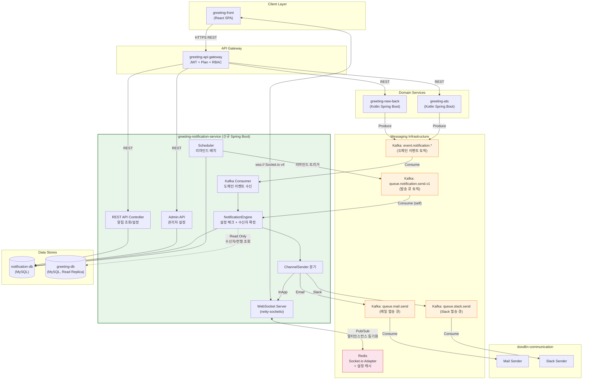
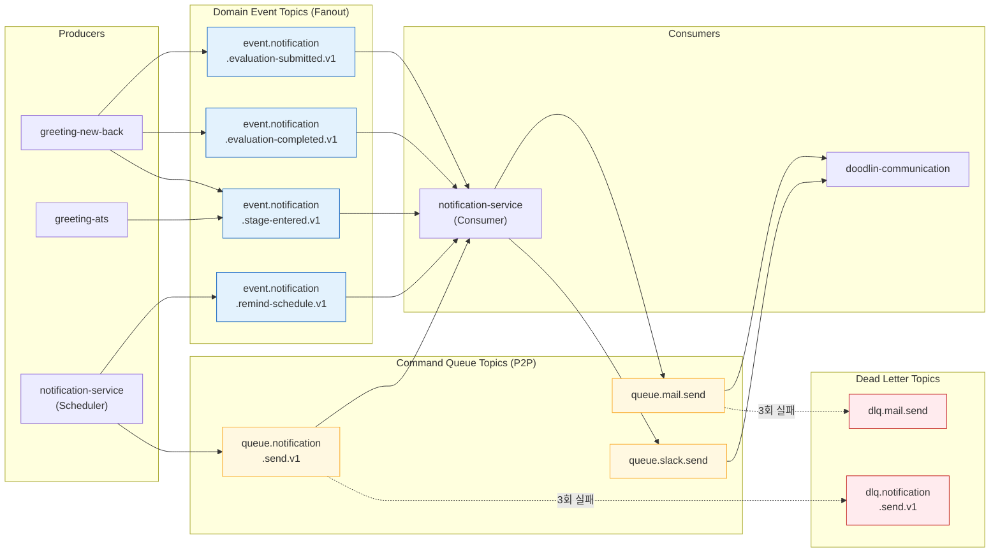
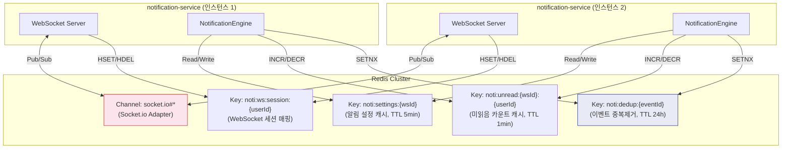
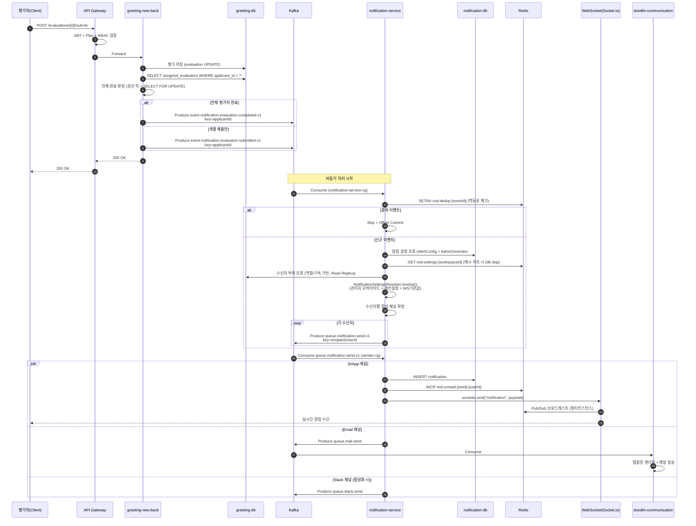
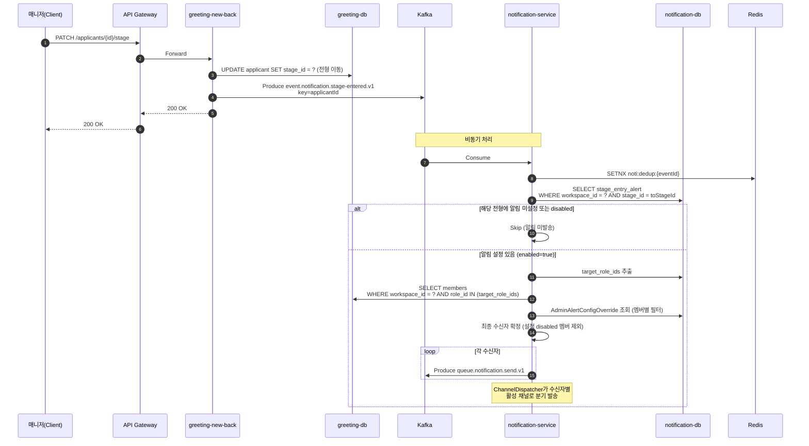
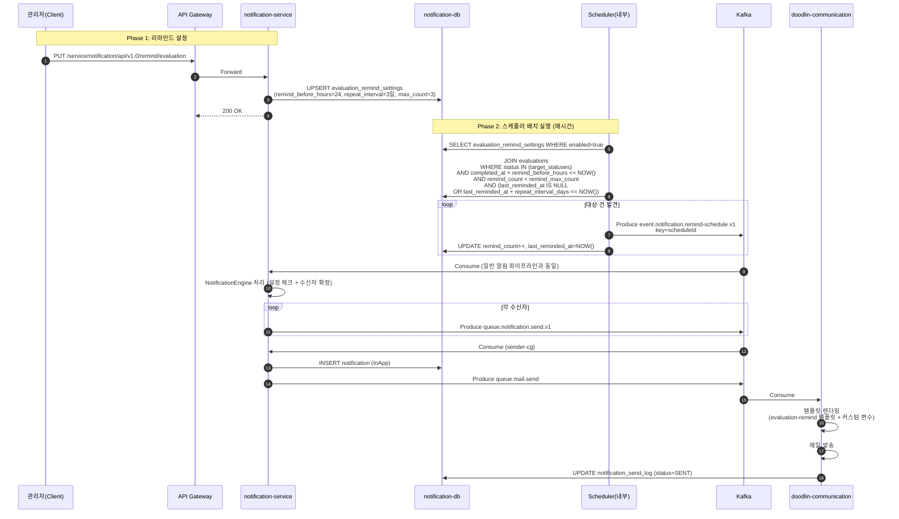
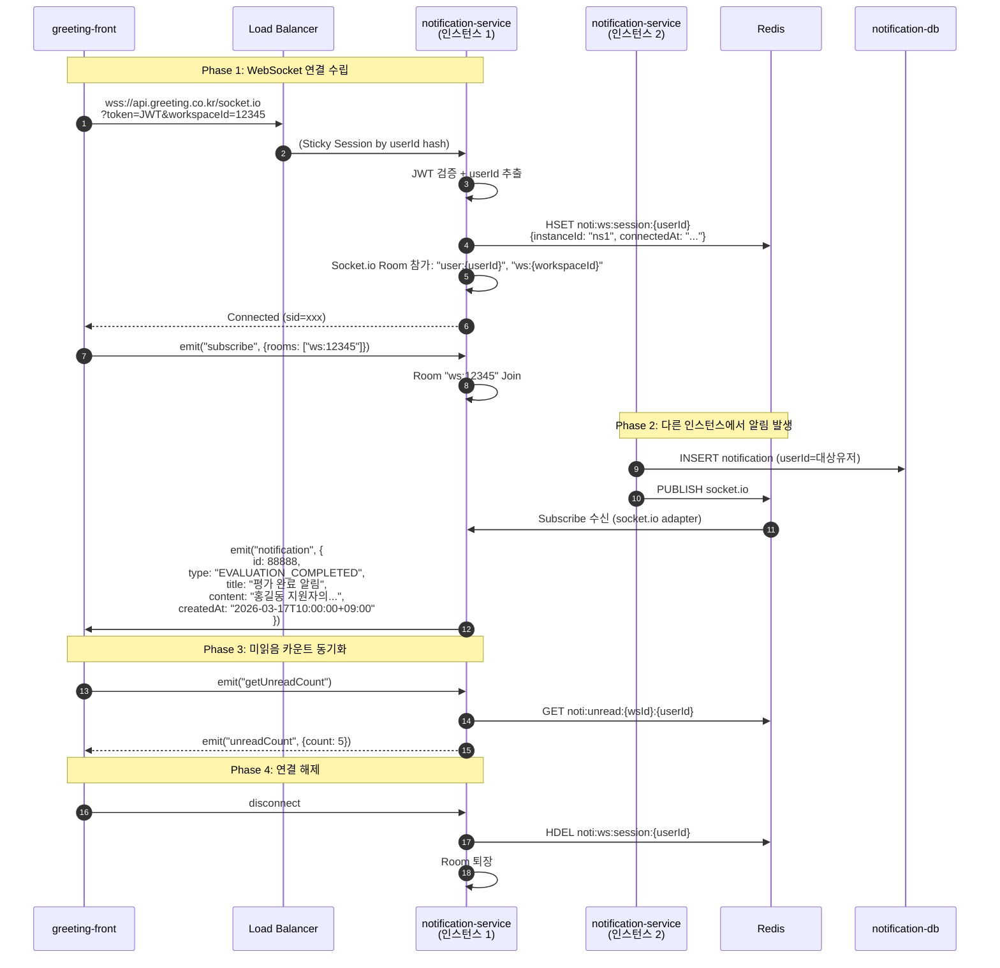
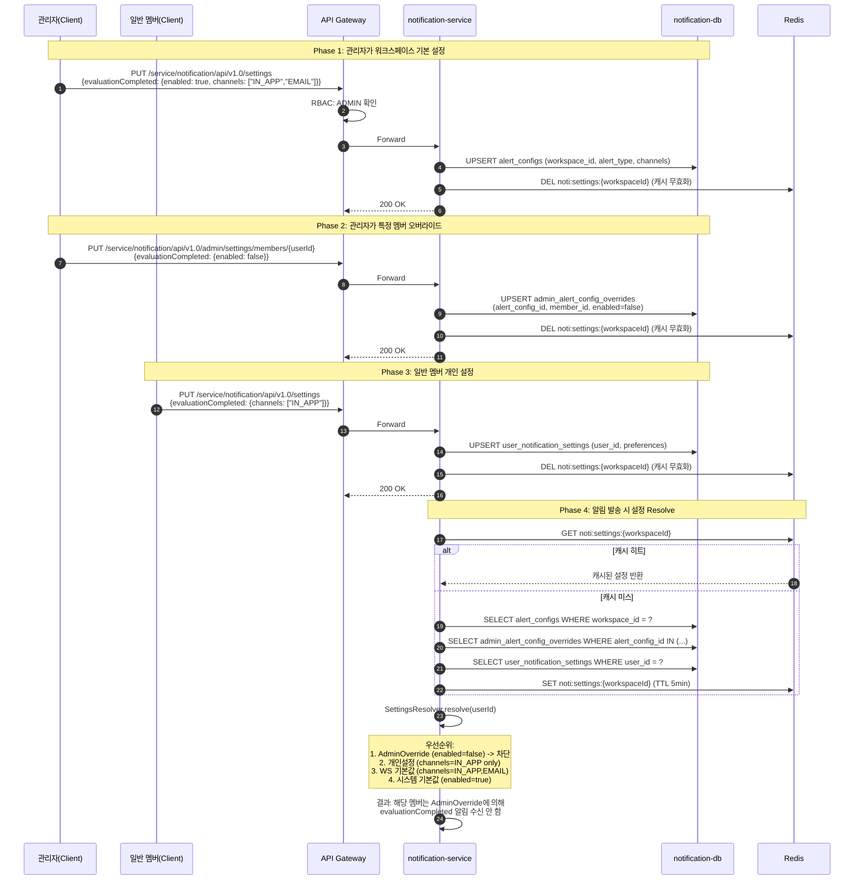

# [알림 시스템 완전 리팩토링] Part 2: 아키텍처, 이벤트, API 설계

> 상위 문서: [알림 고도화 TDD](../../2026-03-16_notification-enhancement/tdd.md)
> 작성일: 2026-03-17
> 목적: Node.js 2서버(greeting-notification-server, greeting-alert-server)를 Spring Boot 단일 서비스(greeting-notification-service)로 통합 리팩토링

---

## 1. TO-BE 아키텍처 다이어그램

### 1.1 전체 서비스 통신 흐름



### 1.2 Kafka 토픽 토폴로지



### 1.3 Redis 역할 상세



**Redis 활용 요약:**

| 키 패턴 | 자료구조 | TTL | 용도 |
|---------|---------|-----|------|
| `socket.io#*` | Pub/Sub Channel | - | Socket.io Adapter, 멀티인스턴스 간 이벤트 브로드캐스트 |
| `noti:settings:{workspaceId}` | Hash | 5분 | 알림 설정(AlertConfig + Override) 캐시 |
| `noti:unread:{workspaceId}:{userId}` | String (counter) | 1분 | 미읽음 알림 카운트 캐시 |
| `noti:dedup:{eventId}` | String | 24시간 | Kafka 이벤트 멱등성 보장 (SETNX) |
| `noti:ws:session:{userId}` | Hash | 연결 유지 동안 | WebSocket 세션 -> 인스턴스 매핑 |

---

## 2. Kafka 이벤트 재설계

### 2.1 AS-IS 토픽 구조 문제점

| 문제 | 설명 |
|------|------|
| 단일 토픽 혼합 | `alert.added` 하나에 모든 알림 유형이 섞여 Consumer 분기 복잡 |
| 스키마 미표준화 | 토픽별 메시지 포맷이 일관되지 않음 |
| 관심사 미분리 | 도메인 이벤트와 발송 명령이 같은 토픽에 공존 |
| 멱등성 미지원 | eventId 없이 중복 소비 시 중복 알림 발생 |

### 2.2 TO-BE 토픽 설계

#### 2.2.1 event.notification.evaluation-submitted.v1

> 개별 평가자가 평가를 제출했을 때 발행

| 항목 | 값 |
|------|-----|
| **Producer** | greeting-new-back |
| **Consumer Group** | notification-service-cg |
| **파티션 수** | 6 |
| **파티션 키** | `applicantId` (같은 지원자 이벤트 순서 보장) |
| **보존 기간** | 7일 |

```json
{
  "eventId": "550e8400-e29b-41d4-a716-446655440001",
  "eventType": "EVALUATION_SUBMITTED",
  "version": "v1",
  "timestamp": "2026-03-17T09:30:00+09:00",
  "source": "greeting-new-back",
  "payload": {
    "workspaceId": 12345,
    "applicantId": 67890,
    "applicantName": "홍길동",
    "evaluatorUserId": 111,
    "evaluatorName": "김평가",
    "evaluationId": 9999,
    "stageId": 555,
    "stageName": "1차 서류심사",
    "jobPostingId": 333,
    "jobPostingTitle": "백엔드 엔지니어",
    "evaluationScore": 85,
    "submittedAt": "2026-03-17T09:30:00+09:00"
  }
}
```

#### 2.2.2 event.notification.evaluation-completed.v1

> 해당 지원자에 배정된 전체 평가자가 평가를 완료했을 때 발행

| 항목 | 값 |
|------|-----|
| **Producer** | greeting-new-back |
| **Consumer Group** | notification-service-cg |
| **파티션 수** | 6 |
| **파티션 키** | `applicantId` |
| **보존 기간** | 7일 |

```json
{
  "eventId": "550e8400-e29b-41d4-a716-446655440002",
  "eventType": "EVALUATION_COMPLETED",
  "version": "v1",
  "timestamp": "2026-03-17T10:00:00+09:00",
  "source": "greeting-new-back",
  "payload": {
    "workspaceId": 12345,
    "applicantId": 67890,
    "applicantName": "홍길동",
    "stageId": 555,
    "stageName": "1차 서류심사",
    "jobPostingId": 333,
    "jobPostingTitle": "백엔드 엔지니어",
    "totalEvaluatorCount": 3,
    "completedEvaluatorCount": 3,
    "averageScore": 82.3,
    "completedAt": "2026-03-17T10:00:00+09:00"
  }
}
```

#### 2.2.3 event.notification.stage-entered.v1

> 지원자가 특정 전형으로 이동했을 때 발행

| 항목 | 값 |
|------|-----|
| **Producer** | greeting-new-back, greeting-ats |
| **Consumer Group** | notification-service-cg |
| **파티션 수** | 6 |
| **파티션 키** | `applicantId` |
| **보존 기간** | 7일 |

```json
{
  "eventId": "550e8400-e29b-41d4-a716-446655440003",
  "eventType": "STAGE_ENTERED",
  "version": "v1",
  "timestamp": "2026-03-17T11:00:00+09:00",
  "source": "greeting-new-back",
  "payload": {
    "workspaceId": 12345,
    "applicantId": 67890,
    "applicantName": "홍길동",
    "jobPostingId": 333,
    "jobPostingTitle": "백엔드 엔지니어",
    "fromStageId": 555,
    "fromStageName": "1차 서류심사",
    "toStageId": 666,
    "toStageName": "2차 면접",
    "movedByUserId": 222,
    "movedByUserName": "이매니저",
    "enteredAt": "2026-03-17T11:00:00+09:00"
  }
}
```

#### 2.2.4 event.notification.remind-schedule.v1

> 스케줄러가 리마인드 발송 시점에 도달한 건을 트리거

| 항목 | 값 |
|------|-----|
| **Producer** | notification-service (Scheduler) |
| **Consumer Group** | notification-service-cg |
| **파티션 수** | 3 |
| **파티션 키** | `scheduleId` |
| **보존 기간** | 3일 |

```json
{
  "eventId": "550e8400-e29b-41d4-a716-446655440004",
  "eventType": "REMIND_SCHEDULE_TRIGGERED",
  "version": "v1",
  "timestamp": "2026-03-17T08:00:00+09:00",
  "source": "notification-service-scheduler",
  "payload": {
    "scheduleId": 44444,
    "workspaceId": 12345,
    "remindType": "EVALUATION_REMIND",
    "targetId": 67890,
    "targetType": "APPLICANT",
    "scheduledAt": "2026-03-17T08:00:00+09:00",
    "templateId": "eval-remind-default",
    "remindCount": 2,
    "maxRemindCount": 3,
    "recipientUserIds": [111, 222, 333]
  }
}
```

#### 2.2.5 queue.notification.send.v1

> 알림 발송 명령 큐. NotificationEngine이 채널별 발송을 지시하는 내부 큐.

| 항목 | 값 |
|------|-----|
| **Producer** | notification-service (NotificationEngine) |
| **Consumer Group** | notification-service-sender-cg |
| **파티션 수** | 12 |
| **파티션 키** | `recipientUserId` (같은 사용자 알림 순서 보장) |
| **보존 기간** | 3일 |

```json
{
  "eventId": "550e8400-e29b-41d4-a716-446655440005",
  "commandType": "SEND_NOTIFICATION",
  "version": "v1",
  "timestamp": "2026-03-17T09:30:01+09:00",
  "payload": {
    "notificationId": 88888,
    "workspaceId": 12345,
    "recipientUserId": 222,
    "recipientEmail": "manager@company.com",
    "channels": ["IN_APP", "EMAIL"],
    "notificationType": "EVALUATION_COMPLETED",
    "category": "EVALUATION",
    "title": "평가 완료 알림",
    "content": "홍길동 지원자의 1차 서류심사 전체 평가가 완료되었습니다.",
    "metadata": {
      "applicantId": 67890,
      "stageId": 555,
      "jobPostingId": 333
    },
    "templateId": "eval-completed-default",
    "templateVariables": {
      "applicantName": "홍길동",
      "stageName": "1차 서류심사",
      "completedCount": 3,
      "averageScore": "82.3"
    }
  }
}
```

### 2.3 토픽 설정 요약

| 토픽 | 파티션 | 키 | 보존 | Consumer Group | 재시도 | DLQ |
|------|--------|-----|------|---------------|--------|-----|
| event.notification.evaluation-submitted.v1 | 6 | applicantId | 7일 | notification-service-cg | 3회 | dlq.notification.event.v1 |
| event.notification.evaluation-completed.v1 | 6 | applicantId | 7일 | notification-service-cg | 3회 | dlq.notification.event.v1 |
| event.notification.stage-entered.v1 | 6 | applicantId | 7일 | notification-service-cg | 3회 | dlq.notification.event.v1 |
| event.notification.remind-schedule.v1 | 3 | scheduleId | 3일 | notification-service-cg | 3회 | dlq.notification.event.v1 |
| queue.notification.send.v1 | 12 | recipientUserId | 3일 | notification-service-sender-cg | 5회 | dlq.notification.send.v1 |
| queue.mail.send | 6 | recipientEmail | 3일 | communication-mail-cg | 5회 | dlq.mail.send |
| queue.slack.send | 3 | channelId | 3일 | communication-slack-cg | 3회 | dlq.slack.send |

### 2.4 멱등성 전략

```
1. 모든 메시지에 UUID eventId 포함
2. Consumer: Redis SETNX noti:dedup:{eventId} (TTL 24h)
   - 성공 -> 처리 진행
   - 실패 -> 중복 메시지, skip + 오프셋 커밋
3. enable.auto.commit=false, 처리 완료 후 수동 오프셋 커밋
4. DB INSERT 시 notification_id + channel 복합 유니크로 이중 보호
```

---

## 3. 알림 채널 추상화 설계

### 3.1 인터페이스 정의

```kotlin
/**
 * 알림 채널 발송 추상화 인터페이스.
 * 각 채널(InApp, Email, Slack 등)은 이 인터페이스를 구현한다.
 */
interface NotificationChannelSender {

    /**
     * 이 Sender가 주어진 채널을 지원하는지 확인
     */
    fun supports(channel: NotificationChannel): Boolean

    /**
     * 알림 발송 실행
     * @param notification 발송할 알림 엔티티
     * @param recipient 수신자 정보
     * @return 발송 결과
     */
    fun send(notification: Notification, recipient: NotificationRecipient): SendResult

    /**
     * 채널 우선순위 (낮을수록 먼저 발송)
     */
    fun priority(): Int = 100
}

enum class NotificationChannel {
    IN_APP,     // WebSocket + DB 저장
    EMAIL,      // 이메일
    SLACK,      // Slack Webhook
    KAKAO,      // 카카오 알림톡 (향후)
    SMS,        // SMS (향후)
    BROWSER_PUSH // 브라우저 푸시 (향후)
}

data class Notification(
    val id: Long,
    val workspaceId: Long,
    val notificationType: NotificationType,
    val category: NotificationCategory,
    val title: String,
    val content: String,
    val metadata: Map<String, Any>,
    val templateId: String?,
    val templateVariables: Map<String, String>,
    val createdAt: Instant
)

data class NotificationRecipient(
    val userId: Long,
    val email: String?,
    val slackUserId: String?,
    val slackChannelId: String?,
    val name: String
)

data class SendResult(
    val success: Boolean,
    val channel: NotificationChannel,
    val sentAt: Instant?,
    val errorCode: String?,
    val errorMessage: String?
)
```

### 3.2 구현체

#### 3.2.1 InAppChannelSender

```kotlin
@Component
class InAppChannelSender(
    private val notificationRepository: NotificationRepository,
    private val redisTemplate: RedisTemplate<String, String>,
    private val socketIoServer: SocketIOServer
) : NotificationChannelSender {

    override fun supports(channel: NotificationChannel) = channel == NotificationChannel.IN_APP

    override fun priority() = 10  // 최우선 발송

    override fun send(notification: Notification, recipient: NotificationRecipient): SendResult {
        // 1. DB 저장 (notifications 테이블)
        val saved = notificationRepository.save(notification.toEntity(recipient.userId))

        // 2. Redis 미읽음 카운트 증가
        redisTemplate.opsForValue().increment("noti:unread:${notification.workspaceId}:${recipient.userId}")

        // 3. Socket.io를 통해 실시간 전달 (Redis Pub/Sub로 멀티인스턴스 브로드캐스트)
        socketIoServer.getRoomOperations("user:${recipient.userId}")
            .sendEvent("notification", NotificationPushDto.from(saved))

        return SendResult(success = true, channel = NotificationChannel.IN_APP, sentAt = Instant.now())
    }
}
```

#### 3.2.2 EmailChannelSender

```kotlin
@Component
class EmailChannelSender(
    private val kafkaTemplate: KafkaTemplate<String, String>,
    private val templateEngine: NotificationTemplateEngine
) : NotificationChannelSender {

    override fun supports(channel: NotificationChannel) = channel == NotificationChannel.EMAIL

    override fun priority() = 50

    override fun send(notification: Notification, recipient: NotificationRecipient): SendResult {
        val email = recipient.email ?: return SendResult(
            success = false, channel = NotificationChannel.EMAIL,
            errorCode = "NO_EMAIL", errorMessage = "수신자 이메일 없음"
        )

        // 1. 템플릿 렌더링
        val rendered = templateEngine.render(notification.templateId, notification.templateVariables)

        // 2. Kafka 메일 발송 큐에 Produce
        val message = MailSendMessage(
            to = email,
            subject = rendered.subject,
            body = rendered.body,
            workspaceId = notification.workspaceId,
            notificationId = notification.id
        )
        kafkaTemplate.send("queue.mail.send", email, objectMapper.writeValueAsString(message))

        return SendResult(success = true, channel = NotificationChannel.EMAIL, sentAt = Instant.now())
    }
}
```

#### 3.2.3 SlackChannelSender

```kotlin
@Component
class SlackChannelSender(
    private val kafkaTemplate: KafkaTemplate<String, String>,
    private val templateEngine: NotificationTemplateEngine
) : NotificationChannelSender {

    override fun supports(channel: NotificationChannel) = channel == NotificationChannel.SLACK

    override fun priority() = 60

    override fun send(notification: Notification, recipient: NotificationRecipient): SendResult {
        val channelId = recipient.slackChannelId ?: return SendResult(
            success = false, channel = NotificationChannel.SLACK,
            errorCode = "NO_SLACK_CHANNEL", errorMessage = "Slack 채널 미설정"
        )

        val rendered = templateEngine.renderSlack(notification.templateId, notification.templateVariables)

        val message = SlackSendMessage(
            channelId = channelId,
            text = rendered.text,
            blocks = rendered.blocks,
            workspaceId = notification.workspaceId,
            notificationId = notification.id
        )
        kafkaTemplate.send("queue.slack.send", channelId, objectMapper.writeValueAsString(message))

        return SendResult(success = true, channel = NotificationChannel.SLACK, sentAt = Instant.now())
    }
}
```

### 3.3 채널 디스패처 (Orchestrator)

```kotlin
@Service
class NotificationChannelDispatcher(
    private val senders: List<NotificationChannelSender>,
    private val settingsResolver: NotificationSettingsResolver
) {

    /**
     * 알림을 수신자의 활성화된 채널들로 동시 발송
     */
    fun dispatch(notification: Notification, recipient: NotificationRecipient) {
        // 1. 수신자의 활성 채널 목록 resolve (관리자 오버라이드 > 개인 설정 > WS 기본값 > 시스템 기본값)
        val enabledChannels = settingsResolver.resolveChannels(
            workspaceId = notification.workspaceId,
            userId = recipient.userId,
            notificationType = notification.notificationType
        )

        // 2. 지원 채널별 Sender 실행 (priority 순)
        senders
            .filter { sender -> enabledChannels.any { sender.supports(it) } }
            .sortedBy { it.priority() }
            .forEach { sender ->
                try {
                    sender.send(notification, recipient)
                } catch (e: Exception) {
                    log.error("채널 발송 실패: channel=${sender::class.simpleName}, notificationId=${notification.id}", e)
                    // 개별 채널 실패가 다른 채널에 영향 주지 않음
                }
            }
    }
}
```

### 3.4 향후 확장 채널

| 채널 | 구현체 | 발송 방식 | 예상 시점 |
|------|--------|----------|----------|
| KakaoChannelSender | `queue.kakao.send` Kafka 토픽 | 카카오 알림톡 API | 2026-Q3 |
| SMSChannelSender | `queue.sms.send` Kafka 토픽 | NHN Cloud SMS API | 2026-Q3 |
| BrowserPushChannelSender | Web Push API (VAPID) | Service Worker Push | 2026-Q4 |

확장 시 필요한 작업:
1. `NotificationChannelSender` 구현체 추가
2. 해당 Kafka 토픽 + Consumer(doodlin-communication) 추가
3. `NotificationChannel` enum에 값 추가
4. 알림 설정 UI에 채널 토글 추가

---

## 4. 시퀀스 다이어그램

### 4.1 평가 완료 -> 알림 생성 -> 채널별 발송 (신규 아키텍처)



### 4.2 전형 진입 -> 구독자 조회 -> 알림 발송



### 4.3 리마인드 스케줄 등록 -> 배치 실행 -> 발송



### 4.4 WebSocket 연결 -> 인앱 알림 수신 (Spring Boot 통합 버전)



### 4.5 관리자 알림 설정 -> 개인 설정 resolve -> 발송 시 적용



### 4.6 Node -> Spring 이관 과도기 병렬 운영 흐름

```mermaid
sequenceDiagram
    autonumber
    participant FE as greeting-front
    participant GW as API Gateway
    participant OLD_NS as greeting-notification-server<br/>(NestJS, 기존)
    participant OLD_AS as greeting-alert-server<br/>(NestJS+Socket.io, 기존)
    participant NEW_NS as greeting-notification-service<br/>(Spring Boot, 신규)
    participant K as Kafka
    participant R as Redis
    participant FF as Feature Flag<br/>(LaunchDarkly)

    Note over FE,FF: Phase 1: Feature Flag 기반 라우팅

    FE->>FF: GET flag "notification-v2-enabled"<br/>context: {workspaceId: 12345}
    FF-->>FE: {enabled: true, percentage: 30}

    alt notification-v2 OFF (70%)
        Note over FE,OLD_AS: 기존 경로 유지

        FE->>GW: GET /service/notification/api/v1.0/notifications
        GW->>OLD_NS: Forward (기존 NestJS)
        OLD_NS-->>GW: 응답
        GW-->>FE: 응답

        FE<-->OLD_AS: wss:// (기존 Socket.io 서버)

    else notification-v2 ON (30%)
        Note over FE,NEW_NS: 신규 경로

        FE->>GW: GET /service/notification/api/v1.0/notifications
        GW->>GW: Header X-Notification-Version: v2<br/>(Feature Flag 기반)
        GW->>NEW_NS: Forward (신규 Spring Boot)
        NEW_NS-->>GW: 응답
        GW-->>FE: 응답

        FE<-->NEW_NS: wss:// (netty-socketio)
    end

    Note over K,NEW_NS: Phase 2: Kafka Dual Consumer (이관 중간)

    K->>OLD_NS: Consume alert.added (기존 토픽, 기존 CG)
    K->>NEW_NS: Consume event.notification.*.v1 (신규 토픽, 신규 CG)

    Note over OLD_NS,NEW_NS: 병렬 운영 중 기존 토픽도 신규 서비스가 소비

    K->>NEW_NS: Consume alert.added (migration-bridge-cg)<br/>기존 메시지 포맷 -> 신규 포맷 변환

    Note over FE,FF: Phase 3: 점진적 전환 (2주 계획)

    Note right of FF: Week 1: 10% -> 30% -> 50%<br/>Week 2: 70% -> 90% -> 100%

    Note over OLD_NS,OLD_AS: Phase 4: 완전 전환 후

    Note over OLD_NS: greeting-notification-server 폐기
    Note over OLD_AS: greeting-alert-server 폐기
    Note over K: alert.added 토픽 deprecate (1개월 후 삭제)
```

**과도기 병렬 운영 핵심 원칙:**

| 원칙 | 설명 |
|------|------|
| Feature Flag 기반 라우팅 | 워크스페이스 단위로 신규/기존 서비스 라우팅 |
| Dual Consumer | 기존 `alert.added` 토픽을 신규 서비스도 별도 CG로 소비 (migration-bridge-cg) |
| 데이터 동기화 | 과도기 중 양쪽 DB에 알림 INSERT (신규 서비스가 마스터, 기존은 Read-only shadow) |
| 점진적 트래픽 전환 | 10% -> 30% -> 50% -> 70% -> 90% -> 100% (2주 계획) |
| Rollback 기준 | 에러율 > 1% 또는 P95 응답시간 > 500ms 시 이전 단계로 즉시 롤백 |

---

## 5. REST API 전체 스펙

> Base URL: `/service/notification/api/v1.0`
> 인증: API Gateway에서 JWT 검증 후 `X-Workspace-Id`, `X-User-Id`, `X-User-Roles` 헤더 전달
> Content-Type: `application/json`

### 5.1 알림 조회/관리

#### 5.1.1 GET /notifications

알림 목록 조회 (페이지네이션, 필터)

| 항목 | 값 |
|------|-----|
| **Method** | GET |
| **Path** | `/notifications` |
| **권한** | 인증된 사용자 (본인 알림만) |

**Query Parameters:**

| 파라미터 | 타입 | 필수 | 기본값 | 설명 |
|---------|------|------|--------|------|
| page | int | N | 0 | 페이지 번호 (0-based) |
| size | int | N | 20 | 페이지 크기 (max 100) |
| category | string | N | - | 필터: EVALUATION, STAGE_ENTRY, MEETING, SYSTEM |
| isRead | boolean | N | - | 필터: true=읽은 알림, false=안읽은 알림 |
| fromDate | string | N | - | ISO-8601 시작일 (e.g., 2026-03-01) |
| toDate | string | N | - | ISO-8601 종료일 |

**Response 200:**

```json
{
  "success": true,
  "data": {
    "content": [
      {
        "id": 88888,
        "type": "EVALUATION_COMPLETED",
        "category": "EVALUATION",
        "title": "평가 완료 알림",
        "content": "홍길동 지원자의 1차 서류심사 전체 평가가 완료되었습니다.",
        "isRead": false,
        "metadata": {
          "applicantId": 67890,
          "stageId": 555,
          "jobPostingId": 333,
          "deepLink": "/applicants/67890/evaluations"
        },
        "createdAt": "2026-03-17T10:00:00+09:00"
      }
    ],
    "page": 0,
    "size": 20,
    "totalElements": 142,
    "totalPages": 8,
    "hasNext": true
  }
}
```

**에러 코드:**

| HTTP Status | Code | 설명 |
|-------------|------|------|
| 400 | INVALID_PARAMETER | 잘못된 쿼리 파라미터 |
| 401 | UNAUTHORIZED | 인증 실패 |

---

#### 5.1.2 GET /notifications/count

미읽음 알림 카운트 조회

| 항목 | 값 |
|------|-----|
| **Method** | GET |
| **Path** | `/notifications/count` |
| **권한** | 인증된 사용자 |

**Response 200:**

```json
{
  "success": true,
  "data": {
    "unreadCount": 5,
    "countByCategory": {
      "EVALUATION": 3,
      "STAGE_ENTRY": 1,
      "MEETING": 1,
      "SYSTEM": 0
    }
  }
}
```

---

#### 5.1.3 POST /notifications/{id}/read

단건 알림 읽음 처리

| 항목 | 값 |
|------|-----|
| **Method** | POST |
| **Path** | `/notifications/{id}/read` |
| **권한** | 인증된 사용자 (본인 알림만) |

**Path Parameters:**

| 파라미터 | 타입 | 설명 |
|---------|------|------|
| id | long | 알림 ID |

**Response 200:**

```json
{
  "success": true,
  "data": {
    "id": 88888,
    "isRead": true,
    "readAt": "2026-03-17T10:05:00+09:00"
  }
}
```

**에러 코드:**

| HTTP Status | Code | 설명 |
|-------------|------|------|
| 404 | NOTIFICATION_NOT_FOUND | 알림 없음 |
| 403 | FORBIDDEN | 타인의 알림 접근 |

---

#### 5.1.4 POST /notifications/read-all

전체 알림 읽음 처리

| 항목 | 값 |
|------|-----|
| **Method** | POST |
| **Path** | `/notifications/read-all` |
| **권한** | 인증된 사용자 |

**Request Body (선택):**

```json
{
  "category": "EVALUATION"
}
```

> category가 null이면 전체, 지정 시 해당 카테고리만 읽음 처리

**Response 200:**

```json
{
  "success": true,
  "data": {
    "updatedCount": 5,
    "readAt": "2026-03-17T10:05:00+09:00"
  }
}
```

---

### 5.2 알림 설정

#### 5.2.1 GET /settings

내 알림 설정 조회

| 항목 | 값 |
|------|-----|
| **Method** | GET |
| **Path** | `/settings` |
| **권한** | 인증된 사용자 |

**Response 200:**

```json
{
  "success": true,
  "data": {
    "workspaceDefaults": {
      "evaluationCompleted": {
        "enabled": true,
        "channels": ["IN_APP", "EMAIL"],
        "realtime": true
      },
      "evaluationSubmitted": {
        "enabled": true,
        "channels": ["IN_APP"],
        "realtime": true
      },
      "stageEntry": {
        "enabled": true,
        "channels": ["IN_APP", "EMAIL"],
        "realtime": true
      },
      "meetingRemind": {
        "enabled": true,
        "channels": ["IN_APP", "EMAIL"],
        "realtime": false
      },
      "evaluationRemind": {
        "enabled": true,
        "channels": ["EMAIL"],
        "realtime": false
      }
    },
    "myOverrides": {
      "evaluationCompleted": {
        "enabled": true,
        "channels": ["IN_APP"]
      }
    },
    "adminOverrides": {
      "evaluationRemind": {
        "enabled": false,
        "overriddenBy": "관리자",
        "overriddenAt": "2026-03-15T09:00:00+09:00"
      }
    },
    "resolvedSettings": {
      "evaluationCompleted": {
        "enabled": true,
        "channels": ["IN_APP"],
        "source": "USER_OVERRIDE"
      },
      "evaluationSubmitted": {
        "enabled": true,
        "channels": ["IN_APP"],
        "source": "WORKSPACE_DEFAULT"
      },
      "stageEntry": {
        "enabled": true,
        "channels": ["IN_APP", "EMAIL"],
        "source": "WORKSPACE_DEFAULT"
      },
      "meetingRemind": {
        "enabled": true,
        "channels": ["IN_APP", "EMAIL"],
        "source": "WORKSPACE_DEFAULT"
      },
      "evaluationRemind": {
        "enabled": false,
        "channels": [],
        "source": "ADMIN_OVERRIDE"
      }
    }
  }
}
```

---

#### 5.2.2 PUT /settings

내 알림 설정 변경

| 항목 | 값 |
|------|-----|
| **Method** | PUT |
| **Path** | `/settings` |
| **권한** | 인증된 사용자 |

**Request Body:**

```json
{
  "evaluationCompleted": {
    "channels": ["IN_APP"]
  },
  "stageEntry": {
    "channels": ["IN_APP", "EMAIL", "SLACK"]
  }
}
```

> 명시하지 않은 유형은 변경하지 않음. `enabled`는 개인 설정에서 변경 불가 (관리자만).

**Response 200:**

```json
{
  "success": true,
  "data": {
    "updatedSettings": {
      "evaluationCompleted": {
        "channels": ["IN_APP"]
      },
      "stageEntry": {
        "channels": ["IN_APP", "EMAIL", "SLACK"]
      }
    },
    "updatedAt": "2026-03-17T10:10:00+09:00"
  }
}
```

**에러 코드:**

| HTTP Status | Code | 설명 |
|-------------|------|------|
| 400 | INVALID_CHANNEL | 지원하지 않는 채널 |
| 400 | ADMIN_OVERRIDE_ACTIVE | 관리자가 해당 알림을 비활성화한 상태에서 채널 변경 불가 |

---

#### 5.2.3 GET /settings/subscriptions

전형/공고 구독 목록 조회

| 항목 | 값 |
|------|-----|
| **Method** | GET |
| **Path** | `/settings/subscriptions` |
| **권한** | 인증된 사용자 |

**Response 200:**

```json
{
  "success": true,
  "data": {
    "stageSubscriptions": [
      {
        "stageId": 555,
        "stageName": "1차 서류심사",
        "jobPostingId": 333,
        "jobPostingTitle": "백엔드 엔지니어",
        "subscribed": true
      },
      {
        "stageId": 666,
        "stageName": "2차 면접",
        "jobPostingId": 333,
        "jobPostingTitle": "백엔드 엔지니어",
        "subscribed": false
      }
    ],
    "jobPostingSubscriptions": [
      {
        "jobPostingId": 333,
        "jobPostingTitle": "백엔드 엔지니어",
        "subscribed": true
      }
    ]
  }
}
```

---

#### 5.2.4 PUT /settings/subscriptions

구독 변경

| 항목 | 값 |
|------|-----|
| **Method** | PUT |
| **Path** | `/settings/subscriptions` |
| **권한** | 인증된 사용자 |

**Request Body:**

```json
{
  "stageSubscriptions": [
    { "stageId": 555, "subscribed": true },
    { "stageId": 666, "subscribed": true }
  ],
  "jobPostingSubscriptions": [
    { "jobPostingId": 333, "subscribed": true }
  ]
}
```

**Response 200:**

```json
{
  "success": true,
  "data": {
    "updatedCount": 3,
    "updatedAt": "2026-03-17T10:15:00+09:00"
  }
}
```

---

#### 5.2.5 GET /admin/settings/members

관리자: 멤버별 설정 조회

| 항목 | 값 |
|------|-----|
| **Method** | GET |
| **Path** | `/admin/settings/members` |
| **권한** | ADMIN, MANAGER |

**Query Parameters:**

| 파라미터 | 타입 | 필수 | 기본값 | 설명 |
|---------|------|------|--------|------|
| page | int | N | 0 | 페이지 번호 |
| size | int | N | 20 | 페이지 크기 |
| search | string | N | - | 멤버 이름/이메일 검색 |

**Response 200:**

```json
{
  "success": true,
  "data": {
    "content": [
      {
        "userId": 111,
        "name": "김평가",
        "email": "evaluator@company.com",
        "role": "EVALUATOR",
        "overrides": {
          "evaluationCompleted": { "enabled": true },
          "evaluationRemind": { "enabled": false }
        },
        "personalSettings": {
          "evaluationCompleted": { "channels": ["IN_APP"] }
        }
      }
    ],
    "page": 0,
    "size": 20,
    "totalElements": 15
  }
}
```

---

#### 5.2.6 PUT /admin/settings/members/{userId}

관리자: 멤버 설정 변경 (오버라이드)

| 항목 | 값 |
|------|-----|
| **Method** | PUT |
| **Path** | `/admin/settings/members/{userId}` |
| **권한** | ADMIN |

**Path Parameters:**

| 파라미터 | 타입 | 설명 |
|---------|------|------|
| userId | long | 대상 멤버 ID |

**Request Body:**

```json
{
  "overrides": {
    "evaluationCompleted": { "enabled": true },
    "evaluationRemind": { "enabled": false },
    "stageEntry": { "enabled": true }
  }
}
```

> `null`로 설정하면 해당 유형의 오버라이드 삭제 (워크스페이스 기본값 복원)

**Response 200:**

```json
{
  "success": true,
  "data": {
    "userId": 111,
    "overrides": {
      "evaluationCompleted": { "enabled": true },
      "evaluationRemind": { "enabled": false },
      "stageEntry": { "enabled": true }
    },
    "updatedAt": "2026-03-17T10:20:00+09:00"
  }
}
```

**에러 코드:**

| HTTP Status | Code | 설명 |
|-------------|------|------|
| 403 | FORBIDDEN | ADMIN 권한 없음 |
| 404 | MEMBER_NOT_FOUND | 멤버 없음 |
| 400 | INVALID_NOTIFICATION_TYPE | 알 수 없는 알림 유형 |

---

### 5.3 리마인드 설정

#### 5.3.1 GET /remind/evaluation

평가 리마인드 설정 조회

| 항목 | 값 |
|------|-----|
| **Method** | GET |
| **Path** | `/remind/evaluation` |
| **권한** | ADMIN, MANAGER |

**Response 200:**

```json
{
  "success": true,
  "data": {
    "enabled": true,
    "remindBeforeHours": 24,
    "remindRepeatIntervalDays": 3,
    "remindMaxCount": 3,
    "targetEvaluationStatuses": ["NOT_STARTED", "IN_PROGRESS"],
    "customRemindHours": [24, 48, 72],
    "template": {
      "subject": "[그리팅] {{applicantName}} 지원자 평가를 완료해주세요",
      "body": "{{evaluatorName}}님, {{applicantName}} 지원자의 {{stageName}} 평가가 아직 완료되지 않았습니다.",
      "availableVariables": [
        { "key": "applicantName", "description": "지원자 이름" },
        { "key": "evaluatorName", "description": "평가자 이름" },
        { "key": "stageName", "description": "전형 이름" },
        { "key": "jobPostingTitle", "description": "공고 제목" },
        { "key": "dueDate", "description": "평가 기한" },
        { "key": "remainingDays", "description": "남은 일수" }
      ]
    },
    "stats": {
      "totalScheduled": 15,
      "sentToday": 3,
      "pendingToday": 2
    }
  }
}
```

---

#### 5.3.2 PUT /remind/evaluation

평가 리마인드 설정 변경

| 항목 | 값 |
|------|-----|
| **Method** | PUT |
| **Path** | `/remind/evaluation` |
| **권한** | ADMIN, MANAGER |

**Request Body:**

```json
{
  "enabled": true,
  "remindBeforeHours": 48,
  "remindRepeatIntervalDays": 2,
  "remindMaxCount": 5,
  "targetEvaluationStatuses": ["NOT_STARTED"],
  "customRemindHours": [24, 48]
}
```

**Response 200:**

```json
{
  "success": true,
  "data": {
    "enabled": true,
    "remindBeforeHours": 48,
    "remindRepeatIntervalDays": 2,
    "remindMaxCount": 5,
    "targetEvaluationStatuses": ["NOT_STARTED"],
    "customRemindHours": [24, 48],
    "updatedAt": "2026-03-17T10:25:00+09:00"
  }
}
```

**에러 코드:**

| HTTP Status | Code | 설명 |
|-------------|------|------|
| 400 | INVALID_REMIND_HOURS | remindBeforeHours가 1~720 범위 벗어남 |
| 400 | INVALID_INTERVAL | repeatIntervalDays가 1~30 범위 벗어남 |
| 400 | INVALID_MAX_COUNT | remindMaxCount가 1~10 범위 벗어남 |

---

#### 5.3.3 GET /remind/meeting

면접 리마인드 설정 조회

| 항목 | 값 |
|------|-----|
| **Method** | GET |
| **Path** | `/remind/meeting` |
| **권한** | ADMIN, MANAGER |

**Response 200:**

```json
{
  "success": true,
  "data": {
    "enabled": true,
    "remindBeforeMinutes": 60,
    "targets": {
      "interviewer": { "enabled": true },
      "applicant": { "enabled": true },
      "coordinator": { "enabled": false }
    },
    "template": {
      "subject": "[그리팅] {{meetingTitle}} 면접이 {{remainingTime}} 후에 시작됩니다",
      "body": "{{interviewerName}}님, {{applicantName}} 지원자와의 면접이 {{meetingTime}}에 예정되어 있습니다.\n\n면접 장소: {{meetingLocation}}\n화상 링크: {{meetingLink}}",
      "availableVariables": [
        { "key": "meetingTitle", "description": "면접 제목" },
        { "key": "interviewerName", "description": "면접관 이름" },
        { "key": "applicantName", "description": "지원자 이름" },
        { "key": "meetingTime", "description": "면접 시각" },
        { "key": "meetingLocation", "description": "면접 장소" },
        { "key": "meetingLink", "description": "화상 면접 링크" },
        { "key": "remainingTime", "description": "남은 시간" }
      ]
    },
    "stats": {
      "scheduledToday": 8,
      "sentToday": 5,
      "pendingToday": 3
    }
  }
}
```

---

#### 5.3.4 PUT /remind/meeting

면접 리마인드 설정 변경

| 항목 | 값 |
|------|-----|
| **Method** | PUT |
| **Path** | `/remind/meeting` |
| **권한** | ADMIN, MANAGER |

**Request Body:**

```json
{
  "enabled": true,
  "remindBeforeMinutes": 30,
  "targets": {
    "interviewer": { "enabled": true },
    "applicant": { "enabled": true },
    "coordinator": { "enabled": true }
  }
}
```

**Response 200:**

```json
{
  "success": true,
  "data": {
    "enabled": true,
    "remindBeforeMinutes": 30,
    "targets": {
      "interviewer": { "enabled": true },
      "applicant": { "enabled": true },
      "coordinator": { "enabled": true }
    },
    "updatedAt": "2026-03-17T10:30:00+09:00",
    "affectedSchedules": {
      "rescheduledCount": 12,
      "message": "미발송 12건의 리마인드 스케줄이 30분 전으로 변경되었습니다."
    }
  }
}
```

**에러 코드:**

| HTTP Status | Code | 설명 |
|-------------|------|------|
| 400 | INVALID_REMIND_MINUTES | remindBeforeMinutes가 5~1440 범위 벗어남 |

---

### 5.4 템플릿

#### 5.4.1 GET /templates

템플릿 목록 조회

| 항목 | 값 |
|------|-----|
| **Method** | GET |
| **Path** | `/templates` |
| **권한** | ADMIN, MANAGER |

**Response 200:**

```json
{
  "success": true,
  "data": [
    {
      "id": "eval-completed-default",
      "name": "평가 완료 알림",
      "notificationType": "EVALUATION_COMPLETED",
      "channel": "EMAIL",
      "isCustomized": false,
      "subject": "[그리팅] {{applicantName}} 지원자의 평가가 완료되었습니다",
      "body": "{{applicantName}} 지원자의 {{stageName}} 전형 평가가 모두 완료되었습니다.\n\n평균 점수: {{averageScore}}점\n평가 완료: {{completedCount}}명\n\n상세 결과를 확인해주세요.",
      "availableVariables": [
        { "key": "applicantName", "description": "지원자 이름" },
        { "key": "stageName", "description": "전형 이름" },
        { "key": "averageScore", "description": "평균 점수" },
        { "key": "completedCount", "description": "완료 평가자 수" }
      ],
      "updatedAt": null
    },
    {
      "id": "eval-remind-default",
      "name": "평가 리마인드",
      "notificationType": "EVALUATION_REMIND",
      "channel": "EMAIL",
      "isCustomized": true,
      "subject": "[그리팅] {{applicantName}} 지원자 평가를 완료해주세요",
      "body": "커스텀 본문...",
      "availableVariables": [ "..." ],
      "updatedAt": "2026-03-15T09:00:00+09:00"
    },
    {
      "id": "stage-entered-default",
      "name": "전형 진입 알림",
      "notificationType": "STAGE_ENTERED",
      "channel": "EMAIL",
      "isCustomized": false,
      "subject": "[그리팅] {{applicantName}} 지원자가 {{stageName}} 전형에 진입했습니다",
      "body": "...",
      "availableVariables": [ "..." ],
      "updatedAt": null
    },
    {
      "id": "meeting-remind-default",
      "name": "면접 리마인드",
      "notificationType": "MEETING_REMIND",
      "channel": "EMAIL",
      "isCustomized": false,
      "subject": "[그리팅] {{meetingTitle}} 면접이 {{remainingTime}} 후에 시작됩니다",
      "body": "...",
      "availableVariables": [ "..." ],
      "updatedAt": null
    }
  ]
}
```

---

#### 5.4.2 PUT /templates/{id}

템플릿 수정

| 항목 | 값 |
|------|-----|
| **Method** | PUT |
| **Path** | `/templates/{id}` |
| **권한** | ADMIN |

**Path Parameters:**

| 파라미터 | 타입 | 설명 |
|---------|------|------|
| id | string | 템플릿 ID (e.g., "eval-remind-default") |

**Request Body:**

```json
{
  "subject": "[그리팅] {{applicantName}} 지원자 평가 요청 ({{remainingDays}}일 남음)",
  "body": "안녕하세요 {{evaluatorName}}님,\n\n{{applicantName}} 지원자의 {{stageName}} 전형 평가를 {{dueDate}}까지 완료해주세요.\n\n평가하기: {{evaluationLink}}"
}
```

**Response 200:**

```json
{
  "success": true,
  "data": {
    "id": "eval-remind-default",
    "subject": "[그리팅] {{applicantName}} 지원자 평가 요청 ({{remainingDays}}일 남음)",
    "body": "안녕하세요 {{evaluatorName}}님,\n\n{{applicantName}} 지원자의 {{stageName}} 전형 평가를 {{dueDate}}까지 완료해주세요.\n\n평가하기: {{evaluationLink}}",
    "isCustomized": true,
    "updatedAt": "2026-03-17T10:35:00+09:00"
  }
}
```

**에러 코드:**

| HTTP Status | Code | 설명 |
|-------------|------|------|
| 404 | TEMPLATE_NOT_FOUND | 템플릿 없음 |
| 400 | INVALID_TEMPLATE_VARIABLE | 존재하지 않는 변수 참조 (e.g., `{{unknownVar}}`) |
| 400 | TEMPLATE_RENDER_ERROR | 템플릿 구문 오류 |

---

#### 5.4.3 DELETE /templates/{id}

템플릿 기본값 복원

| 항목 | 값 |
|------|-----|
| **Method** | DELETE |
| **Path** | `/templates/{id}` |
| **권한** | ADMIN |

**Path Parameters:**

| 파라미터 | 타입 | 설명 |
|---------|------|------|
| id | string | 템플릿 ID |

**Response 200:**

```json
{
  "success": true,
  "data": {
    "id": "eval-remind-default",
    "message": "기본 템플릿으로 복원되었습니다.",
    "isCustomized": false,
    "restoredAt": "2026-03-17T10:40:00+09:00"
  }
}
```

**에러 코드:**

| HTTP Status | Code | 설명 |
|-------------|------|------|
| 404 | TEMPLATE_NOT_FOUND | 템플릿 없음 |
| 400 | ALREADY_DEFAULT | 이미 기본 템플릿 상태 |

---

### 5.5 API 요약 매트릭스

| # | Method | Path | 권한 | 설명 |
|---|--------|------|------|------|
| 1 | GET | `/notifications` | User | 알림 목록 조회 |
| 2 | GET | `/notifications/count` | User | 미읽음 카운트 |
| 3 | POST | `/notifications/{id}/read` | User | 단건 읽음 처리 |
| 4 | POST | `/notifications/read-all` | User | 전체 읽음 처리 |
| 5 | GET | `/settings` | User | 내 알림 설정 조회 |
| 6 | PUT | `/settings` | User | 내 알림 설정 변경 |
| 7 | GET | `/settings/subscriptions` | User | 구독 목록 조회 |
| 8 | PUT | `/settings/subscriptions` | User | 구독 변경 |
| 9 | GET | `/admin/settings/members` | ADMIN/MANAGER | 멤버별 설정 조회 |
| 10 | PUT | `/admin/settings/members/{userId}` | ADMIN | 멤버 설정 오버라이드 |
| 11 | GET | `/remind/evaluation` | ADMIN/MANAGER | 평가 리마인드 설정 |
| 12 | PUT | `/remind/evaluation` | ADMIN/MANAGER | 평가 리마인드 변경 |
| 13 | GET | `/remind/meeting` | ADMIN/MANAGER | 면접 리마인드 설정 |
| 14 | PUT | `/remind/meeting` | ADMIN/MANAGER | 면접 리마인드 변경 |
| 15 | GET | `/templates` | ADMIN/MANAGER | 템플릿 목록 |
| 16 | PUT | `/templates/{id}` | ADMIN | 템플릿 수정 |
| 17 | DELETE | `/templates/{id}` | ADMIN | 템플릿 기본값 복원 |

### 5.6 공통 에러 응답 포맷

```json
{
  "success": false,
  "error": {
    "code": "NOTIFICATION_NOT_FOUND",
    "message": "알림을 찾을 수 없습니다.",
    "details": null
  }
}
```

| HTTP Status | 공통 Code | 설명 |
|-------------|----------|------|
| 400 | BAD_REQUEST | 요청 본문 파싱 실패 |
| 400 | INVALID_PARAMETER | 파라미터 유효성 실패 |
| 401 | UNAUTHORIZED | JWT 만료 또는 누락 |
| 403 | FORBIDDEN | 권한 부족 |
| 404 | NOT_FOUND | 리소스 없음 |
| 409 | CONFLICT | 동시 수정 충돌 |
| 429 | TOO_MANY_REQUESTS | Rate Limit 초과 (100 req/min per user) |
| 500 | INTERNAL_SERVER_ERROR | 서버 오류 |

---

## 부록 A: AS-IS vs TO-BE 비교표

| 항목 | AS-IS | TO-BE |
|------|-------|-------|
| 알림 서비스 | Node.js 2서버 (notification-server + alert-server) | Spring Boot 1서버 (notification-service) |
| WebSocket | Socket.io (NestJS) + Redis Adapter | netty-socketio (Spring Boot 내장) + Redis Adapter |
| REST API | NestJS Controller (TypeScript) | Spring WebFlux / MVC Controller (Kotlin) |
| Kafka 토픽 | `alert.added` (단일) | `event.notification.*.v1` + `queue.*.send` (7개) |
| 이벤트 발행 | Spring Event -> 3개 Handler 동기 호출 | Spring Event -> Kafka Produce Only (비동기) |
| 채널 분기 | Handler별 하드코딩 | `NotificationChannelSender` 인터페이스 기반 |
| 설정 resolve | 없음 (단순 on/off) | 4단계 resolve (Admin > User > WS > System) |
| 멱등성 | 없음 | Redis SETNX + DB unique constraint |
| 모니터링 | 없음 | Micrometer metrics + Kafka Consumer lag 알림 |
| 이관 전략 | - | Feature Flag 기반 점진적 전환 (2주) |

## 부록 B: greeting-new-back 변경 사항 (도메인 이벤트 전환)

기존 greeting-new-back에서 직접 호출하던 3개 EventHandler를 제거하고, Kafka 이벤트 발행으로 전환한다.

**제거 대상:**
- `RealTimeAlertEventHandler` (DB 저장 + Kafka alert.added -> notification-service로 이관)
- `MailAlertEventHandler` (직접 메일 발송 -> notification-service 채널 분기로 대체)
- `SlackAlertEventHandler` (직접 Slack 발송 -> notification-service 채널 분기로 대체)

**추가 대상:**
- `NotificationEventKafkaPublisher` (Spring Event 수신 -> Kafka event.notification.*.v1 발행)

```kotlin
@Component
class NotificationEventKafkaPublisher(
    private val kafkaTemplate: KafkaTemplate<String, String>
) {

    @TransactionalEventListener(phase = TransactionPhase.AFTER_COMMIT)
    fun handleEvaluationSubmitted(event: EvaluationSubmittedEvent) {
        publish("event.notification.evaluation-submitted.v1", event.applicantId.toString(), event.toKafkaPayload())
    }

    @TransactionalEventListener(phase = TransactionPhase.AFTER_COMMIT)
    fun handleEvaluationCompleted(event: EvaluationCompletedEvent) {
        publish("event.notification.evaluation-completed.v1", event.applicantId.toString(), event.toKafkaPayload())
    }

    @TransactionalEventListener(phase = TransactionPhase.AFTER_COMMIT)
    fun handleStageEntered(event: StageEnteredEvent) {
        publish("event.notification.stage-entered.v1", event.applicantId.toString(), event.toKafkaPayload())
    }

    private fun publish(topic: String, key: String, payload: Any) {
        kafkaTemplate.send(topic, key, objectMapper.writeValueAsString(payload))
    }
}
```

이 전환으로 greeting-new-back은 알림 생성/발송 책임에서 완전히 분리되며, 도메인 이벤트 발행만 담당한다.
