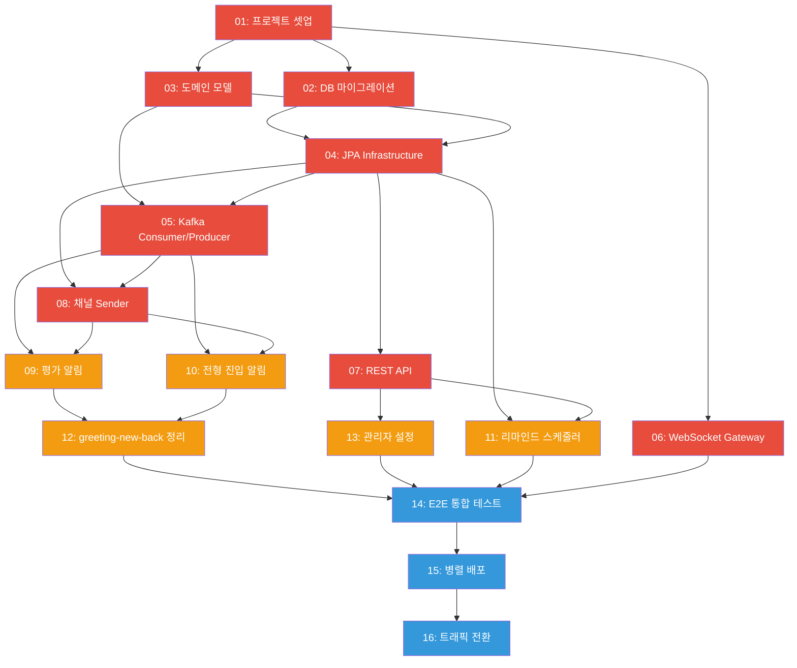
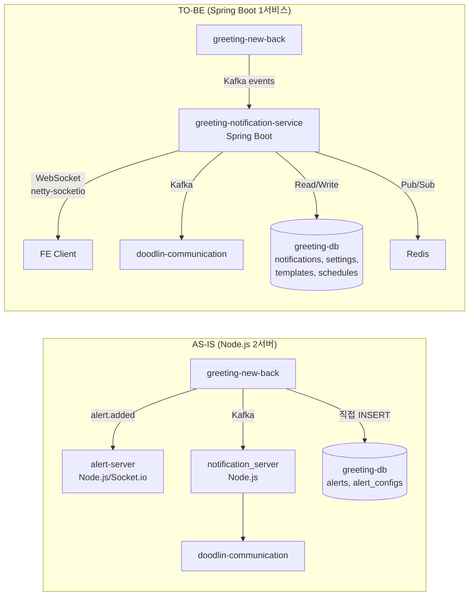

# 알림 시스템 완전 리팩토링 - 구현 티켓 Overview

> PRD: https://doodlin.atlassian.net/wiki/x/SICjdg
> 작성일: 2026-03-17
> 이전 분석: [gap_analysis.md](../../2026-03-16_notification-enhancement/gap_analysis.md), [tdd.md](../../2026-03-16_notification-enhancement/tdd.md)

---

## 1. 티켓 요약

| # | 티켓 ID | 제목 | Phase | 레포 | 예상 공수 | 의존성 |
|---|---------|------|-------|------|----------|--------|
| 01 | GRT-4001 | greeting-notification-service 프로젝트 셋업 | 1 | greeting-notification-service | 3d | - |
| 02 | GRT-4002 | DB 스키마 마이그레이션 (신규 ERD + 기존 데이터 이관) | 1 | greeting-db-schema | 3d | 01 |
| 03 | GRT-4003 | 도메인 모델 + Port 인터페이스 정의 | 1 | greeting-notification-service | 3d | 01 |
| 04 | GRT-4004 | JPA Entity + Repository Adapter 구현 | 1 | greeting-notification-service | 3d | 02, 03 |
| 05 | GRT-4005 | Kafka Consumer/Producer 구현 | 1 | greeting-notification-service | 4d | 03, 04 |
| 06 | GRT-4006 | WebSocket Gateway (netty-socketio) 마이그레이션 | 1 | greeting-notification-service | 5d | 01 |
| 07 | GRT-4007 | REST API 전체 구현 | 1 | greeting-notification-service | 4d | 04 |
| 08 | GRT-4008 | 채널별 Sender 구현 (InApp/Email/Slack) | 1 | greeting-notification-service | 3d | 04, 05 |
| 09 | GRT-4009 | 평가 상태별 알림 기능 구현 | 2 | greeting-notification-service, greeting-new-back | 4d | 05, 08 |
| 10 | GRT-4010 | 전형 진입 알림 기능 구현 | 2 | greeting-notification-service, greeting-new-back | 3d | 05, 08 |
| 11 | GRT-4011 | 리마인드 스케줄러 구현 | 2 | greeting-notification-service | 4d | 04, 07 |
| 12 | GRT-4012 | greeting-new-back 알림 코드 분리/정리 | 2 | greeting-new-back | 4d | 09, 10 |
| 13 | GRT-4013 | 관리자 멤버별 알림 설정 | 2 | greeting-notification-service | 3d | 07 |
| 14 | GRT-4014 | E2E 통합 테스트 (Testcontainers) | 3 | greeting-notification-service | 4d | 01~13 |
| 15 | GRT-4015 | dev/stage 병렬 배포 + 검증 | 3 | infra, greeting-notification-service | 3d | 14 |
| 16 | GRT-4016 | prod 트래픽 전환 + Node 서버 정리 | 3 | infra, notification_server, alert-server | 2d | 15 |

**총 예상 공수: 55 man-days (약 11주, 1인 기준)**

---

## 2. Phase 구분

| Phase | 목표 | 티켓 | 기간 |
|-------|------|------|------|
| **Phase 1: 서비스 구축** | 신규 Spring Boot 서비스 독립 구동 가능 상태 | 01~08 | 4~5주 |
| **Phase 2: 기능 구현 + greeting-new-back 변경** | PRD 기능 완성, 기존 코드 분리 | 09~13 | 3~4주 |
| **Phase 3: 전환 + 테스트** | 병렬 배포, 검증, prod 전환, 레거시 정리 | 14~16 | 2~3주 |

---

## 3. 의존관계도

**범례:** 빨강=Phase 1 (서비스 구축), 주황=Phase 2 (기능 구현), 파랑=Phase 3 (전환)

---

## 4. 3-Phase 배포 순서

### Phase 1: 서비스 구축 (Week 1~5)
1. 프로젝트 스캐폴딩 + CI/CD 파이프라인 구성
2. DB 스키마 신규 테이블 생성 + 기존 데이터 마이그레이션
3. 도메인 모델, JPA, Kafka, WebSocket, REST API, 채널 Sender 순차 구현
4. **마일스톤:** greeting-notification-service 단독 빌드/실행/API 호출 가능

### Phase 2: 기능 구현 + greeting-new-back 변경 (Week 5~8)
1. greeting-new-back에서 평가/전형 이벤트 Kafka 발행 추가
2. notification-service에서 이벤트 소비 -> 알림 생성 -> 채널별 발송
3. 리마인드 스케줄러 구현 (기존 cron 폴링 대체)
4. greeting-new-back 알림 관련 레거시 코드 분리/제거
5. 관리자 설정 기능 구현
6. **마일스톤:** 기능 완성, greeting-new-back에서 알림 책임 완전 분리

### Phase 3: 전환 + 테스트 (Week 8~11)
1. Testcontainers 기반 E2E 통합 테스트
2. dev/stage 환경에 신규 서비스 병렬 배포, Kafka groupId 분리
3. FE 연동 검증 (WebSocket, REST API)
4. prod 트래픽 전환 (Ingress 라우팅)
5. Node.js 서버 replica=0 -> 제거
6. **마일스톤:** Node.js 서버 완전 대체, 모니터링 안정화

---

## 5. 아키텍처 비교 (AS-IS vs TO-BE)

---

## 6. 예상 공수 상세

| Phase | 개발 | 테스트 | 코드리뷰 | 배포/검증 | 소계 |
|-------|------|--------|---------|----------|------|
| Phase 1 | 20d | 5d | 3d | - | 28d |
| Phase 2 | 14d | 3d | 2d | - | 19d |
| Phase 3 | 2d | 4d | - | 2d | 8d |
| **합계** | **36d** | **12d** | **5d** | **2d** | **55d** |

---

## 7. 위험 요소

| 리스크 | 영향도 | 완화 방안 |
|--------|--------|----------|
| WebSocket 프로토콜 호환성 (Socket.io v4) | 높음 | netty-socketio가 v4 지원하는지 사전 PoC 필수 |
| 기존 데이터 마이그레이션 무결성 | 높음 | 마이그레이션 스크립트 dry-run + 데이터 정합성 검증 쿼리 |
| greeting-new-back 알림 코드 분리 시 사이드이펙트 | 중간 | 기능별 점진적 분리, 각 단계 회귀 테스트 |
| Kafka groupId 전환 시 메시지 유실 | 중간 | 병렬 운영 기간 중 dual-consume으로 검증 |
| FE 변경 0 보장 불가 | 중간 | Socket.io 핸드셰이크/이벤트명 100% 호환 테스트 |

---

## 8. Phase 2-3 티켓 상세 요약

> 작성일: 2026-03-17 (Phase 1 티켓 완료 후 추가)

### Phase 2: 기능 구현 + greeting-new-back 변경

| # | 티켓 | 핵심 내용 | TC 수 | 상태 |
|---|------|----------|-------|------|
| 09 | [ticket_09_evaluation_alert.md](ticket_09_evaluation_alert.md) | 평가 완료/개별 등록 알림, Race Condition 대응 (비관적 락 + evaluation_completions) | 11 | 작성 완료 |
| 10 | [ticket_10_stage_entry_alert.md](ticket_10_stage_entry_alert.md) | 전형 진입 알림, 벌크 이동/그룹핑 전형 대응, scope별 구독자 조회 | 11 | 작성 완료 |
| 11 | [ticket_11_remind_scheduler.md](ticket_11_remind_scheduler.md) | 통합 리마인드 스케줄러 (5분 주기), 면접+평가 통합, Redis 분산 락, 멱등성 | 13 | 작성 완료 |
| 12 | [ticket_12_greeting_new_back_cleanup.md](ticket_12_greeting_new_back_cleanup.md) | 레거시 알림 코드 분리, Feature Flag 기반 점진적 전환, alert.added 병렬 발행 | 10 | 작성 완료 |
| 13 | [ticket_13_admin_setting.md](ticket_13_admin_setting.md) | 관리자 멤버별 오버라이드, 5계층 설정 resolve (워크스페이스→공고→전형→관리자→개인) | 12 | 작성 완료 |

### Phase 3: 전환 + 테스트

| # | 티켓 | 핵심 내용 | TC 수 | 상태 |
|---|------|----------|-------|------|
| 14 | [ticket_14_integration_test.md](ticket_14_integration_test.md) | Testcontainers E2E (MySQL+Kafka+Redis), 3 시나리오, Kafka 5건, WebSocket 3건 | 16 | 작성 완료 |
| 15 | [ticket_15_parallel_deploy.md](ticket_15_parallel_deploy.md) | dev/stage 병렬 배포, Kafka groupId 분리, K8s Ingress v2, FE 검증, 성능 비교 | 10 | 작성 완료 |
| 16 | [ticket_16_traffic_switch.md](ticket_16_traffic_switch.md) | prod 트래픽 전환, 3단계 롤백 계획, 모니터링 체크리스트, Node 서버 최종 정리 | 10 | 작성 완료 |

### Phase 2-3 핵심 설계 결정

| 주제 | 결정 | 근거 |
|------|------|------|
| Race Condition (평가 완료) | 비관적 락 (SELECT FOR UPDATE) + evaluation_completions unique constraint | 동시 평가 제출 시 완료 이벤트 중복 발행 방지 |
| 리마인드 스케줄러 동시성 | Redis 분산 락 + FOR UPDATE SKIP LOCKED | 다중 인스턴스 중복 실행 + 레코드 레벨 동시 처리 방지 |
| 레거시 코드 전환 | Feature Flag (@ConditionalOnProperty) | 단계별 점진적 전환, 즉시 롤백 가능 |
| 설정 계층 | 5계층 (워크스페이스→공고→전형→관리자 오버라이드→개인) | PRD 요구사항 + 유연한 설정 구조 |
| 병렬 배포 | Kafka groupId 분리 + Ingress v2 경로 | 기존 서비스 무중단 + 독립 검증 |
| prod 전환 | Ingress 라우팅 전환 + 3단계 롤백 | 무중단 전환 + 빠른 롤백 (1분/5분/15분) |

### Phase 2-3 테스트 케이스 총괄

| Phase | 티켓 | TC 수 |
|-------|------|-------|
| Phase 2 | 09~13 | 57건 |
| Phase 3 | 14~16 | 36건 |
| **합계** | | **93건** |
