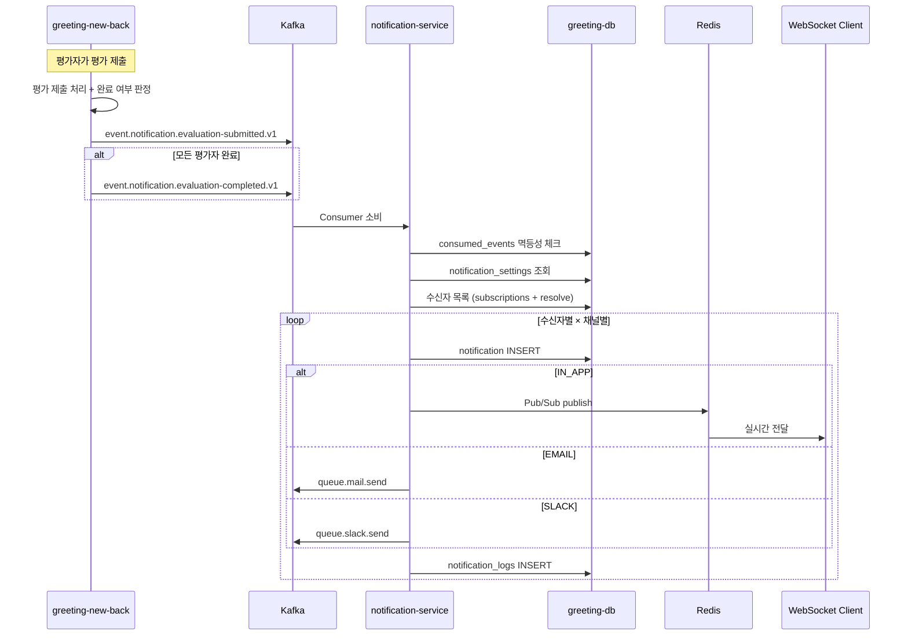

# [GRT-4009] 평가 상태별 알림 기능 구현

## 개요
- PRD: https://doodlin.atlassian.net/wiki/x/SICjdg
- Phase: 2 (기능 구현)
- 예상 공수: 4d
- 의존성: GRT-4005, GRT-4008

**범위:** greeting-new-back에서 평가 완료/개별 등록 시 Kafka 이벤트 발행 + notification-service에서 소비하여 채널별 알림 생성/발송. 동시 평가 제출 Race Condition 대응 포함.

## 작업 내용

### 다이어그램 (Mermaid)



### 1. greeting-new-back: 평가 이벤트 Kafka 발행

#### 평가 개별 등록 이벤트

```kotlin
// greeting-new-back: EvaluationService.kt
@Transactional
fun submitEvaluation(evaluationId: Long, evaluatorUserId: Long) {
    val evaluation = evaluationRepository.findById(evaluationId)
    evaluation.submit(evaluatorUserId)
    evaluationRepository.save(evaluation)

    // 개별 평가 등록 이벤트 발행
    kafkaProducer.send(
        "event.notification.evaluation-submitted.v1",
        evaluation.applicantId.toString(),
        EvaluationSubmittedEvent(
            eventId = UUID.randomUUID().toString(),
            workspaceId = evaluation.workspaceId,
            applicantId = evaluation.applicantId,
            applicantName = evaluation.applicantName,
            evaluatorUserId = evaluatorUserId,
            evaluationId = evaluationId,
            stageName = evaluation.stageName,
            submittedAt = Instant.now()
        )
    )

    // 완료 여부 판정 (Race Condition 대응: DB 락 사용)
    checkAndPublishCompletion(evaluation)
}
```

#### 평가 완료 이벤트 (Race Condition 대응)

동시에 여러 평가자가 제출할 경우, 마지막 제출자만 완료 이벤트를 발행해야 한다.

```kotlin
@Transactional
fun checkAndPublishCompletion(evaluation: Evaluation) {
    // SELECT ... FOR UPDATE로 비관적 락 획득
    val stage = stageRepository.findByIdForUpdate(evaluation.stageId)

    val totalEvaluators = stage.requiredEvaluatorCount
    val completedCount = evaluationRepository.countCompletedByApplicantAndStage(
        evaluation.applicantId, evaluation.stageId
    )

    if (completedCount >= totalEvaluators) {
        // 이미 완료 이벤트가 발행되었는지 확인 (멱등성)
        val alreadyCompleted = evaluationCompletionRepository
            .existsByApplicantIdAndStageId(evaluation.applicantId, evaluation.stageId)

        if (!alreadyCompleted) {
            evaluationCompletionRepository.save(
                EvaluationCompletion(evaluation.applicantId, evaluation.stageId)
            )

            kafkaProducer.send(
                "event.notification.evaluation-completed.v1",
                evaluation.applicantId.toString(),
                EvaluationCompletedEvent(
                    eventId = UUID.randomUUID().toString(),
                    workspaceId = evaluation.workspaceId,
                    applicantId = evaluation.applicantId,
                    applicantName = evaluation.applicantName,
                    stageName = evaluation.stageName,
                    completedCount = completedCount,
                    completedAt = Instant.now()
                )
            )
        }
    }
}
```

**Race Condition 대응 전략:**
- `SELECT ... FOR UPDATE`로 해당 전형 레코드에 비관적 락 획득
- `evaluation_completions` 테이블에 `(applicant_id, stage_id)` unique constraint
- 동시 트랜잭션 중 하나만 INSERT 성공
- 이미 완료 이벤트 발행된 경우 skip (멱등성)

### 2. notification-service: 평가 완료 알림 처리

```kotlin
// NotificationProcessor.kt (GRT-4005에서 정의, 여기서 구현 완성)
@Service
class EvaluationNotificationHandler(
    private val resolveSettingUseCase: ResolveNotificationSettingUseCase,
    private val subscriptionRepository: NotificationSubscriptionRepository,
    private val templateRepository: NotificationTemplateRepository,
    private val notificationRepository: NotificationRepository,
    private val channelSenderFactory: NotificationChannelSenderFactory
) {
    fun handleEvaluationCompleted(event: EvaluationCompletedEvent) {
        val type = NotificationType.EVALUATION_COMPLETED

        // 1. 구독자 조회: 해당 워크스페이스에서 EVALUATION_COMPLETED 구독한 사용자
        val subscribers = subscriptionRepository.findActiveSubscribers(
            event.workspaceId, type
        )

        // 2. 수신자별 설정 resolve + 채널별 알림 생성
        for (subscriber in subscribers) {
            for (channel in NotificationChannel.values()) {
                val enabled = resolveSettingUseCase.resolve(
                    event.workspaceId, subscriber.userId, type, channel
                )
                if (!enabled) continue

                val template = templateRepository.findByWorkspaceAndType(
                    event.workspaceId, type, channel
                ) ?: templateRepository.findDefault(type, channel)
                ?: continue

                val rendered = template.render(mapOf(
                    "applicantName" to event.applicantName,
                    "stageName" to event.stageName,
                    "completedCount" to event.completedCount.toString()
                ))

                val notification = notificationRepository.save(Notification(
                    workspaceId = event.workspaceId,
                    recipientUserId = subscriber.userId,
                    type = type,
                    category = NotificationCategory.EVALUATION,
                    channel = channel,
                    title = rendered.subject ?: rendered.body.take(100),
                    content = rendered.body,
                    metadata = mapOf(
                        "applicantId" to event.applicantId.toString(),
                        "applicantName" to event.applicantName,
                        "stageName" to event.stageName
                    ),
                    sourceType = SourceType.APPLICANT,
                    sourceId = event.applicantId.toString()
                ))

                channelSenderFactory.getSender(channel).send(notification)
            }
        }
    }

    fun handleEvaluationSubmitted(event: EvaluationSubmittedEvent) {
        val type = NotificationType.EVALUATION_SUBMITTED

        // 공고 담당자에게만 알림 (평가자 본인 제외)
        val subscribers = subscriptionRepository.findActiveSubscribers(
            event.workspaceId, type
        ).filter { it.userId != event.evaluatorUserId }

        for (subscriber in subscribers) {
            for (channel in NotificationChannel.values()) {
                val enabled = resolveSettingUseCase.resolve(
                    event.workspaceId, subscriber.userId, type, channel
                )
                if (!enabled) continue

                val template = templateRepository.findByWorkspaceAndType(
                    event.workspaceId, type, channel
                ) ?: templateRepository.findDefault(type, channel)
                ?: continue

                val rendered = template.render(mapOf(
                    "applicantName" to event.applicantName,
                    "stageName" to event.stageName
                ))

                val notification = notificationRepository.save(Notification(
                    workspaceId = event.workspaceId,
                    recipientUserId = subscriber.userId,
                    type = type,
                    category = NotificationCategory.EVALUATION,
                    channel = channel,
                    title = rendered.subject ?: rendered.body.take(100),
                    content = rendered.body,
                    metadata = mapOf(
                        "applicantId" to event.applicantId.toString(),
                        "evaluatorUserId" to event.evaluatorUserId.toString(),
                        "stageName" to event.stageName
                    ),
                    sourceType = SourceType.APPLICANT,
                    sourceId = event.applicantId.toString()
                ))

                channelSenderFactory.getSender(channel).send(notification)
            }
        }
    }
}
```

### 3. 이벤트 페이로드 정의

```kotlin
data class EvaluationCompletedEvent(
    val eventId: String,
    val workspaceId: Long,
    val applicantId: Long,
    val applicantName: String,
    val stageName: String,
    val completedCount: Int,
    val completedAt: Instant
)

data class EvaluationSubmittedEvent(
    val eventId: String,
    val workspaceId: Long,
    val applicantId: Long,
    val applicantName: String,
    val evaluatorUserId: Long,
    val evaluationId: Long,
    val stageName: String,
    val submittedAt: Instant
)
```

### 수정 파일 목록

| 레포 | 모듈 | 파일 경로 | 변경 유형 |
|------|------|----------|----------|
| greeting-new-back | evaluation | src/.../evaluation/service/EvaluationService.kt | 수정 (이벤트 발행 추가) |
| greeting-new-back | evaluation | src/.../evaluation/event/EvaluationSubmittedEvent.kt | 신규 |
| greeting-new-back | evaluation | src/.../evaluation/event/EvaluationCompletedEvent.kt | 신규 |
| greeting-new-back | evaluation | src/.../evaluation/repository/EvaluationCompletionRepository.kt | 신규 |
| greeting-new-back | evaluation | src/.../evaluation/entity/EvaluationCompletion.kt | 신규 |
| greeting-new-back | infrastructure | src/.../infrastructure/kafka/NotificationEventProducer.kt | 신규 |
| greeting-notification-service | application | src/.../application/handler/EvaluationNotificationHandler.kt | 신규 |
| greeting-notification-service | infrastructure | src/.../infrastructure/kafka/event/EvaluationCompletedEvent.kt | 신규 |
| greeting-notification-service | infrastructure | src/.../infrastructure/kafka/event/EvaluationSubmittedEvent.kt | 신규 |
| greeting-db-schema | migration | V2026_03__add_evaluation_completions.sql | 신규 |

## 영향 범위

- greeting-new-back: `EvaluationService`에 Kafka 발행 코드 추가 (기존 평가 로직 변경 없음)
- greeting-db-schema: `evaluation_completions` 테이블 추가 (Race Condition 방지용)
- greeting-topic: 2개 토픽 사용 (GRT-4005에서 생성)
- doodlin-communication: queue.mail.send, queue.slack.send 소비 (변경 없음)

## 테스트 케이스

| ID | 테스트명 | Given | When | Then |
|----|---------|-------|------|------|
| TC-09-01 | 평가 개별 등록 알림 | 평가자 A가 평가 제출 | evaluation-submitted.v1 소비 | 구독자에게 IN_APP 알림 생성 |
| TC-09-02 | 평가자 본인 제외 | 평가자 A 제출, A도 구독자 | evaluation-submitted.v1 소비 | A에게는 알림 미발송 |
| TC-09-03 | 평가 완료 알림 | 3명 중 마지막 평가자 제출 | evaluation-completed.v1 소비 | 구독자에게 완료 알림 생성 |
| TC-09-04 | Race Condition - 동시 제출 | 2명이 동시에 마지막 평가 제출 | 두 트랜잭션 동시 실행 | 완료 이벤트 1건만 발행 |
| TC-09-05 | Race Condition - 멱등성 | 동일 eventId로 2회 소비 | Consumer 2회 처리 | Notification 1건만 생성 |
| TC-09-06 | 설정 비활성화 | EVALUATION_COMPLETED 비활성 | 이벤트 소비 | 알림 생성 안 됨 |
| TC-09-07 | 채널별 분기 | IN_APP + EMAIL 활성, SLACK 비활성 | 이벤트 소비 | IN_APP, EMAIL만 발송 |
| TC-09-08 | 템플릿 렌더링 | 커스텀 템플릿 존재 | 이벤트 소비 | applicantName, stageName 치환된 내용 |
| TC-09-09 | 기본 템플릿 fallback | 커스텀 템플릿 없음 | 이벤트 소비 | 기본 템플릿으로 발송 |
| TC-09-10 | 구독자 0명 | 아무도 구독 안 함 | 이벤트 소비 | 알림 0건, 에러 없음 |
| TC-09-11 | 이메일 발송 실패 격리 | EMAIL 채널 Kafka 오류 | 이벤트 소비 | IN_APP 정상 발송, EMAIL 로그 FAILED |

## 기대 결과 (AC)

- [ ] greeting-new-back에서 평가 제출 시 evaluation-submitted.v1 이벤트 정상 발행
- [ ] 모든 평가 완료 시 evaluation-completed.v1 이벤트 정상 발행 (1건만)
- [ ] 동시 평가 제출 Race Condition에서도 완료 이벤트 중복 발행 없음
- [ ] notification-service에서 이벤트 소비 → 설정 체크 → 채널별 발송 정상 동작
- [ ] 멱등성 보장 (동일 eventId 중복 처리 방지)
- [ ] 평가자 본인에게는 개별 등록 알림 미발송

## 체크리스트

- [ ] evaluation_completions 테이블 DDL + unique constraint 확인
- [ ] SELECT ... FOR UPDATE 비관적 락 동작 확인 (MySQL InnoDB)
- [ ] 이벤트 페이로드에 필요한 모든 필드 포함 확인
- [ ] greeting-new-back 기존 평가 로직 회귀 테스트
- [ ] 빌드 확인 (greeting-new-back, greeting-notification-service)
- [ ] 테스트 통과
