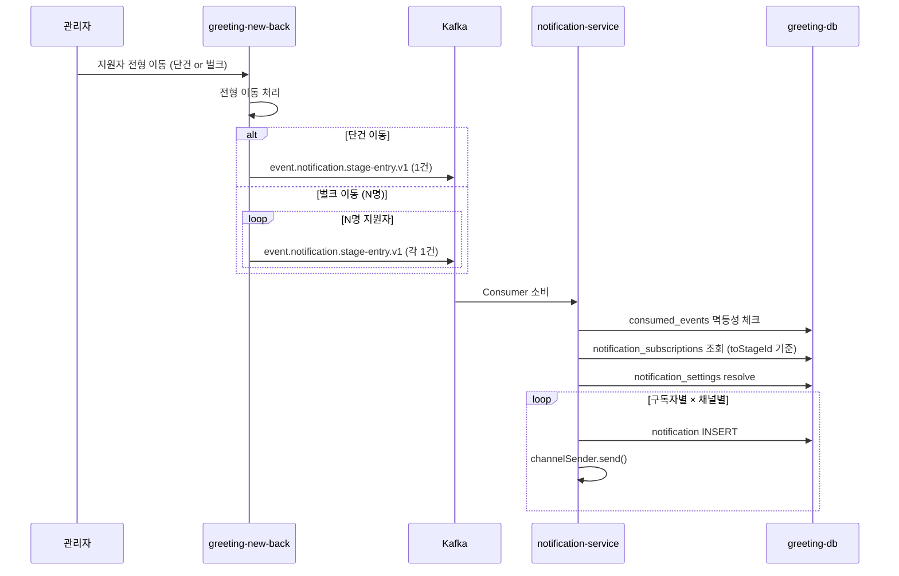
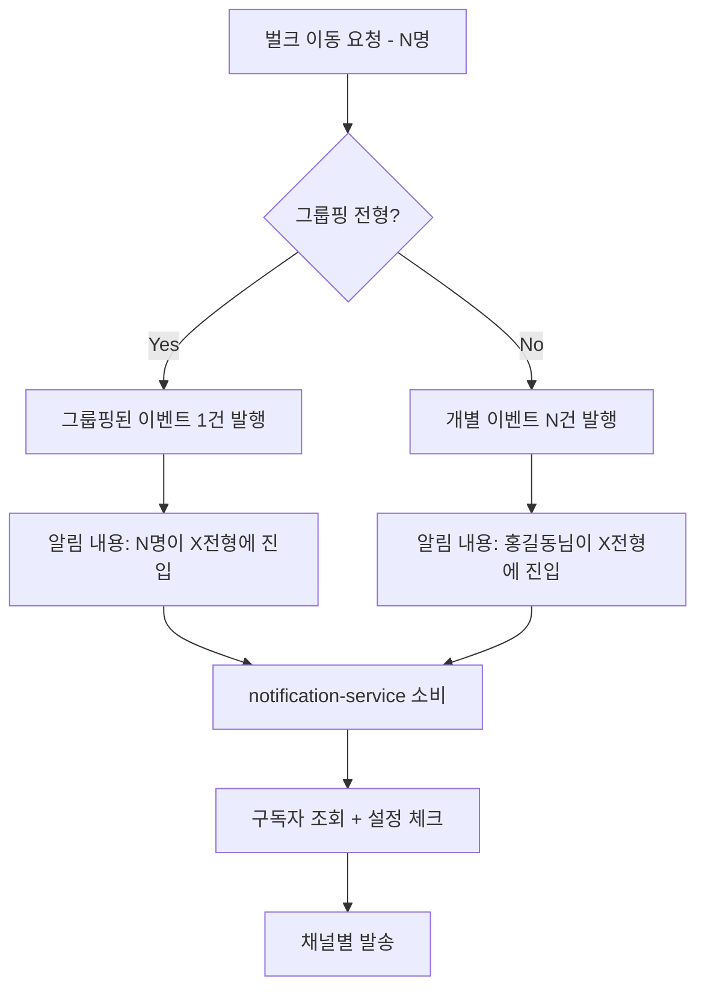

# [GRT-4010] 전형 진입 알림 기능 구현

## 개요
- PRD: https://doodlin.atlassian.net/wiki/x/SICjdg
- Phase: 2 (기능 구현)
- 예상 공수: 3d
- 의존성: GRT-4005, GRT-4008
- 선행 티켓: ticket_05_kafka_consumer_producer, ticket_08_channel_senders

**범위:** greeting-new-back에서 전형 이동 시 Kafka 이벤트 발행 + notification-service에서 소비하여 전형/공고/워크스페이스 레벨 구독자에게 알림 생성/발송. 벌크 이동·그룹핑 전형 대응 포함.

## 작업 내용

### 다이어그램 (Mermaid)





### 1. greeting-new-back: 전형 이동 이벤트 Kafka 발행

#### 단건 이동

```kotlin
// greeting-new-back: ApplicantStageService.kt
@Transactional
fun moveApplicantToStage(applicantId: Long, toStageId: Long, movedByUserId: Long) {
    val applicant = applicantRepository.findById(applicantId)
    val fromStageId = applicant.currentStageId
    val toStage = stageRepository.findById(toStageId)

    applicant.moveTo(toStageId)
    applicantRepository.save(applicant)

    // 전형 진입 이벤트 발행
    notificationEventProducer.publishStageEntry(
        StageEntryEvent(
            eventId = UUID.randomUUID().toString(),
            workspaceId = applicant.workspaceId,
            applicantId = applicantId,
            applicantName = applicant.name,
            fromStageId = fromStageId,
            toStageId = toStageId,
            toStageName = toStage.name,
            postingId = applicant.postingId,
            isBulk = false,
            bulkCount = null,
            enteredAt = Instant.now()
        )
    )
}
```

#### 벌크 이동

```kotlin
@Transactional
fun bulkMoveApplicants(applicantIds: List<Long>, toStageId: Long, movedByUserId: Long) {
    val toStage = stageRepository.findById(toStageId)
    val applicants = applicantRepository.findByIds(applicantIds)

    // 전형 이동 처리
    applicants.forEach { it.moveTo(toStageId) }
    applicantRepository.saveAll(applicants)

    if (toStage.isGroupingStage()) {
        // 그룹핑 전형: 하나의 그룹핑 이벤트만 발행
        notificationEventProducer.publishStageEntry(
            StageEntryEvent(
                eventId = UUID.randomUUID().toString(),
                workspaceId = toStage.workspaceId,
                applicantId = null,  // 그룹핑이므로 null
                applicantName = null,
                fromStageId = null,
                toStageId = toStageId,
                toStageName = toStage.name,
                postingId = applicants.first().postingId,
                isBulk = true,
                bulkCount = applicantIds.size,
                enteredAt = Instant.now()
            )
        )
    } else {
        // 일반 전형: 개별 이벤트 발행
        applicants.forEach { applicant ->
            notificationEventProducer.publishStageEntry(
                StageEntryEvent(
                    eventId = UUID.randomUUID().toString(),
                    workspaceId = applicant.workspaceId,
                    applicantId = applicant.id,
                    applicantName = applicant.name,
                    fromStageId = applicant.previousStageId,
                    toStageId = toStageId,
                    toStageName = toStage.name,
                    postingId = applicant.postingId,
                    isBulk = false,
                    bulkCount = null,
                    enteredAt = Instant.now()
                )
            )
        }
    }
}
```

### 2. 이벤트 페이로드 정의

```kotlin
data class StageEntryEvent(
    val eventId: String,
    val workspaceId: Long,
    val applicantId: Long?,       // 그룹핑 시 null
    val applicantName: String?,   // 그룹핑 시 null
    val fromStageId: Long?,       // 그룹핑 시 null
    val toStageId: Long,
    val toStageName: String,
    val postingId: Long,
    val isBulk: Boolean,
    val bulkCount: Int?,          // 벌크일 때만 사용
    val enteredAt: Instant
)
```

### 3. notification-service: 전형 진입 알림 처리

```kotlin
@Service
class StageEntryNotificationHandler(
    private val resolveSettingUseCase: ResolveNotificationSettingUseCase,
    private val subscriptionRepository: NotificationSubscriptionRepository,
    private val templateRepository: NotificationTemplateRepository,
    private val notificationRepository: NotificationRepository,
    private val channelSenderFactory: NotificationChannelSenderFactory
) {
    fun handleStageEntry(event: StageEntryEvent) {
        val type = NotificationType.STAGE_ENTRY

        // 1. toStageId에 대해 구독 중인 사용자 조회
        val subscribers = subscriptionRepository.findActiveSubscribersByStage(
            event.workspaceId, type, event.toStageId
        )

        // 2. 수신자별 설정 resolve + 채널별 알림 생성
        for (subscriber in subscribers) {
            for (channel in NotificationChannel.values()) {
                val enabled = resolveSettingUseCase.resolve(
                    event.workspaceId, subscriber.userId, type, channel
                )
                if (!enabled) continue

                val template = templateRepository.findByWorkspaceAndType(
                    event.workspaceId, type, channel
                ) ?: templateRepository.findDefault(type, channel)
                ?: continue

                val templateVars = if (event.isBulk) {
                    mapOf(
                        "bulkCount" to event.bulkCount.toString(),
                        "stageName" to event.toStageName
                    )
                } else {
                    mapOf(
                        "applicantName" to (event.applicantName ?: ""),
                        "stageName" to event.toStageName
                    )
                }

                val rendered = template.render(templateVars)

                val notification = notificationRepository.save(Notification(
                    workspaceId = event.workspaceId,
                    recipientUserId = subscriber.userId,
                    type = type,
                    category = NotificationCategory.APPLICANT,
                    channel = channel,
                    title = rendered.subject ?: rendered.body.take(100),
                    content = rendered.body,
                    metadata = mapOf(
                        "toStageId" to event.toStageId.toString(),
                        "toStageName" to event.toStageName,
                        "postingId" to event.postingId.toString(),
                        "isBulk" to event.isBulk.toString(),
                        "bulkCount" to (event.bulkCount?.toString() ?: ""),
                        "applicantId" to (event.applicantId?.toString() ?: "")
                    ),
                    sourceType = if (event.isBulk) SourceType.STAGE else SourceType.APPLICANT,
                    sourceId = if (event.isBulk) event.toStageId.toString()
                              else event.applicantId.toString()
                ))

                channelSenderFactory.getSender(channel).send(notification)
            }
        }
    }
}
```

### 4. 구독자 조회 쿼리 (전형 레벨)

```kotlin
// NotificationSubscriptionRepository 확장
interface NotificationSubscriptionRepository {
    // 기존
    fun findActiveSubscribers(workspaceId: Long, type: NotificationType): List<Subscription>

    // 신규: 전형 레벨 구독자 조회
    fun findActiveSubscribersByStage(
        workspaceId: Long, type: NotificationType, stageId: Long
    ): List<Subscription>
}
```

```sql
-- 전형 레벨 구독자 조회 쿼리
SELECT DISTINCT ns.user_id
FROM notification_subscriptions ns
WHERE ns.workspace_id = :workspaceId
  AND ns.notification_type = 'STAGE_ENTRY'
  AND ns.enabled = true
  AND (
    ns.scope_type = 'WORKSPACE'  -- 워크스페이스 전체 구독
    OR (ns.scope_type = 'POSTING' AND ns.scope_id = :postingId)  -- 공고 레벨
    OR (ns.scope_type = 'STAGE' AND ns.scope_id = :stageId)      -- 전형 레벨
  )
```

### 수정 파일 목록

| 레포 | 모듈 | 파일 경로 | 변경 유형 |
|------|------|----------|----------|
| greeting-new-back | applicant | src/.../applicant/service/ApplicantStageService.kt | 수정 (이벤트 발행 추가) |
| greeting-new-back | applicant | src/.../applicant/event/StageEntryEvent.kt | 신규 |
| greeting-new-back | infrastructure | src/.../infrastructure/kafka/NotificationEventProducer.kt | 수정 (publishStageEntry 추가) |
| greeting-notification-service | application | src/.../application/handler/StageEntryNotificationHandler.kt | 신규 |
| greeting-notification-service | infrastructure | src/.../infrastructure/kafka/event/StageEntryEvent.kt | 신규 |
| greeting-notification-service | domain | src/.../domain/repository/NotificationSubscriptionRepository.kt | 수정 (findActiveSubscribersByStage 추가) |
| greeting-notification-service | infrastructure | src/.../infrastructure/persistence/NotificationSubscriptionJpaRepository.kt | 수정 (쿼리 추가) |

## 영향 범위

- greeting-new-back: ApplicantStageService에 Kafka 발행 코드 추가 (기존 전형 이동 로직은 변경 없음)
- greeting-notification-service: 신규 Handler + Repository 쿼리 확장
- greeting-topic: event.notification.stage-entry.v1 사용 (GRT-4005에서 생성)

## 테스트 케이스

| ID | 테스트명 | Given | When | Then |
|----|---------|-------|------|------|
| TC-10-01 | 단건 전형 이동 알림 | 지원자 1명 전형 이동 | stage-entry.v1 소비 | 구독자에게 알림 생성 |
| TC-10-02 | 벌크 이동 - 일반 전형 | 5명 벌크 이동 (일반 전형) | stage-entry.v1 5건 소비 | 각 지원자별 알림 생성 |
| TC-10-03 | 벌크 이동 - 그룹핑 전형 | 5명 벌크 이동 (그룹핑 전형) | stage-entry.v1 1건 소비 | "5명이 X전형에 진입" 알림 1건 |
| TC-10-04 | 전형 레벨 구독자만 수신 | A는 서류전형 구독, B는 면접전형 구독 | 서류전형 진입 이벤트 | A만 알림 수신 |
| TC-10-05 | 워크스페이스 전체 구독 | C가 WORKSPACE 스코프 구독 | 어느 전형이든 진입 | C에게 알림 수신 |
| TC-10-06 | 설정 비활성화 시 skip | STAGE_ENTRY 비활성 | 이벤트 소비 | 알림 생성 안 됨 |
| TC-10-07 | 멱등성 | 동일 eventId 2회 소비 | Consumer 2회 처리 | Notification 1건만 생성 |
| TC-10-08 | 채널별 분기 | IN_APP만 활성 | 이벤트 소비 | IN_APP만 발송, EMAIL/SLACK 미발송 |
| TC-10-09 | 그룹핑 템플릿 렌더링 | 벌크 그룹핑 이벤트 | 이벤트 소비 | bulkCount, stageName 치환 |
| TC-10-10 | 구독자 0명 | 아무도 해당 전형 구독 안 함 | 이벤트 소비 | 알림 0건, 에러 없음 |
| TC-10-11 | 공고 레벨 구독 | D가 공고 레벨 구독 | 해당 공고 내 전형 진입 | D에게 알림 수신 |

## 기대 결과 (AC)

- [ ] greeting-new-back에서 전형 이동 시 stage-entry.v1 이벤트 정상 발행
- [ ] 벌크 이동 시 일반 전형은 개별 이벤트, 그룹핑 전형은 1건 그룹핑 이벤트
- [ ] notification-service에서 전형/공고/워크스페이스 레벨 구독자 정확히 조회
- [ ] 설정 resolve → 채널별 발송 정상 동작
- [ ] 멱등성 보장

## 체크리스트

- [ ] 그룹핑 전형 판별 로직 확인 (Stage.isGroupingStage())
- [ ] 벌크 이동 시 이벤트 대량 발행 성능 확인 (100명 이상)
- [ ] scope_type별 구독 쿼리 인덱스 확인
- [ ] greeting-new-back 기존 전형 이동 로직 회귀 테스트
- [ ] 빌드 확인
- [ ] 테스트 통과
