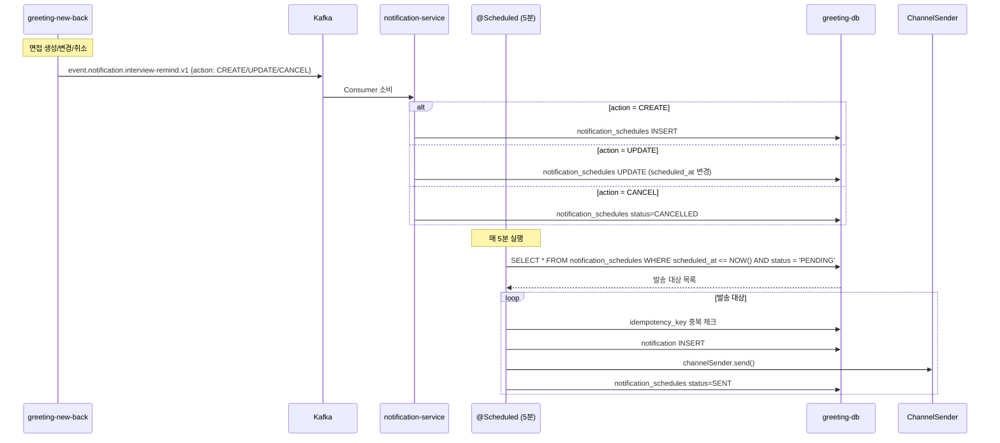
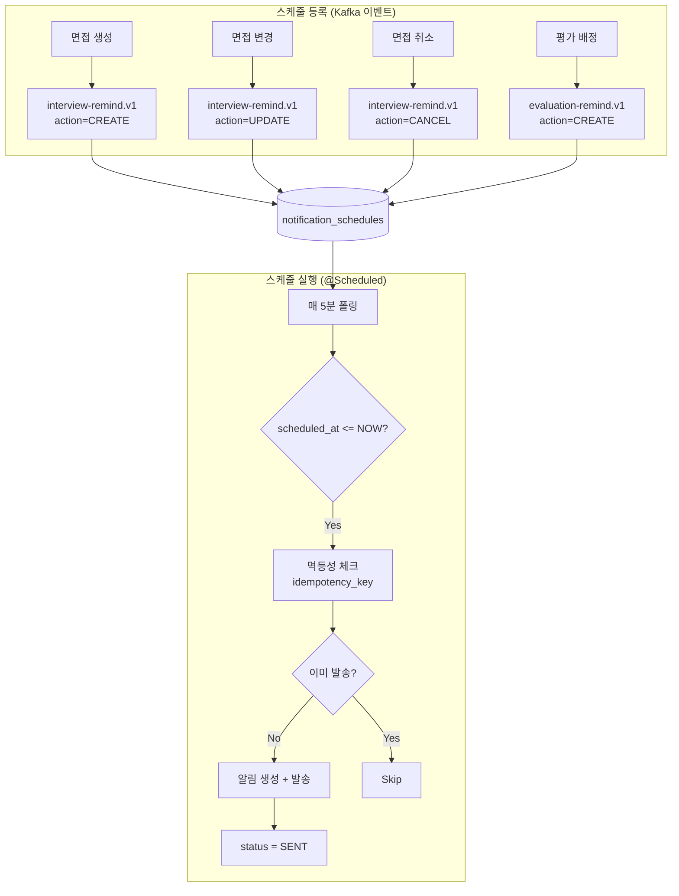

# [GRT-4011] 리마인드 스케줄러 구현

## 개요
- PRD: https://doodlin.atlassian.net/wiki/x/SICjdg
- Phase: 2 (기능 구현)
- 예상 공수: 4d
- 의존성: GRT-4004, GRT-4007
- 선행 티켓: ticket_04_jpa_infrastructure, ticket_07_rest_api

**범위:** `notification_schedules` 테이블 기반 통합 리마인드 스케줄러. 면접·평가 리마인드를 1개 스케줄러로 통합, 5분 주기 실행. 스케줄 등록/갱신/취소 cascade + `idempotency_key` 멱등성 보장.

## 작업 내용

### 다이어그램 (Mermaid)





### 1. notification_schedules 스케줄 관리

#### 스케줄 등록/갱신/취소 핸들러

```kotlin
@Service
class RemindScheduleHandler(
    private val scheduleRepository: NotificationScheduleRepository
) {
    /**
     * 면접 리마인드 스케줄 처리
     */
    fun handleInterviewRemind(event: InterviewRemindEvent) {
        when (event.action) {
            ScheduleAction.CREATE -> {
                val remindAt = event.scheduledAt.minus(
                    Duration.ofMinutes(event.remindBeforeMinutes ?: 60)
                )
                scheduleRepository.save(NotificationSchedule(
                    workspaceId = event.workspaceId,
                    scheduleType = ScheduleType.INTERVIEW_REMIND,
                    referenceType = "MEETING",
                    referenceId = event.meetingId.toString(),
                    scheduledAt = remindAt,
                    status = ScheduleStatus.PENDING,
                    idempotencyKey = "interview-remind:${event.meetingId}:${remindAt.toEpochMilli()}",
                    metadata = mapOf(
                        "meetingId" to event.meetingId.toString(),
                        "interviewAt" to event.scheduledAt.toString()
                    )
                ))
            }
            ScheduleAction.UPDATE -> {
                // 기존 PENDING 스케줄 취소 후 새로 등록
                scheduleRepository.cancelByReference("MEETING", event.meetingId.toString())

                val remindAt = event.scheduledAt.minus(
                    Duration.ofMinutes(event.remindBeforeMinutes ?: 60)
                )
                scheduleRepository.save(NotificationSchedule(
                    workspaceId = event.workspaceId,
                    scheduleType = ScheduleType.INTERVIEW_REMIND,
                    referenceType = "MEETING",
                    referenceId = event.meetingId.toString(),
                    scheduledAt = remindAt,
                    status = ScheduleStatus.PENDING,
                    idempotencyKey = "interview-remind:${event.meetingId}:${remindAt.toEpochMilli()}",
                    metadata = mapOf(
                        "meetingId" to event.meetingId.toString(),
                        "interviewAt" to event.scheduledAt.toString()
                    )
                ))
            }
            ScheduleAction.CANCEL -> {
                scheduleRepository.cancelByReference("MEETING", event.meetingId.toString())
            }
        }
    }

    /**
     * 평가 리마인드 스케줄 처리
     * - 반복 리마인드: repeatIntervalDays마다, maxCount까지
     */
    fun handleEvaluationRemind(event: EvaluationRemindEvent) {
        when (event.action) {
            ScheduleAction.CREATE -> {
                val remindAt = event.scheduledAt.minus(
                    Duration.ofHours(event.remindBeforeHours ?: 24)
                )
                // 첫 번째 리마인드
                scheduleRepository.save(NotificationSchedule(
                    workspaceId = event.workspaceId,
                    scheduleType = ScheduleType.EVALUATION_REMIND,
                    referenceType = "EVALUATION",
                    referenceId = event.evaluationId.toString(),
                    scheduledAt = remindAt,
                    status = ScheduleStatus.PENDING,
                    idempotencyKey = "eval-remind:${event.evaluationId}:1",
                    metadata = mapOf(
                        "evaluationId" to event.evaluationId.toString(),
                        "deadlineAt" to event.scheduledAt.toString(),
                        "sequence" to "1",
                        "maxCount" to (event.maxCount ?: 3).toString(),
                        "repeatIntervalDays" to (event.repeatIntervalDays ?: 3).toString()
                    )
                ))
            }
            ScheduleAction.UPDATE -> {
                scheduleRepository.cancelByReference("EVALUATION", event.evaluationId.toString())
                handleEvaluationRemind(event.copy(action = ScheduleAction.CREATE))
            }
            ScheduleAction.CANCEL -> {
                scheduleRepository.cancelByReference("EVALUATION", event.evaluationId.toString())
            }
        }
    }
}
```

### 2. 통합 스케줄러 (@Scheduled)

```kotlin
@Component
class NotificationRemindScheduler(
    private val scheduleRepository: NotificationScheduleRepository,
    private val notificationRepository: NotificationRepository,
    private val resolveSettingUseCase: ResolveNotificationSettingUseCase,
    private val subscriptionRepository: NotificationSubscriptionRepository,
    private val templateRepository: NotificationTemplateRepository,
    private val channelSenderFactory: NotificationChannelSenderFactory,
    private val redisLockProvider: RedisLockProvider
) {
    companion object {
        private const val BATCH_SIZE = 100
        private const val LOCK_KEY = "remind-scheduler-lock"
        private const val LOCK_DURATION_SECONDS = 240L  // 4분 (5분 주기보다 짧게)
    }

    /**
     * 매 5분 실행. Redis 분산 락으로 다중 인스턴스 중복 실행 방지.
     */
    @Scheduled(cron = "0 */5 * * * *")
    fun executeRemindSchedule() {
        val lock = redisLockProvider.tryLock(LOCK_KEY, LOCK_DURATION_SECONDS)
        if (lock == null) {
            log.info("Remind scheduler: another instance is running, skipping")
            return
        }

        try {
            var processed = 0
            do {
                val schedules = scheduleRepository.findPendingSchedules(
                    scheduledAtBefore = Instant.now(),
                    limit = BATCH_SIZE
                )

                for (schedule in schedules) {
                    try {
                        processSchedule(schedule)
                        processed++
                    } catch (e: Exception) {
                        log.error("Failed to process schedule: id=${schedule.id}", e)
                        scheduleRepository.markFailed(schedule.id, e.message)
                    }
                }
            } while (schedules.size == BATCH_SIZE)

            log.info("Remind scheduler completed: processed=$processed")
        } finally {
            redisLockProvider.unlock(LOCK_KEY)
        }
    }

    private fun processSchedule(schedule: NotificationSchedule) {
        // 1. 멱등성 체크
        if (notificationRepository.existsByIdempotencyKey(schedule.idempotencyKey)) {
            log.info("Duplicate schedule skipped: idempotencyKey=${schedule.idempotencyKey}")
            scheduleRepository.markSent(schedule.id)
            return
        }

        // 2. 알림 유형 결정
        val type = when (schedule.scheduleType) {
            ScheduleType.INTERVIEW_REMIND -> NotificationType.INTERVIEW_REMIND
            ScheduleType.EVALUATION_REMIND -> NotificationType.EVALUATION_REMIND
        }

        // 3. 구독자 조회
        val subscribers = subscriptionRepository.findActiveSubscribers(
            schedule.workspaceId, type
        )

        // 4. 수신자별 설정 resolve + 알림 생성/발송
        for (subscriber in subscribers) {
            for (channel in NotificationChannel.values()) {
                val enabled = resolveSettingUseCase.resolve(
                    schedule.workspaceId, subscriber.userId, type, channel
                )
                if (!enabled) continue

                val template = templateRepository.findByWorkspaceAndType(
                    schedule.workspaceId, type, channel
                ) ?: templateRepository.findDefault(type, channel)
                ?: continue

                val rendered = template.render(schedule.metadata ?: emptyMap())

                val notification = notificationRepository.save(Notification(
                    workspaceId = schedule.workspaceId,
                    recipientUserId = subscriber.userId,
                    type = type,
                    category = NotificationCategory.REMIND,
                    channel = channel,
                    title = rendered.subject ?: rendered.body.take(100),
                    content = rendered.body,
                    metadata = schedule.metadata,
                    sourceType = SourceType.valueOf(schedule.referenceType),
                    sourceId = schedule.referenceId,
                    idempotencyKey = "${schedule.idempotencyKey}:${subscriber.userId}:${channel.name}"
                ))

                channelSenderFactory.getSender(channel).send(notification)
            }
        }

        // 5. 스케줄 상태 업데이트
        scheduleRepository.markSent(schedule.id)

        // 6. 평가 리마인드 반복 스케줄 등록
        if (schedule.scheduleType == ScheduleType.EVALUATION_REMIND) {
            registerNextEvaluationRemind(schedule)
        }
    }

    /**
     * 평가 리마인드 반복 등록: 현재 sequence < maxCount이면 다음 스케줄 생성
     */
    private fun registerNextEvaluationRemind(schedule: NotificationSchedule) {
        val currentSequence = schedule.metadata?.get("sequence")?.toIntOrNull() ?: 1
        val maxCount = schedule.metadata?.get("maxCount")?.toIntOrNull() ?: 3
        val repeatIntervalDays = schedule.metadata?.get("repeatIntervalDays")?.toLongOrNull() ?: 3

        if (currentSequence < maxCount) {
            val nextSequence = currentSequence + 1
            val nextScheduledAt = schedule.scheduledAt.plus(Duration.ofDays(repeatIntervalDays))

            scheduleRepository.save(NotificationSchedule(
                workspaceId = schedule.workspaceId,
                scheduleType = ScheduleType.EVALUATION_REMIND,
                referenceType = schedule.referenceType,
                referenceId = schedule.referenceId,
                scheduledAt = nextScheduledAt,
                status = ScheduleStatus.PENDING,
                idempotencyKey = "eval-remind:${schedule.referenceId}:$nextSequence",
                metadata = schedule.metadata?.toMutableMap()?.apply {
                    put("sequence", nextSequence.toString())
                }
            ))
        }
    }
}
```

### 3. 이벤트 페이로드 정의

```kotlin
data class InterviewRemindEvent(
    val eventId: String,
    val workspaceId: Long,
    val meetingId: Long,
    val scheduledAt: Instant,       // 면접 시각
    val remindBeforeMinutes: Long?, // 몇 분 전 리마인드 (기본 60)
    val action: ScheduleAction      // CREATE, UPDATE, CANCEL
)

data class EvaluationRemindEvent(
    val eventId: String,
    val workspaceId: Long,
    val evaluationId: Long,
    val scheduledAt: Instant,        // 평가 마감 시각
    val remindBeforeHours: Long?,    // 몇 시간 전 리마인드 (기본 24)
    val repeatIntervalDays: Long?,   // 반복 간격 (기본 3일)
    val maxCount: Int?,              // 최대 리마인드 횟수 (기본 3)
    val action: ScheduleAction
)

enum class ScheduleAction { CREATE, UPDATE, CANCEL }
enum class ScheduleType { INTERVIEW_REMIND, EVALUATION_REMIND }
enum class ScheduleStatus { PENDING, SENT, CANCELLED, FAILED }
```

### 4. Repository 인터페이스

```kotlin
interface NotificationScheduleRepository {
    fun save(schedule: NotificationSchedule): NotificationSchedule

    fun findPendingSchedules(scheduledAtBefore: Instant, limit: Int): List<NotificationSchedule>

    fun cancelByReference(referenceType: String, referenceId: String): Int

    fun markSent(id: Long)

    fun markFailed(id: Long, errorMessage: String?)
}
```

```sql
-- 스케줄 조회 쿼리 (인덱스 활용)
SELECT * FROM notification_schedules
WHERE status = 'PENDING'
  AND scheduled_at <= :now
ORDER BY scheduled_at ASC
LIMIT :limit
FOR UPDATE SKIP LOCKED;   -- 다중 인스턴스 동시 처리 방지
```

### 5. Redis 분산 락

```kotlin
@Component
class RedisLockProvider(
    private val redisTemplate: StringRedisTemplate
) {
    fun tryLock(key: String, durationSeconds: Long): String? {
        val lockValue = UUID.randomUUID().toString()
        val acquired = redisTemplate.opsForValue()
            .setIfAbsent("lock:$key", lockValue, Duration.ofSeconds(durationSeconds))
        return if (acquired == true) lockValue else null
    }

    fun unlock(key: String) {
        redisTemplate.delete("lock:$key")
    }
}
```

### 수정 파일 목록

| 레포 | 모듈 | 파일 경로 | 변경 유형 |
|------|------|----------|----------|
| greeting-notification-service | application | src/.../application/handler/RemindScheduleHandler.kt | 신규 |
| greeting-notification-service | application | src/.../application/scheduler/NotificationRemindScheduler.kt | 신규 |
| greeting-notification-service | domain | src/.../domain/model/NotificationSchedule.kt | 신규 |
| greeting-notification-service | domain | src/.../domain/model/ScheduleType.kt | 신규 |
| greeting-notification-service | domain | src/.../domain/model/ScheduleStatus.kt | 신규 |
| greeting-notification-service | domain | src/.../domain/model/ScheduleAction.kt | 신규 |
| greeting-notification-service | domain | src/.../domain/repository/NotificationScheduleRepository.kt | 신규 |
| greeting-notification-service | infrastructure | src/.../infrastructure/persistence/NotificationScheduleJpaRepository.kt | 신규 |
| greeting-notification-service | infrastructure | src/.../infrastructure/persistence/NotificationScheduleJpaEntity.kt | 신규 |
| greeting-notification-service | infrastructure | src/.../infrastructure/kafka/event/InterviewRemindEvent.kt | 신규 |
| greeting-notification-service | infrastructure | src/.../infrastructure/kafka/event/EvaluationRemindEvent.kt | 신규 |
| greeting-notification-service | infrastructure | src/.../infrastructure/lock/RedisLockProvider.kt | 신규 |

## 영향 범위

- greeting-new-back: 면접 생성/변경/취소 시 interview-remind.v1, 평가 배정 시 evaluation-remind.v1 이벤트 발행 (Phase 2)
- Redis: 분산 락 키 사용 (lock:remind-scheduler-lock)
- notification_schedules 테이블: GRT-4002에서 생성

## 테스트 케이스

| ID | 테스트명 | Given | When | Then |
|----|---------|-------|------|------|
| TC-11-01 | 면접 리마인드 스케줄 등록 | 면접 생성 이벤트 (60분 전 리마인드) | handleInterviewRemind(CREATE) | notification_schedules에 PENDING 레코드 1건 |
| TC-11-02 | 면접 변경 시 스케줄 갱신 | 기존 스케줄 존재 + 면접 시간 변경 | handleInterviewRemind(UPDATE) | 기존 CANCELLED, 새 PENDING 레코드 |
| TC-11-03 | 면접 취소 시 스케줄 취소 | PENDING 스케줄 존재 | handleInterviewRemind(CANCEL) | status=CANCELLED |
| TC-11-04 | 스케줄러 실행 - 정시 발송 | scheduled_at <= NOW인 스케줄 3건 | executeRemindSchedule() | 3건 알림 생성 + status=SENT |
| TC-11-05 | 멱등성 - idempotency_key 중복 | 동일 idempotencyKey 스케줄 2번 처리 | processSchedule() 2회 | 알림 1건만 생성 |
| TC-11-06 | 평가 리마인드 반복 등록 | sequence=1, maxCount=3 | 첫 번째 리마인드 발송 | sequence=2 스케줄 자동 등록 |
| TC-11-07 | 평가 리마인드 최대 횟수 도달 | sequence=3, maxCount=3 | 세 번째 리마인드 발송 | 추가 스케줄 등록 안 됨 |
| TC-11-08 | 분산 락 - 중복 실행 방지 | 인스턴스 2개 동시 실행 | executeRemindSchedule() | 1개만 실행, 1개는 skip |
| TC-11-09 | 미래 스케줄 skip | scheduled_at이 미래 | executeRemindSchedule() | 해당 스케줄 처리 안 됨 |
| TC-11-10 | 설정 비활성화 시 skip | INTERVIEW_REMIND 비활성 | 스케줄 발송 시점 | 알림 생성 안 됨, status=SENT |
| TC-11-11 | 발송 실패 시 FAILED | 채널 발송 중 예외 | processSchedule() | status=FAILED, 에러 메시지 기록 |
| TC-11-12 | FOR UPDATE SKIP LOCKED | 동시 2개 스케줄러 쿼리 | 동일 레코드 조회 | 하나만 락 획득, 중복 처리 없음 |
| TC-11-13 | 배치 처리 (100건 이상) | PENDING 스케줄 150건 | executeRemindSchedule() | 2번 루프 (100+50), 전체 처리 |

## 기대 결과 (AC)

- [ ] 면접 리마인드 스케줄 등록/갱신/취소 정상 동작
- [ ] 평가 리마인드 스케줄 등록/갱신/취소 정상 동작
- [ ] 매 5분 스케줄러 실행, PENDING 상태 스케줄 발송
- [ ] 평가 리마인드 반복 스케줄 자동 등록 (maxCount까지)
- [ ] 멱등성 보장 (idempotency_key 기반 중복 방지)
- [ ] Redis 분산 락으로 다중 인스턴스 중복 실행 방지
- [ ] FOR UPDATE SKIP LOCKED로 레코드 레벨 동시성 제어

## 체크리스트

- [ ] notification_schedules 인덱스 확인 (status + scheduled_at)
- [ ] Redis 분산 락 TTL이 스케줄러 주기보다 짧은지 확인 (4분 < 5분)
- [ ] @Scheduled cron 표현식 정확성 확인
- [ ] MySQL FOR UPDATE SKIP LOCKED 지원 확인 (8.0+)
- [ ] 대량 스케줄 처리 시 메모리/성능 검증 (BATCH_SIZE=100)
- [ ] 빌드 확인
- [ ] 테스트 통과
