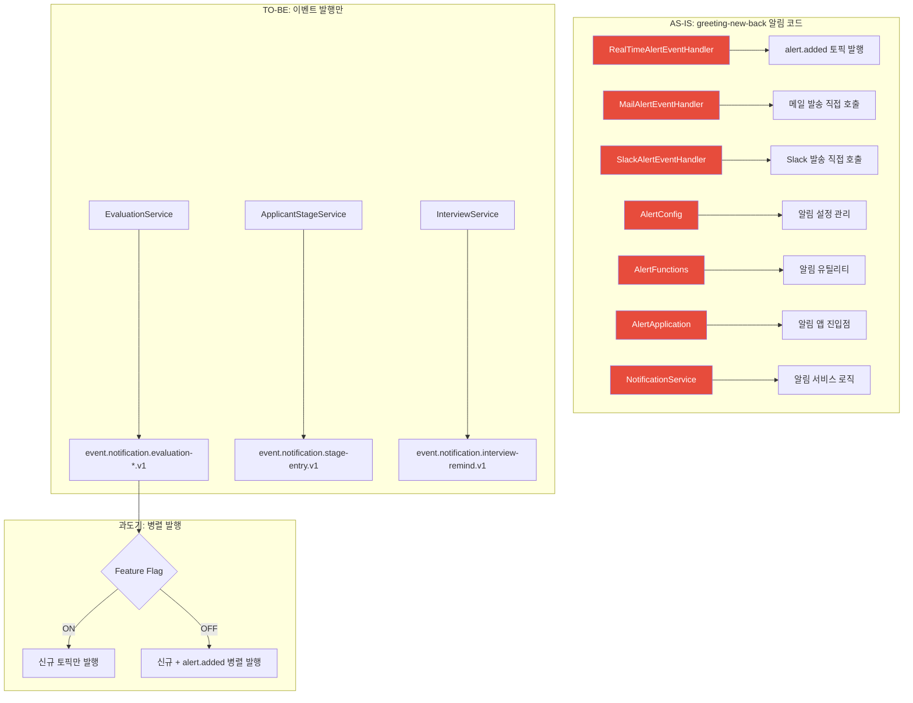

# [GRT-4012] greeting-new-back 알림 코드 분리/정리

## 개요
- PRD: https://doodlin.atlassian.net/wiki/x/SICjdg
- Phase: 2 (기능 구현)
- 예상 공수: 4d
- 의존성: GRT-4009, GRT-4010
- 선행 티켓: ticket_09_evaluation_alert, ticket_10_stage_entry_alert

**범위:** greeting-new-back 기존 알림 코드 분리/비활성화 + 평가·전형 이벤트 시점에 Kafka 이벤트만 발행하도록 전환. 과도기 하위 호환용 `alert.added` 토픽 병렬 발행 포함.

## 작업 내용

### 다이어그램 (Mermaid)



### 1. 제거 대상 코드 목록

| # | 클래스/파일 | 역할 | 제거 시점 |
|---|-----------|------|----------|
| 1 | RealTimeAlertEventHandler | alert.added Kafka 이벤트 발행 → alert-server(Node) | Phase 3 전환 후 |
| 2 | MailAlertEventHandler | 메일 알림 직접 발송 | 즉시 (notification-service 대체) |
| 3 | SlackAlertEventHandler | Slack 알림 직접 발송 | 즉시 (notification-service 대체) |
| 4 | AlertConfig | 알림 관련 설정 Bean | Phase 3 전환 후 |
| 5 | AlertFunctions | 알림 유틸리티 함수 | Phase 3 전환 후 |
| 6 | AlertApplication | 알림 앱 진입점 (사용 중이면 참조 제거) | Phase 3 전환 후 |
| 7 | NotificationService (legacy) | 기존 알림 서비스 로직 | 즉시 (notification-service 대체) |

### 2. 과도기 병렬 발행 전략

과도기 동안 기존 alert-server(Node)와 신규 notification-service 모두에서 알림을 처리해야 한다. Feature Flag 기반으로 전환한다.

```kotlin
@Component
class NotificationEventProducer(
    private val kafkaTemplate: KafkaTemplate<String, String>,
    @Value("\${feature.notification.legacy-parallel-publish:true}")
    private val legacyParallelPublish: Boolean
) {
    /**
     * 신규 이벤트 토픽 발행 + (과도기) alert.added 병렬 발행
     */
    fun publishEvaluationCompleted(event: EvaluationCompletedEvent) {
        // 신규 토픽 발행 (항상)
        kafkaTemplate.send(
            "event.notification.evaluation-completed.v1",
            event.applicantId.toString(),
            objectMapper.writeValueAsString(event)
        )

        // 과도기: alert.added 토픽도 병렬 발행
        if (legacyParallelPublish) {
            val legacyPayload = LegacyAlertPayload(
                type = "EVALUATION_COMPLETED",
                workspaceId = event.workspaceId,
                data = mapOf(
                    "applicantId" to event.applicantId,
                    "applicantName" to event.applicantName,
                    "stageName" to event.stageName
                )
            )
            kafkaTemplate.send(
                "alert.added",
                event.workspaceId.toString(),
                objectMapper.writeValueAsString(legacyPayload)
            )
        }
    }

    fun publishStageEntry(event: StageEntryEvent) {
        kafkaTemplate.send(
            "event.notification.stage-entry.v1",
            event.applicantId?.toString() ?: event.toStageId.toString(),
            objectMapper.writeValueAsString(event)
        )

        if (legacyParallelPublish) {
            val legacyPayload = LegacyAlertPayload(
                type = "STAGE_ENTRY",
                workspaceId = event.workspaceId,
                data = mapOf(
                    "applicantId" to event.applicantId,
                    "toStageId" to event.toStageId,
                    "toStageName" to event.toStageName
                )
            )
            kafkaTemplate.send(
                "alert.added",
                event.workspaceId.toString(),
                objectMapper.writeValueAsString(legacyPayload)
            )
        }
    }

    // 나머지 이벤트도 동일 패턴
}
```

### 3. 기존 이벤트 핸들러 코드 분리

#### Step 1: 기존 직접 발송 로직 비활성화

```kotlin
// MailAlertEventHandler.kt - 비활성화
@Component
@ConditionalOnProperty(
    name = ["feature.notification.legacy-mail-handler"],
    havingValue = "true",
    matchIfMissing = false  // 기본: 비활성
)
class MailAlertEventHandler { /* ... */ }

// SlackAlertEventHandler.kt - 비활성화
@Component
@ConditionalOnProperty(
    name = ["feature.notification.legacy-slack-handler"],
    havingValue = "true",
    matchIfMissing = false
)
class SlackAlertEventHandler { /* ... */ }
```

#### Step 2: RealTimeAlertEventHandler 과도기 유지

```kotlin
// 과도기: alert.added 토픽 Consumer인 alert-server(Node)가 아직 동작 중이므로
// RealTimeAlertEventHandler는 Phase 3 트래픽 전환 후 제거
@Component
@ConditionalOnProperty(
    name = ["feature.notification.legacy-realtime-handler"],
    havingValue = "true",
    matchIfMissing = true  // 기본: 활성 (과도기)
)
class RealTimeAlertEventHandler { /* 기존 코드 유지 */ }
```

### 4. Feature Flag 설정

```yaml
# application.yml
feature:
  notification:
    legacy-parallel-publish: true    # 과도기: alert.added 병렬 발행
    legacy-mail-handler: false       # 기존 메일 핸들러 비활성
    legacy-slack-handler: false      # 기존 슬랙 핸들러 비활성
    legacy-realtime-handler: true    # 과도기: 기존 실시간 핸들러 유지
```

### 5. alert 테이블 참조 정리

```kotlin
// 기존: alerts 테이블에 직접 INSERT
// alertRepository.save(Alert(...))  // 제거

// TO-BE: Kafka 이벤트 발행만 (notification-service가 notifications 테이블에 저장)
notificationEventProducer.publishEvaluationCompleted(event)
```

### 6. 전환 단계별 체크리스트

| 단계 | 작업 | Feature Flag 상태 |
|------|------|------------------|
| Step 1 (이 티켓) | MailAlertEventHandler, SlackAlertEventHandler 비활성화 | legacy-mail-handler=false, legacy-slack-handler=false |
| Step 1 (이 티켓) | 신규 이벤트 발행 + alert.added 병렬 발행 | legacy-parallel-publish=true |
| Step 2 (GRT-4015) | dev/stage에서 병렬 운영 검증 | 동일 |
| Step 3 (GRT-4016) | prod 트래픽 전환 완료 후 | legacy-parallel-publish=false, legacy-realtime-handler=false |
| Step 4 (GRT-4016) | 레거시 코드 최종 삭제 | Feature Flag 자체 제거 |

### 수정 파일 목록

| 레포 | 모듈 | 파일 경로 | 변경 유형 |
|------|------|----------|----------|
| greeting-new-back | alert | src/.../alert/handler/MailAlertEventHandler.kt | 수정 (@ConditionalOnProperty 추가) |
| greeting-new-back | alert | src/.../alert/handler/SlackAlertEventHandler.kt | 수정 (@ConditionalOnProperty 추가) |
| greeting-new-back | alert | src/.../alert/handler/RealTimeAlertEventHandler.kt | 수정 (@ConditionalOnProperty 추가) |
| greeting-new-back | infrastructure | src/.../infrastructure/kafka/NotificationEventProducer.kt | 수정 (병렬 발행 추가) |
| greeting-new-back | infrastructure | src/.../infrastructure/kafka/LegacyAlertPayload.kt | 신규 |
| greeting-new-back | config | src/main/resources/application.yml | 수정 (Feature Flag 추가) |
| greeting-new-back | config | src/main/resources/application-dev.yml | 수정 (환경별 Flag) |
| greeting-new-back | config | src/main/resources/application-stage.yml | 수정 (환경별 Flag) |
| greeting-new-back | config | src/main/resources/application-prod.yml | 수정 (환경별 Flag) |
| greeting-new-back | evaluation | src/.../evaluation/service/EvaluationService.kt | 수정 (직접 알림 호출 제거, 이벤트 발행으로 대체) |
| greeting-new-back | applicant | src/.../applicant/service/ApplicantStageService.kt | 수정 (직접 알림 호출 제거) |

## 영향 범위

- greeting-new-back: 알림 관련 6개 클래스 비활성화/제거, 이벤트 발행으로 전환
- alert-server (Node.js): 과도기 동안 alert.added 토픽 소비 계속 (변경 없음)
- notification-service: 신규 이벤트 토픽 소비 시작 (변경 없음, GRT-4009/4010에서 구현)

## 테스트 케이스

| ID | 테스트명 | Given | When | Then |
|----|---------|-------|------|------|
| TC-12-01 | 신규 이벤트 발행 | 평가 완료 | EvaluationService.submitEvaluation() | evaluation-completed.v1 토픽에 메시지 |
| TC-12-02 | 병렬 발행 활성 | legacy-parallel-publish=true | 평가 완료 | evaluation-completed.v1 + alert.added 둘 다 발행 |
| TC-12-03 | 병렬 발행 비활성 | legacy-parallel-publish=false | 평가 완료 | evaluation-completed.v1만 발행 |
| TC-12-04 | 메일 핸들러 비활성 | legacy-mail-handler=false | 앱 시작 | MailAlertEventHandler Bean 생성 안 됨 |
| TC-12-05 | 슬랙 핸들러 비활성 | legacy-slack-handler=false | 앱 시작 | SlackAlertEventHandler Bean 생성 안 됨 |
| TC-12-06 | 실시간 핸들러 유지 | legacy-realtime-handler=true | 앱 시작 | RealTimeAlertEventHandler Bean 존재 |
| TC-12-07 | alert.added 레거시 페이로드 | 병렬 발행 | 이벤트 발행 | 기존 LegacyAlertPayload 형식 유지 |
| TC-12-08 | 회귀 - 평가 기능 | 알림 코드 분리 후 | 평가 제출/조회/수정 | 기존 기능 정상 동작 |
| TC-12-09 | 회귀 - 전형 이동 | 알림 코드 분리 후 | 전형 이동/벌크 이동 | 기존 기능 정상 동작 |
| TC-12-10 | alert 테이블 INSERT 제거 확인 | 알림 코드 분리 후 | 알림 이벤트 발생 | alerts 테이블에 INSERT 없음 |

## 기대 결과 (AC)

- [ ] MailAlertEventHandler, SlackAlertEventHandler Feature Flag로 비활성화
- [ ] 평가/전형 이벤트에서 신규 Kafka 토픽 발행 정상
- [ ] 과도기: alert.added 토픽 병렬 발행 정상 (기존 alert-server 호환)
- [ ] greeting-new-back 기존 기능 회귀 테스트 통과
- [ ] Feature Flag로 단계별 전환 가능

## 체크리스트

- [ ] @ConditionalOnProperty 동작 확인 (Spring Boot)
- [ ] alert.added 토픽의 LegacyAlertPayload가 기존 형식과 동일한지 확인
- [ ] 환경별(dev/stage/prod) Feature Flag 설정 확인
- [ ] alerts 테이블 INSERT 코드 참조 전수 확인 후 제거
- [ ] 회귀 테스트: 평가, 전형 이동, 면접 기능
- [ ] 빌드 확인
- [ ] 테스트 통과
