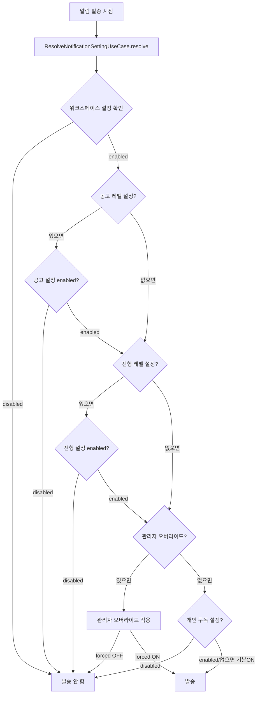
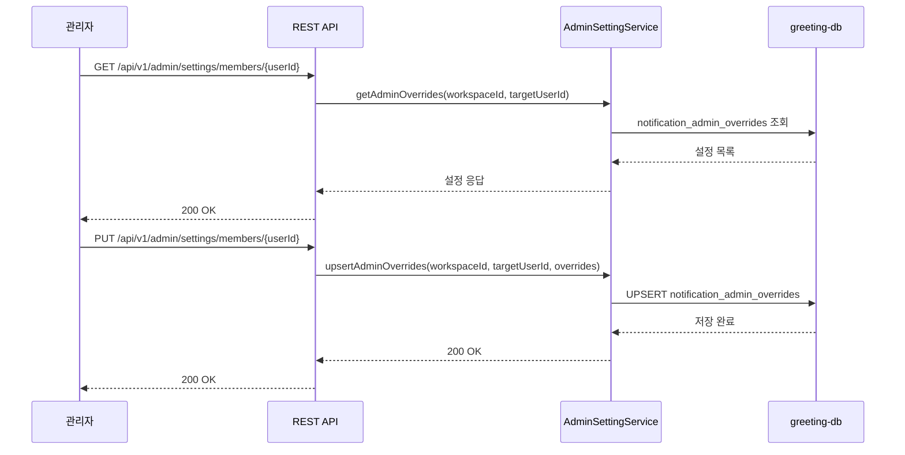

# [GRT-4013] 관리자 멤버별 알림 설정

## 개요
- PRD: https://doodlin.atlassian.net/wiki/x/SICjdg
- Phase: 2 (기능 구현)
- 예상 공수: 3d
- 의존성: GRT-4007
- 선행 티켓: ticket_07_rest_api

**범위:** 관리자 워크스페이스 멤버별 알림 설정 오버라이드 API + 설정 계층 resolve (워크스페이스 → 공고 → 전형 → 관리자 오버라이드 → 개인) 구현.

## 작업 내용

### 다이어그램 (Mermaid)





### 1. 설정 계층 resolve 로직

```kotlin
@Service
class ResolveNotificationSettingService(
    private val workspaceSettingRepository: NotificationSettingRepository,
    private val postingSettingRepository: NotificationPostingSettingRepository,
    private val stageSettingRepository: NotificationStageSettingRepository,
    private val adminOverrideRepository: NotificationAdminOverrideRepository,
    private val subscriptionRepository: NotificationSubscriptionRepository
) : ResolveNotificationSettingUseCase {

    /**
     * 설정 계층 resolve:
     * 1. 워크스페이스 설정 (notification_settings) - 비활성이면 즉시 OFF
     * 2. 공고 설정 (notification_posting_settings) - 있으면 적용
     * 3. 전형 설정 (notification_stage_settings) - 있으면 적용
     * 4. 관리자 오버라이드 (notification_admin_overrides) - forced ON/OFF
     * 5. 개인 구독 (notification_subscriptions) - 본인 설정
     *
     * @return true이면 해당 채널로 발송, false이면 발송 안 함
     */
    override fun resolve(
        workspaceId: Long,
        userId: Long,
        type: NotificationType,
        channel: NotificationChannel,
        postingId: Long?,
        stageId: Long?
    ): Boolean {
        // 1. 워크스페이스 레벨
        val workspaceSetting = workspaceSettingRepository.findByWorkspaceAndTypeAndChannel(
            workspaceId, type, channel
        )
        if (workspaceSetting?.enabled == false) return false

        // 2. 공고 레벨 (있으면)
        if (postingId != null) {
            val postingSetting = postingSettingRepository.findByPostingAndTypeAndChannel(
                postingId, type, channel
            )
            if (postingSetting?.enabled == false) return false
        }

        // 3. 전형 레벨 (있으면)
        if (stageId != null) {
            val stageSetting = stageSettingRepository.findByStageAndTypeAndChannel(
                stageId, type, channel
            )
            if (stageSetting?.enabled == false) return false
        }

        // 4. 관리자 오버라이드
        val adminOverride = adminOverrideRepository.findByWorkspaceAndUserAndTypeAndChannel(
            workspaceId, userId, type, channel
        )
        if (adminOverride != null) {
            return adminOverride.enabled  // forced ON or OFF
        }

        // 5. 개인 구독
        val subscription = subscriptionRepository.findByWorkspaceAndUserAndTypeAndChannel(
            workspaceId, userId, type, channel
        )
        return subscription?.enabled ?: true  // 기본값: enabled
    }
}
```

### 2. 관리자 오버라이드 API

#### GET /api/v1/admin/settings/members/{userId}
특정 멤버의 관리자 오버라이드 설정 조회

```kotlin
@RestController
@RequestMapping("/api/v1/admin/settings/members")
class AdminSettingController(
    private val adminSettingService: AdminSettingService
) {
    @GetMapping("/{userId}")
    @PreAuthorize("hasRole('WORKSPACE_ADMIN')")
    fun getAdminOverrides(
        @RequestHeader("X-Workspace-Id") workspaceId: Long,
        @PathVariable userId: Long
    ): ResponseEntity<AdminOverrideListResponse> {
        val overrides = adminSettingService.getAdminOverrides(workspaceId, userId)
        return ResponseEntity.ok(AdminOverrideListResponse(
            userId = userId,
            overrides = overrides.map { AdminOverrideResponse.from(it) }
        ))
    }

    @PutMapping("/{userId}")
    @PreAuthorize("hasRole('WORKSPACE_ADMIN')")
    fun upsertAdminOverrides(
        @RequestHeader("X-Workspace-Id") workspaceId: Long,
        @PathVariable userId: Long,
        @Valid @RequestBody request: AdminOverrideUpsertRequest
    ): ResponseEntity<AdminOverrideListResponse> {
        val overrides = adminSettingService.upsertAdminOverrides(
            workspaceId, userId, request.overrides
        )
        return ResponseEntity.ok(AdminOverrideListResponse(
            userId = userId,
            overrides = overrides.map { AdminOverrideResponse.from(it) }
        ))
    }
}
```

### 3. Request/Response DTO

```kotlin
data class AdminOverrideUpsertRequest(
    @field:NotEmpty
    val overrides: List<AdminOverrideItem>
)

data class AdminOverrideItem(
    @field:NotNull
    val notificationType: NotificationType,
    @field:NotNull
    val channel: NotificationChannel,
    @field:NotNull
    val enabled: Boolean  // true=forced ON, false=forced OFF
)

data class AdminOverrideListResponse(
    val userId: Long,
    val overrides: List<AdminOverrideResponse>
)

data class AdminOverrideResponse(
    val id: Long,
    val notificationType: String,
    val channel: String,
    val enabled: Boolean,
    val updatedAt: String
) {
    companion object {
        fun from(entity: NotificationAdminOverride) = AdminOverrideResponse(
            id = entity.id!!,
            notificationType = entity.notificationType.name,
            channel = entity.channel.name,
            enabled = entity.enabled,
            updatedAt = entity.updatedAt.toString()
        )
    }
}
```

### 4. AdminSettingService

```kotlin
@Service
@Transactional
class AdminSettingService(
    private val adminOverrideRepository: NotificationAdminOverrideRepository
) {
    @Transactional(readOnly = true)
    fun getAdminOverrides(
        workspaceId: Long, targetUserId: Long
    ): List<NotificationAdminOverride> {
        return adminOverrideRepository.findAllByWorkspaceAndUser(workspaceId, targetUserId)
    }

    fun upsertAdminOverrides(
        workspaceId: Long,
        targetUserId: Long,
        items: List<AdminOverrideItem>
    ): List<NotificationAdminOverride> {
        val result = mutableListOf<NotificationAdminOverride>()

        for (item in items) {
            val existing = adminOverrideRepository.findByWorkspaceAndUserAndTypeAndChannel(
                workspaceId, targetUserId, item.notificationType, item.channel
            )

            if (existing != null) {
                existing.enabled = item.enabled
                result.add(adminOverrideRepository.save(existing))
            } else {
                result.add(adminOverrideRepository.save(NotificationAdminOverride(
                    workspaceId = workspaceId,
                    userId = targetUserId,
                    notificationType = item.notificationType,
                    channel = item.channel,
                    enabled = item.enabled
                )))
            }
        }

        return result
    }

    /**
     * 관리자 오버라이드 삭제 (개인 설정으로 복원)
     */
    fun deleteAdminOverride(workspaceId: Long, targetUserId: Long, type: NotificationType, channel: NotificationChannel) {
        adminOverrideRepository.deleteByWorkspaceAndUserAndTypeAndChannel(
            workspaceId, targetUserId, type, channel
        )
    }
}
```

### 5. notification_admin_overrides 테이블

```sql
-- GRT-4002에서 생성된 테이블 활용
CREATE TABLE IF NOT EXISTS notification_admin_overrides (
    id BIGINT AUTO_INCREMENT PRIMARY KEY,
    workspace_id BIGINT NOT NULL,
    user_id BIGINT NOT NULL,
    notification_type VARCHAR(50) NOT NULL,
    channel VARCHAR(20) NOT NULL,
    enabled BOOLEAN NOT NULL DEFAULT TRUE,
    created_at DATETIME(6) NOT NULL DEFAULT CURRENT_TIMESTAMP(6),
    updated_at DATETIME(6) NOT NULL DEFAULT CURRENT_TIMESTAMP(6) ON UPDATE CURRENT_TIMESTAMP(6),
    UNIQUE KEY uk_admin_override (workspace_id, user_id, notification_type, channel),
    INDEX idx_workspace_user (workspace_id, user_id)
);

-- 공고/전형 레벨 설정 테이블 (필요 시)
CREATE TABLE IF NOT EXISTS notification_posting_settings (
    id BIGINT AUTO_INCREMENT PRIMARY KEY,
    posting_id BIGINT NOT NULL,
    notification_type VARCHAR(50) NOT NULL,
    channel VARCHAR(20) NOT NULL,
    enabled BOOLEAN NOT NULL DEFAULT TRUE,
    config JSON,
    created_at DATETIME(6) NOT NULL DEFAULT CURRENT_TIMESTAMP(6),
    updated_at DATETIME(6) NOT NULL DEFAULT CURRENT_TIMESTAMP(6) ON UPDATE CURRENT_TIMESTAMP(6),
    UNIQUE KEY uk_posting_setting (posting_id, notification_type, channel)
);

CREATE TABLE IF NOT EXISTS notification_stage_settings (
    id BIGINT AUTO_INCREMENT PRIMARY KEY,
    stage_id BIGINT NOT NULL,
    notification_type VARCHAR(50) NOT NULL,
    channel VARCHAR(20) NOT NULL,
    enabled BOOLEAN NOT NULL DEFAULT TRUE,
    config JSON,
    created_at DATETIME(6) NOT NULL DEFAULT CURRENT_TIMESTAMP(6),
    updated_at DATETIME(6) NOT NULL DEFAULT CURRENT_TIMESTAMP(6) ON UPDATE CURRENT_TIMESTAMP(6),
    UNIQUE KEY uk_stage_setting (stage_id, notification_type, channel)
);
```

### 6. JPA Entity

```kotlin
@Entity
@Table(name = "notification_admin_overrides")
class NotificationAdminOverrideEntity(
    @Id @GeneratedValue(strategy = GenerationType.IDENTITY)
    val id: Long? = null,

    @Column(name = "workspace_id", nullable = false)
    val workspaceId: Long,

    @Column(name = "user_id", nullable = false)
    val userId: Long,

    @Column(name = "notification_type", nullable = false)
    @Enumerated(EnumType.STRING)
    val notificationType: NotificationType,

    @Column(name = "channel", nullable = false)
    @Enumerated(EnumType.STRING)
    val channel: NotificationChannel,

    @Column(name = "enabled", nullable = false)
    var enabled: Boolean = true,

    @Column(name = "created_at", nullable = false)
    val createdAt: LocalDateTime = LocalDateTime.now(),

    @Column(name = "updated_at", nullable = false)
    var updatedAt: LocalDateTime = LocalDateTime.now()
)
```

### 수정 파일 목록

| 레포 | 모듈 | 파일 경로 | 변경 유형 |
|------|------|----------|----------|
| greeting-notification-service | presentation | src/.../presentation/controller/AdminSettingController.kt | 신규 |
| greeting-notification-service | presentation | src/.../presentation/dto/request/AdminOverrideUpsertRequest.kt | 신규 |
| greeting-notification-service | presentation | src/.../presentation/dto/response/AdminOverrideListResponse.kt | 신규 |
| greeting-notification-service | application | src/.../application/service/AdminSettingService.kt | 신규 |
| greeting-notification-service | application | src/.../application/service/ResolveNotificationSettingService.kt | 수정 (계층 resolve 구현) |
| greeting-notification-service | application | src/.../application/port/inbound/ResolveNotificationSettingUseCase.kt | 수정 (postingId, stageId 파라미터 추가) |
| greeting-notification-service | domain | src/.../domain/model/NotificationAdminOverride.kt | 신규 |
| greeting-notification-service | domain | src/.../domain/repository/NotificationAdminOverrideRepository.kt | 신규 |
| greeting-notification-service | domain | src/.../domain/repository/NotificationPostingSettingRepository.kt | 신규 |
| greeting-notification-service | domain | src/.../domain/repository/NotificationStageSettingRepository.kt | 신규 |
| greeting-notification-service | infrastructure | src/.../infrastructure/persistence/NotificationAdminOverrideJpaEntity.kt | 신규 |
| greeting-notification-service | infrastructure | src/.../infrastructure/persistence/NotificationAdminOverrideJpaRepository.kt | 신규 |
| greeting-notification-service | infrastructure | src/.../infrastructure/persistence/NotificationPostingSettingJpaRepository.kt | 신규 |
| greeting-notification-service | infrastructure | src/.../infrastructure/persistence/NotificationStageSettingJpaRepository.kt | 신규 |
| greeting-db-schema | migration | V2026_04__add_admin_overrides_and_level_settings.sql | 신규 |

## 영향 범위

- notification-service: ResolveNotificationSettingUseCase 인터페이스 변경 (postingId, stageId 추가) → 기존 호출부(GRT-4009, 4010, 4011) 수정 필요
- greeting-db-schema: 3개 테이블 추가 (notification_admin_overrides, notification_posting_settings, notification_stage_settings)
- FE: 관리자 설정 UI에서 API 연동 필요

## 테스트 케이스

| ID | 테스트명 | Given | When | Then |
|----|---------|-------|------|------|
| TC-13-01 | 관리자 오버라이드 조회 | 오버라이드 2건 존재 | GET /admin/settings/members/{userId} | 2건 반환 |
| TC-13-02 | 관리자 오버라이드 신규 등록 | 오버라이드 없음 | PUT /admin/settings/members/{userId} | 201, 설정 저장됨 |
| TC-13-03 | 관리자 오버라이드 수정 | 기존 enabled=true | PUT with enabled=false | 200, enabled=false로 변경 |
| TC-13-04 | resolve - 워크스페이스 OFF | 워크스페이스 설정 disabled | resolve() | false |
| TC-13-05 | resolve - 공고 레벨 OFF | 워크스페이스 ON, 공고 OFF | resolve() | false |
| TC-13-06 | resolve - 전형 레벨 OFF | 워크스페이스 ON, 공고 ON, 전형 OFF | resolve() | false |
| TC-13-07 | resolve - 관리자 forced ON | 개인 구독 OFF, 관리자 ON | resolve() | true (관리자 우선) |
| TC-13-08 | resolve - 관리자 forced OFF | 개인 구독 ON, 관리자 OFF | resolve() | false (관리자 우선) |
| TC-13-09 | resolve - 개인 구독 OFF | 관리자 오버라이드 없음, 개인 OFF | resolve() | false |
| TC-13-10 | resolve - 전체 기본값 | 아무 설정 없음 | resolve() | true (기본 enabled) |
| TC-13-11 | 권한 체크 | 일반 사용자 | GET /admin/settings/members/{userId} | 403 Forbidden |
| TC-13-12 | 오버라이드 삭제 | 오버라이드 존재 | DELETE /admin/settings/members/{userId}/overrides | 200, 삭제됨 |

## 기대 결과 (AC)

- [ ] GET /api/v1/admin/settings/members/{userId} 정상 조회
- [ ] PUT /api/v1/admin/settings/members/{userId} 정상 등록/수정
- [ ] 설정 계층 resolve: 워크스페이스 → 공고 → 전형 → 관리자 오버라이드 → 개인 순서 정확
- [ ] 관리자 오버라이드가 개인 구독보다 우선
- [ ] WORKSPACE_ADMIN 권한 체크
- [ ] unique constraint (workspace_id, user_id, notification_type, channel) 정상 동작

## 체크리스트

- [ ] @PreAuthorize 권한 체크 동작 확인
- [ ] resolve 로직 각 계층별 단위 테스트
- [ ] notification_admin_overrides unique key 확인
- [ ] 기존 ResolveNotificationSettingUseCase 호출부 수정 확인 (postingId, stageId 파라미터)
- [ ] 빌드 확인
- [ ] 테스트 통과
