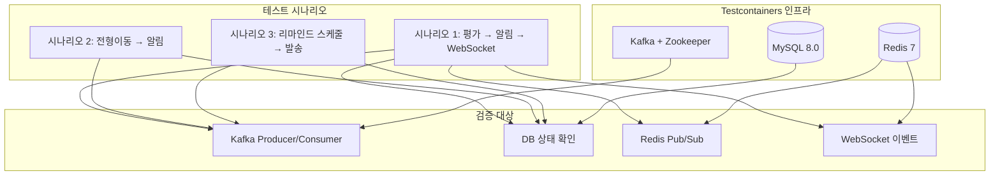
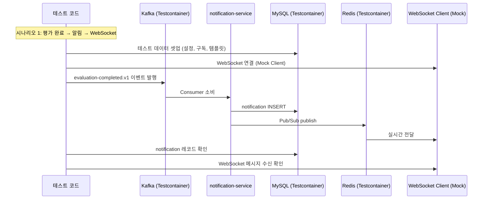

# [GRT-4014] E2E 통합 테스트 (Testcontainers)

## 개요
- PRD: https://doodlin.atlassian.net/wiki/x/SICjdg
- Phase: 3 (전환 + 테스트)
- 예상 공수: 4d
- 의존성: GRT-4001~4013 (Phase 1, 2 전체)
- 선행 티켓: 모든 Phase 1, 2 티켓

**범위:** Testcontainers(MySQL 8.0 + Kafka 7.5 + Redis 7) 기반 E2E 통합 테스트. 핵심 시나리오 3개(평가→알림→WebSocket, 전형이동→알림, 리마인드→발송) + Kafka 5건·WebSocket 3건·총 16건 이상 테스트 케이스.

## 작업 내용

### 다이어그램 (Mermaid)





### 1. Testcontainers 설정

```kotlin
@SpringBootTest
@Testcontainers
@ActiveProfiles("test")
abstract class IntegrationTestBase {

    companion object {
        @Container
        @JvmStatic
        val mysql = MySQLContainer("mysql:8.0").apply {
            withDatabaseName("greeting_test")
            withUsername("test")
            withPassword("test")
            withInitScript("schema.sql")
        }

        @Container
        @JvmStatic
        val kafka = KafkaContainer(DockerImageName.parse("confluentinc/cp-kafka:7.5.0"))

        @Container
        @JvmStatic
        val redis = GenericContainer(DockerImageName.parse("redis:7-alpine")).apply {
            withExposedPorts(6379)
        }

        @DynamicPropertySource
        @JvmStatic
        fun setProperties(registry: DynamicPropertyRegistry) {
            registry.add("spring.datasource.url") { mysql.jdbcUrl }
            registry.add("spring.datasource.username") { mysql.username }
            registry.add("spring.datasource.password") { mysql.password }
            registry.add("spring.kafka.bootstrap-servers") { kafka.bootstrapServers }
            registry.add("spring.data.redis.host") { redis.host }
            registry.add("spring.data.redis.port") { redis.getMappedPort(6379) }
        }
    }

    @Autowired lateinit var notificationRepository: NotificationRepository
    @Autowired lateinit var settingRepository: NotificationSettingRepository
    @Autowired lateinit var subscriptionRepository: NotificationSubscriptionRepository
    @Autowired lateinit var scheduleRepository: NotificationScheduleRepository
    @Autowired lateinit var logRepository: NotificationLogRepository
    @Autowired lateinit var kafkaTemplate: KafkaTemplate<String, String>

    @BeforeEach
    fun cleanUp() {
        // 테스트 간 격리를 위한 데이터 정리
        notificationRepository.deleteAll()
        scheduleRepository.deleteAll()
        logRepository.deleteAll()
    }
}
```

### 2. 시나리오 1: 평가 완료 → 알림 → WebSocket

```kotlin
@Nested
@DisplayName("시나리오 1: 평가 완료 → 알림 생성 → WebSocket 전달")
inner class EvaluationToWebSocketScenario {

    @Test
    fun `평가 완료 이벤트 발행 시 구독자에게 IN_APP 알림 생성 및 WebSocket 전달`() {
        // Given: 워크스페이스 설정, 구독자 2명, 템플릿
        val workspaceId = 1L
        setupWorkspaceSetting(workspaceId, NotificationType.EVALUATION_COMPLETED, NotificationChannel.IN_APP, enabled = true)
        setupSubscription(workspaceId, 100L, NotificationType.EVALUATION_COMPLETED, enabled = true)
        setupSubscription(workspaceId, 101L, NotificationType.EVALUATION_COMPLETED, enabled = true)
        setupDefaultTemplate(NotificationType.EVALUATION_COMPLETED, NotificationChannel.IN_APP)

        // WebSocket Mock Client 연결
        val wsClient = connectWebSocketMockClient(workspaceId, 100L)

        // When: Kafka 이벤트 발행
        val event = EvaluationCompletedEvent(
            eventId = UUID.randomUUID().toString(),
            workspaceId = workspaceId,
            applicantId = 500L,
            applicantName = "홍길동",
            stageName = "1차 면접",
            completedCount = 3,
            completedAt = Instant.now()
        )
        kafkaTemplate.send("event.notification.evaluation-completed.v1",
            event.applicantId.toString(),
            objectMapper.writeValueAsString(event)
        )

        // Then: 알림 생성 확인 (최대 10초 대기)
        await().atMost(10, TimeUnit.SECONDS).untilAsserted {
            val notifications = notificationRepository.findByWorkspaceAndType(
                workspaceId, NotificationType.EVALUATION_COMPLETED
            )
            assertThat(notifications).hasSize(2)  // 구독자 2명
            assertThat(notifications[0].title).contains("홍길동")
        }

        // Then: WebSocket 메시지 수신 확인
        await().atMost(5, TimeUnit.SECONDS).untilAsserted {
            assertThat(wsClient.receivedMessages).isNotEmpty
            val msg = wsClient.receivedMessages.first()
            assertThat(msg.type).isEqualTo("EVALUATION_COMPLETED")
        }

        // Then: 발송 로그 확인
        val logs = logRepository.findByWorkspace(workspaceId)
        assertThat(logs).hasSize(2)
        assertThat(logs).allSatisfy { assertThat(it.status).isEqualTo(LogStatus.SUCCESS) }
    }

    @Test
    fun `멱등성 - 동일 이벤트 2회 소비 시 알림 1건만 생성`() {
        // Given
        val workspaceId = 1L
        setupWorkspaceSetting(workspaceId, NotificationType.EVALUATION_COMPLETED, NotificationChannel.IN_APP, enabled = true)
        setupSubscription(workspaceId, 100L, NotificationType.EVALUATION_COMPLETED, enabled = true)
        setupDefaultTemplate(NotificationType.EVALUATION_COMPLETED, NotificationChannel.IN_APP)

        val eventId = UUID.randomUUID().toString()
        val event = EvaluationCompletedEvent(
            eventId = eventId,
            workspaceId = workspaceId,
            applicantId = 500L,
            applicantName = "홍길동",
            stageName = "1차 면접",
            completedCount = 3,
            completedAt = Instant.now()
        )

        // When: 동일 이벤트 2회 발행
        kafkaTemplate.send("event.notification.evaluation-completed.v1",
            "500", objectMapper.writeValueAsString(event))
        kafkaTemplate.send("event.notification.evaluation-completed.v1",
            "500", objectMapper.writeValueAsString(event))

        // Then: 알림 1건만 생성
        await().atMost(10, TimeUnit.SECONDS).pollDelay(3, TimeUnit.SECONDS).untilAsserted {
            val notifications = notificationRepository.findByWorkspaceAndType(
                workspaceId, NotificationType.EVALUATION_COMPLETED
            )
            assertThat(notifications).hasSize(1)
        }
    }

    @Test
    fun `설정 비활성화 시 알림 미생성`() {
        // Given: 설정 disabled
        val workspaceId = 1L
        setupWorkspaceSetting(workspaceId, NotificationType.EVALUATION_COMPLETED, NotificationChannel.IN_APP, enabled = false)
        setupSubscription(workspaceId, 100L, NotificationType.EVALUATION_COMPLETED, enabled = true)

        // When
        val event = EvaluationCompletedEvent(
            eventId = UUID.randomUUID().toString(),
            workspaceId = workspaceId, applicantId = 500L,
            applicantName = "홍길동", stageName = "1차 면접",
            completedCount = 3, completedAt = Instant.now()
        )
        kafkaTemplate.send("event.notification.evaluation-completed.v1",
            "500", objectMapper.writeValueAsString(event))

        // Then: 알림 0건
        await().during(5, TimeUnit.SECONDS).untilAsserted {
            val notifications = notificationRepository.findByWorkspaceAndType(
                workspaceId, NotificationType.EVALUATION_COMPLETED
            )
            assertThat(notifications).isEmpty()
        }
    }
}
```

### 3. 시나리오 2: 전형이동 → 알림

```kotlin
@Nested
@DisplayName("시나리오 2: 전형이동 → 알림 생성")
inner class StageEntryScenario {

    @Test
    fun `단건 전형이동 시 구독자에게 알림 생성`() {
        // Given
        val workspaceId = 1L
        setupWorkspaceSetting(workspaceId, NotificationType.STAGE_ENTRY, NotificationChannel.IN_APP, enabled = true)
        setupSubscriptionWithScope(workspaceId, 100L, NotificationType.STAGE_ENTRY, scopeType = "STAGE", scopeId = 10L)
        setupDefaultTemplate(NotificationType.STAGE_ENTRY, NotificationChannel.IN_APP)

        // When
        val event = StageEntryEvent(
            eventId = UUID.randomUUID().toString(),
            workspaceId = workspaceId, applicantId = 500L,
            applicantName = "홍길동", fromStageId = 5L,
            toStageId = 10L, toStageName = "2차 면접",
            postingId = 1L, isBulk = false, bulkCount = null,
            enteredAt = Instant.now()
        )
        kafkaTemplate.send("event.notification.stage-entry.v1",
            "500", objectMapper.writeValueAsString(event))

        // Then
        await().atMost(10, TimeUnit.SECONDS).untilAsserted {
            val notifications = notificationRepository.findByWorkspaceAndType(
                workspaceId, NotificationType.STAGE_ENTRY
            )
            assertThat(notifications).hasSize(1)
            assertThat(notifications[0].metadata?.get("toStageName")).isEqualTo("2차 면접")
        }
    }

    @Test
    fun `벌크 그룹핑 전형이동 시 알림 1건 생성`() {
        // Given
        val workspaceId = 1L
        setupWorkspaceSetting(workspaceId, NotificationType.STAGE_ENTRY, NotificationChannel.IN_APP, enabled = true)
        setupSubscriptionWithScope(workspaceId, 100L, NotificationType.STAGE_ENTRY, scopeType = "WORKSPACE", scopeId = workspaceId)
        setupDefaultTemplate(NotificationType.STAGE_ENTRY, NotificationChannel.IN_APP)

        // When: 그룹핑 이벤트
        val event = StageEntryEvent(
            eventId = UUID.randomUUID().toString(),
            workspaceId = workspaceId, applicantId = null,
            applicantName = null, fromStageId = null,
            toStageId = 10L, toStageName = "그룹 면접",
            postingId = 1L, isBulk = true, bulkCount = 5,
            enteredAt = Instant.now()
        )
        kafkaTemplate.send("event.notification.stage-entry.v1",
            "10", objectMapper.writeValueAsString(event))

        // Then
        await().atMost(10, TimeUnit.SECONDS).untilAsserted {
            val notifications = notificationRepository.findByWorkspaceAndType(
                workspaceId, NotificationType.STAGE_ENTRY
            )
            assertThat(notifications).hasSize(1)
            assertThat(notifications[0].metadata?.get("isBulk")).isEqualTo("true")
            assertThat(notifications[0].metadata?.get("bulkCount")).isEqualTo("5")
        }
    }
}
```

### 4. 시나리오 3: 리마인드 스케줄 → 발송

```kotlin
@Nested
@DisplayName("시나리오 3: 리마인드 스케줄 등록 → 스케줄러 발송")
inner class RemindScheduleScenario {

    @Test
    fun `면접 리마인드 스케줄 등록 후 스케줄러 실행 시 알림 발송`() {
        // Given: 스케줄 등록
        val workspaceId = 1L
        setupWorkspaceSetting(workspaceId, NotificationType.INTERVIEW_REMIND, NotificationChannel.IN_APP, enabled = true)
        setupSubscription(workspaceId, 100L, NotificationType.INTERVIEW_REMIND, enabled = true)
        setupDefaultTemplate(NotificationType.INTERVIEW_REMIND, NotificationChannel.IN_APP)

        // 이미 과거 시각인 스케줄 등록 (즉시 발송 대상)
        scheduleRepository.save(NotificationSchedule(
            workspaceId = workspaceId,
            scheduleType = ScheduleType.INTERVIEW_REMIND,
            referenceType = "MEETING",
            referenceId = "123",
            scheduledAt = Instant.now().minus(Duration.ofMinutes(1)),
            status = ScheduleStatus.PENDING,
            idempotencyKey = "interview-remind:123:${Instant.now().toEpochMilli()}",
            metadata = mapOf("meetingId" to "123", "interviewAt" to Instant.now().plus(Duration.ofHours(1)).toString())
        ))

        // When: 스케줄러 수동 실행
        notificationRemindScheduler.executeRemindSchedule()

        // Then: 알림 생성 + 스케줄 상태 SENT
        val notifications = notificationRepository.findByWorkspaceAndType(
            workspaceId, NotificationType.INTERVIEW_REMIND
        )
        assertThat(notifications).hasSize(1)

        val schedule = scheduleRepository.findByReferenceId("123")
        assertThat(schedule.status).isEqualTo(ScheduleStatus.SENT)
    }

    @Test
    fun `평가 리마인드 반복 스케줄 자동 등록`() {
        // Given
        val workspaceId = 1L
        setupWorkspaceSetting(workspaceId, NotificationType.EVALUATION_REMIND, NotificationChannel.IN_APP, enabled = true)
        setupSubscription(workspaceId, 100L, NotificationType.EVALUATION_REMIND, enabled = true)
        setupDefaultTemplate(NotificationType.EVALUATION_REMIND, NotificationChannel.IN_APP)

        scheduleRepository.save(NotificationSchedule(
            workspaceId = workspaceId,
            scheduleType = ScheduleType.EVALUATION_REMIND,
            referenceType = "EVALUATION",
            referenceId = "456",
            scheduledAt = Instant.now().minus(Duration.ofMinutes(1)),
            status = ScheduleStatus.PENDING,
            idempotencyKey = "eval-remind:456:1",
            metadata = mapOf(
                "evaluationId" to "456",
                "sequence" to "1",
                "maxCount" to "3",
                "repeatIntervalDays" to "3"
            )
        ))

        // When
        notificationRemindScheduler.executeRemindSchedule()

        // Then: 다음 스케줄 자동 등록
        val pendingSchedules = scheduleRepository.findPendingByReference("EVALUATION", "456")
        assertThat(pendingSchedules).hasSize(1)
        assertThat(pendingSchedules[0].idempotencyKey).isEqualTo("eval-remind:456:2")
    }
}
```

### 5. Kafka 연동 테스트

```kotlin
@Nested
@DisplayName("Kafka 연동 테스트")
inner class KafkaIntegrationTests {

    @Test
    fun `DLQ 전송 - 처리 실패 시 DLT 토픽으로 전송`() { /* ... */ }

    @Test
    fun `Consumer 오프셋 커밋 확인`() { /* ... */ }

    @Test
    fun `다중 파티션 소비 순서 보장`() { /* ... */ }

    @Test
    fun `queue.mail.send Producer 발행 확인`() { /* ... */ }

    @Test
    fun `queue.slack.send Producer 발행 확인`() { /* ... */ }
}
```

### 6. WebSocket 연동 테스트

```kotlin
@Nested
@DisplayName("WebSocket 연동 테스트")
inner class WebSocketIntegrationTests {

    @Test
    fun `Socket.io 핸드셰이크 정상 연결`() { /* ... */ }

    @Test
    fun `알림 수신 후 WebSocket 실시간 전달`() { /* ... */ }

    @Test
    fun `다중 클라이언트 동시 연결 시 각자 알림 수신`() { /* ... */ }
}
```

### 수정 파일 목록

| 레포 | 모듈 | 파일 경로 | 변경 유형 |
|------|------|----------|----------|
| greeting-notification-service | test | src/test/.../integration/IntegrationTestBase.kt | 신규 |
| greeting-notification-service | test | src/test/.../integration/EvaluationToWebSocketIntegrationTest.kt | 신규 |
| greeting-notification-service | test | src/test/.../integration/StageEntryIntegrationTest.kt | 신규 |
| greeting-notification-service | test | src/test/.../integration/RemindScheduleIntegrationTest.kt | 신규 |
| greeting-notification-service | test | src/test/.../integration/KafkaIntegrationTest.kt | 신규 |
| greeting-notification-service | test | src/test/.../integration/WebSocketIntegrationTest.kt | 신규 |
| greeting-notification-service | test | src/test/.../integration/helper/WebSocketMockClient.kt | 신규 |
| greeting-notification-service | test | src/test/.../integration/helper/TestDataSetup.kt | 신규 |
| greeting-notification-service | test | src/test/resources/application-test.yml | 신규 |
| greeting-notification-service | test | src/test/resources/schema.sql | 신규 |
| greeting-notification-service | build.gradle.kts | testcontainers 의존성 추가 | 수정 |

## 영향 범위

- greeting-notification-service: 테스트 코드만 추가, 프로덕션 코드 변경 없음
- CI/CD: Testcontainers 실행을 위한 Docker 환경 필요 (GitHub Actions Docker-in-Docker)

## 테스트 케이스

| ID | 테스트명 | Given | When | Then |
|----|---------|-------|------|------|
| TC-14-01 | 평가 완료 → IN_APP 알림 | 설정 ON, 구독자 2명 | evaluation-completed.v1 발행 | 알림 2건 생성 |
| TC-14-02 | 멱등성 - 중복 이벤트 | 동일 eventId 2회 발행 | Consumer 2회 소비 | 알림 1건만 |
| TC-14-03 | 설정 비활성화 | 설정 OFF | 이벤트 발행 | 알림 0건 |
| TC-14-04 | WebSocket 실시간 전달 | WS 연결 + 이벤트 발행 | 알림 생성 | WS 메시지 수신 |
| TC-14-05 | 단건 전형이동 알림 | 설정 ON, 전형 구독자 | stage-entry.v1 발행 | 알림 1건 |
| TC-14-06 | 벌크 그룹핑 알림 | 그룹핑 이벤트 | stage-entry.v1 발행 | 알림 1건, isBulk=true |
| TC-14-07 | 면접 리마인드 발송 | PENDING 스케줄 존재 | 스케줄러 실행 | 알림 생성 + SENT |
| TC-14-08 | 평가 리마인드 반복 | sequence=1, maxCount=3 | 스케줄러 실행 | 다음 스케줄 등록 |
| TC-14-09 | DLQ 전송 | 처리 중 예외 3회 | Consumer 재시도 | DLT 토픽 전송 |
| TC-14-10 | Consumer 오프셋 커밋 | 정상 처리 | ack.acknowledge() | 오프셋 커밋 |
| TC-14-11 | queue.mail.send 발행 | EMAIL 채널 활성 | 알림 생성 | mail 토픽 메시지 |
| TC-14-12 | queue.slack.send 발행 | SLACK 채널 활성 | 알림 생성 | slack 토픽 메시지 |
| TC-14-13 | Socket.io 핸드셰이크 | - | 클라이언트 연결 | 연결 성공 |
| TC-14-14 | 다중 클라이언트 WS | 2명 연결 | 각자 알림 | 각자 수신 |
| TC-14-15 | 전체 시나리오 E2E | 설정 + 구독 + 템플릿 | 이벤트 발행 → 스케줄러 실행 | 모든 채널 정상 발송 |
| TC-14-16 | 리마인드 멱등성 | 동일 idempotencyKey | 스케줄러 2회 실행 | 알림 1건 |

## 기대 결과 (AC)

- [ ] Testcontainers(MySQL + Kafka + Redis) 기반 통합 테스트 환경 구축
- [ ] 시나리오 1: 평가 → 알림 → WebSocket 전체 플로우 검증
- [ ] 시나리오 2: 전형이동 → 알림 전체 플로우 검증
- [ ] 시나리오 3: 리마인드 스케줄 → 발송 전체 플로우 검증
- [ ] Kafka 연동 5건 테스트 통과
- [ ] WebSocket 연동 3건 테스트 통과
- [ ] CI/CD 파이프라인에서 통합 테스트 실행 가능

## 체크리스트

- [ ] Testcontainers Docker 이미지 버전 확인 (MySQL 8.0, Kafka 7.5, Redis 7)
- [ ] 테스트 간 격리 보장 (@BeforeEach 데이터 정리)
- [ ] Awaitility 타임아웃 적절성 (Kafka 소비 지연 고려)
- [ ] CI/CD Docker-in-Docker 설정 확인
- [ ] build.gradle.kts testcontainers 의존성 추가
- [ ] 빌드 확인
- [ ] 테스트 통과
