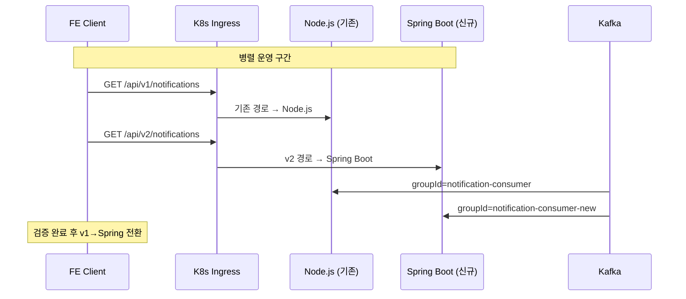

# [GRT-4015] dev/stage 환경 병렬 배포 + 검증

## 개요
- PRD: https://doodlin.atlassian.net/wiki/x/SICjdg
- Phase: 3 (전환 + 테스트)
- 예상 공수: 3d
- 의존성: GRT-4014
- 선행 티켓: ticket_14_integration_test

**범위:** dev/stage 환경에 greeting-notification-service를 Node.js 서버와 병렬 배포. Kafka groupId 분리(`notification-consumer-new`), K8s Ingress v2 경로 추가, FE 연동 검증 10항목, Node vs Spring 성능 비교.

## 작업 내용

### 다이어그램 (Mermaid)

```mermaid
flowchart TD
    subgraph "K8s Cluster (dev/stage)"
        subgraph "기존 (Node.js)"
            AS[alert-server<br/>Socket.io]
            NTS[notification_server<br/>Node.js]
            CG1[Kafka groupId:<br/>notification-consumer]
        end

        subgraph "신규 (Spring Boot)"
            GNS[greeting-notification-service<br/>Spring Boot]
            CG2[Kafka groupId:<br/>notification-consumer-new]
        end

        ING[Ingress Controller]
    end

    subgraph "라우팅"
        ING -->|/api/v1/notifications/*| AS
        ING -->|/api/v2/notifications/*| GNS
        ING -->|/socket.io/* (기존)| AS
        ING -->|/v2/socket.io/*| GNS
    end

    Kafka[Kafka] --> CG1
    Kafka --> CG2

    style AS fill:#e74c3c,color:#fff
    style NTS fill:#e74c3c,color:#fff
    style GNS fill:#27ae60,color:#fff
```



### 1. Kafka groupId 분리

```yaml
# greeting-notification-service application-dev.yml / application-stage.yml
spring:
  kafka:
    consumer:
      group-id: notification-consumer-new   # 기존: notification-consumer
      auto-offset-reset: latest             # 기존 메시지 재처리 방지
    bootstrap-servers: ${KAFKA_BOOTSTRAP_SERVERS}
```

**기존 Node.js 서버:**
- groupId: `notification-consumer` (변경 없음)
- 기존 토픽 계속 소비

**신규 Spring Boot:**
- groupId: `notification-consumer-new`
- 동일 토픽을 별도 consumer group으로 소비
- 두 서비스 모두 메시지를 수신하므로 알림이 중복 생성될 수 있음
  → **greeting-new-back의 alert.added 병렬 발행과 조합하여 검증**

### 2. K8s Deployment 매니페스트

```yaml
# greeting-notification-service/k8s/deployment.yaml
apiVersion: apps/v1
kind: Deployment
metadata:
  name: greeting-notification-service
  namespace: greeting
  labels:
    app: greeting-notification-service
    version: v2
spec:
  replicas: 2
  selector:
    matchLabels:
      app: greeting-notification-service
  template:
    metadata:
      labels:
        app: greeting-notification-service
        version: v2
    spec:
      containers:
        - name: greeting-notification-service
          image: ${ECR_REGISTRY}/greeting-notification-service:${IMAGE_TAG}
          ports:
            - containerPort: 8080  # REST API
              name: http
            - containerPort: 9092  # WebSocket (netty-socketio)
              name: websocket
          env:
            - name: SPRING_PROFILES_ACTIVE
              value: "${ENV}"       # dev or stage
            - name: KAFKA_BOOTSTRAP_SERVERS
              valueFrom:
                configMapKeyRef:
                  name: kafka-config
                  key: bootstrap-servers
          resources:
            requests:
              cpu: "500m"
              memory: "512Mi"
            limits:
              cpu: "1000m"
              memory: "1Gi"
          readinessProbe:
            httpGet:
              path: /actuator/health/readiness
              port: 8080
            initialDelaySeconds: 30
            periodSeconds: 10
          livenessProbe:
            httpGet:
              path: /actuator/health/liveness
              port: 8080
            initialDelaySeconds: 60
            periodSeconds: 30
---
apiVersion: v1
kind: Service
metadata:
  name: greeting-notification-service
  namespace: greeting
spec:
  selector:
    app: greeting-notification-service
  ports:
    - name: http
      port: 8080
      targetPort: 8080
    - name: websocket
      port: 9092
      targetPort: 9092
```

### 3. K8s Ingress 라우팅 (v2 경로)

```yaml
# ingress-patch.yaml
apiVersion: networking.k8s.io/v1
kind: Ingress
metadata:
  name: greeting-ingress
  namespace: greeting
  annotations:
    nginx.ingress.kubernetes.io/rewrite-target: /$2
spec:
  rules:
    - host: api-${ENV}.greeting.co.kr
      http:
        paths:
          # 기존 Node.js 경로 (변경 없음)
          - path: /api/v1/notifications(/|$)(.*)
            pathType: ImplementationSpecific
            backend:
              service:
                name: alert-server
                port:
                  number: 3000

          # 신규 Spring Boot v2 경로
          - path: /api/v2/notifications(/|$)(.*)
            pathType: ImplementationSpecific
            backend:
              service:
                name: greeting-notification-service
                port:
                  number: 8080

          # 신규 WebSocket v2 경로
          - path: /v2/socket.io(/|$)(.*)
            pathType: ImplementationSpecific
            backend:
              service:
                name: greeting-notification-service
                port:
                  number: 9092
```

### 4. FE 연동 검증 체크리스트

| # | 검증 항목 | 방법 | 기대 결과 |
|---|----------|------|----------|
| 1 | REST API 응답 호환성 | v1 vs v2 API 응답 비교 | 동일 JSON 구조 |
| 2 | WebSocket 핸드셰이크 | v2/socket.io 연결 | 정상 연결 |
| 3 | WebSocket 이벤트 수신 | 알림 생성 후 WS 메시지 확인 | 기존과 동일 이벤트명, 페이로드 |
| 4 | 알림 목록 조회 | GET /api/v2/notifications | 페이징 정상 |
| 5 | 안읽은 카운트 | GET /api/v2/notifications/unread-count | 카운트 정확 |
| 6 | 읽음 처리 | PATCH /api/v2/notifications/{id}/read | 204, 읽음 반영 |
| 7 | 알림 설정 조회/변경 | GET/PUT /api/v2/notification-settings | 정상 동작 |
| 8 | 개인 구독 조회/변경 | GET/PUT /api/v2/notification-subscriptions | 정상 동작 |
| 9 | 실시간 알림 지연 | 이벤트 발행 → WS 수신 | 3초 이내 |
| 10 | 다중 탭 동시 연결 | 2개 탭에서 WS 연결 | 양쪽 모두 알림 수신 |

### 5. 성능 비교 (Node vs Spring)

```markdown
| 지표 | Node.js (기존) | Spring Boot (신규) | 목표 |
|------|-------------|-----------------|------|
| 알림 생성 ~ WS 전달 p50 | TBD ms | TBD ms | < 500ms |
| 알림 생성 ~ WS 전달 p99 | TBD ms | TBD ms | < 2000ms |
| Kafka 소비 ~ DB INSERT p50 | TBD ms | TBD ms | < 200ms |
| Kafka 소비 ~ DB INSERT p99 | TBD ms | TBD ms | < 1000ms |
| REST API 응답 p50 | TBD ms | TBD ms | < 100ms |
| REST API 응답 p99 | TBD ms | TBD ms | < 500ms |
| WS 동시 연결 수 | TBD | TBD | > 1000 |
| 메모리 사용량 (idle) | TBD MB | TBD MB | < 512MB |
| CPU 사용률 (50 rps) | TBD % | TBD % | < 50% |
```

**성능 측정 방법:**
- Datadog APM 트레이스 기반
- K6 부하 테스트 (50 rps, 5분간)
- 측정 환경: stage (prod와 동일 사양)

### 수정 파일 목록

| 레포 | 모듈 | 파일 경로 | 변경 유형 |
|------|------|----------|----------|
| greeting-notification-service | config | src/main/resources/application-dev.yml | 수정 (groupId 설정) |
| greeting-notification-service | config | src/main/resources/application-stage.yml | 수정 (groupId 설정) |
| greeting-notification-service | k8s | k8s/deployment.yaml | 신규 |
| greeting-notification-service | k8s | k8s/service.yaml | 신규 |
| greeting-infra | ingress | k8s/ingress-patch.yaml | 수정 (v2 경로 추가) |
| greeting-infra | helm | charts/greeting-notification-service/ | 신규 (Helm chart) |
| greeting-notification-service | ci | .github/workflows/deploy.yml | 신규 (CI/CD) |

## 영향 범위

- K8s Ingress: v2 경로 추가 (기존 v1 경로 영향 없음)
- Kafka: 신규 consumer group 추가 (기존 group 영향 없음)
- FE: dev/stage에서 v2 경로로 테스트 필요 (prod 영향 없음)

## 테스트 케이스

| ID | 테스트명 | Given | When | Then |
|----|---------|-------|------|------|
| TC-15-01 | K8s 배포 성공 | Docker 이미지 빌드 | kubectl apply | Pod Running, readiness 통과 |
| TC-15-02 | Ingress v2 라우팅 | Ingress 설정 적용 | GET /api/v2/notifications | Spring Boot 응답 |
| TC-15-03 | 기존 v1 영향 없음 | Ingress 설정 적용 | GET /api/v1/notifications | Node.js 응답 (기존과 동일) |
| TC-15-04 | Kafka groupId 분리 | 두 서비스 동시 실행 | 이벤트 발행 | 양쪽 모두 소비 (각 1회) |
| TC-15-05 | WebSocket v2 연결 | v2/socket.io 경로 | 클라이언트 연결 | 연결 성공 |
| TC-15-06 | REST API 응답 호환성 | 동일 데이터 | v1 vs v2 응답 비교 | JSON 구조 동일 |
| TC-15-07 | 실시간 알림 전달 | WS 연결 + 이벤트 | 알림 생성 | 3초 이내 WS 수신 |
| TC-15-08 | 성능 측정 - p50 | K6 50rps | 5분 부하 | p50 < 500ms |
| TC-15-09 | 성능 측정 - p99 | K6 50rps | 5분 부하 | p99 < 2000ms |
| TC-15-10 | 다중 인스턴스 안정성 | replica=2 | 10분 운영 | 에러 0건 |

## 기대 결과 (AC)

- [ ] dev/stage 환경에 greeting-notification-service 정상 배포
- [ ] Kafka groupId 분리로 기존 Node.js 서버와 독립 소비
- [ ] K8s Ingress v2 경로로 신규 서비스 접근 가능
- [ ] 기존 v1 경로는 Node.js 서버로 라우팅 (영향 없음)
- [ ] FE 연동 검증 10개 항목 통과
- [ ] 성능 측정 완료 (Node vs Spring 비교 데이터)

## 체크리스트

- [ ] ECR 이미지 레지스트리 등록 확인
- [ ] K8s namespace, ServiceAccount, RBAC 설정
- [ ] Kafka consumer group offset 초기화 확인 (latest)
- [ ] Ingress TLS/SSL 인증서 확인
- [ ] Datadog Agent 연동 (APM, 로그, 메트릭)
- [ ] K6 부하 테스트 스크립트 작성
- [ ] FE 연동 검증 체크리스트 항목별 확인
- [ ] 빌드 확인
- [ ] 테스트 통과
