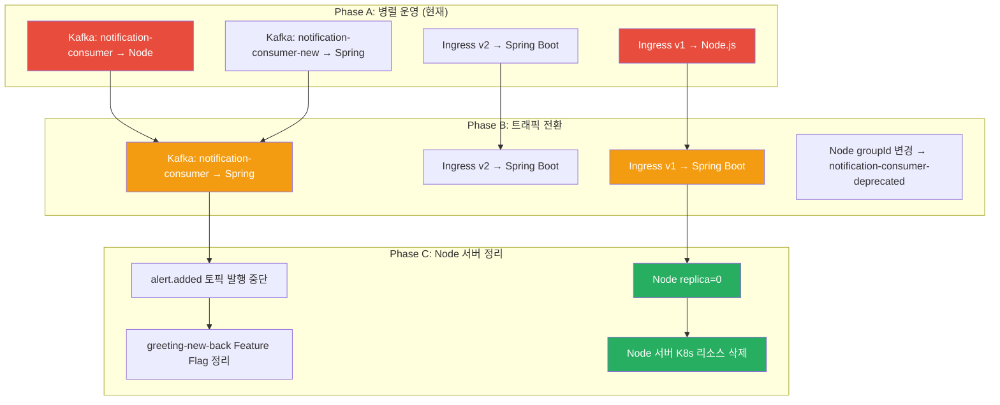

# [GRT-4016] prod 트래픽 전환 + Node 서버 정리

## 개요
- PRD: https://doodlin.atlassian.net/wiki/x/SICjdg
- Phase: 3 (전환 + 테스트)
- 예상 공수: 2d
- 의존성: GRT-4015
- 선행 티켓: ticket_15_parallel_deploy

**범위:** prod 환경 Node.js → Spring Boot 트래픽 전환 + 전환 완료 후 Node.js 서버 정리. Ingress 라우팅 전환, Kafka groupId 변경, Datadog 모니터링 10항목, 3단계 롤백 계획 포함.

## 작업 내용

### 다이어그램 (Mermaid)

```mermaid
gantt
    title 트래픽 전환 타임라인
    dateFormat HH:mm
    axisFormat %H:%M

    section 사전 준비
    모니터링 대시보드 확인         :a1, 09:00, 30min
    팀 대기 확인                  :a2, 09:30, 15min

    section 전환 실행
    Ingress 라우팅 전환 (v1→Spring) :b1, 10:00, 15min
    Kafka groupId 전환            :b2, 10:15, 15min
    모니터링 관찰 (30분)           :b3, 10:30, 30min

    section 검증
    API 정상 응답 확인             :c1, 11:00, 15min
    WebSocket 연결 확인            :c2, 11:15, 15min
    에러율 확인 (< 0.1%)          :c3, 11:30, 30min

    section 정리 (전환 안정화 후)
    Node replica=0                :d1, 14:00, 15min
    Feature Flag 정리              :d2, after d1, 30min
    alert.added 발행 중단          :d3, after d2, 15min
```





### 1. Ingress 라우팅 전환 절차

#### Step 1: v1 경로를 Spring Boot로 전환

```yaml
# ingress-prod-switch.yaml
apiVersion: networking.k8s.io/v1
kind: Ingress
metadata:
  name: greeting-ingress
  namespace: greeting
spec:
  rules:
    - host: api.greeting.co.kr
      http:
        paths:
          # v1 경로 → Spring Boot (전환!)
          - path: /api/v1/notifications(/|$)(.*)
            pathType: ImplementationSpecific
            backend:
              service:
                name: greeting-notification-service  # Node → Spring
                port:
                  number: 8080

          # v2 경로 → Spring Boot (유지)
          - path: /api/v2/notifications(/|$)(.*)
            pathType: ImplementationSpecific
            backend:
              service:
                name: greeting-notification-service
                port:
                  number: 8080

          # WebSocket → Spring Boot (전환!)
          - path: /socket.io(/|$)(.*)
            pathType: ImplementationSpecific
            backend:
              service:
                name: greeting-notification-service
                port:
                  number: 9092
```

```bash
# 전환 실행 명령
kubectl apply -f ingress-prod-switch.yaml -n greeting

# 확인
kubectl get ingress greeting-ingress -n greeting -o yaml
```

### 2. Kafka groupId 전환

#### Step 2: Spring Boot groupId를 원본으로 변경

```yaml
# application-prod.yml 변경
spring:
  kafka:
    consumer:
      group-id: notification-consumer   # notification-consumer-new → 원본으로 변경
```

```bash
# 1. Spring Boot 서비스 재배포 (새 groupId 적용)
kubectl rollout restart deployment greeting-notification-service -n greeting

# 2. Node.js consumer group 정지 확인
# Node.js가 먼저 정지되어야 groupId 충돌 없음
kubectl scale deployment alert-server --replicas=0 -n greeting
kubectl scale deployment notification-server --replicas=0 -n greeting

# 3. Spring Boot consumer group lag 확인
kafka-consumer-groups --bootstrap-server $KAFKA_SERVERS \
  --group notification-consumer --describe
```

### 3. Node 서버 replica=0

```bash
# Node.js 서버 정지
kubectl scale deployment alert-server --replicas=0 -n greeting
kubectl scale deployment notification-server --replicas=0 -n greeting

# 확인
kubectl get pods -n greeting -l app=alert-server
kubectl get pods -n greeting -l app=notification-server
```

### 4. greeting-new-back Feature Flag 정리

```yaml
# greeting-new-back application-prod.yml
feature:
  notification:
    legacy-parallel-publish: false    # alert.added 병렬 발행 중단
    legacy-mail-handler: false        # 유지 (이미 비활성)
    legacy-slack-handler: false       # 유지 (이미 비활성)
    legacy-realtime-handler: false    # 기존 실시간 핸들러 비활성
```

```bash
# greeting-new-back 재배포
kubectl rollout restart deployment greeting-new-back -n greeting
```

### 5. 모니터링 체크리스트 (Datadog)

| # | 지표 | 정상 기준 | 알람 임계값 | 대시보드 |
|---|------|----------|-----------|---------|
| 1 | HTTP 5xx 에러율 | < 0.1% | > 1% | greeting-notification-service |
| 2 | HTTP p99 지연 | < 500ms | > 2000ms | greeting-notification-service |
| 3 | Kafka consumer lag | < 100 | > 1000 | Kafka Monitoring |
| 4 | WebSocket 연결 수 | > 0 | = 0 (연결 없음) | greeting-notification-service |
| 5 | 알림 생성 ~ WS 전달 p99 | < 2000ms | > 5000ms | APM Trace |
| 6 | JVM heap 사용률 | < 70% | > 90% | JVM Metrics |
| 7 | Pod restart 횟수 | 0 | > 0 | K8s Monitoring |
| 8 | DLQ 메시지 수 | 0 | > 0 | Kafka DLT 토픽 |
| 9 | DB 커넥션 풀 사용률 | < 80% | > 95% | HikariCP Metrics |
| 10 | Redis 연결 상태 | connected | disconnected | Redis Monitoring |

### 6. 롤백 계획 (3단계)

#### 롤백 Level 1: Ingress만 롤백 (1분 이내)
API/WebSocket 응답 오류 시 Ingress를 Node.js로 되돌림.

```bash
# Level 1: Ingress 롤백
kubectl apply -f ingress-prod-original.yaml -n greeting

# Node.js 서버 다시 올리기
kubectl scale deployment alert-server --replicas=2 -n greeting
kubectl scale deployment notification-server --replicas=2 -n greeting
```

#### 롤백 Level 2: Kafka groupId 롤백 (5분 이내)
Kafka consumer group 충돌 시 Spring Boot의 groupId를 다시 분리.

```bash
# Spring Boot groupId 변경 (notification-consumer-new로 복원)
# application-prod.yml 수정 후 재배포
kubectl rollout restart deployment greeting-notification-service -n greeting

# Node.js consumer group 복원
kubectl scale deployment alert-server --replicas=2 -n greeting
kubectl scale deployment notification-server --replicas=2 -n greeting
```

#### 롤백 Level 3: 전체 롤백 (15분 이내)
전체적인 문제 발생 시 greeting-new-back Feature Flag도 복원.

```bash
# 1. Ingress 롤백 (Level 1)
kubectl apply -f ingress-prod-original.yaml -n greeting

# 2. Kafka groupId 롤백 (Level 2)
kubectl rollout restart deployment greeting-notification-service -n greeting

# 3. Node.js 서버 복원
kubectl scale deployment alert-server --replicas=2 -n greeting
kubectl scale deployment notification-server --replicas=2 -n greeting

# 4. greeting-new-back Feature Flag 복원
#    legacy-parallel-publish: true
#    legacy-realtime-handler: true
kubectl rollout restart deployment greeting-new-back -n greeting
```

### 7. Node 서버 최종 정리

전환 안정화 확인 후 (최소 1주일 모니터링) 수행:

| # | 작업 | 명령 / 방법 |
|---|------|-----------|
| 1 | K8s Deployment 삭제 | `kubectl delete deployment alert-server notification-server -n greeting` |
| 2 | K8s Service 삭제 | `kubectl delete service alert-server notification-server -n greeting` |
| 3 | Docker 이미지 정리 | ECR에서 alert-server, notification_server 이미지 삭제 |
| 4 | CI/CD 파이프라인 비활성 | GitHub Actions workflow 비활성화 |
| 5 | Kafka 불필요 토픽 정리 | alert.added 토픽 삭제 (소비자 없음 확인 후) |
| 6 | greeting-new-back 레거시 코드 삭제 | RealTimeAlertEventHandler, AlertConfig 등 최종 삭제 |
| 7 | Feature Flag 코드 제거 | legacy-* Flag 및 @ConditionalOnProperty 제거 |
| 8 | DB 레거시 테이블 정리 | alerts, alert_configs 테이블 아카이브 후 DROP |

### 수정 파일 목록

| 레포 | 모듈 | 파일 경로 | 변경 유형 |
|------|------|----------|----------|
| greeting-infra | ingress | k8s/ingress-prod-switch.yaml | 신규 |
| greeting-infra | ingress | k8s/ingress-prod-original.yaml | 신규 (롤백용 백업) |
| greeting-notification-service | config | src/main/resources/application-prod.yml | 수정 (groupId 변경) |
| greeting-new-back | config | src/main/resources/application-prod.yml | 수정 (Feature Flag 변경) |
| greeting-infra | monitoring | datadog/notification-service-dashboard.json | 신규 |
| greeting-infra | monitoring | datadog/notification-service-monitors.json | 신규 |
| greeting-infra | runbook | docs/notification-traffic-switch-runbook.md | 신규 |

## 영향 범위

- prod 전체: Ingress 라우팅 변경으로 알림 관련 모든 API/WebSocket 트래픽이 Spring Boot로 전환
- greeting-new-back: Feature Flag 변경으로 alert.added 토픽 발행 중단
- Node.js 서버: replica=0 → 최종 삭제
- FE: 엔드포인트 변경 없음 (Ingress 라우팅 변경이므로 FE 코드 변경 불필요)

## 테스트 케이스

| ID | 테스트명 | Given | When | Then |
|----|---------|-------|------|------|
| TC-16-01 | Ingress 전환 | 전환 실행 | GET /api/v1/notifications | Spring Boot 응답 |
| TC-16-02 | WebSocket 전환 | 전환 실행 | Socket.io 연결 | Spring Boot WebSocket |
| TC-16-03 | Kafka groupId 전환 | 원본 groupId | 이벤트 발행 | Spring Boot만 소비 |
| TC-16-04 | Node replica=0 | 전환 완료 | kubectl get pods | Node Pod 없음 |
| TC-16-05 | 에러율 확인 | 전환 후 30분 | Datadog 확인 | 5xx < 0.1% |
| TC-16-06 | p99 지연 확인 | 전환 후 30분 | Datadog 확인 | p99 < 2000ms |
| TC-16-07 | 롤백 Level 1 | Ingress 롤백 | kubectl apply | Node.js 응답 복원 |
| TC-16-08 | 롤백 Level 2 | groupId 롤백 | 재배포 | 양쪽 소비 복원 |
| TC-16-09 | alert.added 발행 중단 | Feature Flag OFF | 이벤트 발생 | alert.added 토픽에 메시지 없음 |
| TC-16-10 | FE 무중단 확인 | 전환 전후 | 사용자 시나리오 | 알림 수신/조회/읽음 정상 |

## 기대 결과 (AC)

- [ ] prod Ingress 라우팅이 Spring Boot로 전환 완료
- [ ] Kafka groupId가 원본(notification-consumer)으로 변경
- [ ] Node.js 서버 replica=0 확인
- [ ] 전환 후 30분간 에러율 < 0.1%
- [ ] 전환 후 30분간 p99 지연 < 2000ms
- [ ] 롤백 계획 3단계 문서화 완료
- [ ] FE 무중단 확인 (사용자 인지 없이 전환)

## 체크리스트

- [ ] 전환 전 팀 대기 인원 확인 (BE, FE, SRE)
- [ ] 전환 시간대 결정 (트래픽 최소 시간, 예: 오전 10시)
- [ ] Datadog 대시보드 + 알람 설정 완료
- [ ] 롤백용 Ingress 원본 매니페스트 백업
- [ ] Kafka consumer group lag 모니터링 설정
- [ ] 전환 후 1주일 모니터링 기간 설정
- [ ] Node 서버 최종 삭제는 안정화 확인 후 (최소 1주일 후)
- [ ] 빌드 확인
- [ ] 테스트 통과
