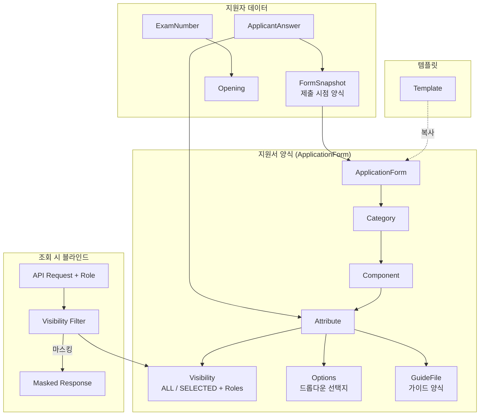
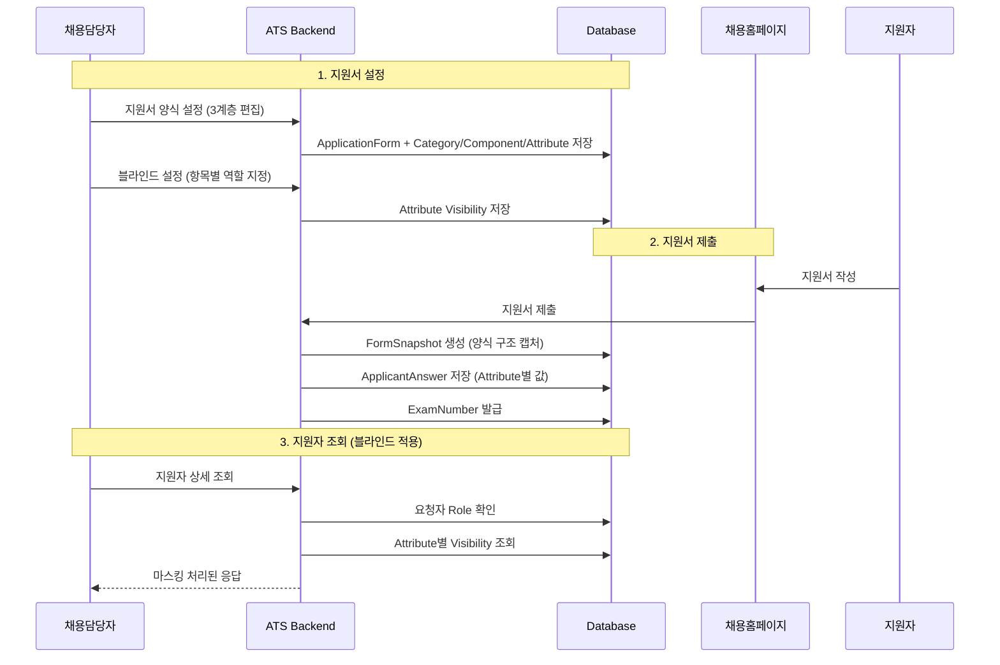
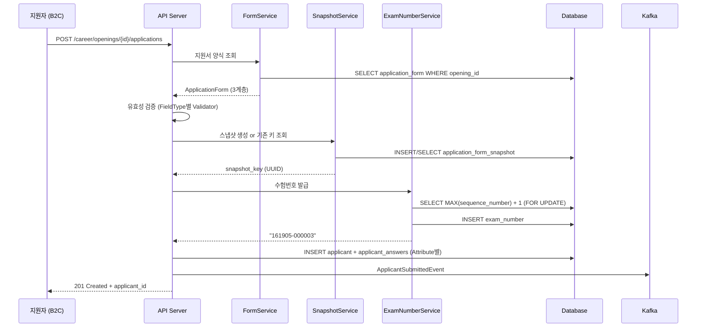
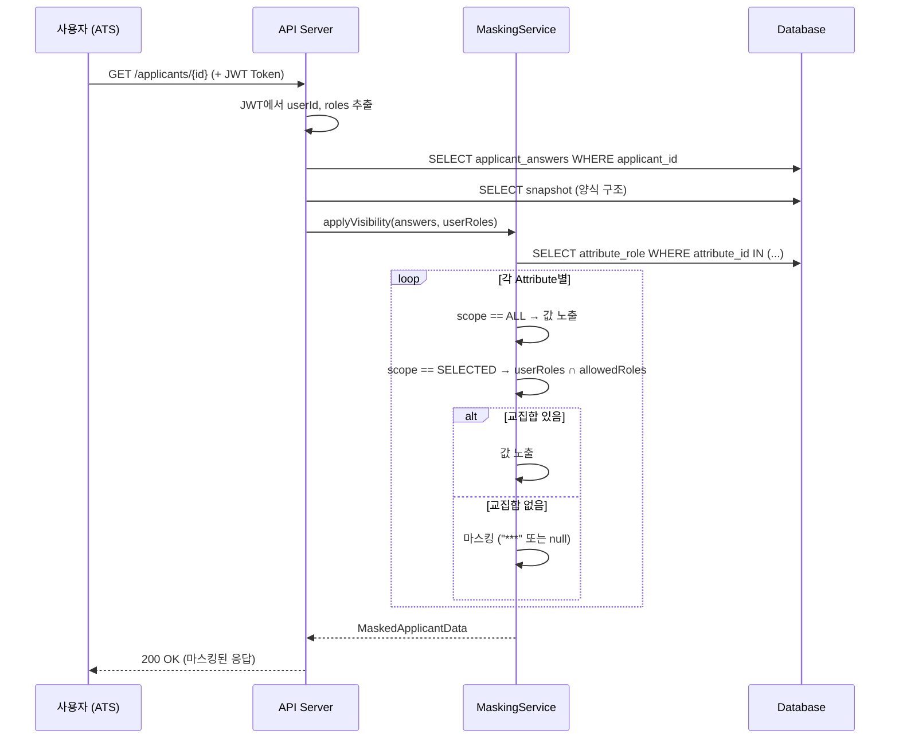

# 새싹 Phase1 기술 설계 문서 (TDD)

> PRD 기반 순수 설계 (기존 코드 미참조)

---

## 1. 개요

### 1.1 배경
그리팅 ATS의 지원자 정보가 정규화되어 있지 않아 항목별 블라인드 처리, 지원서 편집, 데이터 활용에 한계가 있음. 경쟁사(에이치닷, 나인하이어) 대비 기능 격차를 해소하고 신규 세일즈 기회를 확보하기 위해 지원자 정보 정규화 프로젝트를 진행함.

### 1.2 목표
1. 지원자 정보를 **Category > Component > Attribute** 3계층으로 정규화
2. 항목별 **열람권한(블라인드)** 설정 기능 구현
3. **지원서 설정 편집 + 템플릿** 관리 기능 제공
4. 영향받는 전체 파이프라인 대응 (B2C, ATS, 다운로드, OPEN API)

### 1.3 범위

**In Scope (Phase 1)**:
- 지원서 3계층 데이터 모델 설계 및 구현
- 지원서 설정 CRUD + 템플릿 관리
- 항목별 열람권한(블라인드) 설정
- B2C 지원서 등록/수정 (스냅샷 기반)
- ATS 지원자상세/면접뷰 리뉴얼
- 모집분야 워크스페이스 레벨 관리
- 기업정보 마스터 데이터
- 신/구 공고유형 분리
- 엑셀 다운로드 대응
- OPEN API 대응
- 리툴 관리 도구

**Out of Scope (Phase 2)**:
- 지원자 정보 기반 스크리닝/필터 고도화
- 다운로드 항목별 선택/순서 설정
- PDF 파일 파싱 → 지원자 정보 자동 등록
- 업무자동화 플로우

### 1.4 용어 정의

| 용어 | 정의 |
|------|------|
| Category | 지원서의 최상위 분류 (기본정보, 학력, 경력 등 11종) |
| Component | Category 내 항목 그룹 (이름, 이메일, 대학교 등 81종) |
| Attribute | Component 내 개별 필드 (학교명, 입학일, GPA 등 231종) |
| FieldType | Attribute의 입력 유형 (텍스트, 날짜, 파일첨부 등 10종) |
| Visibility | Attribute별 열람 가능 범위 (ALL / SELECTED + Role 목록) |
| Snapshot | 지원서 제출 시점의 양식 구조를 캡처한 불변 데이터 |
| Template | 워크스페이스 단위 지원서 기본 설정 틀 |
| ExamNumber | 공고 단위 지원자 고유 번호 (공고ID-6자리 일련번호) |

---

## 2. 현재 상태 (AS-IS) — PRD 기반 추정

### 2.1 추정 아키텍처

```
공고 설정
├── 지원자정보 항목: 사용여부만 on/off (편집 불가)
├── 사전질문: 커스텀 질문 (유니크 키 없음)
├── 지원서류: 파일 타이틀로 용도 유추
└── 추가정보: 비정형 데이터

지원자 데이터
├── 기본정보 (이름/연락처/이메일) → 별도 테이블
├── 추가정보 → JSON or 비정규화 테이블
├── 사전질문 답변 → 질문ID 없이 저장
└── 지원서류 → 파일 첨부

열람 권한
├── 일부 항목만 권한 분리 (기본정보: X, 지원서류: 부분적)
└── 항목 단위 세밀한 제어 불가
```

### 2.2 AS-IS 주요 문제
1. 항목별 유니크 키가 없어 특정 항목을 식별할 수 없음
2. 항목 편집/순서 변경 불가
3. 블라인드 처리할 단위가 없음
4. 지원서 양식 스냅샷이 없어 양식 변경 시 기존 데이터 깨짐

---

## 3. 제안 설계 (TO-BE)

### 3.1 아키텍처 다이어그램



### 3.2 3계층 구조 상세

```
ApplicationForm (공고 또는 템플릿)
│
├── Category: 기본정보
│   ├── Component: 이름 (단일형)
│   │   └── Attribute: 이름 [TEXT_SHORT, 필수]
│   ├── Component: 이메일 (단일형)
│   │   └── Attribute: 이메일주소 [TEXT_SHORT, 필수]
│   ├── Component: 연락처 (단일형)
│   │   └── Attribute: 전화번호 [PHONE, 필수]
│   └── Component: 사진 (단일형)
│       └── Attribute: 증명사진 [IMAGE, 선택]
│
├── Category: 학력
│   ├── Component: 고등학교 (복합형)
│   │   ├── Attribute: 학교명 [SEARCH_SELECT]
│   │   ├── Attribute: 소재지 [OPTION_SELECT]
│   │   ├── Attribute: 졸업구분 [OPTION_SELECT]
│   │   └── Attribute: 재학기간 [PERIOD]
│   ├── Component: 대학교 (복합형, 복수등록)
│   │   ├── Attribute: 학위 [OPTION_SELECT]
│   │   ├── Attribute: 학교명 [SEARCH_SELECT]
│   │   ├── Attribute: 전공 [SEARCH_SELECT]
│   │   ├── Attribute: GPA [TEXT_SHORT]
│   │   └── Attribute: 재학기간 [PERIOD]
│   └── ...
│
├── Category: 경력사항
│   └── Component: 경력 (복합형, 복수등록)
│       ├── Attribute: 회사명 [SEARCH_SELECT]
│       ├── Attribute: 직급 [TEXT_SHORT]
│       ├── Attribute: 재직기간 [PERIOD]
│       ├── Attribute: 연봉 [NUMBER]     ← 블라인드 대상
│       └── Attribute: 퇴사사유 [TEXT_LONG]
│
└── ... (11개 Category)
```

### 3.3 주요 흐름



---

## 4. 상세 설계

### 4.1 데이터 모델

#### 4.1.1 지원서 양식 (ApplicationForm)

```sql
-- 지원서 폼 (공고용 또는 템플릿)
CREATE TABLE application_form (
    id BIGINT AUTO_INCREMENT PRIMARY KEY,
    workspace_id INT NOT NULL,
    opening_id INT,                          -- NULL이면 템플릿
    form_type ENUM('OPENING', 'TEMPLATE') NOT NULL,
    template_name VARCHAR(255),              -- 템플릿인 경우
    is_active BOOLEAN DEFAULT TRUE,
    created_at DATETIME NOT NULL,
    updated_at DATETIME NOT NULL,
    deleted_at DATETIME,                     -- soft delete
    INDEX idx_workspace (workspace_id),
    INDEX idx_opening (opening_id)
);

-- 카테고리 (11종)
CREATE TABLE application_form_category (
    id BIGINT AUTO_INCREMENT PRIMARY KEY,
    application_form_id BIGINT NOT NULL,
    category_type VARCHAR(100) NOT NULL,     -- BASIC_INFORMATION, EDUCATION, etc.
    name_ko VARCHAR(255) NOT NULL,
    name_en VARCHAR(255),
    is_active BOOLEAN DEFAULT TRUE,
    sort_order INT NOT NULL DEFAULT 0,
    FOREIGN KEY (application_form_id) REFERENCES application_form(id),
    INDEX idx_form (application_form_id)
);

-- 컴포넌트 (81종)
CREATE TABLE application_form_component (
    id BIGINT AUTO_INCREMENT PRIMARY KEY,
    category_id BIGINT NOT NULL,
    component_type VARCHAR(100) NOT NULL,    -- NAME, EMAIL, UNIVERSITY, etc.
    name_ko VARCHAR(255) NOT NULL,
    name_en VARCHAR(255),
    is_required BOOLEAN DEFAULT FALSE,
    is_active BOOLEAN DEFAULT TRUE,
    is_multiple BOOLEAN DEFAULT FALSE,       -- 복수 등록 가능 여부
    max_count INT,                           -- 복수 등록 최대 수
    guide_text VARCHAR(500),                 -- 작성 가이드
    sort_order INT NOT NULL DEFAULT 0,
    FOREIGN KEY (category_id) REFERENCES application_form_category(id),
    INDEX idx_category (category_id)
);

-- 어트리뷰트 (231종)
CREATE TABLE application_form_attribute (
    id BIGINT AUTO_INCREMENT PRIMARY KEY,
    component_id BIGINT NOT NULL,
    attribute_type VARCHAR(100) NOT NULL,     -- 고유 타입 식별자
    field_type VARCHAR(50) NOT NULL,          -- TEXT_SHORT, TEXT_LONG, DATE, PERIOD, etc.
    name_ko VARCHAR(255) NOT NULL,
    name_en VARCHAR(255),
    is_required BOOLEAN DEFAULT FALSE,
    is_active BOOLEAN DEFAULT TRUE,
    max_length INT,                           -- 텍스트 최대 글자수
    date_format VARCHAR(10),                  -- YMD or YM
    sort_order INT NOT NULL DEFAULT 0,
    visibility_scope ENUM('ALL', 'SELECTED') DEFAULT 'ALL',
    FOREIGN KEY (component_id) REFERENCES application_form_component(id),
    INDEX idx_component (component_id)
);

-- 어트리뷰트 열람 역할 (블라인드)
CREATE TABLE application_form_attribute_role (
    id BIGINT AUTO_INCREMENT PRIMARY KEY,
    attribute_id BIGINT NOT NULL,
    role_id BIGINT NOT NULL,                 -- 워크스페이스 역할 ID
    FOREIGN KEY (attribute_id) REFERENCES application_form_attribute(id),
    UNIQUE INDEX idx_attr_role (attribute_id, role_id)
);

-- 어트리뷰트 옵션 (드롭다운/체크박스 선택지)
CREATE TABLE application_form_attribute_option (
    id BIGINT AUTO_INCREMENT PRIMARY KEY,
    attribute_id BIGINT NOT NULL,
    value_ko VARCHAR(255) NOT NULL,
    value_en VARCHAR(255),
    sort_order INT NOT NULL DEFAULT 0,
    is_active BOOLEAN DEFAULT TRUE,
    FOREIGN KEY (attribute_id) REFERENCES application_form_attribute(id)
);

-- 가이드 파일
CREATE TABLE application_form_guide_file (
    id BIGINT AUTO_INCREMENT PRIMARY KEY,
    attribute_id BIGINT NOT NULL,
    file_url VARCHAR(1000) NOT NULL,
    file_name VARCHAR(255) NOT NULL,
    file_size BIGINT,
    FOREIGN KEY (attribute_id) REFERENCES application_form_attribute(id)
);
```

#### 4.1.2 지원서 스냅샷

```sql
-- 지원서 제출 시점의 양식 구조 캡처
CREATE TABLE application_form_snapshot (
    id BIGINT AUTO_INCREMENT PRIMARY KEY,
    snapshot_key VARCHAR(36) NOT NULL UNIQUE, -- UUID
    application_form_id BIGINT NOT NULL,
    contents JSON NOT NULL,                   -- 양식 전체 구조 직렬화
    created_at DATETIME NOT NULL,
    INDEX idx_form (application_form_id),
    INDEX idx_key (snapshot_key)
);
```

#### 4.1.3 수험번호

```sql
CREATE TABLE exam_number (
    id BIGINT AUTO_INCREMENT PRIMARY KEY,
    opening_id INT NOT NULL,
    applicant_id INT NOT NULL,
    sequence_number INT NOT NULL,             -- 6자리 일련번호
    exam_number_value VARCHAR(20) NOT NULL,   -- "161905-000003"
    created_at DATETIME NOT NULL,
    UNIQUE INDEX idx_opening_seq (opening_id, sequence_number),
    UNIQUE INDEX idx_opening_applicant (opening_id, applicant_id),
    INDEX idx_value (exam_number_value)
);
```

#### 4.1.4 모집분야 (워크스페이스 레벨)

```sql
-- 부문/직군/직무/근무지/구분 각각 동일 구조
CREATE TABLE job_position_code (
    id BIGINT AUTO_INCREMENT PRIMARY KEY,
    workspace_id INT NOT NULL,
    code_type ENUM('DIVISION', 'JOB_GROUP', 'JOB', 'LOCATION', 'CLASSIFICATION') NOT NULL,
    name VARCHAR(255) NOT NULL,
    is_active BOOLEAN DEFAULT TRUE,
    sort_order INT NOT NULL DEFAULT 0,
    created_at DATETIME NOT NULL,
    updated_at DATETIME NOT NULL,
    INDEX idx_workspace_type (workspace_id, code_type),
    UNIQUE INDEX idx_workspace_type_name (workspace_id, code_type, name) -- 근무지 제외
);

-- 공고 ↔ 코드 매핑
CREATE TABLE opening_job_position_mapping (
    id BIGINT AUTO_INCREMENT PRIMARY KEY,
    opening_id INT NOT NULL,
    code_id BIGINT NOT NULL,
    FOREIGN KEY (code_id) REFERENCES job_position_code(id),
    INDEX idx_opening (opening_id)
);

-- 직군/직무 → 표준 코드 매핑
CREATE TABLE job_position_standard_mapping (
    id BIGINT AUTO_INCREMENT PRIMARY KEY,
    code_id BIGINT NOT NULL,
    standard_code_id BIGINT NOT NULL,        -- 그리팅 표준 코드
    FOREIGN KEY (code_id) REFERENCES job_position_code(id)
);
```

#### 4.1.5 기업정보

```sql
CREATE TABLE company (
    id BIGINT AUTO_INCREMENT PRIMARY KEY,
    name_management VARCHAR(255) NOT NULL,    -- 관리용 기업명
    name_display VARCHAR(255) NOT NULL,       -- 노출용 기업명
    name_en VARCHAR(255),                     -- 영문명
    country VARCHAR(10) DEFAULT 'KR',
    business_registration_number VARCHAR(20), -- 사업자등록번호 (옵셔널)
    homepage_url VARCHAR(500),
    career_page_url VARCHAR(500),
    logo_image_url VARCHAR(500),
    address VARCHAR(500),
    founded_year INT,
    employee_count INT,
    avg_tenure_months INT,
    is_listed BOOLEAN,                        -- 상장 여부
    is_active BOOLEAN DEFAULT TRUE,
    created_at DATETIME NOT NULL,
    updated_at DATETIME NOT NULL
);

-- 기업 유형 (복수 선택)
CREATE TABLE company_type_mapping (
    id BIGINT AUTO_INCREMENT PRIMARY KEY,
    company_id BIGINT NOT NULL,
    company_type VARCHAR(50) NOT NULL,        -- ENTERPRISE, STARTUP, PUBLIC, etc.
    FOREIGN KEY (company_id) REFERENCES company(id)
);

-- 기업 산업분류
CREATE TABLE company_industry (
    id BIGINT AUTO_INCREMENT PRIMARY KEY,
    company_id BIGINT NOT NULL,
    industry_major VARCHAR(100) NOT NULL,     -- 대분류
    industry_minor VARCHAR(100),              -- 소분류
    FOREIGN KEY (company_id) REFERENCES company(id)
);

-- 워크스페이스 ↔ 기업 매핑 (N:1)
CREATE TABLE workspace_company_mapping (
    id BIGINT AUTO_INCREMENT PRIMARY KEY,
    workspace_id INT NOT NULL UNIQUE,
    company_id BIGINT NOT NULL,
    FOREIGN KEY (company_id) REFERENCES company(id),
    INDEX idx_company (company_id)
);
```

#### 4.1.6 공고유형 확장

```sql
ALTER TABLE opening ADD COLUMN opening_type ENUM('LEGACY', 'SAESSAK') DEFAULT 'LEGACY';
```

### 4.2 API 스펙 (주요 엔드포인트)

#### 지원서 설정

| Method | Path | 설명 |
|--------|------|------|
| GET | `/api/v1/openings/{id}/application-form` | 공고 지원서 설정 조회 |
| PUT | `/api/v1/openings/{id}/application-form` | 공고 지원서 설정 수정 |
| POST | `/api/v1/openings/{id}/application-form/copy` | 템플릿에서 복사 |
| GET | `/api/v1/workspaces/{id}/application-form-templates` | 템플릿 목록 |
| POST | `/api/v1/workspaces/{id}/application-form-templates` | 템플릿 생성 |
| PUT | `/api/v1/application-form-templates/{id}` | 템플릿 수정 |
| DELETE | `/api/v1/application-form-templates/{id}` | 템플릿 삭제 |

#### 열람권한(블라인드)

| Method | Path | 설명 |
|--------|------|------|
| GET | `/api/v1/openings/{id}/visibility-settings` | 블라인드 설정 조회 |
| PUT | `/api/v1/openings/{id}/visibility-settings` | 블라인드 설정 변경 |
| PUT | `/api/v1/openings/{id}/visibility-settings/bulk` | 카테고리/컴포넌트 일괄 변경 |

#### B2C 지원서

| Method | Path | 설명 |
|--------|------|------|
| GET | `/api/v1/career/openings/{id}/application-form` | 지원서 양식 조회 (B2C) |
| POST | `/api/v1/career/openings/{id}/applications` | 지원서 제출 |
| PUT | `/api/v1/career/applications/{id}` | 지원서 수정 |
| POST | `/api/v1/career/applications/{id}/draft` | 임시저장 |
| GET | `/api/v1/career/applications/{id}/draft` | 임시저장 불러오기 |

#### 모집분야

| Method | Path | 설명 |
|--------|------|------|
| GET | `/api/v1/workspaces/{id}/job-position-codes?type=JOB_GROUP` | 코드 목록 |
| POST | `/api/v1/workspaces/{id}/job-position-codes` | 코드 등록 |
| PUT | `/api/v1/job-position-codes/{id}` | 코드 수정 |
| PUT | `/api/v1/job-position-codes/{id}/deactivate` | 미사용 처리 |
| PUT | `/api/v1/job-position-codes/sort-order` | 순서 변경 |

#### 기업정보

| Method | Path | 설명 |
|--------|------|------|
| GET | `/internal/companies?search=` | 기업 검색 |
| POST | `/internal/companies` | 기업 등록 |
| PUT | `/internal/companies/{id}` | 기업 수정 |
| POST | `/internal/workspace-company-mappings` | 매핑 설정 |

#### 수험번호

| Method | Path | 설명 |
|--------|------|------|
| GET | `/api/v1/openings/{id}/exam-numbers` | 수험번호 목록 |
| (자동) | 지원서 제출 시 자동 발급 | |

### 4.3 도메인 모델 (Hexagonal 기준)

```
domain/
├── form/
│   ├── domain/
│   │   ├── ApplicationForm.kt              ← Aggregate Root
│   │   ├── ApplicationFormCategory.kt
│   │   ├── ApplicationFormComponent.kt
│   │   ├── ApplicationFormAttribute.kt
│   │   ├── ApplicationFormSnapshot.kt
│   │   ├── ApplicationFormTemplate.kt
│   │   ├── FieldType.kt                    ← Enum (10종)
│   │   ├── VisibilitySetting.kt            ← VO (scope + roles)
│   │   └── MultiLanguage.kt               ← VO (ko + en)
│   ├── service/
│   │   ├── ApplicationFormService.kt
│   │   ├── ApplicationFormTemplateService.kt
│   │   ├── ApplicationFormSnapshotService.kt
│   │   └── VisibilitySettingService.kt
│   └── port/
│       ├── ApplicationFormRepository.kt    ← Out Port
│       └── ApplicationFormSnapshotRepository.kt
│
├── applicant/
│   ├── domain/
│   │   ├── ApplicantAnswer.kt              ← 지원자 답변
│   │   ├── ExamNumber.kt                   ← 수험번호
│   │   └── MaskedApplicantData.kt          ← 마스킹된 응답
│   ├── service/
│   │   ├── ApplicantSubmissionService.kt   ← 지원서 제출
│   │   ├── ApplicantMaskingService.kt      ← 블라인드 처리
│   │   └── ExamNumberService.kt            ← 수험번호 발급
│   └── port/
│       └── ApplicantAnswerRepository.kt
│
├── jobposition/
│   ├── domain/
│   │   ├── JobPositionCode.kt
│   │   └── StandardCodeMapping.kt
│   └── service/
│       └── JobPositionCodeService.kt
│
└── company/
    ├── domain/
    │   └── Company.kt
    └── service/
        └── CompanyService.kt
```

### 4.4 시퀀스 다이어그램: 지원서 제출



### 4.5 시퀀스 다이어그램: 블라인드 적용 조회



---

## 5. 영향 범위

### 5.1 수정 대상 서비스/모듈

| 모듈 | 변경 유형 | 상세 |
|------|----------|------|
| 공고 설정 | 대규모 수정 | 지원서 설정 화면 분리, 3계층 편집 UI |
| B2C 지원서 | 신규 구현 | 양식 기반 동적 폼 |
| 지원자 상세 | 대규모 수정 | LNB 통합, 블라인드 적용 |
| 면접뷰 | 대규모 수정 | 정규화 데이터 기반 리뉴얼 |
| 엑셀 다운로드 | 수정 | 정규화 헤더 + 블라인드 반영 |
| OPEN API | 수정 | v2 신규 + v1 호환 |
| 검색/필터 | 수정 | 수험번호 추가, 블라인드 반영 |
| 슬랙/메일 알림 | 수정 | 블라인드 반영 |
| 크롬 익스텐션 | 수정 | 신규 데이터 구조 대응 |

### 5.2 마이그레이션

| 대상 | 전략 | 예상 규모 |
|------|------|----------|
| 기존 공고 지원서 설정 | 배치: 레거시 설정 → 3계층 구조 변환 | 전체 공고 수 |
| 기존 지원자 데이터 | 배치: 비정형 → Attribute별 정규화 | 전체 지원자 수 |
| 모집분야 | 배치: 공고 단위 → 워크스페이스 코드 참조 | 전체 공고 수 |
| 스냅샷 | 배치: 기존 양식 기반 스냅샷 역생성 | 전체 지원자 수 |

---

## 6. 리스크 & 대안

| 리스크 | 영향도 | 대안 |
|--------|--------|------|
| 3계층 구조 설계 오류 | Critical | 스냅샷 기반 안전장치 + 신/구 공고 분리로 점진 적용 |
| 마이그레이션 대량 실패 | Critical | 배치 단위 + 실패 건 추적 + 수동 보정 + 롤백 가능 설계 |
| 블라인드 누수 (마스킹 안 된 경로) | High | 영향범위 전수 점검 + MaskingService를 단일 진입점으로 |
| 수험번호 동시 발급 충돌 | Medium | DB SELECT FOR UPDATE 또는 시퀀스 |
| 엑셀 OOM | Medium | SXSSFWorkbook 스트리밍 + 비동기 이메일 전송 |
| OPEN API 하위호환 | High | v1/v2 완전 분리 + v1 최소 6개월 유지 |

---

## 7. 구현 계획

### 7.1 구현 순서 (레이어별)

```
1. DB Migration (테이블 생성)
2. Domain Model (엔티티, VO, Enum)
3. Repository Layer
4. Domain Service (핵심 비즈니스 로직)
5. Application Service (유스케이스 조합)
6. API Controller (엔드포인트)
7. 배치 (마이그레이션, 정규화)
8. 이벤트 (Kafka Producer/Consumer)
9. Integration Test
```

### 7.2 티켓 분할 요약

| Phase | 영역 | 예상 티켓 수 |
|-------|------|-------------|
| 1 | 지원서 3계층 데이터 모델 + CRUD | 8~10 |
| 2 | 열람권한(블라인드) | 4~5 |
| 3 | B2C 지원서 (제출/수정/임시저장) | 5~6 |
| 4 | ATS 지원자상세/면접뷰 | 4~5 |
| 5 | 모집분야 + 기업정보 | 4~5 |
| 6 | 엑셀 다운로드 + OPEN API | 4~5 |
| 7 | 마이그레이션 배치 | 4~5 |
| 8 | 신/구 분리 + 리툴 | 2~3 |
| **합계** | | **35~44** |
