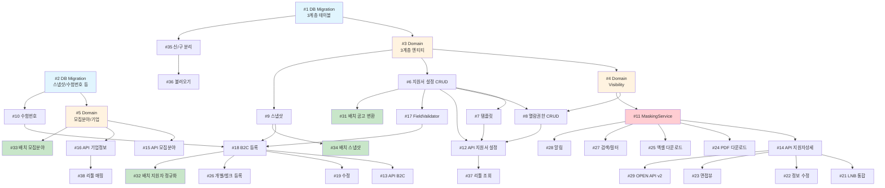

# 구현 티켓 요약: 새싹 Phase1

> PRD 기반 순수 설계 (기존 코드 미참조)

## PRD 참조
- 1-Pager: 지원자 정보 정규화 (새싹 프로젝트)
- 상세 PRD: 10개

## 티켓 목록

| # | 티켓 | 영역 | 의존성 | 크기 |
|---|------|------|--------|------|
| **Phase A: 데이터 모델 기반** | | | | |
| 1 | DB Migration — 지원서 3계층 테이블 | DB | - | L |
| 2 | DB Migration — 스냅샷/수험번호/모집분야/기업 | DB | - | L |
| 3 | Domain Model — ApplicationForm 3계층 엔티티 | Domain | #1 | L |
| 4 | Domain Model — 열람권한(Visibility) | Domain | #3 | M |
| 5 | Domain Model — 모집분야 코드 + 기업정보 | Domain | #2 | M |
| **Phase B: 핵심 서비스** | | | | |
| 6 | Service — 지원서 설정 CRUD | Service | #3 | L |
| 7 | Service — 템플릿 관리 CRUD | Service | #6 | M |
| 8 | Service — 열람권한 설정 CRUD + 일괄변경 | Service | #4, #6 | M |
| 9 | Service — 스냅샷 생성/조회 | Service | #3 | M |
| 10 | Service — 수험번호 발급 (동시성 제어) | Service | #2 | S |
| 11 | Service — 블라인드 마스킹 (MaskingService) | Service | #4, #8 | L |
| **Phase C: API 레이어** | | | | |
| 12 | API — 지원서 설정 엔드포인트 (ATS) | API | #6, #7, #8 | M |
| 13 | API — B2C 지원서 제출/수정/임시저장 | API | #6, #9, #10 | L |
| 14 | API — 지원자상세 조회 (블라인드 적용) | API | #11 | L |
| 15 | API — 모집분야 코드 CRUD | API | #5 | M |
| 16 | API — 기업정보 CRUD (내부) | API | #5 | M |
| **Phase D: B2C 지원서** | | | | |
| 17 | B2C — 필드타입별 Validator 구현 (10종) | Service | #3 | L |
| 18 | B2C — 지원서 등록 로직 (Attribute별 저장) | Service | #9, #17 | L |
| 19 | B2C — 지원서 수정 로직 (스냅샷 기준) | Service | #18 | M |
| 20 | B2C — 임시저장/불러오기 | Service | #18 | S |
| **Phase E: ATS 대응** | | | | |
| 21 | ATS — 지원자상세 LNB 통합 (지원정보/제출서류) | API | #14 | M |
| 22 | ATS — 지원자 정보 수정 + diff 저장 | API | #14 | L |
| 23 | ATS — 면접뷰 리뉴얼 | API | #14 | M |
| 24 | ATS — PDF 다운로드 (블라인드 반영) | Service | #11 | M |
| **Phase F: 영향범위 대응** | | | | |
| 25 | 엑셀 다운로드 — 정규화 항목 기반 개편 | Service | #11 | L |
| 26 | 지원자 개별/벌크 등록 — 신규 양식 대응 | API | #17, #18 | M |
| 27 | 검색/필터 — 수험번호 + 블라인드 반영 | Service | #10, #11 | M |
| 28 | 슬랙/메일 알림 — 블라인드 반영 | Service | #11 | S |
| 29 | OPEN API v2 — 신규 구조 대응 | API | #14 | L |
| 30 | OPEN API v1 — 하위호환 유지 | API | #29 | M |
| **Phase G: 마이그레이션** | | | | |
| 31 | 배치 — 기존 공고 지원서 → 3계층 변환 | Batch | #6 | L |
| 32 | 배치 — 기존 지원자 데이터 정규화 | Batch | #18 | L |
| 33 | 배치 — 모집분야 공고→워크스페이스 변환 | Batch | #5 | M |
| 34 | 배치 — 스냅샷 역생성 | Batch | #9 | M |
| **Phase H: 운영/분리** | | | | |
| 35 | 신/구 공고유형 분리 (opening_type 필드) | Domain | #1 | S |
| 36 | 불러오기 — 타입 불일치 시 지원서 설정 제외 | Service | #35 | S |
| 37 | 리툴 — 조회 API (설정/블라인드/제출값) | API | #12, #14 | M |
| 38 | 리툴 — 워크스페이스-기업 매핑 | API | #16 | S |

## 의존 관계도



## 배포 순서

```
1단계: DB Migration (#1, #2)
2단계: Domain Model (#3, #4, #5)
3단계: Core Service (#6~#11)
4단계: API Layer (#12~#16)
5단계: B2C 지원서 (#17~#20)
6단계: ATS 대응 (#21~#24)
7단계: 영향범위 (#25~#30)
8단계: 마이그레이션 배치 (#31~#34)
9단계: 운영/분리 (#35~#38)
```

## 예상 총 규모

| 크기 | 티켓 수 | 비고 |
|------|---------|------|
| S (1~2일) | 6 | |
| M (3~5일) | 17 | |
| L (1~2주) | 15 | |
| **합계** | **38** | 예상 총 BE 공수: 250~350MD |
