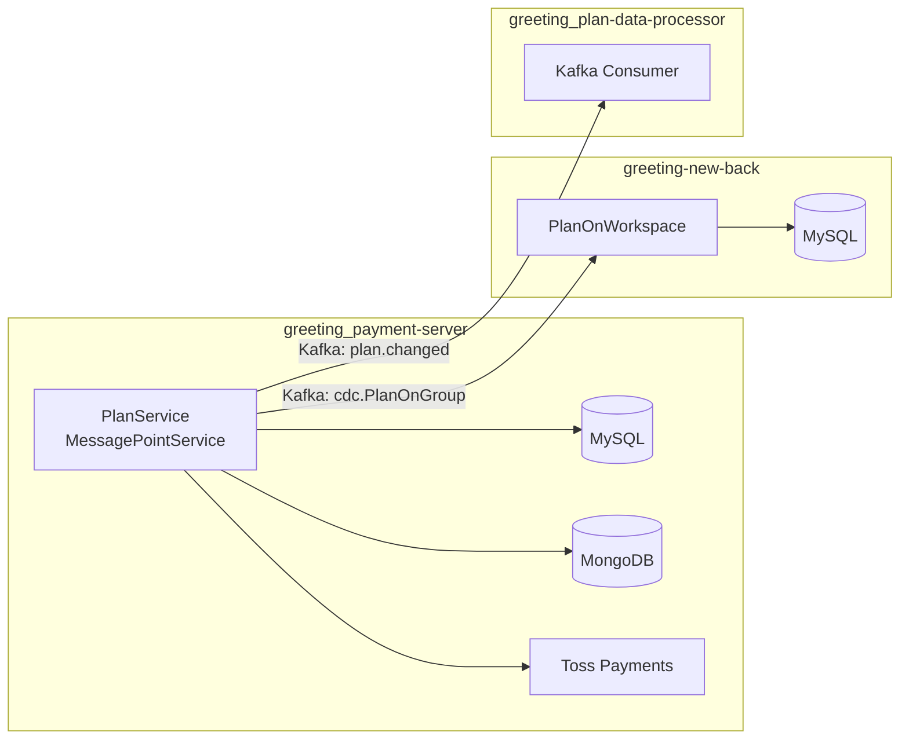
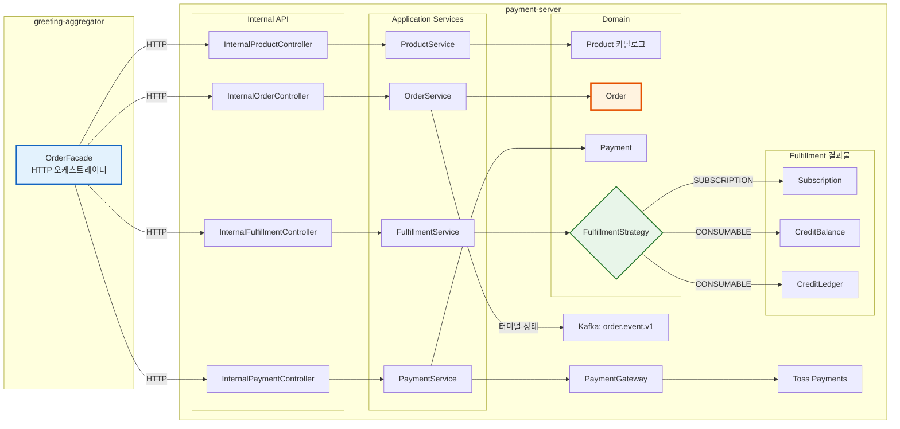
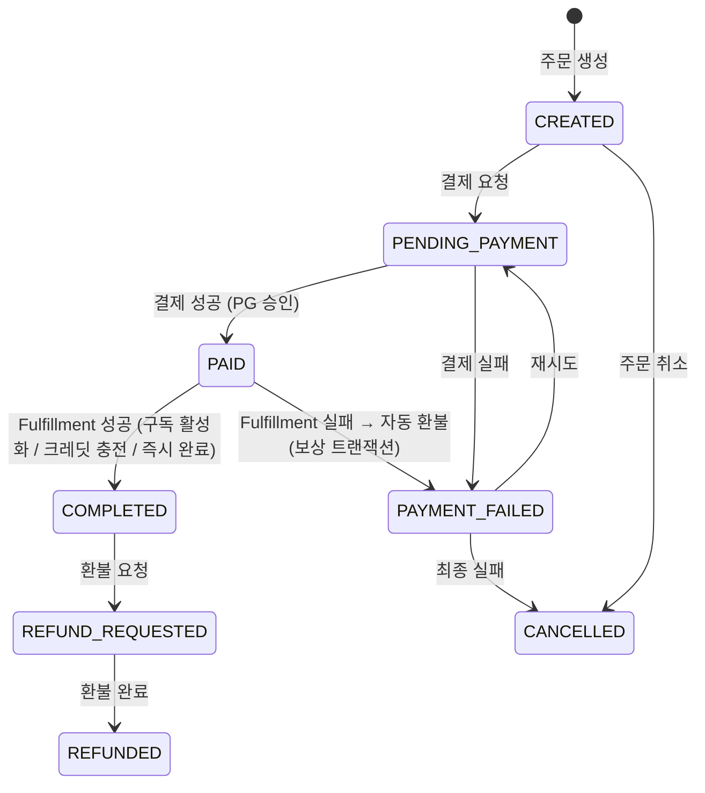
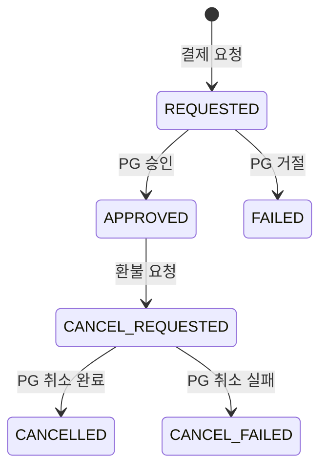
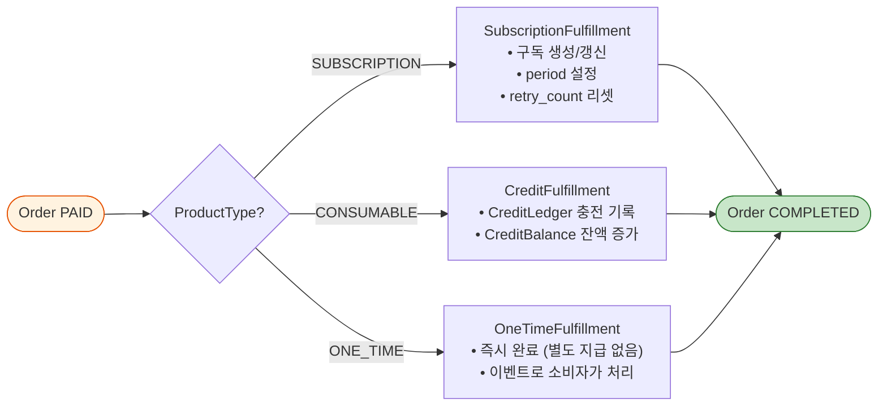
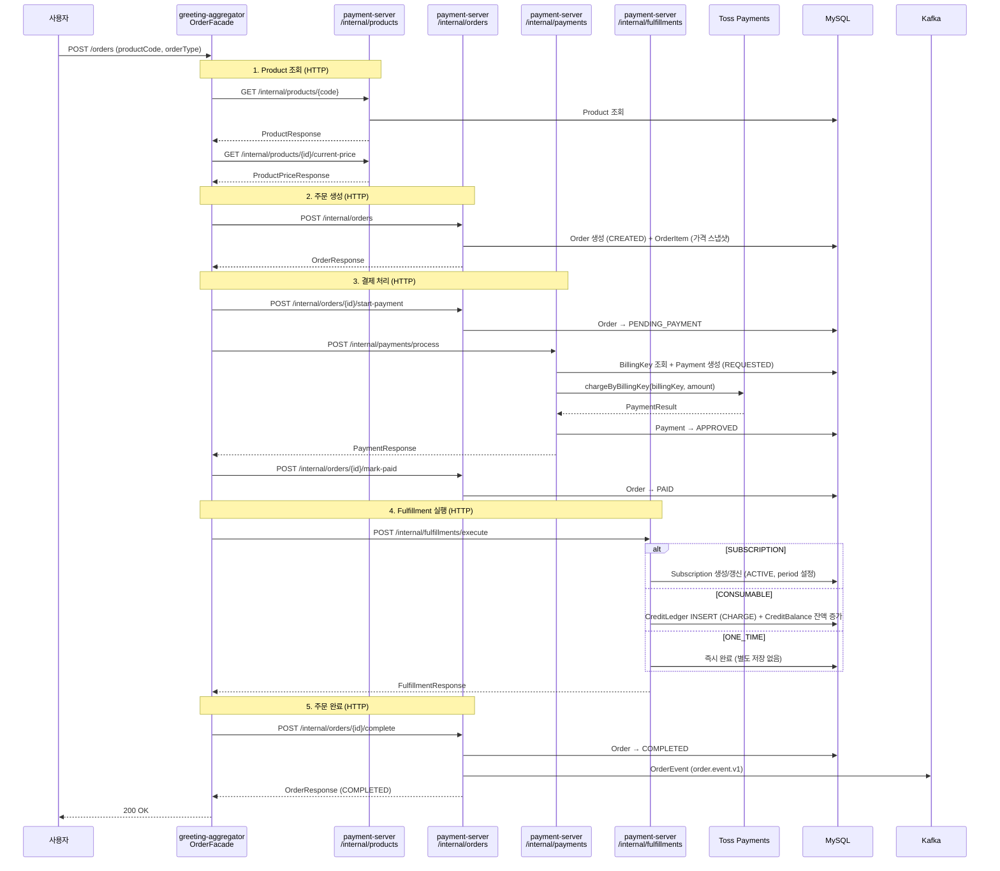
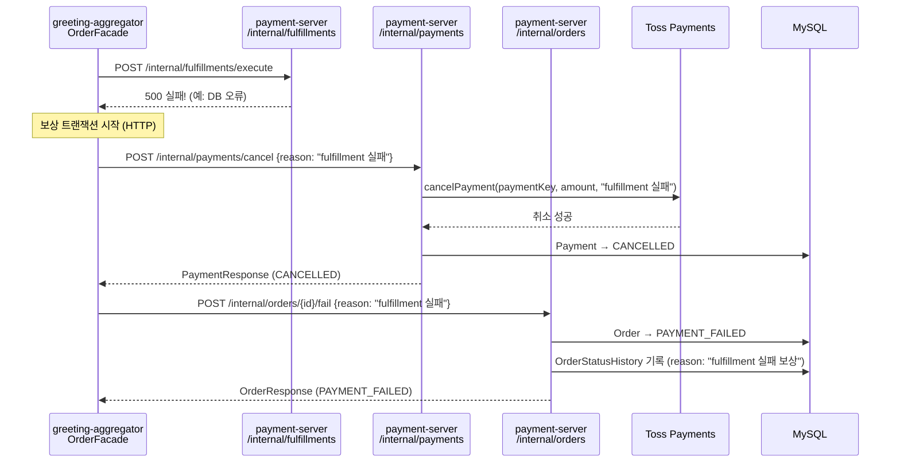
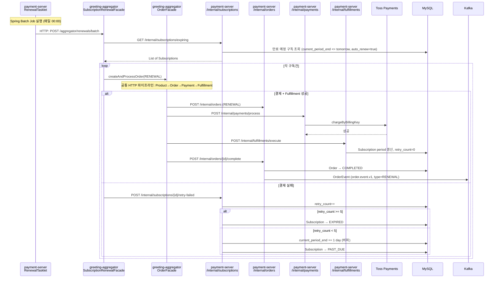
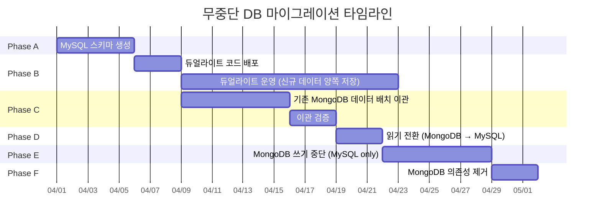

# [결제/주문 시스템 리팩토링] 기술 설계 문서 (TDD)

> 요구사항: MongoDB→MySQL 전환, 상품/주문/결제 분리, Soft Delete 전환
> TDD 작성일: 2026-03-20
> Gap 분석: [gap_analysis.md](./gap_analysis.md)
> **상태: Gap 분석 전 항목 확정 반영 완료**

---

## 1. 개요

### 1.1 배경

현재 greeting_payment-server는 Plan 구독과 SMS 포인트를 각각 독립적인 도메인으로 처리하고 있으며, MySQL + MongoDB 이원 체계로 트랜잭션 일관성이 보장되지 않음. 새로운 상품(AI 크레딧 등)이 추가될 때마다 별도 도메인을 전체 구현해야 하는 구조적 한계가 있음.

### 1.2 목표

1. **상품(Product) / 주문(Order) / 결제(Payment) 3-Layer 분리**: 어떤 상품이든 동일한 주문/결제 파이프라인으로 처리
2. **MongoDB → MySQL 완전 전환**: 트랜잭션 일관성 확보, 단일 DB 운영
3. **Hard Delete → Soft Delete**: 모든 엔티티에 `deleted_at` + 이력 관리
4. **PG 추상화**: Toss Payments 외 다른 PG 추가 가능한 인터페이스

### 1.3 범위

**In Scope**
- 상품 카탈로그 모델링 (구독형, 소진형, 일회성)
- 주문 도메인 (주문 생성 → 결제 → 완료/실패/환불 상태머신)
- 결제 도메인 (PG 추상화, 빌링키 관리, 웹훅)
- 구독 도메인 (자동 갱신, 업그레이드/다운그레이드, 프로레이션)
- 크레딧 원장 (SMS/AI 포인트 충전/소진/만료)
- MongoDB → MySQL 마이그레이션
- Soft Delete + 이력 관리

**Out of Scope**
- payment-server ↔ greeting-new-back 서비스 통합 (독립 서비스 유지)
- 장바구니(Cart) 기능
- 세금계산서 자동 발행
- 해외 결제 (KRW 고정)
- plan-data-processor → greeting-new-back 이관 (별도 티켓으로 분리, 이 TDD에서는 이벤트 발행까지만)

### 1.4 용어 정의

| 용어 | 정의 |
|------|------|
| Product | 판매 가능한 상품 단위 (플랜, SMS 포인트 팩, AI 크레딧 팩) |
| ProductType | 상품 과금 유형. 동일 상품(예: AI 서류평가)도 3가지 유형으로 등록 가능 |
| — SUBSCRIPTION | 구독형. 월/연 자동 갱신 (예: Basic 플랜, AI 평가 무제한 구독) |
| — CONSUMABLE | 소진형. 포인트 충전 후 사용 (예: SMS 1000건 팩, AI 크레딧 100건 팩) |
| — ONE_TIME | 건별 결제형. 1회 결제 1회 사용 (예: AI 서류평가 1건, 프리미엄 리포트 1건) |
| Order | 하나의 상품에 대한 구매 요청 단위 |
| Payment | 주문에 대한 실제 금전 거래 (PG 승인/취소) |
| Subscription | 구독형 상품의 반복 결제 관리 엔티티 |
| CreditLedger | 소진형 상품의 잔액 원장 (충전/사용/만료 기록) |
| BillingKey | PG에 저장된 카드 정보 토큰 (자동 결제용) |

---

## 2. 현재 상태 (AS-IS)

### 2.1 아키텍처



### 2.2 현재 데이터 모델

```
MySQL (payment-server)
├── PlanOnGroup          ← 워크스페이스 구독 플랜
├── CardInfoOnGroup      ← 빌링키 (카드 정보)
├── CreditOnGroup        ← SMS 포인트 잔액
├── payment_transaction  ← 결제 트랜잭션 추적
└── User_planlogsonbackoffice ← 백오피스 수동 플랜 로그

MongoDB (payment-server)
├── PaymentLogsOnGroup              ← 결제 이력 (주문 로그)
├── MessagePointLogsOnWorkspace     ← SMS 포인트 사용 이력
└── MessagePointChargeLogsOnWorkspace ← SMS 포인트 충전 원장
```

### 2.3 핵심 문제

| # | 문제 | AS-IS | 왜 문제인가 |
|---|------|-------|-----------|
| 1 | **상품별 코드 하드코딩** | Plan 결제 = PlanService, SMS 충전 = MessagePointService, 완전 별개 코드 | 새 상품(AI 크레딧) 추가 시 서비스/컨트롤러/DB 전부 새로 만들어야 함 |
| 2 | **공통 주문/결제 개념 없음** | Plan은 PlanOnGroup에 직접 쓰고, SMS는 CreditOnGroup에 직접 씀 | "주문"이라는 중간 계층이 없어서 결제 이력 추적, 환불, 멱등성 보장이 각각 별도 구현 |
| 3 | **DB 이원화** | MySQL(구독) + MongoDB(결제 이력, 포인트 이력) | 하나의 거래에서 MySQL과 MongoDB를 동시에 써야 해서 트랜잭션 일관성 불가 |
| 4 | **이력 관리 파편화** | payment_transaction(MySQL) + PaymentLogs(MongoDB) + MessagePointLogs(MongoDB) | 거래 내역을 통합 조회하려면 3곳을 합쳐야 함 |
| 5 | **Hard Delete** | 결제 관련 데이터 물리 삭제 | 법적 보관 의무(5년) 위반 리스크, 디버깅 불가 |

### 2.4 TO-BE에서 해결하려는 것

| AS-IS 문제 | TO-BE 해결 방안 | 핵심 설계 결정 |
|-----------|---------------|-------------|
| 상품별 코드 하드코딩 | **Product 카탈로그**: 상품을 DB로 관리하고 유형(SUBSCRIPTION/CONSUMABLE/ONE_TIME)으로 분류 | 새 상품 = DB INSERT만으로 추가 |
| 공통 주문/결제 없음 | **Order 중심 파이프라인**: 어떤 상품이든 Order → Payment → Fulfillment 동일 흐름 | Order가 시스템의 중심 엔티티 |
| DB 이원화 | **MongoDB 완전 제거**: MySQL 단일 DB로 트랜잭션 일관성 확보 | Dual Write 무중단 마이그레이션 |
| 이력 파편화 | **Order + Payment 테이블로 통합**: 모든 거래가 단일 구조 | 거래 내역 = ORDER 조회 한 번 |
| Hard Delete | **Soft Delete**: 전 테이블 deleted_at + 상태 이력 테이블 | 법적 보관 + 디버깅 가능 |

---

## 3. 제안 설계 (TO-BE)

### 3.1 설계 원칙: Aggregator + Domain Server 분리

```
AS-IS: payment-server 모노리스 (OrderFacade가 내부 메서드 직접 호출)
TO-BE: greeting-aggregator (HTTP 오케스트레이션) + payment-server (도메인 서비스 + Internal API)

  ┌─────────────────────────────────────────────┐
  │  greeting-aggregator                        │
  │  ┌─────────────────────────────┐            │
  │  │  OrderFacade                │            │
  │  │  (HTTP 오케스트레이터)        │            │
  │  │  비즈니스 로직 없음            │            │
  │  └────────────┬────────────────┘            │
  └───────────────┼─────────────────────────────┘
                  │ HTTP Internal API
                  ▼
  ┌─────────────────────────────────────────────┐
  │  payment-server                             │
  │                                             │
  │  Product → Order → Payment → Fulfillment    │
  │  (모든 도메인 로직이 여기에 존재)               │
  │                                             │
  │  Internal API Controllers                   │
  │  ├── InternalProductController              │
  │  ├── InternalOrderController                │
  │  ├── InternalPaymentController              │
  │  └── InternalFulfillmentController          │
  └─────────────────────────────────────────────┘
```

**핵심 원칙:**
- **OrderFacade(greeting-aggregator)**: 비즈니스 로직 없음. HTTP 호출 순서만 관리하는 순수 오케스트레이터
- **payment-server**: 모든 도메인 로직 보유. Internal API를 통해 각 서비스를 노출
- Subscription과 Credit은 독립 도메인이 아니라, Order의 Fulfillment(이행) 전략
- 구독(Subscription) = SUBSCRIPTION 상품의 이행 결과물. Order가 완료되면 구독 기간이 활성화됨
- 크레딧(CreditBalance/Ledger) = CONSUMABLE 상품의 이행 결과물. Order가 완료되면 잔액이 증가함
- Kafka 이벤트 발행은 payment-server에서만 수행 (aggregator는 이벤트를 발행하지 않음)

### 3.2 아키텍처



### 3.3 Order 상태 머신



### 3.4 Payment 상태 머신



### 3.5 Fulfillment 전략 — 상품 유형별 처리

Order가 PAID 상태가 되면, **상품 유형(ProductType)에 따라 Fulfillment 전략이 결정**된다.



| 전략 | 대상 상품 | Fulfillment 동작 | Revoke (환불 시) |
|------|----------|-----------------|----------------|
| SubscriptionFulfillment | 플랜 (Basic/Standard 등) | Subscription 레코드 생성/갱신, period 설정 | Subscription CANCELLED, 프로레이션 환불 |
| CreditFulfillment | SMS 팩, AI 크레딧 팩 | CreditLedger CHARGE + CreditBalance 증가 | CreditLedger REFUND + Balance 차감 |
| OneTimeFulfillment | 단건 AI 평가 등 | 즉시 COMPLETED | 사용 여부 확인 후 환불 |

**Subscription/CreditBalance/CreditLedger는 "독립 도메인"이 아니라 "Fulfillment가 관리하는 저장소"이다.** OrderFacade → FulfillmentStrategy를 통해서만 이들을 조작할 수 있다. OrderService는 조회만 담당한다.

---

## 4. 상세 설계

### 4.1 MySQL 스키마

> **DDL 전문 (컬럼별 COMMENT + ERD 포함)**: [ticket-01_db-schema-flyway.md](./tickets/ticket-01_db-schema-flyway.md) 참조

#### 14개 테이블 요약

| # | 테이블 | 설명 | 주요 컬럼 |
|---|--------|------|----------|
| 1 | product | 상품 카탈로그 | code(UK), product_type, is_active |
| 2 | product_metadata | 상품 확장 속성 (key-value) | product_id, meta_key, meta_value |
| 3 | product_price | 가격 정책 (이력) | product_id, price, billing_interval_months, valid_from/to |
| 4 | `order` | 주문 | order_number(UK), workspace_id, order_type, status, 금액5종, idempotency_key(UK), version |
| 5 | order_item | 주문 항목 (스냅샷) | order_id, product_code/name/type, quantity, unit_price |
| 6 | payment | 결제 | order_id, payment_key, payment_method, gateway, status, amount, idempotency_key(UK) |
| 7 | billing_key | 빌링키 | workspace_id, billing_key_value(암호화), is_primary, gateway |
| 8 | subscription | 구독 | workspace_id, product_id, status, period, auto_renew, retry_count, version |
| 9 | credit_balance | 크레딧 잔액 | workspace_id, credit_type, balance, version |
| 10 | credit_ledger | 크레딧 원장 | workspace_id, credit_type, transaction_type, amount, balance_after, expired_at |
| 11 | order_status_history | 주문 상태 이력 | order_id, from/to_status, changed_by, reason |
| 12 | payment_status_history | 결제 상태 이력 | payment_id, from/to_status, pg_response(TEXT) |
| 13 | refund | 환불 | refund_number(UK), payment_id, order_id, refund_type, refund_amount |
| 14 | pg_webhook_log | 웹훅 로그 | pg_provider+payment_key+event_type(UK), payload(TEXT), status |

#### 설계 규칙
- FK 제약 없음 (앱 레벨 관리)
- JSON/ENUM 타입 없음 (VARCHAR/TEXT)
- BOOLEAN → TINYINT(1)
- DATETIME(6) 마이크로초
- Soft Delete: deleted_at
- 모든 컬럼에 COMMENT 필수

### 4.2 도메인 모델 (Kotlin) — Aggregator + payment-server 분리 구조

> 기존 모노리스 내부 Facade → **greeting-aggregator(OrderFacade HTTP 오케스트레이션) + payment-server(도메인 서비스 + Internal API)** 분리
>
> **핵심 원칙**: OrderFacade는 greeting-aggregator에 위치하며 비즈니스 로직 없이 HTTP 호출만 수행한다. 모든 도메인 로직은 payment-server에 남는다.

#### 4.2.1 greeting-aggregator (오케스트레이션 전용)

```
greeting-aggregator/
└── business/
    └── application/
        └── payment/
            ├── OrderFacade.kt                      ← ★ HTTP 오케스트레이터 (비즈니스 로직 없음)
            ├── client/
            │   ├── PaymentServerClient.kt          ← payment-server Internal API HTTP 클라이언트
            │   ├── dto/
            │   │   ├── ProductResponse.kt
            │   │   ├── ProductPriceResponse.kt
            │   │   ├── OrderResponse.kt
            │   │   ├── PaymentResponse.kt
            │   │   ├── FulfillmentResponse.kt
            │   │   ├── CreateOrderRequest.kt
            │   │   ├── ProcessPaymentRequest.kt
            │   │   ├── ExecuteFulfillmentRequest.kt
            │   │   ├── SubscriptionResponse.kt
            │   │   └── CreditBalanceResponse.kt
            │   └── PaymentServerClientConfig.kt    ← WebClient/RestClient 설정
            └── SubscriptionRenewalFacade.kt        ← 구독 갱신 오케스트레이션 (HTTP)
```

#### 4.2.2 payment-server (도메인 서비스 + Internal API)

```
payment-server/
├── domain/
│   ├── product/
│   │   ├── Product.kt                    ← Aggregate Root (상품 카탈로그)
│   │   ├── ProductType.kt                ← enum: SUBSCRIPTION, CONSUMABLE, ONE_TIME
│   │   ├── ProductPrice.kt               ← 가격 정책 (이력 관리)
│   │   └── ProductMetadata.kt            ← 확장 속성 (key-value)
│   │
│   ├── order/                            ← ★ 시스템의 중심 도메인
│   │   ├── Order.kt                      ← Aggregate Root (주문)
│   │   ├── OrderItem.kt                  ← 주문 항목 (가격 스냅샷)
│   │   ├── OrderType.kt                  ← enum: NEW, RENEWAL, UPGRADE, DOWNGRADE, PURCHASE, REFUND
│   │   ├── OrderStatus.kt               ← enum + 상태 전이 규칙
│   │   ├── OrderNumberGenerator.kt       ← 주문번호 생성
│   │   │
│   │   ├── fulfillment/                  ← ★ 상품 유형별 이행 전략
│   │   │   ├── FulfillmentStrategy.kt    ← 인터페이스: fulfill(order), revoke(order)
│   │   │   ├── SubscriptionFulfillment.kt← 구독 활성화/갱신/해지
│   │   │   ├── CreditFulfillment.kt      ← 크레딧 충전/환불
│   │   │   └── OneTimeFulfillment.kt     ← 즉시 완료
│   │   │
│   │   ├── Subscription.kt              ← Fulfillment 결과물 (구독 상태)
│   │   ├── SubscriptionStatus.kt        ← enum: ACTIVE, PAST_DUE, CANCELLED, EXPIRED
│   │   ├── CreditBalance.kt             ← Fulfillment 결과물 (크레딧 잔액)
│   │   ├── CreditLedger.kt              ← Fulfillment 결과물 (크레딧 원장)
│   │   ├── CreditType.kt                ← enum: SMS, AI_EVALUATION
│   │   └── CreditTransactionType.kt     ← enum: CHARGE, USE, REFUND, EXPIRE, GRANT
│   │
│   └── payment/
│       ├── Payment.kt                    ← 결제 엔티티
│       ├── PaymentStatus.kt             ← enum + 상태 전이
│       ├── PaymentMethod.kt             ← enum: BILLING_KEY, CARD, MANUAL
│       ├── PaymentGateway.kt            ← 인터페이스 (PG 추상화)
│       ├── BillingKey.kt                ← 빌링키 엔티티
│       ├── PaymentResult.kt             ← PG 응답 VO
│       └── Refund.kt                    ← 환불 엔티티
│
├── application/
│   ├── OrderService.kt                   ← Order Context만 (CRUD + 상태 전이 + 이력)
│   ├── PaymentService.kt                 ← Payment Context만 (PG 호출 + 결제 상태)
│   ├── ProductService.kt                 ← Product Context만 (상품/가격 조회)
│   ├── FulfillmentService.kt             ← FulfillmentStrategyResolver + 실행
│   └── CreditExpiryFacade.kt            ← 크레딧 만료 비즈니스 로직 (Tasklet/API 재사용)
│   (각 Service는 자기 Bounded Context만 담당. 오케스트레이션은 aggregator가 수행)
│
├── infrastructure/
│   ├── pg/
│   │   ├── TossPaymentGateway.kt
│   │   └── ManualPaymentGateway.kt
│   ├── repository/
│   ├── batch/
│   │   ├── SubscriptionRenewalTasklet.kt     ← Spring Batch Tasklet (트리거)
│   │   ├── SubscriptionRenewalJobConfig.kt   ← Job 설정
│   │   ├── CreditExpiryTasklet.kt            ← Spring Batch Tasklet (트리거)
│   │   └── CreditExpiryJobConfig.kt          ← Job 설정
│   └── event/
│       └── OrderEventPublisher.kt
│
└── presentation/
    ├── external/
    │   └── OrderController.kt            ← 외부 API (주문 조회/취소)
    ├── internal/                          ← ★ NEW: Aggregator 전용 Internal API
    │   ├── InternalProductController.kt   ← 상품/가격 조회
    │   ├── InternalOrderController.kt     ← 주문 생성/상태 전이
    │   ├── InternalPaymentController.kt   ← 결제 처리/취소
    │   └── InternalFulfillmentController.kt ← Fulfillment 실행
    └── webhook/
        └── TossWebhookController.kt
```

#### 4.2.3 Internal API 명세

| Method | Path | Service | Description |
|--------|------|---------|-------------|
| GET | `/internal/products/{code}` | ProductService | 상품 조회 |
| GET | `/internal/products/{id}/current-price` | ProductService | 현재 가격 조회 |
| POST | `/internal/orders` | OrderService | 주문 생성 |
| POST | `/internal/orders/{id}/start-payment` | OrderService | 결제 시작 상태 전이 |
| POST | `/internal/orders/{id}/mark-paid` | OrderService | 결제 완료 상태 전이 |
| POST | `/internal/orders/{id}/complete` | OrderService | 주문 완료 상태 전이 |
| POST | `/internal/orders/{id}/fail` | OrderService | 주문 실패 상태 전이 |
| POST | `/internal/payments/process` | PaymentService | 결제 처리 |
| POST | `/internal/payments/cancel` | PaymentService | 결제 취소 |
| POST | `/internal/fulfillments/execute` | FulfillmentStrategy | Fulfillment 실행 |
| GET | `/internal/subscriptions/current` | OrderService | 현재 구독 조회 |
| GET | `/internal/credits/balance` | OrderService | 크레딧 잔액 조회 |

**AS-IS 대비 변경점:**
- ~~payment-server 내부 OrderFacade~~ → **greeting-aggregator의 OrderFacade (HTTP 오케스트레이터)**
- ~~내부 메서드 호출~~ → **HTTP Internal API 호출 (서비스 간 경계 명확화)**
- ~~SubscriptionService~~, ~~CreditService~~ → **OrderService + FulfillmentStrategy**로 통합 (payment-server 내부)
- ~~SubscriptionController~~, ~~CreditController~~ → **InternalOrderController + InternalFulfillmentController**
- payment-server에 `presentation/internal/` 패키지 추가 (aggregator 전용 API)
- Kafka 이벤트 발행은 payment-server에 유지 (aggregator에서 발행하지 않음)
- 스케줄러는 Spring Batch Tasklet으로 구현 (@Scheduled 미사용), 비즈니스 로직은 SubscriptionRenewalFacade(aggregator)/CreditExpiryFacade(payment-server)에 캡슐화

### 4.3 핵심 인터페이스: PaymentGateway 추상화

```kotlin
interface PaymentGateway {
    val gatewayName: String  // "TOSS", "MANUAL"

    /** 빌링키로 자동 결제 */
    fun chargeByBillingKey(
        billingKey: String,
        orderId: String,
        amount: Int,
        orderName: String,
    ): PaymentResult

    /** 결제 승인 (카드 직접 결제) */
    fun confirmPayment(
        paymentKey: String,
        orderId: String,
        amount: Int,
    ): PaymentResult

    /** 결제 취소 (환불) */
    fun cancelPayment(
        paymentKey: String,
        cancelAmount: Int,
        cancelReason: String,
    ): PaymentResult
}

data class PaymentResult(
    val success: Boolean,
    val paymentKey: String?,
    val receiptUrl: String?,
    val approvedAt: LocalDateTime?,
    val failureCode: String?,
    val failureMessage: String?,
    val rawResponse: String?,  // PG 원본 응답 JSON
)
```

### 4.4 핵심 흐름: 주문 → 결제 → Fulfillment (Aggregator + payment-server)

모든 상품이 동일한 흐름을 탄다. **greeting-aggregator의 OrderFacade가 payment-server Internal API를 순차 호출하여 오케스트레이션한다.** ProductType에 따라 Fulfillment 단계만 달라진다.



### 4.5 핵심 흐름: Fulfillment 실패 시 보상 트랜잭션

OrderFacade(greeting-aggregator)가 Fulfillment 실패를 감지하면, payment-server의 결제 취소 API를 호출하여 보상 트랜잭션을 수행한다.



### 4.6 핵심 흐름: 구독 자동 갱신 (Tasklet → SubscriptionRenewalFacade → OrderFacade HTTP)

Tasklet(payment-server)은 트리거일 뿐, **SubscriptionRenewalFacade(greeting-aggregator)가 OrderFacade의 HTTP 오케스트레이션 파이프라인을 재사용**한다. `@Scheduled`는 사용하지 않는다.



---

## 5. 영향 범위

### 5.1 수정 대상

| 서비스 | 변경 유형 | 상세 |
|--------|----------|------|
| greeting_payment-server | **대규모 리팩토링** | 전체 도메인 모델 재설계, MongoDB 제거, 새 스키마 |
| greeting-new-back | 수정 | PlanOnWorkspace 조회 방식 변경 (CDC or API) |
| greeting_plan-data-processor | **greeting-new-back으로 이관** | Node.js 제거, Kotlin Kafka Consumer로 전환. ATS 도메인 데이터는 ATS가 직접 관리 |
| greeting-db-schema | 추가 | Flyway 마이그레이션 스크립트 |
| greeting-topic | 추가 | 신규 Kafka 토픽 정의 |

### 5.2 Kafka 이벤트 변경

| 기존 토픽 | 대응 | 비고 |
|----------|------|------|
| `event.ats.plan.changed.v1` | 유지 + 어댑터 | plan-data-processor 하위호환 |
| `basic-plan.changed` | 유지 | plan-data-processor 소비 |
| `standard-plan.changed` | 유지 | plan-data-processor 소비 |
| `cdc.greeting.PlanOnGroup` | **폐기 예정** | 신규: `order.event.v1` (단일 이벤트, 터미널 상태에서만 1회 발행) |

### 5.3 무중단 마이그레이션 전략 (Dual Write)

MongoDB → MySQL 전환 시 **서비스 중단 없이** 데이터 정합성을 보장하기 위해 6단계 Dual Write 전략을 적용한다.



#### Phase A: MySQL 스키마 생성
- Flyway로 신규 테이블 생성 (기존 서비스에 영향 없음)

#### Phase B: 듀얼라이트 (Dual Write)
- **모든 MongoDB 쓰기 지점에 MySQL 쓰기를 추가**
- MongoDB가 Primary(Source of Truth), MySQL은 Secondary
- 쓰기 순서: MongoDB 먼저 → MySQL 후 (MySQL 실패해도 서비스 영향 없음)
- Feature flag로 듀얼라이트 on/off 제어

```kotlin
// DualWritePaymentLogService.kt
class DualWritePaymentLogService(
    private val mongoRepository: PaymentLogsOnGroupRepository,   // 기존
    private val mysqlRepository: OrderRepository,                 // 신규
    private val featureFlag: FeatureFlagService,
) {
    fun savePaymentLog(log: PaymentLogOnGroup) {
        // 1. MongoDB (Primary) — 항상 실행
        mongoRepository.save(log)

        // 2. MySQL (Secondary) — 듀얼라이트 활성 시에만
        if (featureFlag.isEnabled("dual-write-payment")) {
            try {
                val order = PaymentLogToOrderConverter.convert(log)
                mysqlRepository.save(order)
            } catch (e: Exception) {
                // MySQL 실패해도 서비스 중단 없음 — 로그만 기록
                log.warn("Dual write MySQL failed: ${e.message}", e)
                dualWriteFailureCounter.increment()
            }
        }
    }
}
```

#### Phase C: 기존 데이터 배치 이관
- 듀얼라이트 시작 이전의 MongoDB 데이터를 배치로 MySQL에 이관
- **듀얼라이트 시작 시점(timestamp)을 기준으로 이관 범위 결정** — 이후 데이터는 이미 듀얼라이트로 들어감
- 중복 방지: idempotency_key 또는 source_id로 upsert

#### Phase D: 읽기 전환
- Feature flag로 읽기 소스를 MongoDB → MySQL로 전환
- **Shadow Read**: 전환 전 양쪽에서 동시 읽기 후 결과 비교 (불일치 시 알림)
- 불일치율이 0%에 도달하면 MySQL을 Primary Reader로 전환

```kotlin
// DualReadPaymentLogService.kt
fun getPaymentLog(orderId: String): PaymentLog {
    if (featureFlag.isEnabled("read-from-mysql")) {
        return mysqlRepository.findByOrderNumber(orderId)
    }
    return mongoRepository.findByOrderId(orderId)
}
```

#### Phase E: MongoDB 쓰기 중단
- Feature flag로 MongoDB 쓰기 비활성화
- MySQL만 쓰기 (Single Write)
- 1~2주 모니터링 기간 (롤백 가능하도록 MongoDB 유지)

#### Phase F: MongoDB 의존성 제거
- MongoDB Repository, Config, 의존성 완전 제거
- MongoDB 컬렉션은 아카이브 후 삭제

### 5.3.1 듀얼라이트 대상 컬렉션별 전략

| MongoDB 컬렉션 | MySQL 대상 | 듀얼라이트 방식 |
|----------------|-----------|---------------|
| PaymentLogsOnGroup | `order` + `order_item` + `payment` | Service 레벨 듀얼라이트 |
| MessagePointLogsOnWorkspace | `credit_ledger` | Service 레벨 듀얼라이트 |
| MessagePointChargeLogsOnWorkspace | `credit_ledger` | Service 레벨 듀얼라이트 |

### 5.3.2 기존 MySQL 테이블 매핑 (듀얼라이트 불필요)

| 기존 테이블 | 신규 테이블 | 전략 |
|------------|-----------|------|
| PlanOnGroup | `subscription` + `product` | 배치 매핑 후 읽기 전환 |
| CardInfoOnGroup | `billing_key` | 배치 매핑 (암호화 키 이관) |
| CreditOnGroup | `credit_balance` | 배치 매핑 |

---

## 6. 리스크 & 대안

| 리스크 | 영향도 | 대안 |
|--------|--------|------|
| 듀얼라이트 중 MySQL 쓰기 실패 누적 | High | MySQL 실패는 비차단 + 실패 카운터 모니터링 + 배치 보정 |
| 듀얼라이트 중 데이터 불일치 | High | Shadow Read 비교 검증 + 불일치 알림 + 수동 보정 도구 |
| 읽기 전환 후 MySQL 장애 | Critical | Feature flag로 즉시 MongoDB 읽기 롤백 (5분 내) |
| MongoDB 마이그레이션 중 데이터 유실 | Critical | 듀얼라이트 시작 시점 기준 배치 범위 설정 + 검증 |
| 구독 갱신 스케줄러 장애 | High | 미처리 건 소급 처리 로직 + 알림 |
| PG 웹훅 중복 처리 | High | idempotency_key 기반 중복 방지 |
| 기존 이벤트 소비자 호환 | High | 어댑터 패턴으로 기존 스키마 유지 |
| 대량 구독 갱신 동시 처리 | Medium | 배치 사이즈 제한 + 분산 처리 |
| 크레딧 동시 차감 경합 | Medium | Optimistic Lock (version) |

---

## 7. 구현 계획

### 7.1 단계별 진행

```
4월: DB 전환 (무중단 Dual Write 전략)
├── Phase A: 스키마 설계 + Flyway 마이그레이션 + JPA 엔티티
├── Phase B: 듀얼라이트 코드 배포 (MongoDB + MySQL 동시 쓰기)
├── Phase C: 기존 MongoDB 데이터 배치 이관 + 검증
├── Phase D: 읽기 전환 (Shadow Read → MySQL Primary)
├── Phase E: MongoDB 쓰기 중단 (MySQL 단독) + 모니터링
└── Phase F: MongoDB 의존성 제거

5월: 구조 개선 (주문 중심 통합)
├── Phase 5: Product 도메인
├── Phase 6: Order 도메인 (상태머신 + FulfillmentStrategy)
├── Phase 7: Payment 도메인 (PG 추상화)
├── Phase 8: FulfillmentStrategy 구현 (Subscription/Credit/OneTime)
├── Phase 9: 스케줄러 (구독 갱신, 크레딧 만료)
├── Phase 10: API + 이벤트 + 하위호환
└── Phase 11: Soft Delete 전환 + 이력 관리
```

---

## 8. 확정된 Gap 분석 반영 요약

### 8.1 주문 중심 통합 — FulfillmentStrategy

모든 상품이 동일한 파이프라인: `Order → Payment → Fulfillment`

| ProductType | Fulfillment 전략 | fulfill(order) | revoke(order) — 환불 시 |
|-------------|-----------------|----------------|----------------------|
| **SUBSCRIPTION** | SubscriptionFulfillment | Subscription 레코드 생성/갱신, period 설정, retry_count 리셋 | Subscription CANCELLED + 프로레이션 환불 |
| **CONSUMABLE** | CreditFulfillment | CreditLedger CHARGE 기록 + CreditBalance 잔액 증가 | CreditLedger REFUND + Balance 차감 |
| **ONE_TIME** | OneTimeFulfillment | 즉시 COMPLETED (이벤트로 소비자가 처리) | 사용 여부 확인 후 환불 |

### 8.2 OrderFacade — HTTP 오케스트레이터 (greeting-aggregator)

OrderFacade는 greeting-aggregator에 위치하며, **비즈니스 로직 없이** payment-server Internal API를 순차 호출한다.

```kotlin
// greeting-aggregator/business/application/payment/OrderFacade.kt
package doodlin.greeting.aggregator.business.application.payment

import doodlin.greeting.aggregator.business.application.payment.client.PaymentServerClient
import doodlin.greeting.aggregator.business.application.payment.client.dto.*
import org.springframework.stereotype.Service

/**
 * HTTP 오케스트레이터. 비즈니스 로직 없음.
 * payment-server Internal API를 순차 호출하여 주문 파이프라인을 수행한다.
 * Kafka 이벤트 발행은 payment-server가 담당한다 (aggregator에서 발행하지 않음).
 */
@Service
class OrderFacade(
    private val paymentServerClient: PaymentServerClient,
) {
    fun createAndProcessOrder(request: CreateOrderRequest): OrderResponse {
        // 1. Product 조회 (HTTP)
        val product = paymentServerClient.getProduct(request.productCode)
        val price = paymentServerClient.getCurrentPrice(
            productId = product.id,
            billingIntervalMonths = request.billingIntervalMonths,
        )

        // 2. 주문 생성 (HTTP)
        val order = paymentServerClient.createOrder(
            CreateInternalOrderRequest(
                workspaceId = request.workspaceId,
                orderType = request.orderType,
                productCode = product.code,
                productId = product.id,
                unitPrice = price.price,
                billingIntervalMonths = request.billingIntervalMonths,
                idempotencyKey = request.idempotencyKey,
            )
        )

        // 3. 결제 + Fulfillment
        return processOrder(order)
    }

    fun processOrder(order: OrderResponse): OrderResponse {
        // 결제 시작 상태 전이
        paymentServerClient.startPayment(order.id)

        // 결제 처리
        val payment = paymentServerClient.processPayment(
            ProcessPaymentRequest(
                orderId = order.id,
                workspaceId = order.workspaceId,
                amount = order.totalAmount,
                orderName = order.orderNumber,
            )
        )

        // 결제 완료 상태 전이
        paymentServerClient.markPaid(order.id)

        // Fulfillment 실행
        try {
            paymentServerClient.executeFulfillment(
                ExecuteFulfillmentRequest(
                    orderId = order.id,
                    workspaceId = order.workspaceId,
                    productType = order.productType,
                    productCode = order.productCode,
                )
            )
            // 주문 완료 (payment-server가 Kafka 이벤트도 발행)
            return paymentServerClient.completeOrder(order.id)
        } catch (e: Exception) {
            // 보상 트랜잭션: Fulfillment 실패 → 결제 취소 (HTTP)
            paymentServerClient.cancelPayment(
                CancelPaymentRequest(
                    orderId = order.id,
                    reason = "fulfillment 실패: ${e.message}",
                )
            )
            paymentServerClient.failOrder(
                orderId = order.id,
                reason = "fulfillment 실패: ${e.message}",
            )
            throw e
        }
    }
}
```

```kotlin
// greeting-aggregator/business/application/payment/client/PaymentServerClient.kt
package doodlin.greeting.aggregator.business.application.payment.client

import doodlin.greeting.aggregator.business.application.payment.client.dto.*
import org.springframework.stereotype.Component
import org.springframework.web.client.RestClient

/**
 * payment-server Internal API 클라이언트.
 * 모든 HTTP 호출을 캡슐화한다.
 */
@Component
class PaymentServerClient(
    private val paymentRestClient: RestClient,
) {
    fun getProduct(code: String): ProductResponse =
        paymentRestClient.get()
            .uri("/internal/products/{code}", code)
            .retrieve()
            .body(ProductResponse::class.java)!!

    fun getCurrentPrice(productId: Long, billingIntervalMonths: Int?): ProductPriceResponse =
        paymentRestClient.get()
            .uri("/internal/products/{id}/current-price?billingIntervalMonths={months}",
                productId, billingIntervalMonths)
            .retrieve()
            .body(ProductPriceResponse::class.java)!!

    fun createOrder(request: CreateInternalOrderRequest): OrderResponse =
        paymentRestClient.post()
            .uri("/internal/orders")
            .body(request)
            .retrieve()
            .body(OrderResponse::class.java)!!

    fun startPayment(orderId: Long): OrderResponse =
        paymentRestClient.post()
            .uri("/internal/orders/{id}/start-payment", orderId)
            .retrieve()
            .body(OrderResponse::class.java)!!

    fun markPaid(orderId: Long): OrderResponse =
        paymentRestClient.post()
            .uri("/internal/orders/{id}/mark-paid", orderId)
            .retrieve()
            .body(OrderResponse::class.java)!!

    fun completeOrder(orderId: Long): OrderResponse =
        paymentRestClient.post()
            .uri("/internal/orders/{id}/complete", orderId)
            .retrieve()
            .body(OrderResponse::class.java)!!

    fun failOrder(orderId: Long, reason: String): OrderResponse =
        paymentRestClient.post()
            .uri("/internal/orders/{id}/fail", orderId)
            .body(mapOf("reason" to reason))
            .retrieve()
            .body(OrderResponse::class.java)!!

    fun processPayment(request: ProcessPaymentRequest): PaymentResponse =
        paymentRestClient.post()
            .uri("/internal/payments/process")
            .body(request)
            .retrieve()
            .body(PaymentResponse::class.java)!!

    fun cancelPayment(request: CancelPaymentRequest): PaymentResponse =
        paymentRestClient.post()
            .uri("/internal/payments/cancel")
            .body(request)
            .retrieve()
            .body(PaymentResponse::class.java)!!

    fun executeFulfillment(request: ExecuteFulfillmentRequest): FulfillmentResponse =
        paymentRestClient.post()
            .uri("/internal/fulfillments/execute")
            .body(request)
            .retrieve()
            .body(FulfillmentResponse::class.java)!!
}
```

**핵심 설계 결정:**
- OrderFacade에는 `if/else`, 도메인 로직, DB 접근이 일절 없다. 순수 HTTP 호출 순서 관리만 수행
- 보상 트랜잭션도 HTTP 호출로 처리 (Fulfillment 실패 시 payment-server cancel API 호출)
- Kafka 이벤트 발행은 payment-server의 `completeOrder` Internal API 내부에서 수행 (aggregator가 이벤트를 직접 발행하지 않음)
- payment-server의 Services(ProductService, OrderService, PaymentService, FulfillmentService)는 기존과 동일한 BC 분리를 유지

### 8.3 확정된 주요 설계 결정 요약

| 항목 | 확정 결정 |
|------|----------|
| **핵심 아키텍처** | **greeting-aggregator의 OrderFacade가 HTTP 오케스트레이터. payment-server가 도메인 서비스 + Internal API 제공. 각 Service(Product/Order/Payment)는 자기 Bounded Context만. Subscription/Credit은 FulfillmentStrategy의 구현체** |
| 장바구니 | 없음. 1주문=1상품 |
| 서비스 구조 | **greeting-aggregator(OrderFacade HTTP 오케스트레이션)** + **payment-server(도메인 서비스 + Internal API)**. OrderFacade는 비즈니스 로직 없이 HTTP 호출만 수행 |
| Internal API | payment-server에 `/internal/*` 엔드포인트 12개 추가. InternalProductController, InternalOrderController, InternalPaymentController, InternalFulfillmentController |
| 이력 관리 | order_status_history, payment_status_history (상태 변경마다 자동 기록) |
| 과금 모델 | 구독형 + 건별 결제 + 포인트 충전 전부 지원 (ProductType 3종) |
| 마이그레이션 | MongoDB 완전 이관. 4월 Dual Write → 5월 구조 개선 |
| 멱등성 | idempotency_key UNIQUE + payment_key 중복 체크 |
| 보상 트랜잭션 | PAID → Fulfillment 실패 시 OrderFacade가 payment-server cancel API를 HTTP 호출하여 보상 |
| 구독 갱신 실패 | 5회 재시도 + 만료일 버퍼(+1일/회). Tasklet(payment-server) → SubscriptionRenewalFacade(aggregator) → OrderFacade HTTP 파이프라인 재사용 |
| 스케줄러 패턴 | **@Scheduled 미사용. Spring Batch Tasklet + Facade 패턴.** SubscriptionRenewalFacade(aggregator)/CreditExpiryFacade(payment-server)에 비즈니스 로직 캡슐화. API/Batch 양쪽 재사용 가능 |
| Kafka 이벤트 발행 | **payment-server에서만 발행**. aggregator는 이벤트를 발행하지 않음. completeOrder Internal API 내부에서 OrderEvent 발행 |
| 환불 | 미사용일 프로레이션. Refund 테이블로 부분환불 지원 |
| 동시성 | Order, CreditBalance에 Optimistic Lock (@Version) |
| PG 추상화 | PaymentGateway 인터페이스 + TossPaymentGateway, ManualPaymentGateway |
| Kafka | **OrderEvent 단일 이벤트** (`order.event.v1`). 터미널 상태(COMPLETED/FAILED/CANCELLED/REFUNDED)에서만 1회 발행. 중간 상태 발행 없음(순서 보장). 소비자는 페이로드(status+productType+productCode)로 분기. 레거시 어댑터가 plan.changed로 변환 |
| 주문번호 | ORD-{yyyyMMdd}-{UUID 8자리} |
| plan-data-processor | **greeting-new-back으로 이관 확정**. OrderEventConsumer(PlanOnWorkspace 갱신) + PlanDowngradeConsumer(기능 비활성화)로 Kotlin 포팅. Node.js 서비스 폐기 |
| Feature Flag 패턴 | `DualWriteFeatureKeys` object + `FeatureFlagService` (SimpleRuntimeConfig 기반). `@ConfigurationProperties` 미사용. Retool에서 배포 없이 런타임 on/off |
