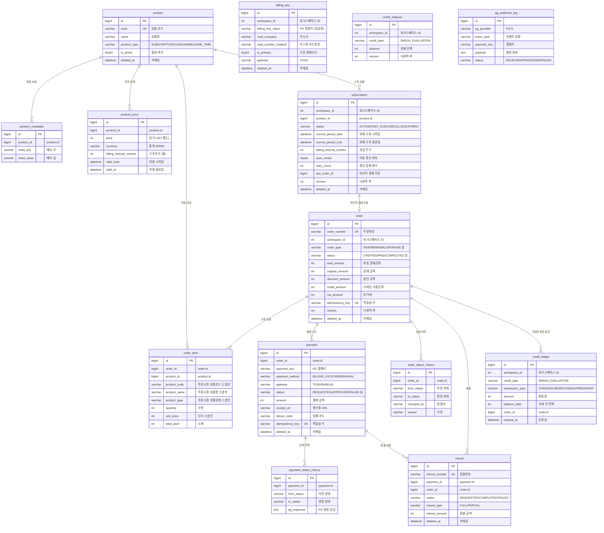

# [Ticket #1] DB 스키마 설계 + Flyway 마이그레이션

## 개요
- TDD 참조: tdd.md 섹션 4.1
- 선행 티켓: 없음
- 크기: L

## 설계 원칙
- FK 제약 없음 (앱 레벨 관리, 주석으로 참조 표시)
- JSON/ENUM 타입 없음 (VARCHAR/TEXT 사용)
- BOOLEAN 없음 (TINYINT(1) 사용)
- 시간 컬럼 DATETIME(6) 마이크로초 정밀도
- Soft Delete: deleted_at DATETIME(6)
- 전 테이블 ENGINE=InnoDB, CHARSET=utf8mb4

## ERD



## DDL (단일 Flyway 파일)

```sql
-- ============================================================
-- V{N}__create_payment_order_system.sql
-- 결제/주문 시스템 전체 스키마 (15 tables)
-- ============================================================

-- -----------------------------------------------------------
-- 1. product: 상품 카탈로그
-- -----------------------------------------------------------
CREATE TABLE product (
    id                  BIGINT          NOT NULL AUTO_INCREMENT PRIMARY KEY COMMENT '상품 PK',
    code                VARCHAR(50)     NOT NULL                            COMMENT '상품 고유 코드 (예: PLAN_BASIC, SMS_PACK_1000, AI_CREDIT_100)',
    name                VARCHAR(255)    NOT NULL                            COMMENT '상품명 (예: 베이직 플랜, SMS 1000건 팩)',
    product_type        VARCHAR(30)     NOT NULL                            COMMENT '상품 과금 유형: SUBSCRIPTION(구독), CONSUMABLE(소진), ONE_TIME(일회)',
    description         TEXT                                                COMMENT '상품 설명',
    is_active           TINYINT(1)      NOT NULL DEFAULT 1                  COMMENT '활성 여부 (1=활성, 0=비활성)',
    created_at          DATETIME(6)     NOT NULL                            COMMENT '생성일시',
    updated_at          DATETIME(6)     NOT NULL                            COMMENT '수정일시',
    deleted_at          DATETIME(6)                                         COMMENT '삭제일시 (NULL=활성, 값=소프트삭제)',
    UNIQUE INDEX uk_product_code (code),
    INDEX idx_product_type (product_type)
) ENGINE=InnoDB DEFAULT CHARSET=utf8mb4 COMMENT='상품 카탈로그';

-- -----------------------------------------------------------
-- 2. product_metadata: 상품 확장 속성 (key-value)
-- -----------------------------------------------------------
CREATE TABLE product_metadata (
    id                  BIGINT          NOT NULL AUTO_INCREMENT PRIMARY KEY COMMENT '메타데이터 PK',
    product_id          BIGINT          NOT NULL                            COMMENT '상품 ID (product.id 참조)',
    meta_key            VARCHAR(100)    NOT NULL                            COMMENT '메타 키 (예: plan_level, credit_amount, sms_count)',
    meta_value          VARCHAR(500)    NOT NULL                            COMMENT '메타 값',
    created_at          DATETIME(6)     NOT NULL                            COMMENT '생성일시',
    UNIQUE INDEX uk_product_metadata (product_id, meta_key),
    INDEX idx_product_metadata_product (product_id)
) ENGINE=InnoDB DEFAULT CHARSET=utf8mb4 COMMENT='상품 확장 속성 (key-value)';

-- -----------------------------------------------------------
-- 3. product_price: 상품 가격 정책 (이력 관리)
-- -----------------------------------------------------------
CREATE TABLE product_price (
    id                          BIGINT      NOT NULL AUTO_INCREMENT PRIMARY KEY COMMENT '가격 PK',
    product_id                  BIGINT      NOT NULL                            COMMENT '상품 ID (product.id 참조)',
    price                       INT         NOT NULL                            COMMENT '원가 (VAT 별도, 원 단위)',
    currency                    VARCHAR(3)  NOT NULL DEFAULT 'KRW'              COMMENT '통화 코드 (ISO 4217)',
    billing_interval_months     INT                                             COMMENT '구독 과금 주기 (월 단위). 1=월간, 12=연간. 비구독이면 NULL',
    valid_from                  DATETIME(6) NOT NULL                            COMMENT '가격 적용 시작일',
    valid_to                    DATETIME(6)                                     COMMENT '가격 적용 종료일 (NULL이면 현재 유효)',
    created_at                  DATETIME(6) NOT NULL                            COMMENT '생성일시',
    INDEX idx_product_price_valid (product_id, valid_from, valid_to)
) ENGINE=InnoDB DEFAULT CHARSET=utf8mb4 COMMENT='상품 가격 정책 (기간별 이력 관리)';

-- -----------------------------------------------------------
-- 4. order: 주문
-- -----------------------------------------------------------
CREATE TABLE `order` (
    id                  BIGINT          NOT NULL AUTO_INCREMENT PRIMARY KEY COMMENT '주문 PK',
    order_number        VARCHAR(50)     NOT NULL                            COMMENT '주문번호 (외부 노출용, 예: ORD-20260320-A1B2C3D4)',
    workspace_id        INT             NOT NULL                            COMMENT '워크스페이스 ID',
    order_type          VARCHAR(30)     NOT NULL                            COMMENT '주문 유형: NEW(신규), RENEWAL(갱신), UPGRADE(업그레이드), DOWNGRADE(다운그레이드), PURCHASE(구매), REFUND(환불)',
    status              VARCHAR(30)     NOT NULL DEFAULT 'CREATED'          COMMENT '주문 상태: CREATED, PENDING_PAYMENT, PAID, COMPLETED, CANCELLED, REFUND_REQUESTED, REFUNDED, PAYMENT_FAILED',
    total_amount        INT             NOT NULL DEFAULT 0                  COMMENT '최종 결제 금액 (VAT 포함, 원 단위)',
    original_amount     INT             NOT NULL DEFAULT 0                  COMMENT '원래 금액 (할인 전)',
    discount_amount     INT             NOT NULL DEFAULT 0                  COMMENT '할인 금액',
    credit_amount       INT             NOT NULL DEFAULT 0                  COMMENT '크레딧 사용 금액',
    vat_amount          INT             NOT NULL DEFAULT 0                  COMMENT '부가세',
    currency            VARCHAR(3)      NOT NULL DEFAULT 'KRW'              COMMENT '통화 코드',
    idempotency_key     VARCHAR(100)                                        COMMENT '멱등성 키 (중복 주문 방지)',
    memo                TEXT                                                COMMENT '주문 메모 (백오피스 등)',
    created_by          VARCHAR(50)                                         COMMENT '주문자 (user_id 또는 SYSTEM)',
    created_at          DATETIME(6)     NOT NULL                            COMMENT '생성일시',
    updated_at          DATETIME(6)     NOT NULL                            COMMENT '수정일시',
    deleted_at          DATETIME(6)                                         COMMENT '삭제일시',
    version             INT             NOT NULL DEFAULT 0                  COMMENT '낙관적 락 버전',
    UNIQUE INDEX uk_order_number (order_number),
    UNIQUE INDEX uk_order_idempotency (idempotency_key),
    INDEX idx_order_workspace (workspace_id),
    INDEX idx_order_status (status),
    INDEX idx_order_created (created_at)
) ENGINE=InnoDB DEFAULT CHARSET=utf8mb4 COMMENT='주문';

-- -----------------------------------------------------------
-- 5. order_item: 주문 항목 (주문 시점 상품/가격 스냅샷)
-- -----------------------------------------------------------
CREATE TABLE order_item (
    id                  BIGINT          NOT NULL AUTO_INCREMENT PRIMARY KEY COMMENT '주문항목 PK',
    order_id            BIGINT          NOT NULL                            COMMENT '주문 ID (order.id 참조)',
    product_id          BIGINT          NOT NULL                            COMMENT '상품 ID (product.id 참조)',
    product_code        VARCHAR(50)     NOT NULL                            COMMENT '주문 시점 상품 코드 (스냅샷)',
    product_name        VARCHAR(255)    NOT NULL                            COMMENT '주문 시점 상품명 (스냅샷)',
    product_type        VARCHAR(30)     NOT NULL                            COMMENT '주문 시점 상품 유형 (스냅샷)',
    quantity            INT             NOT NULL DEFAULT 1                  COMMENT '수량',
    unit_price          INT             NOT NULL                            COMMENT '주문 시점 단가 (스냅샷)',
    total_price         INT             NOT NULL                            COMMENT '소계 (unit_price * quantity)',
    created_at          DATETIME(6)     NOT NULL                            COMMENT '생성일시',
    INDEX idx_order_item_order (order_id)
) ENGINE=InnoDB DEFAULT CHARSET=utf8mb4 COMMENT='주문 항목 (상품/가격 스냅샷)';

-- -----------------------------------------------------------
-- 6. payment: 결제
-- -----------------------------------------------------------
CREATE TABLE payment (
    id                  BIGINT          NOT NULL AUTO_INCREMENT PRIMARY KEY COMMENT '결제 PK',
    order_id            BIGINT          NOT NULL                            COMMENT '주문 ID (order.id 참조)',
    payment_key         VARCHAR(200)                                        COMMENT 'PG 결제 키 (Toss paymentKey 등)',
    payment_method      VARCHAR(30)     NOT NULL                            COMMENT '결제 수단: BILLING_KEY(빌링키), CARD(카드), TRANSFER(이체), MANUAL(수동)',
    gateway             VARCHAR(30)     NOT NULL DEFAULT 'TOSS'             COMMENT 'PG사: TOSS, MANUAL(백오피스 수동)',
    status              VARCHAR(30)     NOT NULL DEFAULT 'REQUESTED'        COMMENT '결제 상태: REQUESTED, APPROVED, FAILED, CANCEL_REQUESTED, CANCELLED, CANCEL_FAILED',
    amount              INT             NOT NULL                            COMMENT '결제 요청 금액 (원 단위)',
    receipt_url         VARCHAR(500)                                        COMMENT '영수증 URL',
    failure_code        VARCHAR(50)                                         COMMENT 'PG 오류 코드',
    failure_message     VARCHAR(500)                                        COMMENT 'PG 오류 메시지',
    approved_at         DATETIME(6)                                         COMMENT '결제 승인 일시',
    cancelled_at        DATETIME(6)                                         COMMENT '결제 취소 일시',
    idempotency_key     VARCHAR(100)                                        COMMENT '멱등성 키 (중복 결제 방지)',
    created_at          DATETIME(6)     NOT NULL                            COMMENT '생성일시',
    updated_at          DATETIME(6)     NOT NULL                            COMMENT '수정일시',
    deleted_at          DATETIME(6)                                         COMMENT '삭제일시',
    UNIQUE INDEX uk_payment_idempotency (idempotency_key),
    INDEX idx_payment_order (order_id),
    INDEX idx_payment_key (payment_key),
    INDEX idx_payment_status (status)
) ENGINE=InnoDB DEFAULT CHARSET=utf8mb4 COMMENT='결제';

-- -----------------------------------------------------------
-- 7. billing_key: 빌링키 (PG 자동결제용 카드 토큰)
-- -----------------------------------------------------------
CREATE TABLE billing_key (
    id                  BIGINT          NOT NULL AUTO_INCREMENT PRIMARY KEY COMMENT '빌링키 PK',
    workspace_id        INT             NOT NULL                            COMMENT '워크스페이스 ID',
    billing_key_value   VARCHAR(200)    NOT NULL                            COMMENT 'PG 빌링키 값 (암호화 저장)',
    card_company        VARCHAR(50)                                         COMMENT '카드사명 (예: 삼성카드, 현대카드)',
    card_number_masked  VARCHAR(20)                                         COMMENT '마스킹 카드번호 (예: ****-****-****-1234)',
    email               VARCHAR(255)                                        COMMENT '결제 알림 이메일',
    is_primary          TINYINT(1)      NOT NULL DEFAULT 1                  COMMENT '기본 결제 수단 여부 (1=기본, 0=보조)',
    gateway             VARCHAR(30)     NOT NULL DEFAULT 'TOSS'             COMMENT 'PG사: TOSS',
    created_at          DATETIME(6)     NOT NULL                            COMMENT '생성일시',
    updated_at          DATETIME(6)     NOT NULL                            COMMENT '수정일시',
    deleted_at          DATETIME(6)                                         COMMENT '삭제일시',
    INDEX idx_billing_key_workspace (workspace_id),
    INDEX idx_billing_key_primary (workspace_id, is_primary)
) ENGINE=InnoDB DEFAULT CHARSET=utf8mb4 COMMENT='빌링키 (PG 자동결제용 카드 토큰)';

-- -----------------------------------------------------------
-- 8. subscription: 구독
-- -----------------------------------------------------------
CREATE TABLE subscription (
    id                          BIGINT      NOT NULL AUTO_INCREMENT PRIMARY KEY COMMENT '구독 PK',
    workspace_id                INT         NOT NULL                            COMMENT '워크스페이스 ID',
    product_id                  BIGINT      NOT NULL                            COMMENT '구독 상품 ID (product.id 참조)',
    status                      VARCHAR(30) NOT NULL DEFAULT 'ACTIVE'           COMMENT '구독 상태: ACTIVE(활성), PAST_DUE(연체), CANCELLED(해지), EXPIRED(만료)',
    current_period_start        DATETIME(6) NOT NULL                            COMMENT '현재 구독 기간 시작일',
    current_period_end          DATETIME(6) NOT NULL                            COMMENT '현재 구독 기간 종료일',
    billing_interval_months     INT         NOT NULL DEFAULT 1                  COMMENT '과금 주기 (월 단위). 1=월간, 12=연간',
    auto_renew                  TINYINT(1)  NOT NULL DEFAULT 1                  COMMENT '자동 갱신 여부 (1=자동갱신, 0=수동)',
    retry_count                 INT         NOT NULL DEFAULT 0                  COMMENT '갱신 결제 실패 횟수 (최대 5회, 초과 시 EXPIRED)',
    last_order_id               BIGINT                                          COMMENT '마지막 결제 주문 ID (order.id 참조)',
    cancelled_at                DATETIME(6)                                     COMMENT '해지 요청 일시',
    cancel_reason               VARCHAR(500)                                    COMMENT '해지 사유',
    created_at                  DATETIME(6) NOT NULL                            COMMENT '생성일시',
    updated_at                  DATETIME(6) NOT NULL                            COMMENT '수정일시',
    deleted_at                  DATETIME(6)                                     COMMENT '삭제일시',
    version                     INT         NOT NULL DEFAULT 0                  COMMENT '낙관적 락 버전',
    UNIQUE INDEX uk_subscription_workspace_active (workspace_id, status),
    INDEX idx_subscription_product (product_id),
    INDEX idx_subscription_period_end (current_period_end)
) ENGINE=InnoDB DEFAULT CHARSET=utf8mb4 COMMENT='구독';

-- -----------------------------------------------------------
-- 9. credit_balance: 크레딧 잔액 (워크스페이스 × 크레딧 유형별)
-- -----------------------------------------------------------
CREATE TABLE credit_balance (
    id                  BIGINT          NOT NULL AUTO_INCREMENT PRIMARY KEY COMMENT '크레딧 잔액 PK',
    workspace_id        INT             NOT NULL                            COMMENT '워크스페이스 ID',
    credit_type         VARCHAR(30)     NOT NULL                            COMMENT '크레딧 유형: SMS, AI_EVALUATION (확장 가능)',
    balance             INT             NOT NULL DEFAULT 0                  COMMENT '현재 잔액 (건수 단위)',
    updated_at          DATETIME(6)     NOT NULL                            COMMENT '수정일시',
    version             INT             NOT NULL DEFAULT 0                  COMMENT '낙관적 락 버전 (동시 차감 경합 방지)',
    UNIQUE INDEX uk_credit_balance_workspace_type (workspace_id, credit_type)
) ENGINE=InnoDB DEFAULT CHARSET=utf8mb4 COMMENT='크레딧 잔액';

-- -----------------------------------------------------------
-- 10. credit_ledger: 크레딧 거래 이력 (원장, append-only)
-- -----------------------------------------------------------
CREATE TABLE credit_ledger (
    id                  BIGINT          NOT NULL AUTO_INCREMENT PRIMARY KEY COMMENT '크레딧 거래 PK',
    workspace_id        INT             NOT NULL                            COMMENT '워크스페이스 ID',
    credit_type         VARCHAR(30)     NOT NULL                            COMMENT '크레딧 유형: SMS, AI_EVALUATION',
    transaction_type    VARCHAR(30)     NOT NULL                            COMMENT '거래 유형: CHARGE(충전), USE(사용), REFUND(환불), EXPIRE(만료), GRANT(무상지급)',
    amount              INT             NOT NULL                            COMMENT '변동량 (양수=증가, 음수=감소)',
    balance_after       INT             NOT NULL                            COMMENT '거래 후 잔액 (정합성 검증용)',
    order_id            BIGINT                                              COMMENT '관련 주문 ID (order.id 참조, 충전/환불 시)',
    description         VARCHAR(500)                                        COMMENT '거래 설명 (예: SMS 100건 사용, 플랜 업그레이드 보상)',
    expired_at          DATETIME(6)                                         COMMENT '충전 건 만료일 (CHARGE 유형에만 해당)',
    created_at          DATETIME(6)     NOT NULL                            COMMENT '생성일시',
    INDEX idx_credit_ledger_workspace_type (workspace_id, credit_type),
    INDEX idx_credit_ledger_order (order_id),
    INDEX idx_credit_ledger_created (created_at),
    INDEX idx_credit_ledger_expired (expired_at)
) ENGINE=InnoDB DEFAULT CHARSET=utf8mb4 COMMENT='크레딧 거래 이력 (원장)';

-- -----------------------------------------------------------
-- 11. order_status_history: 주문 상태 변경 이력
-- -----------------------------------------------------------
CREATE TABLE order_status_history (
    id                  BIGINT          NOT NULL AUTO_INCREMENT PRIMARY KEY COMMENT '이력 PK',
    order_id            BIGINT          NOT NULL                            COMMENT '주문 ID (order.id 참조)',
    from_status         VARCHAR(30)                                         COMMENT '이전 상태 (최초 생성 시 NULL)',
    to_status           VARCHAR(30)     NOT NULL                            COMMENT '변경된 상태',
    changed_by          VARCHAR(50)                                         COMMENT '변경자 (user_id 또는 SYSTEM)',
    reason              VARCHAR(500)                                        COMMENT '상태 변경 사유',
    created_at          DATETIME(6)     NOT NULL                            COMMENT '변경일시',
    INDEX idx_order_status_history_order (order_id)
) ENGINE=InnoDB DEFAULT CHARSET=utf8mb4 COMMENT='주문 상태 변경 이력';

-- -----------------------------------------------------------
-- 12. payment_status_history: 결제 상태 변경 이력
-- -----------------------------------------------------------
CREATE TABLE payment_status_history (
    id                  BIGINT          NOT NULL AUTO_INCREMENT PRIMARY KEY COMMENT '이력 PK',
    payment_id          BIGINT          NOT NULL                            COMMENT '결제 ID (payment.id 참조)',
    from_status         VARCHAR(30)                                         COMMENT '이전 상태',
    to_status           VARCHAR(30)     NOT NULL                            COMMENT '변경된 상태',
    pg_response         TEXT                                                COMMENT 'PG 원본 응답 (JSON 문자열 저장)',
    created_at          DATETIME(6)     NOT NULL                            COMMENT '변경일시',
    INDEX idx_payment_status_history_payment (payment_id)
) ENGINE=InnoDB DEFAULT CHARSET=utf8mb4 COMMENT='결제 상태 변경 이력';

-- -----------------------------------------------------------
-- 13. refund: 환불 (부분환불 지원)
-- -----------------------------------------------------------
CREATE TABLE refund (
    id                  BIGINT          NOT NULL AUTO_INCREMENT PRIMARY KEY COMMENT '환불 PK',
    refund_number       VARCHAR(50)     NOT NULL                            COMMENT '환불번호 (외부 노출용)',
    payment_id          BIGINT          NOT NULL                            COMMENT '원 결제 ID (payment.id 참조)',
    order_id            BIGINT          NOT NULL                            COMMENT '원 주문 ID (order.id 참조)',
    status              VARCHAR(30)     NOT NULL DEFAULT 'REQUESTED'        COMMENT '환불 상태: REQUESTED(요청), PROCESSING(처리중), COMPLETED(완료), FAILED(실패)',
    refund_type         VARCHAR(20)     NOT NULL                            COMMENT '환불 유형: FULL(전액), PARTIAL(부분)',
    refund_amount       INT             NOT NULL                            COMMENT '환불 금액 (원 단위)',
    refund_reason       VARCHAR(500)    NOT NULL                            COMMENT '환불 사유',
    pg_refund_key       VARCHAR(200)                                        COMMENT 'PG 환불 키',
    completed_at        DATETIME(6)                                         COMMENT '환불 완료 일시',
    created_at          DATETIME(6)     NOT NULL                            COMMENT '생성일시',
    updated_at          DATETIME(6)     NOT NULL                            COMMENT '수정일시',
    deleted_at          DATETIME(6)                                         COMMENT '삭제일시',
    UNIQUE INDEX uk_refund_number (refund_number),
    INDEX idx_refund_payment (payment_id),
    INDEX idx_refund_order (order_id)
) ENGINE=InnoDB DEFAULT CHARSET=utf8mb4 COMMENT='환불 (부분환불 지원)';

-- -----------------------------------------------------------
-- 14. pg_webhook_log: PG 웹훅 수신 로그 (멱등성 보장)
-- -----------------------------------------------------------
CREATE TABLE pg_webhook_log (
    id                  BIGINT          NOT NULL AUTO_INCREMENT PRIMARY KEY COMMENT '웹훅 로그 PK',
    pg_provider         VARCHAR(30)     NOT NULL                            COMMENT 'PG사: TOSS_PAYMENTS 등',
    event_type          VARCHAR(50)     NOT NULL                            COMMENT '이벤트 유형: PAYMENT_CONFIRMED, PAYMENT_CANCELLED 등',
    payment_key         VARCHAR(200)    NOT NULL                            COMMENT 'PG 결제 키',
    payload             TEXT            NOT NULL                            COMMENT '웹훅 원본 페이로드 (JSON 문자열)',
    status              VARCHAR(20)     NOT NULL DEFAULT 'RECEIVED'         COMMENT '처리 상태: RECEIVED(수신), PROCESSED(처리완료), FAILED(실패), IGNORED(무시)',
    processed_at        DATETIME(6)                                         COMMENT '처리 완료 일시',
    error_message       TEXT                                                COMMENT '처리 실패 시 에러 메시지',
    created_at          DATETIME(6)     NOT NULL                            COMMENT '수신일시',
    UNIQUE INDEX uk_webhook_idempotent (pg_provider, payment_key, event_type),
    INDEX idx_pg_webhook_log_status (status)
) ENGINE=InnoDB DEFAULT CHARSET=utf8mb4 COMMENT='PG 웹훅 수신 로그 (멱등성 보장)';
```

## 수정 파일 목록

| 레포 | 모듈 | 파일 경로 | 변경 유형 |
|------|------|----------|----------|
| greeting-db-schema | payment-server/migration | V{N}__create_payment_order_system.sql | 신규 |

> 실제 버전 번호(N)는 greeting-db-schema 레포의 기존 마이그레이션 최신 버전 이후로 조정

## 테스트 케이스

### 정상 케이스
| ID | 테스트명 | Given | When | Then |
|----|---------|-------|------|------|
| T1-01 | 전체 마이그레이션 실행 성공 | 빈 DB | Flyway 마이그레이션 실행 | 14개 테이블 모두 생성, flyway_schema_history 기록 |
| T1-02 | 인덱스 전체 생성 확인 | 마이그레이션 완료 | SHOW INDEX 실행 | DDL에 정의된 모든 인덱스 존재 |
| T1-03 | UNIQUE 제약 동작 확인 | product 테이블 존재 | 동일 code로 2건 INSERT | Duplicate entry 에러 |
| T1-04 | 기본값 적용 확인 | order 테이블 존재 | 필수 컬럼만 INSERT | status='CREATED', version=0 |
| T1-05 | COMMENT 확인 | 마이그레이션 완료 | SHOW FULL COLUMNS 실행 | 모든 컬럼에 COMMENT 존재 |

### 예외/엣지 케이스
| ID | 테스트명 | Given | When | Then |
|----|---------|-------|------|------|
| T1-E01 | 멱등성 확인 | 마이그레이션 적용 완료 | 재실행 시도 | 스킵 처리, 에러 없음 |
| T1-E02 | order 예약어 처리 | 빈 DB | DDL 실행 | 백틱으로 감싸져 정상 생성 |
| T1-E03 | FK 미존재 확인 | 마이그레이션 완료 | SHOW CREATE TABLE 전체 | FOREIGN KEY 절 0건 |
| T1-E04 | ENUM/JSON 미사용 확인 | 마이그레이션 완료 | information_schema.COLUMNS 조회 | ENUM, JSON 타입 0건 |

## 기대 결과 (AC)
- [ ] 단일 Flyway 스크립트로 14개 테이블이 에러 없이 생성됨
- [ ] 모든 컬럼에 COMMENT가 달려있음
- [ ] FK/JSON/ENUM 타입 없음
- [ ] TINYINT(1)로 boolean 처리, DATETIME(6) 정밀도
- [ ] ENGINE=InnoDB, CHARSET=utf8mb4
- [ ] ERD 다이어그램과 DDL이 일치함
