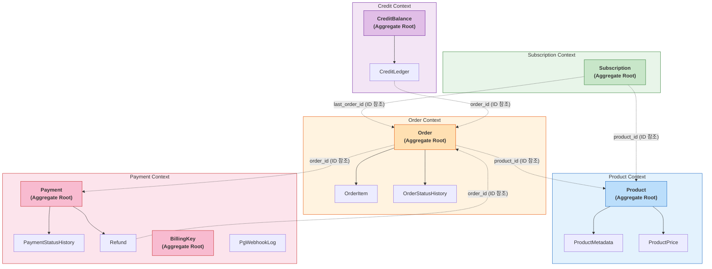

# [Ticket #2] JPA 엔티티 + Repository 구현

## 개요
- TDD 참조: tdd.md 섹션 4.2 (도메인 모델), 4.1 (MySQL 스키마)
- 선행 티켓: #1 (DB 스키마), #3 (BaseEntity)
- 크기: L

## 바운디드 컨텍스트 (Aggregate Root 기준)



### Aggregate Root 정리

| Bounded Context | Aggregate Root | 소속 엔티티 | 컨텍스트 간 참조 |
|----------------|---------------|-----------|---------------|
| **Product** | `Product` | ProductMetadata, ProductPrice | - |
| **Order** | `Order` | OrderItem, OrderStatusHistory | → Product(ID), → Payment(ID) |
| **Payment** | `Payment`, `BillingKey` | PaymentStatusHistory, Refund, PgWebhookLog | → Order(ID) |
| **Subscription** | `Subscription` | - | → Product(ID), → Order(ID) |
| **Credit** | `CreditBalance` | CreditLedger | → Order(ID) |

### 설계 원칙
- **Context 간 참조는 ID만 사용** (JPA @ManyToOne 연관 없음, Long 타입 필드)
- **Aggregate Root 내부만 @OneToMany** (Product→Metadata, Order→OrderItem 등)
- **Context 간 통신은 도메인 이벤트** (직접 서비스 호출 최소화)

---

## 작업 내용

### 변경 사항

greeting_payment-server에 새로운 도메인 모델에 대응하는 JPA 엔티티와 Spring Data JPA Repository를 구현한다. 모든 엔티티는 BaseEntity(#3)를 상속하며, Soft Delete가 적용된다.

#### 엔티티 공통 규칙
- `BaseEntity` 상속 (created_at, updated_at, deleted_at, version)
- Soft Delete: `@SQLRestriction("deleted_at IS NULL")` + `@SQLDelete(sql = "UPDATE {table} SET deleted_at = NOW() WHERE id = ?")`
- 낙관적 락 대상: `Order`, `Subscription`, `CreditBalance` (`@Version`)
- `@Table(name = "...")` 명시 (order 테이블은 백틱: `` `order` ``)
- ID 전략: `@GeneratedValue(strategy = GenerationType.IDENTITY)`

#### Product 도메인 엔티티

1. **Product.kt** - 상품 Aggregate Root
   ```
   @Entity @Table(name = "product")
   @SQLRestriction("deleted_at IS NULL")
   @SQLDelete(sql = "UPDATE product SET deleted_at = NOW() WHERE id = ?")
   - id, code, name, productType(VARCHAR→앱 enum), description, isActive(TINYINT→Boolean)
   - @OneToMany: metadata(List<ProductMetadata>), prices(List<ProductPrice>)
   ```

2. **ProductMetadata.kt** - 상품 메타데이터
   ```
   @Entity @Table(name = "product_metadata")
   - id, productId, metaKey, metaValue, createdAt
   - BaseEntity 미상속 (deleted_at/version 불필요)
   ```

3. **ProductPrice.kt** - 가격 정책
   ```
   @Entity @Table(name = "product_price")
   - id, productId, price, currency, billingIntervalMonths, validFrom, validTo, createdAt
   - BaseEntity 미상속 (이력성 테이블, 수정 없음)
   ```

#### Order 도메인 엔티티

4. **Order.kt** - 주문 Aggregate Root
   ```
   @Entity @Table(name = "`order`")
   @SQLRestriction("deleted_at IS NULL")
   @SQLDelete(sql = "UPDATE `order` SET deleted_at = NOW() WHERE id = ?")
   - id, orderNumber, workspaceId, orderType, status, totalAmount, originalAmount,
     discountAmount, creditAmount, vatAmount, currency, idempotencyKey, memo, createdBy
   - @Version version
   - @OneToMany: items(List<OrderItem>)
   ```

5. **OrderItem.kt** - 주문 항목
   ```
   @Entity @Table(name = "order_item")
   - id, orderId, productId, productCode, productName, productType, quantity, unitPrice, totalPrice
   - BaseEntity 미상속 (주문 생성 시 1회 기록, 수정 없음)
   ```

#### Payment 도메인 엔티티

6. **Payment.kt** - 결제
   ```
   @Entity @Table(name = "payment")
   @SQLRestriction("deleted_at IS NULL")
   @SQLDelete(sql = "UPDATE payment SET deleted_at = NOW() WHERE id = ?")
   - id, orderId, paymentKey, paymentMethod, gateway, status, amount,
     receiptUrl, failureCode, failureMessage, approvedAt, cancelledAt, idempotencyKey
   ```

7. **BillingKey.kt** - 빌링키
   ```
   @Entity @Table(name = "billing_key")
   @SQLRestriction("deleted_at IS NULL")
   @SQLDelete(sql = "UPDATE billing_key SET deleted_at = NOW() WHERE id = ?")
   - id, workspaceId, billingKeyValue(암호화), cardCompany, cardNumberMasked,
     email, isPrimary, gateway
   ```

8. **Refund.kt** - 환불
   ```
   @Entity @Table(name = "refund")
   @SQLRestriction("deleted_at IS NULL")
   @SQLDelete(sql = "UPDATE refund SET deleted_at = NOW() WHERE id = ?")
   - id, refundNumber, paymentId, orderId, status, refundType, refundAmount,
     refundReason, pgRefundKey, completedAt
   ```

#### Subscription 도메인 엔티티

9. **Subscription.kt** - 구독 Aggregate Root
   ```
   @Entity @Table(name = "subscription")
   @SQLRestriction("deleted_at IS NULL")
   @SQLDelete(sql = "UPDATE subscription SET deleted_at = NOW() WHERE id = ?")
   - id, workspaceId, productId, status, currentPeriodStart, currentPeriodEnd,
     billingIntervalMonths, autoRenew, retryCount, lastOrderId,
     cancelledAt, cancelReason
   - @Version version
   ```

#### Credit 도메인 엔티티

10. **CreditBalance.kt** - 크레딧 잔액
    ```
    @Entity @Table(name = "credit_balance")
    - id, workspaceId, creditType, balance
    - @Version version (낙관적 락 - 동시 차감 방지)
    - BaseEntity 미상속 (deleted_at 불필요, version은 자체 관리)
    ```

11. **CreditLedger.kt** - 크레딧 원장
    ```
    @Entity @Table(name = "credit_ledger")
    - id, workspaceId, creditType, transactionType, amount, balanceAfter,
      orderId, description, expiredAt, createdAt
    - BaseEntity 미상속 (이력성 테이블, append-only)
    ```

#### 이력/감사 엔티티

12. **OrderStatusHistory.kt** - 주문 상태 이력
    ```
    @Entity @Table(name = "order_status_history")
    - id, orderId, fromStatus, toStatus, changedBy, reason, createdAt
    - BaseEntity 미상속 (append-only)
    ```

13. **PaymentStatusHistory.kt** - 결제 상태 이력
    ```
    @Entity @Table(name = "payment_status_history")
    - id, paymentId, fromStatus, toStatus, pgResponse, createdAt
    - BaseEntity 미상속 (append-only)
    ```

14. **PgWebhookLog.kt** - PG 웹훅 로그
    ```
    @Entity @Table(name = "pg_webhook_log")
    - id, pgProvider, eventType, paymentKey, payload, status, processedAt, errorMessage, createdAt
    - BaseEntity 미상속 (로그성 테이블)
    ```

#### Enum 클래스
- `ProductType.kt`: SUBSCRIPTION, CONSUMABLE, ONE_TIME
- `OrderType.kt`: NEW, RENEWAL, UPGRADE, DOWNGRADE, PURCHASE, REFUND
- `OrderStatus.kt`: CREATED, PENDING_PAYMENT, PAID, COMPLETED, CANCELLED, REFUND_REQUESTED, REFUNDED, PAYMENT_FAILED
- `PaymentStatus.kt`: REQUESTED, APPROVED, FAILED, CANCEL_REQUESTED, CANCELLED, CANCEL_FAILED
- `PaymentMethod.kt`: BILLING_KEY, CARD, TRANSFER, MANUAL
- `SubscriptionStatus.kt`: ACTIVE, PAST_DUE, CANCELLED, EXPIRED
- `CreditType.kt`: SMS, AI_EVALUATION
- `CreditTransactionType.kt`: CHARGE, USE, REFUND, EXPIRE, GRANT
- `RefundType.kt`: FULL, PARTIAL
- `RefundStatus.kt`: REQUESTED, PROCESSING, COMPLETED, FAILED
- `WebhookStatus.kt`: RECEIVED, PROCESSED, FAILED, IGNORED
- `Gateway.kt`: TOSS, MANUAL

#### Repository 인터페이스 (Spring Data JPA)

| Repository | 주요 메서드 |
|-----------|------------|
| `ProductRepository` | `findByCode(code)`, `findByProductTypeAndIsActiveTrue(type)` |
| `ProductMetadataRepository` | `findByProductId(productId)` |
| `ProductPriceRepository` | `findCurrentPrice(productId, now)` - 유효 기간 내 가격 조회 |
| `OrderRepository` | `findByOrderNumber(orderNumber)`, `findByWorkspaceId(workspaceId, Pageable)`, `findByIdempotencyKey(key)` |
| `OrderItemRepository` | `findByOrderId(orderId)` |
| `PaymentRepository` | `findByOrderId(orderId)`, `findByPaymentKey(paymentKey)` |
| `BillingKeyRepository` | `findByWorkspaceIdAndIsPrimaryTrue(workspaceId)`, `findByWorkspaceId(workspaceId)` |
| `RefundRepository` | `findByPaymentId(paymentId)`, `findByOrderId(orderId)` |
| `SubscriptionRepository` | `findByWorkspaceIdAndStatus(workspaceId, status)`, `findExpiringSoon(before, Pageable)` |
| `CreditBalanceRepository` | `findByWorkspaceIdAndCreditType(workspaceId, creditType)` |
| `CreditLedgerRepository` | `findByWorkspaceIdAndCreditType(workspaceId, creditType, Pageable)` |
| `OrderStatusHistoryRepository` | `findByOrderId(orderId)` |
| `PaymentStatusHistoryRepository` | `findByPaymentId(paymentId)` |
| `PgWebhookLogRepository` | `findByPgProviderAndPaymentKeyAndEventType(provider, key, eventType)` |

#### QueryDSL 지원
- `OrderQueryRepository` (커스텀): 워크스페이스별 주문 조회 (기간/상태/유형 필터)
- `CreditLedgerQueryRepository` (커스텀): 워크스페이스별 크레딧 이력 조회 (기간/유형 필터)
- `SubscriptionQueryRepository` (커스텀): 만료 예정 구독 배치 조회 (자동 갱신 스케줄러용)

#### QueryDSL 설정
- `build.gradle.kts`에 QueryDSL 의존성 + kapt 설정 추가
- `QueryDslConfig.kt` - `JPAQueryFactory` Bean 등록

### 수정 파일 목록
| 레포 | 모듈 | 파일 경로 | 변경 유형 |
|------|------|----------|----------|
| greeting_payment-server | domain/product | Product.kt | 신규 |
| greeting_payment-server | domain/product | ProductMetadata.kt | 신규 |
| greeting_payment-server | domain/product | ProductPrice.kt | 신규 |
| greeting_payment-server | domain/product | ProductType.kt | 신규 |
| greeting_payment-server | domain/order | Order.kt | 신규 |
| greeting_payment-server | domain/order | OrderItem.kt | 신규 |
| greeting_payment-server | domain/order | OrderType.kt | 신규 |
| greeting_payment-server | domain/order | OrderStatus.kt | 신규 |
| greeting_payment-server | domain/payment | Payment.kt | 신규 |
| greeting_payment-server | domain/payment | PaymentStatus.kt | 신규 |
| greeting_payment-server | domain/payment | PaymentMethod.kt | 신규 |
| greeting_payment-server | domain/payment | BillingKey.kt | 신규 |
| greeting_payment-server | domain/payment | Refund.kt | 신규 |
| greeting_payment-server | domain/payment | RefundType.kt | 신규 |
| greeting_payment-server | domain/payment | RefundStatus.kt | 신규 |
| greeting_payment-server | domain/payment | Gateway.kt | 신규 |
| greeting_payment-server | domain/subscription | Subscription.kt | 신규 |
| greeting_payment-server | domain/subscription | SubscriptionStatus.kt | 신규 |
| greeting_payment-server | domain/credit | CreditBalance.kt | 신규 |
| greeting_payment-server | domain/credit | CreditLedger.kt | 신규 |
| greeting_payment-server | domain/credit | CreditType.kt | 신규 |
| greeting_payment-server | domain/credit | CreditTransactionType.kt | 신규 |
| greeting_payment-server | domain/history | OrderStatusHistory.kt | 신규 |
| greeting_payment-server | domain/history | PaymentStatusHistory.kt | 신규 |
| greeting_payment-server | domain/webhook | PgWebhookLog.kt | 신규 |
| greeting_payment-server | domain/webhook | WebhookStatus.kt | 신규 |
| greeting_payment-server | infrastructure/repository | ProductRepository.kt | 신규 |
| greeting_payment-server | infrastructure/repository | ProductMetadataRepository.kt | 신규 |
| greeting_payment-server | infrastructure/repository | ProductPriceRepository.kt | 신규 |
| greeting_payment-server | infrastructure/repository | OrderRepository.kt | 신규 |
| greeting_payment-server | infrastructure/repository | OrderItemRepository.kt | 신규 |
| greeting_payment-server | infrastructure/repository | PaymentRepository.kt | 신규 |
| greeting_payment-server | infrastructure/repository | BillingKeyRepository.kt | 신규 |
| greeting_payment-server | infrastructure/repository | RefundRepository.kt | 신규 |
| greeting_payment-server | infrastructure/repository | SubscriptionRepository.kt | 신규 |
| greeting_payment-server | infrastructure/repository | CreditBalanceRepository.kt | 신규 |
| greeting_payment-server | infrastructure/repository | CreditLedgerRepository.kt | 신규 |
| greeting_payment-server | infrastructure/repository | OrderStatusHistoryRepository.kt | 신규 |
| greeting_payment-server | infrastructure/repository | PaymentStatusHistoryRepository.kt | 신규 |
| greeting_payment-server | infrastructure/repository | PgWebhookLogRepository.kt | 신규 |
| greeting_payment-server | infrastructure/repository/querydsl | OrderQueryRepository.kt | 신규 |
| greeting_payment-server | infrastructure/repository/querydsl | CreditLedgerQueryRepository.kt | 신규 |
| greeting_payment-server | infrastructure/repository/querydsl | SubscriptionQueryRepository.kt | 신규 |
| greeting_payment-server | infrastructure/config | QueryDslConfig.kt | 신규 |
| greeting_payment-server | - | build.gradle.kts | 수정 (QueryDSL 의존성 추가) |

## 테스트 케이스

### 정상 케이스
| ID | 테스트명 | Given | When | Then |
|----|---------|-------|------|------|
| T2-01 | Product 엔티티 저장/조회 | Product 객체 생성 | productRepository.save() + findByCode() | 저장 후 code로 조회 성공 |
| T2-02 | Order + OrderItem 연관 저장 | Order + OrderItem 2건 | orderRepository.save(order with items) | Order와 연관 OrderItem 모두 저장됨 |
| T2-03 | Payment 저장/조회 | Payment 객체 생성 | paymentRepository.save() + findByOrderId() | orderId로 결제 목록 조회 성공 |
| T2-04 | BillingKey 기본 카드 조회 | workspace에 카드 2장 (primary 1장) | findByWorkspaceIdAndIsPrimaryTrue() | primary 카드 1건 반환 |
| T2-05 | Subscription 저장/조회 | Subscription 객체 생성 | save() + findByWorkspaceIdAndStatus() | workspace+status로 조회 성공 |
| T2-06 | CreditBalance 낙관적 락 | CreditBalance(version=0) | 동시 업데이트 2건 | 1건 성공, 1건 OptimisticLockException |
| T2-07 | CreditLedger 시간순 조회 | ledger 3건 (시간순) | findByWorkspaceIdAndCreditType(pageable) | createdAt 역순 정렬 반환 |
| T2-08 | OrderQueryRepository 필터 조회 | 여러 상태/유형의 주문 10건 | 기간+상태 필터 QueryDSL 조회 | 조건에 맞는 주문만 반환 |
| T2-09 | Subscription 만료 예정 배치 조회 | 구독 5건 (만료일 상이) | findExpiringSoon(tomorrow) | 내일까지 만료인 구독만 반환 |
| T2-10 | PgWebhookLog 멱등성 키 조회 | 웹훅 로그 1건 | findByPgProviderAndPaymentKeyAndEventType() | 정확히 1건 반환 |

### 예외/엣지 케이스
| ID | 테스트명 | Given | When | Then |
|----|---------|-------|------|------|
| T2-E01 | Soft Delete - Product 조회 제외 | Product 1건 soft delete됨 | findByCode() | 조회 결과 null (deleted_at IS NULL 필터) |
| T2-E02 | Soft Delete - Order delete() | Order 1건 존재 | orderRepository.delete(order) | 실제 DELETE가 아닌 deleted_at = NOW() UPDATE |
| T2-E03 | Order 낙관적 락 충돌 | Order(version=0) 동시 수정 | 동시 status 변경 2건 | 1건 성공, 1건 OptimisticLockException |
| T2-E04 | Product code UNIQUE 위반 | product(code=PLAN_BASIC) 존재 | 같은 code로 INSERT | DataIntegrityViolationException |
| T2-E05 | Order idempotencyKey 중복 | 동일 idempotencyKey 주문 존재 | 같은 키로 주문 생성 | DataIntegrityViolationException |
| T2-E06 | JPA Auditing 자동 설정 | 새 엔티티 저장 | save() | created_at, updated_at 자동 설정됨 |

## 기대 결과 (AC)
- [ ] 14개 JPA 엔티티가 DB 스키마와 1:1 매핑됨
- [ ] Soft Delete 대상 엔티티에 `@SQLRestriction("deleted_at IS NULL")` 적용됨
- [ ] Soft Delete 대상 엔티티에 `@SQLDelete` 적용 (delete() 호출 시 UPDATE로 변환)
- [ ] `Order`, `Subscription`, `CreditBalance`에 `@Version` 낙관적 락 적용됨
- [ ] 12개 enum 클래스가 VARCHAR 컬럼과 매핑됨 (`@Enumerated(EnumType.STRING)`)
- [ ] 14개 Spring Data JPA Repository 인터페이스 구현됨
- [ ] 3개 QueryDSL 커스텀 Repository 구현됨 (Order, CreditLedger, Subscription)
- [ ] QueryDSL 설정 (JPAQueryFactory Bean, kapt) 완료
- [ ] `@DataJpaTest` 기반 Repository 테스트 통과
- [ ] BaseEntity 상속 엔티티에서 JPA Auditing(created_at, updated_at)이 자동 동작함
