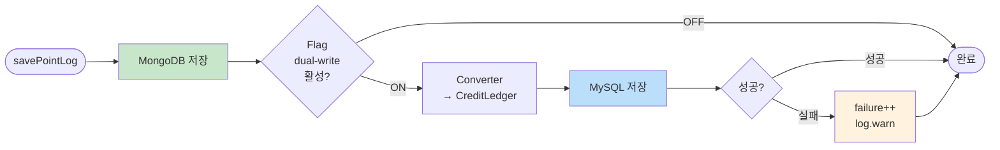

# [Ticket #4a-3] 크레딧 사용 이력 듀얼라이트 (DualWriteMessagePointLogService)

## 개요
- TDD 참조: tdd.md 섹션 5.3
- 선행 티켓: #4a-1
- 크기: M

## 작업 내용

### 변경 사항

MessagePointLogsOnWorkspace(MongoDB) 저장 시 MySQL credit_ledger에 동시 쓰기하는 서비스를 구현한다.

#### 플로우



#### 코드 예시

```kotlin
@Service
class DualWriteMessagePointLogService(
    private val mongoRepository: MessagePointLogsOnWorkspaceRepository,
    private val creditLedgerRepository: CreditLedgerRepository,
    private val converter: PointLogToLedgerConverter,
    private val featureFlag: DualWriteFeatureFlag,
    private val metrics: DualWriteMetrics,
) {
    private val log = LoggerFactory.getLogger(this::class.java)

    fun save(pointLog: MessagePointLogsOnWorkspace) {
        mongoRepository.save(pointLog)

        if (!featureFlag.messagePointLog) return

        metrics.latencyTimer("point").record {
            try {
                val ledgerEntry = converter.convert(pointLog)
                creditLedgerRepository.save(ledgerEntry)
                metrics.successCounter("point").increment()
            } catch (e: Exception) {
                metrics.failureCounter("point").increment()
                log.warn("Dual write failed for point log ${pointLog.id}: ${e.message}", e)
            }
        }
    }
}
```

**PointLogToLedgerConverter**
```kotlin
@Component
class PointLogToLedgerConverter {

    fun convert(log: MessagePointLogsOnWorkspace): CreditLedger {
        return CreditLedger(
            workspaceId = log.workspaceId,
            creditType = CreditType.SMS.name,
            transactionType = resolveTransactionType(log.type),
            amount = resolveAmount(log),
            balanceAfter = log.remainingPoint,
            description = "${log.type.name}: SMS ${log.smsCount}건, LMS ${log.lmsCount}건",
            createdAt = log.createdAt,
        )
    }

    private fun resolveTransactionType(type: MessagePointLogType): String = when (type) {
        MessagePointLogType.PAYMENT -> CreditTransactionType.CHARGE.name
        MessagePointLogType.CREDIT -> CreditTransactionType.GRANT.name
        MessagePointLogType.USE -> CreditTransactionType.USE.name
        MessagePointLogType.DELETE -> CreditTransactionType.EXPIRE.name
        MessagePointLogType.EXPIRE -> CreditTransactionType.EXPIRE.name
        MessagePointLogType.REFUND -> CreditTransactionType.REFUND.name
    }

    private fun resolveAmount(log: MessagePointLogsOnWorkspace): Int = when (log.type) {
        MessagePointLogType.USE, MessagePointLogType.DELETE, MessagePointLogType.EXPIRE -> -(log.usedPoint)
        else -> log.chargedPoint
    }
}
```

### 수정 파일 목록

| 레포 | 모듈 | 파일 경로 | 변경 유형 |
|------|------|----------|----------|
| greeting_payment-server | domain/migration | DualWriteMessagePointLogService.kt | 신규 |
| greeting_payment-server | domain/migration | PointLogToLedgerConverter.kt | 신규 |
| greeting_payment-server | domain/message | MessagePointService.kt (기존) | 수정 (호출 지점 교체) |

## 테스트 케이스

### 정상 케이스
| ID | 테스트명 | Given | When | Then |
|----|---------|-------|------|------|
| TC-01 | 듀얼라이트 ON — 양쪽 저장 | flag ON | save(pointLog) | MongoDB + MySQL credit_ledger 모두 존재 |
| TC-02 | 듀얼라이트 OFF — MongoDB만 | flag OFF | save(pointLog) | MongoDB만 존재 |
| TC-03 | USE 유형 변환 | type=USE | convert(log) | transactionType=USE, amount 음수 |
| TC-04 | PAYMENT 유형 변환 | type=PAYMENT | convert(log) | transactionType=CHARGE, amount 양수 |

### 예외/엣지 케이스
| ID | 테스트명 | Given | When | Then |
|----|---------|-------|------|------|
| TC-E01 | MySQL 실패 — 비차단 | flag ON + MySQL 장애 | save(pointLog) | MongoDB 성공, failure++ |
| TC-E02 | 잔여 포인트 0 | remainingPoint=0 | convert(log) | balanceAfter=0 정상 변환 |

## 기대 결과 (AC)
- [ ] MessagePointLogsOnWorkspace 저장 시 MySQL credit_ledger에 동시 저장
- [ ] 6가지 포인트 로그 유형(PAYMENT/CREDIT/USE/DELETE/EXPIRE/REFUND)이 CreditTransactionType으로 정확히 매핑
- [ ] MySQL 실패 시 MongoDB 저장에 영향 없음
