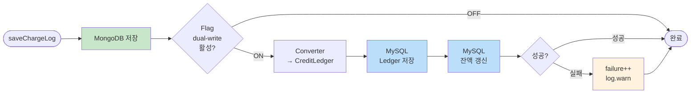

# [Ticket #4a-4] 크레딧 충전 듀얼라이트 (DualWriteChargeLogService)

## 개요
- TDD 참조: tdd.md 섹션 5.3
- 선행 티켓: #4a-1
- 크기: M

## 작업 내용

### 변경 사항

MessagePointChargeLogsOnWorkspace(MongoDB) 저장 시 MySQL credit_ledger + credit_balance에 동시 쓰기하는 서비스를 구현한다. 포인트 사용(#4a-3)과 달리 잔액(credit_balance)도 함께 갱신한다.

#### 플로우



#### 코드 예시

```kotlin
@Service
class DualWriteChargeLogService(
    private val mongoRepository: MessagePointChargeLogsOnWorkspaceRepository,
    private val creditLedgerRepository: CreditLedgerRepository,
    private val creditBalanceRepository: CreditBalanceRepository,
    private val converter: ChargeLogToLedgerConverter,
    private val featureFlag: DualWriteFeatureFlag,
    private val metrics: DualWriteMetrics,
) {
    private val log = LoggerFactory.getLogger(this::class.java)

    fun save(chargeLog: MessagePointChargeLogsOnWorkspace) {
        mongoRepository.save(chargeLog)

        if (!featureFlag.chargeLog) return

        metrics.latencyTimer("charge").record {
            try {
                val (ledgerEntry, balanceDelta) = converter.convert(chargeLog)
                creditLedgerRepository.save(ledgerEntry)

                val balance = creditBalanceRepository
                    .findByWorkspaceIdAndCreditType(chargeLog.workspaceId, CreditType.SMS.name)
                    ?: CreditBalance(
                        workspaceId = chargeLog.workspaceId,
                        creditType = CreditType.SMS.name,
                        balance = 0,
                    )
                balance.balance += balanceDelta
                creditBalanceRepository.save(balance)

                metrics.successCounter("charge").increment()
            } catch (e: Exception) {
                metrics.failureCounter("charge").increment()
                log.warn("Dual write failed for charge log ${chargeLog.id}: ${e.message}", e)
            }
        }
    }
}
```

**ChargeLogToLedgerConverter**
```kotlin
@Component
class ChargeLogToLedgerConverter {

    data class ConvertResult(
        val ledgerEntry: CreditLedger,
        val balanceDelta: Int,
    )

    fun convert(log: MessagePointChargeLogsOnWorkspace): ConvertResult {
        val transactionType = when (log.type) {
            ChargeLogType.PAYMENT -> CreditTransactionType.CHARGE.name
            ChargeLogType.CREDIT -> CreditTransactionType.GRANT.name
        }

        val ledgerEntry = CreditLedger(
            workspaceId = log.workspaceId,
            creditType = CreditType.SMS.name,
            transactionType = transactionType,
            amount = log.amount,
            balanceAfter = log.rest,
            description = "${log.type.name}: ${log.amount}포인트",
            expiredAt = log.expiredAt,
            createdAt = log.createdAt,
        )

        return ConvertResult(ledgerEntry, log.amount)
    }
}
```

### 수정 파일 목록

| 레포 | 모듈 | 파일 경로 | 변경 유형 |
|------|------|----------|----------|
| greeting_payment-server | domain/migration | DualWriteChargeLogService.kt | 신규 |
| greeting_payment-server | domain/migration | ChargeLogToLedgerConverter.kt | 신규 |
| greeting_payment-server | domain/message | MessagePointChargeService.kt (기존) | 수정 (호출 지점 교체) |

## 테스트 케이스

### 정상 케이스
| ID | 테스트명 | Given | When | Then |
|----|---------|-------|------|------|
| TC-01 | 듀얼라이트 ON — 양쪽 저장 | flag ON | save(chargeLog) | MongoDB + MySQL(ledger+balance) 모두 존재 |
| TC-02 | 듀얼라이트 OFF — MongoDB만 | flag OFF | save(chargeLog) | MongoDB만 존재 |
| TC-03 | PAYMENT 유형 충전 | type=PAYMENT, amount=1000 | convert(log) | CHARGE, amount=+1000, balance += 1000 |
| TC-04 | CREDIT 유형 무상지급 | type=CREDIT, amount=500 | convert(log) | GRANT, amount=+500, balance += 500 |
| TC-05 | credit_balance 신규 생성 | 해당 workspace에 balance 없음 | save(chargeLog) | credit_balance 신규 INSERT + balance = amount |

### 예외/엣지 케이스
| ID | 테스트명 | Given | When | Then |
|----|---------|-------|------|------|
| TC-E01 | MySQL 실패 — 비차단 | flag ON + MySQL 장애 | save(chargeLog) | MongoDB 성공, failure++ |
| TC-E02 | 만료일 포함 충전 | expiredAt = 30일 후 | convert(log) | ledger.expiredAt 정확히 매핑 |

## 기대 결과 (AC)
- [ ] MessagePointChargeLogsOnWorkspace 저장 시 MySQL credit_ledger + credit_balance 동시 저장
- [ ] credit_balance가 없으면 신규 생성, 있으면 잔액 증가
- [ ] 충전 건의 만료일(expiredAt)이 credit_ledger에 정확히 저장
- [ ] MySQL 실패 시 MongoDB 저장에 영향 없음
