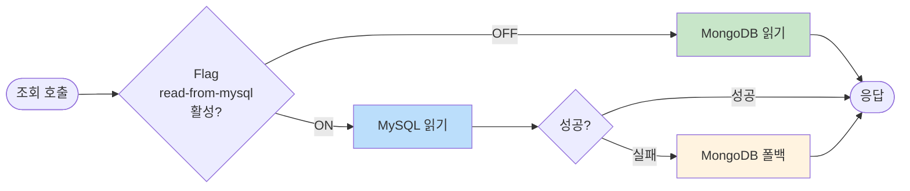

# [Ticket #4a-5] DualRead 서비스

## 개요
- TDD 참조: tdd.md 섹션 5.3
- 선행 티켓: #4a-1, #4a-2, #4a-3, #4a-4
- 크기: S

## 작업 내용

### 변경 사항

Feature Flag 기반으로 읽기 소스를 MongoDB/MySQL 간 전환하는 DualRead 서비스를 구현한다. MySQL 실패 시 MongoDB로 자동 폴백한다.

#### 플로우



#### 코드 예시

**DualReadPaymentLogService**
```kotlin
@Service
class DualReadPaymentLogService(
    private val mongoRepository: PaymentLogsOnGroupRepository,
    private val orderRepository: OrderRepository,
    private val paymentRepository: PaymentRepository,
    private val featureFlag: DualWriteFeatureFlag,
) {
    private val log = LoggerFactory.getLogger(this::class.java)

    fun findByOrderId(orderId: String): PaymentLogDto {
        if (featureFlag.readFromMysqlPayment) {
            return try {
                val order = orderRepository.findByOrderNumber(orderId)
                    ?: throw NoSuchElementException("Order not found: $orderId")
                val payment = paymentRepository.findByOrderId(order.id).firstOrNull()
                toPaymentLogDto(order, payment)
            } catch (e: Exception) {
                log.warn("MySQL read failed, falling back to MongoDB: ${e.message}")
                mongoRepository.findByOrderId(orderId).toDto()
            }
        }
        return mongoRepository.findByOrderId(orderId).toDto()
    }

    fun findByWorkspaceId(workspaceId: Int, pageable: Pageable): Page<PaymentLogDto> {
        if (featureFlag.readFromMysqlPayment) {
            return try {
                orderRepository.findByWorkspaceId(workspaceId, pageable).map { toPaymentLogDto(it, null) }
            } catch (e: Exception) {
                log.warn("MySQL read failed, falling back to MongoDB: ${e.message}")
                mongoRepository.findByGroupId(workspaceId, pageable).map { it.toDto() }
            }
        }
        return mongoRepository.findByGroupId(workspaceId, pageable).map { it.toDto() }
    }
}
```

**DualReadCreditService**
```kotlin
@Service
class DualReadCreditService(
    private val mongoPointLogRepository: MessagePointLogsOnWorkspaceRepository,
    private val mongoChargeLogRepository: MessagePointChargeLogsOnWorkspaceRepository,
    private val creditLedgerRepository: CreditLedgerRepository,
    private val creditBalanceRepository: CreditBalanceRepository,
    private val featureFlag: DualWriteFeatureFlag,
) {
    private val log = LoggerFactory.getLogger(this::class.java)

    fun getBalance(workspaceId: Int, creditType: String): Int {
        if (featureFlag.readFromMysqlCredit) {
            return try {
                creditBalanceRepository
                    .findByWorkspaceIdAndCreditType(workspaceId, creditType)
                    ?.balance ?: 0
            } catch (e: Exception) {
                log.warn("MySQL balance read failed, falling back to MongoDB: ${e.message}")
                mongoChargeLogRepository.calculateBalance(workspaceId)
            }
        }
        return mongoChargeLogRepository.calculateBalance(workspaceId)
    }

    fun getTransactionHistory(
        workspaceId: Int,
        creditType: String,
        pageable: Pageable,
    ): Page<CreditTransactionDto> {
        if (featureFlag.readFromMysqlCredit) {
            return try {
                creditLedgerRepository
                    .findByWorkspaceIdAndCreditType(workspaceId, creditType, pageable)
                    .map { it.toDto() }
            } catch (e: Exception) {
                log.warn("MySQL ledger read failed, falling back to MongoDB: ${e.message}")
                mongoPointLogRepository
                    .findByWorkspaceId(workspaceId, pageable)
                    .map { it.toDto() }
            }
        }
        return mongoPointLogRepository.findByWorkspaceId(workspaceId, pageable).map { it.toDto() }
    }
}
```

#### 기존 읽기 호출 지점 교체

```kotlin
// AS-IS
val logs = paymentLogsOnGroupRepository.findByGroupId(workspaceId)
val balance = creditOnGroupRepository.findByGroupId(workspaceId).credit

// TO-BE
val logs = dualReadPaymentLogService.findByWorkspaceId(workspaceId, pageable)
val balance = dualReadCreditService.getBalance(workspaceId, CreditType.SMS.name)
```

### 수정 파일 목록

| 레포 | 모듈 | 파일 경로 | 변경 유형 |
|------|------|----------|----------|
| greeting_payment-server | domain/migration | DualReadPaymentLogService.kt | 신규 |
| greeting_payment-server | domain/migration | DualReadCreditService.kt | 신규 |
| greeting_payment-server | - | 기존 MongoDB 읽기 호출 지점 | 수정 (DualRead 서비스로 교체) |

## 테스트 케이스

### 정상 케이스
| ID | 테스트명 | Given | When | Then |
|----|---------|-------|------|------|
| TC-01 | MySQL 읽기 (flag ON) | readFromMysqlPayment=true, MySQL에 데이터 | findByOrderId | MySQL 결과 반환 |
| TC-02 | MongoDB 읽기 (flag OFF) | readFromMysqlPayment=false | findByOrderId | MongoDB 결과 반환 |
| TC-03 | MySQL 실패 → MongoDB 폴백 | flag ON + MySQL 장애 | findByOrderId | MongoDB 폴백 결과 반환 |
| TC-04 | 크레딧 잔액 MySQL 읽기 | readFromMysqlCredit=true | getBalance | credit_balance.balance 반환 |
| TC-05 | 크레딧 잔액 없음 | MySQL에 해당 workspace 없음 | getBalance | 0 반환 |

### 예외/엣지 케이스
| ID | 테스트명 | Given | When | Then |
|----|---------|-------|------|------|
| TC-E01 | MySQL 타임아웃 → 폴백 | MySQL 응답 3초 초과 | findByWorkspaceId | MongoDB 폴백, 경고 로그 |
| TC-E02 | MongoDB도 없음 | 양쪽 모두 데이터 없음 | findByOrderId | NoSuchElementException |

## 기대 결과 (AC)
- [ ] Feature Flag로 읽기 소스 MongoDB/MySQL 전환 가능
- [ ] MySQL 실패 시 MongoDB로 자동 폴백 (서비스 중단 없음)
- [ ] 기존 읽기 호출 지점이 DualRead 서비스로 교체됨
- [ ] 결제 이력/크레딧 잔액/크레딧 거래내역 모두 DualRead 적용
