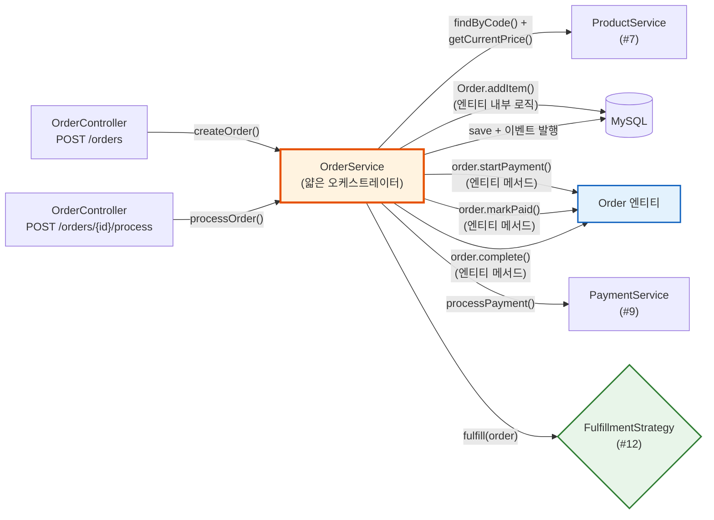
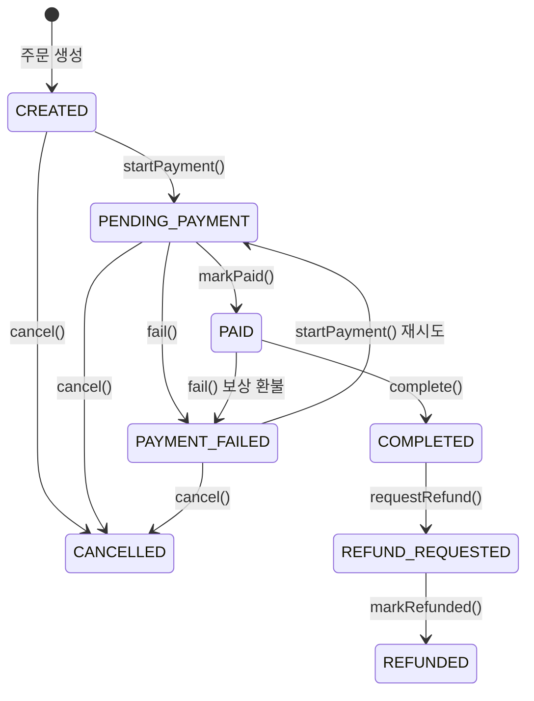
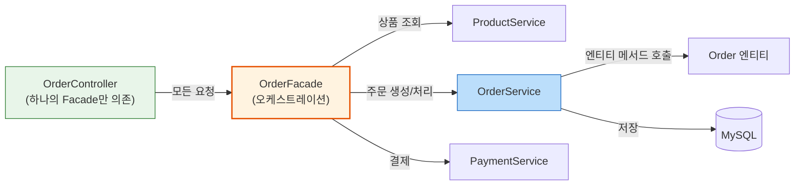
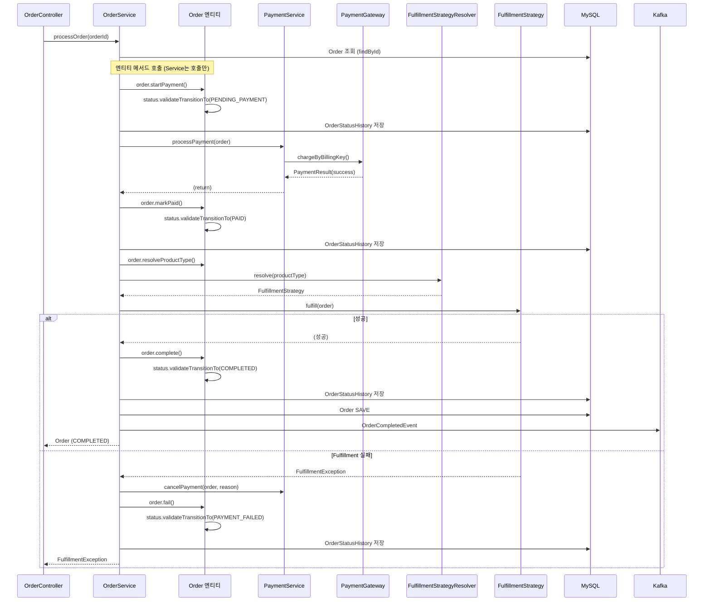

# [Ticket #8] Order 도메인 + 상태머신 (핵심 티켓)

## 개요
- TDD 참조: tdd.md 섹션 3.1, 3.3, 3.5, 4.1.2, 4.2, 4.4, 4.5, 8.2
- 선행 티켓: #2 (JPA 엔티티), #7 (ProductService)
- 크기: L

## 배경

이 티켓은 **시스템의 핵심**이다. Order-centric 아키텍처에서 OrderService는 유일한 오케스트레이터로, 주문 생성부터 결제 → Fulfillment 디스패치 → 완료/보상까지 전체 파이프라인을 관장한다.

- `SubscriptionService`, `CreditService`는 **존재하지 않는다**
- `Subscription`, `CreditBalance`, `CreditLedger`는 `order/` 패키지 하위의 **Fulfillment 결과물**
- FulfillmentStrategy 인터페이스를 이 티켓에서 정의하고, 구현체는 #12에서 작성

> **설계 원칙 (CRITICAL)**:
> 1. **비즈니스 로직은 엔티티/enum 내부에 캡슐화**한다. Service에 로직을 흩뿌리지 않는다.
> 2. `OrderStatus` enum이 상태 전이 규칙을 **소유**하고, `Order` 엔티티가 상태 전이 메서드를 **캡슐화**한다.
> 3. `OrderService`는 **얇은 오케스트레이터** — 엔티티 메서드 호출 + 저장 + 이벤트 발행만 담당한다.
> 4. **Controller → Facade → Service 구조 (SRP)**: Controller는 OrderFacade 하나만 의존. Facade가 여러 Service를 조합. (OrderFacade 자체는 #14 Order API 티켓에서 구현하지만, 이 티켓에서 구조를 확립한다.)
> 5. L 사이즈 티켓이므로 향후 메서드 단위로 세분화 가능 (사용자와 논의 후 결정).

---

## 작업 내용

### OrderService 전체 파이프라인



### Order 상태머신



### OrderStatus enum (상태 전이 규칙을 enum이 소유)

```kotlin
package com.greeting.payment.domain.order

/**
 * OrderStatus enum이 상태 전이 규칙을 소유한다.
 *
 * Service에서 상태를 직접 검증하지 않고, enum.validateTransitionTo()를 호출.
 * 잘못된 전이 시 IllegalStateException 발생 — 방어 코드가 Service에 흩어지지 않는다.
 */
enum class OrderStatus {
    CREATED,
    PENDING_PAYMENT,
    PAID,
    COMPLETED,
    CANCELLED,
    REFUND_REQUESTED,
    REFUNDED,
    PAYMENT_FAILED;

    companion object {
        /**
         * 상태 전이 규칙 — enum 내부에서 관리.
         * companion object에 정의하여 enum 인스턴스 초기화 순서 문제를 회피.
         */
        private val ALLOWED_TRANSITIONS: Map<OrderStatus, Set<OrderStatus>> = mapOf(
            CREATED to setOf(PENDING_PAYMENT, CANCELLED),
            PENDING_PAYMENT to setOf(PAID, PAYMENT_FAILED, CANCELLED),
            PAID to setOf(COMPLETED, PAYMENT_FAILED),
            PAYMENT_FAILED to setOf(PENDING_PAYMENT, CANCELLED),
            COMPLETED to setOf(REFUND_REQUESTED),
            REFUND_REQUESTED to setOf(REFUNDED),
            REFUNDED to emptySet(),
            CANCELLED to emptySet(),
        )
    }

    fun canTransitionTo(next: OrderStatus): Boolean {
        return next in (ALLOWED_TRANSITIONS[this] ?: emptySet())
    }

    /**
     * 상태 전이 검증 — 불가능하면 즉시 예외.
     * Order 엔티티의 상태 전이 메서드 내부에서 호출된다.
     */
    fun validateTransitionTo(next: OrderStatus) {
        require(canTransitionTo(next)) {
            "주문 상태 전이 불가: $this -> $next"
        }
    }

    val isTerminal: Boolean
        get() = this == COMPLETED || this == CANCELLED || this == REFUNDED

    val isCancellable: Boolean
        get() = canTransitionTo(CANCELLED)
}
```

### OrderType enum

```kotlin
package com.greeting.payment.domain.order

enum class OrderType {
    NEW,          // 신규 주문
    RENEWAL,      // 구독 자동 갱신
    UPGRADE,      // 플랜 업그레이드
    DOWNGRADE,    // 플랜 다운그레이드
    PURCHASE,     // 소진형/일회성 구매
    REFUND,       // 환불 주문
}
```

### OrderNumberGenerator

```kotlin
package com.greeting.payment.domain.order

import java.time.LocalDate
import java.time.format.DateTimeFormatter
import java.util.UUID

object OrderNumberGenerator {

    private val DATE_FORMAT = DateTimeFormatter.ofPattern("yyyyMMdd")

    /**
     * 주문번호 생성: ORD-{yyyyMMdd}-{UUID 앞 8자리 대문자}
     * 예: ORD-20260501-A1B2C3D4
     */
    fun generate(): String {
        val datePart = LocalDate.now().format(DATE_FORMAT)
        val uuidPart = UUID.randomUUID().toString().replace("-", "").take(8).uppercase()
        return "ORD-$datePart-$uuidPart"
    }
}
```

### Order 엔티티 (비즈니스 로직을 엔티티 내부에 캡슐화)

```kotlin
package com.greeting.payment.domain.order

import com.greeting.payment.domain.product.Product
import com.greeting.payment.domain.product.ProductPrice
import com.greeting.payment.domain.product.ProductType
import jakarta.persistence.*
import java.time.LocalDateTime

@Entity
@Table(name = "`order`")
@SQLRestriction("deleted_at IS NULL")
@SQLDelete(sql = "UPDATE `order` SET deleted_at = NOW(6) WHERE id = ? AND version = ?")
class Order(

    @Id
    @GeneratedValue(strategy = GenerationType.IDENTITY)
    val id: Long = 0,

    @Column(name = "order_number", nullable = false, unique = true)
    val orderNumber: String = OrderNumberGenerator.generate(),

    @Column(name = "workspace_id", nullable = false)
    val workspaceId: Int,

    @Column(name = "order_type", nullable = false)
    @Enumerated(EnumType.STRING)
    val orderType: OrderType,

    @Column(name = "status", nullable = false)
    @Enumerated(EnumType.STRING)
    var status: OrderStatus = OrderStatus.CREATED,

    @Column(name = "total_amount", nullable = false)
    var totalAmount: Int = 0,

    @Column(name = "original_amount", nullable = false)
    var originalAmount: Int = 0,

    @Column(name = "discount_amount", nullable = false)
    var discountAmount: Int = 0,

    @Column(name = "credit_amount", nullable = false)
    var creditAmount: Int = 0,

    @Column(name = "vat_amount", nullable = false)
    var vatAmount: Int = 0,

    @Column(name = "currency", nullable = false)
    val currency: String = "KRW",

    @Column(name = "idempotency_key", unique = true)
    val idempotencyKey: String? = null,

    @Column(name = "memo")
    var memo: String? = null,

    @Column(name = "created_by")
    val createdBy: String? = null,

    @Column(name = "created_at", nullable = false, updatable = false)
    val createdAt: LocalDateTime = LocalDateTime.now(),

    @Column(name = "updated_at", nullable = false)
    var updatedAt: LocalDateTime = LocalDateTime.now(),

    @Column(name = "deleted_at")
    var deletedAt: LocalDateTime? = null,

    @Version
    @Column(name = "version", nullable = false)
    var version: Int = 0,

    @OneToMany(mappedBy = "order", cascade = [CascadeType.ALL], orphanRemoval = true)
    val items: MutableList<OrderItem> = mutableListOf(),
) {

    // =========================================================================
    // 상태 전이 메서드 — 모든 상태 변경은 반드시 이 메서드를 통해서만 수행.
    // OrderStatus.validateTransitionTo()가 규칙을 검증하고,
    // 엔티티가 부수 효과(시간 업데이트 등)를 캡슐화한다.
    // Service는 이 메서드를 호출만 한다.
    // =========================================================================

    fun startPayment() {
        status.validateTransitionTo(OrderStatus.PENDING_PAYMENT)
        this.status = OrderStatus.PENDING_PAYMENT
        this.updatedAt = LocalDateTime.now()
    }

    fun markPaid() {
        status.validateTransitionTo(OrderStatus.PAID)
        this.status = OrderStatus.PAID
        this.updatedAt = LocalDateTime.now()
    }

    fun complete() {
        status.validateTransitionTo(OrderStatus.COMPLETED)
        this.status = OrderStatus.COMPLETED
        this.updatedAt = LocalDateTime.now()
    }

    fun fail() {
        status.validateTransitionTo(OrderStatus.PAYMENT_FAILED)
        this.status = OrderStatus.PAYMENT_FAILED
        this.updatedAt = LocalDateTime.now()
    }

    fun cancel(reason: String? = null) {
        status.validateTransitionTo(OrderStatus.CANCELLED)
        this.status = OrderStatus.CANCELLED
        this.memo = reason
        this.updatedAt = LocalDateTime.now()
    }

    fun requestRefund() {
        status.validateTransitionTo(OrderStatus.REFUND_REQUESTED)
        this.status = OrderStatus.REFUND_REQUESTED
        this.updatedAt = LocalDateTime.now()
    }

    fun markRefunded() {
        status.validateTransitionTo(OrderStatus.REFUNDED)
        this.status = OrderStatus.REFUNDED
        this.updatedAt = LocalDateTime.now()
    }

    // =========================================================================
    // 주문 항목 관리 — 금액 재계산도 엔티티 내부에서 처리
    // =========================================================================

    fun addItem(item: OrderItem) {
        items.add(item)
        recalculateAmounts()
    }

    private fun recalculateAmounts() {
        this.originalAmount = items.sumOf { it.totalPrice }
        this.totalAmount = originalAmount - discountAmount - creditAmount
        this.vatAmount = (totalAmount * 10) / 110  // VAT 포함 역산
    }

    // =========================================================================
    // 조회 헬퍼 — 엔티티 내부에 캡슐화
    // =========================================================================

    val productType: String
        get() = items.firstOrNull()?.productType
            ?: throw IllegalStateException("주문 항목이 없습니다: orderNumber=$orderNumber")

    fun resolveProductType(): ProductType = ProductType.valueOf(productType)

    val isTerminal: Boolean
        get() = status.isTerminal

    /**
     * 상태 이력 생성용 — 이전 상태와 현재 상태로 이력 객체를 생성한다.
     */
    fun createStatusHistory(
        fromStatus: OrderStatus?,
        changedBy: String? = null,
        reason: String? = null,
    ): OrderStatusHistory {
        return OrderStatusHistory(
            orderId = this.id,
            fromStatus = fromStatus?.name,
            toStatus = this.status.name,
            changedBy = changedBy,
            reason = reason,
        )
    }
}
```

### OrderItem 엔티티 (가격 스냅샷)

```kotlin
package com.greeting.payment.domain.order

import com.greeting.payment.domain.product.Product
import com.greeting.payment.domain.product.ProductPrice
import jakarta.persistence.*
import java.time.LocalDateTime

@Entity
@Table(name = "order_item")
class OrderItem(

    @Id
    @GeneratedValue(strategy = GenerationType.IDENTITY)
    val id: Long = 0,

    @ManyToOne(fetch = FetchType.LAZY)
    @JoinColumn(name = "order_id", nullable = false)
    val order: Order,

    @Column(name = "product_id", nullable = false)
    val productId: Long,

    /** 주문 시점 스냅샷 — 상품 변경과 무관하게 보존 */
    @Column(name = "product_code", nullable = false)
    val productCode: String,

    @Column(name = "product_name", nullable = false)
    val productName: String,

    @Column(name = "product_type", nullable = false)
    val productType: String,

    @Column(name = "quantity", nullable = false)
    val quantity: Int = 1,

    @Column(name = "unit_price", nullable = false)
    val unitPrice: Int,

    @Column(name = "total_price", nullable = false)
    val totalPrice: Int,

    @Column(name = "created_at", nullable = false, updatable = false)
    val createdAt: LocalDateTime = LocalDateTime.now(),
) {

    companion object {
        /**
         * Product + ProductPrice로 가격 스냅샷 생성.
         * 주문 시점의 상품 정보를 불변으로 기록한다.
         */
        fun createSnapshot(
            order: Order,
            product: Product,
            price: ProductPrice,
            quantity: Int = 1,
        ): OrderItem {
            return OrderItem(
                order = order,
                productId = product.id,
                productCode = product.code,
                productName = product.name,
                productType = product.productType,
                quantity = quantity,
                unitPrice = price.price,
                totalPrice = price.price * quantity,
            )
        }
    }
}
```

### FulfillmentStrategy 인터페이스 (구현체는 #12)

```kotlin
package com.greeting.payment.domain.order.fulfillment

import com.greeting.payment.domain.order.Order

/**
 * 상품 유형별 주문 이행 전략.
 *
 * - SubscriptionFulfillment: 구독 생성/갱신 (#12)
 * - CreditFulfillment: 크레딧 충전 (#12)
 * - OneTimeFulfillment: 즉시 완료 (#12)
 *
 * OrderService.processOrder()에서 order.resolveProductType()으로 전략을 선택하여 호출한다.
 */
interface FulfillmentStrategy {

    fun fulfill(order: Order)

    fun revoke(order: Order)
}

class FulfillmentException(message: String, cause: Throwable? = null) : RuntimeException(message, cause)
```

### FulfillmentStrategyResolver

```kotlin
package com.greeting.payment.domain.order.fulfillment

import com.greeting.payment.domain.product.ProductType
import org.springframework.stereotype.Component

@Component
class FulfillmentStrategyResolver(
    private val subscriptionFulfillment: SubscriptionFulfillment,
    private val creditFulfillment: CreditFulfillment,
    private val oneTimeFulfillment: OneTimeFulfillment,
) {

    fun resolve(productType: ProductType): FulfillmentStrategy {
        return when (productType) {
            ProductType.SUBSCRIPTION -> subscriptionFulfillment
            ProductType.CONSUMABLE -> creditFulfillment
            ProductType.ONE_TIME -> oneTimeFulfillment
        }
    }
}
```

### OrderService (얇은 오케스트레이터 — 엔티티 메서드 호출 + 저장 + 이벤트 발행만)

```kotlin
package com.greeting.payment.application

import com.greeting.payment.domain.order.*
import com.greeting.payment.domain.order.fulfillment.FulfillmentException
import com.greeting.payment.domain.order.fulfillment.FulfillmentStrategyResolver
import com.greeting.payment.infrastructure.event.OrderEventPublisher
import com.greeting.payment.infrastructure.repository.OrderRepository
import com.greeting.payment.infrastructure.repository.OrderStatusHistoryRepository
import org.slf4j.LoggerFactory
import org.springframework.stereotype.Service
import org.springframework.transaction.annotation.Transactional

/**
 * OrderService는 얇은 오케스트레이터.
 *
 * - 비즈니스 로직: Order, OrderStatus 엔티티/enum에 캡슐화
 * - Service 역할: 엔티티 메서드 호출 → Repository 저장 → 이벤트 발행
 * - 상태 전이 검증: OrderStatus.validateTransitionTo() (enum 내부)
 * - 금액 계산: Order.recalculateAmounts() (엔티티 내부)
 *
 * L 사이즈 티켓이므로 향후 메서드 단위로 세분화 가능.
 */
@Service
class OrderService(
    private val orderRepository: OrderRepository,
    private val productService: ProductService,
    private val paymentService: PaymentService,
    private val fulfillmentResolver: FulfillmentStrategyResolver,
    private val orderStatusHistoryRepository: OrderStatusHistoryRepository,
    private val orderEventPublisher: OrderEventPublisher,
) {
    private val log = LoggerFactory.getLogger(javaClass)

    @Transactional
    fun createOrder(
        workspaceId: Int,
        productCode: String,
        orderType: OrderType,
        quantity: Int = 1,
        billingIntervalMonths: Int? = null,
        idempotencyKey: String? = null,
        createdBy: String? = null,
    ): Order {
        // 멱등성 체크
        idempotencyKey?.let { key ->
            orderRepository.findByIdempotencyKey(key)?.let { return it }
        }

        // 상품 + 가격 조회
        val product = productService.findByCode(productCode)
        product.validatePurchasable()  // 엔티티 내부 검증
        val price = productService.getCurrentPrice(product.id, billingIntervalMonths)

        // Order 생성 + OrderItem 가격 스냅샷 (엔티티 내부에서 금액 재계산)
        val order = Order(
            workspaceId = workspaceId,
            orderType = orderType,
            idempotencyKey = idempotencyKey,
            createdBy = createdBy,
        )
        order.addItem(OrderItem.createSnapshot(order, product, price, quantity))

        // 저장 + 이력
        val saved = orderRepository.save(order)
        orderStatusHistoryRepository.save(
            saved.createStatusHistory(fromStatus = null, changedBy = createdBy)
        )

        log.info("주문 생성: orderNumber=${saved.orderNumber}, product=$productCode, amount=${saved.totalAmount}")
        return saved
    }

    @Transactional
    fun processOrder(orderId: Long): Order {
        val order = orderRepository.findById(orderId).orElseThrow {
            OrderNotFoundException("주문을 찾을 수 없습니다: id=$orderId")
        }

        // 1. 결제 시작 (엔티티 내부에서 상태 전이 검증)
        val prevStatus = order.status
        order.startPayment()
        orderStatusHistoryRepository.save(order.createStatusHistory(prevStatus))

        // 2. 결제 처리 → 결제 성공 시 PAID (엔티티 메서드)
        paymentService.processPayment(order)
        order.markPaid()
        orderStatusHistoryRepository.save(order.createStatusHistory(OrderStatus.PENDING_PAYMENT))

        // 3. Fulfillment 디스패치 (엔티티의 resolveProductType 사용)
        val strategy = fulfillmentResolver.resolve(order.resolveProductType())
        try {
            strategy.fulfill(order)
            order.complete()
            orderStatusHistoryRepository.save(order.createStatusHistory(OrderStatus.PAID))
        } catch (e: Exception) {
            log.error("Fulfillment 실패, 보상 트랜잭션: orderNumber=${order.orderNumber}", e)
            compensatePayment(order, "fulfillment 실패: ${e.message}")
            throw FulfillmentException("주문 처리 실패: ${order.orderNumber}", e)
        }

        // 4. 저장 + 이벤트 발행
        val saved = orderRepository.save(order)
        orderEventPublisher.publishOrderCompleted(saved)

        log.info("주문 완료: orderNumber=${saved.orderNumber}")
        return saved
    }

    @Transactional
    fun cancelOrder(orderId: Long, reason: String? = null): Order {
        val order = orderRepository.findById(orderId).orElseThrow {
            OrderNotFoundException("주문을 찾을 수 없습니다: id=$orderId")
        }

        val prevStatus = order.status
        order.cancel(reason)  // 엔티티 내부에서 상태 전이 검증 + memo 설정
        orderStatusHistoryRepository.save(order.createStatusHistory(prevStatus, reason = reason))

        return orderRepository.save(order)
    }

    private fun compensatePayment(order: Order, reason: String) {
        try {
            paymentService.cancelPayment(order, reason)
        } catch (e: Exception) {
            log.error("보상 트랜잭션 결제 취소 실패: orderNumber=${order.orderNumber}", e)
        }
        order.fail()
        orderStatusHistoryRepository.save(order.createStatusHistory(OrderStatus.PAID, reason = reason))
        orderRepository.save(order)
    }
}

class OrderNotFoundException(message: String) : RuntimeException(message)
```

### Controller → Facade → Service 구조 (SRP)



> **참고**: OrderFacade 구현은 #14 (Order API) 티켓에서 작성. 이 티켓에서는 OrderService의 인터페이스만 확립하여 Facade가 호출할 수 있도록 한다.

```kotlin
/**
 * OrderFacade 예시 (#14에서 구현).
 * Controller가 여러 Service를 직접 호출하지 않고, Facade 하나만 의존한다.
 */
@Service
class OrderFacade(
    private val productService: ProductService,
    private val orderService: OrderService,
) {
    fun createAndProcessOrder(request: CreateOrderRequest): Order {
        // Facade가 여러 Service를 조합
        val order = orderService.createOrder(
            workspaceId = request.workspaceId,
            productCode = request.productCode,
            orderType = request.orderType,
            quantity = request.quantity,
            billingIntervalMonths = request.billingIntervalMonths,
            idempotencyKey = request.idempotencyKey,
        )
        return orderService.processOrder(order.id)  // 내부에서 payment + fulfillment
    }
}
```

### 상세 시퀀스: processOrder 전체 흐름



### 수정 파일 목록

| 파일 | 변경 유형 | 설명 |
|------|----------|------|
| `domain/order/OrderStatus.kt` | 신규 | 상태 enum: `validateTransitionTo()`, `canTransitionTo()`, `isTerminal`, `isCancellable` |
| `domain/order/OrderType.kt` | 신규 | 주문 유형 enum |
| `domain/order/Order.kt` | 수정 | `startPayment()`, `markPaid()`, `complete()`, `fail()`, `cancel()`, `requestRefund()`, `markRefunded()`, `resolveProductType()`, `createStatusHistory()` |
| `domain/order/OrderItem.kt` | 수정 | createSnapshot 팩토리 메서드 추가 |
| `domain/order/OrderNumberGenerator.kt` | 신규 | 주문번호 생성 |
| `domain/order/OrderStatusHistory.kt` | 기존 (#2) | 변경 없음 |
| `domain/order/fulfillment/FulfillmentStrategy.kt` | 신규 | 인터페이스 정의 |
| `domain/order/fulfillment/FulfillmentStrategyResolver.kt` | 신규 | ProductType → Strategy 매핑 |
| `domain/order/fulfillment/FulfillmentException.kt` | 신규 | 이행 실패 예외 |
| `application/OrderService.kt` | 신규 | 얇은 오케스트레이터: 엔티티 메서드 호출 + 저장 + 이벤트 |
| `infrastructure/repository/OrderRepository.kt` | 수정 | findByIdempotencyKey 추가 |
| `infrastructure/repository/OrderStatusHistoryRepository.kt` | 수정 | 사용 확인 |
| `infrastructure/event/OrderEventPublisher.kt` | 신규 | order.completed 이벤트 발행 |

---

## 테스트 케이스

### 정상 케이스

| # | 테스트 | 입력 | 기대 결과 |
|---|--------|------|----------|
| 1 | `OrderStatus.validateTransitionTo` - CREATED → PENDING_PAYMENT | | 성공 (예외 없음) |
| 2 | `OrderStatus.isTerminal` | COMPLETED, CANCELLED, REFUNDED | true |
| 3 | `OrderStatus.isCancellable` | CREATED, PENDING_PAYMENT, PAYMENT_FAILED | true |
| 4 | `Order.startPayment` | CREATED 상태 Order | status = PENDING_PAYMENT, updatedAt 갱신 |
| 5 | `Order.cancel` | CREATED 상태 Order, reason="사유" | status = CANCELLED, memo = "사유" |
| 6 | `Order.addItem` + `recalculateAmounts` | OrderItem 추가 | originalAmount, totalAmount, vatAmount 재계산 |
| 7 | `Order.createStatusHistory` | fromStatus=CREATED | OrderStatusHistory(orderId, fromStatus, toStatus) |
| 8 | `createOrder` - 신규 구독 주문 | productCode=PLAN_BASIC, type=NEW | Order(CREATED), OrderItem에 가격 스냅샷 |
| 9 | `createOrder` - 멱등성 키 중복 | 동일 idempotencyKey | 기존 Order 반환 |
| 10 | `processOrder` - 정상 완료 | orderId (CREATED 상태) | CREATED → PENDING_PAYMENT → PAID → COMPLETED |
| 11 | `cancelOrder` - 주문 취소 | orderId (CREATED 상태) | Order → CANCELLED |
| 12 | `OrderNumberGenerator` - 형식 | - | "ORD-yyyyMMdd-XXXXXXXX" 패턴 매칭 |

### 예외/엣지 케이스

| # | 테스트 | 입력 | 기대 결과 |
|---|--------|------|----------|
| 1 | `OrderStatus.validateTransitionTo` - CREATED → COMPLETED | | IllegalArgumentException |
| 2 | `OrderStatus.validateTransitionTo` - CANCELLED → PAID | | IllegalArgumentException |
| 3 | `OrderStatus.validateTransitionTo` - REFUNDED → 모든 상태 | | IllegalArgumentException (terminal) |
| 4 | `Order.cancel` - COMPLETED 상태 | | IllegalArgumentException |
| 5 | `Order.complete` - CREATED 상태 (PAID 거치지 않음) | | IllegalArgumentException |
| 6 | `processOrder` - Fulfillment 실패 | fulfill() mock 예외 | 보상 트랜잭션 → PAYMENT_FAILED |
| 7 | `processOrder` - 보상 트랜잭션 중 cancel도 실패 | fulfill 실패 + cancel 실패 | 로그 기록, PAYMENT_FAILED |
| 8 | `createOrder` - 비활성 상품 | isActive=false | IllegalArgumentException (Product.validatePurchasable) |
| 9 | 낙관적 락 충돌 | 동시 processOrder | OptimisticLockException |
| 10 | 상태 전이 전수 검증 | 모든 8 x 8 상태 조합 | `canTransitionTo` 정확히 일치 |

---

## 그리팅 실제 적용 예시

### AS-IS (현재)
- **플랜 업그레이드**: `PlanServiceImpl.upgradePlan()` → Toss 결제(`chargeResult`) → `planInfo.updatePlan()` 직접 수정 → `PaymentLogsOnWorkspace`(MongoDB) 저장 → `PlanChanged` + `BasicPlanProcess`/`StandardPlanProcess` 이벤트. 주문/결제/이행이 하나의 메서드에 혼재
- **플랜 자동 갱신**: `PlanServiceImpl.updatePlan()` → 성공 시 `planInfo.updatePlan()` + MongoDB 로그 + `PlanChanged` / 실패 시 `planInfo.failedUpdatePlan()` + `PlanUpdateFailedMail`. 갱신 실패 재시도 로직 없음
- **백오피스 수동 부여**: `updatePlanInBackOfficeV2()` → `paymentKey=""` (PG 미경유), `BackOfficePlanLog` 별도 저장, Salesforce 연동. 일반 주문과 완전히 다른 코드 경로
- **SMS 충전**: `MessagePointService` → 별개 서비스, 별개 MongoDB 컬렉션, 별개 결제 흐름

### TO-BE (리팩토링 후)
- **플랜 업그레이드**: `OrderService.createOrder("PLAN_STANDARD", UPGRADE)` → `processOrder()` → `PaymentService` → `SubscriptionFulfillment.fulfill()`. 모든 단계가 명확히 분리되고 동일 파이프라인
- **플랜 자동 갱신**: `RenewalScheduler` → `OrderService.createOrder(productCode, RENEWAL)` → `processOrder()` → 동일 파이프라인. 실패 시 retry_count 기반 체계적 재시도
- **백오피스 수동 부여**: `OrderService.createOrder("PLAN_STANDARD", NEW)` (amount=0) → `processOrder()` → `ManualPaymentGateway`(자동 승인) → `SubscriptionFulfillment`. 일반 주문과 동일 경로, 금액만 다름
- **SMS 충전**: `OrderService.createOrder("SMS_PACK_1000", PURCHASE)` → `processOrder()` → `PaymentService` → `CreditFulfillment.fulfill()`. 동일 파이프라인

### 향후 확장 예시 (코드 변경 없이 가능)
- **AI 서류평가 크레딧 100건 충전**: `product` 테이블에 `AI_CREDIT_100` INSERT → `OrderService.createOrder("AI_CREDIT_100", PURCHASE)` → `CreditFulfillment` (동일 파이프라인)
- **AI 서류평가 무제한 구독**: `product` 테이블에 `AI_EVAL_UNLIMITED` INSERT → `OrderService.createOrder("AI_EVAL_UNLIMITED", NEW)` → `SubscriptionFulfillment` (동일 파이프라인)
- **프리미엄 리포트 단건 구매**: `product` 테이블에 `PREMIUM_REPORT` INSERT → `OrderService.createOrder("PREMIUM_REPORT", PURCHASE)` → `OneTimeFulfillment` (동일 파이프라인)

---

## 기대 결과 (AC)

- [ ] `OrderStatus` enum이 상태 전이 규칙을 소유하고, `validateTransitionTo()`로 검증 (Service에 전이 로직 없음)
- [ ] `Order` 엔티티가 `startPayment()`, `markPaid()`, `complete()`, `fail()`, `cancel()`, `requestRefund()`, `markRefunded()` 상태 전이 메서드를 캡슐화
- [ ] `OrderService`는 얇은 오케스트레이터 — 엔티티 메서드 호출 + 저장 + 이벤트 발행만 수행
- [ ] `OrderNumberGenerator`가 `ORD-{yyyyMMdd}-{UUID 8chars}` 형식의 고유 번호 생성
- [ ] `OrderService.createOrder()`에서 `Product.validatePurchasable()` (엔티티 검증) 호출
- [ ] Fulfillment 실패 시 자동 보상 트랜잭션 (결제 취소 + Order.fail())
- [ ] `FulfillmentStrategy` 인터페이스가 `fulfill(order)`, `revoke(order)` 시그니처로 정의
- [ ] `FulfillmentStrategyResolver`가 `order.resolveProductType()`으로 전략 선택
- [ ] 멱등성 키 중복 시 기존 주문 반환 (새 주문 미생성)
- [ ] 모든 상태 전이마다 `Order.createStatusHistory()` (엔티티 메서드)로 이력 생성
- [ ] 단위 테스트: 정상 12건 + 예외 10건 = 총 22건 통과
