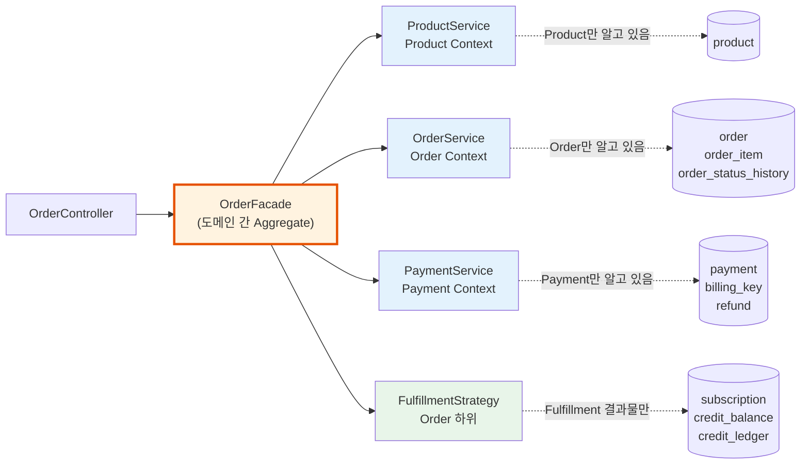
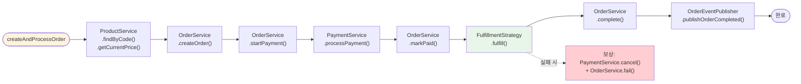
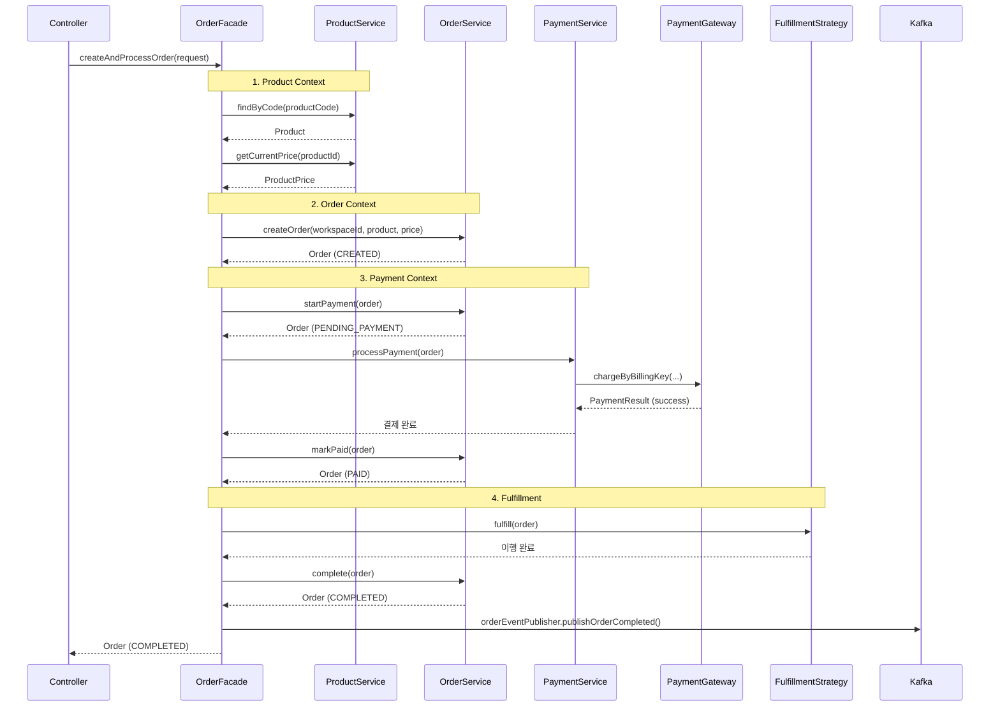

# [Ticket #8c] OrderService + OrderFacade (Bounded Context 분리)

## 개요
- TDD 참조: tdd.md 섹션 4.2, 4.4, 8.2
- 선행 티켓: #8a (Order 엔티티), #8b (FulfillmentStrategy 인터페이스), #9c (PaymentService)
- 크기: M

## 핵심 설계 원칙

**각 Service는 자기 Bounded Context만 담당한다. 도메인 간 협력은 Facade가 한다.**



### 책임 분리

| 레이어 | 역할 | 의존 |
|--------|------|------|
| **OrderController** | HTTP 처리만 | OrderFacade만 |
| **OrderFacade** | 도메인 간 오케스트레이션 (Product → Order → Payment → Fulfillment) | ProductService, OrderService, PaymentService, FulfillmentStrategy |
| **ProductService** | Product 조회, 가격 조회 | ProductRepository, ProductPriceRepository |
| **OrderService** | Order CRUD, 상태 전이, 이력 기록 | OrderRepository, OrderStatusHistoryRepository |
| **PaymentService** | 결제 처리, 환불 | PaymentRepository, PaymentGateway, BillingKeyRepository |
| **FulfillmentStrategy** | 상품 유형별 이행 | SubscriptionRepository, CreditBalanceRepository, CreditLedgerRepository |

---

## 작업 내용

### OrderService (Order Context만 담당)

```kotlin
/**
 * OrderService는 Order Bounded Context만 담당한다.
 * Product, Payment, Fulfillment를 알지 못한다.
 */
@Service
class OrderService(
    private val orderRepository: OrderRepository,
    private val orderStatusHistoryRepository: OrderStatusHistoryRepository,
) {
    /**
     * 주문 생성 (Order + OrderItem).
     * Product 조회는 Facade가 해서 넘겨준다.
     */
    @Transactional
    fun createOrder(
        workspaceId: Int,
        orderType: OrderType,
        product: Product,      // Facade가 ProductService에서 조회해서 전달
        price: ProductPrice,   // Facade가 ProductService에서 조회해서 전달
        quantity: Int = 1,
        idempotencyKey: String? = null,
        createdBy: String? = null,
    ): Order {
        idempotencyKey?.let { key ->
            orderRepository.findByIdempotencyKey(key)?.let { return it }
        }

        val order = Order(
            workspaceId = workspaceId,
            orderType = orderType,
            idempotencyKey = idempotencyKey,
            createdBy = createdBy,
        )
        order.addItem(OrderItem.createSnapshot(order, product, price, quantity))

        val saved = orderRepository.save(order)
        recordHistory(saved, fromStatus = null, changedBy = createdBy)
        return saved
    }

    /** 결제 시작 상태 전이 */
    @Transactional
    fun startPayment(order: Order): Order {
        val prev = order.status
        order.startPayment()  // 엔티티 내부 캡슐화
        recordHistory(order, prev)
        return orderRepository.save(order)
    }

    /** 결제 완료 상태 전이 */
    @Transactional
    fun markPaid(order: Order): Order {
        val prev = order.status
        order.markPaid()
        recordHistory(order, prev)
        return orderRepository.save(order)
    }

    /** 주문 완료 */
    @Transactional
    fun complete(order: Order): Order {
        val prev = order.status
        order.complete()
        recordHistory(order, prev)
        return orderRepository.save(order)
    }

    /** 주문 실패 (보상 트랜잭션) */
    @Transactional
    fun fail(order: Order, reason: String): Order {
        val prev = order.status
        order.fail()
        recordHistory(order, prev, reason = reason)
        return orderRepository.save(order)
    }

    /** 주문 취소 */
    @Transactional
    fun cancel(orderId: Long, reason: String? = null): Order {
        val order = findById(orderId)
        val prev = order.status
        order.cancel(reason)
        recordHistory(order, prev, reason = reason)
        return orderRepository.save(order)
    }

    fun findById(orderId: Long): Order =
        orderRepository.findById(orderId).orElseThrow { OrderNotFoundException(orderId) }

    fun findByOrderNumber(orderNumber: String): Order =
        orderRepository.findByOrderNumber(orderNumber) ?: throw OrderNotFoundException(orderNumber)

    private fun recordHistory(order: Order, fromStatus: OrderStatus?, reason: String? = null, changedBy: String? = null) {
        orderStatusHistoryRepository.save(order.createStatusHistory(fromStatus, reason, changedBy))
    }
}
```

### OrderFacade (도메인 간 Aggregate — 유일한 오케스트레이터)



```kotlin
/**
 * OrderFacade가 유일한 오케스트레이터.
 * 각 Service는 자기 Bounded Context만 알고, 도메인 간 협력은 여기서 한다.
 *
 * Controller → OrderFacade → ProductService / OrderService / PaymentService / FulfillmentStrategy
 */
@Service
class OrderFacade(
    private val productService: ProductService,
    private val orderService: OrderService,
    private val paymentService: PaymentService,
    private val fulfillmentResolver: FulfillmentStrategyResolver,
    private val orderEventPublisher: OrderEventPublisher,
) {
    private val log = LoggerFactory.getLogger(javaClass)

    /** 주문 생성 + 결제 + Fulfillment 전체 파이프라인 */
    @Transactional
    fun createAndProcessOrder(request: CreateOrderRequest): Order {
        // 1. Product Context: 상품/가격 조회
        val product = productService.findByCode(request.productCode)
        val price = productService.getCurrentPrice(product.id, request.billingIntervalMonths)

        // 2. Order Context: 주문 생성
        val order = orderService.createOrder(
            workspaceId = request.workspaceId,
            orderType = OrderType.valueOf(request.orderType),
            product = product,
            price = price,
            idempotencyKey = request.idempotencyKey,
            createdBy = request.createdBy,
        )

        // 3. 결제 + Fulfillment
        return processOrder(order)
    }

    /** 결제 → Fulfillment → 완료 (또는 보상) */
    @Transactional
    fun processOrder(order: Order): Order {
        // Payment Context: 결제
        orderService.startPayment(order)
        paymentService.processPayment(order)
        orderService.markPaid(order)

        // Fulfillment: 상품 유형별 이행
        val strategy = fulfillmentResolver.resolve(order.resolveProductType())
        try {
            strategy.fulfill(order)
            orderService.complete(order)
        } catch (e: Exception) {
            log.error("Fulfillment 실패, 보상 트랜잭션: ${order.orderNumber}", e)
            compensate(order, "fulfillment 실패: ${e.message}")
            throw e
        }

        orderEventPublisher.publishOrderCompleted(order)
        return order
    }

    /** 주문 취소 */
    fun cancelOrder(orderNumber: String, reason: String?): Order {
        val order = orderService.findByOrderNumber(orderNumber)
        return orderService.cancel(order.id, reason)
    }

    /** 현재 구독 조회 (Order Context 내 Fulfillment 결과물) */
    fun getCurrentSubscription(workspaceId: Int): Subscription? {
        return orderService.findActiveSubscription(workspaceId)
    }

    /** 크레딧 잔액 조회 (Order Context 내 Fulfillment 결과물) */
    fun getCreditBalance(workspaceId: Int, creditType: String): Int {
        return orderService.getCreditBalance(workspaceId, creditType)
    }

    private fun compensate(order: Order, reason: String) {
        try {
            paymentService.cancelPayment(order, reason)
        } catch (e: Exception) {
            log.error("보상 결제 취소 실패: ${order.orderNumber}", e)
        }
        orderService.fail(order, reason)
    }
}
```

### 상세 시퀀스: 전체 파이프라인



---

### 그리팅 실제 적용 예시

#### AS-IS (현재)
```
PaymentController.upgradePlan()
  → OrderFacade.createUpgradePlanOrder()  // Facade인데 실제로는 OrderServiceImpl이 모든 것을 함
    → OrderServiceImpl: BillingService.charge() + PlanServiceImpl.upgradePlan() + MongoDB 저장 + 이벤트 발행
    (OrderService가 결제, 플랜 관리, 이력 저장을 전부 담당 → God Service)
```

#### TO-BE (리팩토링 후)
```
OrderController.createOrder()
  → OrderFacade.createAndProcessOrder()  // 도메인 간 오케스트레이션
    → ProductService.findByCode()          // Product Context만
    → OrderService.createOrder()           // Order Context만
    → OrderService.startPayment()          // Order 상태 전이만
    → PaymentService.processPayment()      // Payment Context만
    → OrderService.markPaid()              // Order 상태 전이만
    → FulfillmentStrategy.fulfill()        // Fulfillment만
    → OrderService.complete()              // Order 상태 전이만
    → OrderEventPublisher.publish()        // 이벤트만
    (각 Service가 자기 Bounded Context만 담당, Facade가 협력)
```

#### 향후 확장 예시
- AI 크레딧 충전: Facade 코드 변경 없음. `ProductService.findByCode("AI_CREDIT_100")` → 동일 파이프라인
- 새로운 PG 추가: PaymentService 내부 구현만 변경, OrderService/Facade는 무관

---

### 수정 파일 목록

| 레포 | 파일 경로 | 변경 유형 |
|------|----------|----------|
| greeting_payment-server | application/OrderService.kt | 신규 (Order Context만) |
| greeting_payment-server | application/OrderFacade.kt | 신규 (도메인 간 Aggregate) |
| greeting_payment-server | application/dto/CreateOrderRequest.kt | 신규 |
| greeting_payment-server | domain/order/OrderNotFoundException.kt | 신규 |

## 테스트 케이스

### 정상 케이스
| ID | 테스트명 | Given | When | Then |
|----|---------|-------|------|------|
| TC-01 | OrderService.createOrder | Product, Price 전달 | createOrder() | Order(CREATED) + OrderItem(스냅샷) + 이력 1건 |
| TC-02 | OrderService.startPayment | Order(CREATED) | startPayment() | Order(PENDING_PAYMENT) + 이력 기록 |
| TC-03 | OrderService.markPaid | Order(PENDING_PAYMENT) | markPaid() | Order(PAID) + 이력 기록 |
| TC-04 | OrderService.complete | Order(PAID) | complete() | Order(COMPLETED) + 이력 기록 |
| TC-05 | OrderService.cancel | Order(CREATED) | cancel("사유") | Order(CANCELLED) + 이력 기록 |
| TC-06 | Facade.createAndProcessOrder | 정상 요청 | createAndProcessOrder() | Product조회→주문생성→결제→Fulfillment→완료→이벤트 |
| TC-07 | Facade.compensate | Fulfillment 실패 | processOrder() | PaymentService.cancel + OrderService.fail |

### 예외/엣지 케이스
| ID | 테스트명 | Given | When | Then |
|----|---------|-------|------|------|
| TC-E01 | OrderService가 ProductService를 모름 | OrderService DI | 의존성 확인 | ProductService 미주입 |
| TC-E02 | OrderService가 PaymentService를 모름 | OrderService DI | 의존성 확인 | PaymentService 미주입 |
| TC-E03 | 잘못된 상태 전이 | Order(COMPLETED) | startPayment() | IllegalStateException |
| TC-E04 | 멱등성 키 중복 | 동일 idempotencyKey | createOrder() 2회 | 기존 Order 반환 |

## 기대 결과 (AC)
- [ ] OrderService는 OrderRepository, OrderStatusHistoryRepository만 의존 (Product/Payment 의존 없음)
- [ ] OrderFacade가 ProductService, OrderService, PaymentService, FulfillmentStrategy를 오케스트레이션
- [ ] Controller는 OrderFacade만 의존
- [ ] 각 Service는 자기 Bounded Context의 Repository만 접근
- [ ] 보상 트랜잭션이 Facade에서 처리됨
- [ ] 상태 전이와 이력 기록이 OrderService 내에서 일관되게 처리됨
