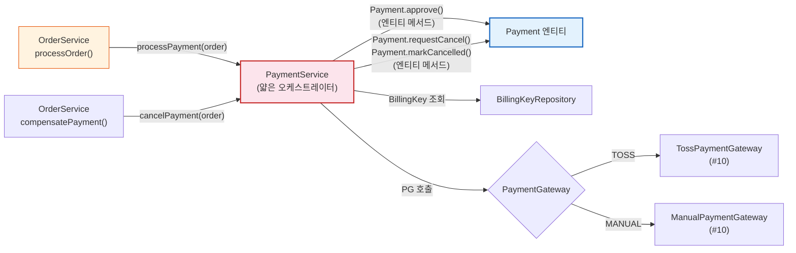
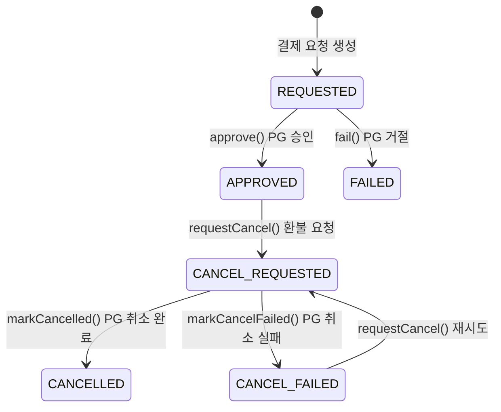
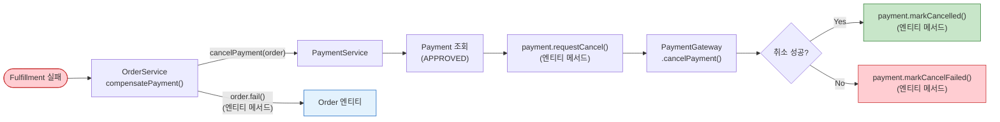

# [Ticket #9] Payment 도메인 + PG 추상화

## 개요
- TDD 참조: tdd.md 섹션 3.4, 4.1.3, 4.3, 4.4, 4.5
- 선행 티켓: #2 (JPA 엔티티), #8 (Order 도메인)
- 크기: L

## 배경

PaymentService는 OrderService에서 호출되는 **결제 처리 전용 서비스**이다. PG(Payment Gateway)와의 통신을 추상화하고, 결제 상태 관리 및 보상 트랜잭션(cancelPayment)을 담당한다.

- PaymentGateway 인터페이스를 정의하고, 구현체(Toss/Manual)는 #10에서 작성
- PaymentService는 OrderService에서만 호출 -- 직접 외부 노출 없음

> **설계 원칙 (CRITICAL)**:
> 1. `PaymentStatus` enum이 상태 전이 규칙을 소유한다 (`validateTransitionTo()`).
> 2. `Payment` 엔티티가 `approve()`, `fail()`, `requestCancel()`, `markCancelled()`, `markCancelFailed()` 메서드를 캡슐화한다.
> 3. `PaymentService`는 얇은 오케스트레이터 -- Payment 엔티티 메서드 호출 + PG 호출 + 저장만 담당한다.
> 4. PaymentService가 Order의 상태를 직접 변경하지 않는다 -- Order 상태 변경은 OrderService 책임.
> 5. L 사이즈 티켓이므로 향후 메서드 단위로 세분화 가능.

---

## 작업 내용

### PaymentService 위치 (OrderService 호출 흐름)



### Payment 상태머신



### PaymentStatus enum (상태 전이 규칙을 enum이 소유)

```kotlin
package com.greeting.payment.domain.payment

/**
 * PaymentStatus enum이 상태 전이 규칙을 소유한다.
 * Payment 엔티티의 상태 전이 메서드 내부에서 validateTransitionTo()를 호출.
 */
enum class PaymentStatus {
    REQUESTED,
    APPROVED,
    FAILED,
    CANCEL_REQUESTED,
    CANCELLED,
    CANCEL_FAILED;

    companion object {
        private val ALLOWED_TRANSITIONS: Map<PaymentStatus, Set<PaymentStatus>> = mapOf(
            REQUESTED to setOf(APPROVED, FAILED),
            APPROVED to setOf(CANCEL_REQUESTED),
            FAILED to emptySet(),
            CANCEL_REQUESTED to setOf(CANCELLED, CANCEL_FAILED),
            CANCELLED to emptySet(),
            CANCEL_FAILED to setOf(CANCEL_REQUESTED),  // 재시도 허용
        )
    }

    fun canTransitionTo(next: PaymentStatus): Boolean {
        return next in (ALLOWED_TRANSITIONS[this] ?: emptySet())
    }

    fun validateTransitionTo(next: PaymentStatus) {
        require(canTransitionTo(next)) {
            "결제 상태 전이 불가: $this -> $next"
        }
    }

    val isTerminal: Boolean
        get() = this == APPROVED || this == FAILED || this == CANCELLED

    val isCancellable: Boolean
        get() = canTransitionTo(CANCEL_REQUESTED)
}
```

### PaymentMethod enum

```kotlin
package com.greeting.payment.domain.payment

enum class PaymentMethod {
    BILLING_KEY,  // 빌링키 자동결제
    CARD,         // 카드 직접결제 (confirmPayment)
    TRANSFER,     // 계좌이체
    MANUAL,       // 수동 처리 (금액 0, PG 호출 없음)
}
```

### PaymentGateway 인터페이스

```kotlin
package com.greeting.payment.domain.payment

/**
 * PG 추상화 인터페이스.
 * 구현체: TossPaymentGateway (#10), ManualPaymentGateway (#10)
 */
interface PaymentGateway {

    val gatewayName: String  // "TOSS", "MANUAL"

    fun chargeByBillingKey(
        billingKey: String,
        orderId: String,
        amount: Int,
        orderName: String,
    ): PaymentResult

    fun confirmPayment(
        paymentKey: String,
        orderId: String,
        amount: Int,
    ): PaymentResult

    fun cancelPayment(
        paymentKey: String,
        cancelAmount: Int,
        cancelReason: String,
    ): PaymentResult
}
```

### PaymentResult VO

```kotlin
package com.greeting.payment.domain.payment

import java.time.LocalDateTime

data class PaymentResult(
    val success: Boolean,
    val paymentKey: String?,
    val receiptUrl: String?,
    val approvedAt: LocalDateTime?,
    val failureCode: String?,
    val failureMessage: String?,
    val rawResponse: String?,
)
```

### Payment 엔티티 (비즈니스 로직을 엔티티 내부에 캡슐화)

```kotlin
package com.greeting.payment.domain.payment

import jakarta.persistence.*
import java.time.LocalDateTime

@Entity
@Table(name = "payment")
@SQLRestriction("deleted_at IS NULL")
@SQLDelete(sql = "UPDATE payment SET deleted_at = NOW(6) WHERE id = ?")
class Payment(

    @Id
    @GeneratedValue(strategy = GenerationType.IDENTITY)
    val id: Long = 0,

    @Column(name = "order_id", nullable = false)
    val orderId: Long,

    @Column(name = "payment_key")
    var paymentKey: String? = null,

    @Column(name = "payment_method", nullable = false)
    val paymentMethod: String,

    @Column(name = "gateway", nullable = false)
    val gateway: String,

    @Column(name = "status", nullable = false)
    var status: PaymentStatus = PaymentStatus.REQUESTED,

    @Column(name = "amount", nullable = false)
    val amount: Int,

    @Column(name = "receipt_url")
    var receiptUrl: String? = null,

    @Column(name = "failure_code")
    var failureCode: String? = null,

    @Column(name = "failure_message")
    var failureMessage: String? = null,

    @Column(name = "approved_at")
    var approvedAt: LocalDateTime? = null,

    @Column(name = "cancelled_at")
    var cancelledAt: LocalDateTime? = null,

    @Column(name = "idempotency_key", unique = true)
    val idempotencyKey: String? = null,

    @Column(name = "created_at", nullable = false, updatable = false)
    val createdAt: LocalDateTime = LocalDateTime.now(),

    @Column(name = "updated_at", nullable = false)
    var updatedAt: LocalDateTime = LocalDateTime.now(),

    @Column(name = "deleted_at")
    var deletedAt: LocalDateTime? = null,
) {

    // =========================================================================
    // 상태 전이 메서드 — PaymentStatus.validateTransitionTo()가 규칙 검증.
    // 엔티티가 PG 응답 데이터를 자신의 필드에 반영하는 것까지 캡슐화.
    // Service는 이 메서드를 호출만 한다.
    // =========================================================================

    /**
     * PG 승인 성공 시: REQUESTED → APPROVED
     * PaymentResult의 paymentKey, receiptUrl, approvedAt을 자신에게 반영.
     */
    fun approve(result: PaymentResult) {
        status.validateTransitionTo(PaymentStatus.APPROVED)
        this.status = PaymentStatus.APPROVED
        this.paymentKey = result.paymentKey
        this.receiptUrl = result.receiptUrl
        this.approvedAt = result.approvedAt ?: LocalDateTime.now()
        this.updatedAt = LocalDateTime.now()
    }

    /**
     * PG 승인 실패 시: REQUESTED → FAILED
     * 실패 코드/메시지를 자신에게 반영.
     */
    fun fail(result: PaymentResult) {
        status.validateTransitionTo(PaymentStatus.FAILED)
        this.status = PaymentStatus.FAILED
        this.failureCode = result.failureCode
        this.failureMessage = result.failureMessage
        this.updatedAt = LocalDateTime.now()
    }

    /**
     * 취소 요청: APPROVED → CANCEL_REQUESTED
     */
    fun requestCancel() {
        status.validateTransitionTo(PaymentStatus.CANCEL_REQUESTED)
        this.status = PaymentStatus.CANCEL_REQUESTED
        this.updatedAt = LocalDateTime.now()
    }

    /**
     * 취소 완료: CANCEL_REQUESTED → CANCELLED
     */
    fun markCancelled() {
        status.validateTransitionTo(PaymentStatus.CANCELLED)
        this.status = PaymentStatus.CANCELLED
        this.cancelledAt = LocalDateTime.now()
        this.updatedAt = LocalDateTime.now()
    }

    /**
     * 취소 실패: CANCEL_REQUESTED → CANCEL_FAILED
     */
    fun markCancelFailed() {
        status.validateTransitionTo(PaymentStatus.CANCEL_FAILED)
        this.status = PaymentStatus.CANCEL_FAILED
        this.updatedAt = LocalDateTime.now()
    }

    // =========================================================================
    // 조회 헬퍼
    // =========================================================================

    fun requirePaymentKey(): String {
        return paymentKey ?: throw IllegalStateException("paymentKey가 없습니다: paymentId=$id")
    }

    /**
     * 상태 이력 생성용
     */
    fun createStatusHistory(
        fromStatus: PaymentStatus?,
        pgResponse: String? = null,
    ): PaymentStatusHistory {
        return PaymentStatusHistory(
            paymentId = this.id,
            fromStatus = fromStatus?.name,
            toStatus = this.status.name,
            pgResponse = pgResponse,
        )
    }
}
```

### PaymentGatewayResolver

```kotlin
package com.greeting.payment.domain.payment

import org.springframework.stereotype.Component

@Component
class PaymentGatewayResolver(
    private val gateways: List<PaymentGateway>,
) {

    private val gatewayMap: Map<String, PaymentGateway> by lazy {
        gateways.associateBy { it.gatewayName }
    }

    fun resolve(gatewayName: String): PaymentGateway {
        return gatewayMap[gatewayName]
            ?: throw IllegalArgumentException("지원하지 않는 PG: $gatewayName")
    }
}
```

### PaymentService (얇은 오케스트레이터 -- 엔티티 메서드 호출 + PG 호출 + 저장만)

```kotlin
package com.greeting.payment.application

import com.greeting.payment.domain.order.Order
import com.greeting.payment.domain.payment.*
import com.greeting.payment.infrastructure.repository.BillingKeyRepository
import com.greeting.payment.infrastructure.repository.PaymentRepository
import com.greeting.payment.infrastructure.repository.PaymentStatusHistoryRepository
import org.slf4j.LoggerFactory
import org.springframework.stereotype.Service
import org.springframework.transaction.annotation.Transactional

/**
 * PaymentService는 얇은 오케스트레이터.
 *
 * - 상태 전이: Payment 엔티티 메서드가 캡슐화 (approve, fail, requestCancel, markCancelled)
 * - 전이 규칙: PaymentStatus enum의 validateTransitionTo() 가 소유
 * - Service 역할: Payment 생성 → PG 호출 → 엔티티 메서드 호출 → 저장
 * - 주의: Order 상태 변경은 OrderService 책임. PaymentService는 Order를 읽기만 한다.
 *
 * L 사이즈 티켓이므로 향후 메서드 단위로 세분화 가능.
 */
@Service
class PaymentService(
    private val paymentRepository: PaymentRepository,
    private val billingKeyRepository: BillingKeyRepository,
    private val paymentStatusHistoryRepository: PaymentStatusHistoryRepository,
    private val gatewayResolver: PaymentGatewayResolver,
) {
    private val log = LoggerFactory.getLogger(javaClass)

    @Transactional
    fun processPayment(order: Order) {
        val isManual = order.totalAmount == 0
        val gatewayName = if (isManual) "MANUAL" else "TOSS"
        val paymentMethod = if (isManual) PaymentMethod.MANUAL.name else PaymentMethod.BILLING_KEY.name

        // 1. Payment 생성 (REQUESTED)
        val payment = Payment(
            orderId = order.id,
            paymentMethod = paymentMethod,
            gateway = gatewayName,
            amount = order.totalAmount,
            idempotencyKey = "PAY-${order.orderNumber}",
        )
        paymentRepository.save(payment)
        paymentStatusHistoryRepository.save(payment.createStatusHistory(fromStatus = null))

        // 2. PG 호출
        val gateway = gatewayResolver.resolve(gatewayName)
        val result: PaymentResult = if (isManual) {
            gateway.chargeByBillingKey("", order.orderNumber, 0, "무료 주문")
        } else {
            val billingKey = billingKeyRepository
                .findByWorkspaceIdAndIsPrimaryTrueAndDeletedAtIsNull(order.workspaceId)
                ?: throw BillingKeyNotFoundException("활성 빌링키가 없습니다: workspaceId=${order.workspaceId}")
            gateway.chargeByBillingKey(
                billingKey = billingKey.decryptedBillingKey(),
                orderId = order.orderNumber,
                amount = order.totalAmount,
                orderName = order.items.first().productName,
            )
        }

        // 3. 결과 반영 (엔티티 메서드 호출 — Service는 호출만)
        if (result.success) {
            payment.approve(result)  // 엔티티 내부: 상태 전이 검증 + paymentKey/receiptUrl 반영
            paymentStatusHistoryRepository.save(
                payment.createStatusHistory(PaymentStatus.REQUESTED, result.rawResponse)
            )
            log.info("결제 승인: orderNumber=${order.orderNumber}, paymentKey=${result.paymentKey}")
        } else {
            payment.fail(result)  // 엔티티 내부: 상태 전이 검증 + failureCode/message 반영
            paymentStatusHistoryRepository.save(
                payment.createStatusHistory(PaymentStatus.REQUESTED, result.rawResponse)
            )
            paymentRepository.save(payment)
            throw PaymentFailedException(
                "결제 실패: code=${result.failureCode}, message=${result.failureMessage}"
            )
        }

        paymentRepository.save(payment)
    }

    @Transactional
    fun cancelPayment(order: Order, reason: String) {
        val payment = paymentRepository.findByOrderIdAndStatus(order.id, PaymentStatus.APPROVED.name)
            ?: throw PaymentNotFoundException("승인된 결제를 찾을 수 없습니다: orderId=${order.id}")

        // 취소 요청 (엔티티 메서드)
        payment.requestCancel()
        paymentStatusHistoryRepository.save(
            payment.createStatusHistory(PaymentStatus.APPROVED)
        )

        // PG 취소 호출
        val gateway = gatewayResolver.resolve(payment.gateway)
        val result = gateway.cancelPayment(
            paymentKey = payment.requirePaymentKey(),  // 엔티티 내부 검증
            cancelAmount = payment.amount,
            cancelReason = reason,
        )

        // 결과 반영 (엔티티 메서드)
        if (result.success) {
            payment.markCancelled()
            paymentStatusHistoryRepository.save(
                payment.createStatusHistory(PaymentStatus.CANCEL_REQUESTED, result.rawResponse)
            )
            log.info("결제 취소 완료: orderNumber=${order.orderNumber}")
        } else {
            payment.markCancelFailed()
            paymentStatusHistoryRepository.save(
                payment.createStatusHistory(PaymentStatus.CANCEL_REQUESTED, result.rawResponse)
            )
            paymentRepository.save(payment)
            throw PaymentCancelException(
                "결제 취소 실패: code=${result.failureCode}, message=${result.failureMessage}"
            )
        }

        paymentRepository.save(payment)
    }
}

class PaymentFailedException(message: String) : RuntimeException(message)
class PaymentNotFoundException(message: String) : RuntimeException(message)
class PaymentCancelException(message: String) : RuntimeException(message)
class BillingKeyNotFoundException(message: String) : RuntimeException(message)
```

### 보상 트랜잭션 흐름



### 수정 파일 목록

| 파일 | 변경 유형 | 설명 |
|------|----------|------|
| `domain/payment/PaymentStatus.kt` | 신규 | 상태 enum: `validateTransitionTo()`, `canTransitionTo()`, `isTerminal`, `isCancellable` |
| `domain/payment/PaymentMethod.kt` | 신규 | 결제 수단 enum |
| `domain/payment/PaymentGateway.kt` | 신규 | PG 추상화 인터페이스 |
| `domain/payment/PaymentResult.kt` | 신규 | PG 응답 VO |
| `domain/payment/PaymentGatewayResolver.kt` | 신규 | 게이트웨이 이름 → 구현체 매핑 |
| `domain/payment/Payment.kt` | 수정 | `approve()`, `fail()`, `requestCancel()`, `markCancelled()`, `markCancelFailed()`, `requirePaymentKey()`, `createStatusHistory()` |
| `domain/payment/PaymentStatusHistory.kt` | 기존 (#2) | 변경 없음 |
| `application/PaymentService.kt` | 신규 | 얇은 오케스트레이터: 엔티티 메서드 호출 + PG 호출 + 저장 |
| `infrastructure/repository/PaymentRepository.kt` | 수정 | findByOrderIdAndStatus 추가 |
| `infrastructure/repository/PaymentStatusHistoryRepository.kt` | 수정 | 사용 확인 |

---

## 테스트 케이스

### 정상 케이스

| # | 테스트 | 입력 | 기대 결과 |
|---|--------|------|----------|
| 1 | `PaymentStatus.validateTransitionTo` - REQUESTED → APPROVED | | 성공 |
| 2 | `PaymentStatus.isCancellable` - APPROVED | | true |
| 3 | `Payment.approve` | PaymentResult(success=true) | status=APPROVED, paymentKey/receiptUrl 반영 |
| 4 | `Payment.fail` | PaymentResult(success=false) | status=FAILED, failureCode/message 반영 |
| 5 | `Payment.requestCancel` + `markCancelled` | APPROVED Payment | APPROVED → CANCEL_REQUESTED → CANCELLED |
| 6 | `Payment.requirePaymentKey` | paymentKey 존재 | paymentKey 반환 |
| 7 | `Payment.createStatusHistory` | fromStatus=REQUESTED | PaymentStatusHistory 생성 |
| 8 | `processPayment` - 빌링키 결제 성공 | order(amount=33000) | Payment APPROVED |
| 9 | `processPayment` - 무료 주문 (Manual) | order(amount=0) | ManualGateway → Payment APPROVED |
| 10 | `cancelPayment` - 정상 취소 | APPROVED Payment | Payment CANCELLED |

### 예외/엣지 케이스

| # | 테스트 | 입력 | 기대 결과 |
|---|--------|------|----------|
| 1 | `PaymentStatus.validateTransitionTo` - FAILED → APPROVED | | IllegalArgumentException |
| 2 | `PaymentStatus.validateTransitionTo` - CANCELLED → CANCEL_REQUESTED | | IllegalArgumentException |
| 3 | `Payment.requirePaymentKey` - null | paymentKey=null | IllegalStateException |
| 4 | `processPayment` - PG 거절 | PG returns success=false | Payment.fail() → PaymentFailedException |
| 5 | `processPayment` - 빌링키 없음 | workspace에 billingKey 없음 | BillingKeyNotFoundException |
| 6 | `cancelPayment` - APPROVED Payment 없음 | | PaymentNotFoundException |
| 7 | `cancelPayment` - PG 취소 실패 | PG cancel returns success=false | Payment.markCancelFailed() → PaymentCancelException |
| 8 | 지원하지 않는 PG | gateway="UNKNOWN" | IllegalArgumentException |

---

## 그리팅 실제 적용 예시

### AS-IS (현재)
- **플랜 결제**: `PlanServiceImpl.upgradePlan()` 내부에서 직접 Toss `chargeByBillingKey()` 호출 → `chargeResult`로 성공/실패 분기 → `PaymentLogsOnWorkspace`(MongoDB)에 결제 이력 저장. 결제 로직과 비즈니스 로직이 혼재
- **플랜 환불**: `PlanServiceImpl.cancelPlan()` → 미사용일 프로레이션 계산 → Toss `cancelPayment()` 직접 호출 → MongoDB에 `cancelLog(isBuy=false, cancelPrice=환불금)` 저장. 환불 실패 시 보상 트랜잭션 없음
- **백오피스 무료 부여**: `paymentKey=""`, PG 미경유. 일반 결제와 완전히 다른 코드 경로
- **VAT 계산**: `((price - usingCredit) * 1.1).toInt()` -- 서비스 코드에 하드코딩
- **결제 이력**: `payment_transaction`(MySQL) + `PaymentLogsOnWorkspace`(MongoDB) 이원화

### TO-BE (리팩토링 후)
- **모든 결제가 PaymentService 하나를 경유**: `PaymentService.processPayment(order)` → 금액=0이면 ManualGateway, 그 외 TossGateway 자동 선택
- **보상 트랜잭션 자동화**: Fulfillment 실패 시 `PaymentService.cancelPayment()` 자동 호출 → `payment.requestCancel()` → `payment.markCancelled()` (엔티티 메서드)
- **결제 이력 통합**: `payment` 테이블 + `payment_status_history` 테이블 (MySQL 단일 DB). PG 원본 응답도 `payment.createStatusHistory()` (엔티티 메서드)로 기록
- **백오피스 무료 부여도 동일 경로**: ManualPaymentGateway → `payment.approve()` (엔티티 메서드)

### 향후 확장 예시 (코드 변경 없이 가능)
- **새 PG 추가 (예: KG이니시스)**: `PaymentGateway` 인터페이스 구현체 추가 → `PaymentGatewayResolver`에 자동 등록
- **해외 결제 PG 추가 (예: Stripe)**: 동일 인터페이스, 동일 파이프라인

---

## 기대 결과 (AC)

- [ ] `PaymentStatus` enum이 상태 전이 규칙을 소유하고, `validateTransitionTo()`로 검증 (Service에 전이 로직 없음)
- [ ] `Payment` 엔티티가 `approve()`, `fail()`, `requestCancel()`, `markCancelled()`, `markCancelFailed()` 메서드를 캡슐화 (PG 응답 반영 포함)
- [ ] `Payment.requirePaymentKey()`가 paymentKey null 시 엔티티 내부에서 예외 발생
- [ ] `PaymentService`는 얇은 오케스트레이터 -- 엔티티 메서드 호출 + PG 호출 + 저장만 수행
- [ ] `PaymentService`가 Order 상태를 직접 변경하지 않음 (Order 변경은 OrderService 책임)
- [ ] `PaymentService.processPayment()`가 금액=0이면 ManualGateway, 그 외 TossGateway를 자동 선택
- [ ] 모든 상태 변경마다 `payment.createStatusHistory()` (엔티티 메서드)로 이력 생성
- [ ] `PaymentGatewayResolver`가 gateway 이름으로 올바른 구현체 반환
- [ ] 단위 테스트: 정상 10건 + 예외 8건 = 총 18건 통과
