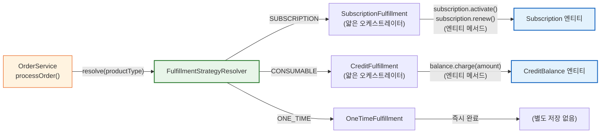
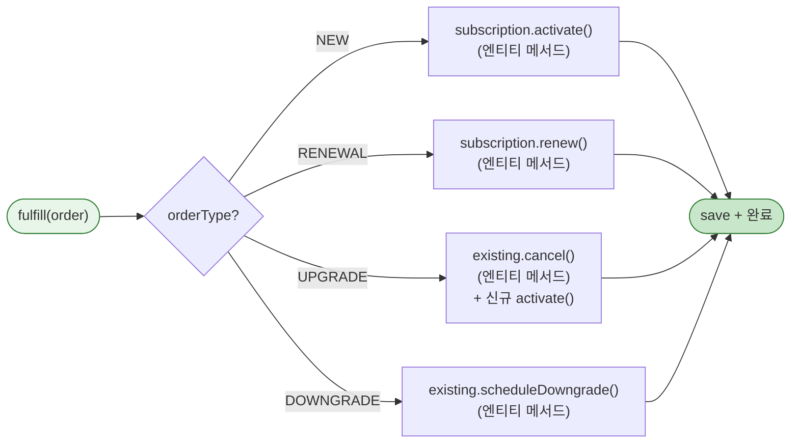
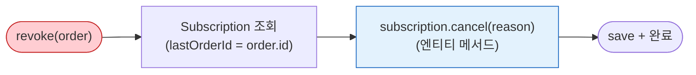
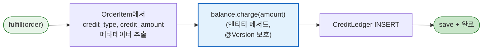
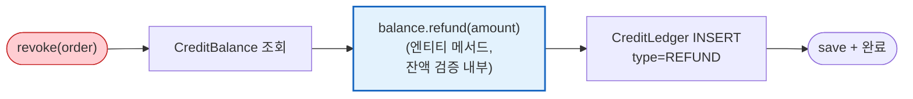
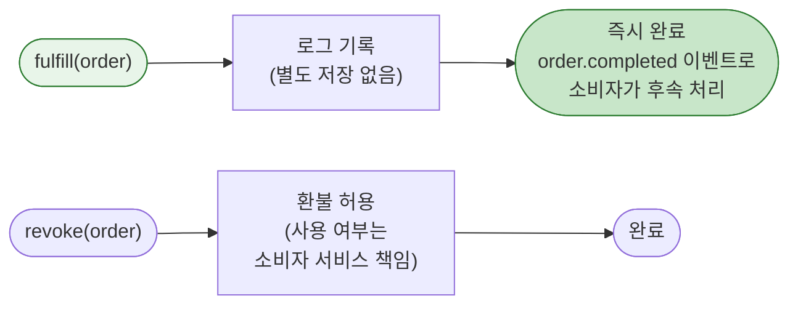

# [Ticket #12] FulfillmentStrategy + 구현체 3종

## 개요
- TDD 참조: tdd.md 섹션 3.5, 4.1.4, 4.1.5, 8.1, 8.2
- 선행 티켓: #8 (FulfillmentStrategy 인터페이스, Order 도메인), #9 (PaymentService)
- 크기: L

## 배경

이 티켓은 **Order-centric 아키텍처의 핵심 차별점**이다. 기존에는 `PlanService`, `MessagePointService`가 독립적으로 동작했지만, 새 구조에서는 **FulfillmentStrategy** 패턴으로 통합된다.

- `SubscriptionService`, `CreditService`는 **존재하지 않는다**
- Subscription, CreditBalance, CreditLedger는 `order/` 패키지 하위의 **Fulfillment 결과물**
- OrderService.processOrder() → FulfillmentStrategyResolver.resolve(productType) → fulfill(order)

> **설계 원칙 (CRITICAL)**:
> 1. `SubscriptionStatus` enum이 상태 전이 규칙을 소유한다 (`validateTransitionTo()`).
> 2. `Subscription` 엔티티가 `activate()`, `renew()`, `cancel()`, `expire()`, `markPastDue()`, `scheduleDowngrade()` 메서드를 캡슐화한다.
> 3. `CreditBalance` 엔티티가 `charge(amount)`, `use(amount)`, `refund(amount)` 메서드를 캡슐화하며 `@Version` 낙관적 락으로 보호된다.
> 4. FulfillmentStrategy 구현체는 얇은 오케스트레이터 -- 엔티티 메서드 호출 + 저장만 담당한다.
> 5. L 사이즈 티켓이므로 향후 메서드 단위로 세분화 가능.

---

## 작업 내용

### FulfillmentStrategy 전체 구조



---

### 1. SubscriptionStatus enum (상태 전이 규칙을 enum이 소유)

```kotlin
package com.greeting.payment.domain.order

/**
 * SubscriptionStatus enum이 상태 전이 규칙을 소유한다.
 * Subscription 엔티티의 상태 전이 메서드 내부에서 validateTransitionTo()를 호출.
 */
enum class SubscriptionStatus {
    ACTIVE,
    PAST_DUE,
    CANCELLED,
    EXPIRED;

    companion object {
        private val ALLOWED_TRANSITIONS: Map<SubscriptionStatus, Set<SubscriptionStatus>> = mapOf(
            ACTIVE to setOf(PAST_DUE, CANCELLED),
            PAST_DUE to setOf(ACTIVE, CANCELLED, EXPIRED),
            CANCELLED to emptySet(),
            EXPIRED to emptySet(),
        )
    }

    fun canTransitionTo(next: SubscriptionStatus): Boolean {
        return next in (ALLOWED_TRANSITIONS[this] ?: emptySet())
    }

    fun validateTransitionTo(next: SubscriptionStatus) {
        require(canTransitionTo(next)) {
            "구독 상태 전이 불가: $this -> $next"
        }
    }

    val isTerminal: Boolean
        get() = this == CANCELLED || this == EXPIRED

    val isRenewable: Boolean
        get() = this == ACTIVE || this == PAST_DUE
}
```

### 2. SubscriptionFulfillment

#### 처리 흐름



#### revoke 흐름 (환불)



#### 코드

```kotlin
package com.greeting.payment.domain.order.fulfillment

import com.greeting.payment.domain.order.Order
import com.greeting.payment.domain.order.OrderType
import com.greeting.payment.domain.order.Subscription
import com.greeting.payment.domain.order.SubscriptionStatus
import com.greeting.payment.domain.product.ProductType
import com.greeting.payment.infrastructure.repository.ProductMetadataRepository
import com.greeting.payment.infrastructure.repository.SubscriptionRepository
import org.slf4j.LoggerFactory
import org.springframework.stereotype.Component
import org.springframework.transaction.annotation.Transactional
import java.time.LocalDateTime

/**
 * SubscriptionFulfillment은 얇은 오케스트레이터.
 *
 * - 상태 전이: Subscription 엔티티의 activate(), renew(), cancel() 등
 * - 전이 규칙: SubscriptionStatus enum의 validateTransitionTo()
 * - Service 역할: 엔티티 메서드 호출 + Repository 저장
 */
@Component
class SubscriptionFulfillment(
    private val subscriptionRepository: SubscriptionRepository,
    private val productMetadataRepository: ProductMetadataRepository,
) : FulfillmentStrategy {

    private val log = LoggerFactory.getLogger(javaClass)

    @Transactional
    override fun fulfill(order: Order) {
        val item = order.items.first()
        require(item.productType == ProductType.SUBSCRIPTION.name) {
            "SubscriptionFulfillment은 SUBSCRIPTION 상품만 처리: actual=${item.productType}"
        }

        when (order.orderType) {
            OrderType.NEW -> createSubscription(order)
            OrderType.RENEWAL -> renewSubscription(order)
            OrderType.UPGRADE -> upgradeSubscription(order)
            OrderType.DOWNGRADE -> downgradeSubscription(order)
            else -> throw FulfillmentException(
                "SubscriptionFulfillment에서 처리할 수 없는 주문 유형: ${order.orderType}"
            )
        }
    }

    @Transactional
    override fun revoke(order: Order) {
        val subscription = subscriptionRepository.findByLastOrderId(order.id)
            ?: throw FulfillmentException("환불 대상 구독을 찾을 수 없습니다: orderId=${order.id}")

        subscription.cancel("환불에 의한 취소: orderNumber=${order.orderNumber}")  // 엔티티 메서드
        subscriptionRepository.save(subscription)

        log.info("구독 환불: subscriptionId=${subscription.id}, orderNumber=${order.orderNumber}")
    }

    private fun createSubscription(order: Order) {
        val item = order.items.first()
        val billingInterval = getBillingIntervalMonths(item.productId)

        // 기존 ACTIVE 구독 취소 (엔티티 메서드)
        subscriptionRepository
            .findByWorkspaceIdAndStatus(order.workspaceId, SubscriptionStatus.ACTIVE.name)
            ?.let { existing ->
                existing.cancel("신규 구독으로 대체: orderNumber=${order.orderNumber}")
                subscriptionRepository.save(existing)
            }

        // 신규 구독 생성 (팩토리 메서드)
        val subscription = Subscription.create(
            workspaceId = order.workspaceId,
            productId = item.productId,
            billingIntervalMonths = billingInterval,
            orderId = order.id,
        )
        subscriptionRepository.save(subscription)

        log.info("신규 구독 생성: workspaceId=${order.workspaceId}, product=${item.productCode}")
    }

    private fun renewSubscription(order: Order) {
        val subscription = subscriptionRepository
            .findByWorkspaceIdAndStatus(order.workspaceId, SubscriptionStatus.ACTIVE.name)
            ?: subscriptionRepository
                .findByWorkspaceIdAndStatus(order.workspaceId, SubscriptionStatus.PAST_DUE.name)
            ?: throw FulfillmentException("갱신 대상 구독을 찾을 수 없습니다: workspaceId=${order.workspaceId}")

        subscription.renew(order.id)  // 엔티티 메서드: period 연장 + retryCount 리셋
        subscriptionRepository.save(subscription)

        log.info("구독 갱신: subscriptionId=${subscription.id}")
    }

    private fun upgradeSubscription(order: Order) {
        subscriptionRepository
            .findByWorkspaceIdAndStatus(order.workspaceId, SubscriptionStatus.ACTIVE.name)
            ?.let { existing ->
                existing.cancel("업그레이드: orderNumber=${order.orderNumber}")  // 엔티티 메서드
                subscriptionRepository.save(existing)
            }
        createSubscription(order)
    }

    private fun downgradeSubscription(order: Order) {
        val existing = subscriptionRepository
            .findByWorkspaceIdAndStatus(order.workspaceId, SubscriptionStatus.ACTIVE.name)
            ?: throw FulfillmentException("다운그레이드 대상 구독이 없습니다: workspaceId=${order.workspaceId}")

        val item = order.items.first()
        existing.scheduleDowngrade(item.productId, order.id)  // 엔티티 메서드
        subscriptionRepository.save(existing)

        log.info("다운그레이드 예약: subscriptionId=${existing.id}, 적용 시점=${existing.currentPeriodEnd}")
    }

    private fun getBillingIntervalMonths(productId: Long): Int {
        return productMetadataRepository
            .findByProductIdAndMetaKey(productId, "billing_interval_months")
            ?.metaValue?.toIntOrNull() ?: 1
    }
}
```

### Subscription 엔티티 (비즈니스 로직을 엔티티 내부에 캡슐화)

```kotlin
package com.greeting.payment.domain.order

import jakarta.persistence.*
import java.time.Duration
import java.time.LocalDateTime

@Entity
@Table(name = "subscription")
@SQLRestriction("deleted_at IS NULL")
@SQLDelete(sql = "UPDATE subscription SET deleted_at = NOW(6) WHERE id = ? AND version = ?")
class Subscription(

    @Id
    @GeneratedValue(strategy = GenerationType.IDENTITY)
    val id: Long = 0,

    @Column(name = "workspace_id", nullable = false)
    val workspaceId: Int,

    @Column(name = "product_id", nullable = false)
    var productId: Long,

    @Column(name = "status", nullable = false)
    @Enumerated(EnumType.STRING)
    var status: SubscriptionStatus = SubscriptionStatus.ACTIVE,

    @Column(name = "current_period_start", nullable = false)
    var currentPeriodStart: LocalDateTime,

    @Column(name = "current_period_end", nullable = false)
    var currentPeriodEnd: LocalDateTime,

    @Column(name = "billing_interval_months", nullable = false)
    val billingIntervalMonths: Int = 1,

    @Column(name = "auto_renew", nullable = false)
    var autoRenew: Boolean = true,

    @Column(name = "retry_count", nullable = false)
    var retryCount: Int = 0,

    @Column(name = "last_order_id")
    var lastOrderId: Long? = null,

    @Column(name = "cancelled_at")
    var cancelledAt: LocalDateTime? = null,

    @Column(name = "cancel_reason")
    var cancelReason: String? = null,

    @Column(name = "scheduled_product_id")
    var scheduledProductId: Long? = null,

    @Column(name = "created_at", nullable = false, updatable = false)
    val createdAt: LocalDateTime = LocalDateTime.now(),

    @Column(name = "updated_at", nullable = false)
    var updatedAt: LocalDateTime = LocalDateTime.now(),

    @Column(name = "deleted_at")
    var deletedAt: LocalDateTime? = null,

    @Version
    @Column(name = "version", nullable = false)
    var version: Int = 0,
) {

    // =========================================================================
    // 팩토리 메서드
    // =========================================================================

    companion object {
        fun create(
            workspaceId: Int,
            productId: Long,
            billingIntervalMonths: Int,
            orderId: Long,
            now: LocalDateTime = LocalDateTime.now(),
        ): Subscription {
            return Subscription(
                workspaceId = workspaceId,
                productId = productId,
                status = SubscriptionStatus.ACTIVE,
                currentPeriodStart = now,
                currentPeriodEnd = now.plusMonths(billingIntervalMonths.toLong()),
                billingIntervalMonths = billingIntervalMonths,
                autoRenew = true,
                retryCount = 0,
                lastOrderId = orderId,
            )
        }
    }

    // =========================================================================
    // 상태 전이 메서드 — SubscriptionStatus.validateTransitionTo()가 규칙 검증.
    // 엔티티가 부수 효과를 캡슐화. Service는 이 메서드를 호출만 한다.
    // =========================================================================

    /**
     * 구독 갱신: 기존 period_end를 start로, +intervalMonths를 end로 설정.
     * ACTIVE 또는 PAST_DUE → ACTIVE 전이.
     * 다운그레이드 예약이 있으면 갱신 시 적용.
     */
    fun renew(orderId: Long) {
        if (status == SubscriptionStatus.PAST_DUE) {
            status.validateTransitionTo(SubscriptionStatus.ACTIVE)
        }
        // ACTIVE → ACTIVE는 상태 "전이"가 아니라 period 연장이므로 validateTransitionTo 불필요

        val newStart = currentPeriodEnd
        val newEnd = newStart.plusMonths(billingIntervalMonths.toLong())

        this.currentPeriodStart = newStart
        this.currentPeriodEnd = newEnd
        this.lastOrderId = orderId
        this.retryCount = 0
        this.status = SubscriptionStatus.ACTIVE
        this.updatedAt = LocalDateTime.now()

        // 다운그레이드 예약 적용
        scheduledProductId?.let { newProductId ->
            this.productId = newProductId
            this.scheduledProductId = null
        }
    }

    /**
     * 구독 취소: ACTIVE 또는 PAST_DUE → CANCELLED
     */
    fun cancel(reason: String) {
        status.validateTransitionTo(SubscriptionStatus.CANCELLED)
        this.status = SubscriptionStatus.CANCELLED
        this.cancelledAt = LocalDateTime.now()
        this.cancelReason = reason
        this.autoRenew = false
        this.updatedAt = LocalDateTime.now()
    }

    /**
     * 결제 실패로 인한 연체 표시: ACTIVE → PAST_DUE
     */
    fun markPastDue() {
        status.validateTransitionTo(SubscriptionStatus.PAST_DUE)
        this.status = SubscriptionStatus.PAST_DUE
        this.retryCount++
        this.updatedAt = LocalDateTime.now()
    }

    /**
     * 만료: PAST_DUE → EXPIRED (재시도 한도 초과)
     */
    fun expire() {
        status.validateTransitionTo(SubscriptionStatus.EXPIRED)
        this.status = SubscriptionStatus.EXPIRED
        this.autoRenew = false
        this.updatedAt = LocalDateTime.now()
    }

    /**
     * 다운그레이드 예약: 다음 갱신 시점에 하위 플랜으로 전환.
     */
    fun scheduleDowngrade(newProductId: Long, orderId: Long) {
        require(status == SubscriptionStatus.ACTIVE) {
            "ACTIVE 구독만 다운그레이드 예약 가능: current=$status"
        }
        this.scheduledProductId = newProductId
        this.lastOrderId = orderId
        this.updatedAt = LocalDateTime.now()
    }

    // =========================================================================
    // 비즈니스 로직
    // =========================================================================

    /**
     * 프로레이션 환불 금액 계산 (미사용일 비율)
     */
    fun calculateProration(originalAmount: Int, now: LocalDateTime = LocalDateTime.now()): Int {
        if (now.isAfter(currentPeriodEnd)) return 0

        val totalDays = Duration.between(currentPeriodStart, currentPeriodEnd).toDays()
        if (totalDays <= 0) return 0

        val remainingDays = Duration.between(now, currentPeriodEnd).toDays()
        return ((originalAmount.toLong() * remainingDays) / totalDays).toInt()
    }

    val isRenewable: Boolean
        get() = status.isRenewable && autoRenew

    val hasScheduledDowngrade: Boolean
        get() = scheduledProductId != null
}
```

---

### 3. CreditFulfillment

#### 처리 흐름



#### revoke 흐름 (환불)



#### 코드

```kotlin
package com.greeting.payment.domain.order.fulfillment

import com.greeting.payment.domain.order.*
import com.greeting.payment.domain.product.ProductType
import com.greeting.payment.infrastructure.repository.CreditBalanceRepository
import com.greeting.payment.infrastructure.repository.CreditLedgerRepository
import com.greeting.payment.infrastructure.repository.ProductMetadataRepository
import org.slf4j.LoggerFactory
import org.springframework.stereotype.Component
import org.springframework.transaction.annotation.Transactional

/**
 * CreditFulfillment은 얇은 오케스트레이터.
 *
 * - 잔액 변경: CreditBalance 엔티티의 charge(), refund() (Optimistic Lock)
 * - 잔액 검증: CreditBalance 엔티티 내부 (refund 시 잔액 부족 검증)
 * - Service 역할: 엔티티 메서드 호출 + Ledger 기록 + 저장
 */
@Component
class CreditFulfillment(
    private val creditBalanceRepository: CreditBalanceRepository,
    private val creditLedgerRepository: CreditLedgerRepository,
    private val productMetadataRepository: ProductMetadataRepository,
) : FulfillmentStrategy {

    private val log = LoggerFactory.getLogger(javaClass)

    @Transactional
    override fun fulfill(order: Order) {
        val item = order.items.first()
        require(item.productType == ProductType.CONSUMABLE.name) {
            "CreditFulfillment은 CONSUMABLE 상품만 처리: actual=${item.productType}"
        }

        val creditType = getCreditType(item.productId)
        val creditAmount = getCreditAmount(item.productId) * item.quantity

        // CreditBalance 조회 또는 생성
        val balance = creditBalanceRepository
            .findByWorkspaceIdAndCreditType(order.workspaceId, creditType)
            ?: CreditBalance(
                workspaceId = order.workspaceId,
                creditType = creditType,
                balance = 0,
            )

        // 엔티티 메서드: charge() — @Version 보호
        balance.charge(creditAmount)
        creditBalanceRepository.save(balance)

        // 원장 기록
        creditLedgerRepository.save(
            CreditLedger(
                workspaceId = order.workspaceId,
                creditType = creditType,
                transactionType = CreditTransactionType.CHARGE.name,
                amount = creditAmount,
                balanceAfter = balance.balance,
                orderId = order.id,
                description = "충전: ${item.productName} x${item.quantity}",
            )
        )

        log.info("크레딧 충전: workspaceId=${order.workspaceId}, type=$creditType, amount=+$creditAmount")
    }

    @Transactional
    override fun revoke(order: Order) {
        val item = order.items.first()
        val creditType = getCreditType(item.productId)
        val creditAmount = getCreditAmount(item.productId) * item.quantity

        val balance = creditBalanceRepository
            .findByWorkspaceIdAndCreditType(order.workspaceId, creditType)
            ?: throw FulfillmentException("환불 대상 크레딧 잔액이 없습니다: workspaceId=${order.workspaceId}")

        // 엔티티 메서드: refund() — 잔액 검증 + @Version 보호
        balance.refund(creditAmount)
        creditBalanceRepository.save(balance)

        // 원장 기록
        creditLedgerRepository.save(
            CreditLedger(
                workspaceId = order.workspaceId,
                creditType = creditType,
                transactionType = CreditTransactionType.REFUND.name,
                amount = -creditAmount,
                balanceAfter = balance.balance,
                orderId = order.id,
                description = "환불: ${item.productName} x${item.quantity}",
            )
        )

        log.info("크레딧 환불: workspaceId=${order.workspaceId}, type=$creditType, amount=-$creditAmount")
    }

    private fun getCreditType(productId: Long): String {
        return productMetadataRepository
            .findByProductIdAndMetaKey(productId, "credit_type")
            ?.metaValue
            ?: throw FulfillmentException("상품에 credit_type 메타데이터가 없습니다: productId=$productId")
    }

    private fun getCreditAmount(productId: Long): Int {
        return productMetadataRepository
            .findByProductIdAndMetaKey(productId, "credit_amount")
            ?.metaValue?.toIntOrNull()
            ?: throw FulfillmentException("상품에 credit_amount 메타데이터가 없습니다: productId=$productId")
    }
}
```

### CreditBalance 엔티티 (비즈니스 로직을 엔티티 내부에 캡슐화)

```kotlin
package com.greeting.payment.domain.order

import jakarta.persistence.*
import java.time.LocalDateTime

@Entity
@Table(name = "credit_balance")
class CreditBalance(

    @Id
    @GeneratedValue(strategy = GenerationType.IDENTITY)
    val id: Long = 0,

    @Column(name = "workspace_id", nullable = false)
    val workspaceId: Int,

    @Column(name = "credit_type", nullable = false)
    val creditType: String,

    @Column(name = "balance", nullable = false)
    var balance: Int = 0,

    @Column(name = "updated_at", nullable = false)
    var updatedAt: LocalDateTime = LocalDateTime.now(),

    @Version
    @Column(name = "version", nullable = false)
    var version: Int = 0,
) {

    // =========================================================================
    // 잔액 변경 메서드 — @Version 낙관적 락으로 동시성 보호.
    // 모든 잔액 변경은 반드시 이 메서드를 통해서만 수행.
    // Service는 이 메서드를 호출만 한다.
    // =========================================================================

    /**
     * 충전: 크레딧 구매, 무상 지급 시 사용.
     * amount는 양수여야 한다.
     */
    fun charge(amount: Int) {
        require(amount > 0) { "충전량은 양수여야 합니다: $amount" }
        this.balance += amount
        this.updatedAt = LocalDateTime.now()
    }

    /**
     * 사용: SMS 발송, AI 평가 등 크레딧 소비 시 사용.
     * 잔액 부족 시 엔티티 내부에서 예외 발생.
     */
    fun use(amount: Int) {
        require(amount > 0) { "사용량은 양수여야 합니다: $amount" }
        require(this.balance >= amount) {
            "크레딧 잔액 부족: balance=${this.balance}, request=$amount, workspaceId=$workspaceId"
        }
        this.balance -= amount
        this.updatedAt = LocalDateTime.now()
    }

    /**
     * 환불: 크레딧 환불 시 사용.
     * 잔액 부족 시 엔티티 내부에서 예외 발생.
     */
    fun refund(amount: Int) {
        require(amount > 0) { "환불량은 양수여야 합니다: $amount" }
        require(this.balance >= amount) {
            "크레딧 환불 불가 (잔액 부족): balance=${this.balance}, refundRequest=$amount, workspaceId=$workspaceId"
        }
        this.balance -= amount
        this.updatedAt = LocalDateTime.now()
    }

    val isEmpty: Boolean
        get() = balance <= 0
}
```

### CreditLedger 엔티티

```kotlin
package com.greeting.payment.domain.order

import jakarta.persistence.*
import java.time.LocalDateTime

@Entity
@Table(name = "credit_ledger")
class CreditLedger(

    @Id
    @GeneratedValue(strategy = GenerationType.IDENTITY)
    val id: Long = 0,

    @Column(name = "workspace_id", nullable = false)
    val workspaceId: Int,

    @Column(name = "credit_type", nullable = false)
    val creditType: String,

    @Column(name = "transaction_type", nullable = false)
    val transactionType: String,

    @Column(name = "amount", nullable = false)
    val amount: Int,

    @Column(name = "balance_after", nullable = false)
    val balanceAfter: Int,

    @Column(name = "order_id")
    val orderId: Long? = null,

    @Column(name = "description")
    val description: String? = null,

    @Column(name = "expired_at")
    val expiredAt: LocalDateTime? = null,

    @Column(name = "created_at", nullable = false, updatable = false)
    val createdAt: LocalDateTime = LocalDateTime.now(),
)
```

### CreditTransactionType / CreditType enum

```kotlin
package com.greeting.payment.domain.order

enum class CreditTransactionType {
    CHARGE,
    USE,
    REFUND,
    EXPIRE,
    GRANT,
}

enum class CreditType {
    SMS,
    AI_EVALUATION,
}
```

---

### 4. OneTimeFulfillment

#### 처리 흐름



#### 코드

```kotlin
package com.greeting.payment.domain.order.fulfillment

import com.greeting.payment.domain.order.Order
import com.greeting.payment.domain.product.ProductType
import org.slf4j.LoggerFactory
import org.springframework.stereotype.Component

@Component
class OneTimeFulfillment : FulfillmentStrategy {

    private val log = LoggerFactory.getLogger(javaClass)

    override fun fulfill(order: Order) {
        val item = order.items.first()
        require(item.productType == ProductType.ONE_TIME.name) {
            "OneTimeFulfillment은 ONE_TIME 상품만 처리: actual=${item.productType}"
        }
        // 즉시 완료 -- order.completed 이벤트로 소비자가 후속 처리
        log.info("일회성 주문 즉시 완료: orderNumber=${order.orderNumber}, product=${item.productCode}")
    }

    override fun revoke(order: Order) {
        log.info("일회성 주문 환불: orderNumber=${order.orderNumber}")
    }
}
```

---

### Repository 추가

```kotlin
// SubscriptionRepository
interface SubscriptionRepository : JpaRepository<Subscription, Long> {
    fun findByWorkspaceIdAndStatus(workspaceId: Int, status: String): Subscription?
    fun findByLastOrderId(orderId: Long): Subscription?
    fun findByCurrentPeriodEndBeforeAndAutoRenewTrueAndStatusIn(
        deadline: java.time.LocalDateTime,
        statuses: List<String>,
    ): List<Subscription>
}

// CreditBalanceRepository
interface CreditBalanceRepository : JpaRepository<CreditBalance, Long> {
    fun findByWorkspaceIdAndCreditType(workspaceId: Int, creditType: String): CreditBalance?
}

// CreditLedgerRepository
interface CreditLedgerRepository : JpaRepository<CreditLedger, Long> {
    fun findByOrderIdAndTransactionType(orderId: Long, transactionType: String): List<CreditLedger>
    fun findByWorkspaceIdAndCreditTypeOrderByCreatedAtDesc(workspaceId: Int, creditType: String): List<CreditLedger>
}

// ProductMetadataRepository
interface ProductMetadataRepository : JpaRepository<ProductMetadata, Long> {
    fun findByProductIdAndMetaKey(productId: Long, metaKey: String): ProductMetadata?
    fun findByProductId(productId: Long): List<ProductMetadata>
}
```

### 수정 파일 목록

| 파일 | 변경 유형 | 설명 |
|------|----------|------|
| `domain/order/SubscriptionStatus.kt` | 신규 | enum: `validateTransitionTo()`, `canTransitionTo()`, `isTerminal`, `isRenewable` |
| `domain/order/Subscription.kt` | 수정 | `Subscription.create()` 팩토리 + `renew()`, `cancel()`, `markPastDue()`, `expire()`, `scheduleDowngrade()`, `calculateProration()` |
| `domain/order/CreditBalance.kt` | 수정 | `charge()`, `use()`, `refund()` (Optimistic Lock 보호) |
| `domain/order/CreditLedger.kt` | 기존 (#2) | 변경 없음 |
| `domain/order/CreditTransactionType.kt` | 신규 | enum |
| `domain/order/CreditType.kt` | 신규 | enum |
| `domain/order/fulfillment/SubscriptionFulfillment.kt` | 신규 | 얇은 오케스트레이터: 엔티티 메서드 호출 + 저장 |
| `domain/order/fulfillment/CreditFulfillment.kt` | 신규 | 얇은 오케스트레이터: 엔티티 메서드 호출 + 원장 기록 + 저장 |
| `domain/order/fulfillment/OneTimeFulfillment.kt` | 신규 | 즉시 완료 |
| `infrastructure/repository/SubscriptionRepository.kt` | 수정 | 쿼리 추가 |
| `infrastructure/repository/CreditBalanceRepository.kt` | 수정 | 쿼리 추가 |
| `infrastructure/repository/CreditLedgerRepository.kt` | 수정 | 쿼리 추가 |
| `infrastructure/repository/ProductMetadataRepository.kt` | 수정 | findByProductIdAndMetaKey 추가 |

---

## 테스트 케이스

### 정상 케이스

| # | 테스트 | 입력 | 기대 결과 |
|---|--------|------|----------|
| 1 | `SubscriptionStatus.validateTransitionTo` - ACTIVE → CANCELLED | | 성공 |
| 2 | `SubscriptionStatus.isRenewable` - ACTIVE | | true |
| 3 | `SubscriptionStatus.isRenewable` - CANCELLED | | false |
| 4 | `Subscription.create` (팩토리 메서드) | | ACTIVE, period 올바르게 설정 |
| 5 | `Subscription.renew` | orderId=2 | period 연장, retryCount=0, ACTIVE |
| 6 | `Subscription.renew` - 다운그레이드 적용 | scheduledProductId 존재 | productId 변경, scheduledProductId null |
| 7 | `Subscription.cancel` | reason="환불" | CANCELLED, cancelledAt, autoRenew=false |
| 8 | `Subscription.markPastDue` | ACTIVE | PAST_DUE, retryCount++ |
| 9 | `Subscription.expire` | PAST_DUE | EXPIRED, autoRenew=false |
| 10 | `Subscription.calculateProration` | 잔여 15일/30일 | 50% 환불 |
| 11 | `CreditBalance.charge` | amount=1000 | balance += 1000 |
| 12 | `CreditBalance.use` | amount=500, balance=1000 | balance = 500 |
| 13 | `CreditBalance.refund` | amount=300, balance=1000 | balance = 700 |
| 14 | `SubscriptionFulfillment.fulfill` - NEW | | Subscription.create() 호출, ACTIVE |
| 15 | `CreditFulfillment.fulfill` - 충전 | SMS_PACK_1000 | balance.charge(1000) + Ledger CHARGE |
| 16 | `OneTimeFulfillment.fulfill` - 즉시 완료 | | 별도 저장 없이 반환 |
| 17 | `FulfillmentStrategyResolver.resolve` | 3개 ProductType | 올바른 전략 반환 |

### 예외/엣지 케이스

| # | 테스트 | 입력 | 기대 결과 |
|---|--------|------|----------|
| 1 | `SubscriptionStatus.validateTransitionTo` - CANCELLED → ACTIVE | | IllegalArgumentException |
| 2 | `SubscriptionStatus.validateTransitionTo` - EXPIRED → 모든 상태 | | IllegalArgumentException (terminal) |
| 3 | `Subscription.cancel` - CANCELLED 상태 | | IllegalArgumentException |
| 4 | `Subscription.scheduleDowngrade` - PAST_DUE | | IllegalArgumentException ("ACTIVE만 가능") |
| 5 | `CreditBalance.charge` - 음수 | amount=-100 | IllegalArgumentException |
| 6 | `CreditBalance.use` - 잔액 부족 | amount=1000, balance=500 | IllegalArgumentException |
| 7 | `CreditBalance.refund` - 잔액 부족 | amount=1000, balance=500 | IllegalArgumentException |
| 8 | `SubscriptionFulfillment` - 잘못된 ProductType | CONSUMABLE | IllegalArgumentException |
| 9 | `SubscriptionFulfillment.renew` - 구독 없음 | | FulfillmentException |
| 10 | `CreditFulfillment` - credit_type 메타 없음 | | FulfillmentException |
| 11 | `CreditBalance` 낙관적 락 충돌 | 동시 charge | OptimisticLockException |

---

## 그리팅 실제 적용 예시

### AS-IS (현재)
- **플랜 업그레이드**: `PlanServiceImpl.upgradePlan()` -- 결제/이행이 하나의 메서드에 혼재, 상태 변경은 Service에서 직접 수행
- **플랜 자동 갱신**: `PlanServiceImpl.updatePlan()` -- 체계적 재시도 없음, 상태 전이 규칙 없음
- **SMS 충전**: `MessagePointService` -- 별개 서비스, 별개 MongoDB 컬렉션, 잔액 검증 로직이 Service에 산재

### TO-BE (리팩토링 후)
- **플랜 업그레이드**: `SubscriptionFulfillment` → `existing.cancel()` + `Subscription.create()` -- 엔티티 메서드가 상태 전이 검증
- **플랜 자동 갱신**: `SubscriptionFulfillment` → `subscription.renew()` -- 엔티티 내부에서 retryCount 리셋 + 다운그레이드 예약 적용
- **SMS 충전**: `CreditFulfillment` → `balance.charge(amount)` -- 엔티티 내부에서 검증, `@Version` 낙관적 락
- **SMS 환불**: `CreditFulfillment.revoke()` → `balance.refund(amount)` -- 잔액 부족 검증도 엔티티 내부

### 향후 확장 예시 (코드 변경 없이 가능)
- **AI 크레딧 100건 충전**: `CreditFulfillment` → `balance.charge(100)` -- 동일 `charge()` 엔티티 메서드
- **AI 무제한 구독**: `SubscriptionFulfillment` → `Subscription.create()` -- 동일 파이프라인
- **프리미엄 리포트 단건**: `OneTimeFulfillment` -- 동일 파이프라인

---

## 기대 결과 (AC)

- [ ] `SubscriptionStatus` enum이 상태 전이 규칙을 소유하고, `validateTransitionTo()`로 검증 (Service에 전이 로직 없음)
- [ ] `Subscription` 엔티티가 `renew()`, `cancel()`, `markPastDue()`, `expire()`, `scheduleDowngrade()` 비즈니스 로직을 캡슐화
- [ ] `Subscription.create()` 팩토리 메서드로 ACTIVE 구독 생성
- [ ] `Subscription.renew()` 시 다운그레이드 예약이 있으면 자동 적용
- [ ] `CreditBalance` 엔티티가 `charge()`, `use()`, `refund()` 메서드를 캡슐화하고 `@Version` 낙관적 락으로 보호
- [ ] `CreditBalance.use()`, `refund()` 에서 잔액 부족 시 엔티티 내부에서 예외 발생
- [ ] FulfillmentStrategy 구현체 3종이 얇은 오케스트레이터 -- 엔티티 메서드 호출 + 저장만 수행
- [ ] Subscription, CreditBalance, CreditLedger가 order/ 패키지 하위에 위치
- [ ] 단위 테스트: 정상 17건 + 예외 11건 = 총 28건 통과
