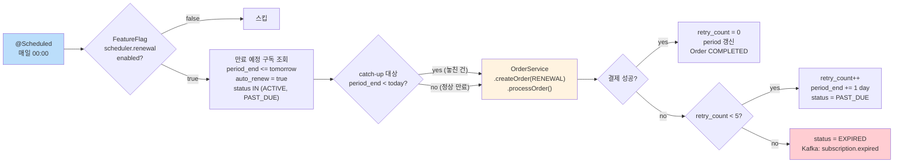
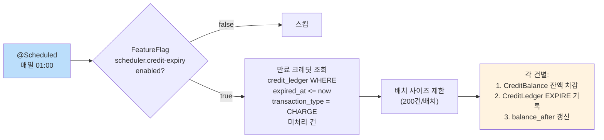

# [Ticket #13] 스케줄러 (구독 갱신 + 크레딧 만료)

## 개요
- TDD 참조: tdd.md 섹션 4.6, 8.1
- 선행 티켓: #8 (FulfillmentStrategy), #7 (Payment 도메인)
- 크기: M

## 작업 내용

### 설계 원칙

스케줄러는 **트리거**일 뿐이다. 비즈니스 로직은 OrderService에 있고, 스케줄러는 조건에 맞는 건을 찾아 OrderService를 호출하는 역할만 한다.

- SubscriptionRenewalScheduler: 만료 예정 구독 조회 -> OrderService.createOrder(RENEWAL) -> OrderService.processOrder()
- CreditExpiryScheduler: 만료 크레딧 조회 -> CreditBalance 차감 + CreditLedger EXPIRE 기록

### 1. SubscriptionRenewalScheduler 흐름



### 2. CreditExpiryScheduler 흐름



### 3. Feature Flag 정의

```kotlin
object SchedulerFeatureKeys {

    /** 구독 갱신 스케줄러 활성화 */
    object SubscriptionRenewalEnabled : BooleanFeatureKey(
        key = "scheduler.renewal-enabled",
        defaultValue = false
    )

    /** 크레딧 만료 스케줄러 활성화 */
    object CreditExpiryEnabled : BooleanFeatureKey(
        key = "scheduler.credit-expiry-enabled",
        defaultValue = false
    )
}
```

### 4. SubscriptionRenewalScheduler 구현

```kotlin
@Component
class SubscriptionRenewalScheduler(
    private val subscriptionRepository: SubscriptionRepository,
    private val orderService: OrderService,
    private val featureFlagService: FeatureFlagService,
    private val meterRegistry: MeterRegistry,
) {
    private val log = LoggerFactory.getLogger(javaClass)

    companion object {
        const val BATCH_SIZE = 100
        const val MAX_RETRY_COUNT = 5
    }

    @Scheduled(cron = "0 0 0 * * *") // 매일 00:00
    fun renewExpiring() {
        val enabled = featureFlagService.getFlag(
            SchedulerFeatureKeys.SubscriptionRenewalEnabled,
            FeatureContext.ALL
        )
        if (!enabled) {
            log.info("[RenewalScheduler] Feature flag disabled, skipping")
            return
        }

        val tomorrow = LocalDate.now().plusDays(1).atStartOfDay()
        val targets = subscriptionRepository.findRenewalTargets(
            periodEndBefore = tomorrow,
            autoRenew = true,
            statuses = listOf("ACTIVE", "PAST_DUE"),
            limit = BATCH_SIZE
        )

        log.info("[RenewalScheduler] Found ${targets.size} subscriptions to renew")
        val successCounter = meterRegistry.counter("scheduler.renewal.success")
        val failureCounter = meterRegistry.counter("scheduler.renewal.failure")

        for (subscription in targets) {
            try {
                processRenewal(subscription)
                successCounter.increment()
            } catch (e: Exception) {
                log.error("[RenewalScheduler] Failed for subscription=${subscription.id}, workspace=${subscription.workspaceId}", e)
                failureCounter.increment()
            }
        }
    }

    private fun processRenewal(subscription: Subscription) {
        val product = productRepository.findById(subscription.productId)
            ?: throw IllegalStateException("Product not found: ${subscription.productId}")

        // 1. 갱신 주문 생성 (OrderService 재사용)
        val order = orderService.createOrder(
            CreateOrderCommand(
                workspaceId = subscription.workspaceId,
                productCode = product.code,
                orderType = OrderType.RENEWAL,
                createdBy = "SYSTEM_SCHEDULER"
            )
        )

        // 2. 결제 + Fulfillment (공통 파이프라인 재사용)
        try {
            orderService.processOrder(order.id)
            // SubscriptionFulfillment이 retry_count=0, period 갱신 처리
            log.info("[RenewalScheduler] Renewal success: subscription=${subscription.id}, order=${order.orderNumber}")
        } catch (e: Exception) {
            handleRenewalFailure(subscription, e)
        }
    }

    private fun handleRenewalFailure(subscription: Subscription, cause: Exception) {
        log.warn("[RenewalScheduler] Payment failed for subscription=${subscription.id}: ${cause.message}")

        subscription.incrementRetryCount()

        if (subscription.retryCount >= MAX_RETRY_COUNT) {
            // 5회 이상 실패 -> 만료
            subscription.expire()
            log.error("[RenewalScheduler] Subscription EXPIRED after $MAX_RETRY_COUNT retries: id=${subscription.id}")
        } else {
            // 만료일 +1일 버퍼 부여
            subscription.extendPeriodEndByOneDay()
            subscription.markPastDue()
            log.warn("[RenewalScheduler] Subscription PAST_DUE, retry=${subscription.retryCount}: id=${subscription.id}")
        }

        subscriptionRepository.save(subscription)
    }
}
```

### 5. Subscription 도메인 메서드

```kotlin
@Entity
@Table(name = "subscription")
class Subscription(
    // ... 기존 필드
) : BaseEntity() {

    fun incrementRetryCount() {
        this.retryCount += 1
    }

    fun extendPeriodEndByOneDay() {
        this.currentPeriodEnd = this.currentPeriodEnd.plusDays(1)
    }

    fun markPastDue() {
        require(this.status == "ACTIVE" || this.status == "PAST_DUE") {
            "Cannot mark PAST_DUE from status=$status"
        }
        this.status = "PAST_DUE"
    }

    fun expire() {
        require(this.status == "ACTIVE" || this.status == "PAST_DUE") {
            "Cannot expire from status=$status"
        }
        this.status = "EXPIRED"
    }

    fun renewPeriod(intervalMonths: Int) {
        this.currentPeriodStart = this.currentPeriodEnd
        this.currentPeriodEnd = this.currentPeriodEnd.plusMonths(intervalMonths.toLong())
        this.retryCount = 0
        this.status = "ACTIVE"
    }
}
```

### 6. Catch-up 로직 (놓친 갱신 처리)

스케줄러가 장애로 실행되지 못한 경우, 다음 실행 시 놓친 건도 함께 처리한다. `period_end <= tomorrow` 조건이 이를 자동으로 포함한다.

```kotlin
// SubscriptionRepository
interface SubscriptionRepository : JpaRepository<Subscription, Long> {

    @Query("""
        SELECT s FROM Subscription s
        WHERE s.currentPeriodEnd <= :periodEndBefore
          AND s.autoRenew = true
          AND s.status IN :statuses
          AND s.deletedAt IS NULL
        ORDER BY s.currentPeriodEnd ASC
    """)
    fun findRenewalTargets(
        @Param("periodEndBefore") periodEndBefore: LocalDateTime,
        @Param("autoRenew") autoRenew: Boolean,
        @Param("statuses") statuses: List<String>,
        @Param("limit") limit: Int = 100,
    ): List<Subscription>
}
```

놓친 갱신 = `period_end < today`인 건들. 정상 갱신 = `period_end` 가 today~tomorrow 사이인 건. 둘 다 동일 쿼리로 조회된다.

### 7. CreditExpiryScheduler 구현

```kotlin
@Component
class CreditExpiryScheduler(
    private val creditLedgerRepository: CreditLedgerRepository,
    private val creditBalanceRepository: CreditBalanceRepository,
    private val featureFlagService: FeatureFlagService,
    private val meterRegistry: MeterRegistry,
) {
    private val log = LoggerFactory.getLogger(javaClass)

    companion object {
        const val BATCH_SIZE = 200
    }

    @Scheduled(cron = "0 0 1 * * *") // 매일 01:00
    fun expireCredits() {
        val enabled = featureFlagService.getFlag(
            SchedulerFeatureKeys.CreditExpiryEnabled,
            FeatureContext.ALL
        )
        if (!enabled) {
            log.info("[CreditExpiryScheduler] Feature flag disabled, skipping")
            return
        }

        val now = LocalDateTime.now()
        val expiredCharges = creditLedgerRepository.findExpiredCharges(
            expiredBefore = now,
            transactionType = "CHARGE",
            limit = BATCH_SIZE
        )

        log.info("[CreditExpiryScheduler] Found ${expiredCharges.size} expired credit entries")

        for (charge in expiredCharges) {
            try {
                processExpiry(charge)
            } catch (e: Exception) {
                log.error("[CreditExpiryScheduler] Failed to expire ledger=${charge.id}", e)
            }
        }
    }

    @Transactional
    fun processExpiry(charge: CreditLedger) {
        // 이미 만료 처리된 건은 스킵 (멱등성)
        val alreadyExpired = creditLedgerRepository.existsByRelatedLedgerId(
            workspaceId = charge.workspaceId,
            creditType = charge.creditType,
            transactionType = "EXPIRE",
            relatedLedgerId = charge.id
        )
        if (alreadyExpired) return

        // 1. 잔액에서 차감 (Optimistic Lock)
        val balance = creditBalanceRepository.findByWorkspaceIdAndCreditType(
            workspaceId = charge.workspaceId,
            creditType = charge.creditType
        ) ?: return

        val deductAmount = minOf(charge.amount, balance.balance)
        if (deductAmount <= 0) return

        balance.deduct(deductAmount)
        creditBalanceRepository.save(balance)

        // 2. 만료 원장 기록
        val expireLedger = CreditLedger(
            workspaceId = charge.workspaceId,
            creditType = charge.creditType,
            transactionType = "EXPIRE",
            amount = -deductAmount,
            balanceAfter = balance.balance,
            description = "자동 만료 (원본 충전 ledger_id=${charge.id})",
            createdAt = LocalDateTime.now()
        )
        creditLedgerRepository.save(expireLedger)

        log.info("[CreditExpiryScheduler] Expired: workspace=${charge.workspaceId}, type=${charge.creditType}, amount=$deductAmount")
    }
}
```

### 8. CreditLedger 만료 대상 조회 쿼리

```kotlin
interface CreditLedgerRepository : JpaRepository<CreditLedger, Long> {

    @Query("""
        SELECT cl FROM CreditLedger cl
        WHERE cl.expiredAt <= :expiredBefore
          AND cl.transactionType = :transactionType
          AND cl.amount > 0
          AND NOT EXISTS (
              SELECT 1 FROM CreditLedger el
              WHERE el.workspaceId = cl.workspaceId
                AND el.creditType = cl.creditType
                AND el.transactionType = 'EXPIRE'
                AND el.description LIKE CONCAT('%ledger_id=', cl.id, '%')
          )
        ORDER BY cl.expiredAt ASC
    """)
    fun findExpiredCharges(
        @Param("expiredBefore") expiredBefore: LocalDateTime,
        @Param("transactionType") transactionType: String,
        @Param("limit") limit: Int,
    ): List<CreditLedger>
}
```

### 수정 파일 목록

| 레포 | 파일 경로 | 변경 유형 |
|------|----------|----------|
| greeting_payment-server | infrastructure/scheduler/SubscriptionRenewalScheduler.kt | 신규 |
| greeting_payment-server | infrastructure/scheduler/CreditExpiryScheduler.kt | 신규 |
| greeting_payment-server | infrastructure/scheduler/SchedulerFeatureKeys.kt | 신규 |
| greeting_payment-server | domain/order/Subscription.kt | 수정 (renewPeriod, expire, markPastDue 등 메서드 추가) |
| greeting_payment-server | infrastructure/repository/SubscriptionRepository.kt | 수정 (findRenewalTargets 추가) |
| greeting_payment-server | infrastructure/repository/CreditLedgerRepository.kt | 수정 (findExpiredCharges 추가) |
| greeting-db-schema | migration/V{N}__insert_scheduler_feature_flags.sql | 신규 |

## 테스트 케이스

### 정상 케이스
| ID | 테스트명 | Given | When | Then |
|----|---------|-------|------|------|
| TC-01 | 구독 정상 갱신 | ACTIVE 구독, period_end = tomorrow, auto_renew=true | 스케줄러 실행 | Order(RENEWAL) 생성 -> COMPLETED, Subscription period 갱신, retry_count=0 |
| TC-02 | PAST_DUE 구독 재시도 성공 | PAST_DUE 구독, retry_count=2 | 스케줄러 실행 + 결제 성공 | status=ACTIVE, retry_count=0, period 갱신 |
| TC-03 | 놓친 갱신 catch-up | period_end = 3일 전 (장애로 놓침) | 스케줄러 실행 | 정상 갱신 처리 (period_end <= tomorrow 조건에 포함) |
| TC-04 | 크레딧 정상 만료 | CHARGE 원장, expired_at = 어제 | 스케줄러 실행 | CreditBalance 차감, EXPIRE 원장 기록 |
| TC-05 | Feature flag off | scheduler.renewal-enabled = false | CRON 트리거 | 쿼리/처리 없이 즉시 리턴 |
| TC-06 | 배치 사이즈 제한 | 200건 초과 대상 | 스케줄러 실행 | BATCH_SIZE(100/200)건만 처리, 나머지는 다음 실행 |

### 예외/엣지 케이스
| ID | 테스트명 | Given | When | Then |
|----|---------|-------|------|------|
| TC-E01 | 갱신 결제 실패 (retry < 5) | ACTIVE 구독, retry_count=0 | 결제 실패 | retry_count=1, period_end += 1일, status=PAST_DUE |
| TC-E02 | 5회 실패 -> 만료 | PAST_DUE 구독, retry_count=4 | 5번째 결제 실패 | retry_count=5, status=EXPIRED |
| TC-E03 | auto_renew=false 제외 | 구독 period_end = tomorrow, auto_renew=false | 스케줄러 실행 | 조회 대상에서 제외 |
| TC-E04 | 크레딧 만료 멱등성 | 이미 EXPIRE 처리된 CHARGE 원장 | 스케줄러 재실행 | 중복 처리 없이 스킵 |
| TC-E05 | 잔액보다 큰 만료 금액 | balance=50, 만료 대상 amount=100 | 만료 처리 | 50만 차감 (min 처리) |
| TC-E06 | Subscription 낙관적 락 충돌 | 동시 갱신 시도 | 2건 동시 실행 | OptimisticLockException -> 한 건 재시도 또는 다음 배치 |

## 그리팅 실제 적용 예시

### AS-IS (현재)
- 구독 갱신: `OrderServiceImpl.createUpdatePlanOrder()` -> `BillingService.charge()` -> `PlanServiceImpl.updatePlan()`. 실패 시 `PlanOnWorkspace.failedUpdatePlan()`에서 paymentStatus를 FAIL_1~FAIL_5로 직접 관리. 각 단계가 별도 서비스에 분산되어 있고, 결제 실패 재시도 로직이 PlanOnWorkspace 엔티티에 하드코딩됨.
- 크레딧 만료: SMS 포인트(CreditOnGroup)에 만료 개념 없음. MessagePointChargeLogsOnWorkspace(MongoDB)에 충전 이력만 있고, 만료 처리 스케줄러 자체가 존재하지 않음.

### TO-BE (리팩토링 후)
- 구독 갱신: `SubscriptionRenewalScheduler` -> `OrderService.createOrder(RENEWAL)` -> `processOrder()` -> `SubscriptionFulfillment`. 기존 결제/구독 갱신의 공통 파이프라인을 100% 재사용. 재시도 로직은 Subscription 엔티티의 retryCount + 스케줄러 흐름으로 명확히 분리.
- 크레딧 만료: `CreditExpiryScheduler`가 `credit_ledger`의 expired_at을 기준으로 만료 건 조회 -> `CreditBalance` 차감 + `CreditLedger` EXPIRE 기록. 트랜잭션 일관성 보장.

### 향후 확장 예시
- AI 크레딧 만료 스케줄러: `CreditExpiryScheduler`는 credit_type 구분 없이 expired_at 기준으로 조회하므로, AI_EVALUATION 타입 상품 추가 시 코드 변경 없이 만료 처리 자동 동작.
- 연간 구독 갱신: billing_interval_months=12인 구독도 동일한 `findRenewalTargets` 쿼리로 조회되므로 스케줄러 코드 변경 불필요.

## 기대 결과 (AC)
- [ ] SubscriptionRenewalScheduler가 매일 00:00에 만료 예정 구독을 조회하고 OrderService.createOrder(RENEWAL) + processOrder()를 호출한다
- [ ] 결제 실패 시 retry_count++, period_end += 1일 버퍼, 5회 실패 시 EXPIRED 전이
- [ ] catch-up 로직: 스케줄러 장애 후 복구 시 놓친 갱신 건도 자동 처리
- [ ] 배치 사이즈 제한 (SubscriptionRenewal: 100건, CreditExpiry: 200건)
- [ ] CreditExpiryScheduler가 매일 01:00에 만료 크레딧을 조회하고 CreditBalance 차감 + CreditLedger EXPIRE 기록
- [ ] 크레딧 만료 처리가 멱등성 보장 (중복 EXPIRE 방지)
- [ ] 두 스케줄러 모두 Feature Flag로 런타임 on/off 제어 가능
- [ ] 처리 건수/성공/실패 메트릭이 MeterRegistry에 기록
