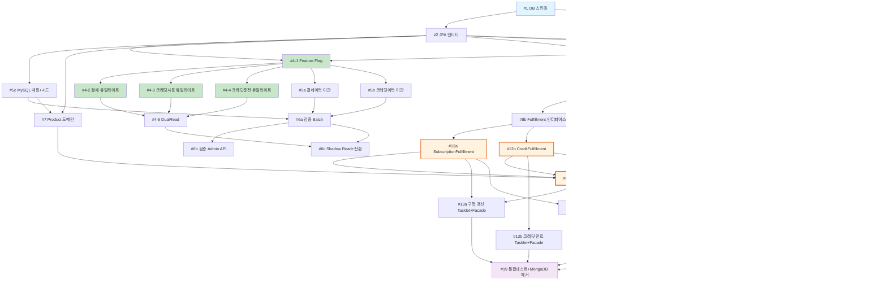

# 구현 티켓 요약: 결제/주문 시스템 리팩토링 (주문 중심 통합)

> TDD: [tdd.md](../tdd.md) — **Order 중심 아키텍처, FulfillmentStrategy 패턴**
> Gap 분석: [gap_analysis.md](../gap_analysis.md)

---

## 설계 핵심

```
Controller → OrderFacade → ProductService / OrderService / PaymentService / FulfillmentStrategy
                                                                              ├── SubscriptionFulfillment
                                                                              ├── CreditFulfillment
                                                                              └── OneTimeFulfillment
```

- **OrderFacade가 도메인 간 오케스트레이터** (SubscriptionService/CreditService 없음, 각 Service는 자기 BC만)
- **OrderService**: Order BC만 (CRUD + 상태 전이 + 이력). OrderRepository + OrderStatusHistoryRepository + SubscriptionRepository(read) + CreditBalanceRepository(read)만 의존
- **OrderService는 ProductService, PaymentService, FulfillmentStrategy에 의존하지 않음**
- Subscription, CreditBalance, CreditLedger는 Order 도메인 하위의 Fulfillment 결과물
- 스케줄러: Tasklet → SubscriptionRenewalFacade/CreditExpiryFacade → OrderFacade 구조 (Facade에 비즈니스 로직, @Scheduled 미사용)
- Kafka: **OrderEvent 단일 이벤트** (`order.event.v1`). 터미널 상태(COMPLETED/FAILED/CANCELLED/REFUNDED)에서만 1회 발행. 내부 이벤트(OrderStatusChangedEvent)는 Kafka 발행 안 함
- Feature Flag: `DualWriteFeatureKeys` object + `FeatureFlagService` (SimpleRuntimeConfig 기반). @ConfigurationProperties 미사용

---

## 티켓 목록 (35건)

### 4월: DB 전환 (무중단 Dual Write) — 14건

| # | 티켓 | 크기 | 의존성 | 상세 |
|---|------|------|--------|------|
| 1 | DB 스키마 + Flyway | L | - | 15테이블 DDL, ERD, 컬럼 COMMENT |
| 2 | JPA 엔티티 + Repository | L | #1, #3 | 14엔티티, Bounded Context 다이어그램, QueryDSL |
| 3 | Soft Delete BaseEntity | S | #1 | @MappedSuperclass, JPA Auditing |
| 4-1 | Feature Flag 설정 | S | #2, #3 | DualWriteFeatureKeys + FeatureFlagService, 메트릭 |
| 4-2 | 결제 이력 듀얼라이트 | M | #4-1 | DualWritePaymentLogService + PaymentLogToOrderConverter |
| 4-3 | 크레딧 사용 이력 듀얼라이트 | M | #4-1 | DualWriteMessagePointLogService + PointLogToLedgerConverter |
| 4-4 | 크레딧 충전 듀얼라이트 | M | #4-1 | DualWriteChargeLogService + ChargeLogToLedgerConverter |
| 4-5 | DualRead 서비스 | S | #4-2, #4-3, #4-4 | 읽기 전환 + MongoDB 폴백 |
| 5a | 결제 이력 배치 이관 | M | #4-1 | PaymentLogsOnGroup → order + order_item + payment |
| 5b | 크레딧 이력 배치 이관 | M | #4-1 | PointLogs + ChargeLogs → credit_ledger |
| 5c | 기존 MySQL 매핑 + 상품 시드 | M | #2 | PlanOnGroup→subscription, CardInfo→billing_key, Credit→balance, 상품 9건 시드 |
| 6a | 마이그레이션 검증 Batch Job | M | #5a, #5b, #5c | 건수/금액/스팟체크 3단계, 결과 DB 저장, CSV 생성 |
| 6b | 검증 Admin API | S | #6a | Retool 트리거, 결과 조회, CSV 다운로드 |
| 6c | Shadow Read + 읽기 전환 + MongoDB 쓰기 중단 | M | #4-5, #6a | Phase D→E→F, DualWriteFeatureKeys + FeatureFlagService 롤백 |

### 5월: 주문 중심 구조 개선 — 21건

| # | 티켓 | 크기 | 의존성 | 상세 |
|---|------|------|--------|------|
| 7 | Product 도메인 서비스 | M | #2, #5c | ProductService (상품/가격 조회), 카탈로그 시드 |
| 8a | Order 엔티티 + 상태머신 | M | #2 | Order, OrderItem, OrderStatus(캡슐화), OrderNumberGenerator |
| 8b | FulfillmentStrategy 인터페이스 | S | #8a | 인터페이스 + Resolver (구현체는 #12a~c) |
| 8c | OrderService | M | #8a | Order BC만 (CRUD + 상태 전이 + 이력). Product/Payment/Fulfillment 의존 없음 |
| 8d | OrderFacade (도메인 간 오케스트레이터) | M | #7, #8c, #9c, #12a, #12b, #12c | Product→Order→Payment→Fulfillment 오케스트레이션 + 보상 트랜잭션 |
| 9a | Payment 엔티티 + 상태머신 | M | #2 | Payment, PaymentStatus(캡슐화), Refund, PaymentResult VO |
| 9b | PaymentGateway 인터페이스 | S | #9a | 인터페이스 + Resolver (구현체는 #10) |
| 9c | PaymentService | M | #9a, #9b, #10 | processPayment, cancelPayment. Payment BC만 |
| 10 | TossPaymentGateway + ManualGateway 구현 | M | #9b | Toss API 리팩토링 + 백오피스 수동 결제 |
| 11 | BillingKey 관리 | M | #2 | CRUD, 암호화, is_primary |
| 12a | SubscriptionFulfillment | M | #8b | fulfill(NEW/RENEWAL/UPGRADE/DOWNGRADE), revoke, 프로레이션, Subscription 엔티티 |
| 12b | CreditFulfillment | M | #8b | fulfill(CHARGE), revoke(REFUND), CreditBalance(Optimistic Lock), CreditLedger |
| 12c | OneTimeFulfillment | S | #8b | 즉시 완료, order.event.v1 이벤트로 소비자 후속 처리 |
| 13a | 구독 갱신 (Tasklet + Facade) | M | #8d, #12a | SubscriptionRenewalFacade + Tasklet → OrderFacade.createAndProcessOrder(RENEWAL). 5회 재시도+버퍼 |
| 13b | 크레딧 만료 (Tasklet + Facade) | S | #12b | CreditExpiryFacade + Tasklet → 만료 크레딧 차감, CreditBalance 갱신 |
| 14 | Order API (통합 엔드포인트) | M | #8d, #12a, #12b, #12c | POST/GET/PATCH /orders — 구독/크레딧/일회성 전부 처리. Controller → OrderFacade |
| 15 | Toss Webhook + 이력 관리 | M | #10, #9c | 웹훅 수신(WebhookFacade), pg_webhook_log, @TransactionalEventListener 이력 자동 기록 |
| 16 | Kafka 이벤트 + 레거시 어댑터 | M | #8d, #15 | OrderEvent 단일 이벤트 (order.event.v1) + plan.changed 레거시 어댑터 |
| 17 | 기존 API 하위호환 어댑터 | M | #14, #8d | LegacyPaymentController → OrderFacade 라우팅 |
| 18 | greeting-new-back 연동 + plan-data-processor 이관 | L | #16, #14 | OrderEventConsumer + PlanDowngradeConsumer (Kotlin), PlanOnWorkspace 변경 |
| 19 | 통합 테스트 + MongoDB 제거 | L | All | E2E (Testcontainers + Kafka), AS-IS/TO-BE 동등성, MongoDB 의존성 제거, Node.js 폐기 |

---

## 의존 관계도



---

## 배포 순서

```
4월 1주: DB 스키마 + 엔티티 + BaseEntity (#1, #2, #3)
4월 2주: Feature Flag + 듀얼라이트 (#4-1 ~ #4-5)
4월 3주: 배치 이관 (#5a, #5b, #5c)
4월 4주: 검증 + 읽기 전환 + MongoDB 쓰기 중단 (#6a, #6b, #6c)
5월 1주: Product + Order 엔티티 + Payment 엔티티 (#7, #8a, #8b, #9a, #9b)
5월 2주: OrderService + PaymentService + PG 구현 + BillingKey (#8c, #9c, #10, #11)
5월 3주: FulfillmentStrategy + OrderFacade (#12a, #12b, #12c, #8d)
5월 4주: 스케줄러 + API + Webhook + Kafka (#13a, #13b, #14, #15, #16)
5월 5주: 하위호환 + 연동 + 통합테스트 (#17, #18, #19)
```

## 예상 규모

| 크기 | 티켓 수 | 티켓 목록 |
|------|---------|----------|
| S (1~2일) | 8 | #3, #4-1, #4-5, #6b, #8b, #9b, #12c, #13b |
| M (3~5일) | 23 | #4-2, #4-3, #4-4, #5a, #5b, #5c, #6a, #6c, #7, #8a, #8c, #8d, #9a, #9c, #10, #11, #12a, #12b, #13a, #14, #15, #16, #17 |
| L (1~2주) | 4 | #1, #2, #18, #19 |
| **합계** | **35** |
