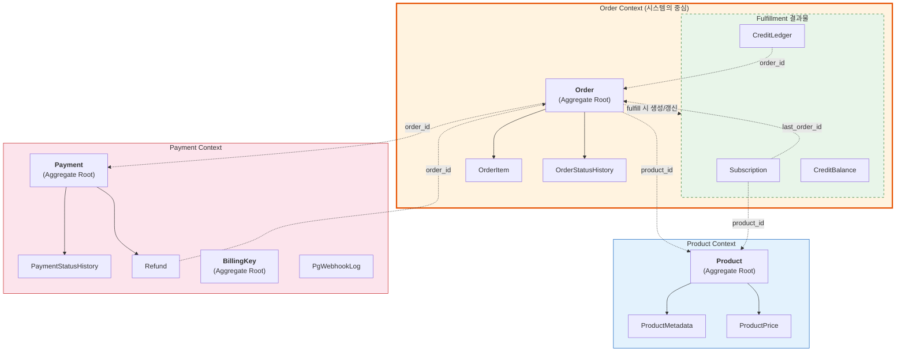

# [Ticket #2] JPA 엔티티 + Repository 구현

## 개요
- TDD 참조: tdd.md 섹션 4.2
- 선행 티켓: #1 (DB 스키마), #3 (BaseEntity)
- 크기: L

## Bounded Context (주문 중심 통합)



### Aggregate Root 정리

| Context | Aggregate Root | 소속 엔티티 | 비고 |
|---------|---------------|-----------|------|
| **Product** | `Product` | ProductMetadata, ProductPrice | 상품 카탈로그 |
| **Order** | `Order` | OrderItem, OrderStatusHistory, Subscription, CreditBalance, CreditLedger | **시스템 중심**. Fulfillment 결과물 포함 |
| **Payment** | `Payment`, `BillingKey` | PaymentStatusHistory, Refund, PgWebhookLog | 결제 수단 |

### 설계 원칙
- Context 간 참조는 **ID만** (JPA @ManyToOne 없음, Long 필드)
- Aggregate Root 내부만 @OneToMany
- **Subscription/CreditBalance/CreditLedger는 OrderFacade → FulfillmentStrategy만 조작** (독립 서비스 없음). OrderService는 조회만 담당

---

## 작업 내용

### 엔티티 공통 규칙
- `BaseEntity` 상속 (created_at, updated_at, deleted_at, version)
- Soft Delete: `@SQLRestriction("deleted_at IS NULL")` + `@SQLDelete`
- 낙관적 락: `Order`, `Subscription`, `CreditBalance` (`@Version`)
- ID: `@GeneratedValue(strategy = GenerationType.IDENTITY)`
- order 테이블: `@Table(name = "\`order\`")` (예약어)

### 엔티티 목록 (14개)

#### Product Context

| 엔티티 | 테이블 | BaseEntity | Soft Delete | @Version | 비고 |
|--------|--------|-----------|-------------|----------|------|
| Product | product | O | O | X | Aggregate Root |
| ProductMetadata | product_metadata | X | X | X | append-only |
| ProductPrice | product_price | X | X | X | 이력성, 수정 없음 |

#### Order Context

| 엔티티 | 테이블 | BaseEntity | Soft Delete | @Version | 비고 |
|--------|--------|-----------|-------------|----------|------|
| Order | `order` | O | O | **O** | Aggregate Root, 예약어 백틱 |
| OrderItem | order_item | X | X | X | 생성 후 수정 없음 |
| OrderStatusHistory | order_status_history | X | X | X | append-only |
| Subscription | subscription | O | O | **O** | Fulfillment 결과물 |
| CreditBalance | credit_balance | X (자체 version) | X | **O** | Fulfillment 결과물 |
| CreditLedger | credit_ledger | X | X | X | append-only 원장 |

#### Payment Context

| 엔티티 | 테이블 | BaseEntity | Soft Delete | @Version | 비고 |
|--------|--------|-----------|-------------|----------|------|
| Payment | payment | O | O | X | Aggregate Root |
| BillingKey | billing_key | O | O | X | Aggregate Root |
| Refund | refund | O | O | X | |
| PaymentStatusHistory | payment_status_history | X | X | X | append-only |
| PgWebhookLog | pg_webhook_log | X | X | X | 로그성 |

### Enum 클래스 (12개)

| Enum | 값 |
|------|-----|
| ProductType | SUBSCRIPTION, CONSUMABLE, ONE_TIME |
| OrderType | NEW, RENEWAL, UPGRADE, DOWNGRADE, PURCHASE, REFUND |
| OrderStatus | CREATED, PENDING_PAYMENT, PAID, COMPLETED, CANCELLED, REFUND_REQUESTED, REFUNDED, PAYMENT_FAILED |
| PaymentStatus | REQUESTED, APPROVED, FAILED, CANCEL_REQUESTED, CANCELLED, CANCEL_FAILED |
| PaymentMethod | BILLING_KEY, CARD, TRANSFER, MANUAL |
| Gateway | TOSS, MANUAL |
| SubscriptionStatus | ACTIVE, PAST_DUE, CANCELLED, EXPIRED |
| CreditType | SMS, AI_EVALUATION |
| CreditTransactionType | CHARGE, USE, REFUND, EXPIRE, GRANT |
| RefundType | FULL, PARTIAL |
| RefundStatus | REQUESTED, PROCESSING, COMPLETED, FAILED |
| WebhookStatus | RECEIVED, PROCESSED, FAILED, IGNORED |

### Repository (14개 JPA + 3개 QueryDSL)

| Repository | 주요 메서드 |
|-----------|------------|
| ProductRepository | findByCode, findByProductTypeAndIsActiveTrue |
| ProductMetadataRepository | findByProductId |
| ProductPriceRepository | findCurrentPrice(productId, now) |
| OrderRepository | findByOrderNumber, findByWorkspaceId(pageable), findByIdempotencyKey |
| OrderItemRepository | findByOrderId |
| PaymentRepository | findByOrderId, findByPaymentKey |
| BillingKeyRepository | findByWorkspaceIdAndIsPrimaryTrue, findByWorkspaceId |
| RefundRepository | findByPaymentId, findByOrderId |
| SubscriptionRepository | findByWorkspaceIdAndStatus, findExpiringSoon(before) |
| CreditBalanceRepository | findByWorkspaceIdAndCreditType |
| CreditLedgerRepository | findByWorkspaceIdAndCreditType(pageable) |
| OrderStatusHistoryRepository | findByOrderId |
| PaymentStatusHistoryRepository | findByPaymentId |
| PgWebhookLogRepository | findByPgProviderAndPaymentKeyAndEventType |

**QueryDSL Custom:**
| Repository | 용도 |
|-----------|------|
| OrderQueryRepository | 기간/상태/유형 복합 필터 |
| CreditLedgerQueryRepository | 기간/유형 필터 + 잔액 집계 |
| SubscriptionQueryRepository | 만료 예정 배치 조회 |

### 패키지 구조

```
domain/
├── product/
│   ├── Product.kt, ProductMetadata.kt, ProductPrice.kt
│   └── ProductType.kt
│
├── order/
│   ├── Order.kt, OrderItem.kt
│   ├── OrderType.kt, OrderStatus.kt
│   ├── OrderNumberGenerator.kt
│   ├── Subscription.kt, SubscriptionStatus.kt    ← Fulfillment 결과물
│   ├── CreditBalance.kt, CreditLedger.kt         ← Fulfillment 결과물
│   └── CreditType.kt, CreditTransactionType.kt
│
└── payment/
    ├── Payment.kt, PaymentStatus.kt, PaymentMethod.kt
    ├── BillingKey.kt, Gateway.kt
    ├── Refund.kt, RefundType.kt, RefundStatus.kt
    └── PgWebhookLog.kt, WebhookStatus.kt

infrastructure/repository/
├── ProductRepository.kt ... (14개)
└── querydsl/
    ├── OrderQueryRepository.kt
    ├── CreditLedgerQueryRepository.kt
    └── SubscriptionQueryRepository.kt
```

### 수정 파일 목록

| 레포 | 파일 경로 | 변경 유형 |
|------|----------|----------|
| greeting_payment-server | domain/product/Product.kt ~ ProductType.kt (4개) | 신규 |
| greeting_payment-server | domain/order/Order.kt ~ CreditTransactionType.kt (10개) | 신규 |
| greeting_payment-server | domain/payment/Payment.kt ~ WebhookStatus.kt (8개) | 신규 |
| greeting_payment-server | infrastructure/repository/*.kt (14개) | 신규 |
| greeting_payment-server | infrastructure/repository/querydsl/*.kt (3개) | 신규 |
| greeting_payment-server | infrastructure/config/QueryDslConfig.kt | 신규 |
| greeting_payment-server | build.gradle.kts | 수정 (QueryDSL 추가) |

## 테스트 케이스

### 정상 케이스
| ID | 테스트명 | Given | When | Then |
|----|---------|-------|------|------|
| TC-01 | Product 저장/조회 | Product 생성 | save + findByCode | code로 조회 성공 |
| TC-02 | Order + OrderItem 연관 저장 | Order + Item 2건 | save | 함께 저장됨 |
| TC-03 | Subscription Fulfillment 결과 저장 | Order COMPLETED 후 | Subscription save | Subscription ACTIVE |
| TC-04 | CreditBalance 낙관적 락 | balance(version=0) | 동시 업데이트 2건 | 1건 성공, 1건 OptimisticLockException |
| TC-05 | CreditLedger append-only | ledger 3건 | 시간순 조회 | createdAt 역순 |
| TC-06 | 만료 예정 구독 배치 조회 | 구독 5건 (만료일 상이) | findExpiringSoon(tomorrow) | 내일까지 만료건만 |

### 예외/엣지 케이스
| ID | 테스트명 | Given | When | Then |
|----|---------|-------|------|------|
| TC-E01 | Soft Delete 조회 제외 | Product soft delete됨 | findByCode | null (deleted_at IS NULL 필터) |
| TC-E02 | Order delete() → UPDATE | Order 1건 | delete(order) | deleted_at = NOW() UPDATE |
| TC-E03 | Order 낙관적 락 충돌 | Order(version=0) | 동시 status 변경 | OptimisticLockException |
| TC-E04 | JPA Auditing 자동 | 새 엔티티 | save() | created_at, updated_at 자동 |

## 기대 결과 (AC)
- [ ] 14개 JPA 엔티티가 DDL과 1:1 매핑
- [ ] Bounded Context 3개: Product / Order(+Fulfillment) / Payment
- [ ] Subscription, CreditBalance, CreditLedger가 order/ 패키지 하위에 위치
- [ ] Soft Delete 대상에 @SQLRestriction + @SQLDelete 적용
- [ ] Order, Subscription, CreditBalance에 @Version 적용
- [ ] 12개 enum, 14개 Repository, 3개 QueryDSL 구현
- [ ] @DataJpaTest 통과
