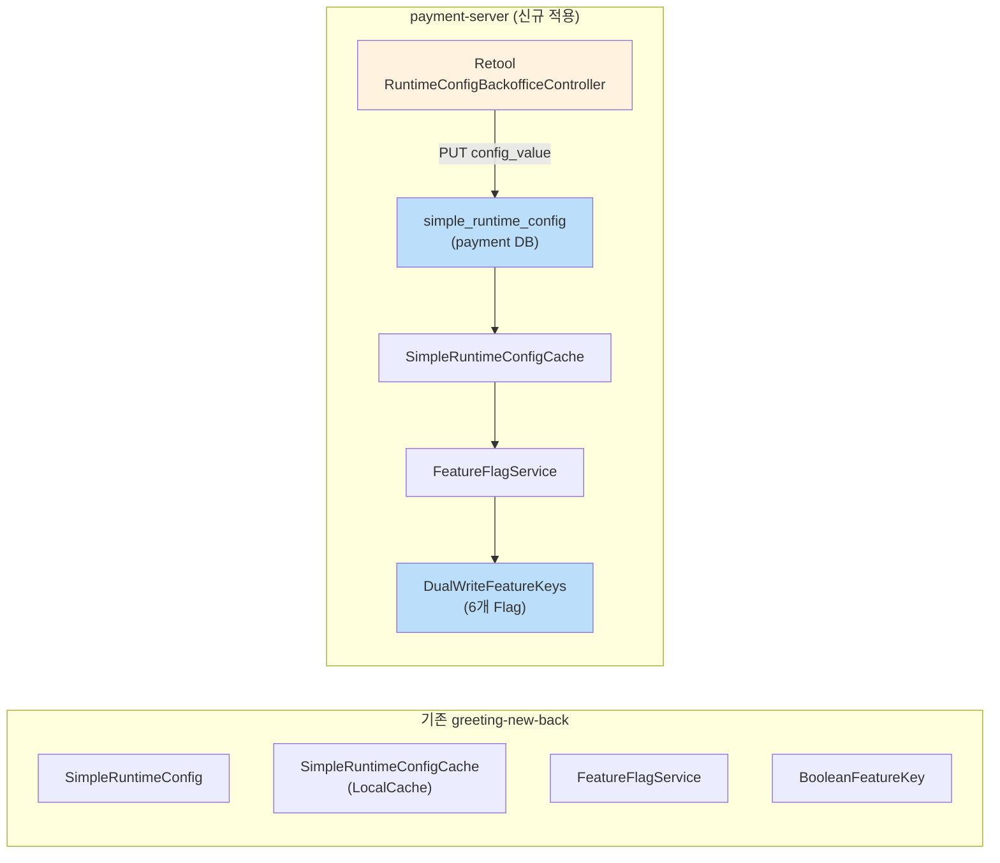

# [Ticket #4-1] Feature Flag 설정 (SimpleRuntimeConfig 기반)

## 개요
- TDD 참조: tdd.md 섹션 5.3
- 선행 티켓: #2, #3
- 크기: S

## 작업 내용

### 기존 인프라 활용

greeting-new-back에 `SimpleRuntimeConfig` + `FeatureFlagService` + `BooleanFeatureKey` 기반 Feature Flag 시스템이 존재한다. payment-server에서도 동일한 구조를 사용하여 **Retool에서 배포 없이 런타임 on/off** 가능하게 한다.



### Feature Key 정의

```kotlin
object DualWriteFeatureKeys {

    /** PaymentLogsOnGroup 듀얼라이트 */
    object DualWritePaymentLog : BooleanFeatureKey(
        key = "dual-write.payment-log",
        defaultValue = false
    )

    /** MessagePointLogsOnWorkspace 듀얼라이트 */
    object DualWriteMessagePointLog : BooleanFeatureKey(
        key = "dual-write.message-point-log",
        defaultValue = false
    )

    /** MessagePointChargeLogsOnWorkspace 듀얼라이트 */
    object DualWriteChargeLog : BooleanFeatureKey(
        key = "dual-write.charge-log",
        defaultValue = false
    )

    /** 결제 이력 읽기 소스 전환 (false=MongoDB, true=MySQL) */
    object ReadFromMysqlPayment : BooleanFeatureKey(
        key = "dual-write.read-from-mysql-payment",
        defaultValue = false
    )

    /** 크레딧 이력 읽기 소스 전환 (false=MongoDB, true=MySQL) */
    object ReadFromMysqlCredit : BooleanFeatureKey(
        key = "dual-write.read-from-mysql-credit",
        defaultValue = false
    )

    /** Shadow Read 활성화 (Phase D) */
    object ShadowReadEnabled : BooleanFeatureKey(
        key = "dual-write.shadow-read-enabled",
        defaultValue = false
    )
}
```

### DB 시드 데이터

```sql
INSERT INTO simple_runtime_config
    (config_key, config_value, value_type, enabled, description, target_scope, created_at, updated_at)
VALUES
    ('dual-write.payment-log',             'false', 'BOOLEAN', 1, '결제 이력 듀얼라이트 (MongoDB+MySQL 동시 쓰기)',   'ALL', NOW(), NOW()),
    ('dual-write.message-point-log',       'false', 'BOOLEAN', 1, '크레딧 사용 이력 듀얼라이트',                       'ALL', NOW(), NOW()),
    ('dual-write.charge-log',              'false', 'BOOLEAN', 1, '크레딧 충전 이력 듀얼라이트',                       'ALL', NOW(), NOW()),
    ('dual-write.read-from-mysql-payment', 'false', 'BOOLEAN', 1, '결제 이력 읽기 소스 전환 (true=MySQL)',            'ALL', NOW(), NOW()),
    ('dual-write.read-from-mysql-credit',  'false', 'BOOLEAN', 1, '크레딧 이력 읽기 소스 전환 (true=MySQL)',          'ALL', NOW(), NOW()),
    ('dual-write.shadow-read-enabled',     'false', 'BOOLEAN', 1, 'Shadow Read (MongoDB/MySQL 비교 모니터링)',       'ALL', NOW(), NOW());
```

### 사용 예시

```kotlin
@Service
class DualWritePaymentLogService(
    private val featureFlagService: FeatureFlagService,
    // ...
) {
    fun save(paymentLog: PaymentLogsOnGroup) {
        mongoRepository.save(paymentLog)

        // SimpleRuntimeConfig 캐시에서 실시간 조회
        val isDualWriteEnabled = featureFlagService.getFlag(
            DualWriteFeatureKeys.DualWritePaymentLog,
            FeatureContext.ALL
        )
        if (!isDualWriteEnabled) return

        try {
            val (order, items, payment) = converter.convert(paymentLog)
            orderRepository.save(order)
            items.forEach { orderItemRepository.save(it) }
            paymentRepository.save(payment)
        } catch (e: Exception) {
            log.warn("Dual write failed: ${e.message}", e)
        }
    }
}
```

### Retool 런타임 제어 흐름


**배포 없이 Retool에서 즉시 on/off 전환.** 캐시 TTL(기본 수 분) 이내에 반영.

### 모니터링 메트릭

```kotlin
class DualWriteMetrics(private val registry: MeterRegistry) {
    fun successCounter(collection: String): Counter =
        registry.counter("dual_write_success_count", "collection", collection)

    fun failureCounter(collection: String): Counter =
        registry.counter("dual_write_failure_count", "collection", collection)

    fun latencyTimer(collection: String): Timer =
        registry.timer("dual_write_latency_ms", "collection", collection)
}
```

### 수정 파일 목록

| 레포 | 파일 경로 | 변경 유형 |
|------|----------|----------|
| greeting_payment-server | domain/migration/DualWriteFeatureKeys.kt | 신규 |
| greeting_payment-server | config/DualWriteMetricsConfig.kt | 신규 |
| greeting_payment-server | config/DualWriteMetrics.kt | 신규 |
| greeting_payment-server | aggregate/ (SimpleRuntimeConfig 인프라) | 복사 또는 공통 모듈 참조 |
| greeting-db-schema | migration/V{N+1}__insert_dual_write_feature_flags.sql | 신규 |

> SimpleRuntimeConfig, FeatureFlagService, FeatureKey, SimpleRuntimeConfigCache, FeatureContext를 payment-server에도 구축 필요. doodlin-commons로 추출하거나 코드 복사.

## 테스트 케이스

### 정상 케이스
| ID | 테스트명 | Given | When | Then |
|----|---------|-------|------|------|
| TC-01 | Flag 기본값 false | DB에 config_value='false' | getFlag(DualWritePaymentLog, ALL) | false |
| TC-02 | Flag 런타임 true | Retool에서 config_value='true'로 변경 | 캐시 갱신 후 getFlag | true |
| TC-03 | Flag 미등록 시 기본값 | DB에 해당 key 없음 | getFlag(DualWritePaymentLog, ALL) | false (defaultValue) |
| TC-04 | 메트릭 Bean 생성 | 앱 기동 | DualWriteMetrics 주입 | counter/timer 정상 |

### 예외/엣지 케이스
| ID | 테스트명 | Given | When | Then |
|----|---------|-------|------|------|
| TC-E01 | 캐시 만료 전 변경 | DB 변경 직후 | getFlag | 캐시 TTL까지 이전 값 (eventual consistency) |
| TC-E02 | enabled=false | config_value='true' but enabled=false | getFlag | false (비활성) |

## 기대 결과 (AC)
- [ ] 6개 Feature Flag가 simple_runtime_config 테이블에 등록됨
- [ ] FeatureFlagService.getFlag()로 실시간 조회 가능 (캐시 기반)
- [ ] Retool(RuntimeConfigBackofficeController)에서 배포 없이 on/off 전환 가능
- [ ] DualWriteMetrics Bean으로 메트릭 카운터/타이머 사용 가능
- [ ] SimpleRuntimeConfig 인프라가 payment-server에 구축됨
