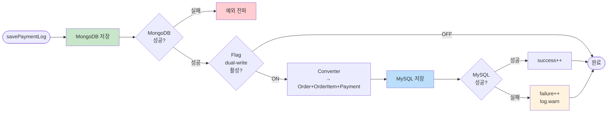

# [Ticket #4-2] 결제 이력 듀얼라이트 (DualWritePaymentLogService)

## 개요
- TDD 참조: tdd.md 섹션 5.3
- 선행 티켓: #4-1
- 크기: M

## 작업 내용

### 변경 사항

PaymentLogsOnGroup(MongoDB) 저장 시 MySQL의 order + order_item + payment에 동시 쓰기하는 서비스를 구현한다.

#### 플로우



#### 코드 예시

**DualWritePaymentLogService**
```kotlin
@Service
class DualWritePaymentLogService(
    private val mongoRepository: PaymentLogsOnGroupRepository,
    private val orderRepository: OrderRepository,
    private val orderItemRepository: OrderItemRepository,
    private val paymentRepository: PaymentRepository,
    private val converter: PaymentLogToOrderConverter,
    private val featureFlagService: FeatureFlagService,
    private val metrics: DualWriteMetrics,
) {
    private val log = LoggerFactory.getLogger(this::class.java)

    fun save(paymentLog: PaymentLogsOnGroup) {
        mongoRepository.save(paymentLog)

        val enabled = featureFlagService.getFlag(DualWriteFeatureKeys.DualWritePaymentLog, FeatureContext.ALL)
        if (!enabled) return

        metrics.latencyTimer("payment").record {
            try {
                val (order, items, payment) = converter.convert(paymentLog)
                orderRepository.save(order)
                items.forEach { orderItemRepository.save(it) }
                paymentRepository.save(payment)
                metrics.successCounter("payment").increment()
            } catch (e: Exception) {
                metrics.failureCounter("payment").increment()
                log.warn("Dual write failed for payment log ${paymentLog.orderId}: ${e.message}", e)
            }
        }
    }
}
```

**PaymentLogToOrderConverter**
```kotlin
@Component
class PaymentLogToOrderConverter {

    data class ConvertResult(
        val order: Order,
        val items: List<OrderItem>,
        val payment: Payment,
    )

    fun convert(log: PaymentLogsOnGroup): ConvertResult {
        val order = Order(
            orderNumber = "MIG-${log.orderId}",
            workspaceId = log.groupId,
            orderType = if (log.cancelPrice > 0) OrderType.REFUND.name else OrderType.RENEWAL.name,
            status = OrderStatus.COMPLETED.name,
            totalAmount = log.totalPrice,
            originalAmount = log.originalPrice,
            discountAmount = log.creditPrice,
            currency = "KRW",
            idempotencyKey = "MIG-${log.orderId}",
            createdBy = "SYSTEM",
        )

        val item = OrderItem(
            productCode = resolveProductCode(log),
            productName = resolveProductName(log),
            productType = ProductType.SUBSCRIPTION.name,
            quantity = 1,
            unitPrice = log.originalPrice,
            totalPrice = log.originalPrice,
        )

        val payment = Payment(
            paymentKey = log.paymentKey,
            paymentMethod = PaymentMethod.BILLING_KEY.name,
            gateway = Gateway.TOSS.name,
            status = PaymentStatus.APPROVED.name,
            amount = log.totalPrice,
            receiptUrl = log.receiptUrl,
            approvedAt = log.createdAt,
            idempotencyKey = "MIG-PAY-${log.orderId}",
        )

        return ConvertResult(order, listOf(item), payment)
    }
}
```

#### 기존 호출 지점 교체

```kotlin
// AS-IS: 기존 서비스에서 직접 MongoDB 저장
paymentLogsOnGroupRepository.save(paymentLog)

// TO-BE: DualWrite 서비스로 교체
dualWritePaymentLogService.save(paymentLog)
```

### 수정 파일 목록

| 레포 | 모듈 | 파일 경로 | 변경 유형 |
|------|------|----------|----------|
| greeting_payment-server | domain/migration | DualWritePaymentLogService.kt | 신규 |
| greeting_payment-server | domain/migration | PaymentLogToOrderConverter.kt | 신규 |
| greeting_payment-server | domain/payment | PlanService.kt (또는 기존 결제 서비스) | 수정 (호출 지점 교체) |

## 테스트 케이스

### 정상 케이스
| ID | 테스트명 | Given | When | Then |
|----|---------|-------|------|------|
| TC-01 | 듀얼라이트 ON — 양쪽 저장 | flag ON | save(paymentLog) | MongoDB + MySQL(order, order_item, payment) 모두 존재 |
| TC-02 | 듀얼라이트 OFF — MongoDB만 | flag OFF | save(paymentLog) | MongoDB만 존재, MySQL 0건 |
| TC-03 | Converter 정상 변환 | PaymentLogsOnGroup 1건 | convert(log) | Order, OrderItem, Payment 필드 정확히 매핑 |
| TC-04 | 환불 로그 변환 | cancelPrice > 0 | convert(log) | orderType = REFUND |

### 예외/엣지 케이스
| ID | 테스트명 | Given | When | Then |
|----|---------|-------|------|------|
| TC-E01 | MySQL 실패 — 비차단 | flag ON + MySQL 장애 | save(paymentLog) | MongoDB 성공, failure++ |
| TC-E02 | 중복 idempotencyKey | 동일 log 2회 저장 | save(paymentLog) 2회 | 첫째 성공, 둘째 무시 |
| TC-E03 | Converter 필드 누락 | paymentKey=null | convert(log) | 정상 변환 (nullable 허용) |

## 기대 결과 (AC)
- [ ] PaymentLogsOnGroup 저장 시 MySQL에 Order+OrderItem+Payment 동시 저장
- [ ] MySQL 실패 시 MongoDB 저장에 영향 없음
- [ ] 기존 호출 지점이 DualWrite 서비스로 교체됨
- [ ] 메트릭으로 성공/실패/지연시간 모니터링 가능
