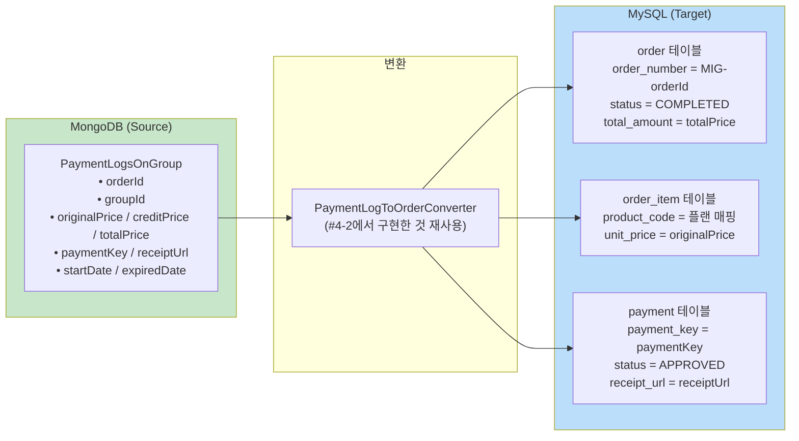
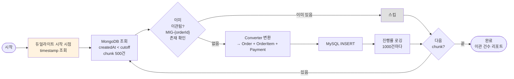

# [Ticket #5a] 결제 이력 배치 이관 (MongoDB → MySQL)

## 개요
- TDD 참조: tdd.md 섹션 5.3 (Phase C)
- 선행 티켓: #4-1 (듀얼라이트 시작 이후 데이터는 이미 MySQL에 있음)
- 크기: M

## 작업 내용

### 이관 대상



### 배치 설계



### 코드 예시

```kotlin
@Configuration
class PaymentLogMigrationJobConfig(
    private val jobBuilderFactory: JobBuilderFactory,
    private val stepBuilderFactory: StepBuilderFactory,
    private val mongoTemplate: MongoTemplate,
    private val orderRepository: OrderRepository,
    private val converter: PaymentLogToOrderConverter,
) {
    @Bean
    fun paymentLogMigrationJob(): Job = jobBuilderFactory.get("paymentLogMigrationJob")
        .start(paymentLogMigrationStep())
        .build()

    @Bean
    fun paymentLogMigrationStep(): Step = stepBuilderFactory.get("paymentLogMigrationStep")
        .chunk<PaymentLogsOnGroup, PaymentLogToOrderConverter.ConvertResult>(500)
        .reader(paymentLogReader())
        .processor(paymentLogProcessor())
        .writer(paymentLogWriter())
        .faultTolerant()
        .skipLimit(100)
        .skip(Exception::class.java)
        .retryLimit(3)
        .retry(Exception::class.java)
        .listener(progressLoggingListener(1000))
        .build()

    @Bean
    fun paymentLogReader(): MongoCursorItemReader<PaymentLogsOnGroup> {
        val reader = MongoCursorItemReader<PaymentLogsOnGroup>()
        reader.setTemplate(mongoTemplate)
        reader.setTargetType(PaymentLogsOnGroup::class.java)
        reader.setQuery(Query.query(Criteria.where("createdAt").lt(dualWriteStartTimestamp)))
        reader.setSort(mapOf("createdAt" to Sort.Direction.ASC))
        return reader
    }

    @Bean
    fun paymentLogProcessor(): ItemProcessor<PaymentLogsOnGroup, PaymentLogToOrderConverter.ConvertResult> {
        return ItemProcessor { log ->
            // 이미 이관된 건 스킵
            if (orderRepository.findByIdempotencyKey("MIG-${log.orderId}") != null) {
                return@ItemProcessor null
            }
            converter.convert(log)
        }
    }
}
```

### 수정 파일 목록

| 레포 | 파일 경로 | 변경 유형 |
|------|----------|----------|
| greeting_payment-server | batch/PaymentLogMigrationJobConfig.kt | 신규 |
| greeting_payment-server | batch/MigrationProgressListener.kt | 신규 |

## 테스트 케이스

### 정상 케이스
| ID | 테스트명 | Given | When | Then |
|----|---------|-------|------|------|
| TC-01 | 정상 이관 | MongoDB에 PaymentLog 100건 | 배치 실행 | MySQL에 order 100건 + order_item 100건 + payment 100건 |
| TC-02 | 이미 이관된 건 스킵 | MIG-{orderId} 이미 존재 | 배치 실행 | 해당 건 스킵, 중복 없음 |
| TC-03 | 듀얼라이트 이후 데이터 제외 | cutoff 이후 데이터 50건 | 배치 실행 | cutoff 이전 데이터만 이관 |
| TC-04 | 진행률 로깅 | 5000건 이관 | 배치 실행 | 1000건마다 로그 출력 |

### 예외/엣지 케이스
| ID | 테스트명 | Given | When | Then |
|----|---------|-------|------|------|
| TC-E01 | Converter 변환 실패 건 스킵 | 비정상 데이터 1건 포함 | 배치 실행 | 해당 건 스킵, 나머지 계속 |
| TC-E02 | 빈 컬렉션 | PaymentLog 0건 | 배치 실행 | 정상 완료, 이관 0건 리포트 |

## 기대 결과 (AC)
- [ ] 듀얼라이트 시작 이전의 PaymentLogsOnGroup이 전부 MySQL로 이관됨
- [ ] idempotency_key(MIG-{orderId})로 중복 이관 방지
- [ ] 실패 건은 스킵하고 나머지 계속 진행
- [ ] 이관 완료 후 건수 리포트 출력
