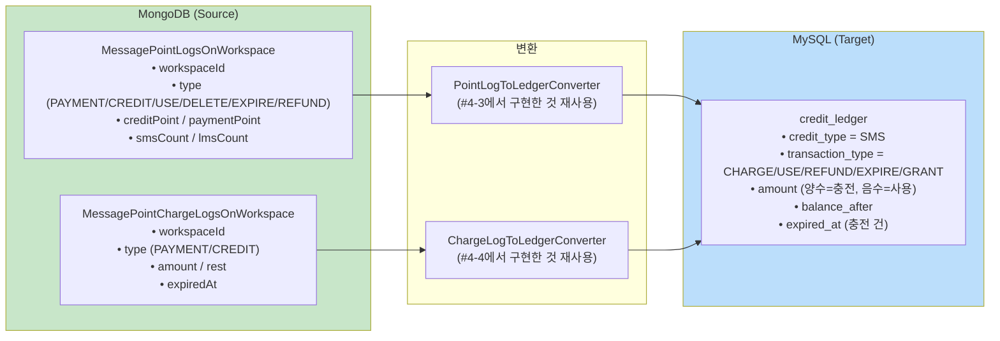
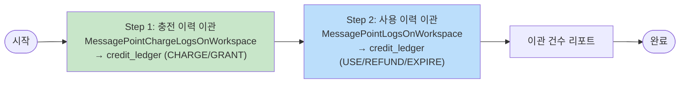
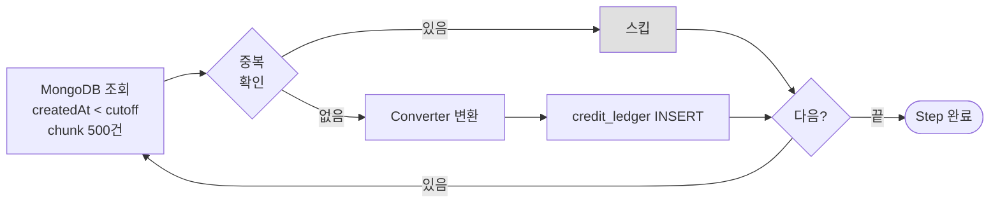

# [Ticket #5b] 크레딧 이력 배치 이관 (MongoDB → MySQL)

## 개요
- TDD 참조: tdd.md 섹션 5.3 (Phase C)
- 선행 티켓: #4-1
- 크기: M

## 작업 내용

### 이관 대상



### 배치 설계

2개 Step을 순차 실행한다: 충전 이력 먼저 → 사용 이력 나중에 (balance_after 계산 순서 보장).



### Step별 처리 흐름



### 코드 예시

```kotlin
@Bean
fun creditLogMigrationJob(): Job = jobBuilderFactory.get("creditLogMigrationJob")
    .start(chargeLogMigrationStep())   // Step 1: 충전 먼저
    .next(pointLogMigrationStep())     // Step 2: 사용 나중에
    .build()
```

### 수정 파일 목록

| 레포 | 파일 경로 | 변경 유형 |
|------|----------|----------|
| greeting_payment-server | batch/CreditLogMigrationJobConfig.kt | 신규 |

## 테스트 케이스

### 정상 케이스
| ID | 테스트명 | Given | When | Then |
|----|---------|-------|------|------|
| TC-01 | 충전 이력 이관 | ChargeLog 50건 | Step 1 실행 | credit_ledger에 CHARGE/GRANT 50건 |
| TC-02 | 사용 이력 이관 | PointLog 200건 | Step 2 실행 | credit_ledger에 USE/REFUND/EXPIRE 200건 |
| TC-03 | 만료일 매핑 | ChargeLog.expiredAt 존재 | 이관 | credit_ledger.expired_at 정확히 매핑 |
| TC-04 | 순차 실행 보장 | 충전+사용 혼재 | Job 실행 | Step 1(충전) 완료 후 Step 2(사용) 실행 |

### 예외/엣지 케이스
| ID | 테스트명 | Given | When | Then |
|----|---------|-------|------|------|
| TC-E01 | 변환 실패 건 스킵 | 비정상 PointLog 1건 | 배치 실행 | 스킵, 나머지 계속 |
| TC-E02 | 빈 컬렉션 | 두 컬렉션 모두 0건 | 배치 실행 | 정상 완료, 이관 0건 |

## 기대 결과 (AC)
- [ ] 충전 이력(ChargeLog)이 credit_ledger에 CHARGE/GRANT로 이관됨
- [ ] 사용 이력(PointLog)이 credit_ledger에 USE/REFUND/EXPIRE로 이관됨
- [ ] 충전 → 사용 순서로 실행되어 balance_after 계산 순서 보장
- [ ] expired_at이 정확히 매핑됨
- [ ] 중복 이관 방지
