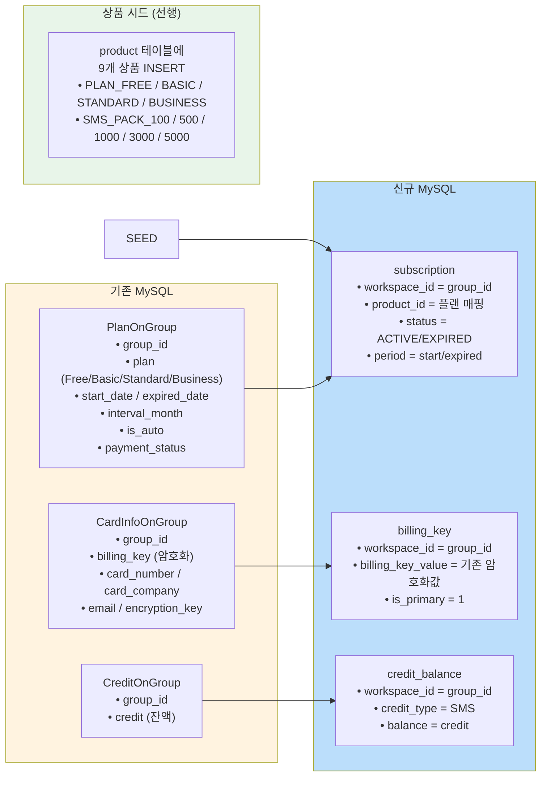
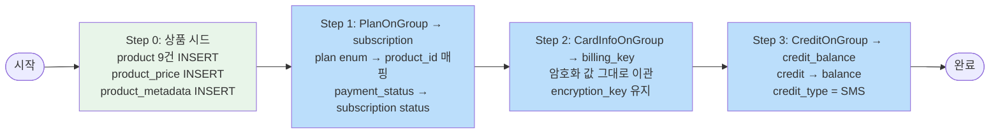

# [Ticket #5c] 기존 MySQL 테이블 매핑 + 상품 시드

## 개요
- TDD 참조: tdd.md 섹션 5.3.2
- 선행 티켓: #2
- 크기: M

## 작업 내용

### 이관 대상



### 단계별 흐름



### Step 0: 상품 시드 데이터

```sql
-- 플랜 상품
INSERT INTO product (code, name, product_type, is_active, created_at, updated_at)
VALUES
    ('PLAN_FREE',     'Free 플랜',     'SUBSCRIPTION', 1, NOW(6), NOW(6)),
    ('PLAN_BASIC',    'Basic 플랜',    'SUBSCRIPTION', 1, NOW(6), NOW(6)),
    ('PLAN_STANDARD', 'Standard 플랜', 'SUBSCRIPTION', 1, NOW(6), NOW(6)),
    ('PLAN_BUSINESS', 'Business 플랜', 'SUBSCRIPTION', 1, NOW(6), NOW(6));

-- SMS 팩 상품
INSERT INTO product (code, name, product_type, is_active, created_at, updated_at)
VALUES
    ('SMS_PACK_100',  'SMS 100건 팩',  'CONSUMABLE', 1, NOW(6), NOW(6)),
    ('SMS_PACK_500',  'SMS 500건 팩',  'CONSUMABLE', 1, NOW(6), NOW(6)),
    ('SMS_PACK_1000', 'SMS 1000건 팩', 'CONSUMABLE', 1, NOW(6), NOW(6)),
    ('SMS_PACK_3000', 'SMS 3000건 팩', 'CONSUMABLE', 1, NOW(6), NOW(6)),
    ('SMS_PACK_5000', 'SMS 5000건 팩', 'CONSUMABLE', 1, NOW(6), NOW(6));

-- 가격 (현재 유효)
INSERT INTO product_price (product_id, price, currency, billing_interval_months, valid_from, created_at)
VALUES
    ((SELECT id FROM product WHERE code='PLAN_BASIC'),    50000,  'KRW', 1,  NOW(6), NOW(6)),
    ((SELECT id FROM product WHERE code='PLAN_BASIC'),    540000, 'KRW', 12, NOW(6), NOW(6)),
    ((SELECT id FROM product WHERE code='PLAN_STANDARD'), 200000, 'KRW', 1,  NOW(6), NOW(6)),
    ((SELECT id FROM product WHERE code='PLAN_STANDARD'), 2160000,'KRW', 12, NOW(6), NOW(6));
    -- Free/Business는 가격 없음 (무료/백오피스 전용)

-- 메타데이터
INSERT INTO product_metadata (product_id, meta_key, meta_value, created_at)
VALUES
    ((SELECT id FROM product WHERE code='PLAN_FREE'),     'plan_level', '0', NOW(6)),
    ((SELECT id FROM product WHERE code='PLAN_BASIC'),    'plan_level', '1', NOW(6)),
    ((SELECT id FROM product WHERE code='PLAN_STANDARD'), 'plan_level', '2', NOW(6)),
    ((SELECT id FROM product WHERE code='PLAN_BUSINESS'), 'plan_level', '3', NOW(6)),
    ((SELECT id FROM product WHERE code='SMS_PACK_100'),  'credit_amount', '100',  NOW(6)),
    ((SELECT id FROM product WHERE code='SMS_PACK_500'),  'credit_amount', '500',  NOW(6)),
    ((SELECT id FROM product WHERE code='SMS_PACK_1000'), 'credit_amount', '1000', NOW(6)),
    ((SELECT id FROM product WHERE code='SMS_PACK_3000'), 'credit_amount', '3000', NOW(6)),
    ((SELECT id FROM product WHERE code='SMS_PACK_5000'), 'credit_amount', '5000', NOW(6));
```

### Step 1: PlanOnGroup → subscription 매핑

```kotlin
fun mapPlanToSubscription(plan: PlanOnGroup): Subscription {
    val productCode = when (plan.plan) {
        "Free"     -> "PLAN_FREE"
        "Basic"    -> "PLAN_BASIC"
        "Standard" -> "PLAN_STANDARD"
        "Business" -> "PLAN_BUSINESS"
        "Lock"     -> return null  // Lock 상태는 구독 없음
    }

    val status = when {
        plan.paymentStatus == 100 -> SubscriptionStatus.ACTIVE
        plan.paymentStatus in 600..604 -> SubscriptionStatus.PAST_DUE
        plan.paymentStatus == 400 -> SubscriptionStatus.EXPIRED
        else -> SubscriptionStatus.EXPIRED
    }

    return Subscription(
        workspaceId = plan.groupId,
        productId = productRepository.findByCode(productCode).id,
        status = status.name,
        currentPeriodStart = plan.startDate,
        currentPeriodEnd = plan.expiredDate,
        billingIntervalMonths = plan.intervalMonth,
        autoRenew = plan.isAuto,
        retryCount = if (plan.paymentStatus in 600..604) plan.paymentStatus - 599 else 0,
    )
}
```

### Step 2: CardInfoOnGroup → billing_key 매핑

```kotlin
fun mapCardToBillingKey(card: CardInfoOnGroup): BillingKey {
    return BillingKey(
        workspaceId = card.groupId,
        billingKeyValue = card.billingKey,       // 암호화된 상태 그대로
        cardCompany = card.cardCompany,
        cardNumberMasked = card.cardNumber,       // 이미 마스킹된 상태
        email = card.email,
        isPrimary = 1,
        gateway = "TOSS",
    )
}
```

### 수정 파일 목록

| 레포 | 파일 경로 | 변경 유형 |
|------|----------|----------|
| greeting_payment-server | batch/ProductSeedRunner.kt | 신규 |
| greeting_payment-server | batch/PlanToSubscriptionMigrationStep.kt | 신규 |
| greeting_payment-server | batch/CardToBillingKeyMigrationStep.kt | 신규 |
| greeting_payment-server | batch/CreditToBalanceMigrationStep.kt | 신규 |
| greeting_payment-server | batch/MysqlMigrationJobConfig.kt | 신규 |

## 테스트 케이스

### 정상 케이스
| ID | 테스트명 | Given | When | Then |
|----|---------|-------|------|------|
| TC-01 | 상품 시드 | 빈 product 테이블 | Step 0 실행 | product 9건, price 4건, metadata 9건 |
| TC-02 | Basic 플랜 → subscription | PlanOnGroup(plan=Basic, status=100) | Step 1 | subscription(ACTIVE, product=PLAN_BASIC) |
| TC-03 | 결제 실패 플랜 매핑 | PlanOnGroup(status=602) | Step 1 | subscription(PAST_DUE, retryCount=3) |
| TC-04 | Lock 플랜 스킵 | PlanOnGroup(plan=Lock) | Step 1 | subscription 생성 안 함 |
| TC-05 | 카드 정보 이관 | CardInfoOnGroup 1건 | Step 2 | billing_key 1건 (암호화값 동일) |
| TC-06 | 크레딧 잔액 이관 | CreditOnGroup(credit=500) | Step 3 | credit_balance(SMS, 500) |

### 예외/엣지 케이스
| ID | 테스트명 | Given | When | Then |
|----|---------|-------|------|------|
| TC-E01 | 이미 시드된 상품 | product에 PLAN_BASIC 존재 | Step 0 재실행 | 중복 에러 없이 스킵 (INSERT IGNORE) |
| TC-E02 | 카드 없는 워크스페이스 | CardInfoOnGroup 없음 | Step 2 | 해당 workspace billing_key 없음 (정상) |
| TC-E03 | 크레딧 0 | CreditOnGroup(credit=0) | Step 3 | credit_balance(balance=0) 생성 |

## 기대 결과 (AC)
- [ ] 상품 시드 9건 + 가격 4건 + 메타데이터 9건 정상 INSERT
- [ ] PlanOnGroup → subscription 매핑 (plan enum → product_id, paymentStatus → SubscriptionStatus)
- [ ] Lock 플랜은 subscription 미생성
- [ ] CardInfoOnGroup → billing_key (암호화값 그대로 이관)
- [ ] CreditOnGroup → credit_balance (credit → balance)
- [ ] 멱등성 보장 (재실행 시 중복 없음)
