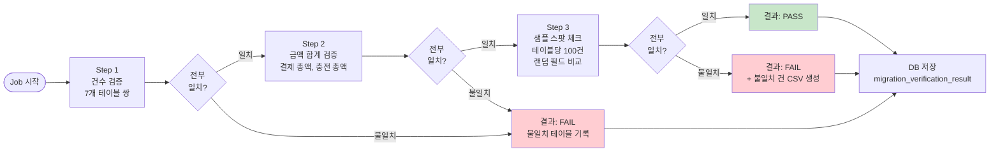

# [Ticket #6a] 마이그레이션 검증 Batch Job

## 개요
- TDD 참조: tdd.md 섹션 5.3 (Phase D)
- 선행 티켓: #5a, #5b, #5c (배치 이관 완료)
- 크기: M

## 작업 내용

### 검증 Job 흐름



### 건수 검증 대상

| 소스 | 타겟 | 규칙 |
|------|------|------|
| PaymentLogsOnGroup (MongoDB) | `order` | 소스 = 타겟 + 스킵 |
| PaymentLogsOnGroup (MongoDB) | `payment` | order와 1:1 |
| MessagePointLogsOnWorkspace (MongoDB) | `credit_ledger` (USE/REFUND/EXPIRE) | 소스 = 타겟 + 스킵 |
| MessagePointChargeLogsOnWorkspace (MongoDB) | `credit_ledger` (CHARGE/GRANT) | 소스 = 타겟 + 스킵 |
| PlanOnGroup (MySQL) | `subscription` | 소스 = 타겟 + Lock 스킵 |
| CardInfoOnGroup (MySQL) | `billing_key` | 소스 = 타겟 |
| CreditOnGroup (MySQL) | `credit_balance` | 소스 = 타겟 |

### 금액 합계 검증

| 소스 | 타겟 | 검증 필드 |
|------|------|----------|
| SUM(PaymentLogs.totalPrice) | SUM(order.total_amount) | 결제 총액 |
| SUM(ChargeLogs.amount) | SUM(credit_ledger.amount) WHERE type=CHARGE | 충전 총액 |

### 결과 저장 테이블

```sql
CREATE TABLE migration_verification_result (
    id              BIGINT          NOT NULL AUTO_INCREMENT PRIMARY KEY COMMENT '검증 결과 PK',
    status          VARCHAR(20)     NOT NULL COMMENT '검증 결과: PASS, FAIL',
    executed_at     DATETIME(6)     NOT NULL COMMENT '검증 실행 시각',
    duration_ms     BIGINT          NOT NULL COMMENT '소요 시간 (ms)',
    total_checks    INT             NOT NULL COMMENT '검증 항목 수',
    passed_checks   INT             NOT NULL COMMENT '통과 항목 수',
    failed_checks   INT             NOT NULL COMMENT '실패 항목 수',
    report_csv_path VARCHAR(500)            COMMENT '불일치 CSV 파일 경로 (FAIL 시)',
    created_at      DATETIME(6)     NOT NULL COMMENT '생성일시',
    INDEX idx_executed (executed_at)
) ENGINE=InnoDB DEFAULT CHARSET=utf8mb4 COMMENT='마이그레이션 검증 결과';

CREATE TABLE migration_verification_check (
    id              BIGINT          NOT NULL AUTO_INCREMENT PRIMARY KEY COMMENT '검증 항목 PK',
    result_id       BIGINT          NOT NULL COMMENT 'migration_verification_result.id 참조',
    check_type      VARCHAR(30)     NOT NULL COMMENT 'RECORD_COUNT, AMOUNT_SUM, SPOT_CHECK',
    source_table    VARCHAR(100)    NOT NULL COMMENT '소스 테이블/컬렉션명',
    target_table    VARCHAR(100)    NOT NULL COMMENT '타겟 테이블명',
    source_value    BIGINT          NOT NULL COMMENT '소스 건수/금액',
    target_value    BIGINT          NOT NULL COMMENT '타겟 건수/금액',
    matched         TINYINT(1)      NOT NULL COMMENT '일치 여부',
    mismatch_detail TEXT                    COMMENT '불일치 상세 (JSON 문자열)',
    created_at      DATETIME(6)     NOT NULL COMMENT '생성일시',
    INDEX idx_result (result_id)
) ENGINE=InnoDB DEFAULT CHARSET=utf8mb4 COMMENT='마이그레이션 검증 항목 상세';
```

### 코드 예시

```kotlin
@Configuration
class MigrationVerificationJobConfig(
    private val jobBuilderFactory: JobBuilderFactory,
    private val stepBuilderFactory: StepBuilderFactory,
    private val mongoTemplate: MongoTemplate,
    private val jdbcTemplate: JdbcTemplate,
    private val resultRepository: VerificationResultRepository,
) {
    @Bean
    fun migrationVerificationJob(): Job = jobBuilderFactory.get("migrationVerificationJob")
        .start(recordCountStep())
        .next(amountSumStep())
        .next(spotCheckStep())
        .next(saveResultStep())
        .build()

    @Bean
    fun recordCountStep(): Step = stepBuilderFactory.get("recordCountStep")
        .tasklet { _, context ->
            val checks = mutableListOf<VerificationCheck>()

            // PaymentLogsOnGroup vs order
            val mongoPaymentCount = mongoTemplate.count(Query(), "PaymentLogsOnGroup")
            val mysqlOrderCount = jdbcTemplate.queryForObject(
                "SELECT COUNT(*) FROM `order` WHERE idempotency_key LIKE 'MIG-%'", Long::class.java
            )
            checks.add(VerificationCheck(
                checkType = "RECORD_COUNT",
                sourceTable = "PaymentLogsOnGroup",
                targetTable = "order",
                sourceValue = mongoPaymentCount,
                targetValue = mysqlOrderCount ?: 0,
                matched = mongoPaymentCount == mysqlOrderCount,
            ))

            // ... 나머지 6개 테이블 쌍

            context.stepContext.stepExecution.jobExecution
                .executionContext.put("recordCountChecks", checks)
            RepeatStatus.FINISHED
        }.build()
}
```

### 수정 파일 목록

| 레포 | 파일 경로 | 변경 유형 |
|------|----------|----------|
| greeting_payment-server | batch/MigrationVerificationJobConfig.kt | 신규 |
| greeting_payment-server | batch/RecordCountStep.kt | 신규 |
| greeting_payment-server | batch/AmountSumStep.kt | 신규 |
| greeting_payment-server | batch/SpotCheckStep.kt | 신규 |
| greeting_payment-server | batch/SaveResultStep.kt | 신규 |
| greeting_payment-server | domain/migration/VerificationResult.kt | 신규 |
| greeting_payment-server | domain/migration/VerificationCheck.kt | 신규 |
| greeting_payment-server | infrastructure/repository/VerificationResultRepository.kt | 신규 |
| greeting-db-schema | migration/V{N+1}__create_migration_verification_tables.sql | 신규 |

## 테스트 케이스

### 정상 케이스
| ID | 테스트명 | Given | When | Then |
|----|---------|-------|------|------|
| TC-01 | 건수 검증 전부 통과 | 소스=타겟 전 테이블 | Job 실행 | 7개 check 전부 matched=true |
| TC-02 | 금액 검증 통과 | SUM 일치 | Job 실행 | 2개 check matched=true |
| TC-03 | 스팟 체크 통과 | 랜덤 100건 필드 일치 | Job 실행 | PASS |
| TC-04 | 결과 DB 저장 | Job 완료 | 결과 조회 | migration_verification_result 1건 |

### 예외/엣지 케이스
| ID | 테스트명 | Given | When | Then |
|----|---------|-------|------|------|
| TC-E01 | 건수 불일치 | 소스=100, 타겟=98 | Job 실행 | FAIL, matched=false, 상세 기록 |
| TC-E02 | 금액 불일치 | SUM 차이 10,000원 | Job 실행 | FAIL, 차액 기록 |
| TC-E03 | 스팟 체크 필드 불일치 | 1건 amount 다름 | Job 실행 | FAIL + CSV 생성 |
| TC-E04 | Job 재실행 | 이전 결과 존재 | 재실행 | 신규 result 추가 (이력) |

## 기대 결과 (AC)
- [ ] 건수/금액/샘플 3단계 검증이 순차 실행됨
- [ ] 검증 결과가 migration_verification_result 테이블에 저장됨
- [ ] 항목별 상세가 migration_verification_check 테이블에 저장됨
- [ ] 불일치 건 CSV 파일 생성됨
- [ ] 재실행 시 이력이 누적됨
