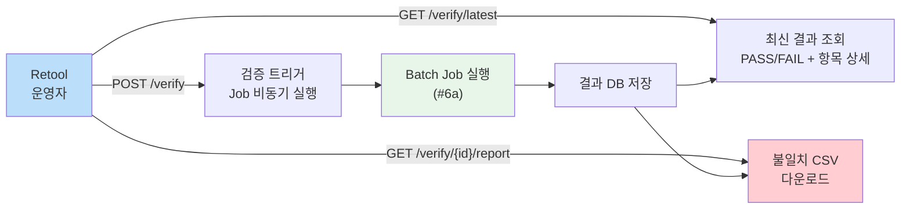

# [Ticket #6b] 마이그레이션 검증 Admin API

## 개요
- TDD 참조: tdd.md 섹션 5.3
- 선행 티켓: #6a (검증 Batch Job)
- 크기: S

## 작업 내용

### API 흐름



### API 스펙

| Method | Path | 설명 | Response |
|--------|------|------|----------|
| POST | `/internal/migration/verify` | 검증 Job 트리거 (비동기) | `{ jobExecutionId, status }` |
| GET | `/internal/migration/verify/latest` | 최신 검증 결과 | `VerificationResult` |
| GET | `/internal/migration/verify/{id}` | 특정 검증 결과 상세 | `VerificationResult + checks[]` |
| GET | `/internal/migration/verify/{id}/report` | 불일치 CSV 다운로드 | `text/csv` 파일 |

### Response DTO

```kotlin
data class VerificationResultResponse(
    val id: Long,
    val status: String,                // PASS, FAIL
    val executedAt: LocalDateTime,
    val durationMs: Long,
    val totalChecks: Int,
    val passedChecks: Int,
    val failedChecks: Int,
    val checks: List<VerificationCheckResponse>,
)

data class VerificationCheckResponse(
    val checkType: String,             // RECORD_COUNT, AMOUNT_SUM, SPOT_CHECK
    val sourceTable: String,
    val targetTable: String,
    val sourceValue: Long,
    val targetValue: Long,
    val matched: Boolean,
    val mismatchDetail: String?,
)
```

### 코드 예시

```kotlin
@RestController
@RequestMapping("/internal/migration")
class MigrationVerificationController(
    private val jobLauncher: JobLauncher,
    @Qualifier("migrationVerificationJob") private val verificationJob: Job,
    private val resultRepository: VerificationResultRepository,
) {
    @PostMapping("/verify")
    fun trigger(): ResponseEntity<Map<String, Any>> {
        val params = JobParametersBuilder()
            .addLong("timestamp", System.currentTimeMillis())
            .toJobParameters()
        val execution = jobLauncher.run(verificationJob, params)
        return ResponseEntity.accepted().body(mapOf(
            "jobExecutionId" to execution.id,
            "status" to execution.status.name,
        ))
    }

    @GetMapping("/verify/latest")
    fun latest(): VerificationResultResponse {
        val result = resultRepository.findTopByOrderByExecutedAtDesc()
            ?: throw NoSuchElementException("검증 결과 없음")
        return result.toResponse()
    }

    @GetMapping("/verify/{id}")
    fun detail(@PathVariable id: Long): VerificationResultResponse {
        val result = resultRepository.findByIdWithChecks(id)
            ?: throw NoSuchElementException("검증 결과 없음: $id")
        return result.toResponse()
    }

    @GetMapping("/verify/{id}/report")
    fun downloadReport(@PathVariable id: Long): ResponseEntity<ByteArray> {
        val result = resultRepository.findByIdWithChecks(id)
            ?: throw NoSuchElementException("검증 결과 없음: $id")
        val csv = buildCsvReport(result)
        return ResponseEntity.ok()
            .header("Content-Disposition", "attachment; filename=migration_report_$id.csv")
            .contentType(MediaType.parseMediaType("text/csv; charset=UTF-8"))
            .body(csv.toByteArray(Charsets.UTF_8))
    }
}
```

### 수정 파일 목록

| 레포 | 파일 경로 | 변경 유형 |
|------|----------|----------|
| greeting_payment-server | presentation/internal/MigrationVerificationController.kt | 신규 |
| greeting_payment-server | presentation/internal/VerificationResultResponse.kt | 신규 |

## 테스트 케이스

### 정상 케이스
| ID | 테스트명 | Given | When | Then |
|----|---------|-------|------|------|
| TC-01 | 검증 트리거 | - | POST /verify | 202 Accepted + jobExecutionId |
| TC-02 | 최신 결과 조회 | 검증 1회 완료 | GET /verify/latest | VerificationResult(PASS) |
| TC-03 | 상세 조회 | 검증 결과 id=1 | GET /verify/1 | checks[] 포함 |
| TC-04 | CSV 다운로드 | FAIL 결과 존재 | GET /verify/1/report | CSV 파일 반환 |

### 예외/엣지 케이스
| ID | 테스트명 | Given | When | Then |
|----|---------|-------|------|------|
| TC-E01 | 결과 없음 | 검증 미실행 | GET /verify/latest | 404 |
| TC-E02 | 존재하지 않는 id | id=999 | GET /verify/999 | 404 |

## 기대 결과 (AC)
- [ ] Retool에서 버튼 하나로 검증 Job 트리거 가능
- [ ] 최신/상세 검증 결과를 API로 즉시 확인 가능
- [ ] 불일치 건 CSV 다운로드 가능
