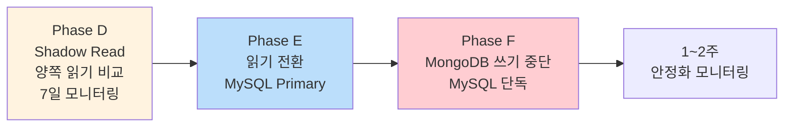
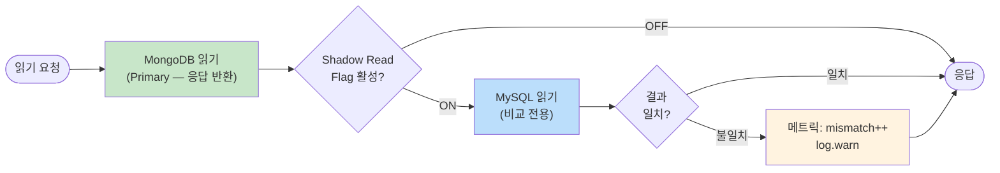
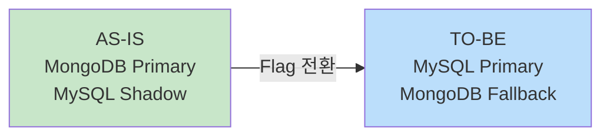
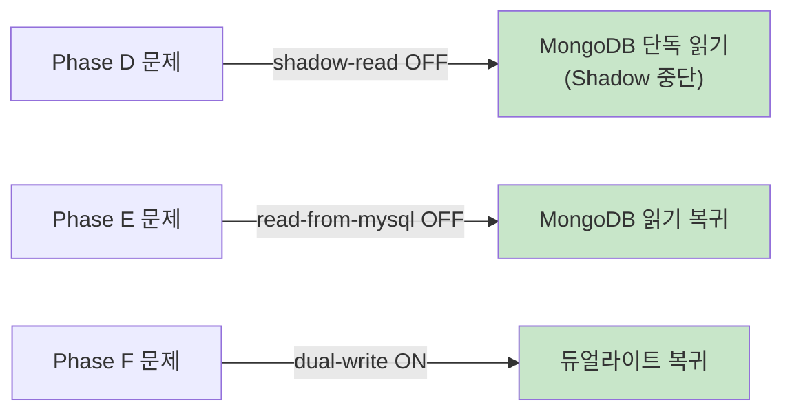

# [Ticket #6c] Shadow Read + 읽기 전환 + MongoDB 쓰기 중단

## 개요
- TDD 참조: tdd.md 섹션 5.3 (Phase D, E, F)
- 선행 티켓: #4-5 (DualRead), #6a (검증 통과)
- 크기: M

## 작업 내용

### 전체 단계



### Phase D: Shadow Read

모든 읽기 요청에서 MongoDB + MySQL 양쪽을 읽고 결과를 비교한다. **MongoDB가 여전히 Primary.**



```kotlin
@Component
class ShadowReadService(
    private val featureFlagService: FeatureFlagService,
    private val meterRegistry: MeterRegistry,
) {
    private val log = LoggerFactory.getLogger(this::class.java)

    fun <T> shadowRead(
        mongoRead: () -> T,
        mysqlRead: () -> T,
        entityName: String,
    ): T {
        val mongoResult = mongoRead()

        val shadowEnabled = featureFlagService.getFlag(DualWriteFeatureKeys.ShadowReadEnabled, FeatureContext.ALL)
        if (!shadowEnabled) return mongoResult

        try {
            val mysqlResult = mysqlRead()
            if (mongoResult != mysqlResult) {
                meterRegistry.counter("shadow_read_mismatch", "entity", entityName).increment()
                log.warn("Shadow read mismatch [$entityName]")
            } else {
                meterRegistry.counter("shadow_read_match", "entity", entityName).increment()
            }
        } catch (e: Exception) {
            meterRegistry.counter("shadow_read_error", "entity", entityName).increment()
            log.warn("Shadow read failed [$entityName]: ${e.message}")
        }

        return mongoResult
    }
}
```

**통과 기준**: `shadow_read_mismatch` = 0이 **7일 연속** 유지

### Phase E: 읽기 전환



```
Retool에서 RuntimeConfigBackofficeController를 통해 변경:
  dual-write.read-from-mysql-payment: false → true
  dual-write.read-from-mysql-credit:  false → true
```

DualReadService(#4-5)가 MySQL에서 읽기 시작. MySQL 실패 시 MongoDB 자동 폴백 유지.

### Phase F: MongoDB 쓰기 중단

```
Retool에서 RuntimeConfigBackofficeController를 통해 변경:
  dual-write.payment-log:       true → false
  dual-write.message-point-log: true → false
  dual-write.charge-log:        true → false
```

MySQL 단독 쓰기. 1~2주 모니터링 후 #19에서 MongoDB 의존성 완전 제거.

### 롤백 계획



**모든 롤백은 Feature Flag 변경만으로 5분 내 수행.**

### Feature Flag

#4-1에서 등록한 `simple_runtime_config` 테이블의 6개 Flag를 Retool에서 런타임 제어한다. 코드에서는 `FeatureFlagService.getFlag(DualWriteFeatureKeys.XXX, FeatureContext.ALL)`로 조회한다.

### 수정 파일 목록

| 레포 | 파일 경로 | 변경 유형 |
|------|----------|----------|
| greeting_payment-server | domain/migration/ShadowReadService.kt | 신규 |
| greeting_payment-server | domain/migration/DualWriteFeatureKeys.kt | 수정 (ShadowReadEnabled 이미 정의됨, 참조 확인) |
| greeting_payment-server | resources/application.yml | 수정 (shadow-read-enabled 추가) |

## 테스트 케이스

### 정상 케이스
| ID | 테스트명 | Given | When | Then |
|----|---------|-------|------|------|
| TC-01 | Shadow Read 일치 | 양쪽 동일 데이터 | shadowRead() | match++ |
| TC-02 | Shadow Read OFF | Flag OFF | shadowRead() | MongoDB만 읽기, MySQL 호출 없음 |
| TC-03 | 읽기 전환 | read-from-mysql ON | DualRead 조회 | MySQL 결과 반환 |
| TC-04 | 쓰기 중단 | dual-write OFF | 쓰기 요청 | MySQL만 저장 |

### 예외/엣지 케이스
| ID | 테스트명 | Given | When | Then |
|----|---------|-------|------|------|
| TC-E01 | Shadow Read 불일치 | MongoDB에만 데이터 | shadowRead() | mismatch++, MongoDB 결과 반환 |
| TC-E02 | Shadow Read MySQL 장애 | MySQL 타임아웃 | shadowRead() | error++, MongoDB 결과 반환 |
| TC-E03 | 읽기 전환 후 MySQL 장애 | read-from-mysql ON + MySQL 장애 | DualRead | MongoDB 폴백 |
| TC-E04 | 롤백 | read-from-mysql ON → OFF | Flag 변경 | 즉시 MongoDB 복귀 |

## 기대 결과 (AC)
- [ ] Shadow Read로 MongoDB/MySQL 결과 비교 가능
- [ ] mismatch/match/error 메트릭으로 모니터링 가능
- [ ] 불일치율 0% 7일 유지 후 읽기 전환 진행 가능
- [ ] Feature Flag 변경만으로 각 단계 5분 내 롤백 가능
- [ ] 전 과정 서비스 중단 없음
