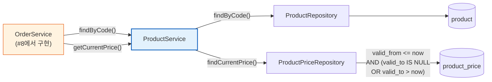
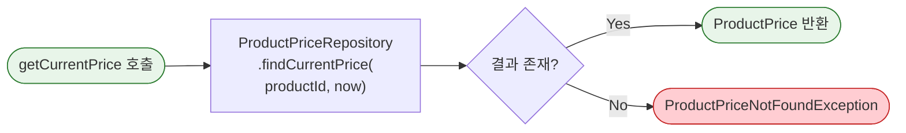

# [Ticket #7] Product 도메인 서비스 계층

## 개요
- TDD 참조: tdd.md 섹션 4.1.1, 4.2 (Product Context)
- 선행 티켓: #2 (JPA 엔티티), #5c (상품 시드 데이터)
- 크기: M

## 배경

Product 카탈로그의 **시드 데이터**는 #5c에서 완료되었고, **JPA 엔티티/Repository**는 #2에서 완료되었다. 이 티켓에서는 ProductService를 구현하여 상품 조회 + 현재 가격 조회 로직을 서비스 계층에서 제공한다.

이후 #8(OrderService)에서 주문 생성 시 `ProductService.getCurrentPrice()`를 호출하여 가격 스냅샷을 생성한다.

> **설계 원칙**: Product는 읽기 전용 카탈로그 도메인이므로 상태머신이 없다.
> 비즈니스 로직은 `Product` 엔티티의 `isAvailableForPurchase()` 등 조회 헬퍼 메서드로 캡슐화하고,
> ProductService는 조회 오케스트레이션 + 예외 변환만 담당한다.

---

## 작업 내용

### 전체 흐름



### getCurrentPrice 가격 조회 로직

가격은 `valid_from` / `valid_to` 범위 기반으로 관리된다. 동일 상품에 대해 시점별로 다른 가격이 존재할 수 있으며, **현재 유효한 가격**을 조회한다.



### Product 엔티티 (도메인 로직 캡슐화)

```kotlin
package com.greeting.payment.domain.product

import jakarta.persistence.*
import java.time.LocalDateTime

@Entity
@Table(name = "product")
@SQLRestriction("deleted_at IS NULL")
@SQLDelete(sql = "UPDATE product SET deleted_at = NOW(6) WHERE id = ?")
class Product(

    @Id
    @GeneratedValue(strategy = GenerationType.IDENTITY)
    val id: Long = 0,

    @Column(name = "code", nullable = false, unique = true)
    val code: String,

    @Column(name = "name", nullable = false)
    val name: String,

    @Column(name = "product_type", nullable = false)
    val productType: String,

    @Column(name = "is_active", nullable = false)
    val isActive: Boolean = true,

    @Column(name = "created_at", nullable = false, updatable = false)
    val createdAt: LocalDateTime = LocalDateTime.now(),

    @Column(name = "updated_at", nullable = false)
    var updatedAt: LocalDateTime = LocalDateTime.now(),

    @Column(name = "deleted_at")
    var deletedAt: LocalDateTime? = null,
) {

    // --- 도메인 로직: 엔티티 내부에 캡슐화 ---

    /**
     * 구매 가능 여부 판단.
     * 활성 상태이고 삭제되지 않은 상품만 구매 가능.
     */
    fun isAvailableForPurchase(): Boolean {
        return isActive && deletedAt == null
    }

    /**
     * 구매 가능 여부를 검증하고 불가 시 예외 발생.
     */
    fun validatePurchasable() {
        require(isAvailableForPurchase()) {
            "구매 불가능한 상품입니다: code=$code, isActive=$isActive"
        }
    }

    /**
     * ProductType enum 변환
     */
    fun resolveProductType(): ProductType {
        return ProductType.valueOf(productType)
    }
}
```

### ProductService 코드

```kotlin
package com.greeting.payment.application

import com.greeting.payment.domain.product.Product
import com.greeting.payment.domain.product.ProductPrice
import com.greeting.payment.domain.product.ProductType
import com.greeting.payment.infrastructure.repository.ProductPriceRepository
import com.greeting.payment.infrastructure.repository.ProductRepository
import org.springframework.stereotype.Service
import org.springframework.transaction.annotation.Transactional
import java.time.LocalDateTime

/**
 * ProductService는 얇은 서비스 — 조회 + 예외 변환만 담당.
 * 비즈니스 로직(구매 가능 여부 등)은 Product 엔티티 내부에 캡슐화.
 */
@Service
@Transactional(readOnly = true)
class ProductService(
    private val productRepository: ProductRepository,
    private val productPriceRepository: ProductPriceRepository,
) {

    fun findByCode(code: String): Product {
        return productRepository.findByCode(code)
            ?: throw ProductNotFoundException("상품을 찾을 수 없습니다: code=$code")
    }

    fun findActiveByType(productType: ProductType): List<Product> {
        return productRepository.findByProductTypeAndIsActiveTrue(productType.name)
    }

    fun getCurrentPrice(
        productId: Long,
        billingIntervalMonths: Int? = null,
        now: LocalDateTime = LocalDateTime.now(),
    ): ProductPrice {
        return productPriceRepository.findCurrentPrice(productId, billingIntervalMonths, now)
            ?: throw ProductPriceNotFoundException(
                "현재 유효한 가격이 없습니다: productId=$productId, billingInterval=$billingIntervalMonths"
            )
    }

    fun findById(productId: Long): Product {
        return productRepository.findById(productId).orElseThrow {
            ProductNotFoundException("상품을 찾을 수 없습니다: id=$productId")
        }
    }

    fun findAllActive(): List<Product> {
        return productRepository.findByIsActiveTrue()
    }
}
```

### ProductPriceRepository 쿼리

```kotlin
package com.greeting.payment.infrastructure.repository

import com.greeting.payment.domain.product.ProductPrice
import org.springframework.data.jpa.repository.JpaRepository
import org.springframework.data.jpa.repository.Query
import org.springframework.data.repository.query.Param
import java.time.LocalDateTime

interface ProductPriceRepository : JpaRepository<ProductPrice, Long> {

    @Query("""
        SELECT pp FROM ProductPrice pp
        WHERE pp.productId = :productId
          AND pp.validFrom <= :now
          AND (pp.validTo IS NULL OR pp.validTo > :now)
          AND (:billingIntervalMonths IS NULL OR pp.billingIntervalMonths = :billingIntervalMonths)
        ORDER BY pp.validFrom DESC
    """)
    fun findCurrentPrice(
        @Param("productId") productId: Long,
        @Param("billingIntervalMonths") billingIntervalMonths: Int?,
        @Param("now") now: LocalDateTime,
    ): ProductPrice?

    fun findByProductId(productId: Long): List<ProductPrice>
}
```

### ProductRepository 쿼리

```kotlin
package com.greeting.payment.infrastructure.repository

import com.greeting.payment.domain.product.Product
import org.springframework.data.jpa.repository.JpaRepository

interface ProductRepository : JpaRepository<Product, Long> {

    fun findByCode(code: String): Product?

    fun findByProductTypeAndIsActiveTrue(productType: String): List<Product>

    fun findByIsActiveTrue(): List<Product>
}
```

### 도메인 예외 클래스

```kotlin
package com.greeting.payment.domain.product

class ProductNotFoundException(message: String) : RuntimeException(message)

class ProductPriceNotFoundException(message: String) : RuntimeException(message)
```

### 수정 파일 목록

| 파일 | 변경 유형 | 설명 |
|------|----------|------|
| `domain/product/Product.kt` | 수정 | `isAvailableForPurchase()`, `validatePurchasable()`, `resolveProductType()` 도메인 메서드 추가 |
| `application/ProductService.kt` | 신규 | 얇은 서비스 — 조회 + 예외 변환 |
| `infrastructure/repository/ProductRepository.kt` | 수정 | findByCode, findByProductType 쿼리 추가 |
| `infrastructure/repository/ProductPriceRepository.kt` | 수정 | findCurrentPrice 쿼리 추가 |
| `domain/product/ProductNotFoundException.kt` | 신규 | 도메인 예외 |
| `domain/product/ProductPriceNotFoundException.kt` | 신규 | 도메인 예외 |

---

## 테스트 케이스

### 정상 케이스

| # | 테스트 | 입력 | 기대 결과 |
|---|--------|------|----------|
| 1 | `Product.isAvailableForPurchase` - 활성 상품 | isActive=true, deletedAt=null | true |
| 2 | `Product.validatePurchasable` - 비활성 상품 | isActive=false | IllegalArgumentException |
| 3 | `Product.resolveProductType` | productType="SUBSCRIPTION" | ProductType.SUBSCRIPTION |
| 4 | `findByCode` - 존재하는 상품 | code="PLAN_BASIC" | Product(code=PLAN_BASIC, type=SUBSCRIPTION) |
| 5 | `findActiveByType` - SUBSCRIPTION | type=SUBSCRIPTION | 플랜 상품 리스트 (BASIC, STANDARD, BUSINESS) |
| 6 | `findActiveByType` - CONSUMABLE | type=CONSUMABLE | SMS 팩 상품 리스트 |
| 7 | `getCurrentPrice` - 현재 유효 가격 | productId=1, now=현재 | 현재 valid_from/valid_to 범위 내 ProductPrice |
| 8 | `getCurrentPrice` - 구독 월간 가격 | productId=1, billingInterval=1 | 월간 구독 가격 |
| 9 | `getCurrentPrice` - 구독 연간 가격 | productId=1, billingInterval=12 | 연간 구독 가격 |
| 10 | `findAllActive` - 전체 활성 상품 | - | is_active=true인 전체 상품 목록 |

### 예외/엣지 케이스

| # | 테스트 | 입력 | 기대 결과 |
|---|--------|------|----------|
| 1 | `findByCode` - 존재하지 않는 상품 | code="INVALID" | ProductNotFoundException |
| 2 | `findByCode` - soft deleted 상품 | code="DELETED_PRODUCT" | ProductNotFoundException (SQLRestriction 필터) |
| 3 | `getCurrentPrice` - 과거 가격만 존재 | productId=1, now=미래 시점 | ProductPriceNotFoundException |
| 4 | `getCurrentPrice` - 미래 가격만 존재 | productId=1, now=과거 시점 | ProductPriceNotFoundException |
| 5 | `getCurrentPrice` - 비활성 상품 | productId=비활성상품 | ProductPrice 반환 (가격은 상품 활성 여부와 무관) |
| 6 | `findActiveByType` - 결과 없음 | type=ONE_TIME (등록 전) | 빈 리스트 |

---

## 그리팅 실제 적용 예시

### AS-IS (현재)
- **상품 정보가 코드에 하드코딩**: `Plan` enum(Free/Basic/Standard/Business)에 플랜 정보 고정, SMS 포인트 팩은 `MessagePointService`에서 수량/가격을 코드로 관리
- **가격 변경 시 코드 배포 필요**: 플랜 가격, SMS 팩 가격이 코드에 박혀있어 가격 정책 변경 = 코드 수정 + 배포
- **상품 유형별 조회 로직 분산**: 플랜 조회는 `PlanServiceImpl`, SMS 조회는 `MessagePointService`에서 각각 별도 로직

### TO-BE (리팩토링 후)
- **상품 정보가 DB로 관리**: `ProductService.findByCode("PLAN_BASIC")` 한 줄로 모든 상품 유형 통합 조회
- **가격 변경이 DB 업데이트로 해결**: `product_price` 테이블에 `valid_from`/`valid_to` 기반 이력 관리, 배포 없이 가격 변경 가능
- **통합 카탈로그 API**: `ProductService.findActiveByType(SUBSCRIPTION)` → 플랜 목록, `findActiveByType(CONSUMABLE)` → SMS/AI 크레딧 팩 목록

### 향후 확장 예시 (코드 변경 없이 가능)
- **AI 크레딧 100건 팩 추가**: `product` 테이블에 `AI_CREDIT_100` INSERT + `product_price` INSERT + `product_metadata`(credit_type=AI_EVALUATION, credit_amount=100) INSERT → `ProductService.findByCode("AI_CREDIT_100")` 즉시 사용 가능
- **프리미엄 리포트 상품 추가**: `product` 테이블에 `PREMIUM_REPORT` INSERT → 동일한 `ProductService` 조회 파이프라인으로 처리
- **연간 구독 가격 변경**: `product_price`에 새 행 INSERT(valid_from=변경일) → 기존 가격은 valid_to 설정 → 자동 전환, 코드 수정 없음

---

## 기대 결과 (AC)

- [ ] `Product` 엔티티에 `isAvailableForPurchase()`, `validatePurchasable()`, `resolveProductType()` 도메인 메서드가 캡슐화
- [ ] `ProductService`는 조회 + 예외 변환만 담당하고, 비즈니스 판단 로직을 포함하지 않음
- [ ] `ProductService.findByCode(code)` 호출 시 상품 코드로 단건 조회 가능
- [ ] `ProductService.findActiveByType(type)` 호출 시 상품 유형별 활성 목록 반환
- [ ] `ProductService.getCurrentPrice(productId, billingIntervalMonths)` 호출 시 현재 시점 유효 가격 반환
- [ ] 구독형 상품은 billingIntervalMonths로 월간/연간 가격을 구분하여 조회 가능
- [ ] 존재하지 않는 상품 코드/가격 조회 시 명확한 도메인 예외 발생
- [ ] Soft Delete된 상품은 조회 결과에서 자동 제외
- [ ] 단위 테스트: 정상 10건 + 예외 6건 = 총 16건 통과
