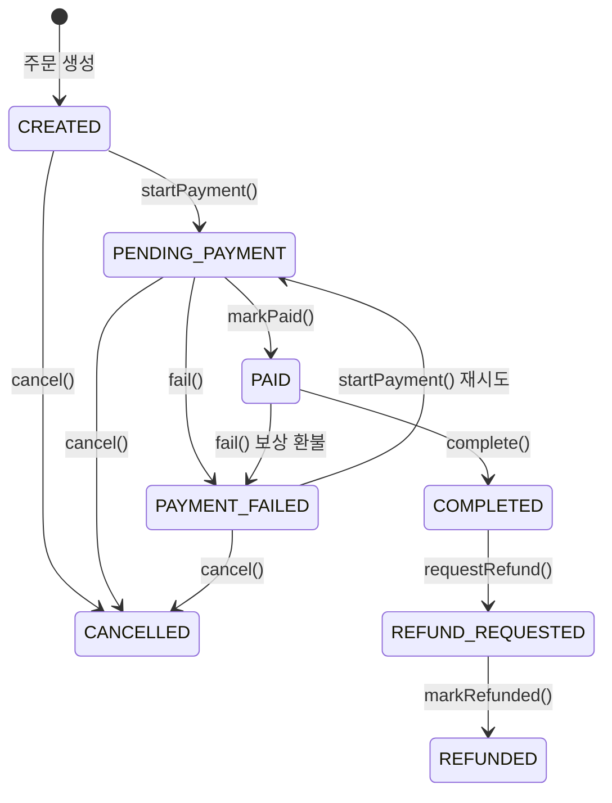

# [Ticket #8a] Order 엔티티 모델 + 상태머신

## 개요
- TDD 참조: tdd.md 섹션 3.1, 3.3, 4.1.2
- 선행 티켓: #2 (JPA 엔티티)
- 크기: M
- 원본: ticket-08_order-domain.md에서 분리

## 배경

Order-centric 아키텍처의 핵심 엔티티와 상태머신을 정의한다. **비즈니스 로직은 엔티티/enum 내부에 캡슐화**하는 원칙을 따른다.

- `OrderStatus` enum이 상태 전이 규칙을 **소유**한다
- `Order` 엔티티가 상태 전이 메서드를 **캡슐화**한다
- Service는 엔티티 메서드를 호출만 한다

> **설계 원칙 (CRITICAL)**:
> 1. `OrderStatus` enum이 `canTransitionTo()`, `validateTransitionTo()`로 전이 규칙을 내부에 캡슐화한다.
> 2. `Order` 엔티티가 `startPayment()`, `markPaid()`, `complete()`, `fail()`, `cancel()`, `requestRefund()`, `markRefunded()` 메서드를 캡슐화한다.
> 3. Service에 상태 전이 로직이 흩어지지 않는다.

---

## 작업 내용

### Order 상태머신



### OrderStatus enum (상태 전이 규칙을 enum이 소유)

```kotlin
package com.greeting.payment.domain.order

/**
 * OrderStatus enum이 상태 전이 규칙을 소유한다.
 *
 * Service에서 상태를 직접 검증하지 않고, enum.validateTransitionTo()를 호출.
 * 잘못된 전이 시 IllegalStateException 발생 — 방어 코드가 Service에 흩어지지 않는다.
 */
enum class OrderStatus {
    CREATED,
    PENDING_PAYMENT,
    PAID,
    COMPLETED,
    CANCELLED,
    REFUND_REQUESTED,
    REFUNDED,
    PAYMENT_FAILED;

    companion object {
        /**
         * 상태 전이 규칙 — enum 내부에서 관리.
         * companion object에 정의하여 enum 인스턴스 초기화 순서 문제를 회피.
         */
        private val ALLOWED_TRANSITIONS: Map<OrderStatus, Set<OrderStatus>> = mapOf(
            CREATED to setOf(PENDING_PAYMENT, CANCELLED),
            PENDING_PAYMENT to setOf(PAID, PAYMENT_FAILED, CANCELLED),
            PAID to setOf(COMPLETED, PAYMENT_FAILED),
            PAYMENT_FAILED to setOf(PENDING_PAYMENT, CANCELLED),
            COMPLETED to setOf(REFUND_REQUESTED),
            REFUND_REQUESTED to setOf(REFUNDED),
            REFUNDED to emptySet(),
            CANCELLED to emptySet(),
        )
    }

    fun canTransitionTo(next: OrderStatus): Boolean {
        return next in (ALLOWED_TRANSITIONS[this] ?: emptySet())
    }

    /**
     * 상태 전이 검증 — 불가능하면 즉시 예외.
     * Order 엔티티의 상태 전이 메서드 내부에서 호출된다.
     */
    fun validateTransitionTo(next: OrderStatus) {
        require(canTransitionTo(next)) {
            "주문 상태 전이 불가: $this -> $next"
        }
    }

    val isTerminal: Boolean
        get() = this == COMPLETED || this == CANCELLED || this == REFUNDED

    val isCancellable: Boolean
        get() = canTransitionTo(CANCELLED)
}
```

### OrderType enum

```kotlin
package com.greeting.payment.domain.order

enum class OrderType {
    NEW,          // 신규 주문
    RENEWAL,      // 구독 자동 갱신
    UPGRADE,      // 플랜 업그레이드
    DOWNGRADE,    // 플랜 다운그레이드
    PURCHASE,     // 소진형/일회성 구매
    REFUND,       // 환불 주문
}
```

### OrderNumberGenerator

```kotlin
package com.greeting.payment.domain.order

import java.time.LocalDate
import java.time.format.DateTimeFormatter
import java.util.UUID

object OrderNumberGenerator {

    private val DATE_FORMAT = DateTimeFormatter.ofPattern("yyyyMMdd")

    /**
     * 주문번호 생성: ORD-{yyyyMMdd}-{UUID 앞 8자리 대문자}
     * 예: ORD-20260501-A1B2C3D4
     */
    fun generate(): String {
        val datePart = LocalDate.now().format(DATE_FORMAT)
        val uuidPart = UUID.randomUUID().toString().replace("-", "").take(8).uppercase()
        return "ORD-$datePart-$uuidPart"
    }
}
```

### Order 엔티티 (비즈니스 로직을 엔티티 내부에 캡슐화)

```kotlin
package com.greeting.payment.domain.order

import com.greeting.payment.domain.product.Product
import com.greeting.payment.domain.product.ProductPrice
import com.greeting.payment.domain.product.ProductType
import jakarta.persistence.*
import java.time.LocalDateTime

@Entity
@Table(name = "`order`")
@SQLRestriction("deleted_at IS NULL")
@SQLDelete(sql = "UPDATE `order` SET deleted_at = NOW(6) WHERE id = ? AND version = ?")
class Order(

    @Id
    @GeneratedValue(strategy = GenerationType.IDENTITY)
    val id: Long = 0,

    @Column(name = "order_number", nullable = false, unique = true)
    val orderNumber: String = OrderNumberGenerator.generate(),

    @Column(name = "workspace_id", nullable = false)
    val workspaceId: Int,

    @Column(name = "order_type", nullable = false)
    @Enumerated(EnumType.STRING)
    val orderType: OrderType,

    @Column(name = "status", nullable = false)
    @Enumerated(EnumType.STRING)
    var status: OrderStatus = OrderStatus.CREATED,

    @Column(name = "total_amount", nullable = false)
    var totalAmount: Int = 0,

    @Column(name = "original_amount", nullable = false)
    var originalAmount: Int = 0,

    @Column(name = "discount_amount", nullable = false)
    var discountAmount: Int = 0,

    @Column(name = "credit_amount", nullable = false)
    var creditAmount: Int = 0,

    @Column(name = "vat_amount", nullable = false)
    var vatAmount: Int = 0,

    @Column(name = "currency", nullable = false)
    val currency: String = "KRW",

    @Column(name = "idempotency_key", unique = true)
    val idempotencyKey: String? = null,

    @Column(name = "memo")
    var memo: String? = null,

    @Column(name = "created_by")
    val createdBy: String? = null,

    @Column(name = "created_at", nullable = false, updatable = false)
    val createdAt: LocalDateTime = LocalDateTime.now(),

    @Column(name = "updated_at", nullable = false)
    var updatedAt: LocalDateTime = LocalDateTime.now(),

    @Column(name = "deleted_at")
    var deletedAt: LocalDateTime? = null,

    @Version
    @Column(name = "version", nullable = false)
    var version: Int = 0,

    @OneToMany(mappedBy = "order", cascade = [CascadeType.ALL], orphanRemoval = true)
    val items: MutableList<OrderItem> = mutableListOf(),
) {

    // =========================================================================
    // 상태 전이 메서드 — 모든 상태 변경은 반드시 이 메서드를 통해서만 수행.
    // OrderStatus.validateTransitionTo()가 규칙을 검증하고,
    // 엔티티가 부수 효과(시간 업데이트 등)를 캡슐화한다.
    // Service는 이 메서드를 호출만 한다.
    // =========================================================================

    fun startPayment() {
        status.validateTransitionTo(OrderStatus.PENDING_PAYMENT)
        this.status = OrderStatus.PENDING_PAYMENT
        this.updatedAt = LocalDateTime.now()
    }

    fun markPaid() {
        status.validateTransitionTo(OrderStatus.PAID)
        this.status = OrderStatus.PAID
        this.updatedAt = LocalDateTime.now()
    }

    fun complete() {
        status.validateTransitionTo(OrderStatus.COMPLETED)
        this.status = OrderStatus.COMPLETED
        this.updatedAt = LocalDateTime.now()
    }

    fun fail() {
        status.validateTransitionTo(OrderStatus.PAYMENT_FAILED)
        this.status = OrderStatus.PAYMENT_FAILED
        this.updatedAt = LocalDateTime.now()
    }

    fun cancel(reason: String? = null) {
        status.validateTransitionTo(OrderStatus.CANCELLED)
        this.status = OrderStatus.CANCELLED
        this.memo = reason
        this.updatedAt = LocalDateTime.now()
    }

    fun requestRefund() {
        status.validateTransitionTo(OrderStatus.REFUND_REQUESTED)
        this.status = OrderStatus.REFUND_REQUESTED
        this.updatedAt = LocalDateTime.now()
    }

    fun markRefunded() {
        status.validateTransitionTo(OrderStatus.REFUNDED)
        this.status = OrderStatus.REFUNDED
        this.updatedAt = LocalDateTime.now()
    }

    // =========================================================================
    // 주문 항목 관리 — 금액 재계산도 엔티티 내부에서 처리
    // =========================================================================

    fun addItem(item: OrderItem) {
        items.add(item)
        recalculateAmounts()
    }

    private fun recalculateAmounts() {
        this.originalAmount = items.sumOf { it.totalPrice }
        this.totalAmount = originalAmount - discountAmount - creditAmount
        this.vatAmount = (totalAmount * 10) / 110  // VAT 포함 역산
    }

    // =========================================================================
    // 조회 헬퍼 — 엔티티 내부에 캡슐화
    // =========================================================================

    val productType: String
        get() = items.firstOrNull()?.productType
            ?: throw IllegalStateException("주문 항목이 없습니다: orderNumber=$orderNumber")

    fun resolveProductType(): ProductType = ProductType.valueOf(productType)

    val isTerminal: Boolean
        get() = status.isTerminal

    /**
     * 상태 이력 생성용 — 이전 상태와 현재 상태로 이력 객체를 생성한다.
     */
    fun createStatusHistory(
        fromStatus: OrderStatus?,
        changedBy: String? = null,
        reason: String? = null,
    ): OrderStatusHistory {
        return OrderStatusHistory(
            orderId = this.id,
            fromStatus = fromStatus?.name,
            toStatus = this.status.name,
            changedBy = changedBy,
            reason = reason,
        )
    }
}
```

### OrderItem 엔티티 (가격 스냅샷)

```kotlin
package com.greeting.payment.domain.order

import com.greeting.payment.domain.product.Product
import com.greeting.payment.domain.product.ProductPrice
import jakarta.persistence.*
import java.time.LocalDateTime

@Entity
@Table(name = "order_item")
class OrderItem(

    @Id
    @GeneratedValue(strategy = GenerationType.IDENTITY)
    val id: Long = 0,

    @ManyToOne(fetch = FetchType.LAZY)
    @JoinColumn(name = "order_id", nullable = false)
    val order: Order,

    @Column(name = "product_id", nullable = false)
    val productId: Long,

    /** 주문 시점 스냅샷 — 상품 변경과 무관하게 보존 */
    @Column(name = "product_code", nullable = false)
    val productCode: String,

    @Column(name = "product_name", nullable = false)
    val productName: String,

    @Column(name = "product_type", nullable = false)
    val productType: String,

    @Column(name = "quantity", nullable = false)
    val quantity: Int = 1,

    @Column(name = "unit_price", nullable = false)
    val unitPrice: Int,

    @Column(name = "total_price", nullable = false)
    val totalPrice: Int,

    @Column(name = "created_at", nullable = false, updatable = false)
    val createdAt: LocalDateTime = LocalDateTime.now(),
) {

    companion object {
        /**
         * Product + ProductPrice로 가격 스냅샷 생성.
         * 주문 시점의 상품 정보를 불변으로 기록한다.
         */
        fun createSnapshot(
            order: Order,
            product: Product,
            price: ProductPrice,
            quantity: Int = 1,
        ): OrderItem {
            return OrderItem(
                order = order,
                productId = product.id,
                productCode = product.code,
                productName = product.name,
                productType = product.productType,
                quantity = quantity,
                unitPrice = price.price,
                totalPrice = price.price * quantity,
            )
        }
    }
}
```

### 수정 파일 목록

| 파일 | 변경 유형 | 설명 |
|------|----------|------|
| `domain/order/OrderStatus.kt` | 신규 | 상태 enum: `validateTransitionTo()`, `canTransitionTo()`, `isTerminal`, `isCancellable` |
| `domain/order/OrderType.kt` | 신규 | 주문 유형 enum |
| `domain/order/Order.kt` | 수정 | `startPayment()`, `markPaid()`, `complete()`, `fail()`, `cancel()`, `requestRefund()`, `markRefunded()`, `resolveProductType()`, `createStatusHistory()` |
| `domain/order/OrderItem.kt` | 수정 | createSnapshot 팩토리 메서드 추가 |
| `domain/order/OrderNumberGenerator.kt` | 신규 | 주문번호 생성 |
| `domain/order/OrderStatusHistory.kt` | 기존 (#2) | 변경 없음 |

---

## 테스트 케이스

### 정상 케이스

| # | 테스트 | 입력 | 기대 결과 |
|---|--------|------|----------|
| 1 | `OrderStatus.validateTransitionTo` - CREATED -> PENDING_PAYMENT | | 성공 (예외 없음) |
| 2 | `OrderStatus.isTerminal` | COMPLETED, CANCELLED, REFUNDED | true |
| 3 | `OrderStatus.isCancellable` | CREATED, PENDING_PAYMENT, PAYMENT_FAILED | true |
| 4 | `Order.startPayment` | CREATED 상태 Order | status = PENDING_PAYMENT, updatedAt 갱신 |
| 5 | `Order.cancel` | CREATED 상태 Order, reason="사유" | status = CANCELLED, memo = "사유" |
| 6 | `Order.addItem` + `recalculateAmounts` | OrderItem 추가 | originalAmount, totalAmount, vatAmount 재계산 |
| 7 | `Order.createStatusHistory` | fromStatus=CREATED | OrderStatusHistory(orderId, fromStatus, toStatus) |
| 8 | `OrderNumberGenerator` - 형식 | - | "ORD-yyyyMMdd-XXXXXXXX" 패턴 매칭 |

### 예외/엣지 케이스

| # | 테스트 | 입력 | 기대 결과 |
|---|--------|------|----------|
| 1 | `OrderStatus.validateTransitionTo` - CREATED -> COMPLETED | | IllegalArgumentException |
| 2 | `OrderStatus.validateTransitionTo` - CANCELLED -> PAID | | IllegalArgumentException |
| 3 | `OrderStatus.validateTransitionTo` - REFUNDED -> 모든 상태 | | IllegalArgumentException (terminal) |
| 4 | `Order.cancel` - COMPLETED 상태 | | IllegalArgumentException |
| 5 | `Order.complete` - CREATED 상태 (PAID 거치지 않음) | | IllegalArgumentException |
| 6 | 낙관적 락 충돌 | 동시 processOrder | OptimisticLockException |
| 7 | 상태 전이 전수 검증 | 모든 8 x 8 상태 조합 | `canTransitionTo` 정확히 일치 |

---

## 기대 결과 (AC)

- [ ] `OrderStatus` enum이 상태 전이 규칙을 소유하고, `validateTransitionTo()`로 검증 (Service에 전이 로직 없음)
- [ ] `Order` 엔티티가 `startPayment()`, `markPaid()`, `complete()`, `fail()`, `cancel()`, `requestRefund()`, `markRefunded()` 상태 전이 메서드를 캡슐화
- [ ] `OrderNumberGenerator`가 `ORD-{yyyyMMdd}-{UUID 8chars}` 형식의 고유 번호 생성
- [ ] `OrderItem.createSnapshot()`이 주문 시점 가격 스냅샷을 생성
- [ ] `Order.addItem()` 호출 시 `recalculateAmounts()` 자동 실행
- [ ] `Order.createStatusHistory()`로 상태 이력 생성
- [ ] 단위 테스트: 정상 8건 + 예외 7건 = 총 15건 통과
