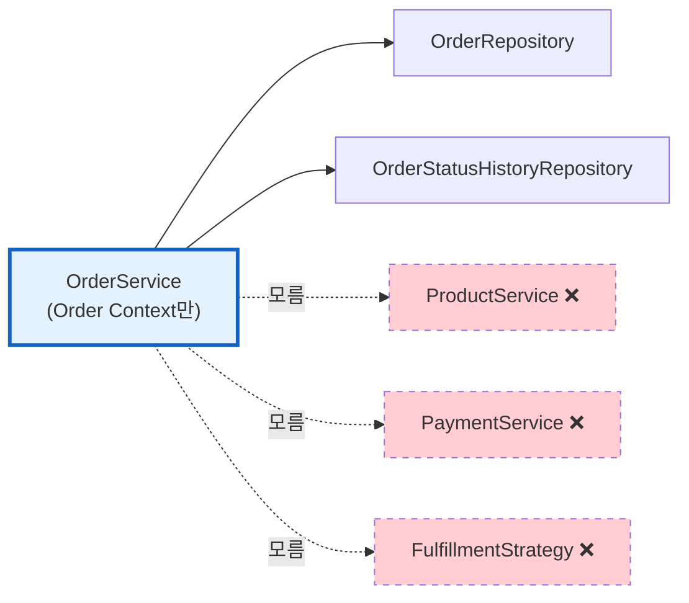

# [Ticket #8c] OrderService (Order Bounded Context)

## 개요
- TDD 참조: tdd.md 섹션 4.2
- 선행 티켓: #8a (Order 엔티티)
- 크기: M

## 핵심 원칙

**OrderService는 Order Bounded Context만 담당한다. Product, Payment, Fulfillment를 알지 못한다.**



---

## 작업 내용

### OrderService 메서드 목록

| 메서드 | 역할 | 엔티티 메서드 호출 |
|--------|------|-----------------|
| `createOrder()` | 주문 생성 (Product/Price는 파라미터로 받음) | `Order()`, `order.addItem()` |
| `startPayment()` | CREATED → PENDING_PAYMENT | `order.startPayment()` |
| `markPaid()` | PENDING_PAYMENT → PAID | `order.markPaid()` |
| `complete()` | PAID → COMPLETED | `order.complete()` |
| `fail()` | → PAYMENT_FAILED | `order.fail()` |
| `cancel()` | → CANCELLED | `order.cancel(reason)` |
| `findById()` | 조회 | - |
| `findByOrderNumber()` | 조회 | - |
| `findActiveSubscription()` | Fulfillment 결과물 조회 | - |
| `getCreditBalance()` | Fulfillment 결과물 조회 | - |

### 코드 예시

```kotlin
/**
 * Order Bounded Context만 담당.
 * Product, Payment, Fulfillment를 알지 못한다.
 * 도메인 간 협력은 OrderFacade(#8d)가 수행.
 */
@Service
class OrderService(
    private val orderRepository: OrderRepository,
    private val orderStatusHistoryRepository: OrderStatusHistoryRepository,
    // Fulfillment 결과물 조회용 (Order Context 하위)
    private val subscriptionRepository: SubscriptionRepository,
    private val creditBalanceRepository: CreditBalanceRepository,
) {
    /** 주문 생성. Product/Price는 Facade가 조회해서 전달한다. */
    @Transactional
    fun createOrder(
        workspaceId: Int,
        orderType: OrderType,
        product: Product,
        price: ProductPrice,
        quantity: Int = 1,
        idempotencyKey: String? = null,
        createdBy: String? = null,
    ): Order {
        idempotencyKey?.let { key ->
            orderRepository.findByIdempotencyKey(key)?.let { return it }
        }

        val order = Order(
            workspaceId = workspaceId,
            orderType = orderType,
            idempotencyKey = idempotencyKey,
            createdBy = createdBy,
        )
        order.addItem(OrderItem.createSnapshot(order, product, price, quantity))

        val saved = orderRepository.save(order)
        recordHistory(saved, fromStatus = null, changedBy = createdBy)
        return saved
    }

    @Transactional
    fun startPayment(order: Order): Order {
        val prev = order.status
        order.startPayment()
        recordHistory(order, prev)
        return orderRepository.save(order)
    }

    @Transactional
    fun markPaid(order: Order): Order {
        val prev = order.status
        order.markPaid()
        recordHistory(order, prev)
        return orderRepository.save(order)
    }

    @Transactional
    fun complete(order: Order): Order {
        val prev = order.status
        order.complete()
        recordHistory(order, prev)
        return orderRepository.save(order)
    }

    @Transactional
    fun fail(order: Order, reason: String): Order {
        val prev = order.status
        order.fail()
        recordHistory(order, prev, reason = reason)
        return orderRepository.save(order)
    }

    @Transactional
    fun cancel(orderId: Long, reason: String? = null): Order {
        val order = findById(orderId)
        val prev = order.status
        order.cancel(reason)
        recordHistory(order, prev, reason = reason)
        return orderRepository.save(order)
    }

    fun findById(orderId: Long): Order =
        orderRepository.findById(orderId).orElseThrow { OrderNotFoundException(orderId) }

    fun findByOrderNumber(orderNumber: String): Order =
        orderRepository.findByOrderNumber(orderNumber) ?: throw OrderNotFoundException(orderNumber)

    /** Fulfillment 결과물 조회 (Order Context 하위) */
    fun findActiveSubscription(workspaceId: Int): Subscription? =
        subscriptionRepository.findByWorkspaceIdAndStatus(workspaceId, SubscriptionStatus.ACTIVE.name)

    fun getCreditBalance(workspaceId: Int, creditType: String): Int =
        creditBalanceRepository.findByWorkspaceIdAndCreditType(workspaceId, creditType)?.balance ?: 0

    private fun recordHistory(order: Order, fromStatus: OrderStatus?, reason: String? = null, changedBy: String? = null) {
        orderStatusHistoryRepository.save(order.createStatusHistory(fromStatus, reason, changedBy))
    }
}
```

### 수정 파일 목록

| 레포 | 파일 경로 | 변경 유형 |
|------|----------|----------|
| greeting_payment-server | application/OrderService.kt | 신규 |
| greeting_payment-server | domain/order/OrderNotFoundException.kt | 신규 |

## 테스트 케이스

### 정상 케이스
| ID | 테스트명 | Given | When | Then |
|----|---------|-------|------|------|
| TC-01 | createOrder | Product, Price 전달 | createOrder() | Order(CREATED) + OrderItem + 이력 1건 |
| TC-02 | startPayment | Order(CREATED) | startPayment() | Order(PENDING_PAYMENT) + 이력 |
| TC-03 | markPaid | Order(PENDING_PAYMENT) | markPaid() | Order(PAID) + 이력 |
| TC-04 | complete | Order(PAID) | complete() | Order(COMPLETED) + 이력 |
| TC-05 | fail | Order(PAID) | fail("사유") | Order(PAYMENT_FAILED) + 이력 |
| TC-06 | cancel | Order(CREATED) | cancel("사유") | Order(CANCELLED) + 이력 |
| TC-07 | 멱등성 키 중복 | 동일 idempotencyKey | createOrder() 2회 | 기존 Order 반환 |
| TC-08 | findActiveSubscription | ACTIVE 구독 존재 | 조회 | Subscription 반환 |
| TC-09 | getCreditBalance | SMS 잔액 1000 | 조회 | 1000 반환 |

### 예외/엣지 케이스
| ID | 테스트명 | Given | When | Then |
|----|---------|-------|------|------|
| TC-E01 | 의존성 확인: ProductService 없음 | OrderService DI | 확인 | ProductService 미주입 |
| TC-E02 | 의존성 확인: PaymentService 없음 | OrderService DI | 확인 | PaymentService 미주입 |
| TC-E03 | 잘못된 상태 전이 | Order(COMPLETED) | startPayment() | IllegalStateException |
| TC-E04 | 존재하지 않는 주문 | id=999 | findById() | OrderNotFoundException |

## 기대 결과 (AC)
- [ ] OrderService는 OrderRepository, OrderStatusHistoryRepository, SubscriptionRepository(조회), CreditBalanceRepository(조회)만 의존
- [ ] ProductService, PaymentService, FulfillmentStrategy를 의존하지 않음
- [ ] 모든 상태 전이가 엔티티 메서드를 통해 수행됨
- [ ] 모든 상태 변경에 이력이 자동 기록됨
